# 随机存取存储器计算机组成原理

## 第一章 概述

- 计算机系统由**硬件**和**软件**两部分组成。
  - 硬件：物理装置，看得见的都计算机硬件
  - 软件：运行在硬件上的**程序、数据**以及相关文档。
  - 程序：是指挥计算机如何操作的一个**指令序列**，也就是说程序是由**指令组成**的
  - 指令：计算机硬件能够**直接理解并执行**的最基本的**操作**。（完成某一功能！！）
  - 数据：指令操作的对象！（**操作数**）


> 1.1计算机硬件的基本组成

- 冯.诺依曼结构基本思想
  - **存储程序**：称为**冯.诺依曼**结构计算机具有的特征
- 冯.诺依曼基本思想：
  - **存储程序工作方式**
    - 事先把编好的程序（指令）和数据存储在主存储器中，启动后再从主存取出指令和数据来自动的执行。
  - 硬件5大部分：**运算器、控制器、主存储器、I/O设备（输入设备、输出设备）**
  - 主存储器存放**数据和指令**的
  - 用二进制表示**指令和数据**，指令序列-程序
  - 冯诺依曼结构计算机的基本组成
    - 


- 现代计算机的基本组成
- 现代计算机的硬件主要包括：**中处处理器、存储器、外部设备（输入/输出设备）和各类总线**
- **中央处理器**：简称CPU，是整个计算机的核心部件，主要用于指令执行，是最主要的部件。
  - CPU主要包括两个基本部分**数据通路**和**控制器**，
  - 数据通路是指指令执行过程中**数据所流经的部件**，基本包括各类**运算部件**，最重要的运算部件是算术逻辑部件ALU，ALU中最基本的是加法器；
  - **控制器**是对指令进行**译码**，生成相应的控制信号，以控制数据通路进行特定操作；
- 存储器分为**内存**和**外存**
  - 内存包括**主存储器**和**高速缓冲存储器cache**，一般情况下，内存和cache都为主存储器，插在主板上的**内存条**是主存的一部分；
  - **外存**包括辅助存储器和海量后备存储器，通过把运行时直接和主存交换信息的存储器称为辅助存储器，辅助存储器主要是磁盘和固态硬盘
  - 磁带和光盘主要用于备份和脱机存档用；
- **外部设备**也称为I/O设备，即是**输入输出设备**
  - 每个外设都需要相应的控制逻辑，通常将控制外设工作的控制逻辑称为I/O控制器或I/O适配器；外设通过I/O控制器连接到主机上，称为设备控制器，在个人计算机上一般称为XX卡等名称。
  - **总线**是传输2信息的通路，用于部件之间传输信息，CPU、主存和I/O模块通过总线互连；


> 1.2 计算机软件概述

- 计算机的工作由存储在其内部的**程序控制**，这是冯.诺依曼结构计算机的“存储程序”工作方式的重要特征，因此，程序或软件质量的好坏将影响计算机性能的发挥；
- 软件发展的过程大致可分为三个阶段：
  - **机器代码程序**出现到实用高级语言出现为第一阶段；以CPU为中心，**机器语言**编程
  - 从实用的高级程序设计到软件工程概念出现以前称为第二阶段；**存储器为中心**，**高级语言**编程：出现“软件危机”---产生出“软件工程”
  - 软件工程出现以后至今处于第三阶段；


- 根据软件的用途，一般将软件分成**系统软件**和**应用软件**两大类：
  - **系统软件**包括为有效、安全地**使用和管理**计算机（系统）以及为开发和运行应用软件提供支持的各种软件，**介于计算机硬件与应用程序之间**，它与具体的应用关系不大；
  - 系统软件包括**操作系统、语言处理系统、数据库管理系统和各类实用（碎片整理等）程序**
  - **应用软件**是**专门为**数据处理、科学计算、事务管理、多媒体处理、工程设计以及过程控制等**应用所编写**的各类程序；


> 1.3 计算机系统的层次结构
>
> 1.3.1 计算机系统抽象层的转换

- 计算机系统是一个**层次结构系统**，通过向上层用户提供一个抽象的简洁接口（界面）而将较低层次的实现细节隐藏起来
  - 

- 图描述了从最终用户希望计算机完成的应用(问题)到电子工程师使用器件完成基本电路设计的整个转换过程；
- 希望计算机完成一个应用最开始形成时是用自然语言描述的，需要将其转换为计算机硬件理解和执行的机器语言，这个过程需要经过多层的抽象转换；
- 即是多次转换才能完成一个开发任务。
- 首先要将应用问题转化为**算法**描述，使得应用问题的求解变成流程化的清晰步骤，并确保步骤是有限的；
- 再次，将算法转换为用**编程语言**描述的**程序**，这个转换通常是程序手工进行的，也就是程序员根据算法来编写程序；
- 最后，需要将高级语言程序转换成计算机能够理解的**机器语言**，这个转换过程是计算机自动完成的，因而需要有能够执行自动转换的程序，这种对程序进行编辑、转换并链接的软件统称为**语言处理系统**；


- 其中的编程语言可以分为**高级语言**和**低级语言**两类：
  - **高级语言**与计算机结构关联不大，是机器无关语言，通常大部分编程语言都是高级语言；
  - **低级语言**与底层计算机结构密切相关，通常称为**机器级语言，汇编语言和机器语言**都是低级语言；
  - **机器语言**就是用**二进制**进行编码的机器指令，是计算机硬件可以直接识别的语言；
  - **汇编语言**是用符号和二进制编码对应的语言；


- 其中的语言处理系统都包含一个翻译程序，即是将一种编程语言表示的程序转换为等价的另一种编程语言程序；
  - 被翻译的程序为源程序，翻译生成的程序称为目标程序，翻译程序有三类：
  - 汇编程序：用来将汇编语言翻译成机器语言
  - 解释程序：将源程序的语句按其执行顺序逐条进行解释并转换为机器指令执行
  - 编译程序：将高级语言翻译成汇编语言或机器语言的目标程序


- 从应用问题到机器语言程序的每次转换所涉及的概念都是属于软件范畴，而机器程序所运行的计算机硬件和软件之间需要一个桥梁，这个软件与硬件之间的界面就是**指令集体系结构ISA**，简称体系结构或系统结构；
- ISA定义了一台计算机可以**执行的所有指令集合**，每条指令规定了计算机执行什么操作，以及所处理的操作数存放的地址空间和操作数类型；


- 机器语言程序就是一个**ISA规定的指令系列**，计算机硬件执行机器语言程序的过程就是让其执行一条一条指令的过程；
- ISA是对指令系统的一种规定和结构规范，具体实现的组织称为**微体系结构**，与ISA不同，微体系结构是软件不可感知的部分；
- 微体系结构最终是由逻辑电路实现的；而每个基本的逻辑电路都是按照器件技术实现的；
- 计算机组成原理的教学内容主要是**指令集体系结构**和**微体系结构**层次；


> 1.3.2不同用户所在的工作层次

- 按完成任务不同，计算机用户分为四类用户：
  - **最终用户**：使用应用程序完成特定任务的计算机用户称为最终用户，最终用户能感知到的只是系统提供的**简单人机交互界面**和安装在计算机中的相关应用程序；
  - **系统管理员**：是利用操作系统等软件提供的功能**对系统**进行配置、管理和维护，以建立高效合理的系统环境供计算机用户使用的操作人员；系统管理员能感知到的是系统中部分硬件层面、系统管理层面以及相关的实用程序和人机交互界面；
  - **应用程序员**：是使用高级编程语言**编制应用软件**的程序员；程序员所看到的计算机系统除了计算机硬件、操作系统提供的应用编程接口API、人机交互界面和实用程序外，还包括相应的程序语言处理系统；
  - **系统程序员**：是**设计和开发系统软件**的程序员；系统程序员开发系统软件时，需要熟悉计算机底层相关硬件和系统结构，甚至可能需要直接与计算机硬件和指令系统打交道；
  - 计算机用户工作所在的系统结构层
    - 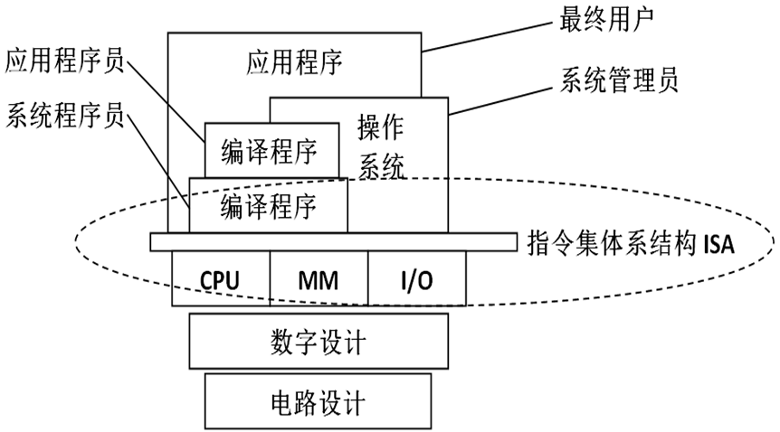
  - 从上图可以看出，ISA处于硬件和软件的交界面上，硬件的所有功能被抽象成一个指令集体系结构，因此，硬件功能由ISA集中体现，软件中的程序代码由ISA规定的指令组成，通过CPU执行一条一条指令来完成程序的执行；
  - 所以ISA是整个计算机系统的核心部分；计算机组成原理课程的主要内容就是图中虚线所示部分，主要围绕ISA展开；
  - ISA层下面是**硬件部分**，上面的**软件部分**。


> 1.4 程序开发与执行过程
>
> 1.4.1 从源程序到可执行目标程序

- 以C语言程序为例，

  - 源程序名为hello.c

    - ```C
      #include <stdio.h>
      int main()
      {
           printf(“hello  world! \n”);
      }
      ```

  - 为了让计算机能够执行应用程序，应用程序员应按照以下步骤进行处理：

    - 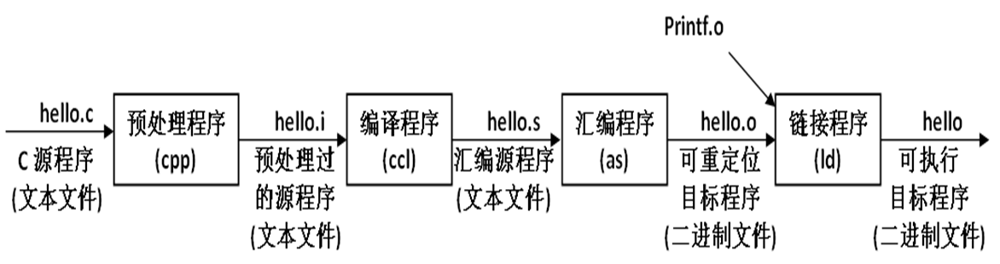


> 1.4.2 冯诺依曼结构模型机

- 冯诺依曼结构模型机
  - 
  - 冯.诺依曼结构模型机中，CPU内部部件如下：
    - **算术逻辑部件**ALU用于进行算术和逻辑运算；
    - **通用寄存器**用于存放操作数或操作数的地址，由多个寄存器组成，每个寄存器有编号；
    - **标志寄存器**用来存放ALU运算得到的标志信息；
    - **程序计数器**存放要执行的一下条指令的**地址**；
    - **指令寄存器**存放从主存读出的(要执行)指令，指令中的操作码被送到控制器进行译码，以生成控制信号：控制PC的地址修改、ALU执行的操作、主存的读写操作等；
  - 模型机中
    - **主存储器**用来存储**指令和操作数**，每个存储单元都有一个编号，称为主存地址；
    - CPU可以读取主存储器中的指令和操作数，也可以将运算结果写入/存入**主存储器**；
    - CPU和主存储器之间通过一组总线相连，总线中有**地址、控制和数据**三组信号线；
    - CPU和主存构成计算机组成系统的主机，主机外部的输入设备和输出设备通过相应的方式与主机相连；
    - CPU中的存储器**地址寄存器MAR**用来存放将要操作(读或写)的主存储器的地址，
    - CPU中的存储器**数据寄存器MDR**用来存放CPU与主存交换(读或写)的数据或指令，
    - 读写操作由控制信号线中的**读/写信号线**决定；
    - CPU需要读写存储器时，**先**要将所访问的指令或操作数的主存**地址送**到MAR，再送到地址总线上，并将”读命令”或”写命令”信号送到控制线上，再利用MDR接收或送出数据。

> 如果是指令就放在指令寄存器，如果是数据在通过数据寄存器放在通用寄存器组进行运算

> 1.4.3 程序与指令的关系

- 可执行目标文件中包含**机器代码段**，可执行文件的执行实际上是所包含的机器代码段的执行过程；
- 机器代码段由一条条**机器指令构成**，程序被启动后，CPU逐条执行程序中的指令来实现程序的功能：
  - 指令是用0和1表示的序列，用来指示CPU完成一个特定的基本操作，有取数指令、存数指令、ALU指令等；
  - 指令通常划分为若干段：**操作码段**和**地址码段**；
  - 高级语言到机器指令的不同层次语言的描述及转换
    - 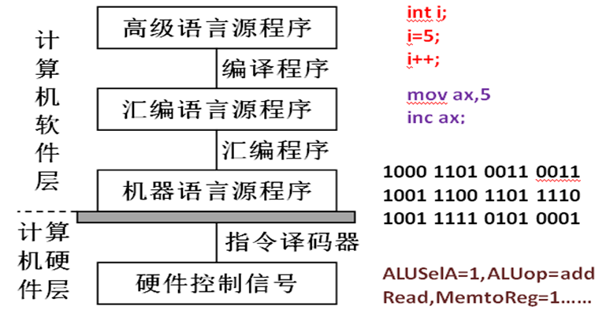


> 1.4.4 指令的执行过程

- 冯.诺依曼采用”**存储程序**”的工作方式，即是程序的指令序列以及程序的操作数都事先被存放在主存储器中；程序的第一条指令的地址**放在PC寄存器中**，程序启动后，自动执行：
  - 第一步：根据PC的地址，取指令到IR寄存器（指令寄存器）；
  - 第二步：根据IR中的操作码部分，对指令的操作码进行译码并送出控制信号产生后续操作信号；
  - 第三步：取操作数；根据不同地址寻找方式，找操作数
  - 第四步：指令执行；什么指令就执行什么操作
  - 第五步：回写结果；存到寄存器或主存储器


- 为了能够自动执行，CPU必须能够自动得到下一条指令的地址并送到PC，不管是定长还是变长的指令系统，当一条指令执行结束时，**PC中一定是下条指令在主存储器中的地址**；
- CPU执行指令需要若干过程，每一步功能都由相应的操作来完成：
- **指令周期**：取一条指令并执行指令的时间；
- **时钟周期**：毎条指令的执行都包含不同的操作，操作需要的信号为主脉冲信号或时钟信号0，其宽度(时间)为**时钟周期**；
- 每条指令的执行由时钟信号进行定时，一个指令周期包含一个或多个时钟周期（与指令类型与机器有关），频率的倒数就是周期就是时钟周期；


### 计算机系统性能评价

> 1.5 计算机系统性能评价
>
> 1.5.1 计算机性能的定义，必考

- **吞吐率**和**响应时间**是考量**计算机系统性能**的两个基本指标。
  - **吞吐量**：单位时间完成的工作量，也称带宽
  - **响应时间**：称为执行时间、等待时间，指从作业提交开始到作业完成所用时间。
  - 通常情况下，一个程序的响应时间除了程序包含的指令的执行时间外，还包括磁盘访问时间、存储器访问时间、输入输出操作所需时间以及操作系统运行的额外开销等；
  - 不同应用场合计算机用户关系的性能是不同的

> 1.5.2 用CPU执行时间进行性能评估

- 比较计算机的性能，大都用**执行时间**来衡量，通常把用户感觉的执行时间分为**CPU时间**和**其他时间**；
  - **CPU时间**是指CPU程序执行的时间，又分为**用户CPU时间**和**系统CPU时间**；
    - **用户CPU时间**是指真正用于**运行用户程序代码的时间**；
    - **系统CPU时间**是为了执行用户程序而需要CPU**运行操作系统程序的时间**；
  - 其他时间是等待IO操作完成或执行其他用户程序的时间;
- CPU性能指是的用户CPU时间，即只包括运行用户代码的时间；有以下概念：
  - 1、**时钟周期**：时钟信号宽度（时间），T=1/f
  - 2、**时钟频率**：就是CPU的主频：f=1/T
  - 3、**CPI**：表示执行一条指令所需的时钟周期数。
    - 程序由很多指令组成，而每个指令的CPI是不一样的！**一般取平均值**，称为**综合CPI**。
    - CPU执行时间 = 程序所含时钟周期数÷时钟频率
    - CPU执行时间 = 程序所含时钟周期数×时钟周期
- 根据CPI的概念可得到：
- 程序所含时钟周期数=程序所含指令条数×CPI
  - 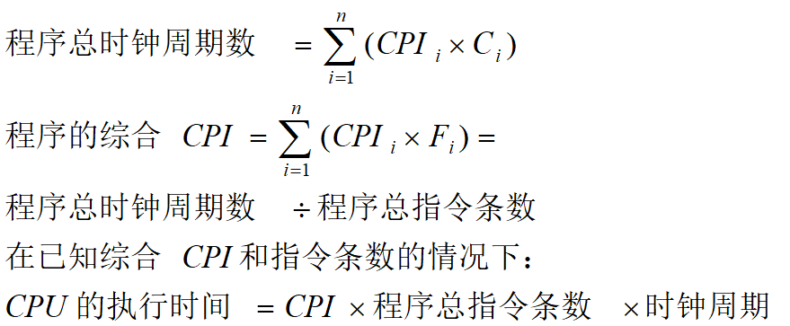
- `CPU执行时间=程序总指令条数×CPI×时钟周期`
- 有了CPU执行时间，就是评判两台计算机的性能的好坏，计算机的性能可以看成是CPU时间的倒数，因此，两台计算机性能之比就是CPU时间之比的倒数
- CPU时间度量公式中的**时钟周期**、**指令条数**和**综合CPI**三个因素是相互制约的；
- 对于解决同一问题的不同程序，即使在同一台计算机上，指令条数最少的程序也不一定执行速度最快；


> 例1.1
>
> 假设某个频繁使用的程序P在机器M1上运行需要10 s，M1的时钟频率是2GHz。
> 设计人员想开发一台与M1相同的新机器M2。采用新技术可使M2的时钟频率增加，但同时也会使CPI增加。
> 假定程序P在M2上执行的时钟周期数是M1上的1.5倍，则M2的时钟频率至少达到多少才能使程序P在M2上的运行时间缩短为6 s?
>
> 解：M1执行时间10秒，时钟频率是2GHz，根据公式可得时钟周期是`1/2GHz`
>
> M1：`CPU执行时间=程序总指令条数 * CPI * 时钟周期=10S`
>
> `10S=程序总指令条目 * CPI * (1/2GHz)`
>
> `10S=程序的总时钟周期数 * (1/2GHz)`
>
> 程序的总时钟周期数 = 10 / (1/2GHz) = 20GHz
>
> M2：执行时间6秒，时钟周期数是M1的1.5倍
>
> `CPU执行时间=程序总指令条数×CPI×时钟周期=6S`
>
> `6S=程序总指令条目 * 1.5 * CPI * (1/f)`
>
> 求?号是多少
>
> `6S = 20G * 1.5 * (1/f)`
>
> `6S=30G*(1/f)`
>
> 结果：?=5G

> 例1.2
>
> 假设计算机M的指令集中包括A、B、C三类指令，其CPI分别是1，2，4。
> 某个程序P分别在M上被编译成两个不同目标代码序列P1和P2，P1所含A、B、C三类指令的条数分别为8、2、2； P2所含A、B、C三类指令的条数分别为2、5、3。
> 请问：哪个代码序列指令条数最少？哪个执行速度快？它们的CPI(综合CPI)分别是多少？以及MIPS是多少？
>
> P1指令条目是12，P2是10，因此`P2代码序列指令条数最少`
>
> P1的：`8*1 + 2*2 + 2*4=20`
>
> P2的：`2*1 + 5*2 + 3*4=24`
>
> 结果：`因为在一台机器上，时钟周期相同，所以P1需要的时钟周期数目少，执行速度快`
>
> 平均CPI：
>
> P1：`20/12≈1.67（时钟周期）`
>
> P2：`24/10=2.4（时钟周期）`
>
> MIPS：平均每秒执行多少百万(10^6)条指令
>
> CPU执行时间**求倒数**就可以得到MIPS

> 例1.3
>
> 假设某程序P编译后生成的目标代码由A，B，C，D四类指令组成，它们在程序中所占比例分别为43%、21%、12%、24%，已知它们的CPI分别为1、2、2、2。现重新对程序P进编译优化，生成的新目标代码中A类指令条数减少了50%，其他类指令条数没有应对，请回答以下问题:
>
> 编译优化前后程序的CPI（时钟周期数）各是多少?
>
> 假定程序在一台主频为50MHz的计算机上运行-则优化前后的MIPS各是多少?
>
> 优化前综合CPI：`43%*1 + 21%*2 + 12%*2 + 24%*2 =1.57 `
>
> 优化后的，A减少50%，意思是A少了50%就是21.5%
>
> A：21.5；B：21，C：12；D：24。
>
> **这里是整个程序占用的比例，不能直接拿去算**
>
> 各占比例分别为：
>
> A：`21.5/(21.5+21+12+24)=`27%
>
> B：`21/(21.5+21+12+24)=`27%
>
> C：`12/(21.5+21+12+24)=`15%
>
> D：`24/(21.5+21+12+24)=`31%
>
> 优化后综合CPI：`27%*1 + 27%*2 + 15%*2 31%*2 =1.73 `
>
> 优化前的MIPS：CPI=1.57，1MHz=$10^6Hz$
>
> MIPS=50M/CPI=31.85 百万条指令
>
> 优化后的MIPS：CPI=1.73，1MHz=$10^6Hz$
>
> MIPS=50M/CPI=28.90 百万条指令

> 201804
>
> 26.某计算机的时钟周期为2.5ns,指令集中有A~D四种不同类型的指令，这四类指令的平均CPI分别为3、2、4、5。某高级语言程序P经两个不同版本的编译程序，编译成了两种不同的指令序列X1和X2,两个指令序列包含的指令情况如下表所示。
>
> 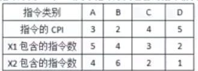(1)该计算机的峰值MIPS是多少?(2)×1和×2的执行时间分别是多少?(3)×1和X2的平均CPI分别是多少?
>
> 解：
>
> （2）X1和X2的执行时间
>
> X1的时钟周期数为：$5*3+4*2+3*4+2*5=45$
>
> X1的执行时间：$45*2.5ns=112.5ns$
>
> X2的时钟周期数为：$4*3+6*2+2*4+1*5=37$
>
> X2的执行时间：$37*2.5ns=92.5ns$
>
> （3）平均CPI
>
> X1指令数目为：5+4+3+2=14条
>
> X1的平均CPI：$45/14=3.21$
>
> X2指令数目为：4+6+2+1=13条
>
> X2的平均CPI：$37/13=2.85$
>
> （1）MIPS峰值，执行程序过程中，最快的MIPS，取执行CPI最小的就是了
>
> CPI最小是 2
>
> $MIPS=1÷(时钟周期*CPI)*10^3$
>
> $峰值MIPS=1/(2.5*2)*10^3=200MIPS$


## 第二章 数据的表示和运算

> 2.1 数制和编码
>
> 2.1.1 信息的二进制编码

- 计算机内部**所有信息**都采用**二制数表示**，因为二进制数容易用器件实现、运算规则简单、与逻辑相对应；
- 计算机所处理的数据有：**数值型**和**非数值型**
  - **数值型**有整数（定点数）、实数（浮点数）
  - 整数有无符号整数和有符号整数
  - **非数值型**：字符数据和逻辑数据
- 数值型数据确定三个要素：**进位记数制、定/浮点表示、编码规则**


> 2.1.2进位记数制

- 有2进制数、10进制数、16进制数、8进制数
- 掌握不同进制数之间的转换！
- 十进制数
  - 采用0~9，十个计数符号，基数为10
  - 计数规则：逢十进一，10^n的位权
  - 一个n位的十进制数x_0 x_1…x_n-2 x_n-1代表的数值为：
    - 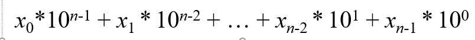
- 二进制数
  - 采用2个计数符号（即是0和1），基数为：2
  - 逢2进1， 2^n的位权
- 八进制
  - 采用8个计数符号（0~7），基数为：8
    逢8进1， 8^n的位权
- 十六进制数
  - 采用16个计数符号（0~9、A~F），基数为：16
  - 逢16进1， 16n的位权

- R(r)进制数
  - 采用R(r)个计数符号，基数为：R
  - 逢R(r)进1， Rn的位权


> 2.1 数制和编码，重点

- **数制之间的转换**
  - 总体上可以分为两类数制
    - 一类是人用的10进制数
    - 二类是计算机用的二进制数
  - **对于转换也是有两大类：**
  - 一是**人**的10进制**转换为**计算机的进制数
  - 二是**计算机**的进制数**转换成**人的10进制数
  - 还可以一种是**计算机**进制数**之间的转换**
- **总体上转换的方法也是分三种方法**
  - ①计算机2^n进制转换成人的10进制数方法是：
    - 将2^n进制数按位权展开相加法
  - ②人的10进制变计算机的2^n进制方法是：
    - 整数部分是：除2^n取余数倒计法
    - 小数部分是：乘2^n取整数顺计法
  - ③计算机之间的转换方法：
    - 二进制3位一组或4位一组对应分别转换
- **数制之间的转换**
  - ①计算机2^n进制转换成人的10进制数方法是：
    - 将2^n进制数按位权展开相加法
    - **举个例子**：10110二进制👉十进制$1*2^4+0*2^3+1*2^2+1*2^1+0*2^0=22$
  - ②人的10进制变计算机的2^n进制方法是：
    - 整数部分是：**除2**^n取余数倒计法
    - 小数部分是：**乘2**^n取整数顺计法
    - **举例子**：11.25十进制👉二进制
      - 整数部分：11/2，余1继续往下算，直到0
      - 小数部分：每次乘2，取整数部分
    - 
  - 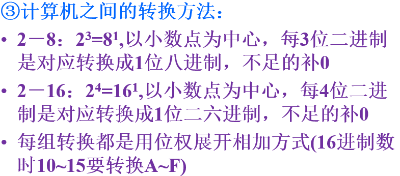
    - 8进制是每3位，16进制是每4位
    - 初始：10110110.11
    - 第一步：一小数点为中心，左右各取三位，不足补0（8进制）
      - 010 110 110 . 110
    - 第二步：对每三位进行按位权展开相加法
      - 2 6 6 . 6
    - 16进制第一步结果
      - 1011 0110 . 1100
      - 第二步结果：B 6 . C


> 2.1.3 定点数的编码表示

- 定点数编码表示主要有4种：**原码、反码、补码、移码**
- 真值：机器数的真正的值
- 机器数：计算机机器内部表示的数，机器数的表示方法(格式)：
  - 符号位(1位)+数值位(n-1位)
  - 数值位是二进制表示
- 对于**原码、反码、补码**来说，如果是正数，则符号位为0，负数，符号位为1（即**0表示正数，1表示负数**）
- 对于**移码则相反**(与原码等相比，1表示正数，0表示负数)


- 原码表示法
  - 一个数的原码表示由**符号位**直接和**数值位**构成，也称”符号-数值”表示法，原码表示法中，正数和负数的编码表示仅是符号位不同，数值部分(**真值部分**)完全相同；
  - 原码的优点：与真值关系对应，转换简单
  - 原码的缺点：加减运算复杂，0的表示不唯一
  - 现代计算机中，不用原码表示整数，只用定点原码小数来表示**浮点数的尾数部分**
- 补码表示法
  - 补码表示可以**实现加减运算的统一**，即用加法来实现**减法运算**；补码的表示法也称为”2-补码”表示法，由符号位后跟上真值的模2n补码构成(模2n即是除2n取余数)
  - 补码的表示方法：对于正数，补码与原码是一样的，对于负数，符号位取1，其余各位由数值部分”各位取反，末位加1”得到；
  - 0的补码唯一
- 反码表示法
  - 对于正数，其反码和原码一样(可知，**正数的原码、反码、补码一样**，都是符号**0+真值**)；
  - 对于负数，其反码就是符号1+数值位(真值)各位取反；
  - 反码的特点：0的表示不唯一，运算时需考虑循环进位；
  - 反码在计算机中很少使用，有时用作补码的中间表示形式
- 移码表示法
  - 移码一般用来表示**浮点数的阶**(指数)，用移码表示的阶称为阶码；
  - 在浮点数表示阶码中，为使操作过程不涉及到阶码的符号，可以对每个阶码加上一个正的常数，称为偏置常数，使所有的阶码都转换成正整数，这样在后续的对阶操作时，可以直观将两个数按位从左到右进行比较；

> 用8位表示：+125
>
> 真值：+111 1101
>
> 原码：0111 1101
>
> 反码：0111 1101
>
> 补码：0111 1101
>
> 用8位表示：-125
>
> 真值：-111 1101
>
> 原码：1111 1101
>
> 反码：1000 0010
>
> 补码：1000 0011
>
> 正数的原码、反码、补码都是相同的，但是负数的反码是**符号位不变其余取反**，而负数的补码是**在反码的基础上+1**
>
> 16位表示：0 000 0000 0111 1101 （前面补0，最前面的0是符号位）


### 整数的表示

> 2.2 整数的表示

- 整数的小数点隐含在数的最右边，故无需表示小数点，称为**定点数**
- 计算机中处理的整数可以用二进制表示，也可以用二进制编码的十进制数(如BCD码)表示(最终也是用0和1来表示)；二进制整数分为无符号整数或带符号整数两种
- 2.2.1 无符号整数的表示
  - 一个n位无符号整数的表示范围是：
    - 0~$(2^n-1)$
    - 其中最小的数为0，最大的数$2^n－1$，一共可以表示$2^n$个数
    - 如果是10那么就是10的N次方，2进制就是2的N次方
- 2.2.2  带符号的整数表示
  - 有符号数必须用一个二进制位来表示符号，前面的原码、反码、补码和移码都可以表示这类型的数，但是一般是用**补码**来表示，其优点：
  - 与原码和反码相比，**0的补码唯一**
  - 与原码和移码相比，**符号位可参与运**
  - 比原码和反码相比，可多表示一个最小负数
  - 与反码相比，不需要通过循环进位调整结果
- 2.2.3  C语言中的整数类型
- 2.3.1 浮点数表示格式
  - S：表示数的符号，0是正，1是负
  - M：二进制定点小数，N的尾数
  - E：二进制定点整数，N的阶或指数
  - R：基数，可约约定位2、4、16等
    - 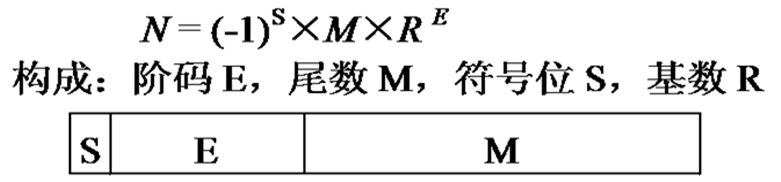
  - 在默认的基数R下，确定**符号S、尾数M**和**阶码E**就可以了
  - 一般地，尾数用定点原码小数表示，阶码E用移码表示
  - 在IEEE754浮点标准广泛使用之前，不同计算机所用的浮点数表示格式是不同的

> 例2-1，将十进制数＋65798转换成下述32位浮点格式：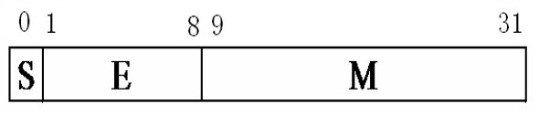
>
> 浮点数表示法以上是：$3275 = 0.3257*10^4$
>
> - 第一步：将65798变成二进制
> - 第二步：根据浮点数表示法，将二进制变成零点什么，乘位数
> - 第三步：0.1是固定的，不需要表示，**只需要表示后面的尾数，这就是规格化正尾数**
> - 第四步：E是阶码，阶码是17，17是十进制，化为二进制是10001
> - 第五步：用移码8位表示，根据移码和其他码是相反的，**1表示正数，0表负数**，因此是：`100`10001
> - 最后一步：红色的0表示符号位（正数是0）。绿色表示第五步的答案，蓝色表示尾数第三步的M
> - 最后计算：0100=4，1000=8，以此类推，最后H表示16进制
>
> 

> 例2-2，对数据$123_{10}$作规格化浮点数的编码，假定1位符号位，基数为2，阶码5位，采用移码，尾数10位，采用补码。
>
> 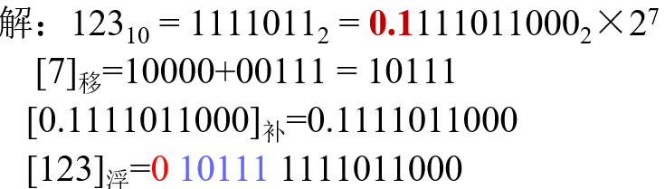


> 2.3.2 浮点数的规格化

- 浮点数尾数的位数决定浮点数的有效位数，有效位数越多，**数据的精度越高**，为了使**用尾数尽可能占满位数**；
- 对尾数进行**规格化(按某个标准)操作**，还可以保持浮点数表示有**唯一性**！
- 规格化的两种操作：左规、右规
  - 32👉0.32这就是左规，小数点向左边移动

> 2.3.3  IEEE754浮点数标准

- 有32位和64位两种格式，如下图
  - 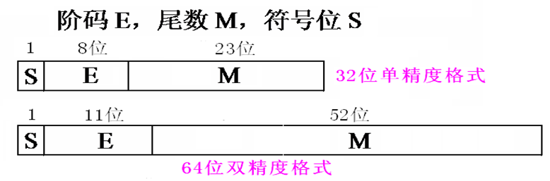
  - 尾数用原码表示，规格化后的尾数第1位总是为**“1”，可隐藏！**阶码用移码表示，偏置常数是$2^{n-1}-1$，单精度的阶码表示格式为**e=127+阶**，也就是**阶值=e-127**
- 根据阶码和尾数的特点，可以进行以下分类
  - 一：全0阶码和全0尾数：＋0/－0，正负由符号位决定
  - 二：全0阶码和非0尾数：非规格化数！
  - 三：全1阶码和全0尾数：＋∞/－∞
  - 四：全1阶码和非0尾数：**非数NaN**，没有定义的数，称为非数
  - 五：阶码非0且非全1：规格化的非0的数
    - 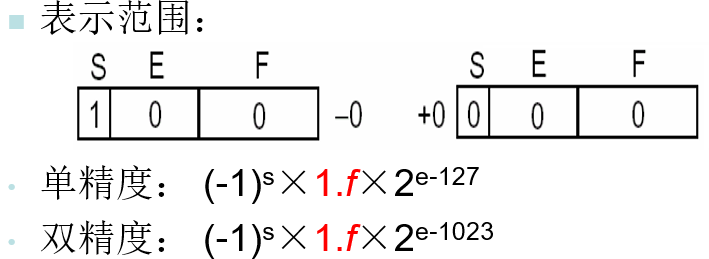

> 例2-3，将十进制数-0.75表示成单精度的IEEE754标准代码，并用十六进制数表示。
>
> - 第一步：和刚刚的表示差不多，变成1.F的形式
> - 第二步：前面的1省略，因为是负数因此是$(-1)^1$
> - 第三步：S=1，e-127=-1（$2^{-1}=2^{e-127}$），因此e=126，126的二进制是01111110，这就是他的移码，f就是红色的那堆东西
> -  第四步：先输出S，然后输出移码，在加上红色的那堆东西。
>
> 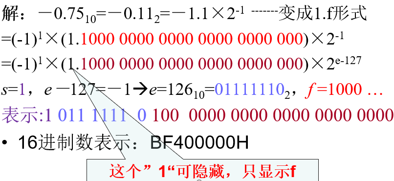

> 例2-4，将十进制数－1.25转换为IEEE754的单精度浮点数格式，要求最后格式用十六进制数表示。 
>
> 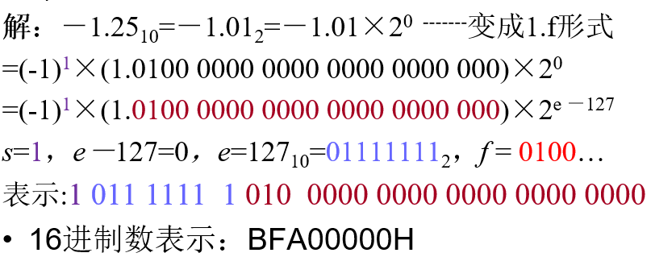


> 2.4 非数值数据的编码表示

- 在计算机内部，非数值的数据也是用二进制数”0”和”1”来表示的；
  - 逻辑值：真和假，表示为0或1，逻辑型数据只能参加逻辑运算，并且都是按位进行的。
  - 西文字符：用ASCII码表示、**表示的规律**
  - 汉字字符：汉字输入、显示、交流
  - 汉字的输入码---外码
  - 字符集与汉字内码---内码，用来进行汉字的交流
  - 汉字的字模点阵码和轮廓描述---显示

> 2.5.1 数据的宽度和单位

- 比特：每一位称为一个“比特”----最小单位
- 字节：8比特相当于一个字节---计量单元
- 字：计算机一次参与处理的数据处理单位；
- 字长：CPU内部用于整数运算的运算器宽度和通用寄存器宽度；
-  “字”和”字长”的概念不同但在实际应用中相关;

> 2.5.2 数据的存储和排列顺序

- 信息在计算机中都是采用**二进制**表示的，**每8位构成一个字节**，不同数据类型具有不同的宽度，如果以字节为一个排列单位，有**LSB表示最低有效字节**和**MSB表示最高有效字节**；
- 主存储器的地址以字节为单位进行编号时，数据可能会连续占用多个地址空间，于是有：
  - 大端：数据的**最高有效字节存放在最小地址单元**中，最低有效字节放在最大地址端（前面大，后面小）
  - 小端：数据的**最高有效字节存放在最大地址单元**中，最低有效字节放在最小地址端（前面小，后面大）

> 2.6 数据校验码

- 奇偶校验码
  - 整个编码的中的”1”的个数为奇数个(奇校验)或偶数个
- 海明校验码
  - 对数据进行按某种规律分若干组，每组进行相应的奇偶校验，从而实现定位错误，并将其纠正
  - 海明码的检错能力比较差！
- 循环冗余校验码
  - CRC码**只能发现错误**(可以发现多位同时错误)不能纠正，在应用中要求对方重发的方式来实现可靠性。


### 加法器和运算逻辑部件

> 2.7 加法器和运算逻辑部件
>
> 2.7.1 全加器和加法器

- 全加器和加法器
  - S=F=$A \bigoplus B \bigoplus C$
    - 有奇数个1`则为1`，偶数个1`则为0`
  - C=$AB \bigoplus AC \bigoplus BC$
    - 只要有两者为1，`则为1`
  - **无符号加法器**，n位的加法器（2个正数相加）有串行进位和并行进位
  - 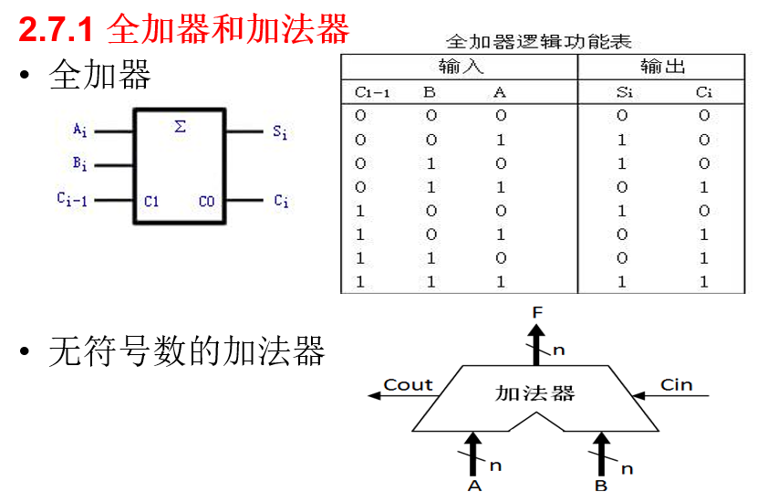

> 2.7.2 带标志加法器

- 常见的运算标志位输出有：
  - OF溢出：超出机器的表示范围（表示的位数），溢出时OF=1，无溢出OF=0
  - ZF零标志：ZF=1，表示运算结果位0
  - CF进位：最高位的进位，CF=1表示最高位有进位
  - SF符号：表示运算结果的符号，SF=1表示运算结果为负数，否则为0
    - 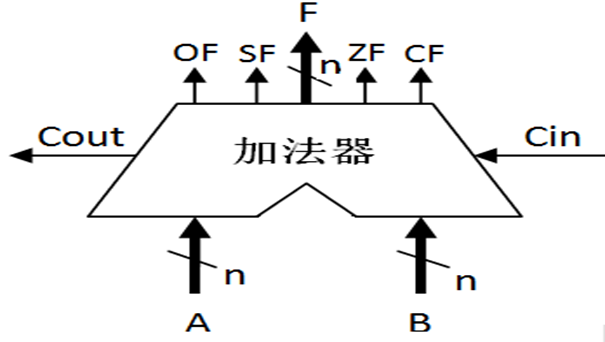

> 2.7.3 补码加减法运算器

- 基本表达式：
  - `[x+y]补=[x]补+[y]补`
  - `[x-y]补=[x]补+[-y]补`
  - n位补码的范围
    - $-2^{n-1}$~$(2^{n-1}-1)$
    - 判断溢出：OF=$C_{i-1}\bigoplus C_n$，次高位和最高位都有进位那么就不会溢出，否则可能会溢出
    - 

> 2.7.4 算术逻辑部件

- ALU是能进行算术逻辑运算组合逻辑电路，其核心是**带标志的加法器**，采用并行进位方式
  - 其中A和B是两个n位操作数输入端，
  - Cin是进位输入端；
  - ALUop是操作控制端，用来控制ALU执行的处理功能，其位数为s位；
  - ZF,OF,SF,CF为进位、溢出、符号和进位标志位。
  - 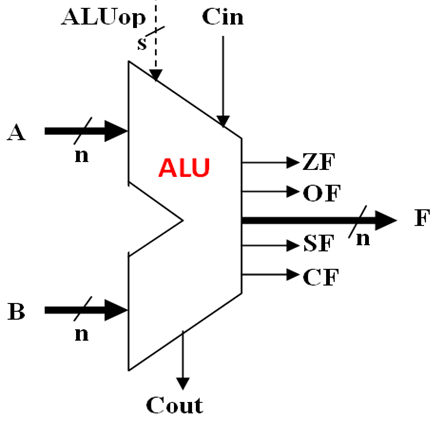

> 2.8.1 原码乘法运算

- 原码作为浮点数的表示形式，需要计算机能够实现**浮点数原码的乘运算**
- 用原码实现乘法运算时，符号位和数值分开计算，分为两步：
  - 1、确定乘积的符号位：两个乘数的符号异或得到；$S结果=S乘数\bigoplus S被乘数$
  - 2、计算乘积的数值位，
- 在计算机内部，只约定了小数点的位置，在规格化的情况下，相当于是两个整数相乘。


- 1、原码一位乘法 
  - 原码一位乘法是从手算演变而来的，即用两个操作数的绝对值相乘，乘积的符号为两操作数符号的异或值(同号为正，异号为负).
    - 乘积 P = |X|×|Y|
    - 符号 Ps = Xs⊕Ys
  - 原码一位乘法的规则
    - ①被乘数和乘数取绝对值。 
    - ②乘数的最低位为1时，部分积加被乘数，否则加0。
    - ③部分积和乘数右移一位。
    - ④重复②③，直到乘数全部移出。 
    - ⑤积的符号由两乘数符号的异或得到。 
    - ⑥积的符号与积的数值拼接得到积的原码。
  - 原码一位乘示例，需要用到3个寄存器：
    - 忽略了
- 2、补码一位乘法 
  - 原码乘法虽然容易实现，但一般计算机中数据多以补码表示。
  - 若仍用原码做乘法，需要进行码制转换，反倒不方便而且又影响速度。
  - 因为**补码符号位直接参加运算**，所以补码乘法不能简单地套用原码乘法的算法。
  - 实现补码乘法有2种方法
  - 校正法，使用较少，只给出算式
  - 比较法，该算法是英国人Booth夫妇提出，所以也称为Booth法。该算法无需校正，控制较为简单。
  - Booth乘法运算规律与规则
    - 00和11，右移一位
    - 01，原部分加`[X]补`，右移一位
    - 10，原部分加`[-X]补`，右移一位
    - 参加运算的数用补码表示，结果也是补码；符号位直接参加运算


> 2.9 定点除法运算

- 机器实现除法运算有两个先决条件(纯小数)：
  - 除数不等于0，否则商为无穷大。 
  - 被除数要小于除数，否则商会溢出
- 1、原码恢复余数除法 
- 2、原码不恢复余数除法，又称为原码加减交替法
- 3、补码不恢复余数除法
- 补码不恢复余数除法的**上商**和**商符**
  - **余数、除数同号，上商1**
  - **余数、除数异号，上商0 **
- 关于除法的够除和不够除
- 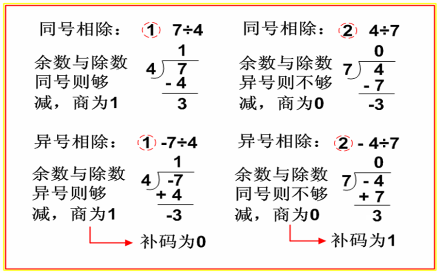

> 2.10 浮点数运算

- 浮点数比定点数的**表示范围宽，有效精度高**，更适合于科学与工程计算的需要。 
- 浮点数中包含两组代码，采用**定点整数**格式的阶码和采用**定点小数**格式的尾数。
- 因此，浮点运算实质上包含两组定点运算，阶码运算和尾数运算，但这两部分运算既有各自的作用，也有相互间的关联。
- 浮点数分为规格化浮点数和非规格化浮点数。
- 这里，主要讨论规格化浮点数的运算，并特别强调掌握**对阶**和**规格化**两个概念。 


## 第三章 指令系统

> 3.1.1 指令地址码的个数

- 指令地址码的个数
- 计算机硬件只能识别**机器语言**程序，用各种高级语言编写的源程序最后都需要翻译成以**指令形式**表示的机器语言才能在计算机上执行；
  一台计算机能够执行的**机器指令的集合**为该机的指令集或**指令系统**，指令是构成程序的基本元素；
  系统软件直接建立在硬件支持的指令基础上，系统程序员感觉到的计算机的功能特性和概念特性结构就是**指令集体系结构ISA**，因此，ISA设计的好坏直接决定计算机的性能和成本，因而ISA的设计至关重要。
- 一条指令中必须明显或隐含地包含以下信息：
  - **操作码**：指定操作的类型
  - **源操作数或其地址**：指出操作数或存放地址
  - **结果的地址**：结果放在什么地方
  - **下一条指令的地址**：下条指令在内存中的地址
  - 下一条指令的地址：一般情况下，下一条指令的地址不需要在指令明显给出，而是隐含在程序计数器(PC寄存器)中;
    - PC中放的就是下一条指令在内存中的地址;
    - 当指令按顺序执行时，只要自动将PC的值加上指令的长度，就可以得到下一条指令的地址;
    - 当遇到转移指令而不按顺序执行时，需要由指令给出转移到的目标地址(指令中有转移到指令的地址，也可以通过运算获得)
    - 意思是如果第一条指令的地址是00他的字节长度是2(00 01)，那么下一条指令就是00+2=02，自动执行02指令
- 一条指令由一个**操作码**和几个**地址码**构成，根据**显式**(隐式)给出的地址个数，指令可以为以下几种
  - 三地址指令：2个源操作数+1个结果数的地址
    - 例如，A+B=C，A和B是源操作数地址，C是结果地址
  - 二地址指令：2个源操作数（其中一个作为结果的地址）
  - 一地址指令：可以一个地址的数（可以是源也可以是目的地址），也可以两个地址的数(其中一个默认隐藏)
  - 零地址指令：可以0个地址的数，也可以1个地址的数(一个默认隐藏)

> 3.1.2 指令格式设计的原则

- 指令格式设计的原则
  - 指令应尽量**短**：占用（主存）空间小
  - 要有足够的**操作码位数**：适应多种操作类型
  - **操作码的编码**必须有唯一的解释，指令的操作码要译码，都要合法的指令，没有非法指令
  - 指令长度是**字节的整数倍**：便于读取和计算
  - 合理选择指令**地址的个数**
  - **指令应尽量规整**

> 3.2 指令系统设计
>
> 3.2.1 操作数类型

- 操作数的类型有：
  - **指针或地址**：用无符号整数表示
  - **数值数据**：有符号的整数或浮点数
  - 位和位串、字符和字符串：表示一些标志等信息
  - 逻辑布尔数据，表示逻辑值

> 3.2.2 寻址方式

- 寻址方式：寻找到操作数(地址)的方式，即在指令中找到操作数或操作数放的位置(地址) 
  - 要知道寻址方式，就先要明白操作数能放在什么地方？
    - 操作数可以放在**指令**中，CPU内的**寄存器**中，**内存**或外设端口中。
  - 内存是根据内存地址来存放数据的，如果是放在内存/外设中的话，就要给出内存或外设端口的**地址**
- 根据操作数存放的位置，有以下几种寻址方式：
  - **立即寻址**：操作数放在指令中给出的，指令中给出的操作数是立即可用的
  - **寄存器直接寻址**：操作数放在寄存器中，寄存器的数就是直接可以拿来用的数
- 以下的寻址方式都是在内存或外设中，所以给出的都是内存或外设的地址！这个地址也可以放在指令中，也可以放在寄存器中。
  - **直接寻址**：操作数的地址直接放在指令中。指令中直接给出操作数在内存中的地址；
  - **间接寻址**：指令中给的地址码是**存放操作数的有效地址**的**存储单元地址**，格式中的@是间接寻址的标志；
  - **寄存器间接寻址**：操作数的地址放在寄存器中。寄存器中存放的数是操作数在**内存中的地址**。
- 举例子
  - 地址100（值200），地址200（值125）
  - 采用直接寻址找值是200的：OP 100（直接去地址是100的地方找）
  - 采用间接寻址找值是125的：OP @100

- 如果寄存器中存放的**地址不是直接的**，还要**与其他数进行运算**形成有效的地址，根据寄存器的种类，又将寄存器间接寻址分为：
  - **变址寻址**：用到变址寄存器SI或DI
  - **基址寻址**：用到基址寄存器BX或BP
  - **基址加变址寻址**：
  - **相对寻址**：基地址由PC寄存器中的值运算产生

- 总结
  - 数或数在主存的地址（数在主存的地址）可以放在指令中、寄存器中和内存中
  - 立即数寻址：操作数在指令中给出。
  - 寄存器直接寻址：**操作数**在寄存器中。
  - 直接寻址：：**操作数的地址**在指令中。
  - 寄存器间接寻址：**操作数地址**放在寄存器中。
  - 间接寻址：数的地址的地址放在指令中
  - 变址/基址/相对寻址：存放数的地址是特殊的寄存器，地址是寄存器的值还要加上一个偏移量

> 3.2.3 操作类型

- 操作类型按功能分为以下几类：
  - 1、**算术和逻辑运算指令**：加add,减sub,乘mul,除div,比较cmp; 与and,或or,取反not,取负neg,亦或xor,加1(inc)等
  - 2、**移位指令**：算术移位、逻辑移位、循环移位
  - 3、**传送指令**：MOV（寄存器←→寄存器）、LOAD(主存→寄存器)、STORE(寄存器→主存)
  - 4、**串指令**：对字符串的操作
  - 5、**顺序控制指令**：条件/无条件转移、跳步、调用、返回等
  - 6、**CPU控制指令**：停机、开中断、特权指令（管态指令）
  - 7、**输入输出指令**：用于CPU与外部设备交换数据或传送命令状态等

> 3.2.4 操作码编码

- 1、定长操作码编码：固定长度。
- 2、扩展操作码编码：根据操作码数目将编码长度分成几个固定的格式！

> 例3-1：设指令字16位，其中地址码6位。若二地址指令15条，单地址指令有34条，则剩下的零地址指令最多有多少条？
> **扩展编码思想是操作码按短到长进行扩展编码**
>
> 2个地址一共16位那么一个地址就是2位。地址码6位就意味着每个地址需要6位，2个地址就是12位。16-12=4，**剩下4位作为操作码**。
>
> 二地址指令15条：
>  编码：  0000 XXX XXX  YYY YYY                                   
>              ~1110 XXX XXX  YYY YYY
> 一地址指令34条：1111  000 000  XXX XXX
>                              ~ 1111  100 001  XXX XXX
>
> **下一条指令必须从100 010开始，那么剩下就是零地址了**
>
> 零地址指令的编码：
>                          1111  100 010 000  000 （61616）
>                     ~   1111  111 111 111 111 （65535）
>
> 结果：$30*2^6种（1919+1种/条）编码$

> 3.2.5 标志信息生成与使用

- 条件转移指令是根据程序当前生成的标志信息进行转移。标志有ZF、OF、SF、CF
- 生成的标志位由专门的条件码寄存器(或称状态寄存器、标志寄存器、程序状态寄存器)来存放的，也可以由通用的寄存器来存放。
- 表3.1、常用条件转移指令
  - 进位标志的：jc/jnc；零标志的：jz/jnz
  - 符号标志的：js/jns；溢出标志的：jo/jno
  - 无符号比较：ja/jb/je；有符号比较：jg/jl/je

> 3.2.6 指令系统设计风格

- 1、按操作数位置指令风格分：
  - 累加器型指令：其中一个操作数隐藏在累加器
  - 栈型指令：放在堆栈的栈顶的数，java虚拟机
  - 通用寄存器型指令：操作数的位置与寄存器有关：有立即数I、通用寄存器R，存储器S，指令又可分为：
    - RR型、RS型、SI型、SS型
  - LOAD/STORE型指令：寄存器←→存储器
  - **通用寄存器型指令系统占主导地位。**
- 2、按指令格式的复杂度来分：可分为CISC和RISC两种
  - CISC复杂指令集系统计算机：
    - 特点：复杂、多、难优化
  - RISC精简指令集系统计算机：
    - 特点：少、快、规整、可优化


### 指令系统实例

> 3.3  指令系统实例

- MIPS系统计算机的指令系统，是一种RISC系统结构，采用32位定长指令字，操作码字段也是固定长度，没有专门的寻址方式字段，由指令格式确定各操作数的寻址方式；
- MIPS指令采用三地址指令格式，只有3种类型，如下图所示:
  - 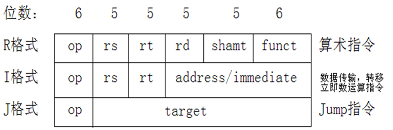
  - rs和rt为指令中两个操作数寄存器，rd为结果寄存器，shamt为字段指定位移操作时移动的位数，funct为扩展操作码
  - 三种类型：
    - R型(寄存器型)指令：2个操作数和1个结果都放在（3个）寄存器中，其操作码OP为000 000，功能由funct指定。将rs和rt进行运算，结果放rd，只有寄存器寻址；
    - I型(立即数型)指令：称为立即数型指令，I型指令有4种寻址方式有寄存器寻址、立即数寻址、相对寻址、基址加变址；
    - J型(无条件跳转型)指令：主要是无条件跳转指令，跳转的目标是26位直接地址！寻址方式是直接寻址。

> 3.3.2 MIPS指令中的数据表示

- 有32个通用的寄存器，要占用5位( 25=32)，标号可以用$0~~$31表示，也可以用专用名称，如P99表3.2：zero       0  
- MIPS还提供了32个32位的单精度浮点寄存器，用汇编$f0~~$f31表示，两个配对可以表示64位的双精度浮点数；
- MIPS中提供了两个乘商寄存器Hi和Lo；
- MIPS用**程序计数器PC来指出下条指令地址**;
- MIPS存储器按**字节编址**，采用大端方式存储；

> 例3-2
>
> 例3.3，已知从MIPS指令机器代码与汇编表示对应表中查出操作码(OP段)为000000对应R型指令，又R型指令解码表中查到功能码(funct段)100000，对应指令add指令。回答以下问题：
> 汇编表示`add $t0,$s1,$s2`对应的MIPS指令的机器码是什么？
>
> t0是8对应rd，s1是17对应rs，s2是18对应rd
>
>  000000  10001  10010  01000  00000  100 000
>   OP       rs     rt     rd    shamt    funct
> (2) 000000  00101  01111  10000  00000  100000
>             a1      t7     s0
>
> 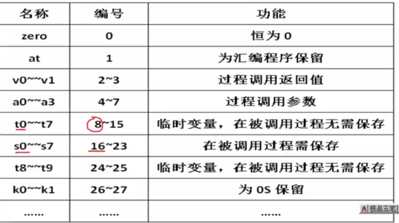

- MIPS的特点:
  - 指令格式简单,只有三种指令格式
  - 采用流水执行方式提高指令执行速度
  - 使用32个通用寄存器，表示为$0~ $31
  - 采用”比较条件”，比较和转移两个动作一次完成。

> 3.4 程序的机器级表示

- 过程式程序设计的程序有三种结构：**顺序、选择和循环结构**三种


## 第四章 中央处理器

- 计算机所有功能都是通过执行程序来完成的，程序中的代码部分由**指令序列**构成；
- 数据通路在控制器产生的控制信号控制下完成特定的操作，**数据通路和控制器**是中央处理器中最基本的部件；

> 4.1 程序执行概述
>
> 4.1.1 程序及指令的执行过程

- 指令周期：CPU取出并执行一条指令的时间称为指令周期，不同的指令其指令周期可能不同，即是包含不同数目的**时钟周期**。
- CPU执行一条指令的过程可分为**取指令、指令译码**、计算源操作数地址并**取操作数、执行数据操作**和、计算目的操作数地址并**存结果**、计算**下一条指令地址**这几个步骤：
  - 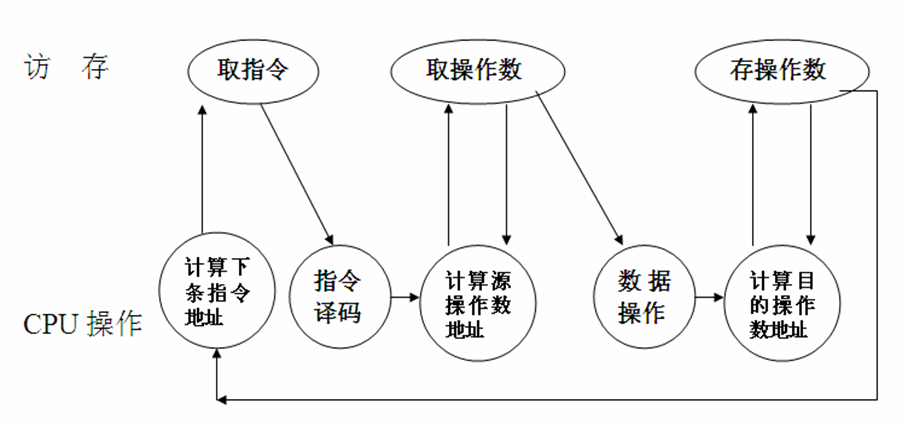

- CPU执行一条指令的过程：
  - **取指令**：程序计数器PC指向即将执行指令的地址，可以从PC指向的地址取出指令，取出的指令送到送到**指令寄存器IR**中。
  - 对指令进行**译码**：解释出是完成什么功能的指令，产生不同的**操作控制信号**，控制CPU工作
  - 计算**源操作数的**地址并取出操作数：操作数可以放在寄存器中或存储器中。如果是存储器就要进行寻址操作
  - 数据**操作**：执行运算操作。根据指令进行不同的操作。

- 简洁版过程
  - **取指令**：
  - 对指令进行**译码**：
  - 计算**源操作数**的地址并取出操作数：
  - 数据**操作**：执行运算操作。根据指令进行不同的操作。
  - 目的操作数地址计算并存结果：结果操作数也可以放在寄存器中或存储器中。
  - **下条指令地址**运算并送PC：下条指令的地址计算

> 4.1.2 CPU的基本功能和基本组成

- CPU的基本功能和基本组成
  - **程序计数器(PC)**：存储即将执行**指令的地址**，形成指令地址：顺序执行和转换指令
  - **指令寄存器(IR)**：存放现在要执行的**指令**
  - 指令译码器(ID)：解释译码产生控制信号
  - 启停控制逻辑：
  - 时序信号产生部件：产生节拍
  - 操作控制信号形成部件：
  - 总线控制逻辑：CPU内部和外部总线，一般指的CPU与主存之间的通路（地址、数据、控制信号三通路）；总线控制逻辑实现对总线的控制，包括对数据和地址信息的缓冲与控制，其中包括用来缓冲数据信息的数据存储寄存器
  - 中断机构：对异常处理
  - 主存根据PC寄存器的值找到这个地址，然后将这个地址存放的指令通过数据线给到指令寄存器，指令寄存器通过总线去进行指令移码，产生了控制信号后，通过总线控制逻辑和寄存器们进行运算
    - 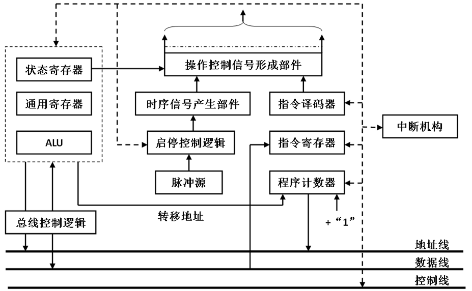
- 基本流程
  - 总线控制逻辑：CPU内部和外部总线，一般指的CPU与主存之间的通路(地址、数据、控制信号三通路):
  - **总线控制逻辑**实现对总线的控制，包括对数据和地址信息的缓冲与控制，其中包括用来缓冲数据信息的**存储器数据寄存器MDR**和用来缓冲地址信息的**存储器地址寄存器MAR**
  - MAR地址寄存器，MDR连接数据线进行读/写操作（存储器数据寄存器）
  - CPU对存储器进行访问是通过总线进行，读/写时，CPU将存储访问命令送到**控制线**，将要访问的存储单元的地址通过MAR送到**地址线**，并通过MDR连接**数据线**进行读/写操作;
  - CPU读取内存，2100单元的数据
    - 第一步：CPU将读信号送到与内存相连的控制线
    - 第二步：CPU将2100→MAR→内存地址线
    - 第三步：将内存的数据通过数据线送到CPU的MDR
    - 写入第三步：通过MDR→数据线→内存

> 4.1.3 打断程序正常执行的事件

- 打断程序正常执行的事件
  - 计算机从开机加电开始，CPU都是重复做一种事情：读出PC所指存储单元的指令并执行它，每条指令的执行都会PC的值，所以CPU能够不断的执行新的指令；
  - 正常情况下，CPU按部就班地按照程序规定的顺序一条指令接着一条指令执行，或者按顺序执行，或者跳转到转移类指令设定的转移目标指令，这都属于正常执行顺序；
- 以下事件会打断正常程序的执行：
  - 对指令进行译码，发现是非法操作码
  - 指令或数据不在主存中
  - 运算过程溢出或除数为0
  - 有外部的事件要处理
- CPU具有正常执行指令被打断时的处理机制称为异常控制，也称为**中断机制**
  所有这些打断正常程序执行的事件被分为两大类：
  - **异常**：CPU**内部**引起的意外事件，根据原因又可分为硬故障中断和程序性中断(CPU执行某指令而引发的发生在CPU内部的异常事件)
  - **中断**：因为外设或**外部**事件引起的


> 4.2 数据通路基本结构和定时

- 机器指令的执行是在数据通路中完成的；
- **数据通路**：通常将指令执行中（数据运算中）数据所经过的路径，包括路径上的部件称为数据通路。
- 数据通路中专门进行数据运算的部件称为**执行部件或功能部件**，如ALU（算术逻辑单元）、通用寄存器、状态寄存器、浮点运算逻辑、异常和中断处理逻辑等；
- 产生控制信号的部件称为**控制部件**，数据通路由控制部件发出的控制信号进行控制；

> 4.2.1 数据通路基本结构

- 指令执行用到两类元件：**组合逻辑元件**(也称为操作元件)和**时序逻辑元件**(状态元件或存储元件)；
- 连接这些元件的方式有两种：**总线方式**和**分散连接方式**；
- 数据通路就是由组合逻辑元件和时序逻辑元件通过总线或分散方式连接而成的进行**数据存储、处理和传送**的路径


- 1.**组合逻辑元件**：有多路选择器、加法器、算术逻辑部件、译码器等
  - 这些逻辑部件有数据输入输出端，也有控制信号端

- 2.**时序逻辑元件**：即状态元件，具有存储功能，最简单的就是D触发器
  - 由n个D触发器可构成一个n位的寄存器。根据功能和实现方式的不同，有各种不同类型的寄存器

> 4.2.2 数据通路的时序控制

- 指令执行过程中的每个操作步骤都有先后顺序，为了能使计算机正确执行指令，CPU必须按正确的时序产生操作控制信号。
- 1.早期计算机的定时方式
  - 早期计算机通常采用**机器周期、节拍和脉冲**三级时序对数据通路操作进行定时
- 2.现代计算机的定时方式
  - 现代计算机的整个数据通路中的定时信号就是**时钟信号**，一个时钟周期就是一个节拍，CPU的主频就是时钟信号的频率。

> 4.3.1 总线结构数据通路

- 单总线结构的数据通路如右图：存储器通过地址总线与CPU内的**地址寄存器MAR**相连，通过数据总线与CPU内的**数据寄存器MDR**相连。
  - R1需要先去Y存储起来，然后R2(Rn-1)去ALU 和 Y中的R1进行运算。
  - 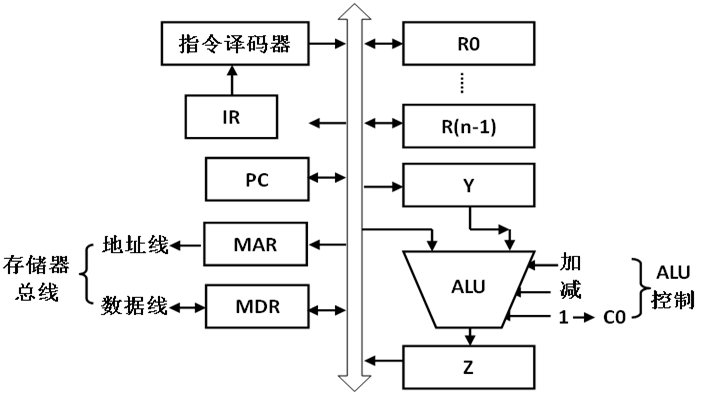

### 数据通路基本工作原理

> 4.3 数据通路基本工作原理

- Rin存数据，Rout出数据
- 1.在通用寄存器之间传送数据
  - 在单总线结构中，总线是一组共享的传输信号线，任何一时刻也只能有一个部件把信息送到总线上。
  - 如：寄存器之间传送数据的控制信号有Rin和Rout。并且通常取值为1时为有效控制信号。R1→R2的信号为R2in=1，R1out=1
  - 其余寄存器的Rin和Rout信号均为0
  - 即：R1out ，R2in
    - 
- 2 完成算术和逻辑运算
  - ALU一个没有记忆功能的组合逻辑电路，运算时必须将两个操作数送到其输入端，并在ALU控制信号的控制下进行。
  - ALU的控制信号有：加add、减sub、与and、或or、传送move等
  - ALU的其中一个操作数来自Y寄存器，另一个操作数与总线直接相连，即另外一个数可以在寄存器中直接通过总线送到ALU的其中一个输入端，在ALU控制信号作用下参与运算，运算结果临时存放在Y寄存器中。
  - 如执行：R1+R2→R3的步骤及控制信号为：
    - 先要将R1→Y：控制信号为 Yin，R1out
    - ALU运算，R2+Y→Z ：控制信号为R2out ，add，(Zin)
    - 结果送R3，即Z→R3：控制信号为Zout，R3in 
    - 以上三步不能同时执行。需要三个节拍，即需要3个时钟周期。
- 3 从内存单元读取一个字(数据)
  - 对于读操作，首先CPU要送出一个地址到**地址寄存器MAR**，地址一开始是放在寄存器中（取指令时是PC寄存器，去操作数时，是在普通寄存器中的），**寄存器→MAR**
  - 然后再送一个**读信号**来启动主存的读操作，把主存单元的数据送到**数据寄存器MDR**，**主存单元的数据→MDR**
  - 有时候还要有一个等待信号WMFC，最后送到相应的寄存器，
  - 如执行：M[R1]→R2，寄存器间接寻址的步骤及控制信号为：
    - 因为R1的是地址，先要将R1→MAR：控制信号为 MARin，R1out
    - 读信号与等待 (数据已经送到了MDR)：read ，WMFC，(MDRin)
    - 从MDR中把数据送R2，即MDR→R2：控制信号为MDTout，R2in 
    - 也要三个周期，如果是同步方式(主存采用SDRAN)时，不用等待信号WMFC。
- 4  把一个字(数据)写入内存单元
  - 将数据写入内存，与主存的读操作相似，首先也要将要写的数据送MDR准备好，
  - 再送地址信息到**地址寄存器MAR**，然后再送一个**写信号**来启动主存的写操作，
  - 有时候还要有一个等待信号WMFC。
  - 如执行： R2→M[R1] 的步骤及控制信号为：
    - 先要将R2→MDR：控制信号为 MDRin，R2out
    - 因为R1的是地址，所有要送到MAR，即R1→MAR，控制信号为： MARin，R1out
    - 写信号与等待(MDR的数据已经被送到内存)：write ，WMFC，(MDRout)
    - 也要三个周期，如果是同步方式(主存采用SDRAN)时，不用等待信号WMFC。


> 例题4-1
>
> - 执行加法指令”ADD (R1), R0”的功能为M[R1]+R0→M[R1]，即将主存地址为R1单元的数加上R0的数，并将结果保存在R1为地址的主存单元中，即寄存器间接寻址
> - 取指令和指令译码是一样的，如下表
>   - 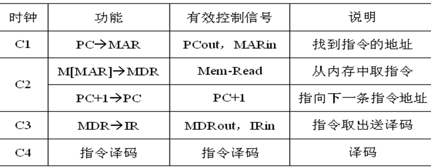
>   - 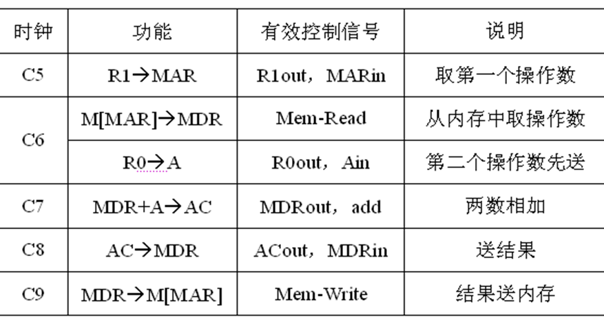
>
> 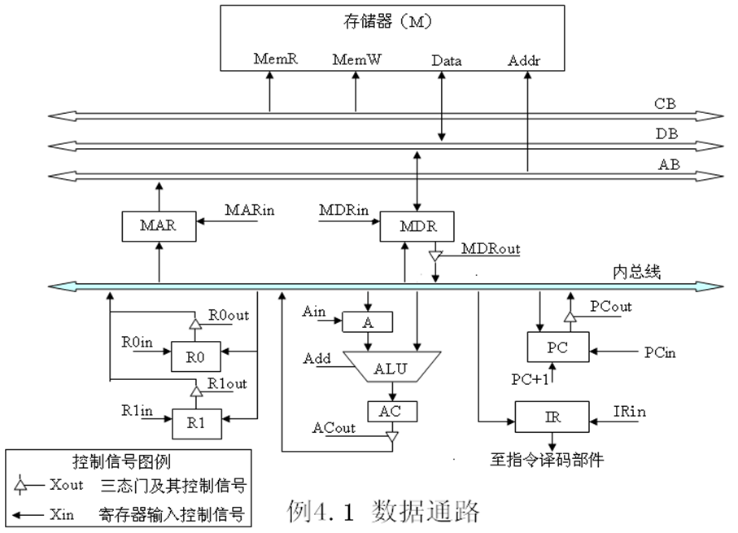

> 201910
>
> 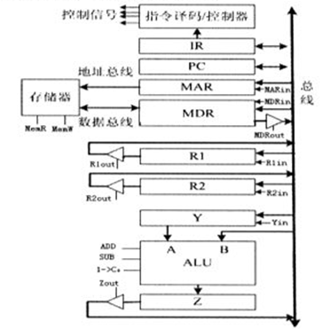
>
> (1)指令"ADD R2,R1"在执行阶段需要多少个节拍?该指令功能为R2的内容与R1的相加，结果送入R2中。
> (2)写出执行阶段每个节拍的功能和有效控制信号。
>
> - 解
>   - 首先可以将R1的数送到Y
>   - 第二步产生一个ADD信号将Y和R2相加，结果送到Z
>   - 第三步将Z的数给到R2
>   - **因此三个节拍**
>     - `C1：R1→Y，R1out Yin`
>     - `C2：Y+R2→Z，R2out add`
>     - `C3：Z→R2，Zout R2in`
> - 小测试：ADD(R1),R0
>   - M[R1]+R0→R[R1]
>   - 取指令：相当于从内存中取数据(指令)
>     - `C1：PC→MAR    PCout,MARin`（找指令）
>     - `C2：M[MAR]→MDR    Mem-Read`（取指令）
>     - `C2：PC+2→PC    PC+2`（下一个指令）
>     - `C3：MDR→IR    MDRout,IRin`（取出指令）
>     - `C4：指令译码    指令译码`（译码）
>     - 前四步是固定的，取完指令了
>     - `C5：R1→MAR R1out,MARin`（取操作数，寄存器间接寻址，R1中的是操作数在内存的地址，又相当于从内存读一个数 此时非指令）
>     - `C6：M[MAR]→MDR    Mem-Read`
>     - `C7：MDR→Y    MDRout,Yin`
>     - `C8：R0+Y→Z    R0out,ADD,`
>     - `C9：Z→MDR    Zout,MDRin`
>     - `C10：MDR→M[MAR]    Mem-Write`
>
> 提示：如果是取指令那么PC就不能+1，需要`PC+2`，1个字节8位，2个字节16位


> 4.3.2 单周期数据通路

- 4.3.2 单周期数据通路
  - 最简单的非总线结构处理器是单周期处理器。所谓单周期处理器是指其**所有指令步骤的指令周期都为一个时钟周期**，单周期数据通路即是单周期处理器中的数据通路。
  - 在单周期数据通路中，取指令、译码、取操作数、执行运算、存结果、更新PC等操作都需要在一个时钟周期内完成。
  - 典型的是MIPS指令系统计算机为例，如下图所示。
  - 加下划线的都是控制信号，虚线表示作用点，Extop用于扩展器进行符号扩展
    - 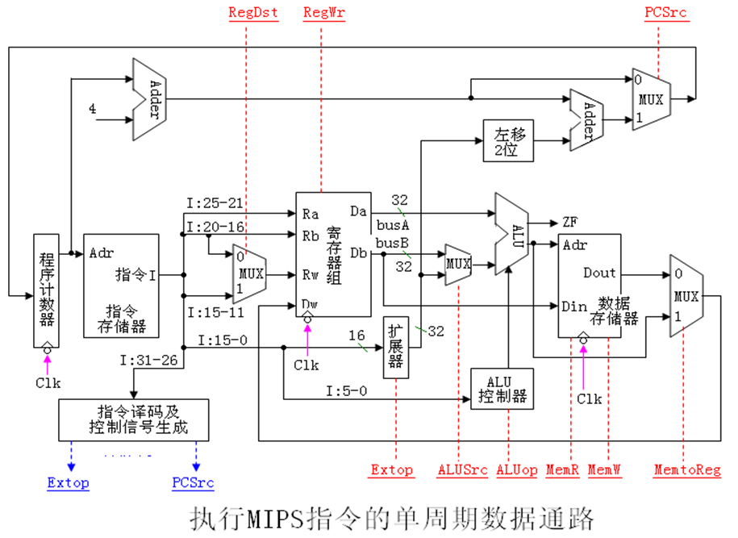
  - lw：从内存中取一个字到寄存器
  - 下面以lw指令为例说明单周期数据通路执行一条指令的执行过程，lw指令的地址已经在PC中，则执行过程如下：
    - **取指令**：取出指令并执行PC+4
    - **指令译码**：并取操作数(地址)：指令中的OP字段(I:31-26)送去译码，产生控制信号；同时将指令中的rs字段(I:25-21)、rt字段(I:20-16)分别送寄存器组的输入端Ra和Rb，然后输出送到总线；另外指令中立即数字段送扩展器
    - **计算操作数地址**： 
    - **读出操作数**：
    - **写结果**：
  - 在上图所示的单周期数据通路中，有三种状态元件：**PC、通用寄存器和数据存储器**，它们由时钟信号Clk进行写入定时，指令执行结果总是在下个时钟到来时开始保存在通用寄存器、数据存储器或PC中，因而每条指令的指令周期为一个时钟周期。
  - 为了保证单周期数据通路的所有指令都在一个时钟周期内完成，其时钟周期应该以最复杂的指令所用指令周期为准，所以单周期处理器的时钟周期特别长，因而执行速度很慢。


> 4.4 流水线方式下指令的执行
>
> 4.4.1 指令流水线的基本原理

- 指令分为**若干个阶段并设置自独立的功能部件**，在指令的执行过程中，每个阶段都在相应的功能部件中完成，如果将各阶段看成相应的流水段，则指令的执行赛程就构成了**  指令流水线**。
  - 取指令IF：根据PC的值从存储器中取出
  - 指令译码ID：产生指令操作的控制信号 
  - 取操作数OF：读取存储器或寄存器中的操作数
  - 执行EX：对操作数完成指定的操作
  - 写回WB：将执行结果 送到存储器或寄存器
- 指令流水线的基本原理
  - 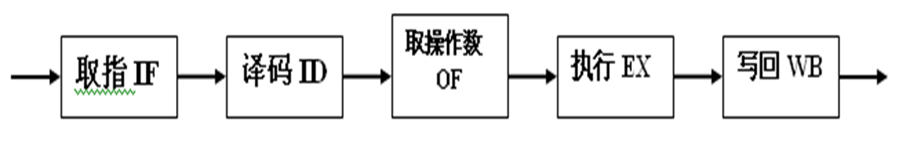
  - 3条指令只用7个周期
  - 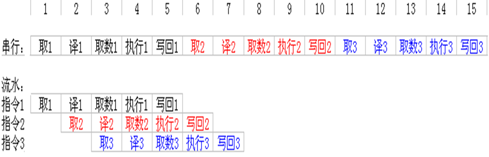

> 4.4.2 MIPS指令流水线

- 4.4.2 MIPS指令流水线
- 也中分为5个阶段：**取指令(Ifetch)→译码/取数(Reg/Dec)**→执行(Exec)→访存(Mem)→写回(Write)
- 对于MIPS指令系统，每条指令的前两个功能段都是一样的，而不同的是后面的三个功能段随指令不同而不同
  - 1、R-型 指令的功能段划分：指令的所有操作数都在寄存器中，没有访存功能段。
  - 2、I-型指令的功能段划分：有三种类型：**带立即数运算类指令、访存类指令(lw/sw)和分支指令(条件转移指令)**
    - 带立即数运算类指令，因为要用到的数在指令中（指令是在指令寄存器中），所以也不用访存功能段，即与R-型指令一样！
    - 访存类指令有装入指令(lw指令：内存到寄存器)和存数指令(sw指令：寄存器到内存)
    - 分支指令包括beq指令和bne指令等，这类 首先判断指定条件是否满足，在条件满足的情况下跳转到指定的转移目标指令去执行。
    - beq指令形式为：beq  rs, rt, imm16，beq指令除前两个功能段外，Exec功能段对R[rs]和R[rt]做运算，同时计算目标地址PC+4+4×imm16；Mem功能段根据R[rs]和R[rt]是否相等来确定是否将转移目标地址送PC；Write功能段为空操作。
  - 3、J-型指令的功能段划分
    - J-型指令就是无条件的转移指令，功能是直接将目标地址送到PC中，因此其功能段的划分很简单，除两个公共的功能段外，就只有一个功能段Exec，用于生成转移目标地址并送PC.
    - 即使J型指令有三个功能就可以实现：取指令、译码/取数、执行
  - 从以上对各指令执行过程中功能段的划分可以看出，最复杂的是lw指令，它有5个功能段，其他指令都有某些功能段是空操作！
  - R-型指令有4个功能段（没有访存）、J-型指令只有3个功能；
  - **流水线数据通路的设计原则**是：指令流水段的个数以最复杂的指令所用的功能段个数为准，流水段的长度也是以最复杂的功能操作所用时间为准
  - 所有指令都有5个功能段，不用加空段

> 4.4.3 适合流水线的指令集的特征：

- 适合流水线的指令集的特征：
  - 指令流水段的个数以最复杂的指令所用的功能段个数为准，流水段的长度也是**以最复杂的功能操作所用时间为准**。适合流水线的指令集的特征：
    - 首先，指令长度应尽量一致，译码简单
    - 指令格式应尽量规整，保证寄存器位置相同
    - 采用Load/Store型指令风格：即只有Load(存储器寄存器)和Store(寄存器→存储器)指令能访问存储器，其他指令一律不能访问。
    - 指令和数据在存储器中要“对齐”存放
    - 总之：指令集体系结构的规整、简单和一致等特征有利于指令的流水执行。


> 4.5 控制器设计基本原理

- **控制器**是整个CPU的指挥控制中心，主要是产生指令执行过程中控制信号。如R1in,MDRout等等。
- 根据不同的控制描述方式，可以有**硬连线控制器**和**微程序控制器**两种实现方式。

> 4.5.1 硬连线控制器

- 4.5.1 硬连线控制器
  - 硬连线控制器的实现思路是，将指令执行过程中每个时钟周期所包含的控制信号取值算成一个状态。每来一个时钟，控制信号会有一组新的取值，也就是一个新的状态，这样，所有指令的执行过程就可以用一个**有限状态转换图来描述**。实现时用一个组合逻辑电路来**生成控制信号，用状态寄存器记录状态之间的转换**。
- 硬连线控制器的设计过程，主要步骤有：
  - 根据每条指令的功能，确定每条指令的执行步骤，画出指令执行的流程图
  - 给出每条指令在每个步骤中各个控制信号的取值，并在表中列出
  - 根据指令和控制信号的关系，写出每个控制信号的逻辑表达式
  - 根据逻辑表达式，画出控制器的逻辑电路图。
- 4.5.2 微程序控制器
  - 微程序控制器的基本思路是：仿照程序设计的方法，将每条指令的执行过程用**一个微程序**来表示 ，将指令执行过程中每个时钟周期所包含的控制信号取值看成是由**多个微命令**组成的一条微指令，每条微指令实际上就是一个0/1序列，一个**微程序**由若干条微指令组成。
  - 指令→微程序→微指令→微命令→控制信号，每个控制信号对应一个微命令，控制信号取不同的值就发出不同的微命令。
    - 指令执行时，先找到对应的第一条微指令，然后按照特定的顺序取出后续的微指令执行。每来一个时钟，执行一个微指令。
    - 实现时，每条指令对应的**微程序**事先存放在一个**只读存储器**中，这个只读存储器称为**控制存储器**，简称控存，用一个PLA或ROM来生成每条指令对应的微程序的第一条微指令地址。
  - 微指令所在存储单元地址称为**微地址**，微程序定时器根据不同的实现方式生成微地址，然后根据微地址到控制存储器中取出微指令执行。
- 微程序定时器的实现有**计数器法**和**断定法**两种：
  - 计数器法：使用专门的微程序计数器uPC，将下条微指令的地址隐藏在uPC中。
  - 断定法：在微指令中增加一个下地址字段，在该字段中直接给出下条微指令的地址，因此称为下址字段法。

> 4.6 指令流水线中的冒险处理

- 4.6 指令流水线中的冒险处理

- 在流水线的执行过程中，可能会遇到一些情况，使**流水线无法正确**、按时执行后续的指令，从而引起**流水线阻塞或停顿，**我们称这种现象为**流水线冒险**

- 有三种类型：**结构冒险、数据冒险和控制冒险**

  - 1、结构冒险
  - 也称为**硬件资源冲突**，引起结构冒险原因是在**同一部件同时被不同指令所用**，也就是说它是由硬件资源竞争造成。
    
  - 解决结构冒险的策略有两种：
    - 规定一个部件每个指令只能使用一次，且只能在特定的阶段使用
    - 通过设置多个独立的部件来避免资源冲突
  
- 2、数据冒险
    - 称为**数据相关**，后面指令需要读取前面指令的运算结果，前面指令的结果还没有写入寄存器中。
  - 解决数据冒险的策略有多种：
      - 最简单的是由编译器在数据相关的指令之间加上若干个nop指令(空操作指令)，延后第二条指令的执行！降低了流水线的效率！
      - 采用数据转发技术，在数据通路中一旦产生运算结果或一旦存储器读出数据，就把它们以通过一条旁路直接送到数据相关的后续指令执行阶段的ALU的输入端 
    
  - 3、控制冒险

    - 由于发生了因指令执行顺序的改变而引起的流水线阻塞称为控制冒险。各类的转移指令(包括条件转移、无条件转移、调用、返回指令)以及异常和中断告示事件都会改变指令执行的顺序，因而都可能引发控制冒险。
  - 解决控制冒险与数据冒险的方法：**采用消极的方法**

> 4.7 高级流水线基本原理

- 高级流水线技术充分利用指令级并行来提高流水线的性能。有两种增加指令级并行的策略：
  - 一是**超流水线技术**，通过增加流水线级数来使更多的指令同时在流水线中重叠执行。
  - 二是**多发射流水线技术**，通过同时启动**多条指令独立运行来提高指令的并行性**。
  - 实现多发射流水线要完成两个任务：**指令打包**和**冒险处理**。
  - 根据打包任务不同分为：**静态多发射、动态多发射**


> 4.8 异常和中断

- 一般来说，**异常**是来自CPU内部和外部的**意外事件**，而**中断**是正在执行的程序**被打断**。

> 4.8.1  中断和异常的基本概念

- 4.8.1  中断和异常的基本概念
- 早期不分异常和中断，都称为中断，只有**内中断**(CPU内部产生的意外事件)和**外中断**(CPU外部发出的中断请求)之分!
- 有时强调异常是CPU内部执行指令时发生，而中断是CPU外部的I/O设备向CPU发出的请求，特称异常为”**内部异常**”，而称中断为”外部中断”
- 通常把处理异常事件的程序称为**异常处理程序**，把处理中断事件的程序称为**中断服务程序**，合在一起称为异常或中断处理程序。

> 4.8.2  异常的分类

- 4.8.2  异常的分类
- 异常分为三类：**故障、陷阱和终止**
  - 故障：在**执行过程中**与执行相关的意外事件，如“非法操作码”“除数为0”、页故障等
  - 陷阱：**预先安排好**的一种异常事件。一般有：系统调用和程序调试。如断点调试、单步跟踪。
  - 终止：执行过程发生了**严重的错误**，指令无法继续执行下去！控制器出现问题、存储器校验错误

> 4.8.3  中断的分类

- 4.8.3  中断的分类
  - 中断分为两类：**可屏蔽中断**和**不可屏蔽**

> 4.8.4 异常和中断的响应

- 4.8.4 异常和中断的响应
  - 在CPU执行指令过程中，如果发生异常事件或中断请求，则CPU必须进行相应的处理。CPU从检测到异常事件或中断请求信号，到调出相应的处理程序开始执行，整个过程称为“**异常和中断响应**”，有三步骤：
  - **保护断点和程序状态→关中断→识别异常和中断事件并转相应的处理程序**。


## 第五章 存储器层次结构

> 5.1.1 存储器的分类

- 5.1.1 存储器的分类
- 存储器是用来存储/保存二进制数据
- 存储器/元件必须要有两种不同的物理状态，才能用来表示二进制0和1
  - 1、按存储元件分类：
    - 半导体存储器：半导体器件构成
    - 磁表面存储器：磁性材料/磁场构成。有磁盘、磁带等
    - 光盘存储器：光介质存储器/光学性质
  - 2、按照存取方式分类：CPU把数据存放到存储器
    - 随机存储器RAM：半导体存储器(主存和Cache)
    - 顺序存储器SAM：磁带存储器，信息按顺序存取和读出。
    - 直接存储器DAM：兼有RAM和SAM的特点，直接区域存储，磁盘存储器
  - 3、按信息的**可更改性分**：
    - 读写存储器：存储器中的信息可以读出和写入，RAM就是一种读写存储器；
    - 只读存储器ROM：存储器中的信息只读不写，特殊制作时也可以擦除原信息重新写入
    - RAM和ROM都采用随机存取方式进行信息访问的；
  - 4、按断电后信息的可保存性分：
    - 非易失(不挥发)存储器：信息可以一直保留
    - 易失(挥发)的存储器(有RAM、 Cache)：靠电

> 5.1.2 主存储器的组成和基本操作

- 5.1.2 主存储器的组成和基本操作
  - 由一个个存储0或1的**记忆单元(存储元)**构成的**存储阵列(存储体)**是存储器的核心部分。
  - 为了存取存储体的信息，必须对存储单元编号，所编号就是**地址**，编址单位可以是按字节编址或按字编址。
  - 访问主存时先把被访问单元的地址送**主存地址寄存器MAR**中，然后通过地址线将主存地址送到主存地址译码器中进行译码选中相应存储单元，同时将读/ 写信号通过控制线送到主存的读写电路。
  - 如果是写操作，将要写的信息送到**主存地址寄存器MDR**，再送到存储单元，读操作时，从存储单元中把信息送到MDR。
  - 地址线的**位数决定**了存储器(主存)**地址空间**的最大可寻址范围。：M=2^n
  - 主存储器的基本框图如下：
    - 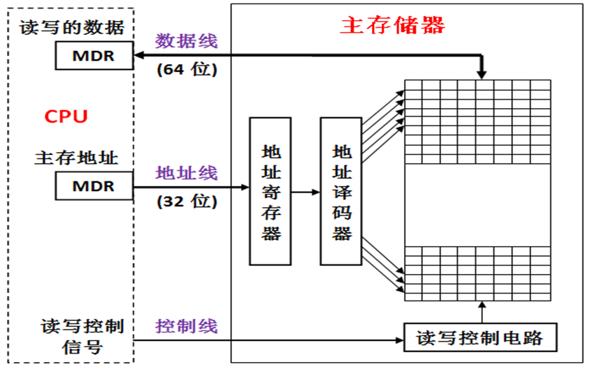

> 5.1.3 存储器的主要性能指标

- 5.1.3 存储器的主要性能指标
- 对存储器就是三个要求：**容量、速度**和**价格**
- 主要的性能指标有：
  - **存储器容量**：能存放的二进制数位数或字(字节)数；
  - **存取时间**：一般用读出时间T_A及写入时间T_W来描述，T_A是存储器接到读命令开始到信息被送到数据线所需时间。
  - **存储周期**：进行一次读写操作所需的全部时间，也就存储器进行连续读写操作所允许的最小时间间隔TM。一般关系：$T_M=T_A+t1=T_W+t2$，t1和t2是读写操作的额外时间。即是T_M>T_A和T_M>T_W
  - **存储器带宽B**：连续访问时，数据传输速率。单位为：B /S

> 5.1.4  存储器的层次结构

- **存储器和CPU有速度上的差异**，为了缩小差异，计算机内部的存储器采用层次化结构。
- 某一存储器很难同时满足容量大、速度快和代价格的要求，计算机的存储器把各种不同容量不同速度的存储器按一定的结构结合一起形成层次化的存储器体系结构。
- 程序和数据按不同的层次存放在各级存储器中，整个存储系统在速度、容量和价格等方面具有良好的综合性能指标；
- 存储器层次结构图：CPU执行指令时，需要的操作数大部都来自**寄存器**，如果需要从存储器中的数据时，先访问**cache**，再访问主存储器，最后访问硬盘，并且送到内存，然后送至cache。
  - 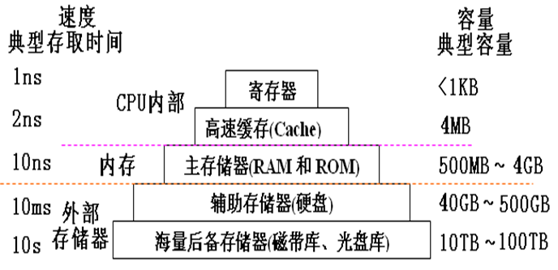


> 5.2  半导体随机存取存储器

- 5.2  半导体随机存取存储器
- 目前使用最多的随机存储器是**半导体存储器**。根据存储信息的原理不同，又分为**静态随机存储器(SRAM)**和**动态随机存储器(DRAM)**。
- 半导体存储器优点是存取速度快、体积小、可靠性高；其缺点是断电后存储器中存储的信息随即丢失。
- 存储元是存储器中的最小存储单位，它的基本作用是存储一位二进制信息（0或1）。作为存储元的材料或者电路，必须具备以下基本功能：
  - 具备两种稳定状态，两种稳定状态经外部信号控制可以相互转换（状态写入）
  - 通过控制可以得到其中的状态信息（状态读出）
  - 无外部原因作用，其中的信息能长期保存
- 存储元可以由各种材料制成，但最常见的由MOS电路组成。其中，**SRAM存储元是用双稳态触发器存储信息的**。
- 1、六管静态存储单元
  - 静态MOS存储元由T1、T2、T3、T4管组成的双稳态触发器保存信息，而且因为T3、T4管给T1、T2管供电，**能长期保存信息不变*-*。掉电后，原来的信息也就随即消失。
  - T1、T2管为工作管
  - T3、T4管为负载管
  - T5、T6、T7、T8为控制管
- 2、单管动态存储单元
  - 为了进一步简化结构，提高集成度，采用单管动态存储元。它只有一个电容和一个MOS管。电容C用来存储电荷，MOS管V用来控制读写。
  - 保持状态：字线加低电平，V断开，电容C基本上无放电回路，从而维持电容的“０”、“１”状态。
  - 写入状态：
  - 读出状态：
  - 刷新：
- 3、静态存储元件与动态存储元件的比较
  - 静态SRAM是靠**元件的(两个)状态**来存储信息的，存储元件所用的所用的MOS管多，占硅片的面积大，功耗大，集成度低；但无需刷新，也无需读后再生，特别是它镜头的读写速度快。因而它适合做高速小容量的半导体存储器。
  - 动态DRAM是靠**电容存储的电荷**来存储信息的，存储元件所用的MOS管少，占硅片面积小，功耗小，集成度高；但必须定时刷新和读后再生，特别是它的读写速度相应SRAM要慢很多。因而适合做慢速大容量的主存。 


> 5.2.2 半导体存储芯片

- 半导体RAM存储器由**存储体、读写电路、地址译码电路、控制电路**组成。
  - 存储体：存储体是存储单元的集合。 在大容量存储器中，往往把各个字的同一位组织在一个集成芯片中。
  - 例如，芯片有4096×1位，则表示该芯片具有4096个字的同一位。 
    - 例如：芯片的4096个字排成64×64的矩阵，需要12根地址线。
    - 低6位作为X译码器的输入，高6位作为Y译码器的输入，两译码器输出各64根，总共需要128根。
  - 地址译码器：地址译码器有两种：单译码方式和双译码方式。
  - 驱动器：在双译码结构中，一条X选择线要控制所有挂接的存储单元，上述为64个电路，负载很大。
  - I/O电路：它处于数据线和被选中的单元之间，用来控制被选中单元的**读出或写入**，并具有放大信号的作用。
  - 片选与读/写控制：某个地址只用到某个芯片，需要进行选择控制。只有当片选信号有效时才能选中某一片。
  - 输出驱动电路：为了扩展存储器的容量，经常需要将几个芯片的数据线并联在一起；另外，存储器的读出数据或写入数据都放在双向的数据总线上，这就要用到三态输出缓冲器。

- SRAM存储芯片有多种型号，引脚组成如下：
  - **地址线**：与存储芯片的单元数有关(字数)
  - **数据线**：与存储芯片的字长(位)有关(位数)
  - **片选线CS**：SRAM必须有，用于芯片选择
  - **读/写控制信号WE**
  - **电源线、地线**
- **存储芯片(器)的容量表示为：字数×位数**（单元数、每个存储单元存储的位数）
- 存储芯片的**地址范围**是其**地址线从全“0”到全“1”的所有编码**，`0~2^n -1`

> 5.2.3 SDRAM技术

- 5.2.3 SDRAM技术
- 目前主存常用的是基于SDRAM芯片技术的内存条，包括DDR-SDRAM、DDR2-SDRAM和DDR3-SDRAM等
- SDRAM是一种与当年Intel推出的芯片组北桥芯片的前端总线频率同步运行的DRAM芯片，因此称为同步DRAM.
- DDR-SDRAM：两位预取功能，在时钟的上升沿和下降沿两次传送数据

> 5.3.1 内存条和内存条插槽

- 主存与CPU的连接如下图：总线是连接其上各部件共享的传输通道，由**控制、地址、数据总线**组成。
- 内存的插槽就是存储器总线！

> 5.3.2 存储器芯片的扩展

- 对于一个内存条，是由苦干个存储芯片构成的，其中存储器或存储芯片的容量表示:
  - **存储单元数(字数/地址数)×单元容量(数据位数）**
  - 如某芯片的容量表示为：`2K×8bit`(位)
  - 即表示此芯片有 `2K` 个单元(2048个存储单元)，每个单元的**数据位是8位**
  - 该芯片的地址线数有11根，数据线有8根
  - 一个是**数据位数**(即单元容量决定的)（位数），一般在容量表示中直接由bit给出。数据线－－宿舍大小
  - 另一个是**地址位数**(即由存储单元数决定的)，一般是由2^n=单元数（**字数**），其中n就是地址位数。地址线－－宿舍数量
- 目前生产的存储器芯片的容量是有限的，它在**字数(即地址线数)**或字长－**位数(即数据线数)**方面与实际存储器的要求都有差距。
- 一个内存条要由若干个存储芯片构成，所以需要在字方向和位方向上进行扩展才能满足存储器在实际应用中的容量要求。
- 存储器的扩展方式有三种：
  - **位扩展法**：即数据线不够，在数据线的数目上补
  - **字扩展法**：即地址线不够，在地址线的数目上补
  - **字位同时扩展法**：地址线和数据线同时不够
- 存储器由若干个存储芯片组成的。

> 例题
>
> 某存储器(内存条)的容量是：16K×8bit，采用的芯片有：
> 存储芯片的容量为： 16K×4bit，需要进行位扩展，即数据线的位数扩展为8位，**需要2片**。
>
> $2=(16*8)/(16*4)$
>
> 存储芯片的容量为： 4K×8bit，需要进行字扩展，即地址线的位数扩展到14位，需要4片。
>
> $4=(16*8)/(4*8)$
>
> 存储芯片的容量为： 4K×4bit，需要进行字扩展和位扩展，即数据线的位数扩展为8位，地址线的位数扩展到14位。
>
> $8=(16*8)/(4*4)$

> 5.3.3 连续编址和交叉编址

- 5.3.3 连续编址和交叉编址
- 通常把由多个独立并行工作的存储模块构成的存储器称为**多模块存储器**。每个存储模块的容量之和就是存储器的容量。
- 根据不同的编址方式，多模块存储器分为**连续编址**和**交叉编址**两种结构
  - 连续编址：主存地址的高位表示模块号，低位表示模块内地址
  - 交叉编址：主存地址的低位表示模块号，高低表示模块内内地，交叉编址可以采用轮流启动和同时启动两种方式。
    - 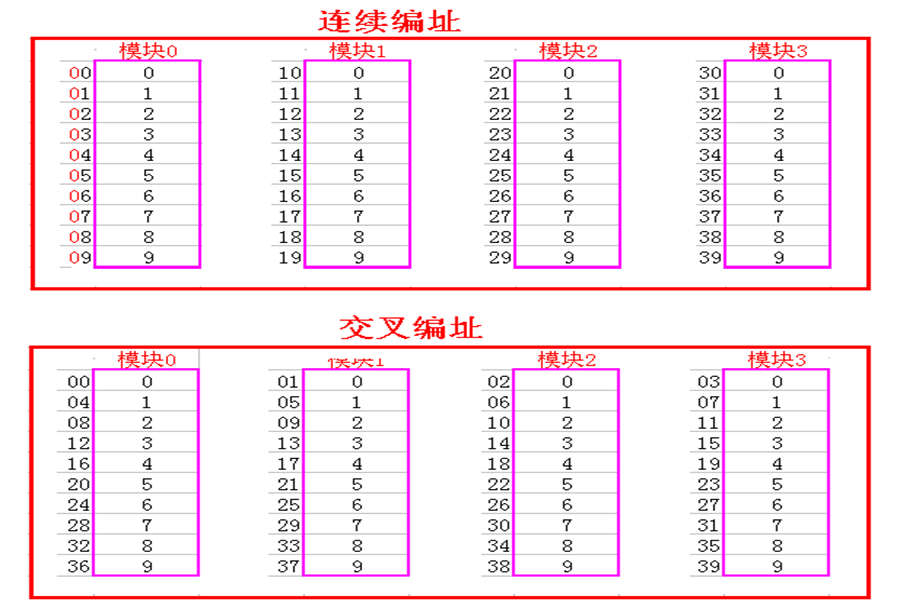


> 5.4 半导体只读存储器和Flash存储器
> 5.4.1 半导体只读存储器ROM

- 根据只读存储器的工艺，可分为：**MROM、PROM、EPROM、EEPROM(E^2 PROM)**等类型
  - 掩膜只读存储器**MROM**：生产厂家写入信息，用户不能悠修改
  - **可编程**只读存储器**PROM**：用户可写一次的信息，不能改
  - **可擦除可编程**只读存储器**EPROM**：用户可多次写入信息，但写入时先要用光擦除，多次修改
  - **电可擦除电改写**只读存储器**EEPROM**：用户可多次写入信息，但写入时先要用电擦除，速度快。
  - 电：E。可擦除：E。编程：P。

> 5.4.2 半导体FLASH存储器

- 5.4.2 半导体FLASH存储器
- Flash存储器也称为闪存，是高密度非易失性的读写存储器，它兼有ROM和RAM的优点，而且功耗低、集成度高、不需要后备电源。
- 闪存有三种基本操作：
  - 编程(充电)：改变信息，写信息
  - 擦除(放电)：清除信息
  - 读取操作：
  - Flash存储器的读操作速度和写操作速度相差很大，读取的速度快而写的速度慢


> 5.5  高速缓冲存储器(cache)

- 通过提高存储芯片的速度或采用并行存储器结构可以缓解CPU和主存之间的速度匹配问题。还可以采用在CPU和主存之间设置**高速(容量小)缓存**来提高CPU访问指令和数据的速度。

> 5.5.1 程序访问的局部性

- 5.5.1 程序访问的局部性
- 在较短的时间间隔内，程序产生的地址集中在一个很小范围内，称为程序访问的局部性，可细分为**时间局部性**和**空间局部性**。
  - 时间局部性：
  - 空间局部性：
- 有了局部性，CACHE就有存储的条件。

> 5.5.2 cache的功能与基本原理

- 计算机专家的研究，发现了一个规律：在一个较短的时间段内，CPU集中访问局部范围的存储器地址，而对该地址范围之外的地址很少访问。——**程序局部性原理(分时间上的局部性和空间上的局部性)。**
- 高速缓冲技术就是利用程序局部性原理，在CPU和主存之间插入一个**高速、小容量的存储器**；
- 高速缓冲技术就是利用程序局部性原理，在CPU和主存之间插入一个**高速、小容量的存储器**，来存放程序正在执行的一小部分，并让CPU从这个高速、小容量的存储器中取指令和数据，来进行工作。 
- 高速的存储器配合高速的CPU进行工作，**计算机的整体速度就提高**，同时由于高速存储器的容量小 ，**价格增加也小**。
  - 高速缓冲技术
  - 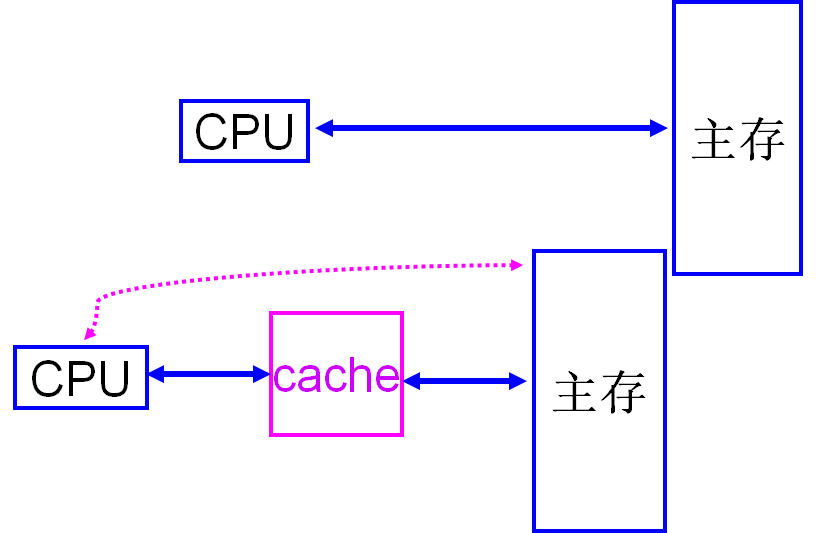

- 如果计算机的CPU能在Cache中访问到程序或数据，称为**Cache命中**；
- 如果程序或数据在Cache中找不到，必须访问主存，则称为**Cache未命中**。
- **命中率**：命中的次数与总次数的比值(即命中的概率)，用p表示。
- **命中时(概率p)**，CPU访问信息的时间称为**命中时间**，即是CPU访问cache的时间Tc
- 没命中(概率1-p)时的时间称为**缺失时间/缺失损失**，没命中时CPU先要从主存中读信息，再将信息送到cache中并进行访问，即有访问主存的时间Tm和Tc之和。
- CPU在”cache—主存”层次的平均访问时间为：
  - Ta＝p × Tc＋(1－p) × (Tc＋Tm)＝Tc＋(1－P) × Tm

> 例5-2
>
> 假定处理器时钟周期为2ns，某程序由1000条指令组成，每条指令执行一次，其中的4条指令在取指令时，没有在cache中找到，其余的都能在cache中取到。在执行指令的过程中，该程序需要3000次主存数据访问，其中6次没有在cache中找到，试问：
>
> 1执行该程序得到的cache命中率是多少?
>
> 总的访问次数：1000+3000=4000
>
> 命中次数：1000-4 + 3000-6=3990
>
> 总cache命中率：$3990/4000=99.75%$
>
> 2若cache中存取一个信息的1个时钟周期 ，缺失损失为10个时钟周期，则CPU在cache-主存层次的平均访问时间为多少？
>
> P=0.9975，Tm=10个时钟周期（缺失损失的周期）
>
> `TA=p*命中访问时间+(1-p)*没命中的时间`
>
> `Ta=0.9975*1+(1-0.9975)*10=1.025个时钟周期`

- 为了获得高速度，**Cache全部用硬件实现**，也只有用硬件实现，才能获得最高的速度。
- 下面讨论Cache的实现，涉及三个问题：
  - **地址变换**：即是程序链接装入时地址是**主存的地址**，有了Cache后，数据可能在cache中，故要将主存的地址变换为Cache中的地址;
  - **内容替换**：Cache的容量有限，只能用换进换出(替换)的方式来装入一部分;
  - **更新操作**：在替换时，如果对cache的内容进行了修改，就要在换出时更新保持数据一致性;


### cache行和主存块之间映射方式

> 5.5.3   cache行和主存块之间映射方式

- 5.5.3   cache行和主存块之间映射方式
- CPU工作时，执行的是主存中的指令，送出的地址是**主存的地址**，但真正访问的是Cache的内容，这就涉及如何把**主存地址**转换为**Cache地址**的问题。 
- 在Cache中，需要把主存地址空间对应到Cache地址中，即确定二者位置的**对应关系**，进而把主存的程序或数据复制到Cache中，称为**地址映射**。
- 不管是哪种映射方式，主存和Cache都按同样大小进行**分块**！所以，主存和Cache都有**块号**和**块内地址**！而Cache的块号称为**行号**、Cache总块数也就称为**行数**。块内地址都是一样的！
- **主存是分块，缓存是分行**
- Cache地址映射方式有：全相联方式、直接方式和组相联方式3种方式。 
  - 直接映射：每个主存块映射到cache的**固定行(块)**中。
  - 全相联映射：每个主存块映射到cache的**任意行(块)**中。
  - 组相联映射：每个主存块映射到cache的**固定组的任意行(块)**中。
  - 总结：
    - 直接映射：**直接有**种对应的关系来转换
    - 全相联映射：**全部都可以**，乱来的，没有对应关系
    - 组相联映射：以上两个的结合体，**组**内全**相联**(没有对应关系)，组间是**直接**有对应关系的。
- 1 直接映射
  - 直接映射的基本思想提将主存的**每一块映射到固定的一个Cache行**中，也称为模映射，其映射关系为：
  - Cache行号=主存块号   mod   Cache总行数(总块数)
  - 在直接映射方式下：主存地址有三部分：
    - 块群号(标记)、Cache行号、块内地址
    - 

> 例
>
> 块大小512字(9位二进制数表示)，Cache空间8K字 (13位)，主存 为1M字(20位)，得：
> 块大小512字：2^9=512，要用9位二进制数表示
>
> Cache总行数：`8*1024/512=16行(4位二进制表示)`
>
> 主存总块数：`1*1024*1024 /512=2048块(11位表示)`
> 主存地址结构：
>
> 
>
> CPU对主存地址单元0240CH访问：
> (0240C)16=(0000 0010 0100 0000 1100)2

> 例5-3
>
> 30.某计算机主存地址空间大小16MB,按字节编址。主存与Cache之间采用**直接映射方式**，块大小为512字节。Cache数据区大小为16KB。
>
> (1)该cache共有多少行?
>
> $16KB/512B = 16*1KB/512B = 16K*1024B/512 = 32行$
>
> 总共32行，$2^5=32$，行号0~31，用5位二进制数表示，00000-11111
>
> (2)主存地址需多少位?如何划分?要求说明每个字段的含义、位数和在主存地址中的位置。
>
> $2^X=B；2^{1?}=2^?KB；2^{2?}=2^?MB$
>
> 主存地址空间大小16MB，2的24次方=16MB，主存地址有24位
>
> Cache数据区大小为16KB，2的14次方=16KB，Cache地址有14位
>
> 块大小512B，2的9次方，块内地址9位
>
> `结果：标记10位(24-14=10)，行号5位(14-9=5)，块内地址9位`
>
> 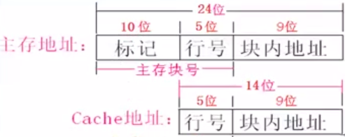

- 2 全相联映射
  - 基本思想是一个主存的块可以任意装入Cache的任意一行中，即是没有固定对应的关系。
  - 主存只有**标记**和**块内地址**两个字段。
    - 
  - 在全相联方式下，只要Cache的行是空闲的，就不会发生冲突！冲突率低，命中率高。

> 块大小512字：29=512，要用9位二进制数表示
> Cache总行数：`8*1024/512=16行(4位二进制表示)`
>
> 主存的总块数：`1*1024*1024 /512=2048块(11位表示)`
>
> CPU对主存地址单元0240CH访问：
> (0240C)16=(0000 0010 0100 0000 1100)2

> 例5-4
>
> 30.某计算机主存地址空间大小32MB,按字节编址。主存与Cache之间采用**全相联映射方式**，块大小为1KB。Cache数据区大小为16KB。
>
> (1)该cache共有多少行?
>
> $16KB/1KB = 16行$
>
> 总共16行，$2^4=16$，行号0~15，用4位二进制数表示，0000-1111
>
> (2)主存地址需多少位?如何划分?要求说明每个字段的含义、位数和在主存地址中的位置。
>
> 主存地址空间大小32MB，2的25次方=32，25位
>
> Cache数据区大小为16KB，2的14次方=16，14位
>
> 块大小为1KB，2的10次方=1KB，10位
>
> `主存：标记15位，块内地址10位，共25位`
>
> `Cache：行号4位，块内地址10位，共14位`

- 3 组相联映射
  - 主要思想：将Cache所有行(块)分成大小相等的组，每组有n行(块)，
  - 同样，主存也是按同样的大小分组，主存的组和Cache组**(组间)有固定映射关系**，而每组内的若干行**没有固定关系(全映射方式**)。
  - Cache和主存还是要按同样的大小分(行)块的。
  - 在分(行)块的基础上，将**若干(行)块为一组**，  同时将Cache和主存进行分组。
    - 02是第0组，13是第1组
    - 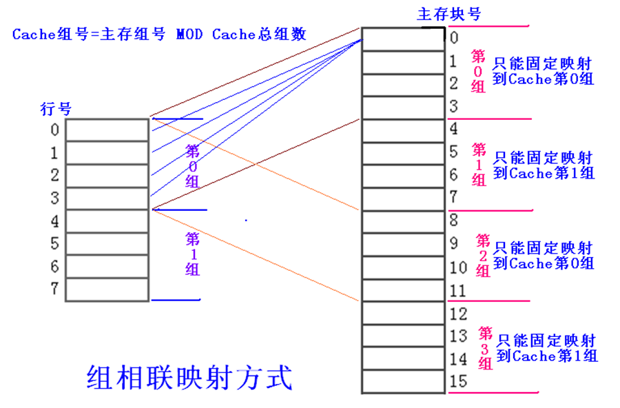
  - 得到：有cache和主存的**组号**
  - Cache的组号和主存的**组号之间有固定的映射关系**，而组间的(行)块是任意的！
  - 在组相联映射方式下，其映射关系为：
    - **Cache组号 = 主存组号  MOD  Cache总组数**
  - 进一步得到地址结构为：
    - 


> 5.5.4 cache中主存块的替换算法

- 5.5.4 cache中主存块的替换算法
  - 当Cache块被占用后，为了能装新的主存块，就必须从Cache中选择一块调出进行替换，称为**替换算法**或**替换策略**
  - 常用的替换算法有：
    - 先进先出算法FIFO：简单，不能反映程序的局部性
    - 最近最少使用算法LRU：反映程序的局部性，复杂，从使用时间上来看**久**
    - 最近最不常使用算法LFU：从使用的次数上看**少**
    - 随机替换算法：最简单
  - 可以根据实现的难易度以及是否能获得较高的命中率两个方面来决定采用哪种算法。

> 5.5.5 cache的一致性问题

- 5.5.5 cache的一致性问题
  - 解决**Cache一致性问题**的关键是处理好写操作。通常有**全写法**和**回写法**两种方式
    - **全写法**：如果写命中 ，则**同时写Cache和主存**；若写不命中，则采用写分配法和非写分配法进行处理。
    - 也称为通写法或直写法或透写法，写直达法
    - **回写法**：只写Cache不写主存，采用**回头再写或最后一次再写**主存的方法。

> 5.6 虚拟存储器

- 为了解决**主存容量空间**和**多道程序运行**的问题，采用了虚拟存储器的技术。
- 虚拟存储器技术：程序员在一个不受物理内存空间限制并且比物理内存空间更大的逻辑地址空间中编写程序，每个程序都独立拥有一个存储空间。在程序执行过程中，把当前执行到的**一部分程序和相应的数据调入主存**，其他暂时不用的部分**暂时存放在磁盘**上，这种借助外存为程序提供的很大虚拟存储空间称为**虚拟存储器**，简称**虚存**。
- **Cache**解决的是**主存速度**上问题，**虚存**解决**主存容量上**的问题

> 5.6.1 程序和进程的概念

- 5.6.1 程序和进程的概念
  - **程序**是**代码和数据的集合**，程序的代码是一个机器指令序列，因而程序是一种**静态**的概念。作为目标模块**存放在磁盘**中。
  - **进程**就是程序的一次**运行过程**，更具体的说法，进程是特定独立功能的程序关于某个数据集合上的一次运行(**CPU和主存**)活动，是**动态**的。计算机处理所有任务实际上是由进程完成。

> 5.6.2 虚拟地址空间

- 虚拟存储器管理方式采用“请求分页”思想。每次访问仅将当前需要的页面调入主存，而将不活跃的页面放在磁盘上。当访问某个信息所在页不在主存时发生缺页，此时，从磁盘中将缺失页面调入主存。
- 这样情况下就有：
  - 用户栈和内核区
  - 动态区和静态区
  - **未分配页和已分配页**
  - 缓存页和未缓存页

> 5.6.3  虚拟存储器实现

- 5.6.3  虚拟存储器实现
  - 虚拟存储器分成三种类型，**分页式、分段式**和**段页式**
  - **1、分页式虚拟存储器：**
    - 主存和虚存的空间都**被划分**为大小相等的**页面**,磁盘和主存按页面为单位交换信息。
    - **主存中**的页面称为页框、物理页或**实页**;
    - 而**虚存中**的页面称为虚拟页、逻辑页或**虚页**。
    - 它们都有一样的页内地址和页号。
    - 1 页表：反映虚页与实页关系的表;
      - 操作系统在主存中给每个进程生成一个页表，每个虚拟页在页表中都有一个对应的页表项。页表反映在每个虚页的存放位置、使用情况等。
    - 2 地址转换：
      - 对于采用虚存机制的系统，程序(指令)给出的是虚拟地址，所以，CPU执行指令时，首先要将**虚拟地址**转换为主存的**物理地址**。地址转换工作由存储管理部件来完成。
    - 虚拟地址由两部分：**虚拟页号**和**页内偏移地址**（也称页内地址）
    - 物理地址也由两部分：**物理页号**和**页内偏移地址**（也称页内地址）
    - 虚存和主存的页内偏移地址是一样的 。
    - 虚拟页号和物理页号的对应关系由**页表**得到
  - **地址计算**
    - 物理地址=物理页号*页大小+页偏移地址
    - 虚拟地址=虚拟页号*页大小+页偏移地址
    - 虚拟页号(或物理页号)=虚拟地址(物理地址)/页大小
    - 页内偏移地址=虚拟地址 % 页大小 （取余数）
  - 3 快表：在地址转换过程中，多次访问页表(主存中)，为了提高访问页表的速度 ，可以把页表中**最活跃的几个页表项装入高速缓存**中，此时的页表就称为**快表TLB**。
    - 主存中的页表称慢表。
  - 4 CPU访存过程：在一个具有Cache和虚拟存储器的计算机系统中，CPU的一次访存操作可能涉及到快表、Cahce、页表、主存和磁盘的访问，其访问过程存在以下三种缺失：
    - 快表TLB缺失：要访问的页面的对应页表项不在TLB中(还在主存的慢表中)
    - Cache缺失：要访问的主存块不在Cache中(还在主存中)
    - 缺页page：要访问的页面不在主存中(还在磁盘上)
  - **2、分段式虚拟存储器：**
    - 根据程序的模块化性质，可按程序的逻辑结构(模块)划分成多个相对独立的部分，这些相对独立的部分称为**段**。
    - 每个段有**段名、段起点和段长**。(段的长度不同)
    - 主存也按照实际的程序分段。每个段在主存中的位置由**段表**中说明(段长、段起始地址、使用等信息)。
    - 虚拟地址由段号和段内地址组成。通过段表把虚拟地址转换成主存的物理地址
    - 分段式的优点：段的分界与程序的自然分界相对应；段的逻辑独立性使它易于管理和保护，也便于多道程序共享；段的大小动态可变，允许自由调度有效利用主存空间
    - 但是，段的长度各不相等，给主存分配空间带来麻烦，容易留下零碎空间，造成浪费。
    - 分段式管理和分页式管理各有优缺点，因而可采用分段和分页相结合的段页式存储管理方式。
  - **3、段页式虚拟存储器：**
    - 在段页式虚拟存储管理中，程序按**模块分段，段内再分页(页大小相等)**，用**段表和页表**(每个段一个页表)进行**两级**的定位管理。
    - 程序的调入调出按页进行，但又可以按段实现共享和保护。故兼有段式管理和页式管理的优点。
    - 缺点是在地址转换过程中需要多次查表，即先查段表，再查表，从而影响转换速度。


## 第六章 互连及输入输出组织

- **输入输出组织**用于控制外设**与内存**、外设**与CPU**之间进行数据交换。
- 通常把外设及其接口线路、I/o控制部件以及I/O软件系统称为**输入输出系统(硬件和软件)**。
- 输入输出组织要解决的问题是对各种形式的信息进行输入和输出的**控制**。
- 实现输入输出功能的关键是解决以下问题:如何在CPU、主存和外设之间**建立**高效的信息**通路**;
- 怎样将用户的I/o请求转换成对设备的**控制**命令;
- 如何对外设进行**编址**;
- 怎样使CPU方便地寻找到要访问的外设;I/o硬件和软件如何**协调**完成CPU与外设的数据**传送**;


- 6.1.4显示器
- 目前使用显示器有阴极射线管**CRT显示器**和**液晶LCD显示器**两大类，主机与显示器之间有**显卡/显示适配器**


- 6.2.1磁表面存储原理
  - 磁表等面的存储器有磁鼓、磁带、**磁盘**和磁片
  - 磁表面存储器中信息的存放主要由**磁表层**和**磁头**来完成。磁层是存放信息的介质，磁头是实现存取信息的(实现”电―磁”和"磁一电")
  - 1、信息写入过程:”电一磁"转换的过程
  - 2、信息读出过程:”磁―电”转换的过程
  - 3、磁表面存储器的**性能指标**:
    - 记录密度(道密度和位密度)和存储容量
    - 平均存取时间和数据传输速度

- 硬盘驱动器
  - 记录面
  - 磁道
  - 扇区
  - 柱面
  - 磁盘实际容量：
    - $2*磁盘数*磁道数/面*扇区/磁道*512B/扇区$
  - 磁盘响应过程/磁盘读写操作
    - 寻道操作：磁头移到指定磁道(同心圆)
    - 旋转等待操作：要读写的扇区旋转到磁头下方
    - 读写操作：


- 6.2.3冗余磁盘陈列
  - RAID磁盘冗余陈列:将多个独立操作的磁盘按某种方式组织成陈列，达到**增加容量、提高速度、改善性能(提高可靠性/容错)**的技术，
  - RAID技术有以下来个特性:
    - RAID由一组物理磁盘组成，在操作系统下被视为单个逻辑驱动器;
    - 数据分布在一组物理磁盘上，可连续分布也可交叉分布，可小条带交叉也可大数据块交叉;
    - 冗余磁盘用于存储校验信息，以恢复数据用;


> 6.3 外设与CPU、主存的互联

- 计算机由CPU、主存和外部设备三大部件组成
- 要进行信息交换或处理，必须在部件之间构建通信线路，通常把连接各部件的**通路**集合称为**互连结构**。


- 6.3.1总线的概述
  - 部件之间的互连有两种:
    - 一种是各部件之间通过**单独的**连线互连，这种方式称为**分散连接**;
    - 另一种是将多个部件连接到一级**公共的信息传输线**上，这种方式称为**总线连接**。
  - **总线**：计算机内数据传输的公共路径，用于实现两个以上的部件之间的信息交换。它又可分为**内部总线**(连接部件内部)和**系统总线**(连接各主要部件)。“
  - 通常所说的总线指的是**系统总线**。
  - 总线由一组**控制线、数据线和地址线**组成。有时候，地址线和数据线采用复用形式;
    - 地址线：用来给出源数据或目的数据所在的主存单元或I/o端口的地址;
    - 数据线：
    - 控制线：
  - 传统的系统总线多是同步总线;其采用公共的时钟信号进行定时，所有设备都从总线上获得定时同步信号;
- 总线的性能指标
  - 总线宽度W：可以同时传递信息的位数，bit
  - 总线工作频率F：总线时钟频率，操作的频率
  - 总线带宽B：总线最大的数据传输率
  - N：完成一次数据传送所需的时钟周期数
    - `B=W * F / N `
  - 总线的寻址能力：地址线位数决定的可寻址空间的大小，寻址单元数=2^n;
  - 总线的定时方式：有同步/异步/半同步通信
  - 总线的突发传送：非突发方式和突发方式
  - 总线的负载能力：总线上挂接设备的数目

> 例6-1
>
> 假定某同步总线在一个总线时钟周期内传送一个4字节的数据，总线时钟频率为33MHz，则总线带宽是多少?如果总线宽度改为64位，一个时钟周期能传送两次数据，总线时钟频率为66MHz，则总线的带宽为多少?提高了多少倍?
>
> （1）一个周期传一个数据，那么N就是1
>
> $4*33/1=132MB/S$
>
> （2）64位=8个字节（1个字节8位），N=传输一次需要的周期数=0.5个周期能传1次=0.5
>
> $8*66/0.5=8*66*2=1056MB/S$
>
> `提高了8倍`

> 例6-2
>
> 设某总线的时钟频率为30MHz，总线宽度为16位，该总线的带宽为多少?如果将时钟频率提高到66MHz,则总线带宽为多少?
>
> （1）$2*30=60MB/S$
>
> （2）$2*66=132MB/S$


> 6.3.2基于总线的互连结构

- 各部件都连接在**主板**上，由主板上的北桥和南桥芯片来实现控制连接,合称“**芯片组**”，是计算机各组成部分相互连接和通信的枢纽。芯片组实现了总线的功能，又提供了各种l/o接口及相关的功能。
- **北桥**：MCH，主存控制器，连接CPU、主存和显卡等高速的设备或部件;
- **南桥**：ICH，I/o控制器，连接其他l/O外设，连接比较低速的设备或部件;
- 图中所有带箭头的都可称为“总线”!
- 处理器总线
- 存储器总线
- I/O总线


- 6.4.4 I/O端口及编址
- I/o端口实际上就是I/O接口中的寄存器，数据缓冲器就是数据端口，控制/状态寄存器就是控制/状态端口。
- 为了便于CPU对1/O设备快速选择和对I/O端口的方便寻址，必须对所有I/O接口中各个可访问的寄存器进行编址，有**独立编址**和**统一编址**两种方式;
- 其划分方式是根据编址方式是**与存储器地址有没有相关性而言的**。
- 1、独立编址：
  - 独立编址方式是指I/O端口地址**与存储器地址无关，单独编码**，CPU用**专门设置的I/O指令**访问端口。（普通指令操作内存）
  - 特点：不占用存储空间，但需要专门设置I/O指令，且I/O指令仅限于传输，功能较弱。
- 2、统一编址:
  - 统一编址方式是把I/O端口当作存储器的单元来分配地址。
  - 不设专门的I/O指令，使用**访存指令就能实现I/O操作**。
  - 特点：CPU访问外设更灵活方便，但使内存容量减小(地址数减少);进行I/O操作时，执行速度比较慢。


> 6.5 I/O数据传送控制方式

- 外设与主机进行数据传送时，根据主机对外设的不同控制方式，I/o数据传送主要有三种不同的控制方式：**程序直接控制、中断控制**和**DMA控制**
  公
- 6.5.1程序直接控制1/O方式
- 程序直接控制方式直接通过查询程序来控制主机和外设之间的数据交换，通常有以下两种类型。
  - 无条件传送方式
  - 条件传送方式
- **无条件传送方式：同步传送方式**
  - 始终处于准备好的状态，准备好接受主机送来的数据、或准备好向主机发送数据
- **条件传送方式：异步传送方式**
  - **CPU在程序中不停地、反复地查询外设的状态**，在查询期间不能做其他事情，否则会造成数据丢失，这就是**程序查询方式**


- 中断过程分为2个阶段：中断响应、中断处理
  - **中断响应：**
    - 中断响应是指主机发现中断请求，中止现行程序的执行，到调出中断服务程序这一过程;中断响应过程是处理器从一个进程切换到另一个进程的过程;
  - CPU相应中断必须满足三个条件
    - 中断源有中断请求，而且未受到屏蔽;
    - CPU接受中断请求，CPU处于开中断状态﹔
    - **一条指令执行完毕**，而且无DMA请求。
  - 当CPU决定响应中断后，进入“中断响应周期”的过渡期，完全依靠硬件切换程序，成以下三项操作。
    - 关中断：将中断允许标志置为禁止状态。
    - 保护断点：将PC和PSW送入栈或特殊寄存器。
    - **获得中断服务程序的入口地址**，送入PC
      - 获得中断服务程序的首地址和初始PSW，分别送入PC和PSWR
  - **中断处理：**
    - **中断响应**是通过CPU执行中断隐指令完成的，完全由硬件完成;而**中断处理**就是CPU执行一个中断服务程序的过程，完全由软件完成;
    - 不同的中断源对应不同的中断服务程序，但其结构都是相同的;
    - 中断服务程序包含三个阶段：**准备阶段、处理阶段和恢复阶段**


- 6.5.3 DMA方式
  - **DMA方式称为直接存储器存取**，用专门的DMA接口硬件控制外设与存间的直接数据交换，数据不通过CPU，请求-响应方式
  - DMA控制器和CPU共享主存，三种DMA方式进行数据交换
    - **CPU停止法**：由DMAC发送一个停止信号给CPU,使CPU脱离总线，停止访问主存;
    - **周期挪用法**：由CPU让出一个总线事务周期，由DMAC挪用一个总线周期来访问主存，完成一次数据的传输;
    - **交替分时访问法**：每个存储周期分成2个时间片，一个给CPU，一个给DMA;
  - DMA方式下I/O操作过程分为以下步骤
    - 初始化又细分
      - 准备内存区
      - 设置传送参数
      - 发送 启动DMA传送 命令，然后调度CPU执行进程
    - DMA数据传送(DMA传送)
    - DNA结束处理

