# 计算机系统结构

---

## 第一章 概论

### 层次结构

- **计算机系统的层次结构**
  - 从使用语言的角度，一台由软、硬件组成的**通用计算机系统**可以被看成是**按功能划分**的多层**机器级**组成的**层次结构**。
  - **层次结构由高到低依次为：**
    - 应用语言机器级、M5
    - 高级语言机器级、M4
    - 汇编语言机器级、M3
    - 操作系统机器级、M2
    - 传统机器语言机器级、M1
    - 微程序机器级，M0
  - **M0 用硬件实现，M1 用微程序（固件）实现，M2 到 M5 大多数都是用软件实现**
  - **固件是什么？**
    - **一种具有软件功能的硬件**
    - 例如将软件**固化在只读存储器**，这种大规模集成电路的**硬器件**上就是一种**固件**
    - **以软件为主**实现的机器称为：**虚拟机器**
  - **“机器”**被定义为能存储和执行相应语言**程序**的**算法**和**数据结构**的几何体。只有二进制机器指令，能够直接被硬件识别和执行。

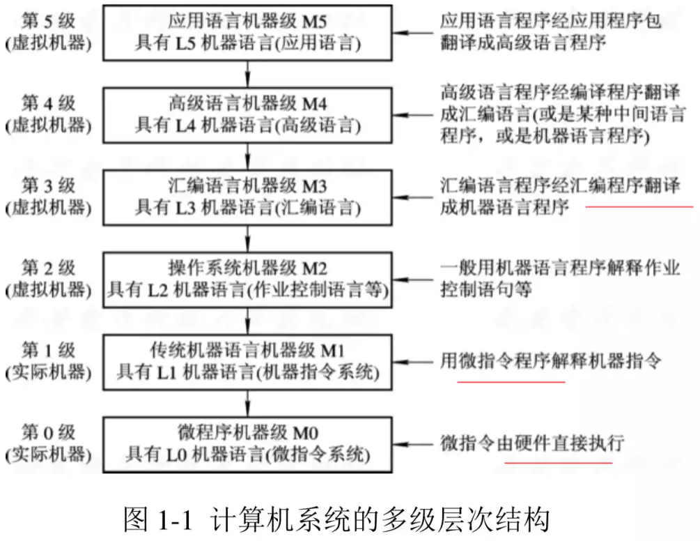

- **计算机系统结构的定义和内涵**
  - 从计算机系统的**层次结构**的角度看，系统结构是对计算机系统中**各级界面**的定义集齐上下的**功能分配**
  - 计算机系统的每一级都有自己的**系统结构**
- **系统结构就是要研究对于某级**，哪些属性应**透明**，哪些不应透明。
  - **透明：即如果客观存在的事物或属性从某个角度看不到,则称对它是透明的**
- 计算机系统结构也称为**计算机系统的体系结构**，它指的是层次结构中**传统机器级的系统结构**其**界面之上的功能**包括**操作系统级、汇编语言级、高级语言级和应用语言级**中**所有软件的功能。**
- 界面之下的功能包括**所有硬件和固件**的功能。
- **计算机系统结构是软件和硬件的交界面**

- **计算机系统结构的属性**（属性，那么就是不透明的）
  - 硬件能直接识别和处理的数据类型和格式等的**数据表示**
  - 最小可寻址单位、寻址种类、地址计算等的**寻址方式**
  - 通用/专用寄存器的设置、数量、字长、使用约定等的**寄存器组织**
  - 二进制或汇编级指令的操作类型、格式、排序方式、控制机构等的**指令系统**
  - **主存**的**最小编址单位**、编址方式、容量、最大可编址空间等的**存贮系统组织**
  - **中断的分类与分级、中断处理程序**功能及入口地址等的中断机构
  - **系统机器级的管态和用户态**的定义和切换
  - **输入输出设备**的连接、使用方式、流量、操作结束、出错指示等的**机器级 IO 结构**
  - 系统各部分的**信息保护方式**和**保护机构**

---

#### 例题：透明与不透明

> 例题：1. 下列对应用程序员不透明的是( B )(2012 年单选题)
>
> A.标志符数据表示中的标志符 B.输入输出系统硬件的功能
>
> C.虚拟地址到主存实地址的变换 D.“执行”指令
>
> 解析：对应用程序员来说**只需要知道输入输出系统硬件的功能**，就能进行应用系统的开发，而**标志符、虚地址与实地址如何变换、“执行”指令**均属于**底层机器级所要确定的**问题，对其是透明的。

- 对计算机系统结构，什么是透明的？什么是不透明的？
- 透明：
  - 存储器的模 m 交叉存取、数据总线宽度、阵列运算部件、通道是采用接合器还是独立型、重叠还是流水控制方式、Cache 存储器
- 不透明：
  - 浮点数据表示、1/O 系统是采用通道方式还是外围处理机方式、字符行运算指令、访问方式保护、程序性中断、堆栈指令、存储器最小编址单位
- **总结：透明的，是看不到的。不透明的，是可以看得到的。**

> **计算机系统结构是管不透明的**

- 从机器（汇编）语言程序员看，哪些是透明的？
- 从**机器（汇编）语言程序员**看，实际上就是从**计算机系统结构**看
- 透明
  - 指令缓冲器、时标发生器、乘法器、主存地址寄存器、先行进位链、移位器
- 不透明
  - 指令地址寄存器、条件寄存器、磁盘外设、移位器、通用寄存器、中断字寄存器
- **指令地址寄存器就是程序计数器**，其位数会影响到可执行程序的恐惧大小
- 条件寄存器、磁盘外设、通用寄存器、中断字寄存器**均是汇编语言程序中要用到的**
- 因此，它们对**汇编语言编程都是不透明**的。

> **从汇编上看就是从计算机系统结构上看，但是有 4 个汇编来说需要用到，因此是不透明的**

- 系列机各档不同的数据通路宽度、虚拟存储器、Cache 存储器、程序状态字、“启动 I/O”指令、“执行”指令、指令缓冲寄存器。
- **对系统程序员来说透明的有：**
  - 系列机各档不同的数据通路宽度、Cache 存储器、指令缓冲寄存器
- **对应用程序员透明的有：**
  - 虚拟存储器、程序状态字、“启动 I/O”指令

> 例题：2. 下列对**系统程序员不透明**的是? D
>
> A.Cache 存储器 B.数据通路宽度
>
> C.指令缓冲寄存器 D.虚拟存储器
>
> 例题：3. 下列各项中对**机器语言程序员透明**的是? B
>
> A.中断字寄存器 B.主存地址寄存器
>
> C.通用寄存器 D.条件码寄存器
>
> 例题：4. 下列选项对**机器(汇编)语言程序员透明**的是?C
>
> A．指令地址寄存器 B．通用寄存器
>
> C．先行进位链 D.中断字寄存器
>
> 例题：5．程序状态字对**（）**程序员是透明的，对**（）**程序员是不透明的。
>
> **（应用、系统）**
>
> 例题：6. 浮点数下溢处理的精度损失对**（）**程序和**（）**程序设计者都是透明的。
>
> **（系统、应用）**

---

#### 计算机组成

- 从计算机系统结构的内涵可以看出，机器级内部的**数据流**、**控制流的组成**、**逻辑设计**和**器件设计**等都**不属于计算机系统结构**，就是说，**对计算机系统结构设计是透明的**。它们属于**计算机组成或计算机实现**的范畴。

- **计算机组成**(Computer Organization)指的是**计算机系统结构**的**逻辑实现**，包括机器级内的**数据流**和**控制流**的组成以及**逻辑设计**等。它着眼于机器级内各事件的**排序方式**与**控制机构**、各部件的功能及各部件间的联系。计算机组成设计要**解决的问题**是在所希望达到的性能和价格下，怎样**最佳、最合理**地把各种设备和部件组织成计算机，以实现所确定的系统结构。

> 例题：7. 主存的逻辑结构属于( B )
>
> A.计算机实现 B.计算机组成
>
> C.计算机系统结构 D.计算机应用
>
> 解析：逻辑结构，那么就属于计算机组成。根据计算机系统结构的属性，**主存的容量、编址方式等属于计算机系统结构**，为达到性能价格要求，**主存速度为多少或者逻辑结构是否采用多体交叉属于计算机组成**。所以 B 选项正确。

---

#### 计算机实现

- 计算机实现指的是计算机组成的**物理实现**。包括处理机、主存等部件的**物理结构**，器件的集成度和速度，器件、模块、插件、底板的划分等。
- **计算机实现**的设计**着眼于器件技术**和**微组装技术**，具中，**器件技术**起着指导作用。

> [例] **指令系统的确定属于**计算机系统结构。**指令的实现**，如取指令、指令操作码译码、计算操作数地址、取数、运算、结果等的操作安排和排序属于**计算机组成**。
>
> 实现这些指令功能的具体**电路器件的设计**及**装配技术**属于**计算机实现**。
>
> 确定指令系统中**是否要设置乘法指令**属于计算机系统结构。
>
> **乘法指令是用专门的高速乘法器实现**，还是靠**用加法器和移位器**经连一串时序信号控制其相加和右移来实现，属于计算机组成。
>
> **乘法器、加法移位器的物理实现**，如器件的类型、集成度、数量、价格，以及**微组装技术**的确定和选择属于计算机实现。

- **主存容量与编址方式**（按位、按字节，还是按字访问等）的确定属于计算机系统结构，为达到性能价格要求，**主存速度**应该为多少，以及**逻辑结构是否采用多体交叉**属于计算机组成。**主存器件的选定、逻辑设计、微组装技术**的使用属于计算机实现。
- **设计何种系列机属于计算机系统结构**，而**系列内不同型号**计算机的组织属于计算机组成。
- **数据总线宽度对程序员是透明的，是不需要知道的。**

---

- 计算机系统**结构、组成和实现**的相互关系和影响

  - **相同系统结构，可以有不同的组成**
  - **一种组成可以有多种不同的实现方法**
  - **采用不同的系统结构会使可以采用的组成技术产生差异**
  - **组成也会影响结构**

- **注意**：由于计算机组成和计算机实现关系密切，有人将它们称为**计算机实现**，即计算机系统的**逻辑实现和物理实现**
- **结论**：**计算机系统结构设计的任务**是进行软硬件的**功能分配**，确定**传统机器级**的软、硬件界面

---

### 软、硬件取舍、性能评测、定量设计原理

- **基本原则**
  - **软、硬件的功能分配是计算机系统结构的主要任务**，而软件和硬件在逻辑功能上又是等效的。从原理上讲，**软件的功能可以用硬件或固件完成。硬件的功能可以用软件模拟完成**，只是它们在性能、价格、实现的难易程度上是不同的。
  - 在**满足应用的前提下，软、硬件功能分配的比例**主要看能**否充分利用硬件、器件技术的进展**，使系统**有高的性能价格比**。
- 原则 1：
  - 在现有硬件、器件的条件下，**系统要有高的性能价格比**
- 原则 2：
  - 要考虑准备采用和可能采用的**组成技术**，使之尽可能不要过多或不合理地限制各种组成、实现技术的采用。
- 原则 3：

  - 不能仅**从“硬”的角度**考虑如何便于应用组成技术的成果和便于发挥器件技术的进展，**还应从“软”的角度**把如何为编译和操作系统的实现以及如何为高级语言程序的设计提供更多、更好的硬件支持放在首位。

- **软、硬件功能分配比例对计算机系统性能的影响**

  - 一般来说，**提高硬件功能的比例可提高解题速度**，减少程序所需的存储空间，**但会增加硬件成本，降低**硬件利用率和计算机系统的**灵活性及适应性**。
  - **提高软件功能的比例**可**降低硬件成本，提高系统的灵活性、适应性**，但**解题速度会下降**，软件设计费用和所需的存储量将增加。

- 计算机系统的软、硬件功能分配比例

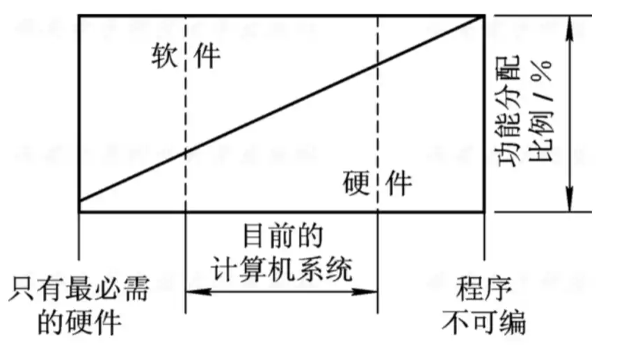

> 例题：8. 简述软、硬件功能分配比例对计算机系统性能的影响。
>
> 答：（1）提高硬件功能的比例可**提高解题速度**，减少程序所需的存储空间，(1 分)但会增加硬件成本、降低硬件利用率，(1 分)**降低**计算机系统的**灵活性和适应性**。 (1 分)
>
> （2）提高软件功能的比例**可降低硬件成本**，(1 分)**提高系统的灵活性、适应性**，(1 分)但**解题速度会下降**，软件设计费用和所需的存储器用量增加。(1 分)

> 例题：9. 简述软、硬件取舍的基本原则。
>
> 答：（1）应考虑在现有硬件、器件的条件下系统要有**高的性能价格比**，(1 分)主要从实现**费用、速度和其它性能要求**来综合考虑；(1 分)
>
> （2）要考虑到准备采用和可能采用的**组成技术**，(1 分)使之尽可能不要过多或不合理地限制各种**组成、实现技术的采用**；(1 分)
>
> （3）不能仅**从“硬”的角度**考虑如何便于应用组成技术的成果和便于发挥器件技术的进展，(1 分)还要**从“软”的角度**把如何为编译和操作系统的实现以及为高级语言的设计提供更多、更好的硬件支持放在首位。(1 分)

- **定量设计原理**
- 在设计计算机系统时，应该遵循如下的定量设计原理：
- **哈夫曼(Huffman)压缩原理**
  - **尽可能加速处理高概率的事件**远比加速处理概率低的事件对性能的提高要显著。
- **阿姆达尔(Amdahl)定律**
  - **Amdahl 定律表明了性能提高量的递减规律**，如果**只对系统中的一部分**进行性能改进，改进得越多，整体性能提高的增量却越小。
  - 也就是说，**提高系统的整体性能应是各部分性能均能平衡地得到提高**，不能只是其中某个功能部件性能的提高。
- **程序访问的局部性定律**
  - 程序访问的局部性包括了**时间上和空间上的两个局部性**。
  - **时间上的局限性**是指**现在正使用的信息**可能不久还要使用，因为程序存在着**循环**
  - **空间上的局限性**是指**最近的将来要用的信息**很可能与**现在正在使用的信息在程序位置上是邻近的**，因为指令通常是**顺序存放、顺序执行**的。

---

### 系统设计主要任务和方法

- **计算机系统设计主要任务**

  - **主要任务包括系统结构、组成和实现的设计**，包括软硬件功能分配、计算机指令系统设计、功能组织、逻辑设计、集成电路设计等多方面的问题。
  - **计算机系统设计**首先要根据**市场和应用**情况，确定**用户**对计算机系统的**功能、性能和价格**的要求。
  - 其中，**应用软件对功能的确定起主要作用。**

- **计算机系统的设计方法**
- **自上而下**的设计
  - 先考虑如何满足**应用要求**
- **自下而上**的设计
  - 不考虑应用要求，只**根据目前能用的器件**来设计上层的机器级
- **从中间向两边**的设计
  - **这是目前通用机一般采用的方法**。
  - 它可以克服“自上而下”和“自下而上”两种设计方法中，软、硬件设计分离和脱节的致命缺点。
- 随着**VLSI(超大规模集成电路, Very Large Scale Integration)技术**的迅速发展，**硬件价格的不断下降**，软件却日益变得复杂，软件设计时间和费用在不断增大，加上对软件基本单元操作不断深入的认识，促使软、硬件界面在上升，即现有**软件功能将由硬件完成**，或者说**硬件为软件设计提供了更多的支持**。

---

### 软件、应用、器件的发展对系统结构的影响

- **软件、应用、器件的发展对系统结构的影响**

  - 程序设计者一般不愿意在短时间里按新的系统结构、新的指令系统去重新设计软件。为此，在系统结构设计时，提出应在新的系统结构上解决好软件的可移植性问题。

- **软件的可移植性(Portability)**指的是**软件不修改或只经少量修改**就可由一台机器移到另一台机器上运行，同一软件可应用于不同的环境。

- **实现软件移植的技术**主要有：

  - 统一高级语言
  - 采用系列机
  - 模拟和仿真

- **仿真和模拟**的主要区别在于**解释用的语言**。
  - **仿真是用微程序解释**，其解释程序存在于**控制存储器**中
  - **模拟是用机器语言程序解释**，其解释程序存在于**主存**中

> 例题：10. 简述软件移植中采用系列机途径的办法及优点。
>
> 答:（1）方法：在软、硬件界面上设定好一种**系统结构**，(1 分)**软件设计者**按照此**设计软件，硬件设计者**根据机器**速度、性能、价格**的不同，(1 分)**选择不同器件、硬件和组成、实现技术**，研制并提供**不同档次的机器**。(1 分)
>
> （2）优点：较好地**解决了软件环境要求相对稳定和硬件、器件技术迅速发展的矛盾**(1 分)**软件环境相对稳定**就可不断积累、丰富、完善软件，使软件产量、质量不断提高，(1 分)同时又能不断**采用新的器件和硬件技术**，使之短期内即可提供新的、性能不断提高的机器。(1 分)

> 例题：11．简述系列机思想对计算机发展的意义和系列机软件兼容的要求。
>
> 答:（1）系列机可以较好地解决软件设计环境要求**相对稳定**和硬件、器件组成等技术在**迅速发展**的矛盾;(2 分)
>
> （2）软件可以丰富积累，使软件产量、质量不断提高;(1 分)
>
> （3）器件、硬件和组成又能不断更新，使之短期内就能提供出性能良好、价格更便宜的新机器,有力地促进计算机的发展(1 分)
>
> （4）系列机**软件兼容的基本要求**是必须**保证实现软件的向后兼容**，(1 分)**力争做到向上兼容**。(1 分)

> 例题：12. 用微程序直接解释另一种机器指令系统的方法称为？B
>
> A.编译 B.仿真 C.翻译 D.模拟
>
> 例题：13. 下列不属于软件移植技术的是？D
>
> A.统一高级语言 B.采用系列机
>
> C.模拟 D.编译
>
> 例题：14. 计算机仿真是用**（）**解释，其解释程序存储于**（）**中。P42
>
> **（微程序、控制存储器）**
>
> **例题：15. 简述模拟和仿真的区别？P42**

---

- **应用的发展对系统结构的影响**
- 计算机工业**在处理性能和价格的关系**上大致是**两种趋势**
  - 维持价格
  - 提高性能维持性能
  - 降低价格
- 从**系统结构的观点**看
  - 各型计算机性能随时间的推移其实就是**在低档(型)机上引用甚至照搬高档(型)机的结构和组成**
- **计算机应用**可归纳为向上升级的 4 类
  - 数据处理
  - 信息处理
  - 知识处理
  - 智能处理

---

- **器件的发展对系统结构的影响**
- 器件的发展改变了**逻辑设计**的传统方法
- 器件的发展**加速了结构的“下移”**。大型机的各种数据表示、指令系统、操作系统很快出现在小、微型机上。器件的发展**加速了大规模、高性能并行处理机** MPP (MassivelyParallel Processor )**等新系统结构的发展**。
- **器件的发展促进了：算法、语言、软件的发展**

---

### 并行性开发及计算机系统的分类

- **并行性的概念和开发**
- **器件技术**尤其是**微电子技术**的迅速发展是**促进计算机和系统性能迅速改进**的关键和基础。

- **并行性的含义：**
  - **并行性:** (parallelism)是指在同一时刻或是同一时间间隔内完成两种或两种以上性质相同或不相同的工作。
  - 实际上，**并行性包括同时性与并发性**
  - **同时性: **(simultaneity)是指两个或多个事件在**同一时刻发生**。
  - **并发性：**(concurrency)是指两个或多个事件在**同一时间间隔内发生**的并行性。
- **并行的级别：**
  - 从计算机系统中**执行程序的角度**来看，**并行性等级**从低到高可以分为**四级**：
    - **指令内部、指令之间、任务或进程之间、作业或程序之间**
  - 从计算机系统中**处理数据的并行性来看**，并行性等级**从低到高**可以分为：
    - **位串字串、位并字串、位片串字并、全并行**
    - 2 个串是最低的，全并，是最高的
  - **并行性**是贯穿于**计算机信息加工**的各个步骤和阶段的，从这个角度来看，并行性等级又可分为：
    - **存储器操作并行、处理器操作步骤并行、处理器操作并行、指令任务作业并行**
- **并行性的开发途径**
  - 开发并行性的途径有：**时间重叠、资源重复、资源共享**等。
  - **一：时间重叠**
    - **在并行性概念中引入时间因素，即多个处理过程在时间上相互错开，轮流重叠地使用同一套硬件设备的各个部分，以加快硬件周转而赢得速度。**
  - **时间重叠流水（并发）**
    - 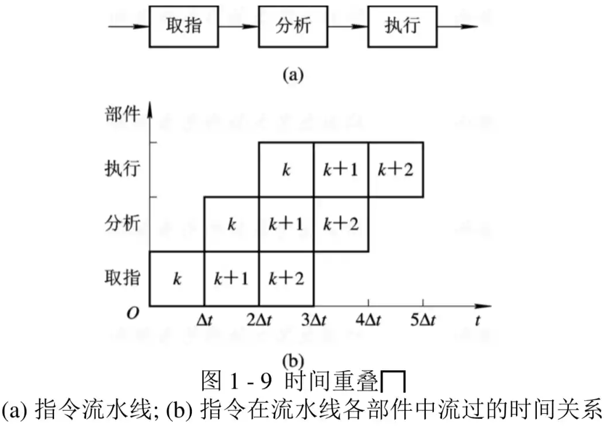
  - **二：资源重复**
    - **在并行性概念中引入空间因素，通过重复设置硬件资源，可以大幅度提高并行处理能力。**
  - **三：资源共享**
    - 它是指**多个任务按一定时间顺序轮流使用同一套硬件设备，这样既降低了成本，又提高了计算机设备的利用率。**
  - **时间重叠是实现并行性中的并发性。**
  - **资源重复是实现并行性中的同时性。**

#### 例题：并行性

> 例题：16. 提高计算机系统并行性的主要技术途径有**时间重叠、资源重复、资源共享**。(2012 年填空题)，P48。
>
> 例题：17. 从**计算机信息加工**的各个步骤和阶段的角度来看，并行性等级最低的是：B。P47-p48
>
> A.处理器操作步骤并行 B.存储器操作并行
>
> C.处理器操作并行 D.指令、任务作业并行
>
> 例题：18. 从计算机系统中处理数据的角度来看，并行性等级最低的是：C
>
> A.位并字串 B．位片串字并 C．位串字串 D.全并行
>
> 例题：19. 下列选项中，不是并行性开发途径的是：A。P48
>
> A．器件改进 B．时间重叠 C．资源重复 D．资源共享
>
> 例题：20. 从计算机**执行程序的并行性**看，由低到高的并行性等级可分为**（）**、指令之间、**（）**、作业或程序之间四级。
>
> **（指令内部、任务或进程之间）**
>
> 例题：21. 从计算机处理数据的角度来看，并行性等级从低到高依次为**（）**、位并字串、**（）**和全并行。
>
> **（位串字串、位片串字并）**
>
> 例题：22. 开发并行性的途径主要有**（）**、**（）**和时间重叠。P48
>
> **（资源共享、资源重复）**

> 例题：23. 简述提高计算机系统并行性技术的三个途径。
>
> （1）**时间重叠**是在并行性概念中引入**时间因素**，(1 分)让多个处理过程在时间上**相互错开**，轮流使用**同一套硬件设备**的各个部分以加快硬件的周转来赢得速度;(1 分)
>
> （2）**资源重复**是在并行性概念中引入**空间因素**，(1 分)通过**重复设置硬件资源**来提高可靠性或性能;(1 分)
>
> （3）**资源共享**是用软件的方法，(1 分)让多个用户按一定的时间顺序**轮流使用同一套资源**来提高**资源利用率**从而提高系统的性能。(1 分)

---

### 计算机系统的分类

- **FLynn 弗林分类法**
- 从**并行性的角度**对计算机系统分类的方法有很多种。
- **先给出如下定义**
  - **指令流**(instruction stream)———机器执行的指令序列。
  - **数据流**(data stream)———由指令流调用的数据序列，包括输入数据和中间结果。
  - **多倍性**(multiplicity)——在系统最受限制的元件上同时处于同一执行阶段的指令或数据的最大可能个数。
- **按照指令流和数据流两种不同的组合**，把计算机系统的结构分为以下四类：
  - **单指令流单数据流 SISD**(Single Instruction Stream SingleDatastream)
  - **单指令流多数据流 SIMD**(Single Instruction StreamMultiple Datastream)
  - **多指令流单数据流 MISD**(Multiple Instruction StreamSingle Datastream)
  - **多指令流多数据流 MIMD**(Multiple Instruction StreamMultiple Datastream)
  - 方法：
    - 单：S。多：M。
    - 指令流：I。数据流：D
    - 随意组合

> CU：控制部件。PU：处理机。MM：主存模块。SM：共享主存。
>
> IS：指令流。CS：控制流。DS：数据流

- a：SISD，b：SIMD

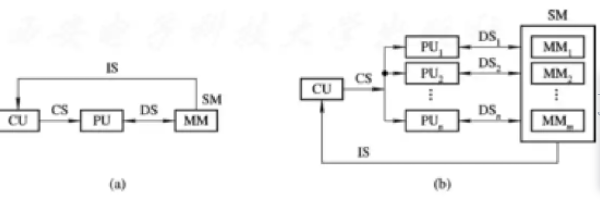

- c：MISD，d：MIMD

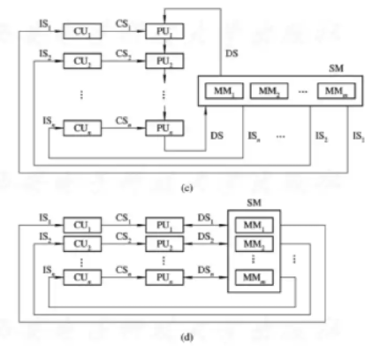

> 例题：24. 按弗林(Flynn)提出的计算机系统分类方法，并行处理机属于**（）**系统。(2012 年填空题)
>
> **（SIMD）**
>
> 解析：**并行处理机又叫 SIMD 计算机**。它是**单一控制部件控制下的多个处理单元**构成的阵列，所以又称为**阵列处理机**。

---

### 总结

- **第一章选择、填空、简答**
- 实现软件移植的技术有哪些、仿真和模拟的区别，经常考
- 并行性的含义、级别、开发途径，经常考
- 计算机系统的分类，经常考

- 一：领会一台完整的通用计算机系统可以被看成是由多个不同机器级构成的多级层次结构每一-级都可以看成是一台机器，都有其自己的机器语言和实现方法。
- 二：领会计算机系统结构、计算机组成和计算机实现三者的定义、各自研究的方面和内容。
- 三：识记一个功能分别用软件和硬件实现的优点和缺点，在功能分配中，软、硬件比例取舍的 3 个原则。
- 四：领会系统结构设计为什么要解决好软件的可移植性。
- 五：领会应用和器件的发展对系统结构设计的影响。
- 六：识记并行性的定义、并行性的二重含义及开发并行性级别高低的顺序。

---

## 第二章 数据表示、寻址方式和指令系统

### 数据表示

- **（1）数据表示**指的是能由计算机硬件**识别**和**引用**的**数据类型**，表现在它有对这种类型的**数据**进行操作的**指令**和**运算部件**。
  - 例如，当机器设置有**定点加、减、乘、除、移位、比较**等一系列定点运算指令和相应的运算硬件，可以直接对定点数进行各种处理时，机器就有了**定点数据表示**。
- 当机器设置有**逻辑加、逻辑乘、按位相加、逻辑移位**等一系列逻辑运算指令和相应的逻辑运算硬件，可以直接对逻辑数进行各种处理，机器就有了**逻辑数据表示**。
  - 若机器设置有**浮点运算指令**(如浮点加、减、乘、除、比较、存、取等)和相应的运算硬件，可以直接对浮点数进行各种处理，机器就有了**浮点数据表示**。
- **（2）串、队、栈、向量、阵列、链表、树、图等是软件系统所要处理的各种数据结构**，它们反映了面向应用所要用到的各种数据元素或信息单元之间的结构关系。因此，**数据结构和数据表示是软、硬件的交界面**。
  - **系统结构设计者在确定软、硬件的功能分配时**，应考虑在机器中**设置哪些数据表示**，以便对应用中所遇到的数据结构能有高的实现效率。当然，这是以花费适当的硬件为代价的。所以，**数据表示的确定实质上是软、硬件的取舍问题**。
  - 计算机的**运算类指令**和**运算器结构**主要是按计算机有什么样的**数据表示**来确定的。通用机上，**定点、浮点、逻辑、十进制、字符串等基本数据表示**和**变址操作**一般都具备。

> 例题：1. **数据表示现在**它有对计算机硬件识别和引用类型的数据进行操作的**（）**和**（）**。P54
>
> **（指令、运算部件）**
>
> 例题：2. **数据表示**指的是能由计算机硬件**（）**和**（）**的数据类型。P54
>
> **（识别，引用）**
>
> 例题：3. 计算机的**运算类指令**和**（）**结构主要是按计算机有什么样的**（）**来确定的。P55
>
> **（运算器，数据表示）**

---

#### 高级数据表示

- **高级数据表示**

  - **自定义数据表示**
  - **向量、数组数据表示**
  - **堆栈数据表示**

- **自定义数据表示**

- 包括：**标志符、数据描述符。**

- **带标志符的数据表示**

  - **高级语言用类型说明语句指明数据的类型**，让数据类型直接与数据本身联系在一起，运算符不反映数据类型，是通用的。
  - 例如 FORTRAN 程序中，实数(浮点数)I 和 J 的相加是采用如下的语句组指明的:
  - REALI,JI=I+J

  - 为了缩短高级语言与机器语言的语义差距，可以让机器中每个数据都**带类型标志位**
    - 无符号数：64+32+8=104
    - BCD 码（带类型标志位）：0110=6；1000=8；所以就是 68
    - 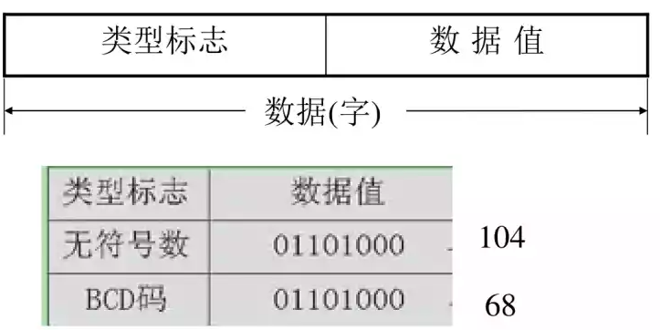
  - **标志符数据表示的优点：**
    - （1）**简化了指令系统**和程序设计。
    - （2）**简化了编译程序**。
    - （3）便于实现**一致性校验**。
    - （4）能由硬件**自动完成数据类型的变换**。
    - （5）支持了数据库系统的实现**与数据类型无关**的要求。
    - （6）为**软件调试和应用软件**开发提供了支持。

- **数据描述符**
- 为进一步**减少标志符所占存储空间**，对**向量、数组、记录等数据**，由于**元素属性相同**，因此发展出**数据描述符**等。
  - **数据描述符与标志符的区别**:
    - **标志符与数据合存于一个存储单元中，用于描述单个数据的类型和属性**（作用于一个数据）﹔
    - **而描述符则和数据分开存放**，用于描述所要访问的数据是**整块的**还是**单个的**，访问该**数据块**或**数据元素**所要的地址以及其他信息。

* **向量、数组数据表示**
* 含义：有序排列的数据元素称为**向量**(向量数据)
* **向量数据的三要素:**
  - **基地址**：存放第一个向量数据的地址
  - **向量长度**：向量数据个数
  - **位移量**：与基地址的距离
* 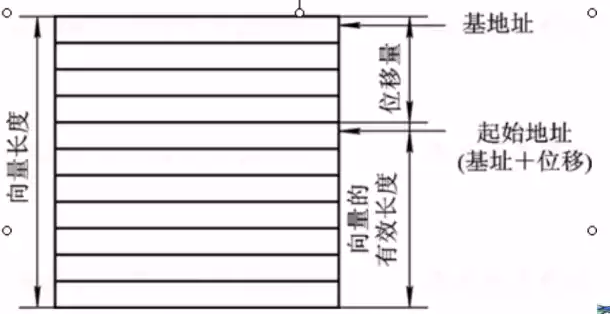

- **堆栈数据表示**
  - 堆栈数据结构在编译和子程序调用中很有用，为了高效实现，不少机器都设有堆栈数据表示。**有堆栈数据表示**的机器称为**堆栈计算机**
- **堆栈计算机表现于**

  - （1）有**高速寄存器组成**的**硬件堆栈**，使堆栈的**访问速度是寄存器的，容量是主存的**
  - （2）有丰富的**堆栈指令**，直接对堆栈中的数据进行各种运算
  - （3）有力地支持**高级语言程序**的**编译**
  - （4）有力地支持**子程序的嵌套和递归调用**

- **数据表示的原则**
- 原则一
  - 看系统的**效率**是否有显著提高，包括**实现时间和存储空间**是否有显著减少;实现时间是否减少又主要看**主存和处理机之间传递的信息量**是否减少
- 原则二
  - 看引入这种数据表示后，其**通用性和利用率**是否提高。如果**只对某种数据结构的实现效率高**、而对其他数据结构的实现效率低，或**应用较少**，将导致**性价比下降**。

> 例题：4. 自定义数据表示包括标志符数据表示和：B。P55
>
> A.标题数据表示 B.数据描述符
>
> C.向量数据表示 D.堆栈数据表示
>
> 例题：5. 下列选项中属于高级数据表示的是：A。P55-57
>
> A.向量 B.定点数 C.逻辑数 D.字符串
>
> 例题：7. 下列选项中，属于高级数据表示的是：D。P55
>
> A．定点数据表示 B．浮点数据表示
>
> C．逻辑数据表示 D.标志符数据表示

> 例题：8. 简述堆栈计算机的概念及其特点。P60
>
> （1）有**堆栈数据表示**的机器称为堆栈机器;(1 分)
>
> （2）有**高速寄存器组成的硬件堆栈**使，堆栈的**访问速度是寄存器的，容量是主存的**;(2 分)
>
> （3）丰富的**堆栈指令**直，接对堆栈中的数据进行各种运算;(1 分)
>
> （4）有力地支持高级语言**程序的编译**;(1 分)
>
> （5）有力地支持子程序的**嵌套和递归调用**。(1 分)

---

#### 浮点数

- **浮点数尾数基值的选择**
  - 当机器字长相同时，**用浮点数**表示实数比**用定点数**表示有更大的**可表示数范围**。不少机器都采用类似图 2-7 所示的格式表示一个浮点数。
  - 但由于机器**字长**有限，浮点数只能表示出数轴上分散于正、负两个区间上的**部分离散值**，如图 2-8 所示。
    - 图 2-7：浮点数的一般表示格式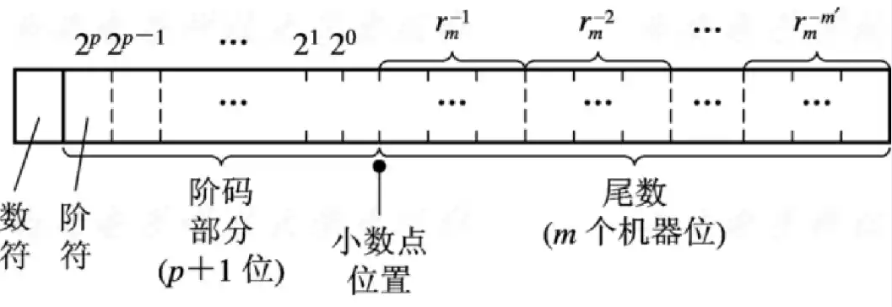
    - 图 2-8：浮点数可表示实数域中的值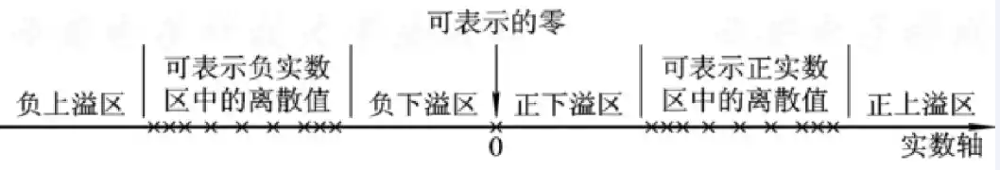
  - **浮点数阶值的位数 p**
    - 主要影响两个可表示区的大小，即**可表示数的范围大小**，
  - **尾数的位数 m**
    - 主要影响在可表示区中能表示值的**精度**
  - 当总的计算机**字长**定好后，浮点数表示中**p 和 m**的**位数**主要是根据数的**表示范围**和**精度**来确定的
  - 然而，当阶值位数 p 一定时，**尾数**采用什么**进制**都会影响到数的**可表示范围**、**精度**及数在数轴上分布的**离散程度**。
  - 在计算机中**阶码都采用二进制**
- $r_m$：表示**浮点数位数的基**。可以理解为是几进制（二进制就是 2，十进制就是 10）
  - $r_m$ 进制的**数位**是用 $[log_2r_m]$ 个计算机位数来表示的。
  - **！！向上取整！！3.1=4**
  - 当尾数的计算机尾数为 $m$ 时，相当于 $r_m$ 进制的位数有 $m'$ 个位数
  - $m' = m/[log_2r_m]$
  - 例如：$r_m=2$ 时 $m'=m$
    - $r_m=8$ 时 $m'=m/3$
    - $r_m=10$ 时 $m'=m/4$
    - $r_m=16$ 时 $m'=m/4$
- **规格化正尾数**

  - 所谓**规格化正尾数**，就是**正尾数**小数点后的第 **1** 个 $r_m$ 进制数位不是 **0** 的数。
  - 因为尾数为全 0 的数是机器零，不作为计算机中可表示的数。
  - 所以，**最小正尾数值**应当是 $r_m$ 进制尾数的小数点后第 1 个 $r_m$ 进制数位为“1”，其余数位为全“0”的数值，即$1 * r_m ^{-1}$。
  - 可表示的最大尾数值应当为 $1-r_m^{-m'}$ 。最大阶值为 $2^p-1$ 。
  - 可表示的浮点数**规格化数**的**总个数**应当是可表示**阶**的个数与可表示**尾数**的个数的**乘积**

- **采用尾基为$r_m$的浮点数表示的特性**

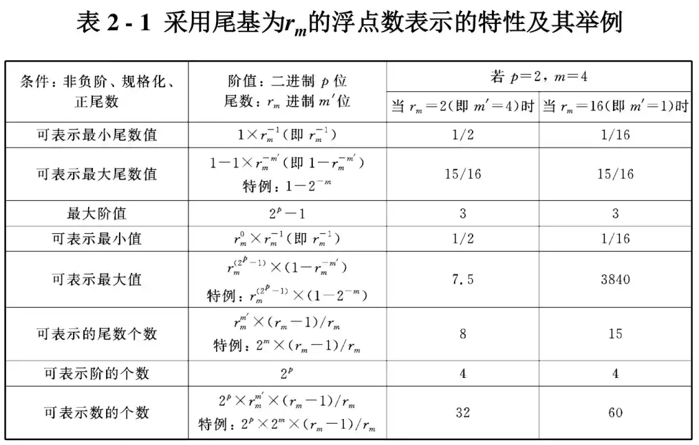

- 可表示数的范围
  - 随 $r_m$ 的增大，可表示数的最小值 $r_m^{-1}$ 将减少
- 可表示数的个数
  - $2^{p+m}*(1-r_m^{-1})$
  - 其中 $2^{p+m}$ 为常数，所以 $r_m$ 的增大将会使得 $(1-r_m^{-1})$ 增大，从而**使表示数的个数增多**
- 数在数轴上的分布
  - $r_m$ 用 16，比用 2 的时候，**可表示的数在数轴上的分布要稀**
- 可表示的精度
  - $r_m$ 越大，**分布越稀，精度下降**
- 运算中的精度损失
  - $r_m$ 越大，尾数右移的机会越小，精度的损失越小
- 运算速度
  - $r_m$ 增大，运算速度提高
- 总结
  - **尾数基值取大，会扩大浮点数的表示范围，增加可表示数的个数，减少移位次数，降低右移造成的精度损失和提高运算速度**。但其也会**降低数据的表示精度，数值的分布变稀。**

#### 浮点数例题

> 例题：9. 浮点数系统使用的阶基$r_p$=2，阶值位数 P=2，尾数基值$r_m$=10,以$r_m$为基的尾数，位数 m'=1。在非负阶、正尾数、规格化情况下，试计算:
>
> (1)最小尾数值;(2)最大尾数值;(3)最大阶值;(4)可表示的最小值;(5)可表示的最大值;(6)可表示数的个数。
>
> 答案：
>
> （1）最小尾数值：$r_m^{-1}=10^{-1}=0.1$
>
> （2）最大尾数值：$1 - r_m^{-m'}=1-10^{-1}=0.9$
>
> （3）最大阶值：$2^p-1=2^2-1=3$
>
> （4）可表示的最小值：$r_m^{-1}=10^{-1}=0.1$
>
> （5）可表示的最大值：$r_m^{2^p-1} * (1 - r_m^{-m'})=10^{3}*(1-10^{-1})=900$
>
> （6）可表示数的个数：$2^p*r_m^{m'} * (r_m-1)/r_m=4*10*9/10=36$

> 例题：10. 浮点数表示中，当阶值位数一定时，不会受到尾数进制影响的是：B。P62
>
> A．精度 B．数符 C．范围 D．离散程度
>
> 例题：11. 正尾数小数点后的第 1 个$R_m$进制数位不为 0 的数称为：A。P63
>
> A．规格化正尾数 B．有效正尾数
>
> C．定点正尾数 D．单精度正尾数
>
> 例题：12. 浮点数系统使用的阶基 r,=2，阶值位数 P=2，尾数位数 m=4,尾数基值 rm=2 时，在非负阶正尾数、规格化的情况下可表示最大值是：。p63 最大值=$r_m^{2p-1}*(1-r_m^{m'})$
>
> A. 7.5 B.6.5 C. 5.5 D.4.5
>
> 例题：13. 浮点数尾数的基值 $r_m$ =8，尾数的计算机位数 m =8 位，可表示的尾数的个数为：A。P63
>
> A.2^3×7 B.2^4×7 C.2^5×7 D.2^6×7
>
> 例题：14. 浮点数阶值的位数主要影响可表示数的**（）**大小，而尾数的位数主要影响可表示区中能表示值的**（）**。P62
>
> **（范围、精度）**
>
> 例题：15. 所谓规格化正尾数，就是正尾数小数点后的第**（）**个 $r_m$ 进制数位不是**（）**的数。P63
>
> **（1、0）**
>
> 例题：16. 可表示的浮点数规格化数的总个数应当是可表示**（）**的个数与可表示**（）**的个数的乘积。P63
>
> **（阶、尾数）**
>
> 例题：17. 浮点数尾数基值 $r_m$ =16，除尾符之外的尾数机器位数为 8 位时，可表示的规格化最大尾数数值为：D。P63
>
> A.1/ 2 B. 15/ 16 C. 1 / 256 D. 255/ 256
>
> 解析：$1-r_m{-m'} = 1-16^{-2}=255/256$
>
> 例题：18. 浮点数尾数基值$r_m$=8，尾数数值部分长 6 位，可表示的规格化最小正尾数为：C。
>
> A.0.5 B.0.25 C.0.125 D.0.015625
>
> 解析：$r_m^{-1}=1/8$
>
> 例题：19. 例:浮点数尾数基值$r_m$=8，尾数数值部分长 6 位，可表示规格化正尾数的个数是：A。
>
> A. 56 个 B.63 个 C..64 个 D.84 个
>
> 解析：$r_m^{m'}*(r_m-1)/r_m=64*7/8=56$
>
> 例题：20. 浮点数尾数基值$r_m$=8，以 rm 为基的尾数位数 m'=2，则可表示的规格化最大尾数值为：D。
>
> A.1/64 B.1/8 C.7/8 D.63/64
>
> 解析：$1-r_m^{m'}$
>
> 例题：21. 浮点数系统使用的阶基 r,=2，阶值位数 P=2，尾数基值$r_m$=10，以$r_m$为基的尾数位数 m '=1，在非负阶正尾数、规格化情况下的最小尾数值为：B。 P62-63
>
> A.0.5 B.0.1 C.0.01 D.0.05
>
> 解析：基值$r_m=10$，规范化最小正尾数为：1/$r_m$
>
> 例题：22. 浮点数系统使用的阶基 rp=2，阶值位数 P=2，尾数基值$r_m$=10，以$r_m$为基的尾数位数 m'为 1，在非负阶正尾数、规格化情况下的最大尾数值为：D。P63
>
> A.0.1 B.0.2 C.0.5 D.0.9
>
> 解析：$1-r_m^{-m'}$

---

#### 浮点数尾数下溢处理方法

- 减少运算中的精度损失关键是要处理好运算中尾数超出字长的部分，使之精度损失最小。
- **截断法**
  - 实现简单，不增加硬件，不需要处理时间
  - **将尾数超出的部分截取。**
- **舍入法**
  - 增加硬件很少，最大误差小，**平均误差接近于 0**
- **恒置"1"法**
  - 平均误差趋于 0，实现简单，不增加硬件，不需要处理时间。
  - 缺点是**最大误差最大，比截断法还大**
- **查表舍入法**
  - **平均误差可调节到 0，是最好的方法**
  - 缺点是**硬件量大**
- 计算机组成设计必须解决好数的**下溢处理**，因为这种**精度损失**对**系统程序和应用程序设计者都是透明的。**

> 【例题】23. 四种浮点数尾数下溢处理方法中，实现最简单的方法是：A。
>
> A.截断 B.舍入法 C.恒置“1”法 D.查表舍入法

---

### 寻址方式

- **寻址方式的三种面向**
- 计算机将**主存、寄存器、堆栈**分类编制
- 分别有：
  - **面向主存、面向寄存器、面向堆栈**的寻址方式
- **面向堆栈的寻址方式主要访问堆栈**，少量访问主存或寄存器
- **面向主存的寻址方式主要访问主存**，少量访问寄存器

> 例题：24. **寻址方式**指的是指令按什么方式寻找(或访问)到所需的操作数或信息的，具有分别面向**（）**、**（）**和**（）**的寻址方式。(2012 填空题)，P69
>
> **（主存、寄存器、堆栈）**

- **寻址方式在指令中的指明**
- 有两种不同的指明
  - **占用操作码来指明**
  - **不占用操作码**、而是在地址码部分设置专门的寻址方式字段。
- **程序在主存中的定位技术**
  - **逻辑地址**是**程序员编程**用的地址。主存**物理地址**是程序在主存中的**实际地址**。
  - **静态再定位**
    - 装入**主存**时，将**逻辑地址**变换并修改成**物理地址**
  - **动态再定位**
    - 装入主存时，指令不能修改，将主存的起始地址存入寄存器，程序执行时，将逻辑地址加上基址即可形成物理地址。
    - 基址寻址与变址寻址原理相似。**变址寻址**是对诸如**向量、数组等数据块**的支持，以便于实现程序的**循环**。**基址寻址**是对**逻辑地址**空间到**物理地址**空间变换的支持，以利于实现程序的**动态再定位**。
  - **虚实地址映像表**
    - 程序空间可以超过实际主存空间，通过虚实地址映射来定位。

> 例题：25. 程序员编写程序时使用的地址是：C。P70
>
> A.主存物理地址 B.有效地址 C.逻辑地址 D.基址

---

### 指令系统的设计和优化

---

- **指令系统基本原则**
- 指令系统设计包括：**指令的功能、指令格式**的设计
- 基本原则
  - 是否有利于**满足系统的基本功能**
  - 是否有利于**优化计算机的性能价格比**
  - 是否有利于**指令系统今后的发展和改进**
- **编译程序设计者要求指令系统应设计具有：**

  - 规整性
  - 对称性
  - 独立性和全能性
  - 正交性
  - 可组合性
  - 可扩充性

- **指令操作码的优化**
- 指令是由**操作码**和**地址码**组成
- 指令格式的优化就是指如何**用最短的位数**来表示指令的**操作信息**和**地址信息**，是程序中指令的**平均字长最短**。
- 因此有两种办法：
  - **哈夫曼编码**
    - **对发生概率最高的事件采用最短的位数(时间)来表示(处理)**，而对出现概率较低的事件允许用较长的位数(时间)来表示(处理)，使得表示平均位数(时间)缩短。
  - **扩展操作码编码**
    - **扩展操作码编码**是界于定长二进制编码和完全的哈夫曼编码之间的一种编码形式，操作码不是定长的，但只有有限几种码长，仍利用**短码表示高概率**的信息，**长码表示低概率的信息**。但必须遵守**短码不能是长码的前缀**的原则。
- **重点：操作码的短码不能是长码的前缀，扩展操作码的编码不唯一，平均码长也不唯一。**

---

### 指令系统的发展和改进

- 在机器**指令系统的设计、发展和改进**上有**两种不同的途径和方向**
  - 一种是如何进一步**增强原有指令的功能以及设置更为复杂的新指令**来取代原先由软件子程序完成的功能，实现软件功能的硬化。按此方向设计的计算机称为**CISC(ComplexInstruction Set Computer，复杂指令集计算机)。**
  - 另一种是如何通过**减少指令种数和简化指令功能来降低硬件设计的复杂度，提高指令的执行速度**，按此方向设计的计算机称为**RISC(Reduced Instruction Set Computer，精简指令集计算机)**
- **CISC**
  - 三个方面进行改进：**面向目标程序的优化、面向高级语言的优化、面向操作系统的优化**
  - **按静态使用频度改进指令系统**着眼于减少目标程序所占用的**存储空间**，按**动态使用频度**改进指令系统着眼于减少目标程序的**执行时间**。
  - 指令系统的改进是以**不删改**原有指令系统为前提的，通过增加少量**强功能**新指令代替常用指令串。
- CISC 的问题
  - 指令系统**庞大**
  - **操作繁杂、执行速度很低**
  - 高级语言编译程序选择目标指令的**效率降低**
  - 各指令的**使用频度都不会太高**
- **RISC 基本原则**
  - 一：确定指令系统时，**只选择使用频度很高的那些指令**，在此基础上增加少量能有效支持操作系统和高级语言实现及其他功能的最有用的指令，让指令的条数大大减少，**一般不超过 100 条**。
  - 二：大大**减少指令系统可采用的寻址方式的种类**，一般**不超过两种**。简化指令的格式，使之也限制在两种之内，并让全部指令都具有相同的长度。
  - 三：让所有指令都在**一个机器周期内完成**。
  - 四：**扩大通用寄存器的个数**，一般不少于 32 个寄存器，**以尽可能减少访存操作**，所有指令中只有存(STORE)、取(LOAD)指令才可访存，其他指令的操作一律都在寄存器间进行。
  - 五：为提高指令执行速度，**大多数指令都采用硬联控制实现**，少数指令采用微程序实现。
  - 六：通过**精简指令和优化设计编译程序**，以简单有效的方式来支持高级语言的实现。
- **设计 RISC 结构采用的基本技术**
  - 按**设计 RISC 的一般原则**来设计
  - **逻辑实现采用硬联和微程序相结合。**
  - 在 CPU 中**设置大量工作寄存器**并采用**重叠寄存器窗口**
- **采用 RISC 技术的好处**
  - 一：**简化了指令系统设计**，适合 VLSI（超大规模集成电路）实现。
  - 二：提高了机器的**执行速度和效率**。
  - 三：**降低了设计成本**，提高了系统的**可靠性**。
  - 四：可直接**支持高级语言**的实现，**简化编译程序**的设计。

> 例题：26. RISC 采用重叠寄存器窗口技术，可以减少：C。p90
>
> A.绝大多数指令的执行时间 B.目标程序的指令条数
>
> C.程序调用引起的访存次数 D.CPU 访存的访问周期
>
> 解析：在 CPU 中**设置大量工作寄存器并采用重叠寄存器窗口**，可以**减少访存**，尽量让指令的操作在寄存器之间进行，以提高执行速度，缩短指令周期。
>
> 例题：27. 在机器指令系统的设计、发展和改进上有**（）**和**（）**两种不同的途径和方向。P83
>
> **（CISC、RISC）**
>
> 例题：28. 按**静态使用频度**改进指令系统着眼于**减少**目标程序所占用的**（）**，按**动态使用频度**改进指令系统着眼于减少目标程序的**（）**。P84
>
> **（存储空间、执行时间）**
>
> 例题：29. 指令系统的改进是以**（）**原有指令系统为前提的，通过增加少量**（）**新指令代替常用指令串。P85
>
> **（不删改、强功能）**
>
> 例题：30. 简述 CISC 存在的问题。P89
>
> 例题：30. 简述 RISC 的基本原则。P89

---

### 总结

- 本章重点
  - **浮点数尾数基值的选择和下溢处理，自定义数据表示，寻址方式**，再定位技术，操作码优化，指令字格式化，**RISC 思想**及基本技术。
- 本章难点

  - **浮点数尾数基值选择，指令字格式的优化设计。**

- 数据表示的概念和高级数据表示有哪几种，要了解
- 浮点数尾数计算，要熟悉
- 寻址方式，要熟悉
- RISC 思想和基本技术，要熟悉
- **计算题：**
  - 浮点数

---

## 第三章 存储、中断、总线与 I/O 系统

### 存储系统的基本要求和并行主存系统

- **存储系统的基本要求**
- 对存储系统的基本要求是：**大容量、高速度、低价格**
- （1）存储器的**容量**：$S_M = W * 1 * m$
  - W：存储体的**字长**，**1**：存储体的**字数**，**m**：并行工作的**存储体数**
- （2）**速度**可以用**访问时间**$T_A$、**存储周期** $Tm$ 和 **频宽（带宽）**、$B_M$：`最大带宽`
  - 对于单体的存储器 $B_M = W/T_M$，**m 个存储体的最大带宽：**
  - $B_M = W * m / T_M$
- （3）可用总价格 C 和每个价格 c 来表示
  - $c = C/S_M$
- 为了弥补**CPU**与**存储器**在速度上的差异，一条途径是在组成上引入**并行**和**重叠**技术，构成**并行主存系统**，但单靠这一种方式效果是有限。

> 例题：1. 设主存采用**模 m**多分体交叉存取，每个分体的存取周期为$T_m=2us$，要求主存**实际频宽为 8MB / s**，但实际频宽只能达到最大频宽的**0.6 倍**。2016.10
>
> （1）若分体宽度**W=4 字节**，则主存模数应取多少才能满足要求?（m 取 2 的幂）
>
> 解析：采用这个公式：$B_M = W * m / T_M$（2 分），W=4，$T_M=2$，求 m，
>
> $8<= 0.6*4*m/2$，m>=6.667。这里之所以乘 0.6，是因为实际频宽只能达到最大频宽的**0.6 倍**。
>
> （2）若主存**模数为 8**，则分体宽度应为多少才能满足要求?
>
> 解析：主存最大频宽：$B_M = W * m / T_M$（2 分）
>
> $8<=0.6*W*8/2$，W>=3.333，因此分体宽度取 4 字节

- 并行主存系统

> 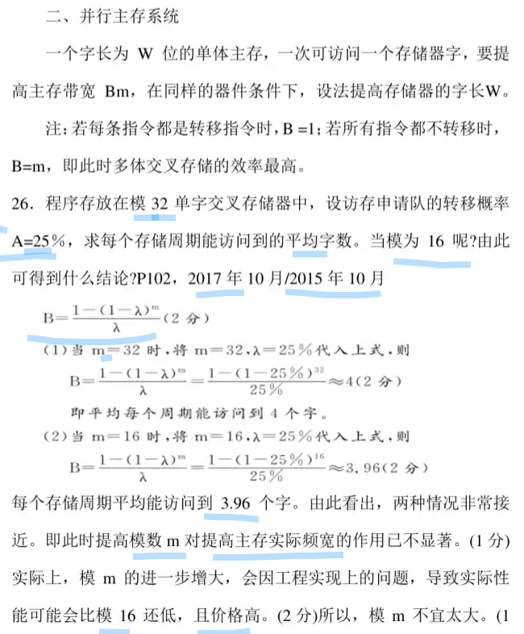

---

### 中断系统

- **CPU 中止正在执行的程序，转去处理随机提出的请求**，待处理完后，**再回到原先被打断的程序**继续恢复执行的过程称为**中断**。
- 中断分为**内部中断、外部中断和软件中断**三类。

- **中断的分类**
- **引起中断的各种事件**称为**中断源**。中断源向中断系统发出请求中断的申请，称为**中断请求**。
  - 同时可能有多个中断请求，这时中断系统需要按事先确定的**中断响应优先次序**对优先级高的中断请求予以响应。
- 所谓**中断响应**就是允许其中断 CPU 现行程序的运行，转去对该请求进行预处理，包括保存好断点现场，调出有关处理该中断的中断处理程序，准备运行。
- **中断分为六类**，IBM370 系统分的
  - **中断分成机器校验中断**
  - **管理程序调用(访管)中断**
  - **程序性中断**
  - **外部中断**
  - **输入/输出中断**
  - **重新启动中断**

> 例题：2. 除数为 0 引起的中断属于：A。P103
>
> A.程序性中断 B.外部中断 C.机器校验中断 D.输入/输出中断
>
> 解析：程序除以 О 为软中断或程序中断，非 CPU 内的异常或外部的中断信号引起，所以答案应该为 A。
>
> 例题：3. 以 IBM370 系统为例，中断一般可以分成**（）**、**（）**、**（）**、**（）**、**（）**、**（）**。
>
> **（中断分成机器校验、管理程序调用(访管)、程序性、外部、输入/输出和重新启动）**

- **中断的分级**

  - 由于中断源**相互独立**而随机地发出**中断请求**，因此常常会同时发生多个中断请求。
  - **当同时发生多个中断请求时**，同一类的中断请求由其**软件**或**通道**来管理，而不同类的中断就要根据中断的**性质、紧迫性、重要性以及软件处理的方便性**把它们分成不同的级别。**优先级从高到低为第 1 级，第 2 级，第 3 级**，...

- **中断系统的软、硬件功能分配**
- **中断系统的功能**包括中断请求的保存和清除、优先级的确定、中断断点及现场的保存、对中断请求的分析和处理以及中断返回等。
- **中断系统**主要要有高的中断**响应速度**和中断处理的**灵活性**。这些全是由**中断响应硬件**和**中断处理程序**共同完成的。
- 因此，**中断系统的软、硬件功能分配**实质上就是**中断处理程序软件**和**中断响应硬件的功能分配**。

> 例题：4. 实现中断响应次序的器件称为：B。P105
>
> A.计数器 B.排队器 C.定时器 D.触发器
>
> 解析：中断响应的次序用排队器硬件实现，次序是由高到低固定的。
>
> 例题：6. 下列属于外部中断的是：C。P103
>
> A．主存访问方式保护中断 B．寻址超过主存容量中断
>
> C．定时器中断 D．指令和数据格式出错中断
>
> 例题：7. 下列选项中，属于 IBM370 系统外部中断的是：B。 P103
>
> A．访问中断 B．定时器中断 C．重新启动中断 D. frO 中断
>
> 例题：8. IBM370 系统将中断的类型分为：D。P103
>
> A.3 类 B.4 类 C.5 类 D.6 类
>
> 例题：9. 中断可分为的种类数为：B。p103
>
> A. 2 类 B.3 类 C.4 类 D.5 类
>
> **（内部中断、外部中断和软件中断）**
>
> 例题：10. 实现中断响应次序的器件称为：B。P105
>
> A.计数器 B.排队器 C.定时器 D.触发器
>
> 解析：中断响应的次序用排队器硬件实现，次序是由高到低固定的。
>
> 例题：11. **主存出错**引起的中断类型属于：A。P103
>
> A.机器校验中断 B.访管中断 C.程序性中断 D.外中断
>
> 例题：12. 计算机**外部中断**不包括：A。p103
>
> A.机器校验中断 B.定时器中断 C.外部信号中断 D.中断键中断
>
> 例题：13. IBM 370 系统中，**通道动作故障**引起的中断属于：A。P103
>
> A.机器校验中断 B.访管中断 C.程序性中断 D.IO 中断
>
> 例题：14. 中断可分**（）**、**（）**和**（）**三类。P103
>
> **（内部中断、外部中断、软件中断）**
>
> 例题：15. 中断系统的**软、硬件功能**分配实质上是中断**（）**和中断**（）**的功能分配。P107
>
> **（处理程序软件、响应硬件）**
>
> 例题：16. 中断系统的性能主要是要有高的中断**（）**和中断处理的**（）**。P107
>
> **（响应速度、灵活性）**

- **例题重点**
- 假设某系统有 4 个中断级，相应地每一级中断处理程序的现行 PSW 中都有 4 位中断级屏蔽位。如果“1”表示**中断开放**，“0"”表示**中断屏蔽**。那么，要让各级**中断处理次序**和**各级中断响应次序**都一样，**都是 1→2→3→4**，就只需按表 3-2 设置好各级中断处理程序现行**程序状态字**中的中断级屏蔽位即可。
- 图解：
  - **中断级屏蔽位就是响应次序**
  - 第一行：**中断处理次序**为第**一**级的时候（打横看），与**响应次序**第一级比，是同级的，因此是**0**。屏蔽位第 2，3，4 级比处理级低，必然是 0
    - 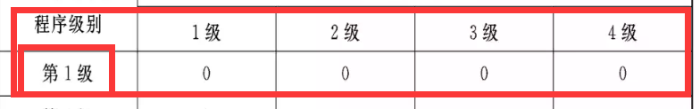
  - 第二行：**中断处理次序**为第**二**级的时候（打横看），与**响应次序**第一级比，**低一级**，因此是**1**。剩下同理
    - 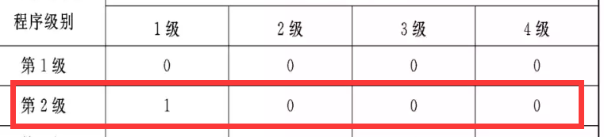

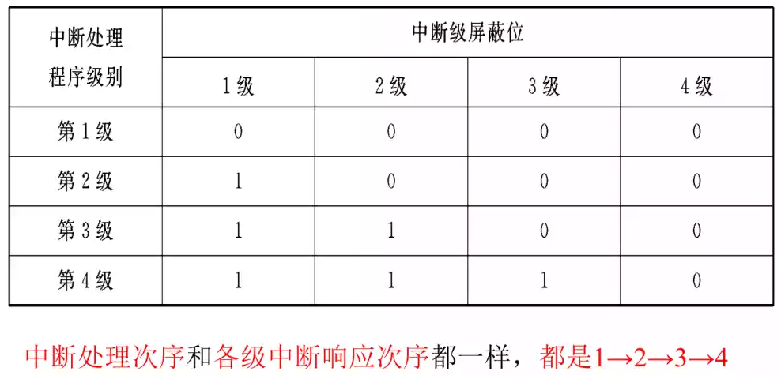

- 下一步，根据表画程序的执行过程
  - 第一步：开始进来，收到 2，3 级，2 级比 3 级高，先执行二级，`回到断点`
  - 第二步：2 级执行到一半，**收到 4 级中断请求**，但是 4 级级别没有 2 高。最后在执行 4
    - 
  - 第三步：收到 2，去到执行 2 级，**但是执行到一半收到 1 级的中断请求**，1 级别比 2 高，然后就去执行 1 级，1 级执行完继续执行 2 级，最后结束
    - 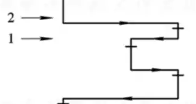
  - `--------------------------`
  - 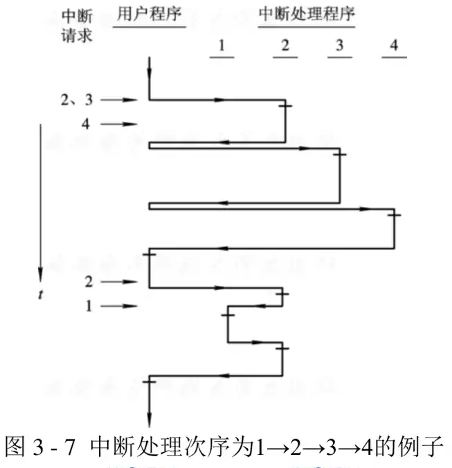
- **中断处理次序改为 1→4→3→2**
  - 第一行：**中断处理次序**第一级，根据中断处理次序（1→4→3→2）的第一位是第 1 级，因此先处理第一级，但是由于是同级的，因此填**0**。剩下就不用管
  - 第二行：**中断处理次序**第二级
    - 根据中断处理次序（1→4→3→2）的第一个是**第 1 级**，因此**响应次序的第一级填 1**
    - 根据中断处理次序（1→4→3→2）的第二个是**第 4 级**，因此**响应次序的第四级填 1**
    - 根据中断处理次序（1→4→3→2）的第三个是**第 3 级**，因此**响应次序的第 3 级填 1**
    - 根据中断处理次序（1→4→3→2）的第四个是**第 2 级**，由于是**同级**的，因此中断，剩下填**0**
  - 第三行：**中断处理次序**第三级
    - 根据中断处理次序（1→4→3→2）的第一个是**第 1 级**，因此**响应次序的第一级填 1**
    - 根据中断处理次序（1→4→3→2）的第二个是**第 4 级**，因此**响应次序的第四级填 1**
    - 根据中断处理次序（1→4→3→2）的第三个是**第 3 级**，由于是**同级**的，因此中断，剩下填**0**
  - 第三行：**中断处理次序**第四级
    - 根据中断处理次序（1→4→3→2）的第一个是**第 1 级**，因此**响应次序的第一级填 1**
    - 根据中断处理次序（1→4→3→2）的第三个是**第 4 级**，由于是**同级**的，因此中断，剩下填**0**

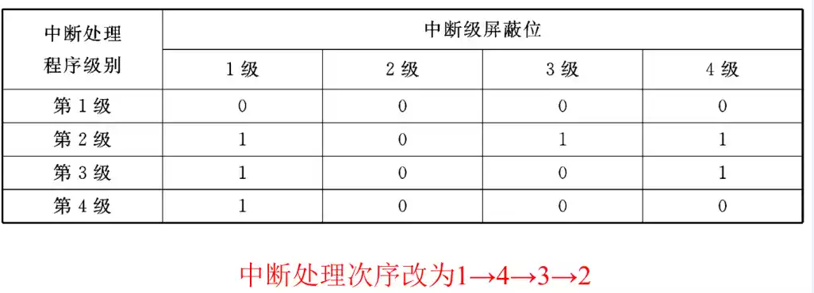

- **执行过程**
  - 第一步：收到 2，3 中断请求，因为 2 级别高，所以然后先去 2 那**响应一下**。然后看下屏蔽位（1→4→3→2），2 在后面，3 在前面。因此就去处理 3
    - 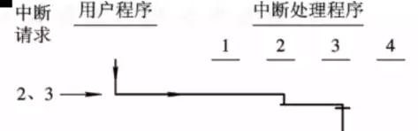
  - 第二步：3 在处理的时候，来了个**中断请求 4**，4 的级别比 3 高，又跑去执行 4 了
    - 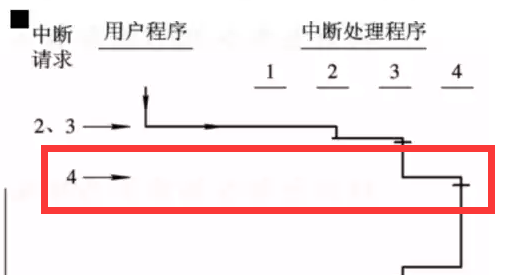
  - 第三步：回来继续执行 3，然后执行 2，然后回到**断点**
    - 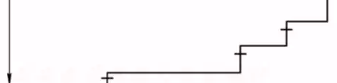
  - 第四步：收到 2，去到执行 2 级，**但是执行到一半收到 1 级的中断请求**，1 级别比 2 高，然后就去执行 1 级，1 级执行完继续执行 2 级，最后结束
    - 

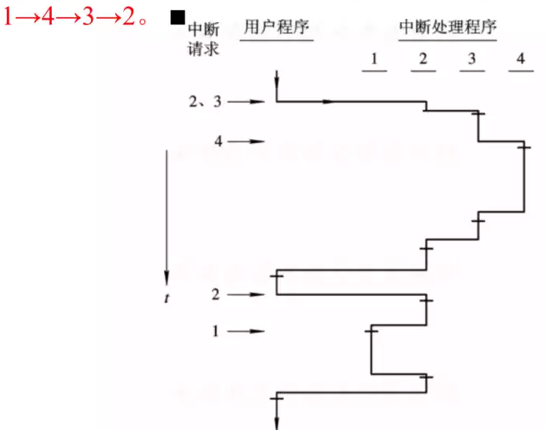

#### 中断系统例题

> 例题：17. 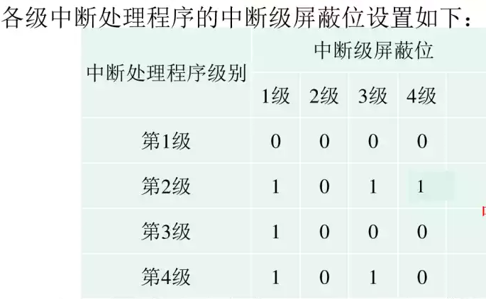
>
> （1）当中断响应优先次序为 1→2 一 3 一 4 时，其**中断处理次序是什么**?
>
> 解析：1342，看图自己想。
>
> 中断处理第二级：先去 1，然后去 3 和 4，然后到自己(2)，那么就可以定下来（1→3 或 4→3 或 4→2）
>
> 中断处理第四级：先去 1，然后去 3，然后到自己(4)结束，那么就可以定下来第二个是 3，第三个肯定是 4（1→3→4→2）
>
> （2）如果所有的中断处理都各**需 3 个单位时间**，中断响应和中断返回时间相对中断处理时间少得多。当机器正在运行用户程序时，同时发生第 2，3 级中断请求，过两个单位时间，又同时发生第 1，4 级中断请求，试画出程序运行过程示意图。
>
> 首先要知道：根据题意，处理一个中断请求需要 3 个单位时间
>
> 开始：收到 2，3 级中断请求，去 2 响应下，然后去执行 3
>
> 二：过了 2 个单位，3 还没处理完毕（处理一个要 3 个单位），**收到 1 和 4**，1 的级别最高那么就去先处理 1
>
> 三：1 处理完回到 3，处理完 3 的最后的一个时间单位（此时已经处理完 1 和 3 看）
>
> 四：（目前待处理的是 2→4）回到 2 那里响应下，发现 3 的级别比 2 高，那么去处理 3，处理完 3 了，就处理 2。
>
> 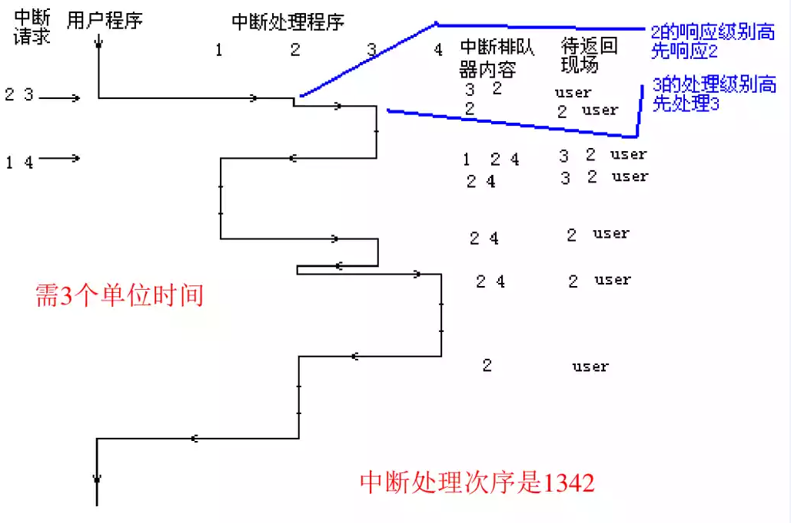

> 例题：18. 若机器共有 5 级中断，中断响应优先次序为 1→2→3→4→5，要求其实际的中断处理次序为 1→4→5→2→3。
>
> （1）设计各级中断处理程序的中断级屏蔽位(令“1”对应于开放，“0”对应于屏蔽，反之也行)
>
> 正：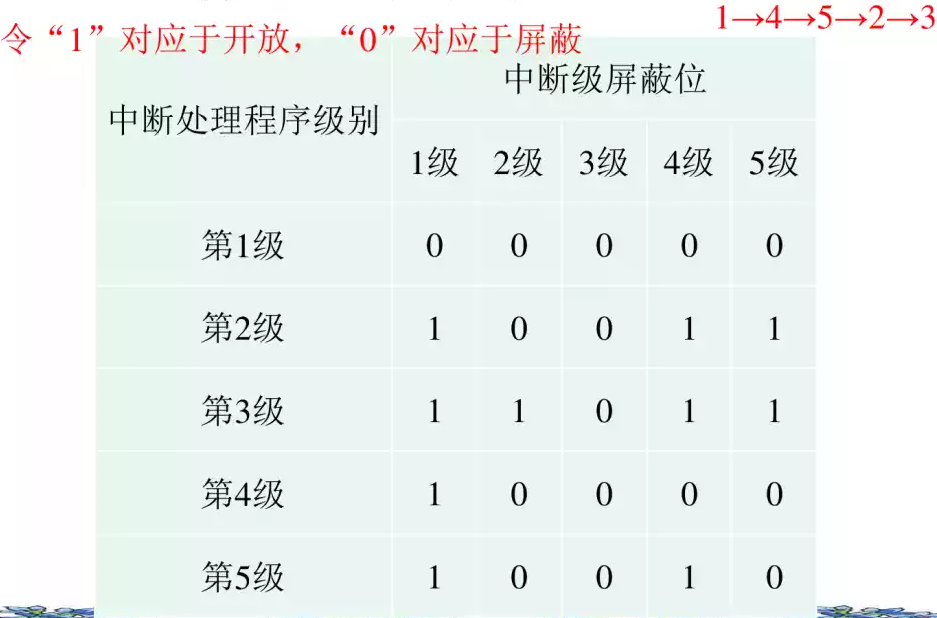
>
> 反：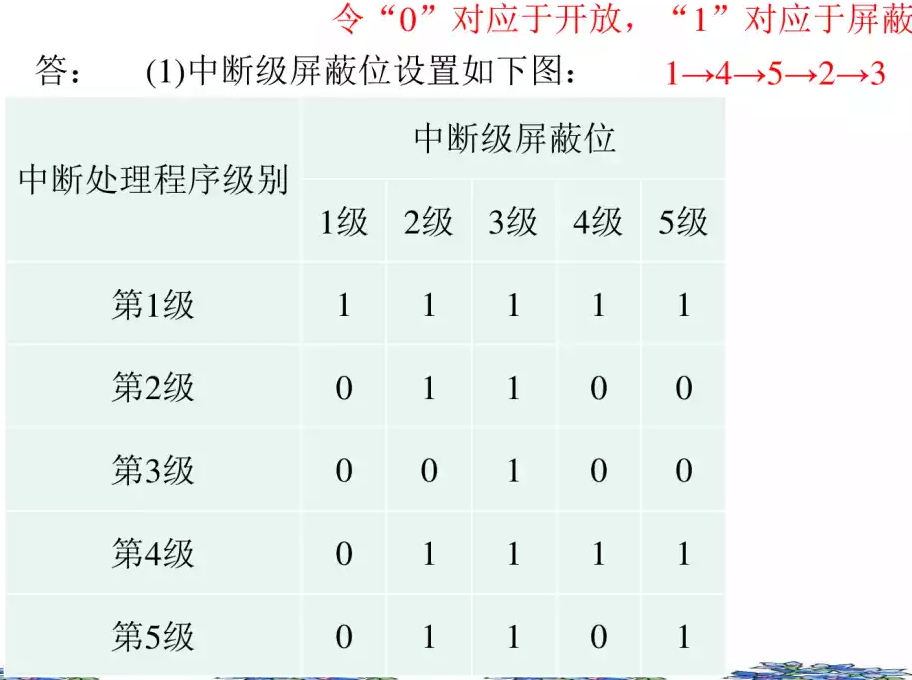
>
> （2）若在运行用户程序时，同时出现第 4，2 级中断请求，而在处理第 2 级中断未完成时，又同时出现第 1，3，5 级中断请求，请画出此程序运行过程示意图。
>
> - **重点：在处理完第 2 级的时候，应该返回用户程序，因为在第一次的中断请求的 4 和 2 已经完成了。**
>
> 

> 例题：19. 机器有 5 级中断，中断响应次序为 1→2→3→4>5，现要求实际中断处理次序为 2→3→1→5→4。
>
> （1）设计各级中断处理程序的中断级屏蔽位的状态，令“0”为开放，“1 为屏蔽"
>
> （2）若运行用户程序时，同时发生 1、3 级中断请求，而在 1 级中断服务未完成时，又发生 2、3、4、5 级中断，请画出处理机执行程序全过程的示意图（标出交换 PSW 的时间)。
>
> - **重点：在 1 级未完成的时候，插入了（2,3,4,5），当完成了第 2 级的时候，回到 1，然后在去完成第 3 级**
>
> 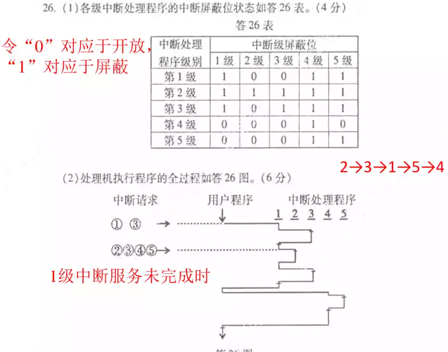

> 例题：20. 机器有 5 级中断，中断响应次序为 1>2→3→4>5，现要求实际中断处理次序为 1→4→5→2→3。
>
> （1）设计各级中断处理程序的中断级屏蔽位的状态，令“0”为开放，“1 为屏蔽"
>
> （2）若运行用户程序时，同时发生 4、2 级中断请求，而在第 2 级中断服务未完成时，又发生 1，3，5 级中断，请画出处理机执行程序全过程的示意图。
>
> 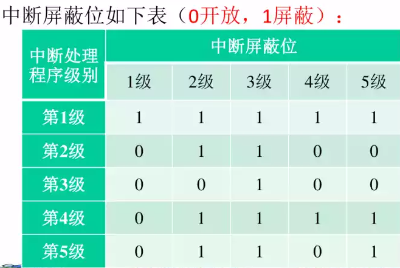
>
> 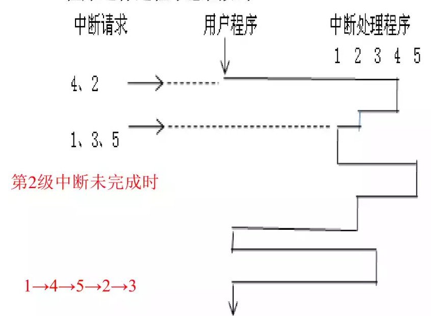

---

### 总线系统

- **总线**的定义
  - 用于互连计算机、CPU、存储器、IO 接口及外围设备间的**信息传送通路**
- **总线的分类**
  - 总线按**在系统中的位置**分为**芯片级**(CPU 芯片内的总线)、**板级**(连接插件板内的各个组件，也称局部总线或内部总线)和**系统级**(系统间或主机与 I/O 接口或设备之间的总线)等 3 级。
  - 就允许信息传送的**方向**来说，总线可以有**单向传输和双向传输两种**。**双向传输**又有**半双向**和**全双向**的不同。
  - 总线按其**用法**可以分成**专用**的和**非专用**的。只连接一对物理部件的总线称为**专用总线**。
  - 如果**N 个部件**用**双向专用总线**在所有可能路径都互连，则需**N×(N —1)/2**组总线。

> 例题：21. 总线按用法可分为**（）**和**（）**两类，P109
>
> **（专用、非专用）**
>
> 例题：22. 若有 8 个部件之间采用双向专用总线互连，则需要的专用总线组数是：C。
>
> A.8 B.16 C.28 D.256
>
> 【解析】根据双向专用总线互连组数计算公式
>
> N\*(N-1)/2，当 N=8 时，共 28 组。所以答案应该为 C。

- **总线的控制方式**
- （1）**集中式控制与分布式控制**
  - 当采用非专用总线时，由于可能发生多个设备或部件同时申请使用总线，就得有总线控制机构来按照某种优先次序裁决，保证在同一时间内只能有一个高优先级的申请者取得对总线的使用权。如果总线控制逻辑基本上集中放在一起，不论是放在连接到总线的一个部件中，还是放在单独的硬件中，都称为**集中式控制**。而当总线控制逻辑分散于连到总线的各个部件中时，就称为分布式总线控制。
- （2）**集中式控制的方式**
  - 集中控制方式可分为**集中式串行链接、集中式定时查询、集中式独立请求，3 种**。
- **集中式串行链接**
  - 优点：**只用 3 根线**就能按一定的优先次序来**实现总线控制**，并很容易扩充。
  - 缺点：对查询链的故障很敏感，如果第 i 个部件中的查询链电路有故障，那么第 i 个以后的部件都不能工作。
  - 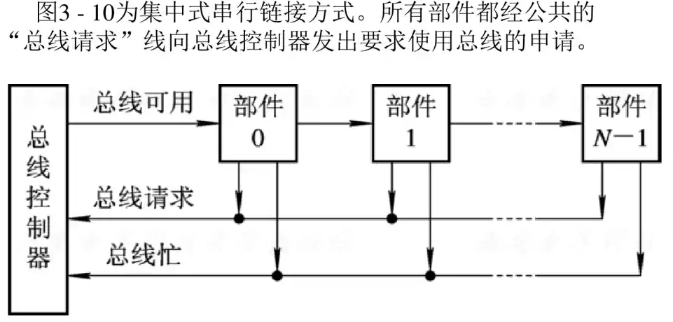
- **集中式定时查询**
  - 总线上的每个部件通过**“总线请求”线**发出请求，若总线处于**空闲**，**“总线忙”**信号**未建立**，则总线控制器收到请求后，让**计数器开始计数**，**定时查询**各部件以确定是谁发的请求。当查询线上的计数值与发出请求的部件号一致时，该部件就**建立“总线忙”**，使得计数器**停止计数**，也即控制器**中止查询**。定时查询方式的**控制线数较多**，对于 n 个部件，共需 $2+[log_2n]$ 根线。
  - 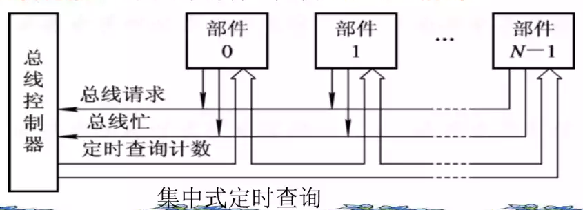
- **集中式独立请求方式**
  - 共享总线的**每个部件**各自都**有一对“总线请求”**和**“总线准许”线**。当部件请求使用总线时，**送“总线请求”信号到总线控制器**。
  - 优点：**响应时间快**，然而这是以**增加控制线数和硬件电路**为代价的。对于**n 个部件**，控制线的数目将达**2n ＋ 1**根。此方式对优先次序的控制也是相当灵活的，它可以预先固定，也可以通过程序来改变优先次序。
  - 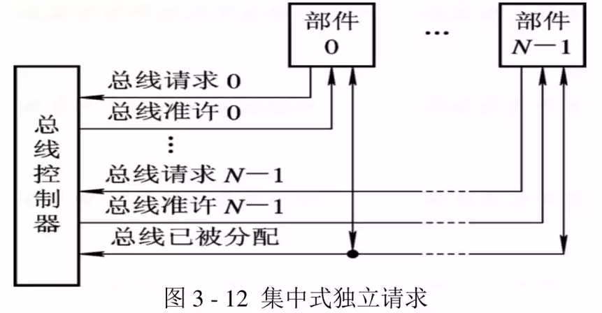

> 例题： 22. 简要举出集中式串行链接，定时查询和独立请求 3 种总线控制方式的优缺点。
>
> 答：
>
> 集中式**串行链接**方式的优点：① 选择算法简单;② 控制总线数少;③ 可扩充性好 ④ 可靠性高。
>
> 集中式**串行链接**方式的缺点：① 对“总线可用”线及其有关电路失效敏感，② 不灵活;③ 总线中信号传送速度慢。
>
> 集中式**定时查询**方式的优点：① 优先次序灵活性强;② 可靠性高。
>
> 集中式**定时查询**方式的缺点：① 控制线数较多;② 扩展性较差;③ 控制较为复杂;④ 总线分配受限于计数信号，不能很高。
>
> 集中式**独立请求**方式的优点：① 总线分配速度快;② 灵活;③ 能方便隔离失效部件的请求。
>
> 集中式**独立请求**方式的缺点：① 控制线数多;② 复杂。

> 例题：23. 简述串行链接总线控制方式的优点
>
> (1)选择算法简单。(1 分)
>
> (2)用于解决总线控制分配的控制线的线数少，(1 分)只需 3 根，且不取决于部件的数量。(1 分)
>
> (3)部件的增减容易，只需简单地把它连到总线上或从总线去掉即可。(1 分)
>
> (4)可扩展性好。(1 分)
>
> (5)由于逻辑简单，容易通过重复设置提高可靠性。(1 分)
>
> 例题：24. 简述总线独立请求控制方式的优点和缺点。P111
>
> 优点:① 总线分配速度快;② 灵活;③ 能方便隔离失效部件的请求。
>
> 缺点:① 控制线数多;② 复杂。
>
> 例题：25. 简述集中式串行链接方式总线的分配过程。P110
>
> (1)所有部件都经公共的“总线请求”线向总线控制器发出要求使用总线的申请;(1 分)
>
> (2)只有当“总线忙”信号未建立时,送出“总线可用”信号，串行送往各部件; (1 分)
>
> (3)未发“总线请求”信号的部件将“总线可用”信号继续传给下一个部件;(1 分)
>
> (4)发过“总线请求”信号的部件停止发送“总线可用"信号;(1 分)
>
> (5)该部件建立“总线忙”信号并去除“总线请求”信号,获得总线的使用权,此次总线分配结束。(2 分)

- **总线系统通信技术**
  - 信息在总线上的传送方法基本上可分为**同步**和**异步**两种。
- **数据宽度**
  - 数据宽度是 I/O 设备取得 I/O 总线后所传送数据的总量。传送完后就释放总线，重新开始分配总线。所以，它不同于前面讲过的数据通路宽度。
  - **数据通路宽度**指的是数据传送的物理宽度，即一个时钟周期所传送的信息量，它**直接取决于数据总线的线数**。
- **总线的线数**
  - **总线的线数越多，成本越高、干扰越大、可靠性越低、占用的空间也越大，当然传送速度和流量也越高。**
    - 此外，总线的长度越长，成本越高，干扰越大，波形畸变越严重，可靠性越低。为此，越是长的总线，其线数就应尽可能减少。数据总线的宽度有一位、一个字节或一个全字或双字等等。
  - **在满足性能要求**以及所用通信类型和速率适配的情况下，**应尽量减少总线的线数**。通过采用**线的组合、编码及并/串―串/并转换**可以减少总线的线数，但这通常会降低总线的流量
  - **总线标准**一般包括**机械、功能、电气及过程（同步）**等 4 个方面的标准。

> 例题：26. 集中式**总线仲裁**方式分为**（）**，**（）**和**独立请求**等三种。P110
>
> **（串行链接、定时查询）**
>
> 例题：27. 总线按在系统中的**位置**分**（）**、**（）**和**系统级**等 3 级。P109
>
> **（芯片级、板级）**
>
> 例题：28. 信息在总线上的传送方法基本上可分为**（）**和**（）**两种。P112
>
> **（同步、异步）**
>
> 例题：29. 总线的集中式**控制方式**主要有集中式**串行链接**、**（）**和**（）**3 种不同方式。P110
>
> **（定时查询、独立请、）**
>
> 例题：30. **双向传输**总线可分为**（）**和**（）**两种。P109
>
> **（半双向、全双向）**
>
> 例题：31. 在满足性能前提下，可以通过用线的**（）**、**（）**及并/串一串/并转换减少总线数量。P114
>
> **（组合、编码）**

> 例题：31. 下列属于**总线标准**的是：D。P114
>
> A.吞吐率 B.速率 C.流量 D.电气
>
> 例题：32. 总线按在系统中的**位置**分的级别数为：A。P109
> A.3 级 B.4 级 C.5 级 D.6 级
> 例题：33. 下列选项中，不属于**减少总线数量**的方法是：D。P114
> A．线的组合 B．编码 C．并/串——串/并转换 D．编程
> 例题：34. 下列**不属于**集中式总线控制优先次序方式的是：B。P110
>
> A.串行链接 B. DMA C.定时查询 D.独立请求
>
> 例题：35. 下列选项中，**不属于**集中式总线控制方式的是：A。P110
>
> A．环形链接 B．串行链接 C．定时查询 D．独立请求
> 例题：36. 总线控制定时查询方式的控制线的**线数**为：C。p111
>
> A. [log2N] B. 1+[log2N] c.2+[log2N] D.3+[log2N]

---

### 输入/输出系统

- **概述**
  - 输入/输出(1/O)系统包括输入/输出设备、设备控制器与输入/输出操作有关的软、硬件。
- 输入/输出系统的发展经历了 3 个阶段，对应 3 种方式
  - **程序控制 I/O 方式**
  - **直接存储器访问(DMA)方式**
  - **I/O 处理机方式**
- 对于**I/O 处理机方式**，又分为**通道(Channel)方式**和**外围处理机(PPU)方式**

> 例题：37. I/O 处理机方式有**（）**方式和**（）**方式。P115
>
> **（通道、外围处理机）**

- **通道处理机的工作原理和流量设计**
- **通道处理机**是 IBM 公司首先提出来的一种**I/O 处理机方式**，曾被广泛用于 IBM 360/370 等系列机上。把对外围设备的管理工作从 CPU 分离出来。
- 工作原理：
  - **访管指令是目态指令**，当目态程序执行到要求输入/输出的访管指令后，产生自愿访管中断。
  - **“启动 I/O”指令**是主要的输入/输出指令，属**管态指令**。
  - 先选择指定的通道、子通道，如它被连通且空闲时，就从主存中取出通道地址字，按通道地址字给出的通道程序首地址，从主存通道缓冲区中取出第一条通道指令。
- 根据**通道数据传送期中信息传送方式**的不同，可分为**字节多路、数组多路和选择 3 类通道。**

> 例题：38. 简述字节多路，数组多路和选择通道的数据传送方式。
>
> 答：**字节多路通道**适用于连接大量的像**光电机**等**字符类低速设备**。它以字节交叉方式轮流为多台设备服务，它可有多个子通道，它们分时进入通道。
>
> ​ **数组多路通道**适合于连接**多台磁盘等高速设备**，每传送一个**定长块就选择一次设备**，多台设备以成组交叉方式工作。它可有多个子通道。它们分时进入通道。
>
> ​ **选择通道方式**适合于**优先级高的磁盘等高速设备**，让它独占通道，数据传送以不定长方式进行，在数据传送期只选择一次设备。

- **通道流量的设计**
- **通道流量**是通道在数据传送期内，**单位时间内传送的字节数**。
- 数据传送期内**选择**一次设备的**时间为** $T_s$ ，**传送一个字节**的时间为 $T_D$ 。
- **字节多路通道**每选择一台设备只传送一个字节，其**通道极限流量**为
  - $f_{max·byte}=1 / (T_s + T_D)$
- **数组多路通道每选择一台设备**就能传送完**K 个字节**。如果要传送**N**个字节，就得分**[N/K]**次传送才行，每次传送都要选一次设备，通道极限流量为
  - $f_{max·block}= K/(T_s+KT_D) =1 / (T_s/K + T_D)$
- **选择通道**每选择一台设备就把**N**个字节全部传送完，通道极限流量为
  - $f_{max·select}= N/(T_s+NT_D) =1 / (T_s/N + T_D)$
- 显然，若通道的$T_s$、$T_D$一定，且**N>K**时，**字节多路方式工作时所能达到的极限流量最小**，数组多路方式工作的居中，**选择方式工作的最大**。

- 由通道工作原理可知，当挂上设备后，设备要求通道的**实际最大流量**与三种通道工作方式有关。
- **字节多路方式**工作的应是**该通道所接各设备的字节传送速率之和**
  - $f_{byte·j} = \sum^{Pj}_{i=1} f_{i*j}$
- **数组多路**是**该通道所接各设备的字节传送速率中之最大值**
  - $f_{block·j}= \max^{Pj}_{i=1} f_{i*j}$
- **选择方式**是**该通道所接各设备的字节传送速率中之最大值**
  - $f_{select·j} = \max^{Pj}_{i=1} f_{i*j}$
- 为了保证第 j 号通道上所挂设备在满负荷的最坏情况下者不丢失信息，必须使设备要求**通道的实际最大流量不超过通道的极限流量**，因此，上述三类通道应分别满足
  - 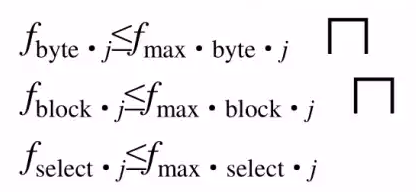

> 例题：39. 如果通道在数据传送期中，选择设备需**9.8 us**，传送一个字节数据需**0.2us**。某低速设备每隔**500us**发出一个字节数据请求，那么至多可接几台这种低速设备?
>
> 对于如下**A-F6 种高速设备**，一次通信传送的字节数**不少于 1024 个字节**，则哪些设备可挂，哪些不能挂?其中，A~F 设备每发一个字节数据传送请求的时间间隔分别如表所示。
> 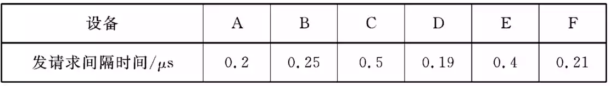
>
> 答：**设备的速率 $f_i$ 实际上就是设备发出字节传送请求的间隔时间的倒数**
>
> （1）$T_s$=选择设备需**9.8us**，$T_D$=传送一个字节数据需**0.2us**，m 台相同设备的速率之和是：$mf_i$，因此为了保证不丢失信息就必须满足**极限速率大于速率之和**：$1/(T_s+T_D)>=mf_i$
>
> 所以得出：$m<=1/(T_s+T_D)*f_i=500us/(9.8+0.2)=50台$
>
> **至多可接 50 台低速设备**
>
> （2）**一次传送**，意味着是**选择通道**，如果有 n 台设备，意味着选择通道的极限流量为：
>
> $f_{max·select}=\frac{1}{\frac {T_s} {n}+T_D}=1/((9.8us/nB)+0.2us/B)$
>
> n 是大于等于 1024 的，试试把 1024 代入计算。结果是 0.20957 因此。**通道上所挂设备的最大速率 $f_{i.max}$ 应小于或等于通道的极限流量。所以，B、C、E、F 可挂在该通道上。A、D 不能。**

> 例题：40. 如果通道在数据传送期中，**选择设备的时间 $T_s$ 为 10us**，**传送一个字节数据需要的时间 $T_D$ 为 0.5us**。(1)某低速设备每隔 500us 发出一个字节数据请求，至多可接几台这种设备?(2)对于题 28 表所示的低速设备，一次通信传送的字节数不少于 1024 个字节，则哪些设备可挂?哪些设备不可挂?201604
>
> 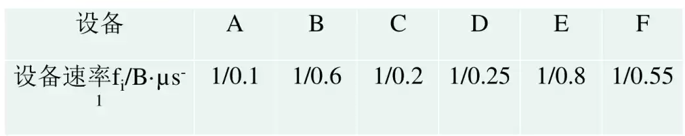
>
> 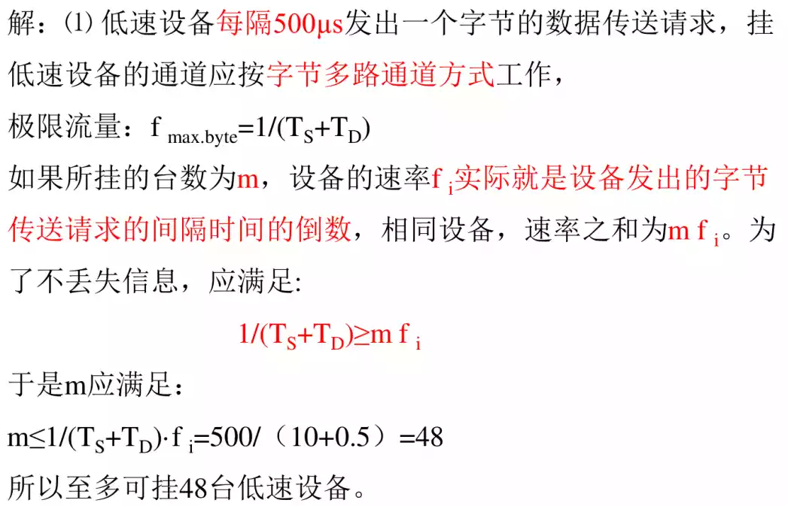
>
> 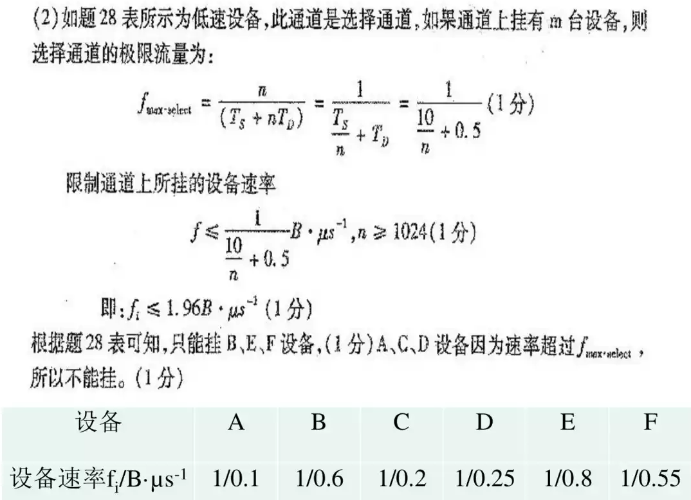

> 例题：41. 设通道在数据传送期内，选择设备需 4.9us，传送一个字节数据需 0.1us。⑴ 某低速设备每隔 250u s 发出一个字节数据传送请求，问至多可接几台这种低速设备?。(2)对于如下 5 种高速设备 A~E，要求字节传送请求的时间间隔如题 28 表所示。若一次通信传送的字节数不少于 1024 字节，问哪些设备可以挂在此通道上﹖哪些不能?
>
> 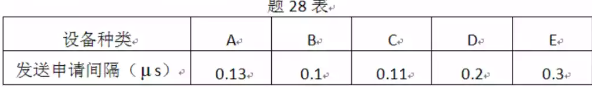
>
> 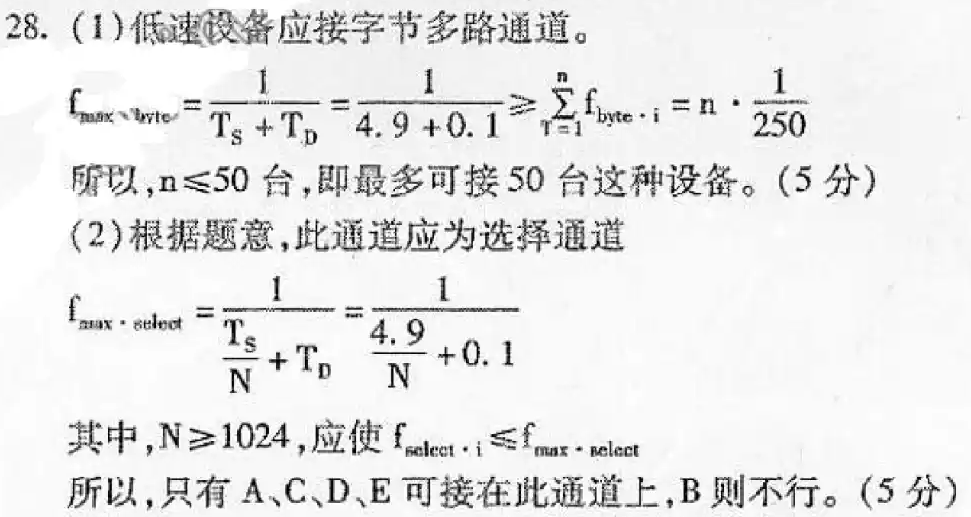

> 例题：42. 有 10 台外设，各设备要求传送信息的工作速率如表所示，现设计的通道在数据传送期，每选择一次设备需 2us，每送一个字节数据需要 0.5us，若用作**字节多路通道**，则：201910
>
> （1）通道工作时的最高流量是多少?
> （2）如果希望同时不少于 5 台设备挂在此通道上，最好多挂一些
> 且高速设备尽量多挂一些，请问应选哪些设备挂在此通道上?为什么?
>
> （3）如果定长块大小为 512B，求通道工作时的最高流量。
>
> （4）请问应选哪些设备挂在此通道上?为什么?
>
> 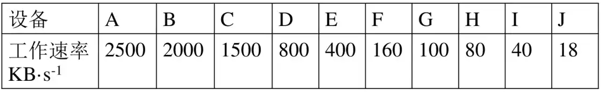
>
> 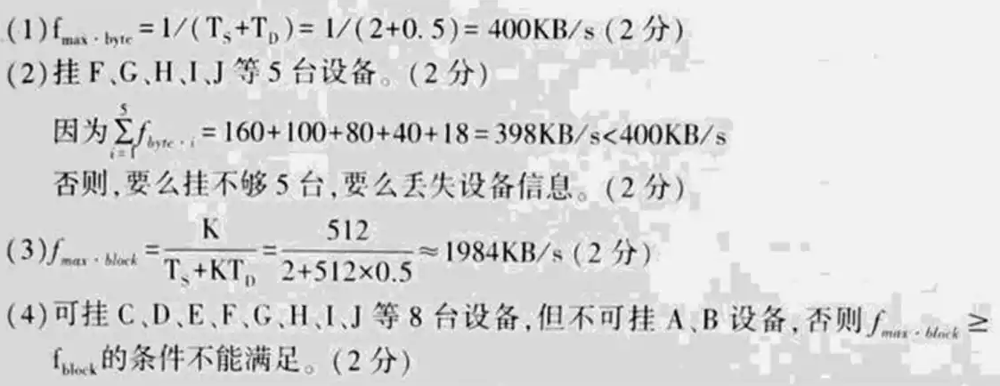

> 例题：43. **简述数组多路通道的数据传输方式**。P119，2016.4
> 答：数组多路通道在每**选择好一台设备后**，要连续传送完固定**K 个**字节的成组数据后，才能释放总线，通道再去选择下一台设备，再传送该设备的 K 个字节。如此，**以成组方式轮流交叉地为多台高速设备服务**。设备要想传送**N 个字节**，就需要先给**【N/K】次申请**使用通道总线才行。
>
> 例题：44. 简述数组多路通道的数据传送方式原理。P119，201904
>
> 答：答:⑴ 数组多路通道适合于连接多台磁盘等高速设备;(2 分)
>
> (2)数组多路通道在每选择好一台设备后，要连续传送完固定 K 个字节的成组数据后，才释放总线;(1 分)
>
> (3)释放总线后通道再去选择下一台设备，再传送该设备 K 个字节;(1 分)
>
> (4)以成组方式轮流交叉地为多台高速设备服务;(1 分)(5)某台设备要想传送 n 个字节，就需要先后经「n/K」次申请总线。(1 分)

---

### 总结

- 本章重点
  - **中断响应次序和中断处理次序的实现，总线控制方式，通道流量计算。**
- 本章难点
  - **绘制中断处理过程的示意图**，通道的**流量设计**，绘制**通道响应和处理**各设备请求的**时空图**。

---

## 第四章 存储体系

- **存储体系及其分支**
  - 存储体系是让构成存储系统的几种不同的存储器之间，配上辅助软、硬件或辅助硬件，使之从应用程序员角度来看，它们在逻辑上是一个整体。
- **虚拟存储器**是因为**主存容量**满足不了要求而提出来的。在**主存和辅存**之间，**增设辅助的软、硬件设备**，让它们构成一个整体，所以也称之为**主存-辅存**存储层次，如图 4- 1 所示。

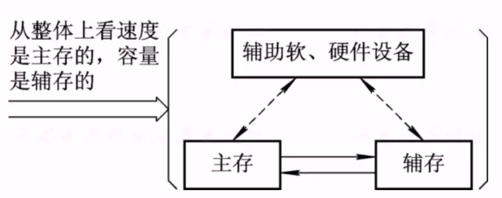

- **虚地址与实地址**
- **应用程序员**可用**机器指令的地址**对整个程序**统一编址**，称该地址为**虚地址**。
- 而把**实际主存地址**称为**实地址**。
- **虚实地址的变换、程序由辅存调入主存**等**对应用程序员来说都是透明的。**

- **Cache 主存的存储层次**
- **从 CPU 看，速度是接近于主存的，容量是辅存的，每位价格是接近于辅存的。**
- 因**主存速度**满足不了要求而引出了**Cache 存储器**。在**CPU 和主存之间**增设**高速、小容量**、每位价格较高的**Cache**，用辅助硬件将其和主存构成整体，如图 4- 2 所示，称之为**Cache 存储器**(或称为**Cache-主存存储层次**)。

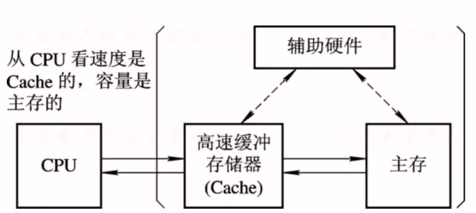

- **存储体系的性能参数**
- **位价格**
  - 设 $c_i$ 为 $M_i$ 的每位价格，$Sm_i$为 $M_i$ 的以位计算的存贮容量，$TA_i$为 CPU 访问到 $M_i$ 中的信息所需要的时间。
  - 为评价存储层次的性能，引入存贮层次的每位价格 c、命中率 H 和等效访问时间 $T_A$。
  - 存储层次的每位价格为：
    - 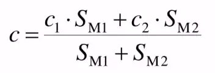
- **命中率**
  - 命中率 H 定义为**CPU 产生的逻辑地址能在 $M_1$ 中访问到(命中到)的概率**。命中率可用实验或模拟方法来获得，即执行或模拟一组有代表性的程序，若逻辑地址流的信息能在 $M_1$ 中访问到的次数为 $R_1$ ，当时在 $M_2$ 中还未调到 $M_1$ 的次数为 $R_2$ ，则命中率:
    - 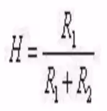

> 例题：1. 系统存储体系的平均成本应取决于：D 。
>
> A.主存的价格 B.Cache 的价格 C.虚存的价格 D.存储系统的位价格

---

### 虚拟存储器

- **虚拟存储器的管理方式**
  - **虚拟存储器**通过增设**地址映像表机构**来实现**程序在主存中的定位**。程序执行时通过**查询映像表**将**程序（虚）地址**变成**实（主）存地址**。根据存储映像算法的不同，可**有多种不同存储管理方式的虚拟存储器**，其中主要有**段式、页式和段页式**三种。
- **段式**管理：**主存按段分配**的存储管理方式。.
  - **程序都有模块性**，一个复杂的大程序总可以分解成多个在逻辑上相对独立的模块。
  - 这些**模块**可以是**主程序、子程序或过程，也可以是数据块**
- **页式**管理：将**主存空间**和**程序空间**机械地分成**固定大小的页**
- **段页式**管理

- **页式虚拟存储器**
- **地址的映像和变化**
  - **地址的映像**是指将每个虚存单元按什么规则(算法)装入(定位于)实(主)存，建立起多用户**虚地址** $N_s$ 与**实(主)存地址** $n_p$ 之间的对应关系。
- **地址的变换**是把**虚地址**变为**实地址**。
- 由于是**把大的虚存空间压缩**到小的**主存**空间，主存中的每一个页面位置应可对应**多个虚页**，能对应**多少个虚页**与采用的**映像方式**有关。
- **页式虚拟存储器**一般都采用让每道程序的**任何虚页可以映像装入到任何实页**位置的**全相联映像**。
- 按**内容**访问的**相联存储器**不同于**按地址**访问的**随机存储器**。

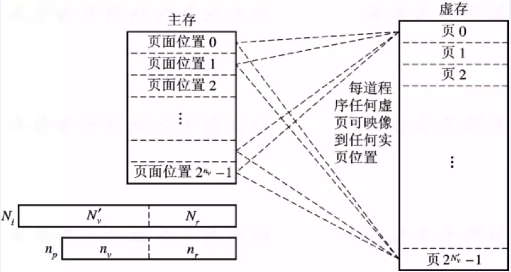

> 例题：2. 虚拟存储器的管理方式有**（）**、**（）**和**（）**。P129
>
> **（段式、页式、段页式管理）**
>
> 例题：3. 页式存储器管理中，与**主存中的每个页面**能**对应多少个虚页**有关的是：D。P134
>
> A.地址 B.存储速度 C.页面号 D.映像方式

### 页面替换算法

- **页面替换算法**
- **当处理机要用到的指令或数据不在主存中时**，会产生**页面失效**，须**去辅存中**将含该指令或数据的一页**调入主存**。
  - 替换算法的确定主要是看按这种替换算法替换**是否有高的主存命中率**，其次要看算法是否便于实现，辅助软、硬件成本是否低。
- 到目前为止，已研究过各种替换算法，如**随机法**、**先进先出法（FIFO）**和**近期最少使用**(近期最久未用过，**LRU**)法、**优化替换算法（OPT）**等。
  - 替换算法一般是通过用典型的页地址流模拟其替换过程，再根据所得到的命中率的高低来评价其好坏的。当然影响命中率的因素除了替换算法外，还因地址流、页面大小、主存容量等不同而不同。

> 例题：4. 设有一道程序，有 1~5 页，执行时的页地址流(即依次用到的程序页页号)为
> 2，3，2，1，5，2，4， 5，3，2， 5，2
>
> 若分配给该道程序的**主存有 3 页**，则图 4- 15 表示 FIFO、LRU、OPT 这 3 种替换算法对这 3 页的使用和替换过程。
>
> 解析：**\***：代表下一个页来的时候，**先替换**。**命中的意思是相同页**。主存只有 3 页。
>
> （1）先进先出 FIFO：**命中了也不管**，反正先进先出。看时间 T5：因为 2 是**先进**的因此先出去。
>
> （2）近期最少使用 LRU：近期 → 最近进来的；最少使用 → 没被使用（命中）过；`（如果没被替换也没被命中，那么还是原来的那个,T11~T12）`
>
> 时间 T4：2 在时间 T2**被命中过**因此，按照先进序列，**2 的后面是 3**，所以**下一个被替换的是 3**
>
> 时间 T8：按照先进序列是 2→4→5，2 先进，同时没被命中过，所以**下一个被替换的是 2**。
>
> （3）优化替换算法 OPT：**替换未来的近期里不用的页**
>
> 时间 T4：后面没有使用过 1 ，所以**下一个被替换的是 1**
>
> 时间 T5：后面最先使用的是 2→5→3，3 是最后才使用，所以**下一个被替换的是 2**。
>
> 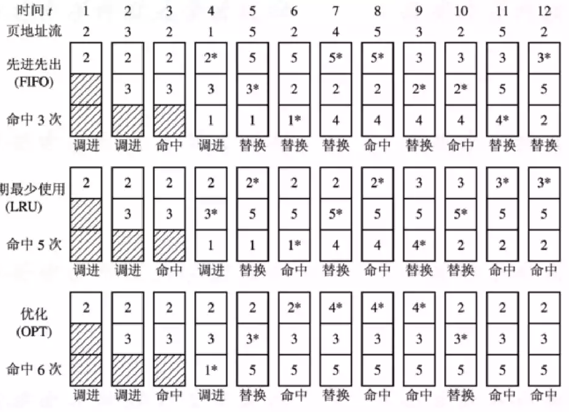

> 例题：5. 当处理机要用到的指令或数据不在主存时，会产生页面失效，这时需去辅存中将含该指令或数据的一页调入主存，将调入动作称为：**（）**。P137
>
> **（页面替换）**

- 命中率与分配给程序的主存页数有关
- **一般来说，分配给程序的主存页数越多**，虚页装入主存的机会越多，**命中率也就可能越高**，但能否提高还和替换算法有关。
- **FIFO 算法就不一定**。由下图可知，主存页数由 3 页增至 4 页时，命中率反而由 3/12 降低到 2/12。而**LPU 算法则不会发生这种情况**，随着分配给程序的主存页数的增加，其命中率一般都能提高，至少不会下降。
  - 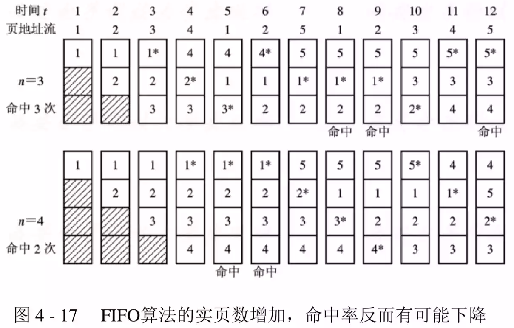
- **命中率与页地址流有关**

- **堆栈型替换算法**
- 由于堆栈型替换算法具有上述包含性质，因此命中率随主存页数的增加只有可能提高，至少不会下降。只要是堆栈型替换算法，只要采用堆栈处理技术对地址流模拟一次，即可同时求得对此地址流在不同主存页数时的命中率。
- 用堆栈模拟时，主存在 t 时间点的状况用堆栈 $S_t$ 表示 $S_t$ 是 $L_t$ 个不同页面号在堆栈中的有序集，$S_t$(1)是 t 时间点的 $S_t$ 的栈顶项，$S_t$(2)是 t 时间点的 $S_t$ 的次栈顶项，依次类推。由于堆栈型算法的包含性，必有
  - 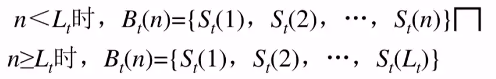
- 下图的页地址流采用 LRU 算法进行堆栈处理的 $S_t$ 变化过程
  - 主存页数 n 取不同值时的命中率。只要取栈顶的前 n 项，若 $A_t \in S_{t-1}$ 则为命中，否则不命中
  - 这样就可以算个各个 n 值的命中率 H\*
  - 例如：在 n=4 中，$S_5={5，1，2，3}$，$A_6 = 2 \in S_5$中，因此命中。A 就是页地址流，A6 就是 2。
  - 例如 2：以 n=2 为准，S3 中，2 来了，就把 3 往下压，2 进来。**这就是命中了**
  - 例如 3：以 n=4 为准，在 S8 中，5 来了，就把 2 往下压住原本的 5，新的 5 在栈顶加入
    - 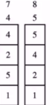
    - 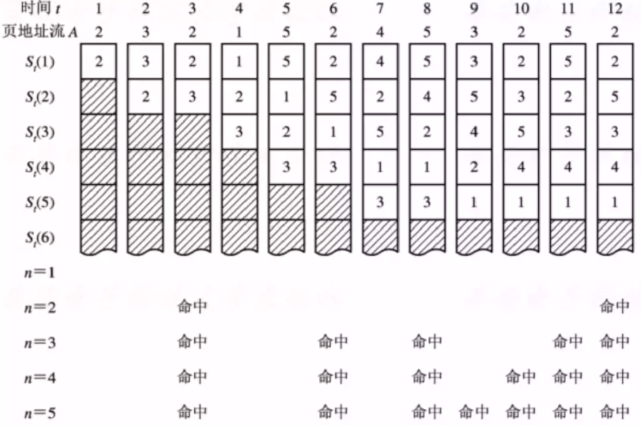
- 计算命中率
  - 命中率 = 命中次数 / 页地址流（时间 t）
    - n2=2/12=0.1666≈0.17，n3=5/12=0.41666≈0.42
      - 

> 例题：6. .考虑一个 920 个字的程序，其访问虚存的地址流为 20，22，208，214，146，618，370，490，492，868，916，728。
>
> (1)若**页面大小为 200 字，主存容量为 400 字**，采用**FIFO 替换算法**，请按访存的各个时刻，写出其虚页地址流，计算主存的命中率;
>
> 主存实页数：400/200=2 页，把地址流转换为页地址流，以**第一个虚地址流转换为页地址流**
>
> 求模公式：INT（地址/页面大小），将地址整除于页面大小，得 INT(20/200)=0，以此类推，**页地址流**为：0，0，1， 1，0，3 ，1， 2，2，4，4，3
> 虚存地址流 20，22，208，214，146，618，370，490，492，868，916，728
>
> 
>
> 
>
> (2)若页面大小为 100 字，再做一遍;
>
> H=25%
>
> 
>
> (3)若页面大小为 400 字，再做一遍;
>
> H=50%
>
> 
>
> (4)由(1)、(2)、(3)的结果可得出什么结论?
>
> 由以上结论可得，FIFO 算法的条件下，当页面大小发生变化时，其命中率变化是:一开始随页面大小增大命中率增加(第一步与第二步比较），但当页面大小增到一定时，命中率不再增加（第一步与第三步比较）。
>
> (5)若把主存容量增加到 800 字，按第(1)小题再做一遍，又可得出什么结论?
>
> 命中率为 58%，结论是如果分配给主存容量增加时可以提高命中率。

> 例题：8. 有一个虚拟存储器，**主存有 4 个实页**，**页号为 0-3**，程序有 8 个虚页，页号为 0~7，采用**全相联映像**和**FIFO 替换算法**。给出如下程序页地址流：**2、3、5、2、4、0、1、2、4、6**。
>
> (1)假设程序的**2（先入）、3、5 页已先后装入主存的第 3、2、0 页位置**，请画出上述页地址流工作过程中，主存各页位置上装入程序各页号的变化过程图，标出命中时刻;
>
> (2)求出此期间主存的命中率 H。
>
> 

> 例题：9.设有一道程序，有 1-5 页，执行时的页地址流（即依次用到的程序页页号）为:2，3，2，5，1，5，3，4，3，5 若分配给该道程序的主存有 3 页，给出采用 FIFO 替换算法的装入和替换过程。
>
> 

> 例题：10. 设有一道程序，有 0 ～ 4 共 5 个页，分配给该程序的主存有 3 页，若执行时的页地址流为 1、2、1、0、4、1、3、4、3，采用 LRU 算法进行页面替换。
> (1)请按访存的各个时刻，画出页面替换过程模拟图，并标出命中情况;(2)计算主存的命中率 H。
>
> 

> 例题：11.采用**LRU 替换算法**的页式虚拟存储器共有 9 页空间准备分配给 A、B 两道程序。已知 B 道程序若给其分配 4 页时，命中率为 8/15;若分配 5 页时，命中率可达 10/15。现在给出**A 道程序的页地址流**为 2、3、2、1、5、2、4、5、3、2、5、2、1、4、5。(1)画出用堆栈对 A 道程序页地址流的模拟处理过程图;(2)统计给其分配 4 页和 5 页时的命中率。P141/p166/p295 4-8 2017.10
>
> 

> 例题：12.有一个 Cache 存储器，主存有 0 ～ 7 共 8 块，Cache 为 4 块，采用**组相联映像**，设 Cache 已先后预取进了主存的第 1、5、3、7 块，现访存块地址流又为 1、2、1、3、7、0、1、2、5、6 时，在 Cache 分 2 组的条件下:(P168/p301 4-16)201710
> (1)画出用**FIFO 替换算法**时，Cache 内各块的实际替换过程图，并标出命中时刻。
> (2)求出在此期间的 Cache 命中率。
>
> **（0145）是一组，（2367）是一组**
>
> - 
>
> 

> 例题：13. 有一个 Cache 存储器，主存有 0 ～ 7 共 8 块，Cache 有 4 块，采用**组相联映像，分 2 组**。假设 Cache 已**先后访问并预取**进了主存的第 5、1、3、7 块，现访存块地址流又为 3、2、6、5、6、5、O、4、1、5、7、6 时:
> (1 画出用**LRU 替换算法**时，Cache 内各块的实际替换过程图，并标出命中时刻。
> (2)求出此期问的 Cache 命中率。
>
> 

> 例题：14. 在一个采用**组相联映象**的**Cache**系统中，主存由 0~15 共 16 块组成，Cache 分为 2 组，每组 2 块，每块大小为 16 个存储字。在某个程序执行时，访存的主存块地址流为:6、2、4、1、4、6、3、0、4、5、7、3。 P154，p167\p300，4-14
> (1)写出主存块地址和 Cache 块地址的格式，并指出各字段的长度。
>
> 
>
> (2)采用 LRU 替换算法时，画出 Cache 内各块实际替换过程图，并计算 Cache 命中率
>
> 

> 例题：15. 考虑一个 1000 个字的程序，其访问虚存的地址流为 16、219,136、156、332、480、503、868、916 , 999。若页面大小为**200 字**，主存容量为**400 字**，采用**FIFO 替换算法**，请按访存的各个时刻，写出其虚页地址流，计算主存命中率。
>
> 

> 例题：16. 考虑一个 920 个字的程序，其访问**虚存的地址流**为 23、216、156、618、382、490、492、868、916、728。若页面大小为**200 字**，主存容量为**400 字**，采用**FIFO 替换算法**，请按访存的各个时刻，写出其虚页地址流，计算主存命中率。
>
> 

---

### 总结

- 重点
  - 页式虚拟存储器的地址映像，**LRU、FIFO**、OPT 算法边行页面替换的过程模拟,**Cache 存储器的组相联映像及 LRU 替换算法的替换过程**，。
- 难点
  - **组相联映像和替换算法的模拟。**

---

## 第五章 标量处理机

### 重叠方式

- **加快标量处理机**的方法有两种

  - 一是通过**选用高速的器件**，采用更好的**运算方法**，从而加快每条机器指令的解释。
  - 二是通过**重叠**和**流水**的方式来加快解释的速度。

- **重叠原理与一次重叠**

- **顺序解释**
  - **控制简单，但速度有限**
- **重叠解释**
  - 不同指令在**时间上重叠**解释，不能加快一条指令的解释，但加快相邻多条指令的解释。
- 指令的重叠解释使机器语言程序的执行**速度**会比采用顺序解释有较大的提高。

- 解释一条机器指令的微操作可归并成**取指令**、**分析和执行**三部分，时间关系如图所示。

  - 

- **指令的顺序结算与重叠结算**
- 重叠解释**虽不能加快一条指令的解释**，却能**加快相邻两条指令**以至**整段程序的解释**。
  - **顺序解释**
    - 
  - **重叠解释**
    - 
- **实现指令的重叠解释**必须在计算机组成上**满足以下几点要求**
  - （1）要解决**访主存的冲突。**
  - （2）要解决“**分析”与“执行”操作的并行**。
    - 指令解释方式中，**指令分析部件**和**指令执行部件**任何时候都只有**相邻两条指令**在重叠解释的方式称为“**一次重叠**”。
  - （3）要解决“分析”与“执行”操作**控制上的同步**。
  - （4）要解决**指令间各种相关的处理**。
    - 无论发生何种相关，或者会使解释出错，或者会使重叠效率显著下降，所以必须加以正确处理。

> 例题：1. 指令解释方式中，**（）**和**（）**任何时候都只有**相邻两条指令**在重叠解释的方式称为**一次重叠**。P170
>
> **（指令分析部件、指令执行部件）**

> 例题：2. 假设指令的解释分取指、分析与执行 3 步，每步的时间相应为 t 取指、1 分析、‘执行，分别计算下列情况下，执行完 100 条指令所需时间的一般关系式:201504，P169，P200，P303，5-1
> （1）顺序方式;
>
> - 100：有 100 列
>
> （2）仅“执行,”与“取指,”重叠;
>
> - $t_{取指}$：之所以是 1，开头，是因为**执行 k**与**取指 k+1**重叠了
> - $100t_{分析}$：分析没有重叠，所以就是 100
> - $99*max(t_{取指},t_{执行})$：取指和执行重叠了，所以乘 99。然后看取指和执行那个大，就取那个数（max）。
>   - 之所以乘 99，是因为减 1 了
>   - 执行 2 次：下图中执行 2 次按照顺序方式是有 6 列，但是他只有 5 列，所以 6-5=1，因此 100-1=99
> - $t_{执行}$：之所以是 1，结尾，没有重叠。
>
> （3）仅“执行,”、“分析 k:”与“取指 k”重叠。
>
> - $t_{取指}$和$t_{分析}$：开头和结尾
> - $MAX(t_{分析}，t_{取指})$和$MAX(t_{执行}，t_{分析})$：孤零零的 2 个和上一个一样
> - $98*max(t_{执行},t_{分析},t_{取指})$：重叠
> - **这里只有中间是重叠的！！**
>
> 
>
> 

- **相关处理**
- 转移指令的处理
- 指令相关的处理
- 主存空间数据相关的处理
  - **主存空间数相关**是相邻两条指令之间出现对**同一单元**要求**先写后读**的关联。要想不出错，只有**推后“分析$_{k+1}$”的读**。
- 通用寄存器组相关的处理

---

### 流水方式

- **工作原理**

  - **“分析$_{k+1}$”与“执行$_k$”的一次重叠**是把指令的解释过程分解成**“分析”**与**“执行”**两个子过程，在独立的分析部件和执行部件上**时间重叠**地进行。若“分析”与“执行”子过程都需要 At,的时间
  - 如下图所示，则一条指令的解释需要 2At,完成，但机器每隔 △t,就能解释完一条指令。
    - 

- 流水与重叠在概念上没有差别，二者的区别在于**“一次重叠”是把一条指令的解释分成两个子过程**，而**流水则是分为更多个子过程**。
- **如果把“分析”子过程再细分成“取指令”、“指令译码”和“取操作数”3 个子过程**
  - 并改进运算器的结构以加快其“执行”子过程，（**如图 a 所示**，这 4 个子过程分别由独立的子部件实现）
- **所以，一共分为四个子过程**
  - 取指令
  - 指令译码
  - 取操作数
  - 执行
- 让经过的时间都等于 At.，则指令解释的时(间)空(间)关系，如图 b 所示。图中的 1、2、3、4、5 表示处理机所处理的**第 1、2、3、4、5 条指令**。

  - 

- **流水的分类**
- （1）**依据向下扩展和向上扩展**的思路，可分为**计算机功能子过程的流水线**和**处理机间的流水线**。
- （2）**从流水具有功能的多少**，可分为**单功能流水线**和**多功能流水线**。
  - **单功能流水**:
    - **只能实现单一功能的流水**，要完成多功能的流水将多个单功能流水组合。
  - **多功能流水**
    - 同一流水线的**各个段之间**可以有**多种不同的连接方式**，以实现不同的功能。
  - 按多功能流水线的**各段能否允许同时用于多种不同功能**连接流水，可把流水线分为**静态流水线**和**动态流水线**。
  - **静态流水线在某一段时间内**各段只能**按一种功能连接流水**。
- （3）从计算机所具有的**数据表示**，分为**标量流水**和**向量流水**。
- （4）从流水线中各功能段之间**是否有反馈回路**，分为**线性流水**和**非线性流水**。

> 例题：3. 静态流水线是指：D。P179
>
> A.功能不能改变的流水线 B.各段之间的连接是固定不变的流水线
>
> C.可同时执行多种功能的流水线 D.同时只能完成一种功能的多功能流水线
>
> 例题：4.下列对静态流水线描述正确的是：C。P179
>
> A.静态流水线是功能不能改变的流水线
>
> B.静态流水线是只有一种功能的流水线
>
> C.静态流水线是在某一时间内各段只能按一种功能连接的流水线
>
> D.静态流水线是在某一时间内各段静止的流水线
>
> 例题：5. Amdahl 470V/6 属于：B。P180
>
> A.向量流水机惇 B．标量流水机 C.并行处理机 D.阵列机

- **静、动态多功能流水线时空图，a 静态，b 动态**
  - 静态：等全部浮点算完，在去定乘
  - 动态：浮点还没完成就进入定乘
  - 
- **非线性流水线**
  - 

---

#### 标量流水线的主要性能

- 标量流水处理机的性能主要是：
  - 吞吐率：$T_p$
  - 加速比：$S_p$
  - 效率：$\eta$
- 吞吐率：$T_p$
  - **吞吐率**是流水线**单位时间里能流出的任务数**或**结果数**。吞吐率受限于流水线中最慢子过程所需要的时间。称流水线中经过时间最长的子过程为瓶颈子过程。
  - 

> **打横看！！打横看！！打横看！！打横看！！一行一行看！！**

- **最大吞吐率取决于瓶颈段的时间**

- 图 a 中：1234 是对应空间的 1234，打横看，行

- 图 b 中： **$\Delta$t_0**：是对应时间

  - 图 a：
    - 1 和 3 和 4 段经过时间都是 **$\Delta$t0**只有 2 是 **3$\Delta$t0** ，因此瓶颈在 2 段上
  - 图 b：时空图
    - 在第一段（行）处理 **1** 需要 **$\Delta$t0**
    - 第二段（行）处理 **1** 需要 **$3\Delta$t0**，你可以看出，在第二行的时候处理时间就拉长了
      - 
  - 例如：

  - 

- **消除瓶颈**

- 消除瓶颈的一种办法是**将瓶颈子过程再细分**。例如将 2 段再**细分成 21、22、23 三个子段**，如图 a 所示。让各子段经过时间都减少到 $\Delta t_0$ ，这样，最大吞吐率就可提高到 $1/ \Delta t_0$ 。图 b，是将瓶颈子过程再细分后的时空图。

  - 

- 例如 2 段已不能再细分了，则可以**通过重复设置多套(如此例用 3 套)瓶颈段并联，让它们交叉并行**，如图 5 - 22(a)所示。

  - 

- **加速比 $S_p$**
  - 如果用加速比 Sp 表示**流水方式相对于非流水顺序方式速度提高的比值**，那么非流水顺序方式连续完成 n 个任务需要
    - $n·m·△t_0$ 的时间
    - 因此，流水线方式工作的加速比为:
      - 
- **效率**
  - **流水线的效率**是指流水线中**设备的实际使用时间与整个运行时间之比**，也称流水线设备的**时间利用率**。
  - 如果是线性流水线、任务间不相关且各段经过的时间相同，如图 5 - 23 所示那样，则在 T 时间里，流水线各段的效率都相同，均为$\eta_0$，即 ○
    - 
- **整个流水线的效率**
  - 
  - 

#### 流水线例题

> 例题：6. 设向量 A 和 B 各有 4 个元素，要在图 5 - 24(a)所示的静态双功能流水线上计算向量点积：，按此算法可画出流水线工作的时空图如图 5- 24(b)所示。
>
> 
>
> 解析：
>
> - 向量，4 个元素，所以就得出
>   - X（a1，a2，a3，a4）和 Y（b1，b2，b3，b4）
> - 根据向量点积计算，A\*B
>   - $((a_1*b_1) + (a_2*b_2)) + ((a_3*b_3) + (a_4*b_4))$
>   - **3 次加法，4 次乘法**
> - 然后根据刚刚计算的**式子**，就可以画图了
>   - 1→2→3→5 是加法流水线，1→4→5 是乘法
>   - 先算乘法，$(a_1*b_1)  (a_2*b_2)  (a_3*b_3)  (a_4*b_4)$
>     - 
>   - 然后算加法，
>     - **注意一下，这里只能两两相加，或相乘**
>     - 所以 6-7 是 a1b1+a2b2。7-8 是 a3b3+a4b4
>       - 
>   - 最后在相加
> - **流水线的效率计算**
>   - 可用阴影区面积和全部 5 个段的总时空区面积之比
>     - 
>     - 虽然效率连 1/3 都不到，但解题速度却提高为串行的 1.6 倍，而且如果向量 A、B 的元素数增加时，还会使解题速度和效率进一步提高。

> 例题：7. 现有**长度为 8 的向量 A 和 B**，请分别画出下列 2 种结构的处理器上求点积 A·B 的时空图，并求完成全部结果的最少时钟拍数。设处理器中每个部件的输出均可直接送到任何部件的输入或存入缓冲器中，其间的传送延时不计，指令和源操作数均能连续提供。201704,P202
> (1 处理器有**一个乘法部件**和**一个加法部件**，不能同时工作，部件内也只能以**顺序方式**工作，完成一次加法或乘法均需**5 拍**。
>
> (2)处理器有一个乘法部件和一个加法部件，乘法部件和加法部件可**并行工作**，部件完成一次加法或乘法均需**5 拍**。
>
> - **第二问：必须先有 2 个数相乘，才能在算加法**
> - 2 次乘法+7 次加法**（max(加法,乘法)，加法是 7，乘法是 8-2=6，取最大值）**
>
> 

- **标量流水机的相关处理和控制机构**
  - 标量流水线只有连续不断地流动，不出现断流，才能获得高效率。造成流水线断流的原因除了编译形成的目标程序不能发挥流水结构的作用，或存储系统供不上为连续流动所需的指令和操作数以外，还可能是由于出现了相关和中断。
- **局部性相关的处理**
- 指令相关、访存操作数相关和通用寄存器组相关等局部性相关都是由于在机器同时解释的多条指令之间出现了对同一主存单元或寄存器要求**“先写后读”**。
- 重叠机器处理这些局部性相关的方法有两种。一种是**推后后续指令对相关单元的读**，直至在先的指令写入完成。另一种是**设置相关直接通路**，将运算结果经相关直接通路送入所需部件。
- 任务在流水线中流动顺序的安排有**顺序流动方式**或**同步流动方式**和**异步流动方式**。

> 例题：8. 简述 IBM360/91 解决流水控制的途径。2019.10。P188
> 答：
>
> - （1）在各个寄存器中设置忙位标志来判断是否相关，当寄存器正在使用时置该寄存器的忙位标志为“1";(1 分)当寄存器被释放，其忙位标志清为“0”";(1 分)访问寄存器时先看忙位标志如果为“1”表示相关。(1 分)
> - （2）设置多条流水线让它们并行工作，(1 分)同时在分布于各流水线的入、出端上分别设置若干保存站来缓冲存放信息，一旦相关采用异步方式流动;(1 分)
> - （3）通过分布设置的站号来控制相关专用通路的连接:(1 分)(4)相关专用通路采用总线方式，相关后通过更改站号来实现不同相关专用通路的连接。(1 分)

- **全局性相关的处理**
- **全局性相关**指的是已进入流水线的转移指令(尤其是条件转移指令)和其后续指令之间的相关。

  - **使用猜测法。**
  - **加快和提前形成条件码。**
  - **采取延迟转移。**
  - **加快短循环程序的处理。**

- **流水机器的中断处理**

  - 中断会引起流水线断流，但其出现概率比条件转移的概率要低得多，且又是随机发生的。

- **非线性流水线的调度**，考点
  - 由于线性流水线在执行每个任务(指令、操作)的过程中，各段均只通过一次，因此，每拍都可以将一个新的任务送入流水线，这些任务不会争用同一个流水线。

> 例题：9.，**9 拍=8 位，8 拍=7 位，以此类推**

- 例题：现设**流水线由 5 段组成**，**段号 k 分别为 1~5**，任务经过流水线总共需**9 拍**，其预约表如图 5 - 28(a)所示。求延迟禁止表，求冲突向量，画单功能流水的状态转移事宜图，求平均间隔拍数（平均延迟）。
- 
  - **求延迟禁止表：**
    - **看段号 k，用拍数大的减小的**
      - 段号 1：9-1=8
        - 结果：8
      - 段号 2：3-2=1；8-2=6；8-3=5；
        - 结果：1，6，5
      - 段号 4：6-5=1
        - 结果：1
      - 段号 5：8-7=1
        - 结果：1
    - **最后得出：延迟禁止表 F={1,5,6,8}**
  - **求冲突向量：**
    - **9 拍=8 位，8 拍=7 位，以此类推**，所以有 8 位（00000000）
    - 然后表是 1,5,6,8。这些位置写 1，因为发生冲突了！
      - **2 进制，右边是 1，左边是 8**
        - （00000000）
        - （87654321）
      - 结果：10110001
  - **如何画图 b 呢？**
    - 将初始冲突向量为**“0”**的位，**将向量右移相应位数**，获得的**新向量**与初始向量做**或运算**
    - 例如我们计算第二位的 0
      - 第一步：例如下面“101100**0**1”，**右边第一个 0 **是第二位，那么就右移 2 位，然后在补齐 0
        - 10110001
        - 00**101100**
      - 第二步：将新向量与初始向量做**或运算**
        - 00101100
        - 10110001
        - **10111101**
      - 结果就是：**10111101**
        - 
      - **发现结果中还有 0，那么我们继续移位**
      - 这次移位的是，第二个 0
        - 最后结果是：10111111
          - 
    - 下一个 0，**是第三位的 0**
      - 那么我就右移 3 位在进行或运算
      - **结果是：10110111**
        - 
      - **发现结果中还有 0，那么我们继续移位**
      - 这次移位的是：第 4 个 0
        - **结果：10111011**
          - **记得给箭头**
    - 下一个 0，**是第四位的 0**
      - **结果：10111011**
        - 
    - **全体，下一个 0 是第七个 0，记得给箭头给原本的**
  - 
  - **各个调度方案的平均间隔拍数的例子**
    - 调度方案 2,2,7，（数字其实就是 0 移动的位数）
      - 从 2 下来到 2，最后回到 7。
      - (2+2+7)/3=3.67，那么平均间隔拍数就是 3.67
      - 
    - **调度方案 3,4，可以不回 7**
  - 结论：由表 5-1 可知，**采用先隔 3 拍后隔 4 拍轮流给流水线送入任务的调度方案是最佳的**，平均每隔 3.5 拍即可流入一个任务，吞吐率最高。
  - 尽管(4，3)调度方案平均间隔拍数也是 3.5 拍，但若**实际流入任务数**是**循环所需任务数的整数倍**，**则其实际吞吐率相对会低些**，**所以不作为最佳调度方案**。
  - **一句话：反正取前面第一个数小的就对了**
    - 

> 例题：10

- 在一个 4 段的流水线处理机上需经 7 拍才能完成一个任务，其预约表如表 5-2 所示。
  - 状态转移图如图 5 - 29 所示。
  - 各种调度方案及其相应的平均延迟如表 5-3 所示。
  - 
  - 求延迟禁止表，求冲突向量，画单功能流水的状态转移事宜图，求平均间隔拍数（平均延迟）
  - 
  - 

> 例题：11. 现设流水线由 5 段组成，段号 k 分别为 1 ~5，任务经过流水线总共需要 9 拍，其预约表如表所示，201904，P1931p312,5-11
>
> (1)写出延迟禁止表 F、冲突向量 C;
> (2)画出流水线状态转移图;
> (3)求出最佳调度方案、最小平均延迟及流水线的最大吞吐率。
>
> 

> 例题：12. 在一个 5 段的流水线处理机上需经 9 拍才能完成一个任务，其预约表如题 28 表所示。P193，P202Np312，5-11，201804
>
> (1)分别写出延迟禁止表 F、冲突向量 C;
> (2)画出流水线状态转移图;
> (3)求出最小平均延迟及流水线的最大吞吐率。
>
> 

---

### 总结

- 重点
  - **重叠和流水的性能分析，时空图的画法**
- 难点
  - 针对所要求的微操作重叠关系，计算全部指令完成的时间;**根据题意画出流水时空图，计算吞吐率、效率和加速比**。

---

## 第六章 向量处理机

### 向量的流水处理和向量流水处理机

- **向量处理机**是由**向量数据**表示的处理机，分**向量流水处理机**和**阵列处理机**两类。
  - **向量流水处理机**是以**时间重叠**途径开发的，而**阵列处理机**是以**资源重复**途径开发。
- 在向量处理中，**逐个处理向量元素**的方法为**横向(水平)处理**方式，对整个向量按相同操作都**执行完之后**再转去执行别的操作的处理方式为**纵向(垂直)处理**方式。
- **向量横向处理**是向量的处理方式，但**不是向量的流水处理方式**。而**向量纵向处理**和**分组纵横处理**既是向量的处理方式，**也是向量的流水处理方式**。

> 例题：1. **向量处理机**是由向量数据表示的处理机，分**（）**和**（）**两类。P204
>
> **（向量流水处理机、阵列处理机）**
>
> 例题：2. 在向量处理中，逐个处理向量元素的方法为**（）**方式，对整个向量按相同操作都执行完之后再转去执行别的操作的处理方式为**（）**方式。
>
> **（横向(水平)、纵向(垂直)）**

- **通过并行、链接提高性能**

  - 一般可采取让多个流水线功能部件并行、流水线链接、加快条件语句和稀疏矩阵处理、加快向量的归约操作等办法来提高向量流水处理的性能。

- 第一、二条指令无任何冲突，可以并行执行。第三条指令与第一、二条指令出现 $V_i$ 冲突，存在先写后读数相关，本来是不能并行执行的，但若能把第一、二条指令的结果分量直接链接进第三条指令所用的功能部件，那第三条指令就能与第一、二条指令在大部分时间内并行。它们的链接过程如图 6- 3 所示。P207

  - 

- 例题-接上图：
  - 
- 解析：
  - （1）第一条指令：$V_3←存储器$
    - 启动访存**1 周期**，访问访存**6 周期**，最后存入$V_3$又是**1 周期**
    - 其实就是把 A 取出来，送入$V_3$
    - **所以就：1+6+1**
  - （2） 第二条指令：$V_2←V_0+V_1$，B+C→K
    - 送浮加部件**1 周期**，将 V0 和 V1 送到浮加部件算 1 周期，**并行**
    - 浮点加去计算，流水时间是**6 个周期**。最后存入 V2 里面，**1 周期**
    - **所以就：1+6+1**
  - （3） 第三条指令：$V_4←V_2*V_3$，(B+C)\*A→D
    - 同理，浮点乘是 7 个周期
    - **所以就：1+7+1**
  - **N 是向量的长度**
  - **第一题：串行执行时间**
    - **问题：为什么要 N 要 N-1？答：串行和并行都是这样，除了链接技术**
    - 第一个 7+N 是**将存储器的数存入 V3 中**
    - 第二个 7+N 是**将 V1 和 V0 相加存入 V2**。
    - 8+N 是代表**浮点乘**
    - **结果：7+N+7+N+8+N=22+3N**
  - **第二题：12 并行，3 串行**
    - 并行的概念是，**同时运行**，所以只需要一个**7+N**即可
      - **所以就 7+N+8+N=15+2N 拍**
  - **第三题：链接技术，12 并行，3 是链接**
    - 这里要和上面有一个地方不同，**链接技术不用加 N，最后相乘的地方加就可以**
    - **(1+6+1)+8+N=16+N 拍**
  - 

---

### 阵列处理机的原理

- **阵列处理机的构形**
- 阵列处理机的构形有**分布式存储器**阵列处理机构形和**集中式共享存储器**阵列处理机构形。
- **阵列处理机有两种构形**，两者的差别主要在于**存储器的组成方式**和**互连网络的作用**不同。
- 构形 1
  - 具有**分布式存储器**的阵列处理机的构形。
  - 为了高速有效地处理**向量数据**，这种构型要求把数据合理地预分配到各个处理单元的**局部存储器**中。**分布式存储器**阵列处理机是**SIMD**的主流。
- 构形 2

  - 具有**集中式共享存储器**的阵列处理机构形。
  - 为了对**长度为 N 的向量**中各元素能同时并行处理，**存储器分体个数 K 应等于或多于处理单元数 N**。

- **阵列处理机的特动**
- （1）**阵列处理机的单指令流多数据流处理方式**和由它产生的特殊结构是以诸如有限差分、矩阵、信号处理、线性规划等一系列计算问题为背景发展起来的。
- （2）**阵列处理机**利用的是**资源重复**，**而不是时间重叠**；利用**并行性中的同时性，而不是并发性**。它的每个处理单元要同等地担负起各种运算功能，但其设备利用率却可能没有多个单功能流水线部件那样高。
- （3）阵列处理机主要是靠**增大处理单元个数**来提高运算速度，比起**向量流水线处理机主要依靠缩短时钟周期**来说，速度提高的潜力要大得多。

> 例题：3. 阵列处理机有两种构形，差别主要在于**（）**和**（）**不同。P208
>
> **（存储器的组成方式、互联网络的作用）**
>
> 例题：4. 阵列处理机的构形有**（）**阵列处理机构形和**（）**阵列处理机构形。P208
>
> **（分布式存储器、集中式共享存储器）**
>
> 例题：5. 与阵列处理机相比，流水线处理机利用的是**（）**方式而不是**（）**方式的并行技术。P210
>
> **（资源重复、时间重叠）**
>
> 例题：6. 为了高速有效地处理**（）**数据，分布式存储器阵列处理机要求能把数据合理地预分配到各个处理单元的**（）**存储器中。P209
>
> **（向量、局部）**
>
> 例题：7. 分布式存储器阵列处理机属于：A。P209
>
> A.SIMD 系统 B SISD 系统 C.MISD 系统 D.MIMD 系统
>
> 例题：8. 有 N 个处理单元的集中式共享存储器的阵列处理机构形，为了对长度为 N 的向量中各元素能同时并行处理，存储器分体个数 K 与处理单元数 N 的关系是：D。P209
>
> A．K 与 N 无关 B．K 小于 N C. K 小于或等于 N D.K 等于或大于 N

- **ILLIACIV 的处理单元阵列结构**
  - 由于阵列处理机上的并行算法的研究是与结构紧密联系在一起的，因此，下面先介绍 ILLIAC IV 阵列机上处理单元的互连结构。ILLIACIV 采用如图 6 - 5 所示的分布存储器构形，其处理单元阵列结构如图 6- 7 所示。
    - 

> 例题：9. 
>
> 解析：
>
> - 第一步：
>   - 根据题意得出，从 i 从 0 开始到 15。看图
>   - **哎，摸了，这题绝了**
>
> 

---

### SIMD 计算机的互连网络

- **互连网络的设计目标与互连函数**
  - 在 SIMD 计算机中，无论是处理单元之间，还是处理单元与存储分体之间，都要通过互连网络进行信息交换。
- **SIMD 的互连网络的设计目标是：**

  - （1）结构不要过分复杂，以降低成本;
  - （2）互连要灵活，以满足算法和应用的需要;
  - （3）处理单元间信息交换所需的传送步数要尽可能少，以提高速度性能;
  - （4）能用规整单一的基本构建组合而成，或经多次通过或者经多级连接来实现复杂的互连，使模块性好，以便用 VLSI 实现，并满足可扩充性。

- **互连网络应抉择的几个问题**
- 在确定 PE 之间通信的互连网络时，需要对**操作方式、控制策略、交换方法和网络的拓扑结构**作出抉择。
- 操作方式有**同步**、**异步**及**同步与异步**组合三种。
- **基本的单级互连网络**
- 分为：立方体单级网络、PM2I 单级网络、混洗交换单级网络

  - **立方体单级网络**
    - 三维立方体结构
    - **x 坐标是 001。y 坐标是 010，Z 坐标是 100**
    - 

- **三维的立方体单级网络**
  - 解释下，从右边起第 i 位上的 0、1 相反
    - 意思是，Cube0，i 就是 0，那么例如：
      - 01**0** 和 01**1**，第 0 位是相反的，那么就连起来
      - 11**0** 和 11**1**，000 和 001，100 和 101
    - 那么 Cube1，i 就是第 1 位
      - 010 和 000、011 和 001。剩下同理
  - 总结：
    - Cube0 中，0 和 1 相连，2 和 3 相连，4 和 5 相连，6 和 7 相连，加 1（自己换成二进制算）
    - Cube1 中，0 和 2 相连，1 和 3 相连，4 和 6 相连，5 和 7 相连，加 2
    - Cube2 中，0 和 4 相连，1 和 5 相连，2 和 6 相连，3 和 7 相连，加 4
  - 

> 例题：10. 编号为 0、1、2、...、15 的 16 个处理器，用单级互连网络互连，用 Cube0 互连函数时，与第 10 号处理器相连的处理器的编号是：C。
>
> A.9 B.10 C.11 D.12
>
> 解析：Cube0(1010)=1011。10 的二进制是 1010。
>
> 例题：11. 编号为 0，1，...，15 的 16 个处理器，当互连网络函数为 Cube3 时，13 号处理器连接到的处理器的号数是：C。P217
>
> A.3 B.4 C.5 D.6
>
> 例题：12. 编号为 0，1，...，15 的 16 个处理器，当互连网络函数为 Cube3 时，3 号处理器连接到的处理器的号数是：C。P217
>
> A.9 B. 10 C. 11 D. 12

#### PM2I 单级网络

> **重点提示：-1mod16 如何计算？$-1=-1*16+X$,这个 X 就是答案**
>
> **重点提示：-1mod16 如何计算？$-1=-1*16+X$,这个 X 就是答案**
>
> **重点提示：-1mod16 如何计算？$-1=-1*16+X$,这个 X 就是答案**

- **PM2I 单级网络**
  - P 是加，M 是减。和一起就是加减$2^i$
  - **重点：实现第 j 号与 $J\pm2^i$ 号处理单元相连**
    - 例如：i 是 +1 的时候：
      - j = 0，$0 + 2^1=2$，**那么 0→2 相连**
      - j = 1，$1 + 2^1=3$，**那么 1→3 相连**
      - j = 2，$2 + 2^1=4$，**那么 2→4 相连**
      - j = 7，$7 + 2^1=9 mod 7=1$，N=7，**那么 7→1 相连**
    - 例如：i 是 -1 的时候
      - 这个时候，j 就要从大开始减，例如 N=7，那么 j 就从 7 开始
      - j = 7，$7 - 2^1=5$，**那么 7→5 相连**
      - j = 6，$6 - 2^1=4$，**那么 6→4 相连**
      - 以此类推
  - 
- **PM2I 互联网络的部分连接图**
  - 

> 例题：13. 编号为 0、1、2、...、15 的 16 个处理器，用单级互连网络互连，用 $PM2_{+1}$，互连函数时，与第 7 号处理器相连的处理器的编号是：B。
>
> A.8 B.9 C.10 D.11
>
> 解析：该题考查考生对于 PM2I 单级网络互连函数的掌握，用$PM2_{+1}$互连函数时，$PM2_{+1}$(7)= (7+$2^1$) mod 16，所以与第 7 号处理器相连的处理器编号是 9，故正确选项为 B。
>
> 例题：14. 对于 N=8 的互连网络，处理单元编号为 0 ～ 7，当用$PM2_{+1}I$数时，下列正确的是：B。P218
>
> A. (6420)(7531) B. (0246)(1357) C. (0123)(4567) D.(7654)(3210)

> 例题：15. 实现 16 个处理单元互连的 PM2I 单级网络。2017.4 (P218)
>
> （1）写出所有各种单级 PM2I 互连函数的一般式。
>
> （2）3 号处理单元用单级 PM2I 网络可以将数据直接传送到哪些处理单元上。
>
> 

#### 混洗交换单级网络

- **混洗交换单级网络**
  - 原理
    - 向左移动 1 位，意思就是 001→010 这样
    - 在举个例子：101→011，懂了吧？
  - 
  - 

> 例题：16. 编号为 0，1，...，15 的 16 个处理器，当互连网络函数为 Shuffle 时，9 号处理器连接到的处理器的号数是：D。p219
>
> A. 0 B. 1 C.2 D.3
>
> 例题：17. 编号为 0~15 的 16 个处理器，互连函数采用 Shuffle(Shuffle)**单级互连网络互连**，则与 9 号处理器连接的处理器号为：B。P219
>
> A. 5 B. 6 C.7 D. 8
>
> **解析：题目中采用了 2 次 Shuffle，→Shuffle（Shuffle）2 次啊！！**
>
> 例题：18. 编号为 0，1，...，15 的 16 个处理器，用单级互连网络互连,当用 Shuffle(Shuffle)互连函数时，第 13 号处理器连至的处理器号数是：A。P219
>
> A.7 B.11 C.13 D.14

- **蝶形单级网络**
  - 最高位和最低位交换位置，例如（001→100）（101→101）（011→110）
  - 
  - 

#### 基本的多级互连网络

- **基本的多级互连网络**
  - 最基本的多级互连网络就是与上述前 3 种单级互连网络相对应组成的**多级立方体互连网络**、**多级混洗交换网络**和**多级 PM2I 网络**。
- 不同的多级互联网络，在所用的交换开关、拓扑结构和控制方式上各有不同。
- **多级立方体互连网络**
- 多级立方体互连网络有**STARAN 网络**、间接二进制 n 方体网络等。以 8 个处理单元为例，其普遍结构如图 6 - 19 所示。
- 表 6- 1 列出了**三级交换网络**在级控制信号采用各种不同组合情况下所实现的入、出端的连接。

  - **懂了懂了。草**
    - 首先要先知道 0 级是代表 Cube0，1 级是代表 Cube1
    - 第一步：写出 Cube0，0 到 7 的值（01234567），对应图中 0 级
      - 
      - 第二步：写出 Cube1，0 到 7 的值（02134657），对应图中 1 级
        - 图我就不截了，看下面总图
      - 第三步：写出 Cube2，0 到 7 的值（04152637），对应图中 2 级
        - 图我就不截了，看下面总图
      - **第四步也是最后一步：！！！连线！！！**
  - 

- **例题补充**
  - （1）m 需要大于 n 的质数，$m=2^{2p}+1$（P 位整整数），因此 m 至少为 5
  - （2）根据分体数 m=5，那么分体号是 0~4
    - 第一列：a00 他题目定下来在 2，然后向右排，a010203
    - 第二列：a00 在分体号 2，他的**后一位需要空着**。那么 a10 在 4 号位，以此类推
  - 

> 例题：19. 
>
> 
>
> - **一般式就是找规律：**
>   - 首先我们发现，**中间是不变化的**，**所以中间一定是直连**
>   - 000→101，先 b2（100），然后由于 b1 是**直连**所以跳过，最后 b0（101）
>   - 001→100，先 b2（101），然后 b1 跳过，最后 b0（100）
>   - 010→111，先 b2（110），然后 b1 跳过，最后 b0（111）
>   - 011→110，先 b2（111），然后 b1 跳过，最后 b0（110）
>   - **同理，b210 其实就是 Cube 的 210 的意思，第几位变化**
> - 如何标出开关的控制状态呢？
>   - 根据一般式子写就行了

---

### 总结

- 重点
  - **向量流水处理机**中向量指令间的**并行、链接**，**阵列处理机互连网络**、**互连函数**、多级互连网络。
- 难点
  - **向量流水处理机**中向量指令间的**并行**，**阵列处理机的并行算法**和**多级互连网络**。

---

## 第七章 多处理机

### 多处理机的概念、问题和硬件结构

- **概念和要解决的技术问题**
  - **多处理机**是指有**两台以上的处理机**，**共享 IO 子系统**，机间经共享主存或高速通信网络通信，在统一操作系统控制下，协同求解大而复杂问题的计算机系统。
  - **多处理机的目标:**
    - （1）对多个作业、多个任务**并行执行**来提高解题速度，从而**提高整体性能**;
    - （2）使用冗余的多个处理机通过重新组织来**提高系统的可靠性、适应性和可用性**。
  - **特点**
    - （1）结构灵活性
    - （2）程序并行性
    - （3）并行任务派生
    - （4）进程同步
    - （5）资源分配和任务调度
- **多处理机与阵列机在并行等级、硬件、算法和系统管理上的区别:**
  - （1）并行等级不同，阵列处理机主要针对向量、数组,实现向量指令操作级的并行，是开发并行中的同时性。
  - （2）多处理机实现的是作业或任务间的并行，是开发并行性中的并发性。
  - （4）硬件结构上多处理机中的多个处理机要用多个指令部件控制通过共享主存或机间互连网络实现异步通信。
  - （4）在算法上，不限于向量、数组，还要挖掘和实现更多通用算法中隐含的并行性。
  - （5）在系统管理上，要更多地依靠操作系统等软件手段，有效地解决资源分析和管理，特别是任务分配、处理机调度、进程的同步和通信等问题。
- **需要解决的主要问题:**
  - （1）硬件结构上如何解决好处理机、存贮器模块及 I/O 子系统之间的互连。
  - （2）如何最大限度地开发系统的并行性，以实现多处理机各级的全面并行。
  - （3）如何选择分割任务和子任务的大小，即任务的粒度大小，使并行度高，而辅助开销小。
  - （4）如何协调好多处理机中各并行执行的任务和进程间的同步问题。
  - （5）如何将各个任务分配到一个或多个处理机上，必须研究如何较好地解决动态的资源分配和任务调度，让各处理机的负荷尽可能**均衡**，并要防止**死锁**。
  - （6）一旦某个处理机发生故障，如何对系统进行重新组织而不使其瘫痪。

> 例题：1. 简述多处理机与阵列机在并行等级、硬件、算法和系统管理上的区别。2017.4 ，P237
>
> 例题：2. **（）**是指有两台以上的处理机，共享 I/O 系统，机间经共享主存或高速通信网络通信，在统一操作系统控制下，协同求解大而复杂问题的计算机系统。
> **（多处理机）**

- **多处理机的硬件结构**
- **紧耦合和松耦合**
  - **多处理机**有**紧耦合**和**松耦合**两种不同的构形。
- **紧耦合多处理机**
  - **紧耦合多处理机**是通过**共享主存**实现处理**机间通信**的，其**通信速率**受限于**主存频宽**。但是，由于各处理机与主存经互连网络连接，系统中处理机数就受限于互连网络带宽及多台处理机同时访问主存发生冲突的概率。

> 例题：3. 我国的**曙光 1 号**多处理机是典型的同构对称型**紧耦合多处理机**。

- **松耦合多处理机**
  - 松耦合多处理机中，每台处理机都有一个容量较大的**局部存储器**，用于存储经常用的指令和数据，以减少紧耦合系统中存在的访主存冲突。不同处理机间或者通过**通道互连**实现通信，以共享某些外围设备;或者通过**消息传送系统**来交换信息。
- 松耦合多处理机可分为**非层次型**和**层次型**两种构型。

- **机间互连形式**
- 多处理机机间互连的形式是决定多处理机性能的一个重要因素。
  - (1)总线形式
  - (2)环行互连
  - (3)交叉开关形式
  - (4)多端口存储器形式
  - (5)蠕虫穿洞寻径网络
  - (6)开关枢纽结构形式 ■

> 例题：4. 松耦合多处理机可分为**（）**和**（）**两种不同的构形。P240
>
> **（非层次型、层次型）**
>
> 例题：5. **机间互连的多端口存储器形式**适合应用于：C。P245
>
> A.紧耦合多处理机系统 B.机数很多的多处理机系统
>
> C.机数较少的多处理机系统 D.松耦合多处理机系统
>
> 例题：6. 通过**通道互连**实现通信，或通过**消息传送系统**交换信息的计算机系统是：C。P240
>
> A.向量处理机 B.紧耦合多处理机 C.松耦合多处理机 D.标量处理机
>
> 例题：7. 紧耦合多处理机系统的机间通信是通过：D。P238
>
> A.共享总线实现 B.共享 Cache 实现 C.共享虚拟存储器实现 D.共享主存实现

---

### 紧耦合多处理机多 Cache 的一致性问题

- **多 Cache 的一致性问题的产生**
  - 为了解决价格合理的大容量**主存的访问速度低于处理机速度一个数量级**的现实问题，系统**在多处理机和主存之间**，通常配置有一个**高速缓冲存储器 Cache**。
- 在多处理机中，由于每个处理机都有自己的专用 Cache,当主存中同一个信息块在多个 Cache 中都有时，会出现多个 Cache 之间的相应信息块的内容不一致的问题。

- **多 Cache 的一致性问题的解决办法**
- **1.解决进程迁移引起的多 Cache 不一致性**
  - 对于进程迁移引起的多 Cache 不一致性，可以通过禁止进程迁移的方法予以解决，也可以在进程挂起时，靠硬件方法将 Cache 中该进程改写过的信息块强制写回主存相应位置。
- **2.以硬件为基础实现多 Cache 的一致性**
  - 以硬件为基础实现多 Cache 的一致性，主要有监视 Cache 协议法，即各个处理机中的 Cache 控制器随时都在监视着其他 Cache 的行动。另一种是目录表法，建立一个目录表，记录每一个数据块的使用情况。.
- **3.以软件为基础实现多 Cache 的一致性**
  - 以软件为基础实现多 Cache 的一致性，例如依靠编译程序的分析，不把一些公用的可写数据存入 Cache 中。

> 例题：8. 简述紧耦合多处理机中解决多 Cache 一致性的办法。2019.10,P249-p250

---

### 多处理机的并行性和性能

- 并行算法
- **1.并行算法的定义和分类**
  - 并行算法是指可同时执行的多个进程的集合，各进程可相互作用、协调和并发操作。
  - 算法规定了求解某一特定问题时的有穷的运算处理步骤。
- **并行算法的分类：**

  - ⑴**按运算对象**：**数值型和非数值型**;
  - (2)按并行进程的**操作顺序**：**同步、异步和独立型;**
  - ⑶ 按处理计算机**任务大小**：**细粒度、中粒度和粗粒度。**

- **2.多处理机并行算法的研究思路**
- 并行算法取决于计算机的结构和题目，它是提高多处理机并行性能的关键。
  - (1)研究并行算法的一种思路是将大的程序分解成由足够多的**并行处理**的过程。
  - (2)每个过程被看成是一个**结点**，将过程之间的关联关系用结点组成的树来描述。这样，程序内各过程的关系就可以被当成是一种算术表达式中各项之间的运算，表达式中的每一项都可看成是一个程序段的运行结果。
  - (3)研究程序段之间的并行问题就可设想成是对算术表达式如何并行运算的问题。

> **例题 7-4**

- **例题 7-4**

  - 第一步：利用**霍纳法**写出个计算式子
    - 霍纳法的原理是，**将 x 提取到外面**。
    - 例如：a + **bx + cxx**→ a+**x ( b + x ( c ) )**
    - **自己看图去找规律**
  - 第二步：得出多少个**乘加循环，几级运算**
    - 一个加**和**一个乘，算一个**乘加循环**
    - 题中一共**加了 3 次**也**乘了 3 次**
    - 那么**乘加循环是 3**，（3 次加\*3 次乘=6）那么是**6 级运算**
      - 补充：1 加 1 乘，是**2 级运算**
  - 第三步：求 P 和 $T_1$ 和 $T_P$
    - P：表示**可并行**的处理机个数
    - $T_P$：表示**多处理机运算**的级数，既是**树的高度**
    - $T_1$：表示**单处理机运算**的级数
    - **具体怎么求看下面的图，下面我会说**
  - 
    - 7-17 树形流程图：a 图从左往右看。b 图从上往下看
      - a：
        - **从左往右看**
        - 第一步：a 加(b 乘 x)，左边第一部分完成了
          - 
        - 第二步：加 c 乘 (x 乘 x)
          - 
        - 剩下同理
      - b：
        - **从上往下看**
        - 第一步：a 加 x ， x 在乘 b，b 在加上后面的东西
          - 
      - 因此图 a 的**P=3**，有 3 个处理机是**并行**的。$T_P=4$，**树的高度是 4**
        - 
      - 图 b 同理，P=1，单处理机。$T_1=6$，高度为 6,
    - 
  - **第四步：求加速比和效率：**
    - 求加速比的公式是分为**单处理机**和**多处理机**的。
    - 单处理机的加速比：$S_P=T_1/T_P$，**单处理机的级数** 除以 **多处理机的级数**
    - 多处理机计算效率：$E_P=S_P/P$，**单处理机的加速比** 除以 **多处理机的处理机数**
    - 首先要分清楚，$T_1和T_P$一个是表示单处理机一个是多处理机
    - 图 b 属于单处理机
      - $S_P=T_1/T_P=6/4=3/2$
    - 图 a 属于多处理机
      - $E_P=S_P/P=3/2/3=1/2$

- 首先从算术表达式的最直接形式出发，**利用交换律把相同的运算集中在一起**。再**利用结合律把参加这些运算的操作数(称原子)配对，尽可能并行运算**，从而组成树高最小的子树。最后，再把这些子树结合起来。

#### 技巧与例题

> - **小技巧！！！求单处理器运算的级数=所有不同字母的数量-1**
>   - 例如上题中存在（a,b,c,d,e,f,g,i,j）9 个字母，那么单处理器的级数就是 9-1=8
> - **小技巧 2：表达式的简化！**
>   - 题目给了霍纳法表达式，例如是 E= a(b+c(d +ef))
>   - `想办法变成3级括号`
>   - 我们要根据表达式**画树形流程图**，首先要把表达式简化
>     - 如何简化表达式呢？
>     - 第一步，我们要把表达式**扁平化**
>       - ab + acd + acef
>     - 第二步：看看能不能在**简化表达式**，如果不能简化表达式就根据该表达式去画图。
>     - **第三步：画图尽可能是三个核心**
>   - 例子二：E=a(bc +d(ef +g(h +ij)))
>     - 扁平化后：
>       - $abc+ad+adef+adg+adg(h+ij)$
>     - 这个表达式太过于繁琐了，我们加个括号
>       - $abc+ad(ef+g(h+ij)$
>     - 在简化
>       - $abc+ad(ef+gh+gij)$
>     - **恩，这就是我们想要的结果**
> - **小技巧 3：如何快速画树**
>   - 我们用这个表达式作为例子
>     - $abc+ad(ef+gh+gij)$
>   - 三个字母相乘一律可以用该图：（abc，往下填就可以）
>     - 
>   - 第二步：分析，ef 和 gh，他们 2 个其实可以合二为一
>     - 
>   - 第三步：合并在一起，剩下的其实就没什么难点了。

> 例题：9.
>
> 
>
> 
>
> - 多处理器的树，画画技巧
>
>   - 如果遇到**两个数相加的**，可以专门分个处理器去处理，例如图 b 中的，**a+h 和 c+g**
>
> - 上图不是最终结果，**可以在利用分配率在进一步降低树的高度**
>   - **这里，我们把 b 乘 c、b 乘 g 拿了出来！！**
>   - 
>   - 

> 例题：10.
>
> 
>
> 
>
> - **小技巧！！！求单处理器运算的级数=所有不同字母的数量-1**
>   - 例如上题中存在（a,b,c,d,e,f,g,i,j）9 个字母，那么单处理器的级数就是 9-1=8
> - 小技巧 2
>   - 画图的时候根据**最简表达式画**，从左往右画

> 例题：11. 
>
> 

> 例题：12. 
>
> - **答案有点问题，应该是 E=ab+acd+acef**
>
> 

> 例题：13. 
>
> 

- **并行语言与并行编译**
- 并行算法需要用并行程序来实现
- **三元指令组：第一位是运算符，第二位是被除数，第三位是除数**
  - 例题 7-6：**采用串行编译**
  - 流程：
    - 1：\* A B。A 乘 B
    - 2：* 1 C。使用**第一**（A*B）去 **乘 C**。
    - 3：/ 2 D。使用第二（1\*B）去 **除 D**
    - 4 和 5：同理
    - 6：= 5 Z。使用第五（5+F）的**值给到 Z**
  - **需 5 级运算**：第 2,3,4,5,6 次，一共 5 次，因为他调用了上一次
    - 例如第一次的时候（\*AB），他这里没有调用，**那么不算**
    - 例如第二次的时候（\*1C），他这里用了**1**，**那么就算一次**
    - 剩下同理
    - 例如第六次的时候（=5Z），他这里用了**5**，**那么就算一次**
    - 
  - **采用并行编译：**
    - 之所以是 3 级运算是因为，第 3，5，6 调用了。**一共 3 次**
    - 

> **第一个 FORK 不用给语句数字**

- **FORK 语句**
  - 
  - 
- 例如：
  - 
  - 
  - 改写为程序：解析
    - 第一步：前面的**数字 10,20,30,40,50 代表**第几条语句
    - 第二步：**FORK→ 代表并行**
      - 例如 S1 和 S2 是**并行**的关系，那么 FORK 是 20，因为进程 S2 在**第 20 条语句**
      - 例如 S3 和 S4 是**并行**的关系，那么 FORK 在 40，**因为 S4 在 40 上**
    - **第三步：JOIN→ 每个进程下面必有一个 JOIN 2，代表进程结束**
    - 第四步：**GOTO→ 并行结束后**，下一次去**第几条语句**
      - 例如：S1 和 S2 中间的 GOTO 30，意思是下次 GOTO 去的地方在**第 30 条语句。**
    - 
  - 图
    - 

> 例题：14. 
>
> - 首先从 10 开始
> - 遇到 FORK 30
>   - 分出 2 个处理器去执行
>   - **每个进程后面记得加 JOIN 2 表示结束**
> - 执行完 FORK 30 的 2 个任务，**找到 GOTO 40，然后从第 40 条语句开始**
> - 发现 FORK 60
>   - 分出 2 个处理器去执行
>   - **每个进程后面记得加 JOIN 2 表示结束**
> - 执行完后，**找到 GOTO 70，然后从第 70 条语句开始**
>   - 可以写在上面，也可以写在下面。
>
> 

> 例题：15.
>
> 
>
> - **第一个 FORK 不用给语句数字**
>
> 

---

### 总结

- 重点
  - **多处理机的特点，程序并行性，并行任务的派生与汇合。**
- 难点
  - 并行算法的研究，程序中并行任务的派生和汇合。
- **小技巧！！！求单处理器运算的级数=所有不同字母的数量-1**
  - 例如上题中存在（a,b,c,d,e,f,g,i,j）9 个字母，那么单处理器的级数就是 9-1=8

## 第八章 数据流计算机和归约机

### 数据流计算机

- **数据驱动的概念**
- Von Neumann 冯诺依曼型计算机的基本特点是在程序计数器集中控制下，顺次地执行指令，因此，它是以控制流(ControlFlow)方式工作的。由于本质上仍是指令顺序执行，这很难最大限度地发掘出计算的并行性。
- 开发并行性的另一个途径是改用**数据驱动的数据流方式**来工作。
- **数据驱动**是指只要一条或一组指令所要求的操作数全部准备就绪，就可以立即激发相应的指令或指令组执行。执行结果的输出将送往等待这一数据的下一条或下一组指令。如果其中一些指令所需用到的数据全部准备就绪，就可以被激发执行。

  - 在数据流计算机上，不需要程序计数器;
  - 指令的执行基本是无序的，完全受数据流的驱动;
  - 部分有序的操作也不是由程序员指定的，受数据相关的

- **控制驱动的控制流方式的特点是：**
  - 通过访问**共享存储单元**让数据在指令之间传递;指令执行的顺序性隐含于控制流中，但却可以显式地使用专门的控制操作符来实现并行处理;指令
    执行的顺序受**程序计数器控制**，换句话说，是受**控制令牌**所支
    配的。
- **数据驱动的数据流方式则不同**，它没有通常的共享变量的
  概念，即**没有共享存储数据的概念**。指令执行顺序只受指令中
  数据相关性的制约;数据是以**数据令牌方式**直接在指令之间传.
  递的。
- **数据令牌**是一种表示某一**操作数**或**参数**已准备就绪的标志。
  一且执行某一操作的所有操作数令牌都到齐，则标志着这一-操
  作是什么操作，以及操作结果所得出的数据令牌应发送到哪些
  等待此数据令牌的操作的第几个操作数部件等有关信息，都将
  作为一个消息包，传送到处理单元或操作部件并予以执行。

- 上述的数据驱动计算只是数据流计算模型中的一种。还有另一种叫做**需求驱动计算模型**。
  **数据驱动计算**，其操作是按输入**数据可用性**决定的次序进行的。**需求驱动计算**，其操作则按**数据需求**所决定的次序进行。前者只要所要求的输入数据全部就绪，即可驱动操作执行，是一种是提前求值的策略;而后者则是按需求值，只有当某一函数需要用到某一自变量时，才驱动对该自变量的求值操作，是一种滞后求值的策略。显然后者较前者可以减少许多不必要的求值，辅助开销少，有助于提高系统的效率。作为本节讨论的**数据流计算机**来说，一般是指**数据驱动**计算，需求驱动更适合于面向函数程序设计的计算机。然而，由于它们都属于数据流方式，因此，数据流计算机也同样比较适合于执行用函数式语言书写的程序。

- 从语义上讲，**数据流**是基于**异步性**和**函数性**的一种计算模型。
  - 所谓异步性，是指一日操作数到齐就开始操作，这是数据流计算机开拓并行性的基础。
  - 所谓函数性，是指每数据流操作都是消耗组输人值，产生-组输出值而不发生副作用(Side Efeet)
- 具有变量出现在赋值语句左边仅一-次的单赋值特性，从而保证任何两个并发操作可以按任意次序执行，而不会相互干扰。

---

- **数据流程序图和语言**
- **数据流程序图**实际上是数据流机的机器语言，其优点是直观易懂，但编程效率很低，难以为一般用户所接受。

  - (1)**遵循单赋值规则**。没有传统计算机上所用的变量的概念，只是一种值名。
  - (2)有**丰富的数据类型**。
  - (3)具有**很强的类型性**。
  - (4)**具有模块化结构**的程序设计思想。
  - (5)**没有全局存储器**和状态的概念。
  - (6)**程序不规定语句的执行顺序**，语句的执行顺序也不会影响计算出的最终结果。

- 数据流计算机的结构
- **根据对数据令牌处理的方式不同**，可以把**数据流计算机**的结构分成**静态**和**动态**两类。
- **1.静态数据流机**
  - 静态数据流机的数据令牌没加标号。
- **2.动态数据流机**

  - 动态数据流机最主要的特点是让令牌带上标记，使得在任意给定时刻，数据流程序图任何一条弧上允许出现多个带不同标记的令牌。

- **数据流计算机存在的问题**
- (1)数据流机的主要目的是为了提高操作级并行的开发水平，但如果**题目本身数据相关性很强，内涵并行性成分不多，就会使效率反而比传统的 Von Neumann 型机还要低**。■
- (2)**在数据流机中为给数据建立、识别、处理标记，需要花费较多的辅助开销和较大的存储空间**(可能比 Neumann 型的要大出 2~3 倍)，但如果不用标记则无法递归并会降低并行能力。
- (3)**数据流机不保存数组**。
- (4)**数据流语言的变量代表数值**而不是存储单元位置，使程序员无法控制存储分配。
- (5)**数据流机互连网络设计困难**，输入/输出系统仍不够完善。■
- (6)**数据流机没有程序计数器**，给诊断和维护带来了困难。

> 例题：1. 简述数据流计算机存在的问题。P275-276。2015.10\2017.10

- **数据流计算机的进展**
- 1．采用**提高并行度等级**的数据流机 ■
- 2．采用**同步、异步结合**的数据流机 ■
- 3．采用**控制流与数据流相结合**的数据流机 ■

---

### 归约机

- **归约机**和数据流机一样，都是**基于数据流**的计算模型，只是其采用的**驱动方式不同**。
- **数据流计算机采用数据驱动**，执行的操作序列取决于输入数据的可用性；**归约机则是需求驱动**，执行的操作序列取决于对数据的需求，对数据的需求又来源于函数式程序设计语言对表达式的归约。
- 函数式语言是由所有函数表达式的集合、所有目标(也是表达式)的集合及所有由函数表达式到目标的函数集合三部分组成的。
- 如果给出了一个属函数表达式集合中的复杂函数的表达式，利用提供的函数集合中的子函数经过有限次归约代换之后，总可以得到所希望的结果，即由常量构成的目标。函数表达式指的是函数之间的映射。
- 函数表达式的每一次归约，就是一次函数的应用，或是一个字表达式的代换。
- **函数式程序**本质上属**未解释执行方式**，从**函数式程序**的归约来看，计算机内部通常采用**链表**的存储结构，且依赖于**动态存储**分配，存储空间的大小无法预测，需要频繁地进行空白单元的回收，使空间、时间开销都较大，频繁的函数应用和参数传递，加上自变量动态取值，同样的往往要重复多次。所以，必须针对函数程序设计语言的特点和问题来设计支持函数式程序运行的新计算机，这就是**归约机**。

- **规约机结构的特点:**
- (1)**归约机应当是面向函数式语言，**或以函数式语言为机器语言的非 Neumann 型机器。
- (2)**具有大容量物理存储器**并采用大虚存容量的虚拟存储器，具备高效的动态存储分配和管理的软、硬件支持，满足归约机对动态存储分配及所需存储空间大的要求。■
- (3)**处理部分应当是一种有多个处理器或多个处理机并行**的结构形式，以发挥函数式程序并行处理的特长。
- (4)**采用适合于函数式程序运行的多处理器(机)互连**的结构，最好采用树形方式的互连结构或多层次复合的互连结构形式。■
- (5)**为减少进程调度及进程间的通信开销**，尽量使运行进程的结点机紧靠该进程所需用的数据，并使运行时需相互通信的进程所占用的处理机也靠近，让各处理机的负荷平衡。■

---

### 总结

- 重点
  - 数据流机、归约机的原理和特点。
- 难点
  - 用结点有向图形式画数据流程序图。
