# 软件工程

## 第一章 概论

**第一节**

- 一、软件工程的概念（选择、填空、简答）
  - 应用计算机的科学理论和技术以及工程管理原则和方法，按预算和进度实现满足用户要求的软件产品的工程，或以此为研究对象的学科。

- 二、软件工程概念提出的背景和发展历程

  -  1 、背景 1968年NATO会议提出

    - 软件危机：随着计算机广泛应用，软件生产率和软件质量远远满足不了社会发展的需求，成为社会、经济发展的制约因素。
  -   2 、发展历程
     -  1）第一时期 60年代末到80年代初，研究对象： 研究成果：**瀑布模型**；面向过程的开发语言：C语言、Pascal、Ada语言；开发了一些方法：Jackson方法、结构化方法；开发了一些支持工具：调试工具、测试工具。
     -  2）第二时期 80年代末以来，研究对象： 研究成果：《软件生存周期过程》等一系列的工程标准；计算机辅助工程；面向对象的语言：C++语言、java、Eliffel、PHP、PACAL语言；面向对象的开发方法；Jackson方法、结构化方法；开展了一系列的过程改进项目。

**第二节**

- 一、软件的概念：计算机系统中程序及其文档。其中程序是计算机任务的处理对象和处理规则的描述；文档时理解程序所需的阐述性资料。
- 二、模型的概念： 待建模系统的抽象，包括基本能力、特性和其他一些方面，没有任何冗余的细节。
  - 模型分类：**概念模型**和**软件模型**。
  - 软件模型：**设计模型、实现模型**和**部署模型**。

> 三、名词解释
>
> 1、软件：计算机系统中程序及其文档。其中程序是计算机任务的处理对象和处理规则的描述；文档时理解程序所需的阐述性资料。
>
> 2、软件工程：应用计算机的科学理论和技术以及工程管理原则和方法，按预算和进度实现满足用户要求的软件产品的工程，或以此为研究对象的学科。
>
> 3、模型: 待建模系统的抽象，包括基本能力、特性和其他一些方面，没有任何冗余的细节。
>
> 四、简答题
>
> 1、简述软件开发的本质
>
> 答：不同抽象层术语之间的映射，以及不同抽象层处理逻辑之间的映射。
>
> 2、实施软件开发的基本途径
>
> 答：问题建模。常用的建模手段有：结构化方法、面向对象方法以及诸多面向数据的结构方法。
>
> 3、软件工程概念提出的目的
>
> 答：应用计算机的科学理论和技术以及工程管理原则和方法，按预算和进度实现满足用户要求的软件产品的工程，或以此为研究对象的学科。

## 第二章 软件需求和软件需求规约

> 2.1  需求和需求获取

- **一、需求的定义及其基本特征**
- 1、**需求**：是一个**要予构造**的陈述，描述了待开发产品/系统功能上的能力、性能参数或其他性质。
  - 2、**需求的特性**：
    -  1）必要的，需求是用户所要求的。
    -  2）无歧义的，该需求只能用一种方式解释。
    -  3）可测得，该需求可以进行测试。
    -  4）可跟踪的，该需求可以从一个阶段跟踪到另一个阶段。
    -  5）可测量的，该需求是可以测量的。

- 需求发现技术
  - 自悟
    - 适用情况：需求人员不能与用户交流
    - 成功条件：需求人员比最终用户有更多的应用领域和过程方面的知识。
    - 风险：无法验证需求是否满足用户
  - 交谈
    - 适用情况：需求人员可以与用户交流
    - 成功条件：需求人员具有“正确提出问题”的能力，回答人员具有“揭示需求本意”的能力。
    - 风险：交谈期间获得的需求是不断增长的，容易超出项目成功和进度限制。
  - 观察
    - 适用情况：用户允许需求人员进入现场观察。
    - 成功条件：需求人员具有洞察事物本质的能力
    - 风险：用户可能会抵触，客户可能认为开发者已经熟悉了他们的业务。
  - 小组会
  - 提炼
    - 适用情况：针对已经有部分需求文档的情况
    - 成功条件：有需求文档，并且需求人员有很好的想象力和需求标识能力。
    - 风险：无法验证需求是否满足用户

- **二、功能需求和非功能需求，以及它们之间的基本关系**
- **功能需求**：规约了系统或系统构件必须执行的功能。
- **非功能需求**分为：性能需求、外部接口需求、设计约束和质量属性。
     - 1）性能需求；
     - 2）外部接口需求：用户接口、硬件接口、软件接口、通信接口、内存约束、运行和地点需求；
     - 3）设计约束：设计方案的范围；
     - 4）质量属性：软件具有的性质必须达到质量方面所期待的水平。
- 需求和功能需求的关系：功能需求是主体，没有功能需求就没有派生的其他需求。非功能需求可以**作用于**一个或多个功能需求。

> 2.2 需求规约

- **一、需求规约的定义及其基本特征**
  - 1、**需求规约**：是一个软件/系统/产品所有的陈述的正式文档，它表达了一个软件/系统/产品的概念模型。
  - 2、**需求规约的4个基本性质**：
    -  1）重要性和稳定性程度：按需求的重要性和稳定性对需求进行分级，例如：基本需求、可选需求、期望需求；
    -  2）可修改的：不影响其他需求的前提下，可以容易的修改一个单一需求；
    -  3）完整的：没有遗漏的需求；
    -  4）一致的：不存在互斥的需求；
- **二、规约需求的三种语言**
  - 1、非形式化的需求规约
    - 自然语言表达的需求规约，容易产生歧义、矛盾和不可测等问题，适用于小型项目。
  - 2、半形式化的需求规约
    - 半形式化的符号体系表达需求规约。
  - 3、形式化的需求规约
    -  1）以数学概念来定义符号体系的词法和语义
    -  2）定义了一组支持逻辑推理的证明规则，并支持这一符号体系定义和引用。
- **三、需求在软件开发中的作用**
  -  1、需求规约是软件开发组织和用户之间一份事实上的技术合同书，是产品功能及其环境的体系。
  -  2、对于项目的其余大多数工作，需求规约是一个管理控制点。
  -  3、是一个正式的、受控的起始点。
  -  4、是创建产品验收测试计划和用户指南的基础，会产生两个其他文档：初始测试计划和用户系统操作描述。
- **四、需求规约的格式**
  - 引言、信息描述、功能描述、行为描述、检验标准、参考目录、附录

> **二、填空题**
>
> 1、验证需求是不是歧义的，一般可采用  **需求复审**      。
>
> 2、设计约束是一种需求，它限制了软件系统和软件系统构件的设计方案的   **范围**    。
>
> 3、采用形式化语言来表达需求，其目的为了程序的 **正确性**   验证。
>
> 4、非形式化的需求规约一般使用于规模 **较小** 的、复杂程度不太高的小型软件项目。
>
> 5、基于需求规约一般还会产生另外两个文档： **初始测试计划**  和用户系统操作描述。
>
> **三、名词解释**
>
> 1、软件需求：一个要予构造的陈述，描述了待开发产品/系统功能上的能力、性能参数或其他性质。
>
> 2、功能需求：规约了系统或系统构件必须执行的功能
>
> 3、需求规约: 是一个软件/系统/产品所有的陈述的正式文档，它表达了一个软件产品/系统的概念模型。
>
> **四、简答题**
>
> 1、简述需求规约的表达风格
>
> 答：1）、非形式化的需求规约
>
>    2）、半形式化的需求规约
>
>    3）、形式化的需求规约
>
> 2、简述需求和需求规约的基本性质、
>
> 3、软件需求分哪几类
>
> 4、初始需求发现技术的种类有哪些？
>
> 答：1）自悟 2）交谈 3）观察 4）小组会  5）提炼

## 第三章 结构化方法

> 3.1 结构化需求分析

- **一、表达问题域信息的基本术语及其表示**

  - 1、数据流：数据的流动。

    - →

  - 2、加工：是数据的变换单元，即接受输入的数据，对其进行处理，并产生输出。

    - > 

  - 3、数据存储：数据的静态结构。

    - > 

  - 4、数据源和数据潭：数据源是数据的起点；数据潭是数据的归宿点；是系统之外的实体，可以是人、物或其他的软件系统。

    - > 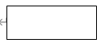

- **二、表达功能模型的工具---DFD图**
  - 1、DFD图：**数据流图**，是表达功能模型的工具。它是一种描述数据变换的图形化工具，包含：数据流、数据存储、加工、数据源和数据潭。
    - 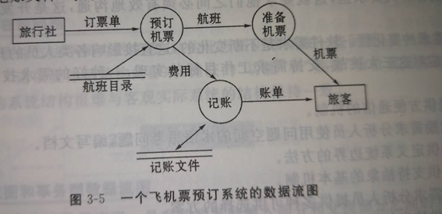

- **三、结构化方法源于的基本思想**
  - 在软件开发系统/产品的**需求工作中**，常面临**三大挑战**：
    - 1、问题空间理解：开发人员的理解和用户的理解存在一定的差距。
    - 2、人与人之间通信：开发人员之间的有效沟通。
    - 3、需求的变化性：软件需求不断变化。
  -  为了应对挑战，一个**好的需求**具有以下**基本特征**：
    - 1、提供方便通信的机制。
    - 2、鼓励需求分析人员使用问题空间的术语思考问题，编写文档。
    - 3、提供定义系统边界的方法。
    - 4、提供抽象的基本机制。
    - 5、为需求分析人员提供多种可供选择的方案。
    - 6、提供特定的技术，适应需求的变化。
- **四、构建系统模型的步骤**
  
  - 1、建立系统环境图，确定系统语境；
  - 2、自顶向下，逐步求精，建立系统的层次数据流图；
  - 3、定义数据流；给出数据项的基本数据类型。
  - 4、描述加工；根据系统的数据流图，给出其中每一个加工的小说明。

> 3.2 结构化设计

- **一、变换型数据流图和事务型数据流图**
  - 1、变换型数据流图：具有明显的**输入部分和变换部分之间**的界面、**变换部分和输出部分**之间界面的数据流图。
    - 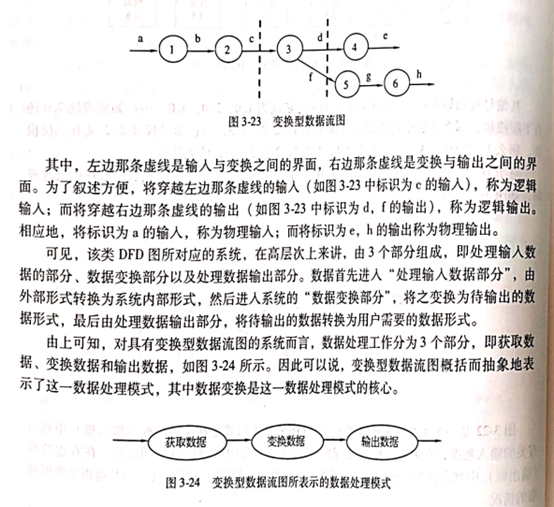
  -  2、事务型数据流图：数据达到一个加工点T，在其后的若干动作序列中选出一个来执行。
    - T点是事务中心，需要完成①接受输入数据；②分析并确定对应事务；③选取于该事务对应的一条活动路径
    - 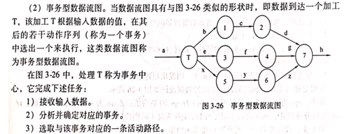
      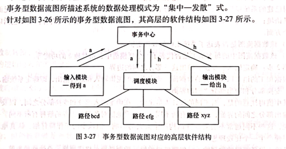
- **二、模块、模块内聚和模块耦合**
  - 1、模块：执行一个特殊任务的一个过程以及相关的数据结构，有：接口、模块体。
  - 2、模块内聚：**内部成分之间相互关联程度的度量**。
  - 3、模块耦合：**不同模块之间相互依赖程度的度量**。
  - 4、常见的模块间的耦合类型：
    - 1）内容耦合：一个模块用另一个模块的东西
    - 2）公共耦合：2个以上模块用同一个数据
    - 3）控制耦合：传递控制信号
    - 4）标记耦合：传递公告参数
    - 5）数据耦合：通过参数传递数据
  - 内聚
    - 偶然内聚：一组语句在多个地方出现。
    - 逻辑内聚：多个逻辑相关的功能放在一个模块
      - 比如一个模块需要读取(卡片/磁带/磁盘)
    - 通信内聚：一个模块集成很多数据集。P202304 第四题
      - 比如一个模块集成了添加删除修改
    - 时间内聚：该模块的功能在同一时间完成
      - 比如初始化系统/变量
    - 过程内聚
    - 顺序内聚
    - 功能内聚
- **三、详细设计工具：框图、PAD图、N-S图和伪码**
  - 1、框图：程序流程图。
  - 2、PAD图：采用二维数型结构图来表示程序的控制流。
    - 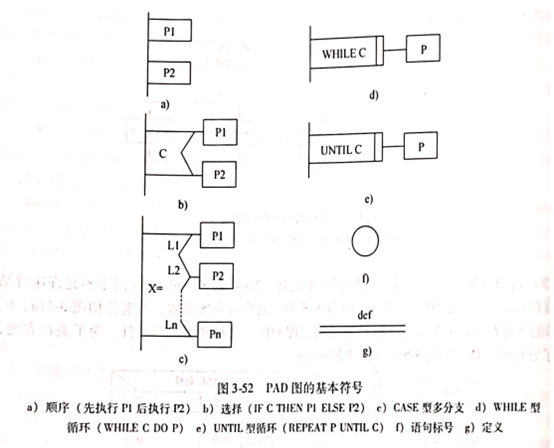
      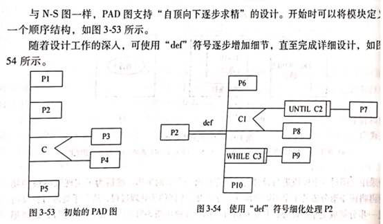
  - N-S图，盒图
    - 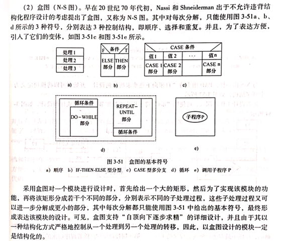
- **四、变换设计和事务设计**
  - 1、**变换设计**：将变换型数据流程图转换成**系统的模块结构图**。步骤：
    - 1）设计准备
    - 2）确定**输入、变换、输出**这三个部分之间的边界
    - 3）第一级分解：系统模块结构图顶层和第一层的设计
    - 4）第二级分解：自上而下，逐步求精。
  - 2、**事务设计的步骤**
    - 1）设计准备
    - 2）确定**事务中心**
    - 3）第一级分解：系统模块结构图顶层和第一层的设计
    - 4）第二级分解：自上而下，逐步求精。
- **五、高内聚低耦合原则以及经验性准则**
  - 1、改进软件结构，提高模块独立性；
  - 2、力求模块规模适中；
  - 3、力求深度、宽度、扇出和扇入适中；
  - 4、尽量使得模块作用域在其控制域之内；
  - 5、降低模块接口的复杂性；
  - 6、力求模块功能可以预测
- **六、设计工具的优缺点及相互转换**
  - 1、框图的优缺点
    - 优点：对控制流程的描绘很直观,便于初学者掌握。
    - 缺点：
      - (1)不是一种逐步求精的工具,它诱使程序员过早地考虑程序的控制流程,而不去考虑程序的全局结构。
      - (2)所表达的控制流,往往不受任何约束可随意转移,从而影响甚至破坏好的系统结构设计。
      - (3)不易表示数据结构
  - 2、N-S图的优缺点
    - 优点：
      - (1)它能清晰明确地表示程序的运行过程。
      - (2)盒图支持“自顶向下逐步求精”的详细设计。
    - 缺点：
      - (1)修改麻烦。
      - (2)当分支嵌套层次多时往往在一张纸上难以画下。
  - 3、PAD图的优缺点
    - 优点：
      - (1)清晰地反映了程序的层次结构。
      - (2)支持**逐步求精**的设计方法,左边层次中的内容可以抽象,然后由左到右逐步细化。
      - (3)易读易写,使用方便。大领食三准
      - (4)支持结构化的程序设计原理。
      - (5)可自动生成程序。

> - PDL
>   - 伪码
>   - 1、表示数据结构和处理过程的设计工具
>   - 2、混合语言
>   - 3、可自动生成程序代码
> - 总体设计：初始设计、精华设计、复审阶段

## 第四章 面向对象方法UML

>  4.1 UML术语
>
>  8个术语：类、接口、用况、协作、关联、泛化、细化、依赖
>
>  **其他类=类目**

- **一、类、接口、用况、协作等概念**
  - 1、类：一组具有**相同属性、操作、关系和语义**的对象描述。
    - 类的属性：共有的(public)、私有的(private)、受保护的(protected)、包内的；
    - 类的操作（方法）：共有的、私有的、受保护的、包内的；
    - 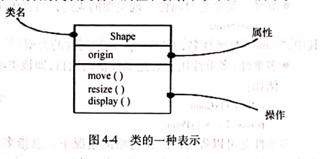
  - 2、接口：操作（方法）的集合。
    - 接口的两种形式：
    - 1）用分栏和关键字interface的矩形符号来表示。
      - 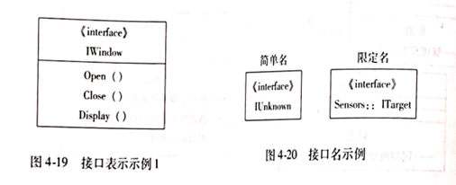
    - 2）采用小圆圈和半圆圈来表示
      - 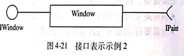
    - 3）用况：对一组动作序列的描述
    - 4）协作：协作是一种交互，涉及交互的三要素：交互各方、交互方式、交互内容。
- **二、关联、泛化、细化、依赖等概念**
  - 1、关联：**相同结构和相同链**的描述，是类目之间的一种结构关系。**实心三角表示方向**
  - 2、泛化：**一般性类目**和它较为特殊类目之间的一种关系。子类可以继承父类的属性和操作，也可以替换父类的声明。
  - UML给出以下的约束来进一步的说明泛化的含义。
    - 1）完整：给出了泛化中的所有的子类；
      - 2）不完整：没有给出泛化中的所有子类；
    - 3）互斥：允许一个子类作为它的类型；
    - 4）重叠：可能具有多个子类作为它的类型。
  - 3、细化：是**类目之间的语义关系**，其中一个类目规约了保证另一个类目执行的契约。**空心三角虚线**
  - 4、依赖：一个类目使用另一个类目的信息和服务，是一种是用关系。
    - **关联、泛化、细化都是一类特定依赖。只有这三种不可用时才可以使用依赖**
- **三、面向对象方法源于的基本思想**
 - 从现实客观存在的事务出发来构建软件，在系统构成中尽可能运用人类的思维方式。强调以问题域中的事务为中心来思考问题、认识问题。
- **四、UML的每一个术语所基于的原理以及它们在建模中的应用**
   - 1、UML是一种标准的图形化（可视化）的建模语言，可用于规约系统的制品、构造系统的制品、建立系统制品的文档。引入了8个专业的术语：**类和对象、接口、协作、用况、主动类、构建、制品和节点**。
   - **主动类**：是至少具有一个线程或进程的类，一般用于并发行为。
   - **构件**：是一种模块化的部件，表达空间中可独立标识的成分。
   - **制品**：包含物理信息、可替代的物理部件，用于代表源代码信息或运行信息的一个物理打包。
   - **节点**：运行时存在的物理元素，用于表示一种具有记忆功能和处理能力的计算机资源。
- **五、类在建模中的作用**
   - 类的功能主要有以下几个：
      - 1）模型化问题域中的概念；
      - 2）建立系统职责分布模型；
      - 3）模型化建模中使用的基本类型；
- **六、表达关联语义的基本手段**
   - 采用以下方法表达关联的含义：
      - 1、关联名；
      - 2、导航：给定一个类目，找到与之关联的另一个类目。
      - 3、角色：一端类目对另外一端类目的呈现；
      - 4、可见性
      - 5、多重性
      - 6、限定符
      - 7、聚合
      - 8、组合
      - 9、关联类
      - 10、约束
- UML模型表达格式
   - 1、类图：可视化地表达系统静态结构模型的工具，包含**类、接口、关联、泛化和依赖**。
   - 2、用况图：表达**系统功能模型**的图形化工具，包含六个模型元素：**主题、用况、参与者、关联、泛化和依赖**
   - 3、状态图：显示一个状态机的图，强调从一个状态到另一个状态的控制流。一个状态机是一种行为，规约了一个对象在其生存期间因响应事件并作出响应而经历的状态。
   - **UML状态分为三类：初态、终态和通常状态。**
   - 4、顺序图：一种交互图，由一组对象以及按时序组织的对象之间的关系组成，还包含这些对象之间发送的信息。

> - 总结
>   - 类：具有相同属性、操作、关系、语义的描述。**实现数据和操作的集合**。
>   - 类图可以包含：**包、子系统、实例**。
>   - 用况：动作序列的描述
>   - 用况图包含：主题、用况、参与者、关联、泛化、依赖。
>   - 状态图：从一个状态到另一个状态的控制流。
>   - 1、关联：实心三角。
>   - 2、泛化：空心三角 **实线**。（子类继承父类操作）
>   - 3、细化：空心三角 **虚线**。
>   - 4、依赖：有方向虚线。
>     - **关联、泛化、细化都是一类特定依赖。只有这三种不可用时才可以使用依赖**
>   - 顺序图操作子：**选择、条件、并发、迭代执行操作子**。

## 第五章 面向对象方法RUP

**以用况为驱动，以体系结构为中心的迭代、增量式开发**

> 5.2 核心工作流
>
> **核心工作流：需求获取、分析、设计、实现和测试**
>
> RUP的业务对象模型为了精化业务用况模型中的每一个业务用况，引用的3个术语：**工作人员、业务实体和工作单元**。
>
> RUP的实现目标：基于设计类和子系统生产构建；对构建进行单元测试，进行集成和连接；把可执行的构件映射到部署模型。
>
> RUP的测试包含：**内部测试、中间测试和最终测试**。

- **一、类、接口、用况、协作等概念**
  
  - 1、用况之间的基本关系。（识记）
    - 一组动作序列的描述，系统执行这些动作应产生对特定参与者有值的、可观察的结果。
  - 2、领域模型、业务模型以及在系统开发中创建它们的目的（领会）
    - **领域模型：**用于捕获系统领域领域中的一些重要领域对象类，一般是以类图表达的。三种形态：**业务对象、实在对象、概念和事件**；  
    - **业务模型：**捕获业务处理和其中的业务对象，通过两个层次来抽象一个业务：**业务用况模型**和**业务对象模型**。
  - 3、参与者的标识和描述（领会）
    - 是用况模型中的元素之一，每一个参与者都要命名和描述，给出了它的角色和它对环境的要求。
  - 4、用况标识以及标识中的有关准则，用况的事件流描述技术以及表述的基本内容。（领会）
    - 采用正文的事件流技术，给出用况的前置条件、开始的动作、基本路径、每一个可选路径与参与者的交互以及结束动作和后置条件等。
    - 应该注意三个问题：
      - 1）尽可能的反应用况的实际情况；
      - 2）不论施加什么结构，新引入的用况都不应太小或太大；
      - 3）避免对用况模型中的用况功能进行分解；
  - 5、分析包的标识以及分析包的二层结构（领会）
    - 主要特征：体现问题分离；高内聚、低耦合和尽可能体现一个系统的完整顶层设计。
  - 6、**边界类、实体类、控制类**的标识，以及他们的作用和关系（领会）
    - 边界类：核心边界类、原子边界类；
    - 实体类：标识一些体系结构具有重大影响的实体类；
    - 控制类：对**用况细化的控制和协调**进行处理；

- **二、需求获取层、需求分析层、设计层、实现层上的术语（识记）**

  - 1、需求获取层：
    - 目的是以UML为基础，使用UML中的用况、参与者以及依赖等术语类描述客观实际问题，从而形成系统二需求获取模型—一种特定的系统/产品模型，并产生该模型视角下的体系结构描述。
  - 2、需求分析层
    - 在**系统用况模型基础上**，创建系统分析模型以及在分析模型视角下的体系结构描述。引入了：**分析类、分析包**和**用况细化**来支持需求分析。
      - 1）**分析类**
        - 边界类：规约系统与参与者的交互，分离不同接口。
        - 实体类：规约需要长期存在于系统的模型对象。（粒度大）
        - 控制类：规约基本动作和控制流的处理与协调，和向其他对象委派工作。
      - 2）**分析包**：控制信息组织复杂性的机制，主要特征为：体现问题的分离；**高内聚、低耦合**；尽可能体现一个系统的完整顶层设计，尽可能的成为一些子系统或成为一些子系统的组成部分；
      - 3）**用况细化**：对用况模型中的一个特定用况提供一种直接跟踪的方式；
  - 3、设计层上的术语：定义满足需求规约所需要的软件结构。定义了四个术语：**设计类、用况细化（设计）、设计子系统、接口**；
    - 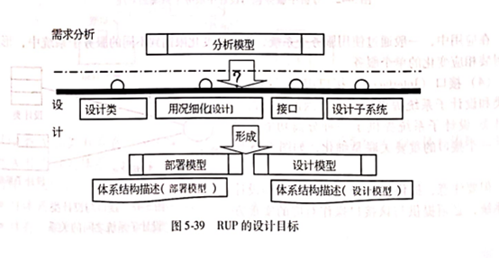
    - 设计类：对系统中一个类或类似构造的一个无缝抽象，主要特征有操作、属性、关系、方法、实现需求、是否为主动类；
    - 用况细化（设计）：是设计模型中的一个协作，通过使用设计类及其对象，描述一个特定用况是如何细化、执行的；
    - 设计子系统：包含设计类、用况细化、接口及其他子系统，通过对其操作来显示其功能；
    - 接口：规约有射击类和设计子系统提供的操作，其重要关联是细化；

- **三、模型的构成**

  - 1、系统/产品用况模型的构成
    - 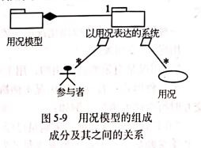
  - 2、系统/产品需求分析模型的构成
    - 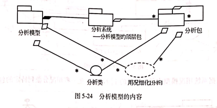
  - 3、系统/产品设计模型和部署模型的构成
    - 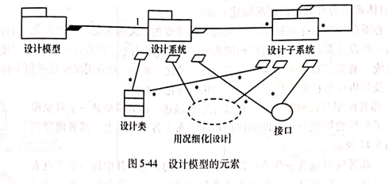

  

-  **四、创建系统/产品需求获取模型的步骤（识记）**

  - 1、列出获选需求
  - 2、理解系统语境
  - 3、捕获系统功能需求
    
  - 4、捕获非功能需求

- **五、创建系统/产品用况模型活动和任务（领会）**

- **六、创建系统/产品需求分析模型活动和任务（领会）** 

- **七、创建系统/产品设计模型活动和任务（领会）**

- **八、设计模型的四层结构（领会）**

  - 1、设计子系统和服务子系统以及他们的接口、依赖和内容；
  - 2、设计类以及它们具有的操作、属性、关系及其实现的需求；
  - 3、用况细化（设计）；
  - 4、设计模型视角下的体系结构描述；

>- 领域模型：以类图表示。
>- 领域对象：对工作环境中的事物或发生的事件进行表达
>- 需求获取：使用用况、参与者以及依赖等属于来抽象客观实际问题
>- 需求分析：目的是在用况模型基础上，创建系统分析模型。
>
>
>
>- 系统分析模型：解决用况模型中存在在二义性和不一致性。
>
>1
>
>- 分析模型包括：**结构分析、用况分析、类的分析、包的分析**
>- 捕获需求模型的目标是：**创建系统用况模型**。
>- 用况模型是一种概念模型对系统的抽象，包含 **系统参与者、系统用况** 及它们之间的关系。
>- 用况图：给出了每个参与者的描述和每个用况的描述。
>- 用况细化是一个：**协作**，针对一个用况其行为于多个分析类的细化。
>
>
>
>- 体系结构分析的目的是通过：**标识分析包、分析类**，建立分析模型和系统结构的骨架。
>- 标示分析类目的是细化用况，其需要：**实体类、控制类、边界类**。
>- 在 **系统层上** 描述类对象是如何交互。
>- 设计期间对方法的规约使用：**自然语言** 或适当使用 **伪码**。
>- 业务对象模型包含：**工作人员、业务实体、工作单元**。

## 第六章 软件测试

> 6.1 软件测试目标与软件测试过程模型

- 一、软件测试（识记）
  - 概念：按照规定的规程发现软件错误的过程。
  - IEEE提出的定义：使用人工或自动手段，运行或测定某个系统的过程，目的是为了检验它是否满足规定的需求，或清楚了解预期结果和实际结果之间的差异。
- 二、测试过程模型（识记）
  - 测试过程模型
    - 
  - **测试过程模型可分为三类**：
    - 环境模型：是对程序运行环境的抽象。
    - 测试对象模型：从测试的角度对程序的抽象。
    - 错误模型：对程序 中的错误及其分类的抽象。“什么是错误“，“一般性错误”，“严重错误”。

> 6.2 软件测试技术

- **一、测试覆盖及其它们之间的关系（领会）**
  - 关系：语句覆盖<=分支覆盖<=条件组合覆盖<=条件覆盖<=路径覆盖
- **二、事务流和控制流之间的区别以及为测试带来的影响（领会）**
  - 1、事务流和控制流之间的主要差异：（领会）
    - 1）基本模型元素所表达的语义不同；
    - 2）一个事务不等同于路径测试中的一条路径，可能在中间的某处就完成了某一用户工作，终结某一事务；
    - 3）事务流程图中的分支和节点可能是一个复杂的过程；
  - 2、事务流程图的特点为测试带来的影响（领会）
    - 1）性能增加，使得事务数目和单个事务处理流程具有相当的复杂性；
    - 2）事务流程图表达的系统模型更接近现实；
    - 3）事务测试技术最大的问题和最大的代价是获得事务流程图以及用例设计，好的用例设计是发现软件错误的关键；
  - 3、事务流程测试步骤：（领会）
    - 第一步：获得事务流程图
    - 第二步：浏览、复审
    - 第三步：用例设计
    - 第四步：测试执行
  - 4、运用等价类划分技术进行测试的步骤：（领会）
    - 第一步：建立等价类表
    - 第二步：为有效等价类设计测试用例；
    - 第三步：为无效等价类至少设计一个测试用例；
    - 第四步：测试执行

> 6.4 软件测试步骤

- **一、软件测试的基本步骤（领会）**
  - 1、**单元测试**：涉及编码和详细设计的文档，测试模块内的重要控制路径。
  - 2、**集成测试**：在单元测试的基础上，将所有模块组合成完整的系统进行测试，其目标是发现与接口有关的错误；
  - 3、**有效性测试**：目标是发现软件实现的功能与需求规格说明书不一致的错误；
  - 4、**系统测试**：是将软件溶于更大系统中时整个系统的有效性；
- **二、针对一个简单系统或一个特定的用况，创建系统的事务流测试模型（应用）**
  - 1、采用事务流测试技术进行软件测试的步骤分为四步： 
    - 第一步：获得事务流程图
    - 第二步：浏览、复审，主要是对事务分类，其中应关注“并生”、“丝分裂”、“吸收”和“结合”等事务，选取一个基本事务集作为系统功能测试的基础，为测试用例设计奠定基础。
    - 第三步：用例设计，设计足够的测试用例，实现基本的事务覆盖。
    - 第四步：测试执行
- **等价类方法**
  - 测试用例关键字：**测试用例、期望结果、覆盖范围**
  - 显示有效输入、显示无效输入

> - 黑白盒测试不能穷举测试。
> - 软件测试包括：软件配置、测试配置、测试工具。
> - 确认测试：**检查软件产品是否符合需求定义**。
> - 测试步骤：**单元测试、集成测试、有效性测试、系统测试**。
>
> 
>
> - 静态测试：人工测试
> - 白盒测试：分析程序的内部逻辑
> - 黑盒测试：对接口进行测试，检测输入数据是否能产生正确的输出信息。
> - 白盒是**结构测试**，黑盒测试是**功能测试**。
>
> 
>
> * 软件测试过程模型包括：**环境模型、被测对象模型、错误模型**。

## 第七章 软件生存周期过程与管理

> 7.1 软件生存周期过程的概述

- **一、过程分类（识记）**
  - **按过程主体**，把软件生存周期分为：
    - 1、**基本过程**：指那些与软件生产直接相关的活动集。该过程分为**获取过程、供应过程、开发过程、运行过程和维护过程**。
    - 2、**支持过程**：各方按他们的目标所从事的一系列相关支持活动集。该过程分为：文档过程、配置管理过程、质量保证过程、验证过程、确认过程、联合评审过程、审计过程和问题解决过程。
    - 3、**组织过程**：与软件生产组织相关的活动集。该过程分为：**管理过程、基础设施过程、培训过程和改进过程**。
- **二、组织上使能过程的作用（领会）**
  - 组织上使能过程一般来说组织层面上的工作，为项目的执行提供基本的保障，该过程分为5个子过程：
    - 1、**生存周期模型管理过程**：其任务为过程建立、过程评估、过程改进；
    - 2、**基础设施管理过程**：过程实现、基础设施的建立、基础设施的维护；
    - 3、**项目管理过程**：项目初始化、项目包评估、项目结束处理；
    - 4、**人力资源管理过程**：技能标识、技能开发、技能获取和供给、知识管理；
    - 5、**质量管理过程**：质量管理、质量管理纠正措施。

> 7.2 过程描述

- **一、软件实现过程、活动和任务；软件需求分析过程、活动和任务；软件体系结构设计过程、活动和任务（领会）**
  - 软件验证过程包含：**过程实现和验证**
  - 其中验证活动有五个任务：**需求验证、设计验证、代码验证、集成验证和文档验证**
- **二、软件验证过程、活动和任务（领会）**
  - 软件验证过程：证实一个过程或项目的每一软件工作产品/服务是否正确的反映了所规约的需求。
  - 活动1：过程实现
  - 活动2：验证
- **三、软件确认过程、活动和任务（领会）**
  - 软件验确认过程：证实所期望使用的软件工作产品是否满足其需求。
  - 活动1：过程实现
  - 活动2：过程确认

> 7.3 应用说明

- **一、剪裁过程及其应用（领会）**
  - 使剪裁这一标准过程满足以下特定情况或因素：
    - 1、**围绕一个组织**，该组织在一个协议中使用了这一标准；
    - 2、**影响一个项目**，该项目满足一个引用该标准的协议；
    - 3、**反映一个组织的需要**，其中该组织要供给产品或服务；

> 7.4 软件生存周期模型

- **一、瀑布模型、增量模型、演化模型、螺旋模型、喷泉模型（领会）**
  - 1、瀑布模型：**将软件生存周期各个活动规定为按固定顺序连接的若干阶段的模型**。规定了各个开发阶段的活动：系统需求、软件需求、需求分析、设计、编码、测试和运行，并且自上而下具有相互衔接的固定顺序；还规定了每一阶段的输入，即工作对象以及本阶段的工作成果，输出到下一阶段。
    - 瀑布模型的主要贡献：
    - 瀑布模型的主要问题：
  - 2、增量模型：是一非整体开发的模型。该模型是逐渐开发出来的，开发出一部分，向用户展示一部分，可让用户及早看到部分软件，及早发现问题。或者先开发一个原型软件，完成部分主要功能，展示给用户并征求意见，然后逐步完善，并获得满意的软件产品。
    - 优点:
    - 缺点：
  - 3、演化模型
    - 针对实现不能完整定义需求的软件开发的。主要特征：

    - 不足：容易弱化需求阶段的工作。
  - 4、螺旋模型
    - 将瀑布模型和增量模型结合起来，加入两种模型均忽略了的风险分析，弥补了这两种模型的不足。
  - 5、喷泉模型
    - 以用户需求为动力，以对象作为驱动的模型，适合于面向对象的开发方法。
  - 工作步骤：
    - 1）	制定计划
    - 2）	风险分析
    - 3）	实施工程
    - 4）	客户评估

> 7.5 过程规划与管理

- **一、创建一个软件项目生存周期过程的步骤（领会）**
  - 步骤：
    - 1、选择模型；
    - 2、细化生存周期模型；
    - 3、为每一个活动或任务标识合适的实例数目；
    - 4、确定活动的时许关系、检查信息流；
    - 5、建立过程计划的文档；
- **二、监控一个软件项目生存周期过程的要点（领会）**
  - 1、软件生存周期过程的监控
  - 2、生存周期改变所产生影响的评估
  - 3、改变的实施
- **三、针对一个小型的系统开发，建立该项目的生存周期过程（应用）**
  - 主要包控5项工作：选择模型；细化生存周期模型；为每一个活动或任务标识合适的实例数目；确定活动的时许关系、检查信息流；建立过程计划的文档；

> 过程管理：**过程建立、过程评估、过程改进**。
>
> 过程评估需要考虑：**资源需求、实施时间、员工情绪**。
>
> ISO/IEC 12207~2008把系统在其生存周期可执行的活动分为：**系统语境的过程、针对软件开发的过程**。
>
> 系统语境包含：**协议过程组、项目过程组、技术过程组、组织上项目使能过程组**。
>
> 针对软件开发的过程组包括：**软件实现过程组、软件支持过程组、软件复用过程组**。

## 第八章 集成化能力成熟度模型CMMI

> 8.2 CMMI模型部件

- **一、过程改善（识记）**
  - 过程改善：人为设计的一个活动程序，目的是改进组织的过程性能和成熟度，并改进这一程序的结果。
- **二、过程域、专用目标和共用目标（识记）**
  - 过程域：一个业务域中一束相关的实践，当他们一起得以实现时，就满足被认为对该过程域的改善具有重用作用的一组条件。
  - 专用目标：用于描述满足该过程域必须呈现的一些独有特征。它用于**帮助一个过程域是否得以满足**。
  - 共用目标：描述实现制度化的该过程必须呈现的特征，它用于**确定一个过程域是否得以满足**。
- **三、CMMI有关最佳实践的组织**
  - 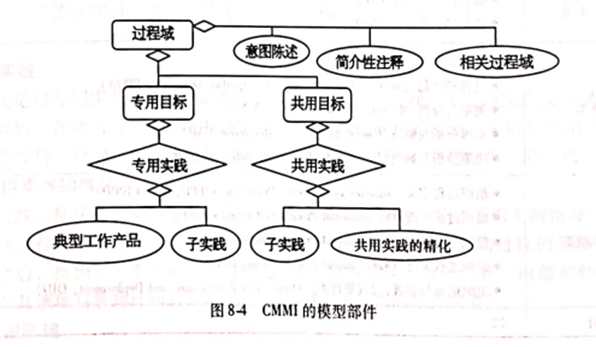
- **四、过程域及其分类（领会）**
  - 

> 8.3  CMII的等级

- **一、能力等级（识记）**
  - 能力等级：在单一过程域中已达到过程改善，为了过程管理，对过程改善程度所设定的几个“台阶”。
- **二、成熟度等级（识记）**
  - 成熟度等级：指达到预先定义的一组过程域所有目标的一种过程改善等级。
- **三、过程制度化（识记）**
  - 指过程被渗透在执行工作的方式中，执行的工作有一定承诺，并且在组织范围内是一致的。
- **四、能力等级的组成及其各等级的特征（领会）**
  - 
  - 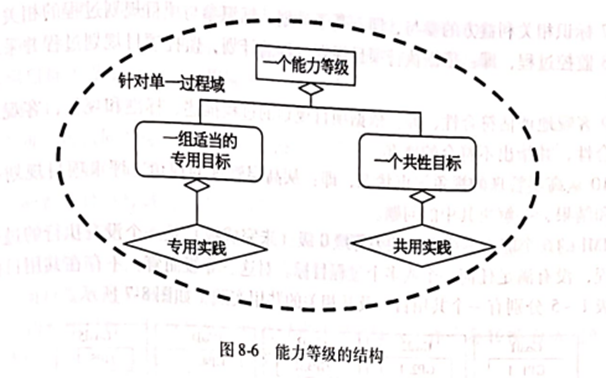
- **六、成熟度等级和能力等级之间的基本关系（领会）**
  - 成熟度等级和能力等级是互补的关系，两者都是一种过程改善路径，其中：
    - 1、能力等级的路径可使组织针对单一过程域不断改善该过程域，即表征组织对单一过程域的改进；
    - 2、成熟度等级的路径可使组织通过关注一个过程域不断改善一组相关的过程域，即表征组织对一组过程域的改进；
    - 3、两种等级的2~5使用了同样的名字；

> 8.4 过程域举例

- 一、项目规划过程达到成熟度2级所要满足的专用目标、公用目标以及所要实施的实践（领会）
  - 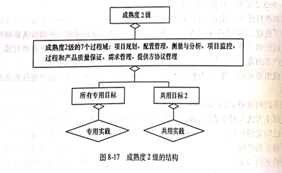
- 二、项目规划过程达到成熟度3级所要满足的专用目标、公用目标以及所要实施的实践（领会）
  - 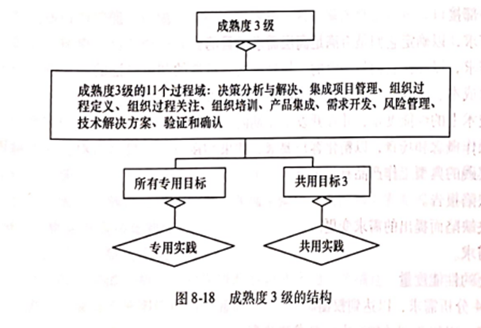

> - 项目规划包括：
>   - 估算工作产品和任务
>   - 确定需要的资源
>   - 协商承诺
>   - 生成进度
>   - 标识并分析项目风险
> - 估算规模的工作产品：文档、文件、硬件、固件、软件、工作产品。
> - CMMI模型部件说明
>   - 长方形：必要的模型部件（过程域、专用公用目标）
>   - 菱形：CMMI部件
>   - 椭圆形：资料性部件
>
> 1
>
> - 典型工作产品是专用实践产生的：**输出样品**。
> - 过程改善包括：**增强式变更、创新技术的改善**。
> - 组织的成熟度等级提供了 **预测组织性能** 的一种方式。
> - 持续化过程是：**敏捷的、创新的** 工作。
> - 项目规模的基本输入：**工作量估算、成本估算、进度估算模型**。

