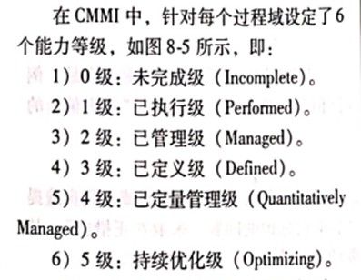
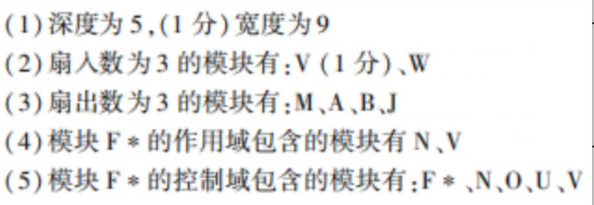
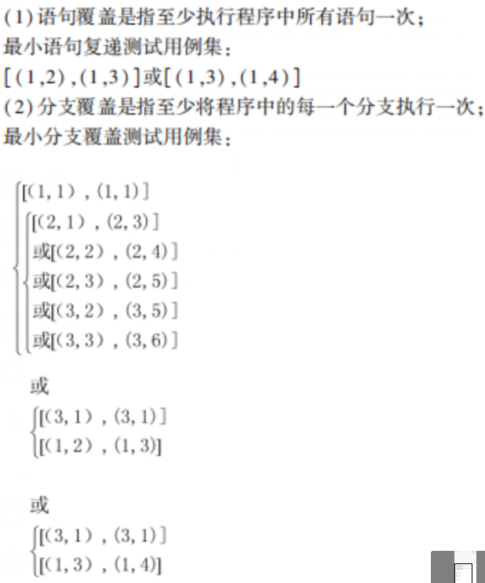
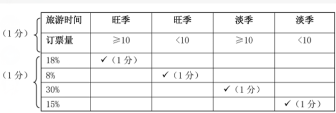
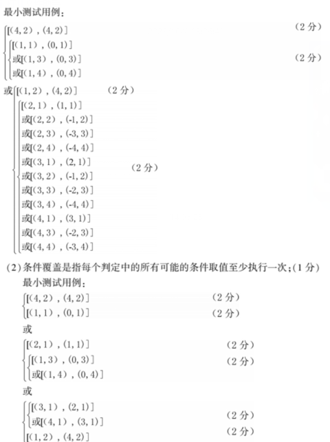
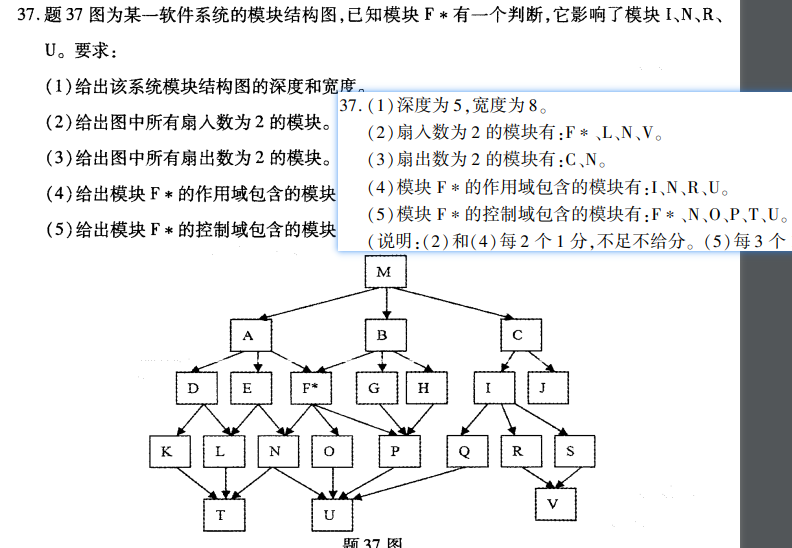
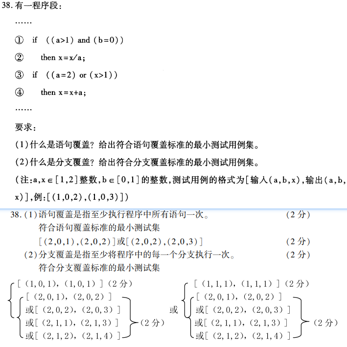

# 软件工程复习

> 选取测试用例的意思就是，让你选 N 个出来，完成覆盖。
>
> **可执行语句：菱形：if 语句**

语句覆盖：**所有语句至少执行一次**。如果出现 `y=x+y` 这种也算语句，也是要经过的（201810 的大题很清楚）

分支覆盖：**每个分支至少执行一次**，要 Y N 各完成一次。

条件覆盖：**所有可能条件的取值至少执行一次**。

`a>-1 and b>-1`：全真和全假各一次。每个取值均有一次真假即可。

条件组合覆盖：判定中所有可能的**条件组合**必须满足一次

`a>-1 and b>-1`：左边真右边假 + 左边假右边真 + 全真 + 全假一共 4 次。

条件和条件组合的区别在于：条件覆盖只需要**左边和右边各真假一次**就可以。

路径覆盖：每条路径执行一次

## 必考点复习

- 1

  - 模型分类：**概念模型**和**软件模型**。

  - 软件模型：**设计模型、实现模型**和**部署模型**。

- 2

  - 需求的特性：**必要的、无歧义的、可测得、可跟踪的、可测量的**。
  - 非功能需求分为：**性能需求、外部接口需求、设计约束、质量属性**。
    - 非功能需求可以**作用于**一个或多个功能需求。
  - 需求发现技术
    - 自悟
      - 适用情况：需求人员不能与用户交流
      - 成功条件：需求人员比最终用户有更多的应用领域和过程方面的知识。
      - 风险：无法验证需求是否满足用户
    - 交谈
      - 适用情况：需求人员可以与用户交流
      - 成功条件：需求人员具有“正确提出问题”的能力，回答人员具有“揭示需求本意”的能力。
      - 风险：交谈期间获得的需求是不断增长的，容易超出项目成功和进度限制。
    - 观察
      - 适用情况：用户允许需求人员进入现场观察。
      - 成功条件：需求人员具有洞察事物本质的能力
      - 风险：用户可能会抵触，客户可能认为开发者已经熟悉了他们的业务。
    - 小组会
    - 提炼
      - 适用情况：针对已经有部分需求文档的情况
      - 成功条件：有需求文档，并且需求人员有很好的想象力和需求标识能力。
      - 风险：无法验证需求是否满足用户
  - 需求规约的 4 个基本性质：**重要性和稳定性程度、可修改的、完整的、一致的**。

- 3

  - 表达
    - 箭头：数据流
    - 椭圆形：加工
    - 2 条平行线：数据存储
    - 正方形：数据源/数据潭
  - 字典：`{}`重复、`+`顺序、`|`选择
  - 结构化设计：**变换型数据流图、事务型数据流图**。
  - 需求工作的三大挑战是：**问题空间的理解、人与人之间的通信、需求的变化性**。
  - 耦合：**不同模块之间相互依赖程度的度量**。
    - 1）内容耦合：一个模块用另一个模块的东西
    - 2）公共耦合：2 个以上模块用同一个数据
    - 3）控制耦合：传递控制信号
    - 4）标记耦合：传递公共参数
    - 5）数据耦合：通过参数传递数据
  - 内聚：**内部成分之间相互关联程度的度量**。
    - 偶然内聚：一组语句在多个地方出现。
    - 逻辑内聚：多个逻辑相关的功能放在一个模块
      - 比如一个模块需要读取(卡片/磁带/磁盘)
    - 通信内聚：一个模块集成很多数据集。P202304 第四题
      - 比如一个模块集成了添加删除修改
    - 时间内聚：该模块的功能在同一时间完成
      - 比如初始化系统/变量
    - 过程内聚
    - 顺序内聚
    - 功能内聚
  - **程序流程图/框图、盒图、PAD、PDL**
  - PDL
    - 伪码
    - 1、表示数据结构和处理过程的设计工具
    - 2、混合语言
    - 3、可自动生成程序代码

- 4 UML

  - 类：具有相同属性、操作、关系、语义的描述。**实现数据和操作的集合**。
  - 类图可以包含：**包、子系统、实例**。
  - 交互的三要素：**交互各方、交互方式、交互内容**。
  -
  - 1、关联：实心三角。（**相同结构和相同链**的描述）
  - 2、泛化：空心三角 **实线**。（子类继承父类操作）
  - **约束泛化的含义：完整、互斥、重叠。**
  - 3、细化：空心三角 **虚线**。（**类目之间的语义关系**）
  - 4、依赖：有方向虚线。（**用关系**）
  - **关联、泛化、细化都是一类特定依赖。只有这三种不可用时才可以使用依赖**
  -
  - 用况：动作序列的描述
  - 用况之间三种关系：**泛化、扩展、包含**。
  - 用况图包含：**主题、用况、参与者、关联、泛化、依赖**。
  -
  - 状态图：从一个状态到另一个状态的控制流。
  - 顺序图：一组对象以及按时序组织的对象之间的关系组成。
  - 顺序图操作子：**选择、条件、并发、迭代执行操作子**。

- 5

  - RUP：**以用况为驱动，以体系结构为中心，迭代、增量式开发**。
  - RUP 的实现目标：基于设计类和子系统生产构建；对构建进行单元测试，进行集成和连接；把可执行的构件映射到部署模型。
  - 核心工作流：**需求获取、分析、设计、实现和测试**。
  -
  - **领域模型：**用于捕获系统领域领域中的一些重要领域对象类，一般是以类图表达的。三种形态：**业务对象、实在对象、概念和事件**；
  - **业务模型：**捕获业务处理和其中的业务对象，通过两个层次来抽象一个业务：**业务用况模型**和**业务对象模型**。
    - 业务对象模型包含：**业务实体、工作人员、工作单元**。
  - 捕获需求模型的目标是：**创建系统用况模型**。
  -
  - 需求获取层
  - 需求分析层：在 **系统用况模型** 基础上，引入了：**分析类、分析包**、**用况细化**来支持需求分析。
    - 分析类
      - 边界类：规约系统与参与者的交互，分离不同接口。
      - 实体类：规约需要长期存在于系统的模型对象。（粒度大）
      - 控制类：规约基本动作和控制流的处理与协调，和向其他对象委派工作。
    - 分析包：控制信息组织复杂性的机制。 **高内聚、低耦合**。
    - 用况细化：对用况模型中的一个特定用况提供一种直接跟踪的方式；
  - 设计层：定义满足需求规约所需要的软件结构。定义了四个术语：**设计类、用况细化（设计）、设计子系统、接口**；
  - RUP 的测试包含：**内部测试、中间测试、最终测试**。
  - 分析模型包括：**体系结构分析、用况分析、类的分析、包的分析**
  - 用况模型是一种概念模型对系统的抽象，包含 **系统参与者、系统用况** 及它们之间的关系。

- 6
  - 单元测试：测试单个模块功能和系统测试。
  - 集成测试：测试模块组合功能和软件结构检验。
  - 有效性测试：验证软件需求的可追溯性。
  - 系统测试：测试系统的有效性。
  - 白盒是**结构测试**，黑盒测试是**功能测试**。
  - 软件测试过程模型包括：**环境模型、被测对象模型、错误模型**。
  - 软件测试包括：**软件配置、测试配置、测试工具**。
- 7

  - 基本过程：**获取过程、供应过程、开发过程、运行过程和维护过程**。
  - 组织过程：**管理过程、基础设施过程、培训过程和改进过程**。
  -
  - ISO/IEC 12207~2008 把系统在其生存周期可执行的活动分为：**系统语境的过程、针对软件开发的过程**。
  - ISO 把生存周期分为 7 个过程组
    - 系统语境过程组：**协议过程组、项目过程组、技术过程组、组织上项目使能过程组**。
    - 软件开发的过程组：**软件实现过程组、软件支持过程组、软件复用过程组**。
  - 软件复用过程组：**领域工程过程、复用程序管理过程、复用资产管理过程**。
  - 软件验证过程包含：**过程实现和验证**
  - 其中验证活动有五个任务：**需求验证、设计验证、代码验证、集成验证、文档验证**
  - 软件确认过程：过程实现、过程确认。
  - 过程管理：**过程建立、过程评估、过程改进**。
  - 过程评估需要考虑：**资源需求、实施时间、员工情绪**。
  - 使剪裁这一标准过程满足以下特定情况或因素：
  - 1、**围绕一个组织**，该组织在一个协议中使用了这一标准；
  - 2、**影响一个项目**，该项目满足一个引用该标准的协议；
  - 3、**反映一个组织的需要**，其中该组织要供给产品或服务；
  - 1、瀑布模型：**将软件生存周期各个活动规定为按固定顺序连接的若干阶段的模型**。规定了各个开发阶段的活动：系统需求、软件需求、需求分析、设计、编码、测试和运行，并且自上而下具有相互衔接的固定顺序；还规定了每一阶段的输入，即工作对象以及本阶段的工作成果，输出到下一阶段。
  - 2、增量模型：是一非整体开发的模型。该模型是逐渐开发出来的，开发出一部分，向用户展示一部分，可让用户及早看到部分软件，及早发现问题。或者先开发一个原型软件，完成部分主要功能，展示给用户并征求意见，然后逐步完善，并获得满意的软件产品。
  - 3、演化模型

    - 针对实现不能完整定义需求的软件开发的。主要特征：

    - 不足：容易弱化需求阶段的工作。

  - 4、螺旋模型
    - 将瀑布模型和增量模型结合起来，加入两种模型均忽略了的风险分析，弥补了这两种模型的不足。
  - 5、喷泉模型
    - 以用户需求为动力，以对象作为驱动的模型，适合于面向对象的开发方法。

- 8
  - CMMI 模型部件说明
  - 圆角长方形：必要的模型部件（过程域、专用公用目标）
  - 菱形：CMMI 部件/实践
  - 椭圆形：资料性部件/产品
  -
  - 专用目标：用于**帮助一个过程域是否得以满足**。
  - 共用目标：用于**确定一个过程域是否得以满足**。
  -
  - 典型工作产品是专用实践产生的：**输出样品**。
  - 过程改善包括：**增强式变更、创新技术的改善**。
  - 组织的成熟度等级提供了 **预测组织性能** 的一种方式。
  - 持续化过程是：**敏捷的、创新的** 工作。
  - 项目规模的基本输入：**工作量估算、成本估算、进度估算模型**。
  - 估算规模的工作产品：**文档、文件、硬件、固件、软件、工作产品**。
  -
  - CMMI 提供了：**能力等级**的过程改善路径、以及、**成熟度**的过程改善路径。
  - 能力等级
  - 0 未完成、1 已执行、2 已管理、3 已定义、4 已定量管理、5 持续优化
  - 组织成熟度等级
    - 1 初始、2 已管理、3 已定义、4 已定量管理、5 持续优化

## 简洁

- 1
  - 模型分类
  - 软件模型
- 2
  - 需求的特性
  - 非功能需求分为
  - 需求发现技术
  - 需求规约的 4 个基本性质。
- 3
  - 字典：`{}`重复、`+`顺序、`|`选择
  - 结构化设计
  - 需求工作的三大挑战是
  - 耦合
- 4
  - 类图可以包含
  - 交互的三要素
  - 关联、泛化、细化、依赖
  - 用况之间三种关系
  - 用况图包含
  - 顺序图操作子
- 5
  - RUP 概念
  - 核心工作流
  - 领域模型
  - 业务模型
  - 业务对象
  - 需求分析层
  - 设计层
  - RUP 的测试包含
  - 分析模型包括
- 6
  - 黑白盒测试
  - 软件测试过程模型包括
  - 软件测试包括
- 7
  - 基本过程、组织过程
  - ISO/IEC 12207~2008 把系统在其生存周期可执行的活动分为
  - 软件验证过程包含
  - 使剪裁这一标准过程满足以下特定情况或因素
- CMMI 提供了：**能力等级**的过程改善路径、以及、**成熟度**的过程改善路径。

## 真题

> 错误是条件/期望，失效是后果/规约
>
> 调试：发现错误，改正错误，重新测试的推理过程。

### 202304

- 选择题
  - 选择题答案：BDACA、DDACB、ABC
  - **不属于** 常见的加工表达工具：**判定图**。
  - 为描述模块化包之间的关系，UML 给出了：**引入依赖、访问依赖**。
    - 边界类：规约系统与参与者的交互，分离不同接口。
    - 实体类：规约需要长期存在于系统的模型对象。（粒度大）
    - 控制类：规约基本动作和控制流的处理与协调，和向其他对象委派工作
  - 调试是一个推理过程
  - 软件单元测试首先测试：**数据流**。
- 填空题
  - 软件工程的目的是提倡以：**工程的原理、原则和方法进行软件开发**。
  - 软件需求分析阶段，**功能需求** 是整个需求的主体。
  - 结构化方法包括：**结构化分析方法、结构化设计方法、结构化程序设计方法**。
  - 度量模型独立指标中，**耦合** 是指不同模块之间互相依赖的度量。
  - RUP 采用 **用况** 技术获取需求，其目标是使用 UML 中的 **用况**、参与者、依赖来抽象客观实际问题。
  - 黑盒测试技术包括：**事务处理流程技术、状态测试技术、定义域测试技术**。
  - ISO 软件生存周期分为 **5** 个基本过程、8 个支持过程、 **4** 个组织过程。
  - 集成测试可以采用什么方式递增组装软件：**自顶向下、自底向上**。
  - 顶层工作结构 WBS 的目的是 **估算项目范围**。
- 简答题

  - 31 计算机软件的定义

    - 计算机软件一般是指计算机系统的程序及其文档。其中,程序是计算机任务的处理对象和处理规则的描述;文档是为了理解程序所需的阐述性资料;软件是一个特定问题域的抽象,是一种逻辑实体。

  - 32 需求的基本性质

    - 必要的;无歧义的;可测量的;可跟踪的;可测的。

  - 33 创建系统类图所涉及的工作
    - (1)创建一个系统的类图依赖于所使用的方法学;
    - (2)涉及以下 4 方面的工作:
      - **模型化待建系统中的概念**：形成类图中的基本元素;
      - **模型化待建系统中的各种关系**：形成该系统的初始类图;
      - **模型化系统中的协作**：给出该系统的最终类图;
      - **模型化逻辑数据库模式**。
  - 34 RUP 创建系统用况模型应进行的活动

    - (1)发现并描述参与者;
    - (2)发现并描述用况;
    - (3)确定用况的优先级;
    - (4)精化用况;
    - (5)构造用户界面原型;
    - (6)用况模型结构化。

  - 35 软件生存周期模型

    - (1)软件生存周期模型是一个包括软件产品开发运行和维护中有关过程、活动和任务的框架;
    - (2)软件生存周期模型为组织软件开发活动提供了有意义的指导;
    - (3)常见的软件生存周期模型有瀑布模型、演化模型、螺旋模型、增量模型等。

  - 36 能力等级和成熟度等级之间的区别和联系
    - (1)区别:能力等级是一种**过程改善路径**,该路径可使组织针对单一过程域不断改善该过程域。成熟度等级也是一种**过程改善路径**,该路径可使组织通过关注一组过程域不断改善一组相关的过程域;
    - (2)联系:能力等级和成熟度等级都是 CMMI 提供的两种过程改善路径,侧重不同:它们**都是按共用目标从弱到强**。当某一过程域逐步完成了所有等级的“最佳实践”,它才可能满足成熟度等级对单一过程域的要求。当一组过程域及相关共用目标的一个成熟度等级完成后,软件过程才能实现高一级别的“成熟”,从而实现对软件过程有效管理的“最佳实践”。

- 应用题
  - 
  - 

### 202210

- 选择题
  - ADCBC、DCDBC、CBBBA
  - 调试是一个发现错误、改正错误、重新测试的推理过程。
  - 模块测试
    - 单元测试：测试单个模块功能和系统测试
    - 集成测试：测试模块组合功能和软件结构检验。
    - 有效性测试：验证软件需求的可追溯性。
    - 系统测试：测试系统的有效性。
- 选择题
  - **模块的控制域**：模块本身和所有直接或间接从属它的模块集合。
  - UML 节点：运行时存在的物理单元，具有 **记忆能力、处理能力** 的计算机资源。
  - 事件可分为：**信号事件、调用事件、时间事件、变化事件**。
  - 常用静态评估技术：**评审、走查、形式化证明**。
  - 软件测试的首要目标：**预防错误**。次要目标是：**发现错误**。
  - 软件是整个系统的一个组成部分，其执行系统中的：**控制功能、耦合功能、软件本身提供的功能**。
  - CMMI 提供了：**能力等级**的过程改善路径、以及、**成熟度**的过程改善路径。
- 简答
  - 31 实现软件开发本质的基本途径
    - (1)软件开发的本质,即实现问题空间的概念和处理逻辑到解空间的概念和处理逻辑之间的映射;
    - (2)实现这一映射的基本途径,即系统建模;
    - (3)系统建模,是指运用所掌握的知识,通过抽象,给出该系统的一个结构—系统模型。
  - 32 初始发现需求的常用技术
    - (1)自悟;
    - (2)交谈;
    - (3)观察;
    - (4)小组会;
    - (5)提炼。
  - 33 UML 表达客观事物之间关系的术语以及定义
    - (1)为了表达各类客观事物之间的关系,UML 给出了表达关系的基本术语:关联、泛化、细化、依赖;
    - (2)关联是类目之间的一种结构关系,是对一组具有相同结构、相同链的描述。 泛化是一般性类目和它的较为特殊性类目之间的一种关系。 细化是类目之间的语义关系,其中一个类目规约了保证另一个类目执行的契约。 依赖是一种使用关系,用于描述一个类目使用另一类目的信息和服务。
  - 34 RUP 需求获取的基本步骤
    - 需求获取的基本步骤是:列出候选的特征、理解系统语境、捕获系统功能需求、捕获非功能需求。
  - 35 项目的过程建立所涉及的工作
    - (1)选择软件生存周期模型;
    - (2)细化所选择的生存周期模型;
    - (3)为每一个活动或任务标识合适的实例数目;
    - (4)确定活动的时序关系;
    - (5)建立过程计划的文档。
  - 36 项目规划过程域的意图和专用目标
    - (1)项目规划过程域的意图是建立并维护项目活动计划的定义,项目计划提供了执行和控制项目活动的基础;
    - (2)项目规划过程域的专用目标有建立估算、开发项目计划、获得对该计划的承诺。
- 大题
  - 18%、8%、30%、15%
  - 
  - 分支覆盖是指至 少将程序中的每一个分支执行一次
  - 

### 202204

- 1
  - URP 竖线圆形是边界、水平是实体、箭头是控制
  - **形式化** 的需求规约
  - 类中对象参与一个关联数目，称为该关联的 **多重性**。
  - UML 事件分为：内部事件、外部事件。
  - RUP 分析类分为：**边界类、实体类、控制类**。
  - RUP 四个开发阶段：**初始、精化(减少风险估算成本)、构造(确保交付)、移交**。
  - 经典的黑盒测试技术：**等价类划分、边界值分析、因果图**。
  - 需求开发过程域的意图是分析：**客户需求、分析产品需求、产品部件需求**。

### 202110

- 1
  - 软件开发的本质：不同抽象层术语以及`处理逻辑`之间的映射
  - 表达功能模型的工具是：`数据流图/DFD`
  - 结构化程序设计的基本结构：`顺序结构、选择结构、循环结构`。
    - 或者说定义字典过程中的表示。
  - 软件开发三要素：`术语、表达格式、过程指导`。

### 202104

- BBCAA BCADD DACBC
  - 聚合>空心菱形。
  - 测试失败，调试正确
- 1
  - 实现处理逻辑映射的是：`系统建模`。
  - `模块` 是指软件中具有特定标识的独立成分。
  - `实线椭圆` 表示用况。
  - 类图中通常包含：`类、接口、关联、泛化、依赖等`。
  - UML 采用 `用况图` 支持系统功能的建模，`交互图` 支持系统交互的建模。
  - 集成测试中，每当组合一个模块是，必要进行 `回归测试`。
  - CMMI 的等级可用于 `评定活动、估算`。

> 202010

1. 提高模块的独立性应遵循原则：**高内聚低耦合**。
2. **用况图** 可用于概念模型和软件模型的动态结构。
3. 与所规约的系统执行之间的误差是指：**失效**。
4. 白盒测试技术依据的是程序的：**逻辑结构**。
5. 软件开发的本质就是实现 **问题空间** 的概念和处理逻辑到 **解空间** 的概念和处理逻辑之间的映射。
6. 在需求发现常用的技术中,无法验证所发现的需求是否满足用户的要求,无法验证发现的需求是否正确的技术是 **自悟** 和**提炼**。
7. 如一个加工的输人数据和输出数据之间的逻辑关系比较复杂,可以采用 **判定表** 或者 **判定树** 等表达工具,以避免产生不一致的理解。
8. 待建系统的数据流图一般可以分成两种基本类型,即 **转换型数据流图** 和事务性数据流图。
9. 结构化程序设计方法选择(分支)结构的表达式表示为：**IF-THEN-ELSE**。
10. 类的泛化关系中，一个类有多个父类，说明它使用了：**多继承**。
11. 每个学生只能属于一个班级,因此就要把这一关联标识为：**组合**。
12. 类图是可视化地表达系统静态结构模型的工具,通常包含：**类、接口、关联、泛化和依赖关系**。
13. RUP 的突出特点是,它是一种以 **用况** 为驱动的,以体系结构为中心的迭代,增量式开发。
14. RUP 从两个角度描述软件结构,分别为**系统设计模型**与表达物理分布的 **系统部署模型**。
15. RUP 利用 UML 给出的表达事物和事物之间关系的基本术语和多种模型的表达工具，定义了 **需求获取层、系统分析层、设计层、实现层** ，并给出了实现各层模型之间映射的基本活动以及相关指导。
16. 软件测试是一个有程序的过程,包括 **测试设计、测试执行**以及**测试结果比较**等。
17. 《ISO/IEC 系统与软件工程一软件生存周期过程 12207 -1995》标准中,按基本过程分类,软件生存周期分为 **获取过程、供应过程、开发过程、运行过程和维护过程** 5 个步骤。
18. CMMI 的两个等级可用于 **评定活动和估算**，所谓过程评估的结果。

> 201910

1. 需求规约是一个正式的、受控的**起始点**（不是验收点）。
2. 属性的可见性指的是,该类的属性是否可以被其他类(类目)所使用,其中表示受保护的符号是：`#`。+public、#protected、-private
3. 接口可以被其他类目使用，**但本身不能访问其他类目**。
4. RUP 的测试活动包括：**计划测试、设计测试、实现测试、执行测试、评价测试**。
5. RUP 的业务对象模型为了精化业务用况模型中的每一个业务用况，引用的 3 个术语：**工作人员、业务实体和工作单元**。
6. 单元测试关注的是：**每个独立的模块**。
7. 软件工程发展前期主要研究 **系统实现技术**，后期则开始关注**软件质量和软件工程管理**。
8. 需求规约一般会产生 **初始测试计划和用户系统操作描述** 两个文档。
9. 客观的表示方法中，表达式“性别=男|女”属于 **选择** 结构。
10. 软件系统结构中 **层次图** 适合自顶向下的软件设计过程。
11. 结构化设计中，执行一个特殊任务的一个过程以及相关的数据结构，称为 **模块**。
12. 一个类只是使用另一个类作为它的操纵参数，则之间的关系抽象为 **依赖** 。
13. RUP 的 **部署模型** 包含节点和主动类到节点的初始映射。
14. 软件评估分为 **静态评估和动态评估**。
15. 事务流程图中，一个事务被另一个事务吸食称为 **事务吸收**。
16. 《ISO/IEC...》为了正是所期望使用的软件工作产品是否满足其需求的过程是 **软件确认过程**。

> 201904

## 大题

### 结构图

> 202204

- 扇入数：被 N 个箭头 **所指**。
- 扇出数：指向 N 个模块
- 作用域：影响模块

### 测试用例

> 202204

- 题目中，给了 a 和 x 的范围，必须是 1 或 2。b 则是 0 或 1。
- 语句覆盖
  - 至少执行程序中所有语句一次（比如 `做一次if语句判断`）
- 分支覆盖
  - 至少将程序中所有分支执行一次（比如 `执行一次if语句里面的内容`）
- 注意：这的`X`是取值后的`X`

> 202010

38 题

第一题**列出条件和编号**

很简单，就是测试 if 语句能否顺利执行

程序 A：`if(A>=1)&&(B>=2)`、`if(X>=88)&&(Y>=66)`

程序 B：`if(A>=1)&&(B>=2)`、`if(X>=88)&&(Y<66)`

技巧是：程序 A 和程序 B 只有第二句中的 `Y<66`，这两句 **if** 只出现了 `>= `和 `<` 两个符号做测试。如下：（记得列出编号！！因为第二题要用）

A>=1 且 B>=2、A>=1 且 B<2

A<1 且 B>=2 、A<1 且 B<2

X>=88 且 Y>=66、X>=88 且 Y<66

X<88 且 Y>=66 、X<88 且 Y<66

这样懂了吧？就是用**大于等于**和**小于**两个符号列出所有可能。

**第二题，列出相应的测试用例**

意思就是第一题一共有**8 个条件**，根据条件给出 A 和 B（X 和 Y）的值，然后写上其对应的条件。如：

A=1 B=2 覆盖 ①`A>=1且B>=2`

B=1 B=1 覆盖 ②`A>=1且B<2`

X=88 Y=66 覆盖 ⑤`X>=88且Y>=66`

X=88 Y=1 覆盖 ⑥`X>=88且Y<66`

以此类推、一共 8 个、**覆盖** 必须要写，编号后面的式子不用谢，我只是方便看。

**第三题，指出发现的错误**

其实也很简单，看程序 A 和程序 B 中`if(X>=88)&&(Y>=66)`和`if(X>=88)&&(Y<66)`

会发现如果 X=88 Y=66 就会出错。

---

> 201910

37 题，深度宽度扇入扇出不说

38 题，判断三角形等边等腰或一般三角形的程序算法流程图

**第一题用等价类划分测试用例**

1~3：

**根据题意得出通过 ABC 三个数构建三角形**

1、任意两边之和大于第三边（判断是个三角形）

2、存在两边之和小于第三边（判断是个三角形，得出结论他不是三角形）

3、存在两边之和等于第三边

围绕 ABC 三个数做展开

4、A、B、C 为正整数

5、存在非数字

6、存在负数

7、超过三个数

8、少于三个数

9、等边三角形

10、等腰三角形

11、一般三角形

**第二题根据上面有效等价类测试用例**

**这里必须覆盖完整**，意思是写 3 个用例，包含等边、等腰、一般三角形

555 覆盖（149）等边三角形

668 覆盖（1410）等腰三角形

789 覆盖（14 11）三角形

**第二题根据上面无效等价类测试用例**

上面是有效，意思是可以正常结束走流程。**这里是无效！**

125 覆盖 2、123 覆盖 3、A57 覆盖 5、-157 覆盖 6、1357 覆盖 7、13 覆盖 8

> 201904

37 题：一个简化的学生成绩管理系统描述如下：教务人员维护学生信息和课程信息,将学生信息录人到学生信息表,将课程信息录入到课程表,将学生成绩录入到成绩表。学生登录系统,查询个人学生成绩。请画出该系统的顶层 DFD 图和 0 层 DFD 图。

**顶层 DFD 图**：圆形代表**数据管理系统**，只有这一点是和 0 层不同的

长方形[教务人员]---->这里分三个箭头（学生信息、课程信息、成绩）分别指向------->三个圆圈（录入学生信息、录入课程信息、登记学生成绩）

**0 层 DFD 图就是数据流程图**

> 201810

38 题

现准备为某银行开发一个信用卡管理系统 CCMS，该系统的基本功能为：

(1)信用卡申请：非信用卡客户填写信用卡审请表，说明所要申请的信用卡类型及申

请者的蒸本信息，并提交给 CCMS。如果信用卡申请者被银行接受，CCMS 将记录

该客户的基本信息，并发送确认函给客户，告知客户信息卡的有效期及信贷限

额；否则该客户将会收到一封拒绝函。非信用卡客户收到确认函后，便成为信用

卡客户。

(2)信用卡激活：信用卡客户向 CCMS 提交激活请求，用信用卡号和密码激活该信用

卡。激活操作结束后，CCMS 将激活通知发送给客户，告知其信用卡是否被成功

激活。

(3)信用卡客户信息管理：信用卡客户的个人信息可以在 CCMS 中进行在线管理。每

位信用卡客户可以在线查询和修改个人信息。

(4)交易信息查询。信用卡客户使用信用卡进行的每一笔交易都会记录在 CCMS 中。

信用卡客户可以通过 CCMS 查询并核实其交易信息(包括信用卡交易记录及交

易额)。

请画出系统的顶层数据流图，并指如其所包含的外部实体。

**外部实体代表：数据源和数据潭**（非信用卡客户、信用卡客户、银行）

非信用卡客户：

第一点：申请信息--->**信用卡管理系统 CCMS**，然后**信用卡管理系统 CCMS**需要将结果（拒绝涵和确认函）返还给客户

信用卡客户：

第二点：**信用卡管理系统 CCMS**--发送--激活通知-->给客户

第三点：查询和修改个人信息

第四点：交易信息查询

银行：

第一点：**信用卡管理系统 CCMS**--发送--信用卡申请信息-->银行。银行在发送 **信用卡申请验证结果** 给 CCMS

**如果信用卡申请者被银行接受**这一点很关键

- 2017 年 10 月最后大题
  - 语句覆盖：没有走分支，一直都是 Y
  - 分支覆盖：一直都是走分支，一直都是 N
  - 条件覆盖：

路径覆盖、语句覆盖、分支覆盖、条件覆盖、条件组合覆盖
