# 操作系统

**说明：前几章不会按照教程上的来，会将二和三，以及四和五章节合在一起。**

处理器的工作状态分为：管态、目态。P56

管态又称为：内核态、特权态（特态）、系统态

目态：用户态、普通态（普态）


系统调用分为：进程控制类系统调用、文件控制类系统调用、进程通信类系统调用、设备管理类系统调用、信息维护类系统调用、


## 第一章 概论

- 广义的计算机系统包含：机械式系统和电子式系统。
  - 电子式系统中可分为：模拟式和数字式两种计算机系统

- 计算机系统的资源包括两大类：硬件资源和软件资源。

> 1.1 操作系统的概念

- **1.1.1  什么是操作系统**
  - 程序的运行涉及4个方面：
    - ① 程序设计语言；
    - ② 编译程序；

    - ③ 操作系统；

    - ④ 硬件指令系统（计算机硬件系统）。
  - 操作系统在程序的执行过程中具有关键作用。 
- 1.1.2 操作系统的定义 
  - 什么是操作系统？**操作系统是介于应用程序和硬件中间的**
    - **`操作系统是计算机系统中的一个系统软件。`**
    - 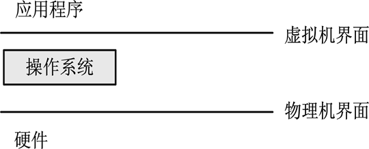
  - 操作系统到底操控（管理）什么事情？ （**操作系统的定义**）管理计算机上所有事情的系统软件，完成如下功能：
    - （1）有效组织和管理计算机系统的硬件和软件资源。
    - （2）合理地组织计算机的工作流程，保证计算机资源的公平竞争和使用。
    - （3）方便用户使用计算机。
    - （4）防止对计算机资源的非法侵占和使用。
    - （5）保证操作系统自身的正常运转。


- **补充：操作系统的设计目标**
  - （1）**方便性**。提供统一且界面友好的用户接口，以方便用户使用计算机。
  - （2）**有效性**。操作系统应能合理地组织计算机的工作流程，改善系统性能并提高系统运行效率。
  - （3）**可扩展性**。以适应计算机硬件和计算机网络等发展的需要。
  - （4）**开放性**。遵循国际标准构造一个统一的开放环境，实现应用程序的可移植性和互操作性。
  - （5）**可靠性**。可靠性包括正确性、健壮性和安全性。
  - （6）**可移植性**。避免重复工作及缩短软件研发周期。


- **1.1.3 操作系统的基本特征**
- 不同类型的操作系统有各自的特征，但它们都具有**并发性、共享性、虚拟性**和**不确定性**等共同特征。
  - 1）并发性
    - 操作系统的并发性能够有效地**改善系统资源的利用率，提高系统的效率**。
  - 2）共享性
    - 资源共享的方式可以分为以下两种。
    - （1）**互斥使用方式**：指当一个进程正在使用某种资源时，其他欲使用该资源的进程必须等待，仅当这个进程使用完该资源并释放后，才允许另一个进程使用这个资源，即它们只能互斥地共享该资源，因此这类资源也称互斥资源。系统中的有些资源，如打印机、磁带机的使用就只允许互斥使用。
    - （2）**同时使用方式**：系统中有些资源允许在同一段时间内被多个进程同时使用，这里的“同时”是宏观意义上的。**典型的可供多个进程同时使用的资源是磁盘**。
    - 共享性和并发性是操作系统两个最基本的特征，它们互为**依存**。
  - 3）虚拟性
    - 虚拟性（Virtual）的本质含义是指将**一个物理实体映射为多个逻辑实体**。前者是实际存在的；后者是虚拟的，是一种感觉性的存在。
    - 例如，在单CPU系统中虽然只有一个CPU存在，且每一时刻只能执行一道程序，但操作系统采用了多道程序技术后，在一段时间间隔内，从宏观上看有多个程序在运行，给人的感觉好像是有多个CPU在支持每一道程序运行。这种情况就是将一个物理的CPU虚拟为多个逻辑的CPU。
  - 4）不确定性
    - （1）**每个进程需要多少时间才能完成都是不可预知的。**
    - （2）**并发程序的执行结果也可能不确定**

    - （3）外部设备中断、I/O请求、程序运行时发生中断的时间等都是不可预测的。


- 1.1.5 操作系统的主要功能 
  - 为了高效使用计算机软、硬件资源，提高计算机系统资源利用率和方便用户使用，都采用多道程序设计技术。
  - **多道程序设计技术**是指内存中同时放入多道程序交替运行并共享系统资源
  - 引入了多道程序设计技术后，**使操作系统具有多道程序同时运行且宏观上并行、微观上串行的特点**，而操作系统也正是随着多道程序设计技术的出现而逐步发展起来的。
- 主要功能：
  - **处理器管理/进程管理**
    - 其主要任务是对CPU进行分配，并对其运行进行有效地控制与管理。
    - 在多道程序环境下，CPU的分配与运行是以**进程**为基本单位的。对CPU的管理和调度最终归结为对**进程**的管理和调度，它的主要功能包括：**进程控制和管理**、**进程同步与互斥**、**进程通信**、**进程死锁**。
  - **存储管理**
    - 存储管理是指对内存空间的管理。程序要运行就必须由外存装入内存，当多道程序被装入内存共享有限的内存资源时，存储管理的主要任务就是为每道程序分配内存空间，使它们彼此隔离互不干扰，尤其是当**内存不够用时，要通过虚拟技术来扩充物理内存**，把当前不运行的程序和数据及时调出内存，需要运行时再将其由外存调入内存。
    - 存储管理的主要功能包括：**内存分配**、**内存保护**、**地址变换**和**内存扩充**。
  - **文件管理**
    - 文件是计算机系统中除CPU、内存、外部设备等硬件设备之外的另一类资源，即**软件资源**。程序和数据以文件的形式存放在外存储器（如磁盘、光盘、磁带、优盘）上，需要时再把它们装入内存。
  - **设备管理**
    - 设备管理是指计算机中**除了CPU和内存之外**的所有输入输出设备（I/O设备）的管理。其首要任务是为这些**设备提供驱动程序**或**控制程序**，以便用户不必详细了解设备及接口的细节就可以方便地对设备进行操作。
    - 设备管理的另一个任务就是通过**中断技术、通道技术**和**缓冲技术**使外部设备尽可能**与CPU并行工作**，以**提高设备的使用效率**。为了完成这些任务，设备管理的主要功能包括外部设备的分配与释放、缓冲区管理、共享型外部设备的驱动调度、虚拟设备等。
  - **用户接口** 
    - 为了方便用户使用，操作系统向用户提供了使用接口。接口通常以命令、图形和**系统调用**等形式呈现给用户，前两种形式供用户通过键盘、鼠标或屏幕操作，后一种形式**供用户在编程时使用**。
    - 用户接口的主要功能包括：**命令接口管理、图形接口管理**（图形实际上是命令的图形化表现形式）和**程序接口管理**。用户通过这些接口能方便地调用操作系统功能。
  - **网络与通信管理 **（书上没有）
    - 网络操作系统至少应具有以下3种管理功能。
    - （1）**网络资源管理**。计算机联网的主要目的之一是共享资源，网络操作系统应能够实现网上资源共享，管理用户程序对资源的访问，保证网络信息资源的安全性和完整性。
    - （2）**数据通信管理**。计算机联网后，站点之间可以互相传送数据。数据通信管理为网络应用提供必要的网络通信协议，处理网络信息传输过程中的物理细节，同时通过通信软件，按照网络通信协议完成网络上计算机之间的信息传输。
    - （3）**网络管理**。包括网络性能管理、网络安全管理、网络故障管理、网络配置管理和日志管理等。


> 1.2 操作系统的体系结构 ※选择题

- 那么如何保证操作系统的重要性呢？通常的办法是采用**内核态**和**用户态**两种模式。
  - 内核态是指**操作系统程序运行的状态**，在该状态下可以执行操作系统的所有指令（包括特权指令），并能够使用系统的全部资源。
  - 用户态是指**用户程序运行的状态**，在该状态下所能执行的指令和访问的资源都将受到限制。

> 1.2.1  用户态和内核态的划分

- **1.2.1  用户态和内核态的划分**
- 内核态
  - 访问的资源多、（可靠性、安全性要求高）、维护管理比较复杂  
- 用户态
  - 访问的资源有限、（可靠性、安全性要求低）、编程和维护比较简单 

> 1.2.2 操作系统的逻辑结构

- **1.2.2 操作系统的逻辑结构**
- 1 单内核结构
  - 优点：结构紧密，模块间可以方便地进行组合以满足不同的需要，灵活性较好，效率高。
  - 缺点：对模块功能的划分往往不能精确确定，模块的独立性可能较差；模块之间调用关系复杂，导致系统结构不清晰，正确性和可靠性不容易保证，系统维护较困难。  
    - 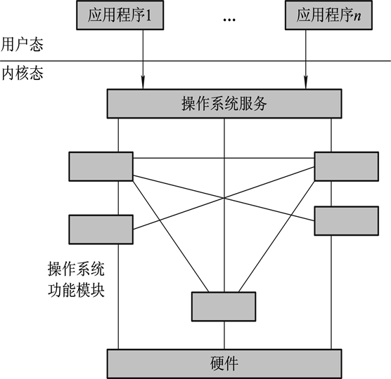
- 2 分层式结构
  - 优点：按单向调用关系以层为单位组织各模块，模块之间的依赖、调用关系清晰、规范，对一个分层进行修改不会影响到其他层次，系统的调试和验证比较容易，系统正确性更容易得到保证，系统中间的接口也会减少。
  - 缺点：在有单向依赖关系的各分层之间实现通信时系统开销较大，影响系统的效率。 
    - 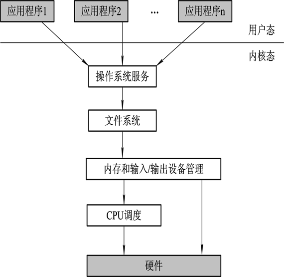
- **3 微内核结构**
  - 优点：① 对进程的请求提供了一致性接口，不区分内核级服务和用户级服务，所有服务均采用消息传递机制提供；② 具有较好的可扩充性和易修改性；③ 可移值性好；④ 对分布式系统提供支持。
  - 缺点:运行效率比分层式结构好，但仍然不高。

> 1.2.3 操作系统的运行模型

- **1.2.3 操作系统的运行模型**
- **独立运行的内核模型**：有自己的独立存储空间和独立运行环境，执行过程不与应用程序（进程）发生关联。
- **嵌入到用户进程中执行的模型**：创建用户进程时为其分配了一个核心栈，可将操作系统的内核程序嵌入到用户进程中运行。
- **作为独立进程运行的模型**：小部分核心功能仍然在内核态下运行，而操作系统的大部分功能则在用户态由一组独立的服务器进程提供（见微内核结构）。


> 1.3 操作系统的形成与发展 ※问答题

- **1.3.1  操作系统的形成时期**
- 1 手工操作阶段
  - 从第一台计算机诞生（1946年）至20世纪50年代中期的计算机属于第一代计算机，构成计算机的主要元器件是电子管。
  - 缺点：
    - 手工操作方式本身耗费了大量时间，而在这个时间里计算机只能等待，因此严重降低了计算机资源的利用率，即出现了严重的人机矛盾。
- 2 监控程序阶段（早期批处理阶段）
  - 作业（程序）自动转换装入技术的实现导致了操作系统的雏形——监控程序的产生。
  - 单道批处理系统是操作系统的雏形

> 1.3.2 操作系统的成熟时期

- **1.3.2 操作系统的成熟时期**
- 1 多道批处理操作系统
  - 20世纪60年代，随着中断技术和通道技术的出现，多道程序设计技术成为现实。
  - **当输入机或打印机工作时，CPU必须等待**
  - 引入多道程序设计技术可以提高CPU的利用率，充分发挥计算机硬件的并行能力。
  - **真正做到了CPU的执行与I/O设备的操作是同时进行**
  - 进行多道程序设计时，需要解决以下三个问题：
    - （1）程序浮动与存储保护问题。
    - （2）CPU的调度和管理问题。
    - （3）其他资源的管理和调度问题。
- 2 分时操作系统
  - 推动分时系统形成和发展的主要动力是用户需求。用户需求表现在以下三个方面：
    - （1）人-机交互。
    - （2）共享主机。
    - （3）便于用户上机。
  - 分时系统的特点
    - 分时系统是指计算机系统由若干用户共享，系统将CPU的执行时间分割为一个个时间段（称为时间片），然后轮流分配给每一个用户使用，每个用户程序每次只能在CPU上运行一个时间片。由于轮转间隔的时间很短，使用户几乎感觉不到这种间隔，因此对用户来讲好像整个计算机系统由他独占。


> 1.4 主要操作系统的类型 

- **1.4.1 批处理操作系统**
  - 在批处理系统中，用户提交给计算机的工作常被称为作业。**一个作业通常由程序、数据和作业说明书组成**。
  - 单道批处理操作系统的特征是**一批作业自动按提交顺序依次装入内存执行**，每次只允许一个作业进入内存运行，先提交的作业总是先完成。

> 1.4.2 分时操作系统

- **1.4.2 分时操作系统**
  - 分时操作系统的特性
  - （1）独立性。
  - （2）同时性（多路性）。
  - （3）交互性。
  - （4）及时性。

> 1.4.3 实时操作系统

- **1.4.3 实时操作系统**
  - 实时操作系统是指具有实时（及时）特性，能够支持实时控制与实时信息处理的操作系统。典型的实时系统有三种：**过程控制系统、信息查询系统**以及**事务处理系统**。


> 1.5 操作系统安全性概述 

- 有效的安全机制：
  - （1）身份鉴别    （2）存取控制    （3）最小特权管理
  - （4）硬件保护    （5）安全审计    （6）入侵检测
  - （7）数据加密


> 1.6 操作系统运行基础

- **1.6.1  处理器及工作模式**
  - CPU内部的寄存器分为两类：
    - （1）用户可见寄存器
    - （2）控制和状态寄存器

> 1.6.2  中断技术

- **1.6.2  中断技术**
  - 中断具有以下特点：
    - （1）中断是随机的。
    - （2）中断是可恢复的。
    - （3）中断是自动处理的。
  - 计算机系统中引入中断的目的主要有两个：一是**解决CPU与I/O设备的并行工作问题**；二是**实现实时控制**。
  - 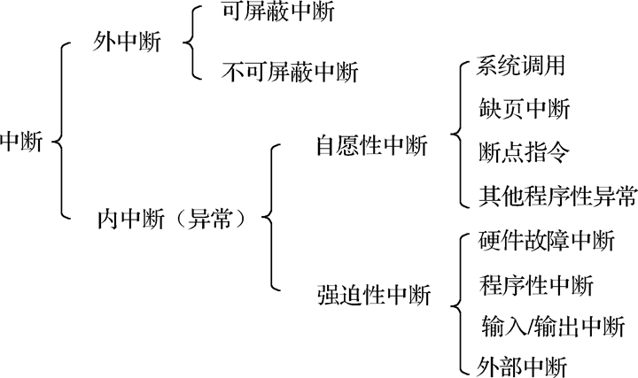
  - （1）外中断：指来自于CPU之外的外部设备通过硬件请求方式产生的强迫性中断。
  - （2）内中断：是由CPU在执行指令过程中检测到一个或多个错误或异常条件引起的，
  - 内中断的分类：
    - （1）强迫性中断。
    - （2）自愿性中断。
    - 自愿性中断事件是当前运行程序所期待的，是用户在程序中有意安排的中断，它表示用户程序对操作系统的某种需求。
  - **访管中断**：访管中断是通过执行访管指令而产生的中断。


### 习题

1. 什么是操作系统？请说明操作系统在计算机系统中的作用和地位。
   1. 操作系统是计算机系统中的一个系统软件，它是这样一些程序模块的集合：它们能够有效地组织和管理计算机中的硬件和软件资源，合理地控制计算机工作流程，控制程序的执行，并向用户提供各种服务功能，使用户能够灵活、方便、有效地使用计算机，并使整个计算机系统能高效地运行。
2. 操作系统管理计算机系统的哪些资源？
   1. 硬件和软件资源。
3. 请从资源管理角度说明操作系统的主要功能。
   进程管理（处理器管理）、存储管理、文件管理、作业管理、设备管理
4. 操作系统有哪些基本特征？
   并发性：计算机系统中同时存在若干个正在运行着的程序；
   共享性：操作系统程序和多个用户程序共享系统中的各种资源
   随机性：操作系统的运行是在一种随机的环境下进行的
5. 比较Windows、UNIX、Linux操作系统的体系结构，有什么异同？
   Windows体系结构是分成的模块系统，主要层次有硬件抽象层HAL、内核、执行体和大量的子系统集合；
   UNIX操作系统的系统架构图，其最里层是硬件，作为整个系统的基础；其次是操作系统内核，包括进程管理、存储器管理、设备管理和文件管理四个资源管理功能；往外一层是系统调用接口，及操作系统与用户的接口shell以及编译程序等；最外层是应用程序
   Linux系统有四个主要部分，及内核、shell、文件系统和用户程序。
6. Android操作系统有什么特点？
   Android操作系统分为四层，从高层到低层分别是应用程序层、应用框架层、系统运行库层和Linux内核层。
   以Linux为核心的手机操作平台，是一款开放式操作系统
7. 手机操作系统通常提供哪些功能？
   除了操作系统通常具备的功能（进程管理、存储管理、文件管理、作业管理、设备管理）之外，还必须具有接打电话，收发短信等通讯功能。
   除此之外，当代手机还通常具备摄影录像，音视频播放等媒体功能。同时还普遍提供软件安装管理的功能，以通过第三方软件进一步丰富手机的功能。
8. 请叙述各种类型操作系统的工作方式及特点。
   一般把操作系统分为三种基本类型，即批处理操作系统、分时系统和实时系统
   (1)批处理操作系统
   批处理操作系统分为简单批处理系统和多道批处理系统两种类型。
   用户将作业交给系统操作员，系统操作员在收到作业后并不立即将作业输入计算机，而是在收到一定数量的作业后，组成一批作业，再把这批作业输入到计算机中。这批作业可在系统中形成一个连续的、自动转接的作业流。系统操作员然后启动操作系统，系统自动、依次执行每个作业。最后由操作员将执行完毕的作业结果交给用户。
   批处理操作系统的特点是成批处理。
   (2)分时系统
   分时操作系统是为了弥补批处理系统不能提供交互式快速服务的缺点而发展起来的。一台计算机主机连接了若干个终端，每个终端可由一个用户使用。用户通过终端交互式的向系统提出命令请求，系统接受用户的命令后，采用时间片轮转方式处理服务请求，并通过交互方式在终端上向用户显示结果。用户根据系统送回的处理结果发出下一道交互指令。
   分时操作系统具有多路性、交互性、独占性和及时性的特点
   (3)实时系统
   使计算机能在规定的时间内，及时响应外部事件的请求，同事完成对该事件的处理，并能控制所有实时设备和实时任务协调一致地工作的操作系统。目标是，在严格的时间范围内，对外部请求做出反应，系统具有高度可靠性。
   实时系统主要有两类：硬实时系统、软实时系统
   (4)嵌入式操作系统
   嵌入式操作系统就是运行在嵌入式芯片环境中，对整个芯片以及它所操作、控制的各种部件装置等资源进行统一协调、调度、指挥和控制的系统软件。
   嵌入式操作系统具有高可靠性、实时性、占有资源少、智能化能源管理、易于连接、低成本等优点。
   (5)个人计算机操作系统
   个人计算机操作系统是一种单用户多任务的操作系统。其主要特点是：为单个用户服务；采用图形界面人机交互的工作方式，界面友好；使用方便，用户无须具备专门知识，也能熟练地操作系统。
   (6)网络操作系统
   为计算机网络配置的操作系统成为网络操作系统。网络操作系统是基于计算机网络的、在各种计算机操作系统之上按照网络体系结构协议标准设计开发的软件，包括网络管理、通信、安全、资源共享和各种网络应用。
   计算机网络有：集中式模式、分布式模式
   (7)分布式操作系统
   分布式操作系统是网络操作系统的更高级形式，除了有网络操作系统的功能之外，期特征是，系统中所有主机使用同一个操作系统、资源深度共享、透明性和自治性。
9. 请比较批处理系统、分时系统以及实时系统之间的相同点和不同点。
   相同点：这三类操作系统均为现代计算机系统中普遍使用的操作系统，操作系统本身以及它所管理的对象都是并发的系统，是一个极其复杂和庞大的软件系统。
   不同点：批处理操作系统的特点是成批处理，用户不能干预自己作业的远行；分时系统的特点是多路性、交互性、独占性和及时性；实时操作系统的特点是能在严格的时间范围内对外部请求做出反应，以及具有高度可靠性。
10. 请描述分时系统下响应时间的含义。
    分时系统中，通常把用户从终端发出命令到系统给予回答所经历的时间定义为 响应时间。
11. 在什么情况下应该采用批处理方式？在什么情况下应该考虑分时系统策略？
    批处理系统适用于追求系统资源利用率高、作业吞吐率高的计算机系统。
    分时系统适用于需要提供交互式快速服务的计算机系统。
12. 现代的通用操作系统把批处理方式和分时方式二者结合起来，为什么要这样做？这 样的结合有什么特点？
    这样的操作系统结合了批处理和分时两种系统的特点，该系统把处理终端用户的、交互式的、比较小的但需要及时处理的作业作为“前台作业”予以优先处理；把需要较长运行时间、要调用其他外部设备、比较大型但无须终端用户干预的且不需要立即处 理的作业作为“后台作业”进行批处理。这样，使整个计算机系统忙闲结合，能更有效地利用计算机系统的资源。
13. 实时操作系统有什么主要特征？
    在严格的时间范围内，对外部请求做出反应，系统具有高度可靠性。
14. 在如下的应用场合中，应该选用什么类型的操作系统呢？并请说明为什么。
    导弹控制； 实时操作系统
    国家统计局软件；通用的分时/批处理操作系统
    汽车发动机点火控制；实时操作系统
    火车订票系统；网络操作系统
    互联网电子游戏。网络操作系统
15. 请说明什么是SPOOLing 技术？在现代操作系统中有没有使用SPOOLing 技术？
    SPOOLing 技术的全称是“同时的外部设备联机操作”。该技术是用磁盘设备作为主机的直接输入输出设备，主机直接从磁盘上选取作业远行，作业的执行结果业存在磁盘上，通道负责将用户作业从外设动态写入磁盘，并使这一操作与主机并行。从而 大大提高了处理器和各种外部设备的利用效率。由于SPOOLing 技术需要通道技术， 所以一般用于大型计算机系统和那些对 I/O处理能力要求比较严格的系统中，一般低档 微型计算机中，不使用此技术。
16. 网络操作系统和分布式操作系统都是配置在计算机网络上的操作系统，它们之间有 什么本质上的不同？
    网络操作系统是基于计算机网络的，是在各种计算机操作系统之上按网络体系结 构协议标准设计开发的软件，它包括网络管理、通信、安全、资源共享和各种网络应用。 分布式操作系统是网络操作系统的更高级形式，除了有网络操作系统的功能之外，其特 征是系统中所有主机使用同一个操作系统、资源的深度共享、透明性和自治性。
17. 操作系统设计的过程包括哪些方面，在每个方面都要考虑什么问题？
    操作系统的设计过程包括功能设计、算法设计和结构设计。在每个方面均应考虑使操作系统具有可靠性、高效性、易维护性、易移植性、安全性及简明性等问题
18. 操作系统的设计目标是什么？
    目标有三条：系统模块化、模块标准化、通信规范化；
19. 影响操作系统正确性的因素有哪些？
    影响操作系统正确性的因素包括操作系统的功能成分多、各种外部设备 的接口复杂、参与开发的人员较多
20. 在进行操作系统结构设计时应考虑哪些问题？
    应考虑组成操作系统的各部分的划分原则以及它们之间的关系（即通信），简言之，即操作系统的构成法和组合方法。
21. 请说明整体式结构、层次式结构和微内核结构的基本思想及优缺点？
    整体式结构（模块组合法）的基本思想是首先确定操作系统的总体功能，然后将总功能 分解为若干子功能，实现每个子功能的程序称为模块，再通过接口将所有模块连接起来形成一个操作系统的整体。
    优点：结构紧密、接口简单直接、系统效率较高。
    缺点：模块间转接随便，各模块相互牵连，独立性差，系统结构不清晰；数据基本上作为全程量处理，模块的修改和维护较困难；由于模块组合常以大型表格为中心，限制了系统的并发性。
    层次式结构的基本思想是为克服模块结构的缺点、减少各模块之间无规则的互相调用、 相互依赖关系，力求将模块间的调用的无序性变为有序性，将操作系统的所有功能模块按功能流图的调用次序，将模块分成若干层，各层之间的模块只能是单向依赖或单向调用关系。
    优点：既具有模块法把整体问题分解成局部化的优点，使各模块自己的组织结构和依赖关系清晰明了，增加了系统的可读性和可适应性，增加了系统的可靠性，易于调式、易于修改、易于扩充、易于维护等。
    微内核（客户/服务器）结构适宜于应用在网络环境下分布式处理的计算环境中。
    优点：将系统的分成若干个小的并且自包含的服务进程分支，每个分支运行在独立的用户进程中，相互之 间通过规范一致的方式接收发送消息而联系起来。优点：可靠]灵活、适宜于分布式处 理的计算环境。
    缺点：效率较低。

## 第二章 处理器与进程和线程

- 计算机的工作方式主要由CPU的工作方式决定，CPU管理成为操作系统的核心功能。
- **以进程为基本单位来实现CPU的分配与执行**
- 处理器中有两类寄存器：用户可见寄存器、控制和状态寄存器。
- 处理器的工作状态分为：管态、目态

> 2.1.1 程序的顺序执行

- **2.1.1 程序的顺序执行**
  - 程序的顺序执行的特点：
    - （1）顺序性。
    - （2）封闭性。程序在完全封闭环境下运行，运行结果不会受到外界因素的影响。
    - （3）程序执行结果的确定性。执行结果与执行速度无关。
    - （4）程序执行结果的可再现性。只要初始条件相同，都将获得相同的结果。
  - 程序的顺序执行的优点：    
    - 程序的顺序性、封闭性和可再现性。给程序的编制、调试带来了极大的方便
  - 程序的顺序执行的缺点：
    - CPU与外部设备之间不能并行工作，**资源利用率低，计算机系统效率不高。**

> 2.1.2 程序的并发执行

- **2.1.2 程序的并发执行**
  - 在计算机硬件引入**通道**和**中断**机构后，就使得CPU与外部设备之间、外部设备与外部设备之间可以并行操作，使得多道程序设计成为可能。
  - **多道程序的并发执行是指多个程序在宏观上的并行，微观上的串行。**
  - 并发执行的特点：
    - 程序的并发执行实质上是**程序间的并发**，CPU与I/O设备之间的并行。
  - 并发程序对资源的共享与竞争，又会导致程序执行环境与运行速度的改变，从而可能产生**程序运行结果不唯一问题**。
  - 多道程序并发执行的特性：
    - （1）间断性。
    - （2）失去了封闭性。
    - （3）不可再现性。


### 进程

> 2.1.3 进程

- **2.1.3 进程**
  - 1 进程的定义
    - 程序是完成某一特定功能的指令序列，是一个静态概念，而CPU的执行活动则是程序的执行过程，是一个动态概念。
    - **程序这个静态的概念已无法正确描述并发程序的动态执行。**
    - **进程的定义**：进程是一个可并发执行的具有独立功能的程序关于某个数据集合的一次执行过程，也是操作系统进行资源分配和调度的基本单位。
  - 2 进程的结构
    - PCB--用来存储程序向前推进的执行过程中所要记录的有关运行信息。
    - **进程实体＝程序段＋相关数据段＋PCB**
  - 3 进程的特征
    - （1）**动态性**。进程实质是程序的一次执行，因而是动态的。
    - （2）**并发性**。多个进程实体在一段时间内能够并发执行。
    - （3）**独立性**。一个进程是一个相对完整的资源分配单位。
    - （4）**异步性**。各进程按各自独立的、不可预知的速度向前推进。
    - （5）**结构性**。一个进程由程序、数据和控制块三部分组成。
    - （6）**交往性**。一个进程在运行过程中可能会与其他进程发送直接的或间接的互相作用。


> 2.2 进程的状态及转换

> 2.2.2 进程的三态模型

- **2.2.2 进程的三态模型**
  - 三种基本状态：**运行、就绪、等待**
    - （1）运行状态。进程获得了CPU和其他所需要的资源，目前正在CPU上运行。
    - （2）就绪状态。进程获得了除CPU之外的所需资源，一旦得到CPU就可以立即投入运行。
    - （3）等待状态（阻塞/封锁状态）。进程运行中发生了某种等待事件（如发生了等待I/O的操作）而暂时不能运行的状态。处于该状态的进程不能去竞争CPU，因为此时即使把CPU分配给它也无法运行。
    - 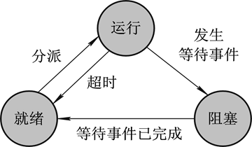

> 2.2.3 进程的五态模型

- **2.2.3 进程的五态模型**
  - 引入了**创建状态**和**结束状态**后，系统又增加了三个新的进程状态变迁：
  - （1）**由空到创建状态**。执行一个程序时系统为其创建一个新进程，新进程的状态为创建状态。 
  - （2）**由创建状态变迁到就绪状态**。当新创建进程的初始化工作完成后，系统将其状态转变为就绪状态，并将其插入到进程就绪队列中。
  - （3）**运行状态变迁到终止状态**。当前运行的进程运行结束或被取消，进程的状态从运行状态转换为终止状态。
    - 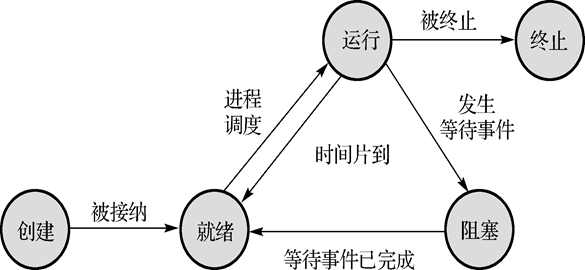

> 2.2.4  进程的挂起

- **2.2.4  进程的挂起**
  - 前面讨论的五状态进程模型中，新创建的进程一旦被系统接纳就一直存在于内存中，直到被终止。
  - 解决方法是：采用交换技术将内存中暂时不能运行的某些进程挂起（保存到外存），释放其所占用的内存资源，以便重新接纳一个新进程或外存上已具备运行条件的进程进入内存的进程就绪队列。
  - **进程挂起（也称换出）是指在内存中的进程被暂时移出（如磁盘）的过程。**


- PCB是操作系统中最重要的数据结构之一，因为它是**进程存在的唯一标志**。
- 在几乎所有的多道程序操作系统中，进程的PCB都是全部或部分常驻内存。


> 2.2.5 进程控制块

- **2.2.5 进程控制块**
  - 进程控制块的组织方式：
    - （1）线性表方式
    - （2）链接表方式
    - （3）索引表方式


> 2.3 进程控制

- **2.3.1 进程切换**
  - 进程切换实质是回收当前运行进程对CPU的控制权，并将CPU控制权转交给新调度的就绪进程。 
  - 1 进程上下文
    - CPU所有寄存器中的内容、进程的状态以及运行栈中的内容被称为进程的上下文。
    - 进程上下文是操作系统用来管理和控制进程的内部数据集合，进程在其上下文中运行。
  - 2 进程切换的时机
    - 起进程切换的中断可分为以下三种：
    - （1）**中断**。中断发生时，操作系统保存当前运行进程（称为旧进程）的现场信息，调度新进程运行。
    - （2）**异常**。当CPU在一条指令执行时，检查到有一个或多个预定义的条件或错误产生时就会产生异常，这时，终止当前运行进程的执行，CPU转去执行异常处理程序。
    - （3）**系统调用**。系统调用是对操作系统服务的一种显式请求。阻塞型系统调用发生时，则当前运行进程被阻塞，此时CPU转去执行进程调度程序。
  - 3 进程上下文切换


> 2.3.2 进程控制原语

- **2.3.2 进程控制原语**

  - 1 原语

    - 一个操作可以依次分成几个具体实施的动作，如果这几个动作的执行不会被分割或中断，**且这些动作要么全部执行，要么一个都不执行，则称这个操作具有原子性**。
    - 一个特殊的程序段称为原语，意味着这段程序的执行具有原子性，即这段程序的所有指令要么全部执行，要么一个都不执行。
    - 如果原语中某一条指令的执行没有成功，那么该原语中之前已经执行的指令操作要全部废除，并恢复到未执行该原语前的状态。原语的主要作用是保证系统运行的**一致性**。

  - 2 进程创建原语

    - ```c
      int Creat(int n,int k, List *s,List *r)  //创建原语
      {
        lock out interrups;           //关中断
        Get(NewPCB,FreeQueue);      //从空闲FreeQueue队列申请一个空闲PCB
        NewPCB->id=n;                 //为新进程分配唯一的进程标识符n
        NewPCB->priority=k;           //置新进程的优先级为k
        GetMemory(NewPCB);            //为新进程申请分配内存资源
        GetResouce(NewPCB,r);         //按资源清单r为新进程分配其他资源
        Init_PCB(NewPCB,s);           //按初始化清单s初始化新进程的PCB
        NewPCB->status="ready";       //新进程的状态置为“就绪”
        NewPCB->parents=EP();         //新进程的父进程为当前执行进程
        NewPCB->children=NULL;        //新进程的子进程初始为空
        Insert(ReadyQueue,NewPCB);    //新进程PCB插入ReadyQueue队列
        unlock interrupts;            //开中断
        return(n);                   //新进程的标识符n返回给当前执行进程
      }
      ```


### 进程调度

> 2.4 处理器调度

- CPU调度性能的优劣将直接影响CPU的利用率和整个计算机系统的性能，因此，CPU调度就成为操作系统的核心功能之一。CPU调度主要涉及作业调度和进程调度。
- **2.4.1 作业与进程的关系**
  - （1）**作业是用户向计算机提交任务的任务实体**。在用户向计算机提交作业后，系统将该作业放入外存中的后备作业队列中等待作业调度。**而进程则是完成用户任务的执行实体，是向系统申请分配资源的基本单位。**任何一个进程，只要它被创建，总是有相应的部分存在于内存中。
  - （2）**一个作业可以由多个作业步组成，即同时对应多个进程，并且至少由一个进程组成；反之则不成立。**
  - （3）**作业的概念主要用在批处理系统中**，如UNIX这样的分时系统中就没有作业的概念。而**进程的概念则用在几乎所有的多道程序系统中**。
  - （4）**作业调度的主要功能是检查系统是否满足作业的资源要求以及按照一定的算法来把外存后备作业队列中的作业调入内存**，为其创建进程并插入到进程就绪队列等待进程调度。**进程调度则是根据一定的算法把CPU分配给就绪队列中的某个进程并让其执行**。
  - 1 批处理作业与进程的关系
    - （1）提交状态（2）后备状态（3）执行状态（4）完成状态

> 2.4.2 CPU的三级调度

- **2.4.2 CPU的三级调度**
  - 1 **高级调度**：又称**作业调度**或**宏观调度**，即按一定的调度算法把外存上处于后备作业队列中的作业调入内存，为它们分配所需的资源并创建进程，然后将新创建的进程插入到系统的就绪队列中。
    - 功能：
    - （1）选择作业
      （2）分配资源
      （3）创建进程
      （4）作业控制
      （5）回收资源
  - 2 **中级调度**：又称**交换调度**，功能是在内存使用紧张的情况下，将内存中暂时无法运行的进程挂起，即由内存调至外存（换出），使外存上具备运行条件的就绪进程能够及时进入内存运行。
  - 3 **低级调度**：又称**进程调度或微观调度**，功能是按照一定的调度算法将CPU分派给就绪队列中的某个进程。


> 2.4.4 进程调度的方式和时机

- **2.4.4 进程调度的方式和时机**
  - 1 进程调度方式
    - （1）非抢占式调度。
    - （2）抢占式调度。
  - 常用的抢占原则主要有以下两种：
    - （1）**高优先级原则**。允许拥有更高优先级的进程抢占当前运行进程所使用的CPU。
    - （2） **时间片原则**。在分时系统中各就绪进程按照时间片轮流执行，当运行进程的时间片到时，则进程调度程序立即暂停当前运行进程的执行（由运行态变为就绪态），然后将CPU分配给下一个就绪进程。
  - 2 进程调度的时机
    - 进程调度程序调度性能的优劣将直接影响CPU的利用率，因此什么时候运行进程调度程序是操作系统处理进程调度的关键。进程调度的原则是始终使CPU处于忙状态，一旦CPU空闲就立即进行调度。

> 例2-1
>
> 在单CPU系统中，进程三种基本状态变迁如图所示。是否会发生如右的状态变迁？
>
> （1）2→1   （2）3→2（3）4→1   （4）3→1
>
> 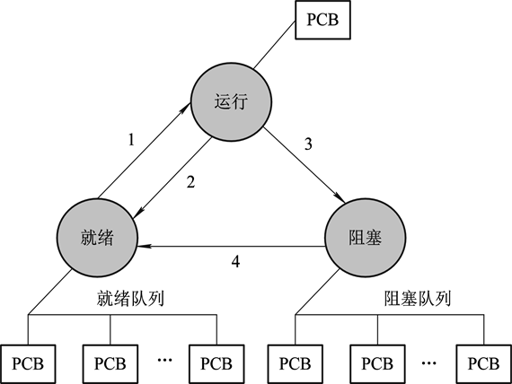


> 2.5 单处理器调度算法

- **2.5.1 调度原则**
- 1 面向系统的准则
  - （1）吞吐量：系统单位时间内完成工作的一种度量。
  - （2）CPU利用率：`CPU利用率=有效工作时间/总运行时间`
  - （3）系统资源平衡利用
  - （4）公平性
- 2 面向用户的准则
  - （1）周转时间：指该作业由提交到完成所花费的时间，即：
    - `作业i周转时间Ti＝作业i完成时间－作业i提交时间`
  - 也可表示为：
    - `作业i周转时间Ti＝作业i运行时间＋作业i等待时间`
  - 作业带权周转时间：
    - 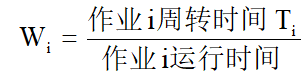
  - N个作业的平均周转时间：
    - 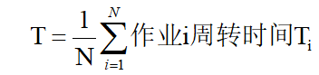
  - N个作业的平均带权周转时间：
    - 
  - （2）响应时间：从用户通过键盘提交一个请求开始，直到系统首次产生响应为止的时间间隔。
  - （3）截止时间：是实时系统选择调度算法的重要准则。可以是某实时任务（作业或进程）必须开始的最迟时间，或是某实时任务必须完成的最迟时间。
  - （4）优先权准则。


### 调度算法

> 2.5.2 常用调度算法

- **2.5.2 常用调度算法**

  - 1 先来先服务调度算法（FCFS）非抢占式调度算法

    - 优点：实现简单，公平性

    - 缺点：没有考虑作业的类型或进程/线程执行时间的长短，短作业或I/O进程/线程等待时间过长。

    - 平均周转时间：T = (1+100+100+199)/4 = 100
    
    - 平均带权周转时间：*W* = (1+1+100+1.99)/4 = 26
    
    - | 进程 | 到达时间 | 运行时间 | 开始时间 | 完成时间 | 等待 时间 | 周转时间 | 带权周转时间 |
      | ---- | -------- | -------- | -------- | -------- | --------- | -------- | ------------ |
      | P1   | 0        | 1        | 0        | 1        | 0         | 1        | 1            |
      | P2   | 1        | 100      | 1        | 101      | 0         | 100      | 1            |
      | P3   | 2        | 1        | 101      | 102      | 99        | 100      | 100          |
      | P4   | 3        | 100      | 102      | 202      | 99        | 199      | 1.99         |
    
  - 2 短作业/短进程优先调度算法（SJF/SPF）
  
    - 每次从后备作业队列中选择估计**运行时间最短**的作业进入内存，并创建相应的进程。
    - 优点：能有效地降低作业/进程的平均等待时间，提高系统的吞吐量。
    - 缺点：用户提供的估计运行时间不一定准确，此外长作业/长进程有可能长时间等待而得不到运行。
  
  - 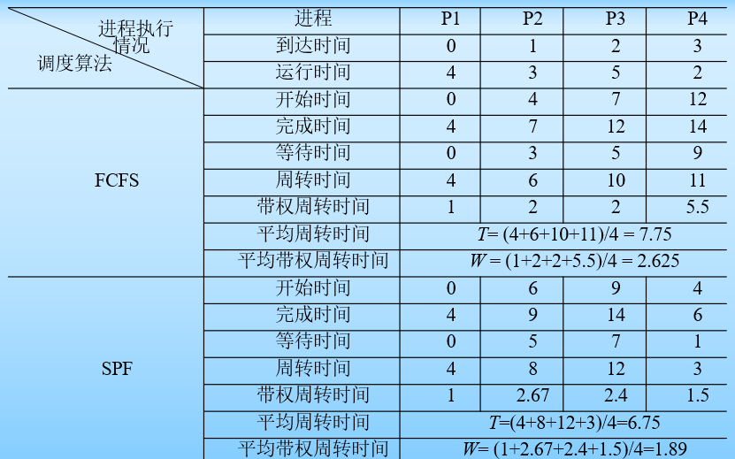
  
  - 3 时间片轮转调度算法（RR）
  
    - 进程/线程就绪队列按进程/线程到达系统时间的先后次序进行排队，进程调度程序按先来先服务的原则选择就绪队列中的第一个进程/线程，将CPU分配给它执行。
    - **时间片轮转调度算法的核心是时间片。*
  
  - 4 高响应比优先调度算法（HRRF）
  
    - 是一种基于动态优先数的非抢占式调度算法。
    - 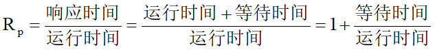
    - 优点：既照顾了短作业/短进程，而又不使长作业/长进程等待时间过长，是先来先服务调度算法和短作业/短进程优先调度算法的一种折中调度方案。
    - 缺点：需要估计每个作业或进程/线程的运行时间，而且每次调度时都要计算后备作业队列中所有作业或就绪队列中所有进程的响应比，这需要耗费不少的CPU时间。
    - 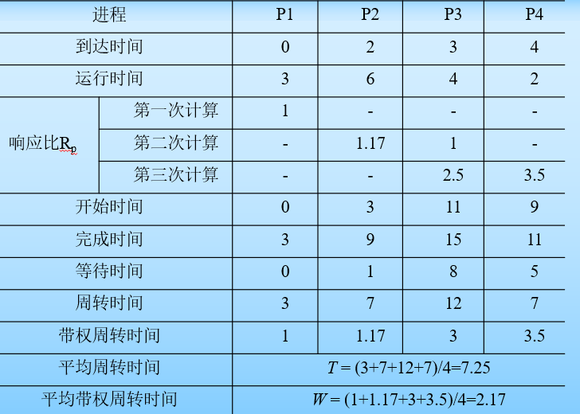
  
  - 5 优先级调度算法
  
    - 既可用于高级调度，也可用于低级调度，还可用于实时系统。
    - 若调度的对象为作业，从后备作业队列中选择优先级最高的作业调入内存。
    - 若调度的对象为进程，从就绪队列中选择优先级最高的进程为其分配CPU而投入运行。
    - 优点：公平性好、灵活、资源利用率高
  
  - 6 多级反馈队列调度算法
  
    - 优点：短进程能够得到优先处理；系统开销不大。
    - 缺点：如果优先级较高的队列一直不为空，则优先级较低队列中的进程可能长时间无法得到运行。


### 线程

> 2.6 线程

- **2.6.1 线程的引入**
  - 使多个程序能够更好地并发执行同时又尽量减少系统的开销，可将进程所承担的**调度运行和资源分配**这两个角色由操作系统分开，承担资源分配的实体不再作为独立运行的实体，而作为调度、分派基本单位的运行实体也不再是拥有资源的实体。

> 2.6.2 线程的概念

- **2.6.2 线程的概念**
  - 线程是CPU调度和执行的最小单元。
    - （1）进程内的一个执行单元。
    - （2）进程内的一个可独立调度的实体。
    - （3）线程是进程中一个相对独立的控制流序列。
    - （4）线程是执行的上下文。
  - 线程属性：
    - （1）线程属于轻型实体，基本不拥有系统资源，只拥有为保证其运行而必不可少的资源。
    - （2）线程是独立调度和分派的基本单位，也是能够独立运行的基本单位。
    - （3）同一个进程中的所有线程共享该进程所拥有的全部资源。
    - （4）线程并发执行程度高，不但同一个进程内部的多个线程可以并发执行，而且属于不同进程的多个线程也可以并发执行。
- 多线程操作系统提供的同步机制有以下几种：**互斥锁、读写锁、条件变量**和**计数信号量**等。

> 2.6.4 线程实现原理

- **2.6.4 线程实现原理**
  - （1）内核态线程实现。
    - 操作系统管理线程最重要的优点是：编程简单，因为线程的复杂性由操作系统承担，用户在编程时无须管理线程的调度。
  - （2）用户态线程实现。
  - （3）混合式线程实现。
    - 用户态的执行系统线程负责进程内部线程在非阻塞时的切换；内核态的操作系统则负责阻塞线程的切换，即同时实现内核态和用户态管理。


## 第三章 进程同步与通信和死锁

> 3.1 进程同步的基本概念※

- **3.1.1 并发进程的关系**
  - 只有相关的进程之间并发执行后，才可能破坏程序的可再现性
  - （1）间接制约关系。
    - 一个进程通过共享互斥资源来暂时限制（间接制约）其他进程的运行。
  - （2）直接制约关系。

> 3.1.2 进程的互斥与同步

- **3.1.2 进程的互斥与同步**
  - （1）**进程同步**。进程间的同步是指某些进程之间在逻辑上的相互制约关系。也就是说，**若干进程为完成一个共同的任务而相互合作，进程之间这种相互合作等待对方消息的协调关系就称为进程同步**。
  - （2）**进程互斥**。进程互斥是指某一资源同一时间只允许一个进程对其进行访问，这种访问具有唯一性和排它性。
  - 互斥的实现还会产生两个额外的控制问题：**饥饿**和**死锁**。
    - （1）饥饿。一个进程所申请的资源总是被优先于自己的其他进程所占有，而长时间处于不能被调度执行的状态（长时间处于就绪或阻塞状态），将这种现象称为“饥饿”。
    - （2）死锁。
  - 进程同步与进程互斥的区别
    - 进程互斥是通过互斥资源来制约各进程执行的，这种互斥无法事先指定进程对资源的访问顺序，故访问是无序的。即使用进程同步来协调和制约各合作进程的执行，通过对资源的有序访问去完成一个共同的任务。

> 3.1.3 临界资源与临界区

- **3.1.3 临界资源与临界区**
  - **临界资源**——某段时间内只能允许一个进程使用的资源（即互斥资源）。
  - **临界区**——进程中访问临界资源的代码段。
  - 同步机制应遵循的准则：
    - （1）空闲让进。
    - （2）忙则等待。
    - （3）有限等待。
    - （4）让权等待。


> 3.2 进程互斥方法（计算题）

- **3.2.1 实现进程互斥的硬件方法**

  - 通过计算机提供的一些**机器指令**来实现进程的互斥。

  - **机器指令**是指在一个指令周期内执行完成的指令，而专用机器指令的执行则不会被中断。**专用机器指令**有3个：

  - 1 开关中断指令：

    - 进程在进入临界区之前先执行“关中断”指令来屏蔽掉所有中断；进程完成临界区的任务后，再执行“开中断”指令将中断打开。程序结构如下：

    - ```C
         cobegin              //伪代码cobegin和coend表示其间的进程可以并发执行
           process Pi()                  // i=1, 2, 3, …, n
           {
                …                       //与临界资源无关的代码
              lock out interrupts;       //关中断
              临界区;
              unlock interrupts;         //开中断
            	  …                       //与临界资源无关的剩余代码
            }
         coend
      ```

  - 2 测试与设置指令TS（Test and Set）：

    - 为每个临界资源设置一个整型变量s，可以将它看成一把锁。**若s的值为0**（开锁状态），则表示没有进程访问该锁对应的临界资源。**若s的值为1**（关锁状态），则表示该锁对应的临界资源已被某个进程占用。

  - 3 交换指令（Swap）：

    - 要为每个临界资源设置一个**整型的全局变量s**；若s的值为0则表示没有进程在临界区，若s的值为1则表示有进程在临界区（即访问临界资源）。此外，还要为每个进程设置一个整型局部变量key。只有当s的值为0并且key的值为1时，本进程才能进入临界区。进入临界区后，s的值为1且key的值为0；退出临界区时，应将s的值置为0。

> 3.2.2实现进程互斥的软件方法

- **3.2.2实现进程互斥的软件方法**
  - 1 两标志进程互斥算法
    - 为希望访问临界资源的两个并发进程设置的两个标志T1和T2来表示某个进程是否在临界区；若Ti（i=1, 2）等于0则表示进程Pi（i=1, 2）没有在临界区，若Ti（i=1, 2）等于1则表示进程Pi（i=1, 2）在临界区。每个进程在进入临界区之前，先判断临界区是否已被另一进程访问，若是则本进程等待，否则本进程进入临界区。
  - 2 三标志进程互斥算法
    - 设置3个标志T1、T2和T，其中T1和T2的作用与两标志进程互斥算法相同，而T是一个公共标志，用来表示允许进入临界区的进程标号；若进程希望进入临界区，则先设置自己的标志Ti（i=1, 2），然后再检测公共标志T，若T等于i（i=1, 2），则表示允许进程Pi（i=1, 2）进入临界区。


> 3.3 信号量机制（计算题）

- **3.3.1 信号量**

  - 信号量可分为**整型信号量**和**结构体信号量**。

  - 1 整型信号量

    - 若信号量为S，则P操作原语和V操作原语可以分别描述如下：

    - ```C
      			int S;
      P(S)：while(S<=0);
      			S=S-1;
      V(S)：S=S+1;
      ```

  - 2 结构体型信号量

    - 结构体型信号量中的一个分量成员是一个整型变量，它代表当前相应资源的可用数量，或用于进程同步与互斥控制的信号量；另一个分量成员是一个队列指针，指向因等待同类资源的进程阻塞队列，或同步与互斥控制中该信号量的进程阻塞队列。结构体型信号量描述如下：

    - ```C
         typedef struct
          {
              int value;
              struct PCB *L;         //struct PCB为PCB对应的结构体类型
            				         //L为指向进程阻塞队列的指针
           } Semaphore;
            
           Semaphore S;
      ```

- 3.3.3 使用信号量实现进程同步

  - P：申请一个资源。V：释放一个资源。

> 例：在公共汽车上，司机和售票员各行其职独立工作。司机只有等售票员关好车门后才能启动汽车，售票员只有等司机停好车后才能开车门，即两者必须密切配合、协调一致。**进程的同步是采用信号应答方式来进行的。**
>
> 
>
> ```C
>    process 司机()
>    {
>       while(1)
>       {   P(Start);
>           启动汽车;
>           正常行驶;
>           到站停车;
>           V(Open);
> 	    }
>     }
>   process 售票员()
>   {
>       while(1)
>       {
>           关车门;
> 	        V(Start);
>           售票;
> 		  	  P(Open);
> 		  	  开车门;
> 		}
>    }
> coend
> ```

> 例：P1P4
>
> 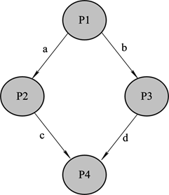
>
> - 有向边上的字母代表信号量
>
> - 有向边的**起始端进程**在执行结束时，要对该信号量实施V操作
>
> - 有向边的**结束端进程**在执行之前，则要对该信号量实施P操作
>
> - 这样就确保了多个合作进程按事先约定的顺序执行。
>
> - ```C
>   Semaphore a,b,c,d;
>   a.value=0,b.value=0,c.value=0,d.value=0;
>   cobegin
>        process P1()
>                { P1;V(a);V(b); }
>        process P2()
>                { P(a);P2;V(c); }
>   	  process P3()
>                { P(b); P3;V(d); }
>        process P4()
>                { P(c);P(d);P4; }
>   coend
>   ```


> 3.4 经典互斥与同步问题

- 读者-写者问题中的进程之间存在3种制约关系：一是读者之间允许同时读；二是读者与写者之间需要互斥；三是写者与写者之间也需要互斥。

> 3.5 经典互斥与同步问题的应用※

> 3.6 管程机制

- 使用管程实现进程同步的特点：
  - （1）管程内的数据结构只能由管程定义的过程（函数）访问，任何外部过程（函数）都不能访问它们。
  - （2）任何时刻只能有一个进程在管程中执行，其他申请进入管程的进程必须阻塞等待。
  - （3）一个外部过程（函数）只有通过调用管程内的一个过程（函数）才能进入管程。

> 3.7 进程通信

- **3.7.1 进程通信的概念**
  - 进程的特征之一是进程的**独立性**。
  - 进程通信分为如下两种：
    - （1）低级通信。
    - （2）高级通信。
  - 进程之间的高级通信分为如下3种：
    - ① 共享内存通信方式。
    - ② 共享文件通信方式。
    - ③ 消息传递通信方式。
- 管道的特点：
  - （1）管道专门用于通信。
  - （2）管道只能单向传送数据。
  - （3）在对管道进行读写操作过程中，发送者进程和接收者进程所需要的同步与互斥都由系统自动进行，即对用户是透明的。
- 管道分类：
  - 无名管道
  - 有名管道
  2. 管道通信的优点：传送数据量大，并且管道通信机制中的互斥与同步都由操作系统自动进行（对用户透明），使用方便；
     
  - 管道通信的缺点：通信速度较慢。


### 死锁

> 3.8 死锁※

- **3.8.1 产生死锁的原因和必要条件**
  - 系统资源分为两类：**可抢占资源**和**不可抢占资源**。
  - 从死锁角度看，一般不会因为竞争可抢占资源而使系统进入死锁状态。
  - 讨论死锁时所指的资源通常指不可抢占资源。
  - 死锁定义：
  - 死锁与死循环的区别：
  - 死锁与饥饿的区别：
  - 产生死锁的原因：
    - （1）系统资源不足。
    - （2）进程推进顺序不当。
  - 产生死锁的必要条件：
    - （1）**互斥条件**。进程对所获得的资源进行排他性使用，任一时刻一个资源仅被一个进程占用。
    - （2）请求和保持条件**。一个进程请求资源得不到满足而阻塞自己时，并不释放已分配给**它的资源。该条件也称为部分分配条件。
    - （3）**不可抢占（不剥夺）条件**。进程所获得的资源在未使用完毕之前不能被其他进程抢占，而只能由占用该资源的进程自己释放。
    - （4）**循环等待条件**。若干进程（两个或两个以上）形成一个循环等待链，链中每一个进程都在等待该链中下一个进程所占用的资源。
    - **如果能找出死锁发生的必要条件，那么只要使这些条件中有一个条件不成立，就可以保证不发生死锁**。

> 3.8.2 死锁的预防--破坏死锁的必要条件来控制死锁的策略

- 3.8.2 死锁的预防
  - 1 破坏“请求和保持”条件
    - 可以采用资源预分配策略
    - 优点：安全、简单且易于实现。
    - 缺点：① 系统资源严重浪费；② 进程只有获得了全部资源后才能运行，会导致一些进程长时间得不到运行；③ 很多进程在运行之前系统并不能确切的知道它到底需要多少资源。
  - 2 破坏“不可抢占”条件
  - 3 破坏“循环等待”条件
    - 将系统中所有资源进行编号，并规定进程申请资源时必须严格按照资源**编号递增（或递减）的顺序进行**。
    - 优点：系统的资源利用率和吞吐量得到改善。
    - 缺点：
      - ① 进程实际使用资源的顺序不一定与编号顺序一致，资源有序分配策略会造成资源浪费；
      - ② 资源不同的编号方法对资源的利用率有重要影响，且很难找到最优的编号方法；
      - ③ 资源的编号必须相对稳定，当系统添加新种类设备后处理起来比较麻烦；
      - ④ 严格的资源分配顺序使用户编程的自主性受到限制。

> 3.8.3 死锁的避免

- **3.8.3 死锁的避免**

> 3.8.4 死锁的检测与解除

- **3.8.4 死锁的检测与解除**
  - 1 死锁检测
    - 死锁检测（Deadlock Detection）可以在进程提出资源请求时进行，也可以根据情况动态地检测死锁。在每次资源请求时进行死锁检测，可以尽早地检测到死锁而且容易实现，但是执行死锁检测程序会增加CPU的开销。如果死锁检测算法执行时间太长，可能会导致死锁进程和系统资源长时间被锁定。
  - 2 死锁定理
    - **某一时刻系统状态S为死锁状态的充分条件是：当且仅当S状态的资源分配图是不可完全化简的，此充分条件称为死锁定理。**
  - 3 死锁检测算法
  - 4 死锁解除
    - （1）撤销所有死锁进程。
    - （2）让死锁进程回撤到正常执行状态的某个检查点，然后重新启动所有的进程。
    - （3）按照某种顺序逐个撤销死锁进程，直到不再发生死锁为止。
    - （4）采用抢占资源的策略直到不再发生死锁。


## 第四章 存储管理

- 计算机的存储器分为两类：一类是内部存储器（内存），是CPU能够直接访问的存储器；另一类是外部存储器（外存），是CPU不能直接访问的存储器。

> 4.1 程序的链接和装入

- 源程序转变为可执行程序：首先由编译程序把源程序编译成若干个目标模块，然后由链接程序把所有目标模块和它们需要的库函数链接在一起，
- **4.1.1 逻辑地址和物理地址**
  - （1）**逻辑地址**：用户源程序经编译、链接后得到可装入程序。
  - （2）**逻辑地址空间**：一个目标模块（程序）或装入模块（程序）的所有逻辑地址的集合，称为逻辑地址空间或相对地址空间。
  - （3）**物理地址**
  - （4）**物理地址空间**
  - （5）**虚拟地址空间**

> 4.1.2 程序链接

- **4.1.2 程序链接**
  - （1）静态链接。
  - （2）装入时动态链接。
  - （3）运行时动态链接。

> 4.1.3 程序装入

- **4.1.3 程序装入**
  - 1 程序装入分类：
    - 静态装入
    - 运行时动态装入
  - 2 静态重定位
    - 绝对地址＝相对地址＋程序存放的内存起始地址
    - 优点：简单、容易实现，不需要增加任何硬件设备，可以通过软件全部实现。
  - 3 动态重定位
    - BR：基地址寄存器；VR：程序逻辑地址寄存器；
    - 绝对地址＝(BR)＋(VR)


> 4.2 存储器及存储管理的基本功能

- **4.2.3 内存的共享、保护及扩充**
  - 两个或多个进程共享内存中相同区域称为内存的共享。共享分为代码共享和数据共享。
  - 代码共享——指多个进程运行内存中的同一个代码段。
  - 数据共享——用于实现进程通信。


> 4.3 分区式存储管理

首次适应算法、
最佳适应算法和最差适应算法

> 例4-1
>
> 有一程序序列：程序A要求18KB，程序B要求25KB，程序C要求30KB，初始内存分配情况如图所示（其中阴影为分配区）。问首次适应算法、最佳适应算法和最差适应算法中哪种能满足该程序序列的分配？

> 4.4 分页存储管理※

- **4.4.1  分页存储管理的基本原理**
  - 2 逻辑地址结构
    - 页号+页内地址
    - 其中，0～11位是页内地址，即每个页的大小是4KB；12～31位是页号，即地址空间最多允许有1M个页。一维逻辑地址与页号和页内地址的关系是（注：页长即一页的大小）：
    - 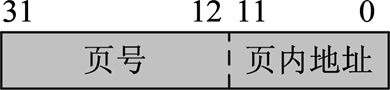

> 4.4.2  分页存储管理的地址转换与存储保护

- **4.4.2  分页存储管理的地址转换与存储保护**
  - **物理地址＝物理块号×页长＋页内地址**

> 例4-2
>
> 在一采用分页存储管理的系统中，一程序有4个页并被分别装入到内存的第3、4、6、8号物理块中，已知页和物理块的大小均为1024B，该程序在CPU上运行并执行到如下的一条传送指令： MOV AX,[2100]
> 请用地址转换图计算MOV指令中操作数2100的物理地址。
>
> 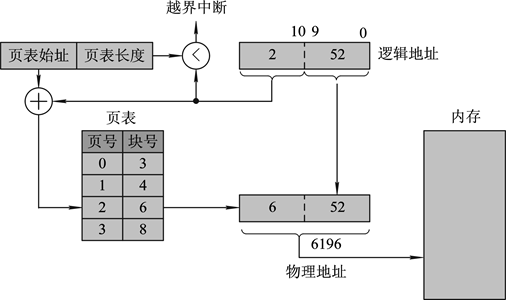
>
> 解：
>
> - 第一步，计算页内地址的范围
>   - 页的大小为1024B，可知页内地址为0～9位
> - 第二步，先算逻辑地址，在算页内地址
>   - 逻辑地址2100的页号是：2100/1024=2（向上取整）
>     - **逻辑地址=操作数的地址/块大小**
>   - 页内地址：$2100 - 2*1024=52$
>     - **页内地址=操作数的地址 - 页号*块大小**
> - 第三步，根据页号和页内地址计算出物理地址
>   - 页号是2，页号2对应块号6
>   - 那么物理地址就是：$2*1024+52=6196$

- 3 页的共享和保护
  - （1）页的共享
    - 数据共享
    - 程序共享
  - （2）页的保护
    - 逻辑地址转换成物理地址时的保护
    - 对共享信息的保护


> 4.4.4  内存物理块的分配与回收

- **4.4.4  内存物理块的分配与回收**
  - 为了实现内存物理块的分配与回收，系统设置了一张**请求表**和一张**内存分配表**。


> 4.5 分段存储管理

> 例4-3
>
> **在一个分段存储管理系统中，其段表如下左表所示，试求右表中逻辑地址所对应的物理地址。**
>
> - **段内地址+内存起始地址**
> - 如果段内地址**大于**段长则👉产生越界终端
>
> 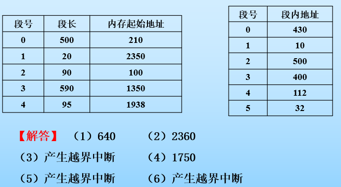


> 4.6 段页式存储管理※

- （1）段表。系统为**每个程序建立一张段表**，程序的每个段在段表中有一个段表项。
- （2）页表。系统为**程序中的每一个段都建立一张页表**，一个段中的每个页在该段的页表中都有一个页表项。
- 优点：
  - （1）因为以页为单位分配内存所以无紧凑问题，也不存在外部碎片。
    （2）便于处理变化的数据结构，段可以动态增长。
    （3）便于共享，只需将程序的段表中相应表项指向该共享段在内存中的页表始址即可。
    （4）因具有段的特点，所以便于提供动态链接。
    （5）因具有段的特点，所以便于控制存取访问。
- 缺点：
  - （1）增加了硬件成本，需要更多的硬件支持。
    （2）增加了系统开销和软件复杂性，如地址重定位过程需多次访问内存。
    （3）空间浪费比分页管理多，程序各段的最后一页都有可能浪费一部分空间（仍然存在内部碎片），另外段表和页表所占的空间都比分页管理和分段管理多。


> 4.7 虚拟存储管理※

- 4 页置换算法
  - （1）**最佳置换算法**：所选择的置换页是那些将来不会被访问的页，或者是在最长时间后才被访问的页，即置换该页不会造成刚将此页置换出内存又要立即把它再置换回内存的情况出现。可获得最低缺页中断率，性能最好。
  - （2）**先进先出算法** ：总是淘汰最先进入内存的页，即选择在内存中驻留时间最久的页予以淘汰。该算法实现简单，性能较差。
  - （3）**最近最久未使用算法**：系统结构的LRU算法


## 第五章 I/O设备管理

> 5.1 设备管理概述

- **5.1.1  设备的分类**
  - 1 按使用特性分类
    - （1）存储设备:外存或辅助存储器，用于永久保存用户使用计算机处理的信息。磁盘、磁带、光盘和优盘都属于存储设备。
    - （2）I/O设备:键盘、扫描仪、显示器、打印机等。磁带机等。
  - 2 按信息传输速率分类
    - （1）低速设备。指传输速率为每秒几字节至几百字节的设备，如键盘、鼠标等。
    - （2）中速设备。指传输速率为每秒几千字节至几万字节的设备，如各种打印机。
    - （3）高速设备。指传输速率为每秒几十万字节甚至几兆字节的设备，如闪存（优盘）、光盘机、磁盘机及磁带机等。
  - 3 按信息传输单位分类
    - （1）字符设备：用于数据输入和输出的基本单位是字符，故称为字符设备，如打印机、键盘、显示终端等。字符是不可寻址的。
    - （2）块设备：信息存取总是以数据块为单位,可寻址，如磁盘。
  - 4 按资源分配方式分类
    - （1）独占设备
    - （2）共享设备
    - （3）虚拟设备
  - 5 按设备的从属关系分类
    - （1）系统设备
    - （2）用户设备

> 5.1.2  设备管理的目标和功能

- **5.1.2  设备管理的目标和功能**
  - 设备管理的目标：一是为了提高系统资源的利用率，二是方便用户使用计算机。
    - （1）方便性
    - （2）并行性
    - （3）均衡性
    - （4）独立性
  - 2 设备管理的功能


> 5.2 I/O设备管理系统的组成

- I/O系统共分四级：最低级为I/O设备，次低级为设备控制器，次高级为I/O通道，最高级是CPU。
- 3 通道
  - 通道又称I/O处理器，是一个独立于CPU的专管I/O控制的处理器，它控制设备与内存直接进行数据交换。
  - 通道的类型：
    - 字节多路通道
    - 数组多路通道
    - 数组选择通道


> 5.3 I/O设备控制方式※

- **5.3.3  直接存储器存取I/O控制方式**
  - 1 DMA控制方式
    - 目前在块设备的I/O系统中，普遍采用直接存储器存取I/O控制方式，即DMA控制方式。
    - DMA控制方式下的**地址总线和数据总线及一些控制信号线**都是与CPU共用的。
    - DMA三种控制方式：周期窃取方式、直接存取方式、数据块传送方式
  - 2 DMA控制器的组成
    - （1）命令/状态寄存器（CR）
    - （2）内存地址寄存器（MAR）
    - （3）数据寄存器（DR）     
    - （4）数据计数器（DC）


> 5.4 缓冲技术与虚拟设备技术※

- **5.4.1  缓冲技术**
  - 原因：处理器处理数据速度与设备传输速度不相匹配，需要用缓冲区缓解其间的速度矛盾。
  - （1）缓解CPU与I/O设备之间速度不匹配的矛盾。
  - （2）减少中断次数和CPU的中断处理时间。
  - （3）解决了DMA控制方式或I/O通道控制方式下数据传送的瓶颈问题。
  - 实现缓冲通常有两种方法：一种是采用**专门的硬件缓冲器**，如设备控制器中的数据缓冲寄存器；另一种是**在内存中开辟一段存储区作为缓冲区**。
  - 1 单缓冲和双缓冲
    - 单缓冲：在CPU与设备之间设置一个缓冲区。
    - 双缓冲：在CPU与设备之间设置两个缓冲区。输入和取出数据分别在不同的缓冲区进行，明显提高了设备的I/O速度。
  - 2 循环缓冲
  - 3 缓冲池
    - 分为三类：① 空缓冲区；② 装满输入数据的缓冲区；③ 装满输出数据的缓冲区。   
    - 缓冲池中缓冲区的工作方式：收容输入、提取输入、收容输出、提取输出。


> 5.4.2  虚拟设备技术

- **5.4.2  虚拟设备技术**
  - 硬件上，系统必须配置大容量磁盘使CPU与设备并行工作；软件上，操作系统必须采用多道程序设计技术。
  - SPOOLing系统的特点：
    - （1）提高了I/O的速度。
    - （2）将独占设备改造成共享设备。
    - （3）实现了虚拟设备功能。


> 5.5 设备的分配与回收

- **5.5.1  用于设备分配的数据结构**
  - 主要有系统设备表（SDT）、设备控制表（DCT）、控制器控制表（COCT）和通道控制表（CHCT）。

> 5.5.2  设备分配

- **5.5.2  设备分配**
  - 1 设备分配的原则和策略
  - 分配原则：
    - （1）充分发挥设备的使用效率，尽可能地让设备忙起来。
    - （2）避免由于不合理的分配而造成死锁的发生。
    - （3）将用户程序和具体物理设备相隔离。用户程序面对的是逻辑设备，设备分配程序完成把逻辑设备转换为对应的物理设备，再根据物理设备号进行分配工作。
  - 分配策略：
    - （1）对独占设备采用独占分配策略
    - （2）对共享设备采用共享分配策略
    - （3）对虚拟设备采用虚拟分配策略
  - 5 设备分配实施步骤
    - （1）分配设备；
    - （2）分配设备控制器；
    - （3）分配通道。


> 5.6 磁盘存储器管理

- **5.6.2  磁盘调度**

  - 影响磁盘访问时间的因素有三个：

    - ① 寻道时间；② 旋转延迟时间；③ 数据传输时间

  - **1 先来先服务调度算法（FCFS）**

    - > 例5-1：假设某磁盘的一组I/O操作的柱面号访问请求顺序依次是：55、72、100、88、93和66，当前磁盘位于90号柱面。试求采用FCFS算法时，系统服务的顺序、磁头移动的距离以及磁头改变方向的次数。
      >
      > 【解答】 服务顺序：90→55→72→100→88→93→66
      > 移动距离：35+17+28+12+5+27=124（跨越的柱面总数）
      > 磁头改变方向的次数：4次。
      >
      > 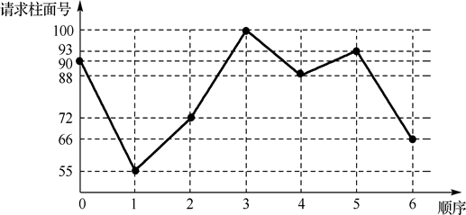

  - **2 最短寻道时间优先算法（SSTF）**

    - 根据请求进程要访问的磁道离**当前磁头位置**的远近来决定调度的顺序，近者先调度。

    - > 例5-2：
      >
      > 【解答】 服务顺序：90→88→93→100→72→66→55
      > 移动距离：2+5+7+28+6+11=59（跨越的柱面总数）
      > 磁头改变方向的次数：2次。
      >
      > 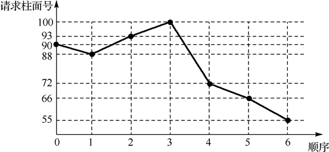

  - **3 扫描算法（SCAN）**

    - **减少磁头改变方向**的一类调度算法，`改变磁头时需要回到0`

    - > 例5-3：
      >
      > 【解答】 服务顺序：90→88→72→66→55→0→93→100
      > 移动距离：2+16+6+11+55+93+7=190（跨越的柱面总数）
      > 磁头改变方向的次数：1次。
      >
      > 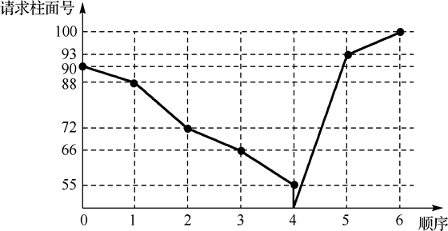

  - **4 电梯算法**

    - 和扫描算法相同，双向扫描，`但不需要回到0`

    - > 例5-4：
      >
      > 【解答】 服务顺序：90→88→72→66→55→93→100
      > 移动距离：2+16+6+11+38+7=80（跨越的柱面总数）
      > 磁头改变方向的次数：1次。
      >
      > 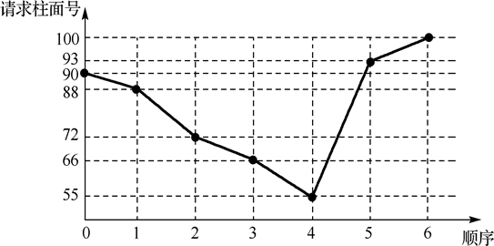

  - **5 循环扫描算法（CSCAN）**

    - 单向扫描，一个方向向下扫描，**然后去到最高点**在向下扫描，所以变成100→93

    - > 例5-5：
      >
      > 【解答】 服务顺序：90→88→72→66→55→100→93
      > 移动距离：2+16+6+11+45+7=87（跨越的柱面总数）
      > 磁头改变方向的次数：2次。
      >
      > 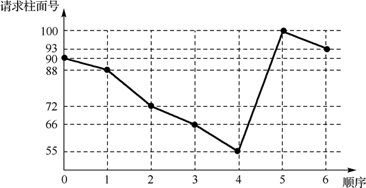

> 5.6.3  提高磁盘I/O速度的方法

- **5.6.3  提高磁盘I/O速度的方法**


## 第六章 文件系统

> 6.1 文件系统基本概念

- **6.1.1  文件系统的引入**
  - 现代操作系统中引入文件系统的主要原因：
    - （1）用户直接存取外存中的信息过于复杂。
    - （2）多任务共享资源的出现。
    - （3）出于对信息安全和保密的考虑。
    - （4）操作系统自身的需要。

> 6.1.2  文件与文件系统

- **6.1.2  文件与文件系统**
  - 文件主要有以下三个特点：
    - （1）保存性。
    - （2）按名存取。
    - （3）一组信息集合。
  - 一个文件通常由若干个称为逻辑记录的较小单位组成，记录是一个有意义的信息集合，是对文件进行存取的基本单位。
  - 常见的文件属性包括以下内容：
    - （1）文件名。
    - （2）文件类型。
    - （3）文件长度。
    - （4）文件主。
    - （5）文件权限。
    - （6）文件的物理位置。
    - （7）文件时间。
  - 根据文件的内容是用户数据还是文件系统本身的数据将文件分为以下三种：
    - （1）目录。记录文件的文件，即它的内容是有关其他文件的信息。

    - （2）一般文件(用于保存数据)。   
    - （3）块文件(用于I/O设备)。
  - 4 虚拟文件系统
    - 虚拟文件系统主要设计思想体现在两个层次上：虚拟层和实现层。


> 6.2 文件的组织结构

- 对任何一个文件都存在着以下两种形式的组织结构：
  - （1）逻辑结构。
  - （2）物理结构。
  - 事实上，无论是文件的逻辑结构还是物理结构，其构造方式都对文件的存储空间和存取速度产生影响。

> 6.2.1  文件的逻辑结构

- **6.2.1  文件的逻辑结构**
  - 文件的逻辑结构分为两大类：**无结构文件**和**有结构文件**。
  - 1 流式文件
    - 无结构的流式文件是有序字符的集合，即整个文件可以看成是字符流的序列，字符是构成文件的基本单位。
  - 2 记录式文件
    - 根据记录式文件中每个记录的长度是否相等，可以将文件分为**定长记录文件**和**变长记录文件**两种

> 6.2.2  文件的物理结构

- **6.2.2  文件的物理结构**
  - （1）连续空间存放方式（连续结构）。
  - （2）非连续空间存放方式。
    - 其中，非连续空间存放又可以分为链表方式（链表结构）和索引方式（索引结构）两种。
  - 4 散列结构


> 6.3 文件目录

- **6.3.1  文件控制块与索引节点**
  - 系统为每一个文件设置了称为文件控制块（FCB）的数据结构，该数据结构至少包含文件名和存放文件的物理地址。
  - 每个文件有一个FCB，它是该文件的**唯一标识**。
  - FCB通常包含以下信息：
    - （1）基本信息。
    - （2）存取控制信息。
    - （3）文件使用信息。

> 6.3.2  目录结构

- **6.3.2  目录结构**
  - 1 单级目录结构
    - 按名存取，但它存在以下缺点：只能顺序查找，文件检索速度慢，不允许文件重名，不便于实现文件共享，只适用于单用户环境。
    - 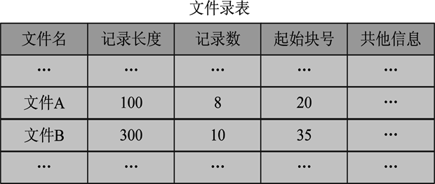
  - 2 二级目录结构
    - 为了克服单级目录结构存在的缺点，引入了二级目录结构。二级目录结构分为两级：一级是用户自己的**用户文件目录（UFD）**；另一级是**主文件目录（MFD）**。
    - 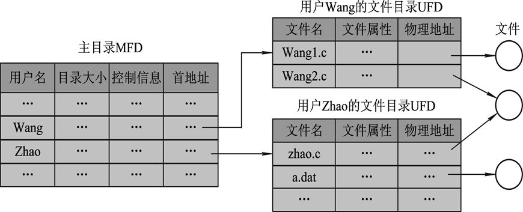
    - 二级目录优点：
      - （1）提高了查找目录的速度。
      - （2）较好地解决了重名问题。
      - （3）便于文件共享。
  - 3 多级目录结构
    - 多级目录结构因其像一棵倒置的有根树，故也称**树形目录结构**。
    - 优点：
      - 文件检索方便、快捷，位于不同子目录下的文件可以重名，容易实现文件或目录的存取权限控制，便于文件保护、保密和共享。

> 6.3.3  文件目录查找

- **6.3.3  文件目录查找**
  - 1 顺序检索法
    - 顺序检索法又称线性检索法。
  - 2 散列检索法
    - 优点：可以显著提高文件的查找速度。


> 6.4 文件存储空间管理

- **6.4.1  空闲分区表法**
  - 优点：在文件较小时有很好的效果，适用于连续文件的存储分配与回收；
  - 缺点：增加了目录的大小，增加了目录管理的复杂性。

> 6.4.2  空闲块链法

- **6.4.2  空闲块链法**
  - 优点：分配与回收一个空闲块的过程都非常简单；
  - 缺点：效率较低。


> 6.5 文件共享与文件安全

- **6.5.1  早期的文件共享方法**
  - 1 绕道法：绕道法要求每个用户在当前目录下工作，用户对所有文件的访问都是相对于当前目录进行的。
  - 2 链接法：将一个目录中的链接指针直接指向共享文件的文件目录，从而实现文件的共享。
  - 3  基本文件目录表法：

> 6.5.2  目前常用的文件共享方法

- **6.5.2  目前常用的文件共享方法**
  - 1 静态共享
    - （1）基于索引节点的文件共享
    - （2）利用符号链实现文件共享
      - 

> 6.5.3  文件系统的安全

- **6.5.3  文件系统的安全**
  - 1 系统级安全管理
    - 系统级安全管理的主要任务是不允许未经许可的用户进入计算机系统，登陆注册
  - 2 用户级安全管理
    - 权限分配
  - 3 目录级安全管理
    - 只有系统核心才具有写目录的权利。
  - 4 文件级安全管理
    - 有8种属性

> 6.5.5  文件保护

- **6.5.5  文件保护**
  - 四种文件保护方式：
    - ① 存取控制矩阵；② 存取控制表；③ 口令；④ 加密。

