# 操作系统复习

> - 带权周转时间 = 周转时间 / 运行时间
>   - SJF 最短进程优先
>   - HPF 优先级调度、多级反馈队列
>   - HRRN 最高响应比优先 `Rp=1+(等待时间/运行时间)`
> - FIFO、LRU、OPT
> - 互斥信号量
>   - P：申请，V：释放
> - 同步关系
>   - P：等待/减少信号量。V：释放/增加信号量
> - 磁盘
>   - 先来先服务调度算法（FCFS）
>     最短寻道时间优先算法（SSTF）
>     扫描算法（SCAN）
>     电梯算法
>     循环扫描算法（CSCAN）

- 操作系统的设计目标
  - （1）**方便性**。提供统一且界面友好的用户接口，以方便用户使用计算机。
  - （2）**有效性**。操作系统应能合理地组织计算机的工作流程，改善系统性能并提高系统运行效率。
  - （3）**可扩展性**。以适应计算机硬件和计算机网络等发展的需要。
  - （4）**开放性**。遵循国际标准构造一个统一的开放环境，实现应用程序的可移植性和互操作性。
  - （5）**可靠性**。可靠性包括正确性、健壮性和安全性。
  - （6）**可移植性**。避免重复工作及缩短软件研发周期。
- 管态又称为：**内核态、特权态（特态）、系统态**
- 目态：**用户态、普通态**（普态）
- 电子式系统中可分为：**模拟式、数字式**两种计算机系统
- 不同类型的操作系统有各自的特征，但它们都具有**并发性、共享性、虚拟性**和**不确定性**等共同特征。
- 操作系统的主要功能：处理器管理/进程管理、存储管理、文件管理、设备管理、用户接口。
- 操作系统的逻辑结构：单内核结构、分层式结构、微内核结构。
- 主要操作系统的类型：**批处理操作系统、分时操作系统、实时操作系统**。
- 操作系统有效的安全机制：
  - （1）身份鉴别 （2）存取控制 （3）最小特权管理
  - （4）硬件保护 （5）安全审计 （6）入侵检测
  - （7）数据加密
- 中断具有以下特点：

  - （1）随机的。
  - （2）可恢复的。
  - （3）自动处理的。

- 2

  - 程序的顺序执行的特点：顺序性、封闭性、程序执行结果的确定性、程序执行结果的可再现性。
  - 多道程序并发执行的特性：间断性、失去了封闭性、不可再现性。
  - 三种基本状态：**运行、就绪、等待**。
  - 进程控制块的组织方式：线性表方式、链接表方式、索引表方式。

- 3

  - （1）**进程同步**。进程间的同步是指某些进程之间在逻辑上的相互制约关系。也就是说，**若干进程为完成一个共同的任务而相互合作，进程之间这种相互合作等待对方消息的协调关系就称为进程同步**。
  - （2）**进程互斥**。进程互斥是指某一资源同一时间只允许一个进程对其进行访问，这种访问具有唯一性和排它性。
  - 互斥的实现还会产生两个额外的控制问题：**饥饿**和**死锁**。
  -
  - 产生死锁的必要条件：
    - （1）**互斥条件**。进程对所获得的资源进行排他性使用，任一时刻一个资源仅被一个进程占用。
    - （2）请求和保持条件**。一个进程请求资源得不到满足而阻塞自己时，并不释放已分配给**它的资源。该条件也称为部分分配条件。
    - （3）**不可抢占（不剥夺）条件**。进程所获得的资源在未使用完毕之前不能被其他进程抢占，而只能由占用该资源的进程自己释放。
    - （4）**循环等待条件**。若干进程（两个或两个以上）形成一个循环等待链，链中每一个进程都在等待该链中下一个进程所占用的资源。

- 4

  - 页置换算法：最佳置换算法、先进先出算法、最近最久未使用算法。

- 5 I/O
  - 按信息传输单位分类：字符设备、块设备。
  - 按资源分配方式分类：独占设备、共享设备、虚拟设备。
  -
  - 通道技术：一个独立于 CPU 的专管 I/O 控制的处理器，它控制设备与内存直接进行数据交换。
  - 通道的类型：字节多路通道、数组多路通道、数组选择通道。
  -
  - DMA 技术：块设备的 I/O 系统中，采用直接存储器存取 I/O 控制方式。
  - DMA 控制器的组成：命令/状态寄存器（CR）、内存地址寄存器（MAR）、数据寄存器（DR）、数据计数器（DC）
  -
  - 缓冲技术：处理器处理数据速度与设备传输速度不相匹配，需要用缓冲区缓解其间的速度矛盾。
  - 缓冲技术分为：**单缓冲和双缓冲、循环缓冲、缓冲池**。
  - 实现缓冲通常有两种方法：一种是采用**专门的硬件缓冲器**，如设备控制器中的数据缓冲寄存器；另一种是**在内存中开辟一段存储区作为缓冲区**。

> - TIPS
>   - 发生中断时，处理器会从当前执行状态切换到中断处理状态，也就是管态。
>   - 增加资源破坏`互斥`、静态分配破坏`不可剥夺、请求和保持`、有序分配破坏`循环等待`
>   - 导致缺页的因素：分配给程序的物理页面数、页面的大小、程序编制的方法、页面调度算法。
>   - 页表分类：多级页表、散列页表、反置页表
>   - 剥夺资源、撤销进程

## 202304

- - 实时操作系统：对可靠性要求极高
  - 子进程和父进程是相同的；具有相同的用户地址空间；子进程可以读取父进程打开的任何文件；区别在于具有不同的 PID。
  - **临界资源**：某些资源一次只允许一个进程使用。
  - **临界区**：在进程中访问临界资源的程序。
  - 管道通信的基础是：**文件系统**。
  - **动态重定位**：把指令中逻辑地址转换成物理地址。

- 填

  - 直接与硬件交互的是：**Linux 内核层**，为应用开发提供界面管理等功能的是：**应用框架层**。
  - 同一个进程的多个线程共享该进程的 **内存地址空间** 和文件，他们之间的同步和通信无需调用 **内核**。
  - **单向链式方式** 只有一个指针
  - **双向链式方式** 包含 2 个指针，分别指向前一个进程 PCB 地址和后一个进程 PCB 地址。
  - 管程三个主要特征：**模块化、抽象数据、信息隐蔽**。
  - 检测死锁的实质是确定：**循环等待** 条件。
  - UNIX 把用户分为：**文件主、文件主的同组用户、其他用户**。
  - 设备分配通常采用：**先来先服务、高优先级优先**。
  -

- 简答

  - 从调用程序和被调用程序的运行状态的角度，说明系统调用与一般函数调用的区别

    - 1、对于一般的函数调用，其调用程序和被调用程序都运行在相同的状态:管态或目态。
    - 2、对于系统调用，调用程序运行在目态，被调用程序运行在系统态(或管态)。

  - 进程调度的主要功能是什么？轮转调度算法的基本思想是什么

    - 记录系统中所有进程的执行状况;
    - 根据一定的调度算法，从就绪队列中选出一个进程，准备把处理器分给它;
    - 把处理器分配给该进程;
    - 轮转调度算法的基本思想是:将处理器的处理时间划分为大小相等的时间片，就绪队列中的进程轮流运行一个时间片。

  - 请列出 2 种解决死锁的常见方法。
    - 预防死锁;避免死锁;检测与解除死锁;忽略死锁。

## 202210

- - 从小到大：寄存器<高速缓存<内存<硬盘
  - 父进程创建子进程调用 `fork` 函数
  - 多道程序特点：独立性、随机性、共享性
  - 文件目录结构类型：一级、二级、多级/树形。
  - 目录文件属于记录时文件。
- 1
  - `线程控制块`：操作线程
  - `入口等待队列`：在管程的入口处设置一个进程等待队列
  - `运行代价`：接触死锁时，重新启动进程并运行当前撤销点所需的代价。
  - 将 PCB 放在连续表中进行管理：`线性方式`
  - 将 PCB 放在队列中进行管理：`链接方式`
  - 页式存储其 6 位页号，10 位页内地址，虚拟地址则 `2^6=64页`，虚拟地址 3072 的页号是 `3072/(2^10)=3`
  - 磁盘空闲块管理的方案：`位示图、空闲块表、空闲块链表、空闲块成组链接`。
  - 设备分配一次分配的是：`静态分配`。执行中分配的是：`动态分配`。

## 202204

- - 进程控制的任务：创建进程、撤销已结束的进程、控制进程运行时的`状态转换`。
  - 用户不可见的是：`程序计数器、指令寄存器`等控制处理操作。
  - 死锁时，至少有 `2个以上` 的进程处于等待状态。
  - `撤销进程` 可以解除死锁。
  - FAT32 根目录位置固定，大小固定。
  - SPOOLing 包括：输入程序模块、输出程序模块、`作业调度程序`。

- - 临界资源被使用时，其他请求必须 `等待`，使用完毕后由 `操作系统` 选择一个用户使用。
  - 程序顺序执行必须具有：`顺序性、封闭性`。
  - 单处理器系统具有：`就绪状态、阻塞状态`。
  - 通过发送信件和接受信件进行进程通信的方式是：`信箱通信`。
  - 存储管理的任务：`存储保护、内存分配和回收、存储共享、扩充内存容量`。
  - UNIX 操作系统采用：`多级索引` 文件物理结构。
  - I/O 设备与 CPU 性能不匹配，操作系统通过 `缓冲技术、虚拟技术、中断技术` 解决。

## 202110

- 1
  - 中断处理结束时，处理器状态：`从管态恢复成被中断时的目态`。
  - 设备控制器与处理器进行通信的包括：`数据寄存器、控制寄存器、状态寄存器`。
- 1
  - 线程的实现方式：`用户级线程、内核级线程`。
  - 管程能保障共享资源的 `互斥执行`，最大进程数 `1`。
  - 文件用途分为：`系统文件、用户文件、库函数文件`。
  - I/O 软件结构分为：`中断处理程序、设备驱动程序、用户级软件、设备独立的操作系统软件`。

## 202104

- 平均访盘次数

  - 符号目录项占 8 字节，物理块大小 512 字节。请问有 512 个目录那么平均访盘次数是多少
  - 符号目录项站物理块个数 = `8字节 * 512个目录 / 512物理块大小 = 8`
  - 结果：`(1+8)/2+1=5.5`

- 1
  - 系统资源分为：`永久性资源、消耗性资源`。
  - 存储保护是指：防止程序间互相越界访问。
- 1
  - 共享性是指操作系统程序与多个用户程序 `共用` 系统资源，在 `操作系统` 下实现。
  - 多道程序中由于系统资源的 `共享和竞争`，让本来无逻辑关系的程序之间产生了 `互相制约`。
  - 七状态进程模型中，`就绪挂起状态` 和 `阻塞挂起状态` 是对换至外存进程的。
  - 共享文件解决进程之间的大量通信方式是：`管道通信`。
  - 解除死锁：`剥夺资源、撤销进程`。
  - 逻辑地址由两部分组成：`虚拟页号、页内地址`。
  - 一次访问磁盘的时间由三部分组成：`寻道时间、旋转定位时间、信息传输时间`。
  - 文件物理结构采用：`索引结构`。
  - 设备可共享性分类：`独占设备、共享设备、虚拟设备`。

## 202010

- 1
  - 处理器处于目态时为：`用户模型`。
  - 处理器处于管态时为：`特权模式`。
  - 操作系统设计包括：`功能设计、算法设计、结构设计`。
  - 临界区是指访问临界资源的 `程序段`。
- 1
  - `顺序性、封闭性` 程序顺序执行的特点。执行结果的特点 `确定性、可在现性`。
  - 静态来看进程是由三部分组成：`数据、程序、进程控制块/PCB`。
  - 分区方式：`固定分区、可变分区`。
  - 文件结构分为：`索引结构、顺序结构、链接结构`。
  - FAT 文件采用：`链接结构`。

## 大题

> - 求虚拟页
>   - 页字节：`2^页内地址位数`
>   - 逻辑地址页数：`2^页号位数`
>   - 作业最大空间：`页字节 * 逻辑页数`
>   - 根据逻辑地址求页号和页内地址
>   - 页号：`逻辑地址/页字节=商`
>   - 页内地址：`逻辑地址/页字节=余数`
> - 页大小 8KB，页表项大小 4 字节，地址空间 64 位
>   - 页号长度：
>     - `8KB=2^13`，13 位
>     - `64-13=51位页号`
>   - 每页可以存放多少页表项
>     - `8KB/4=2KB=2^11 个页表项`

- 银行家算法
  - 以 202204 为例
  - 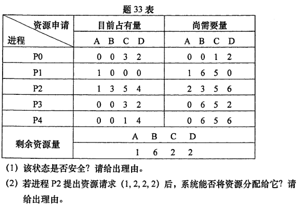
  - 答案不唯一：P0>P1>P3>P2>P4
  - 思路：`剩余资源` 减去 `需要资源`，结果不为 0。
    - P0：需要资源<剩余资源，故下一步剩余：`1 6 6 6`。（剩余资源+P0 占有）
    - P1：`2 6 6 6`
    - P3：`2 6 9 8`
    - P2... 以此类推

### 调度算法

> 周转时间 = 完成时间－**到达时间**
>
> 带权周转时间 = 周转时间 / 运行时间
>
> 如果没有给，提交时间或等待时间，默认为 0

| 进程 | 到达时间 | 运行时间 |
| ---- | -------- | -------- |
| P1   | 0        | 7        |
| P2   | 2        | 4        |
| P3   | 4        | 1        |
| P4   | 5        | 4        |

- 总结（用上面表格的数据）`blog.csdn.net/weixin_42570192/article/details/125956145`
  - FCFS 先来先：谁先来谁先运行
    - 完成时间：P1>7；P2>11；P3>12；P4>16
  - SJF 最短进程优先
    - 非抢占式：每次调度选择 **当前已到达且运行时间最短的**
      - 完成时间：P1>7；P3>8；P2>12；P4>16
    - 抢占式：新进程加入时改变调度，判断**当前进程剩余时间** 与 **新进程时间** 谁更小。
      - 完成时间：P3>5；P2>7；P4>11；P1>16
  - HRRN 最高响应比优先
    - 在每次调度时先计算各个作业或进程的响应比，选择响应比最高的作业或进程为其服务
    - `Rp=1+(等待时间/运行时间)`
    - 0：P1 先来，上处理机
    - 7：P1 结束，开始计算就绪队列相应比：（因此 P3 先）
      - P2：等待时间是 `7-2到达时间=5`。相应比是 $Rp=1+(5/4)=2.25$
      - P3：等待时间是 `7-4到达时间=3`。相应比是 $Rp=1+(3/1)=4$
      - P4：等待时间是 `7-5到达时间=2`。相应比是 $Rp=1+(2/4)=1.5$
    - 8：P3 结束吗，再次计算相应比：P2 2.5、P4 1.75
    - 以此类推
  - HPF 优先级调度、多级反馈队列 看下面

> 类型 1，基础
>
> 这种形式，**周转时间直接取完成时间即可**

- 1 先来先服务调度算法（FCFS）非抢占式调度算法
  - 开始时间：填上一列的完成时间
  - 完成时间：开始时间+运行时间
- 2 短作业/短进程优先调度算法（SJF/SPF）：**注意区别题型，如果只给运行时间则从最短开始，如果给了到达时间则用 202210 的解法。**
  - 意思是，先从运行时间最短的开始
  - 因此是：2 列>4 列>3 列>5 列>1 列

> 202304

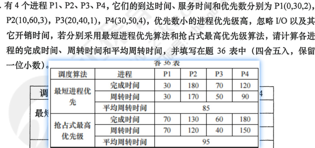

- 抢占式最高优先级
  - 10：P1 优先级 `>` P2，入栈不调度。
  - 20：P1 优先级 `<` P3，**因此执行 P3，P1 挂起(当前剩余 10)**。
  - 30：P3 优先级 `>` P4，入栈不调度。
  - 60：P3 执行完成。**执行 P1 剩余的 10**。
  - 70：P1 执行完成。以此类推
- 非抢占式
  - **重点是，等待 P1 结束，再调度。而不是在 P1 执行时调度。**

> 202210

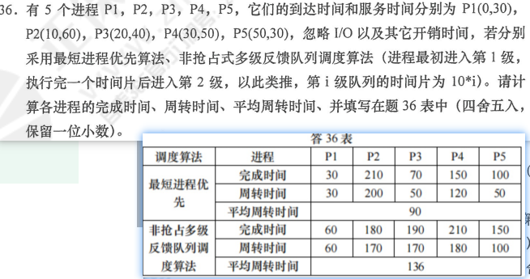

- 最短进程优先：**注意区别题型**
  - 0：P1 先进，先执行 P1。
  - 30：P1 执行完成。比较 P2、3、4。因 P3 最短 **故执行 P3**。
  - 70：P3 执行完成。比较 P2、4、5。因 P5 最短 **故执行 P5**。
  - 以此类推
- 非抢占多级反馈队列
  - 核心：每个程序在划分的时间片中运行。一级时间片是 10 开始、二级时间片是 20 开始。以此类推
  - **括号是运行时间**
  - P1 一级(10)>P2 一级(10)>P3 一级(10)>P4 一级(10)>此时时间是 40, 因为 P5 的服务时间是 50 因此继续执行 P1 二级。如果是抢占式则必须先运行 P5 一级。
  - P1 二级(20)运行完成>P5 一级(10)>P2 二级(20)>P3 二级(20)>P4 二级(20)
  - P5 二级(20)运行完成>P2 三级(30)运行完成>P3 三级(10)运行完成>P4 三级(20)运行完成

> 202204

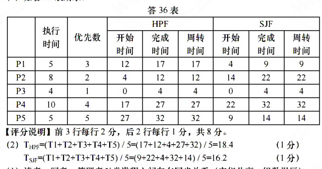

> 202110

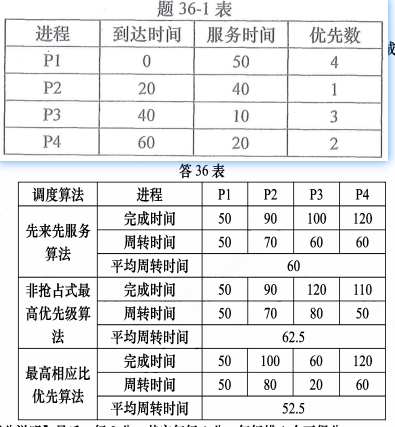

### 页置换

> 202304

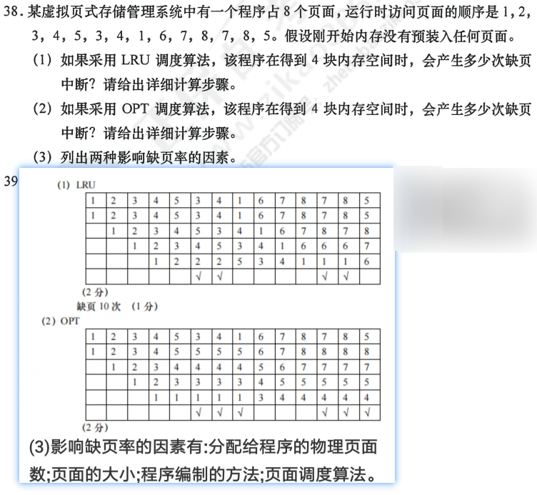

- 优化替换算法 OPT：**替换未来的近期里不用的页**。

>

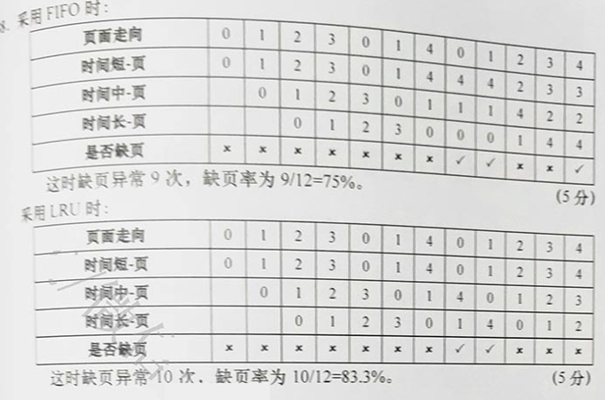

- 理解为 ”入栈“就可以了
- FIFO：
  - 新元素入栈出现重复时
    - 是否缺页"√"，然后不动
- LRU
  - 新元素入栈出现重复时
    - 是否缺页"√"，然后将重复元素移动到 **"第一列"**

### PV

- 看题型
- 同步关系
  - P：申请，V：释放
  - 互斥量防止多个进程或线程同时访问共享资源。202304
- 并发关系
  - P：等待/减少信号量。V：释放/增加信号量
    - `V` 用于释放资源或唤醒等待某个条件的其他进程
    - 而 `P(S1)` 用于等待或阻塞

> 202304

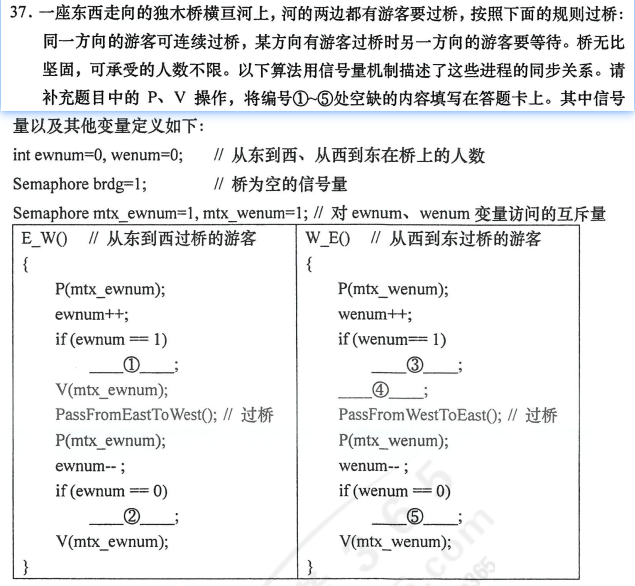

- 答案：
  - P brdg
  - V brdg
  - P brdg
  - V mtx_wenum
  - V brdg

> 202110

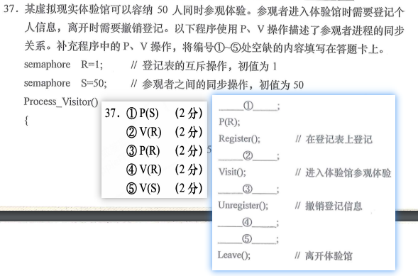

- ① 开始参观者集合：`P(S)`
- 然后`P(R)`登记
- ② 解散参观：`V(S)`
- ③ 离开前 `P(R)` 准备登记
- ④ `V(R)`
- ⑤ `V(S)`

> 202104

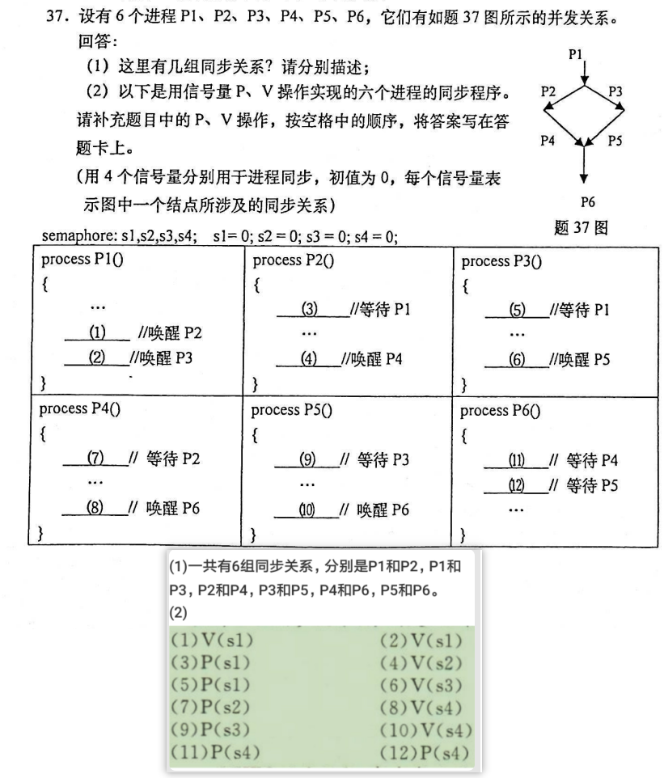

### 磁盘

> 202110

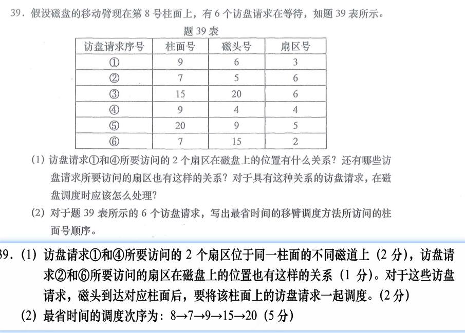

- 请求顺序依次是：55、72、100、88、93 和 66，当前磁盘位于 90 号柱面。

- 先来先服务调度算法（FCFS）
  - 服务顺序：90→55→72→100→88→93→66
  - 移动距离：35+17+28+12+5+27=124（跨越的柱面总数）
  - 磁头改变方向的次数：4 次。
- 最短寻道时间优先算法（SSTF）Shortest Seek Time First
  - **先访问最近的**
  - 服务顺序：90→88→93→100→72→66→55
  - 移动距离：2+5+7+28+6+11=59（跨越的柱面总数）
    磁头改变方向的次数：2 次。
- 扫描算法（SCAN）单向扫描算法
  - **先往最近的那边扫描**
  - **减少磁头改变方向**的一类调度算法，`改变磁头时需要回到0`
  - 服务顺序：90→88→72→66→55→0→93→100
  - 移动距离：2+16+6+11+55+93+7=190（跨越的柱面总数）
    磁头改变方向的次数：1 次。
- 电梯算法

  - **先往最近的那边扫描**
  - 和扫描算法相同，双向扫描，`但不需要回到0`
    - 从外向内就是 **往大的扫描**
  - 服务顺序：90→88→72→66→55→93→100
  - 移动距离：2+16+6+11+38+7=80（跨越的柱面总数）
  - 磁头改变方向的次数：1 次。

- 循环扫描算法（CSCAN）
  - 单向扫描，一个方向向下扫描，**然后去到最高点**在向下扫描，所以变成 100→93
  - 服务顺序：90→88→72→66→55→100→93
  - 移动距离：2+16+6+11+45+7=87（跨越的柱面总数）
  - 磁头改变方向的次数：2 次。

### 其他

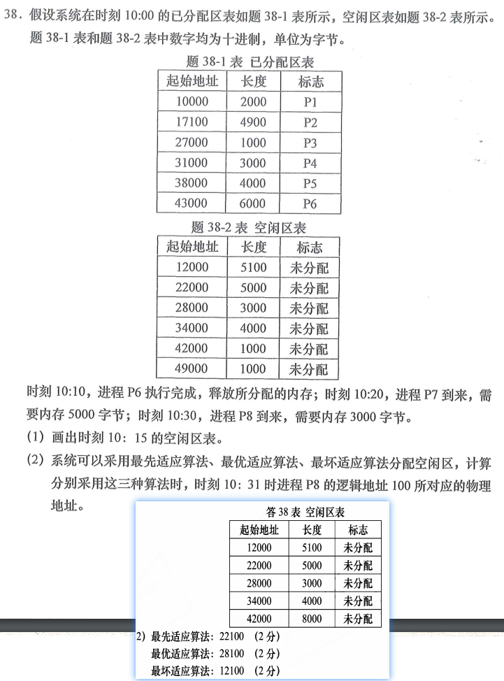

- （1）
  - 首先总地址范围是：10000 到 50000
  - 然后 P6 完成了，那么就将 P6 的长度添加到第五行的长度中。
- 最先适应算法
  - 往 **低地址空闲** 区域放，放不下的话在更加地址慢慢升高。
  - P7 进来需要 5000 字节（占用的起始地址是 12000）
  - P8 进来需要 3000 字节（占用的起始地址是 22000）
  - 答：结果是`22100`
- 最优适应算法
  - 取 **长度最小** 的空闲区域，空闲区域按照长度“由小到大”的次序以此记录于空闲区域表中。
  - P7 进来需要 5000 字节（占用的起始地址是 22000）
  - P8 进来需要 3000 字节（占用的起始地址是 28000）
  - 答：结果是`28100`
- 最坏适应算法
  - 取**“长度最大”**的空闲区域。空闲区域按照长度“由大到小”的次序以此记录于空闲区域表中。
  - P7 进来需要 5000 字节（占用的起始地址是 42000）
  - P8 进来需要 3000 字节（占用的起始地址是 12000）
  - 答：结果是`12100`
