# 数据结构

## 第一章 概论

1. **数据结构的概念**

- 数据结构(Data structure）
- 是计算机组织数据和存储数据的方式。

---

2. 基本术语

- 数据
  - 所有能被计算机处理的符号的集合
- 数据元素
  - 是数据这个集合中的一个个体即数据的基本单位
- 数据项
  - 数据元素常常还可分为若干个数据项，数据项是数据具有意义的最小单位

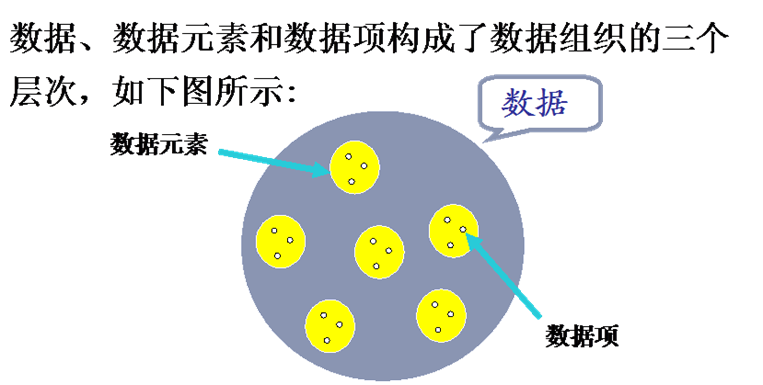

- 逻辑结构
  - 数据元素之间的结构关系
- 物理结构（存储结构）
  - 指数据结构在机内的表示，数据的逻辑结构在计算机中的实现

---

3. 逻辑结构的类型

- 集合
  - 数据元素同“属于一个集合”。 R = {}
- 线性结构
  - R= {(d1, d2), (d2, d3), …, (dn-1, dn)}, 即除起始节点和终端结点 d1, dn 外,每个节点有一个前驱和一个后继
  - 注意第一项的 d2 和第二项的 d2，两项靠 d2 相互联系
- 树状结构
  - (D, {R}) 构成树, 即每个元素最多有一个前驱, 可以有多个后继
- 图状结构
  - (D, {R})构成一个图

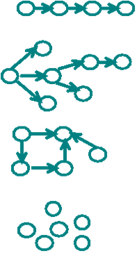

- 逻辑结构与数据元素本身形式、内容无关
- 逻辑结构与数据元素的相对位置无关
- 逻辑结构与所含结点个数无关

---

4. 数据的存储结构

- 数据在计算机内的表示形式称为：
  - **数据的存储结构**
- 存储结构的主要部分：
  - 存储结点（每个存储结点存放一个数据元素）
  - 数据元素之间关联方式的表示
- 数据结构的**存储**：
  - 数据元素的存储
  - 及其逻辑关系的存储
- **分为四种存储方式**
  - 顺序存储结构
  - 链式存储结构
  - 索引存储方式
  - 散列存储方式
- 顺序存储结构：借助**数据元素的相对存储位置**来表示**数据的逻辑结构**；线性表的顺序存储方法：将表中的结点一次**存放在计算机内存中**一组**连续的存储单元**中
- 链式存储结构：借助**数据元素地址的指针**表示数据的逻辑结构
- 索引存储结构：借助**索引表中的索引**指示各存储节点的存储位置
- 散列存储结构：用**散列函数指示**各节点的存储位置

- **顺序结构特点：**
  - 预先分配好长度，预估存储数据需要的存储量
  - 插入和删除需要移动其他元素
  - 存取快捷，随机存取结构
- **链式结构的特点**

  - 将存储单位分为：数据项和指针项
  - 动态分配，不需要预先确定内存分配
  - 插入和删除不需要移动其他元素
  - 非随机存取结构

- **逻辑结构和存储结构的关系**
  - 逻辑结构
    - **数据结构**定义中的**关系**指数据之间的逻辑关系，所以数据结构也是逻辑结构
  - 存储结构
    - 在计算机中表示为物理结构

---

5. 算法

- 算法规定了求解给定类型问题所需的所有“处理步骤”及执行顺序，使给定类型问题能在有限时间内被机械的求解
- 算法必须使用某种语言解释
  - 程序
  - 介于自然语言和程序设计语言的伪代码
  - 非形式算法（自然语言）
  - 框图(N-S 图)
- 算法是对特定问题求解步骤的一种描述，是指令的有穷序列
- 具有以下特性：
  - 有穷性：一个算法总是在执行有穷步后结束确定性: 算法的每一步都必须是明确地定义的
  - 确定性：算法的每一步都必须是明确地定义的
  - 可行性： 算法中的每一步都是可以通过已经实现的操作来完成的
  - 输入: 一个算法有零个或者多个输入, 这些输入取自于特定的对象集合
  - 输出:　一个算法有一个或者多个输出，它们是与输入有特定关系的量
- 算法的设计应该满足：

  - 正确性：对于合法的输入产生符合要求的输出
  - 可读性：算法应该易读、便于交流， 这也是保证算法正确性的前提；添加注释也是一种增加可读性的办法
  - 健壮性：当输入非法时， 算法还能做出适当的反应而不会崩溃， 如输出错误信息；算法中应该考虑适当的错误处理
  - 效率高且内存消耗小：效率高指运行时间短。存储指算法执行过程中所需的最大存储空间

- 算法的**时空性**是指：时间复杂度、空间复杂度。提高算法效率
- 时间复杂度
  - 算法运行时需要的总步数，通常是问题规模的函数
- 空间复杂度

  - 算法执行时所占用的存储空间，通常是问题规模的函数

- 算法在所有输入下的计算量的**最大值**作为算法计算量，称为**算法的最坏情况时间复杂度**
- 算法在所有输入下的计算量的**加权平均值**作为算法计算量，称为**算法的平均时间复杂度**
- 两者统称为：时间复杂度

- 算法时间量度记为：T(n)= O($n^3$)

常数阶 O(1)→ 对数阶 O(log2n)→ 线性阶 O(n)→ 线性对数阶 O(nlog2n)→ 平方阶 O(n2)→ 立方阶 O(n3)→ 指数阶 O(2n)→ 阶乘阶 O(n!)

- 步数计算

- 迭代累加求和

  - ```C
    float sum(int a[], const int n){
          float s = 0.0; // 计一步
             for (int i = 0; i < n; i++ )
                 s += a[i]; // 每次循环计一步
           return s; // 计1步
       }

    ```

  - 所以累计步数：n+2

- 函数调用赋值语句

  - ```C
    　for (int i=0;j<n;i++)
           A[i]=i;
        x = sum (A, n);
    ```

  - 总步数：循环步数 + 调用的步数 + 1

  - 循环步数是：n。调用步数是 sum 的步数（n+2）。1 是执行的步数（x = sum (A, n);）

  - T(n)= n+ (n + 2) + 1=2n+3

- 执行次数（步数）和量级是不同的

---

### 概论补

- 数据结构包含三个方面：<code>逻辑结构、存储结构（物理结构）、数据运算</code>
- 数据存储的四种方式：
- 在高级语言程序设计中，按照值的不同特性，数据类型分为：<code>原子类型、结构类型</code>
- 算法分析两个方面：（哪两个复杂性，自己想）

- 程序执行时间这样算：遇到几个循环就是 n 的几次方，如果是常量就算为 1（时间复杂性）
- 最后熟记函数阶级的大小

## 第二章 线性表

### 顺序表

1. 基本概念

- 由 n 个数据元素（节点）组成的**有限序列**
- 数据元素个数 n 定义为表的长度，n 为 0 时称为**空表**
- 将非空的线性表（n ＞ 0）记作：
  - $L=（a_1，a_2，…，a_n）$
- 数据元素$a_i$（1≤i≤n）只是个抽象符号
- 顺序表是用一维数组实现的线性表，数组下标可以看成是元素的相对地址
- 逻辑上相邻的元素，存储在物理位置也相邻的单元中
- **线性表的逻辑结构与存储结构一致 **
- **可以对数据元素实现随机读取**

---

2. 术语

- 起始结点、终端结点、直接前驱、直接后继、线性表长度，空表
- 线性表中**只有一个起始结点**，**一个终端结点**
- 起始结点**没有直接前驱**，**只有一个直接后继**
- 终端结点**有一个直接前驱**，**没有直接后继**
- 除此二结点外，**每个结点**都有且**只有一个直接前驱**和**一个直接后继**

- 逻辑结构特征
- 非空线性表
  - 只有一个**起始节点**$a_1$，没有前驱，只有**一个直接后继**$a_2$
  - 只有一个**终端结点**$a_n$，没有后继，只有**一个直接前驱**$a_{n-1}$
  - 其余的**内部节点**$a_i$，（2 <= i <= n-1），都只有一个前驱（$a_{i-1}$）和一个后继（$a_{i+1}$）

```
1，初始化     Initiate(L)
2，求表长度   Length(L)
3，取表元     Get(L,i)
4，定位       Locate(L,x)
5，插入       Insert(L,x,i)
6，删除       Delete(L,i)
```

---

3. 顺序实现

- 顺序表是线性表的顺序存储存储结构，即以**一段连续内存存放**的线性表
- **计算 ai 地址**
  - $Loc(a_1)$：a1 的地址
  - 每个元素占 c 个单元
  - $Loc(a_i) = Loc(a_1) + c *(i-1)$

---

4. 结构体

- 结构体定义

```C
#define maxsize 100
typedef struct
{  datatype data[maxsize];
    int length;
} Seqlist;

Seqlist  L；
```

- 理解为是一种构造函数，将不同类型的数据组合成一个整体（自定义数据类型）
- 好处
  - 加强数据项之间的联系

```C
struct   结构体类型名
{
   数据类型名1   成员名1；
   数据类型名2   成员名2；
   … …
   数据类型名n   成员名n；
}；
  # 间接定义法：先定义结构类型，再定义结构变量
struct  结构体类型名  变量名列表；

  # 直接定义法：定义结构体类型的同时定义结构体变量
struct  [结构体类型名]
{
   数据类型名1    成员名1；
   … …
   数据类型名n    成员名n；
} 变量名列表；

```

- 结构体的引用
- 非指针变量的引用
  - 结构体变量名.成员名
  - <code>stu1.num</code>
  - <code>stu1.birthday.month</code>
- 指针变量的引用
  - 结构体指针->成员名
  - <code>pstu->num</code>
  - <code>pstu->birthday.month</code>
  - （\*结构体指针）.成员名

```C
例  struct  student
      {
        int  num;
        char name[20];
        struct  date
        {
          int month;
          int day;
          int year;
        } birthday;
      } stu1, stu2, *pstu = &stu1;
```

- 附
  - 可以将结构体变量赋值给另外一个结构体变量
    - <code>Stu2 = stu1;</code>
- 初始化赋值：

```C
struct  [结构体类型名]
{
   … …
} 变量名 = {成员1的值，成员2的值， …， 成员n的值}；
```

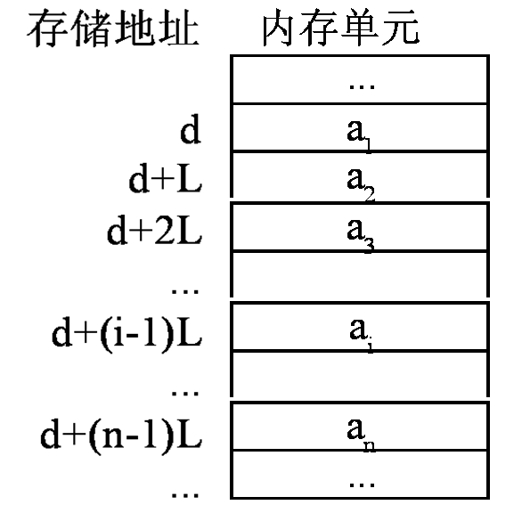

---

5. 基本运算

- **插入运算**
  - 插入新节点 x，需要向后移动 i 个位置
  - 只有插入位置是 i = n + 1 时，不需要移动，因为是尾部
- 插入运算分析：
  - 有 n+1 个位置可插入
  - 每个插入位置的概率是：1 / (n + 1)
  - 在 i 位置插入时，需要移动 n - i + 1 个数据
  - 平均移动次数：n/2
  - 时间复杂度：O(n)
- 删除运算
  - 有 n 个位置可删除
  - 删除概率：1 / n
  - 在 i 位置删除时，需要移动 n - i 个数据
  - 平均移动次数：(n-1)/2
  - 时间复杂度：O(n)

---

6. 顺序表的优缺点

- 优点
  - 无需为表示结点间的逻辑关系而增加额外存储空间
  - 可以方便地随机存取表中的任一结点
- 缺点
  - 插入和删除运算不方便，必须移动大量的结点
  - 顺序表要求占用连续的空间，存储分配只能预先进行，因此当表长变化较大时，难以确定合适的存储规模

---

### 链式表

#### 单链表

1. 链式表的概念

- 链接方式存储的线性表简称为链表**Link List**
- 具体存储方式
  - 用一组**任意**的存储单元来存放
  - 链表中结点的**逻辑次序**和**物理次序** **不一定** 相同。还必须存储指示其后继结点的地址信息
  - 存储单位地址是**无序的**
- data 域--存放结点值的数据域
- next 域--存放结点的直接后继的地址（位置）的指针域（链域）
- NULL 称为 空指针
- Head 称为 头指针变量，存放链表中第一个结点地址

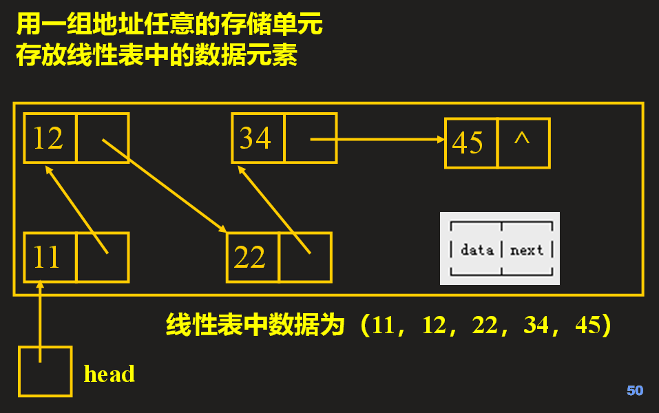

- 单链表头节点不存数据，头结点是存放该节点的**结点地址**，增加头结点的原因是**方便运算**

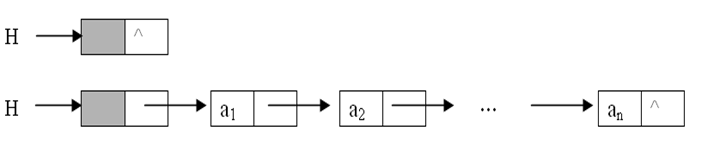

---

2. 单链表的运算

- 类型定义

```C
struct  node
{
  // 数据域
  datatype data；
  // 指针域，存储直接后继节点地址
	struct node * next；
}Node，*LinkList;
```

- 特点
  - 初始结点：首结点，无前驱，所以设置头指针 head 指向开始结点
  - 终端结点：尾结点，无后继，所以指针域是空的，为 NULL
  - 除此之外的结点：表结点
  - 为运算操作方便，头结点中不存数据
- Hear 是链表的头指针，指针类型变量
- Head 内存放的是：头结点地址

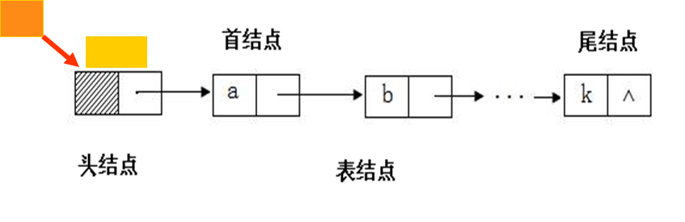

- 初始化
- 头结点由 malloc 函数生成一个新节点
- （数据类型\*）malloc（sizeof（数据类型））

```C
LinkList  InitiateLinklist( )
{
  // 定义一个指向单链表的指针变量
  LinkList head;
	head = ( linkList ) malloc(  sizeof( struct node )  );
  head->next=NULL;
  return head;
}
```

- 求表长
- 表长度等于节点个数（不含头结点）
- 0 1 2 3 4 5（0 是头结点）
- 计数器从 0 开始，从头结点开始算，如果下个结点不为空，则+1。结果为表长

```C
int lengthLinkList (LinkList head)
{
  // 定义一个指向节点的指针变量
  ListNode *p;
  //
  p=head;
  int len=0;
  while( p->next != NULL )
  {
    p=p->next;
    j++;
  }
  return(len);
}
```

- 查找第 i 个元素
- j 从 1 开始，下个结点不为空，且 i < j，则 j + 1，如果 i=j 则找到，否则无

```C
Node GetlinkList( LinkList head, int i )
{
  ListNode *p;
  p = head;
  int j = 0;
  while ( (p->next!=NULL) && (j<i) )
  {
    p=p->next;
    j++;
  }
  if(i==j)  return(p);
  else  return(NULL);
}
```

- 删除第 i 个元素
- 找到 i - 1 个节点，如存在继续，否则结束
- i - 1 个节点的后继指向 i + 1

```C
void DeleteLinkList (LinkList head,int i)
{
  ListNode *q;
  if (i==1) p=head;
  // 获取 i-1个节点，给到p
  else p=GetLinkList(head, i-1);
  if ( p！=NULL && p->next!=NULL )
	{
    // q 就是我们想要删除的结点 i
    q=p->next;
    p->next=q->next;
    free(q);
	}
  else printf(”error”);
}
```

- 插入第 i 个位置
- 范围是：$a_{i-1}$和$a_i$
- 步骤
  - 找到 ai-1 存储位置 p
  - 生成一个数据域为 x 的新结点\*s
  - 新结点的指针域指向结点 ai
  - 令结点\*p 的指针域指向新结点

```C
void InsertLinkList (LinkList head, Data x,  int i)
{
  Node *p,*q;
  p=GetLinkList (head, i-1);
  if (p)       //若p！=NULL
  {
    s=()malloc();
    s->data=x;
    s->next=p->next;
    p->next=s;
  }
  else printf(“error”);
}
```

- 查找某个值
- p = 头结点的下一个节点（第一个节点），循环，p 不为空且 p 的数据不等于 X，就 next

```C
int LocateLinklist(LinkList head , DataType x)
{
  Node *p=head;
  p=p->next;
  int i=0;
  while (p!=NULL && p->data!=x)
  {
    i++;
    p->next;
  }
  if (p!=NULL）return i+1;
  else return 0
}
```

---

- **头插法**，很重要！！
- 在 Head 的后面插入
- 新节点的指向 Head 下一个节点。Hear 下一个节点指向新节点。最后让 hear->next = p 重置下

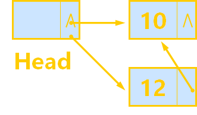

```C
LinkList CreateLinkList1()
{
  Linklist head;
  LinkNode * p;
  int x;
  head=malloc(sizeof(Node));
  head->next=NULL;
  scanf(%d”,&x);
  while (x)
  {
    p = malloc (sizeof(Node));
    p->data=x;
    p->next=head->next;
    // 最后重置一手 P节点 让他永远是头结点的下一个节点
    head->next=p;
    scanf (“%d”,&x);
  }
  return head;
}

```

- **尾插法**，很重要！！
- 在尾部的插入，建立一个尾插表
- 获取一个数据为 x，初始化与开辟一个节点空间，将数据 x 给到该空间，p->next 指向该空间，并将值给到 p（p = q）让原本的头结点指向尾结点。继续获取数据~~~循环

```C
Linklist  CreateLinkList2(  )
{
  head=( )malloc(sizeof(struct node))
  LinkNode * p;
	// 头结点
  p=head;
  // 获取一个数据
  scanf(“%d”,&x);
  while(x!=‘∅’)
  {
    //为该结点空间开辟空间
    q = ( )mallco(sizeof(struct node));
    //赋予数据
    q->data = x;
    p->next = q;
    // 关键是这步：更新一下 p为尾结点
    p = q
    //继续获得数据
		scanf("%d",x);
  }
  p->next=NULL;
	return head;
}

```

- 删除重复节点
- p 是对比的数据，q->next->data == p->data，q 下一个值如果不等于 p 数据，则 q = q->next
- 如果等于则，
  - p = p->next，先将 p 跳到下一个数据
  - r = q->next（r 是我们要删除的结点），待会释放
  - q->next =q->next->next 删除他
  - free(r)

```C
  p=head->next  //令p指向第一个数据节点
  if （p==NULL） return；
  while（p->next!=NULL）//当p不是终端结点时
  { q=p;  //从p开始向后找和p数据相等的结点
    while（q->next!=NULL）
    {  if(q->next->data == p->data )
          p=p->next;   //删除q->next 所指结点
          r=q->next;
          q->next =q->next->next;
          free(r);
       else  q=q->next;}
```

- 循环链表
- 终端结点的**next 指向头结点**
- 循环列表附设一个 rear 指向尾结点
- 只有一个节点是：p->next = p
- 如果 p 为尾结点则满足：p->next == first

---

#### 双向链表

- 有两个指针域，指向后继节点和指向前驱节点


```C
struct  dlnode
{
  datatype data;
  struct dlnode *prior, *next;
};
```

---

#### 指针的概念

- 指针是存储**变量地址**的东西，如果有一个变量是**专门存储变量地址**的，那我们称该变量是 **指针变量**

  - 例：地址 0x111 他就是变量 X 的指针
  - 指针是一个地址，指针变量的值是地址值，指针变量是存放地址的变量

- **i_pointer**是指针变量。**\*i_pointer**是指针变量所指向的变量（存储的是值/数据）。
- i = 3 等价于 **\*i_pointer** = 3。懂了吧？
- 其含义是：将数值 3 赋值给 指针变量 **i_pointer**所指向的**\*i_pointer**这个指针变量

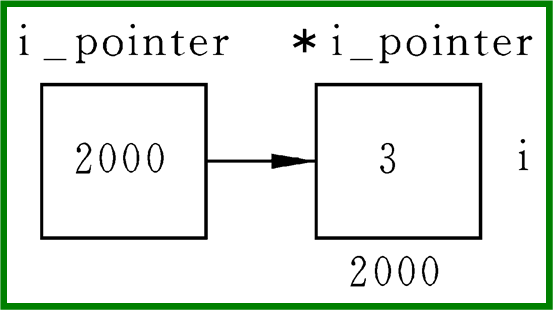

- 定义一个指针变量

- **类型说明符　\*指针变量名**

- 类型说明符：指针变量所指向的变量的数据类型

  - ```c
    float  *pointer_3;
    char  *pointer_4;
    ```

- 用赋值语句使一个指针变量得到另一个变量的地址，从而使它指向该变量

- 如此连接：<code>&i</code>存储着变量 i 的地址，现在指针变量保存了<code>变量 i </code>地址值，所以就会指向变量 i 。懂？

  - ```C
    pointer_1 ＝ &i;
    pointer_2 ＝ &j;
    ```

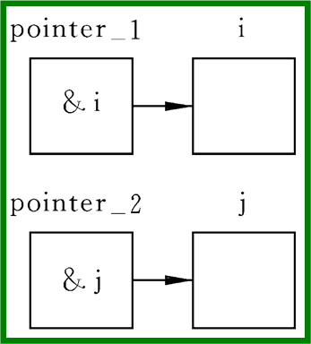

- **！！注意！！**
- 一：在用指针变量的时候，指针变量名是 <code>pointer_1</code>，不是<code>\* pointer_1 </code>，没有 星号的啊！！用的时候别加
- 二：别瞎定义，指针变量的类型说明符要和变量类型相同

```C
// 这是错的！！！！
float a;
int * pointer_1;
pointer_1 = &a;
// 这是错的！！！！
```

- &：返回内存地址。\*：表示地址对应单元中内容。

- 指针变量不能直接赋值：

  - ```c
    int *pp;
    pp = 10
    ```

  - 这是错的！！！10 不是地址！！！！如果你先给变量赋个 10 在把变量地址值赋给 pp 就可以

---

- 例题
- 线性表：计算
  - 长度为 n 的顺序存储线性表，将该表逆置
  - 找出最大值和最小值和他们的位置
  - L 是一个递增有序表，将 x 插入 L 以后，仍是有序
  - 两个顺序表 A 和 B，删除 A 中和 B 相同的部分
- 单链表：计算

  - L1 和 L2 分别指向两个单链表的头结点，长度为 m 和 n，将两者合并
  - 带头结点单链表 L ，是一个递增有序的链表，删除表中大于 min 且小于 max 的结点，同时释放空间

---

### 总结

- 顺序表

  - 第 i 个元素存储地址计算
  - 插入、删除算法
  - 插入、删除移动次数
  - 平均移动次数
  - 时间复杂度
  - 特点：逻辑关系上相邻，物理位置也相邻

- 单链

  - 熟悉用 C 表示链表的存储结构
  - 插入、删除、查找算法
  - 头尾插建表算法
  - 循环链表的定义

- 双链

  - 概念
  - 插入、删除算法

- 相比较

  - **顺序表** 随机存取任意元素，存储位置可用公式表示，在插入和删除元素时需要移动大量元素。
  - **链式表** 适合插入删除移动元素，但是失去随机访问的特点
  - 访问节点时**顺序表**的时间复杂度是 O(1)而**链式表**是 O(n)
  - 存储密度 = （结点数据域所占空间）/ （整个结点所占的空间）

---

## 第三章 栈与队列与数组

### 栈

1. 栈的概念

- 栈是只能在表的一端（表尾）进行插入和删除的线性表
  - 允许插入及删除的一端（表尾）称为**栈顶(Top)**
  - 另一端（表头）称为**栈底(Bottom)**
  - 当表中没有元素时称为**空栈**
- 进栈——在栈顶插入一元素
- 栈——在栈顶删除一元素
- 栈的特点：
  - 后进先出
- 用途：
  - 常用于暂时保存有待处理的数据
- 基本运算

```
（1）初始化栈：InitStack(S);
（2）判栈空：EmptyStack (S);
（3）进栈：Push (S,x);
（4）出栈：Pop (S);
（5）取栈顶：GetTop(S);
```

---

2. 常用名词

- 顺序栈
  - 即栈的顺序实现
- 栈容量
  - 栈中可存放的最大元素个数
- 栈顶指针 top
  - 指示当前栈顶元素在栈中的位置
- 栈空
  - 栈中无元素时，表示栈空
- 栈满
  - 数组空间已被占满时，称栈满
- 下溢
  - 当栈空时，再要求作出栈运算，则称“下溢”
- 上溢
  - 当栈满时，再要求作进栈运算，则称“上溢”

---

3. 顺序栈的类型定义

```C
typedef struct seqstack {
  DataType data[maxsize];
  int top;
}SeqStack;
// 类型就是：SeqStack
```

- 定义一个顺序栈
  - <code>SeqStk \*s;</code>
- 栈空
  - <code>s->top==0</code>
- 栈满
  - <code>s->top==maxsize -1</code>

---

4. 栈的基本运算

- 初始化

```C
int Initstack(SeqStk *stk)
{
  stk->top=0;
  return 1;
}
```

- 判断栈空

```C
int EmptyStack(SeqStk *stk)
{
  if(stk->top==0) return 1;
  else return 0;
}
```

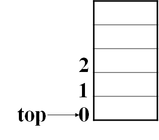

- 进栈
  - 修改栈顶指针，插入元素

```C
int Push(SeqStk *sq, DataType x){
   /*数据元素x进顺序栈sq*/
  if（sq->top==maxsize -1) /*判是否上溢*/
  { error(“栈满”);return 0;}   /*上溢*/
  else {
    sq->top=sq->top+1；/*修改栈顶指针，指向新栈顶*/
    sq->data[sq->top]=x; /*元素x插入新栈顶中*/
    return 1;
  }
}
```

- 出栈

```C
int Pop(SeqStk *sq){
   /*顺序栈sq的栈顶元素退栈*/
  if（sq->top==0） /*判是否下溢*/
  { error(“栈空”);return 0;} /*下溢*/
  else {
    sq->top-- ； /*修改栈顶指针，指向新栈顶*/
    return 1;
  }
}
```

- 获取栈顶元素

```C
DataType GetTop(SeqStk *sq)
{
  // 判断栈是否为空
  if(EmptyStack(sq)) return NULLData;
  else
    return sq->data[sq->top];
 }

```

---

5. 链式栈

- 链栈，插入和删除都在表头进行，栈顶指针就是链表的头指针
- 下溢条件
  - <code>LS->next == NULL</code>
- 可不考虑栈满

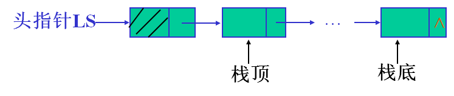

- 类型说明

```C
typedef struct stacknode{
  DataType data;
  struct node *next
}LinkStack;
// 链栈类型：LinkStack
```

---

6. 基本运算

- 初始化

```C
int InitStack(LkStk *LS)
{
  LS=(LkStk *)malloc(sizeof(LkStk));
  LS->next=NULL;
}
```

- 判断栈空

```C
int EmptyStack(LkStk *LS)
{
  if(LS->next==0) return 1;
  else return 0;
}
```

- 进栈

  - 生成新结点
  - 将新结点插入链栈中并使之成为新的栈顶结点

  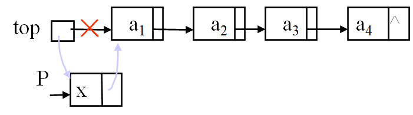

```C
void Push (LkStk *LS, DataType x)
{
  LkStk *temp;
  temp= (LkStk *) malloc (sizeof (LkStk));
  temp->data=x;
  temp->next=LS->next;
  LS->next=temp;
}
```

- 出栈
  - 删除一个元素，不用考虑下溢问题

```C
int Pop (LkStk *LS)
{
  LkStk *temp;
  // 判断不为空
  if (!EmptyStack (LS))
  {
    // temp是删除的结点
    temp=LS->next;
    LS->next=temp->next;
		// 最后释放结点
    free(temp);
    return 1;
  }
  else return 0;
}
```

- 获取栈顶元素

```C
DataType  GetTop(LkStk *LS)
{
  if (!EmptyStack(LS))
    return  LS->next->data;
  else
    return  NULLData;
}
```

---

### 队列

1. 概念

- 是一种运算受限的线性表

- 只允许在表的一端进行插入，而在另一端进行删除的线性表
- **切记：入队在队尾，出队在队头**
- 特点
  - 先进先出


- 基本运算

```
队列初始化 InitQueue(Q):
    设置一个空队列Q；

判队列空 EmptyQueue(Q):
    若队列Q为空，则返回值为1，否则返回值为0；

入队列 EnQueue(Q,x):
    将数据元素x从队尾一端插入队列，使其成为队列的新尾元素；

出队列 OutQueue(Q):
    删除队列首元素；

取队列首元素GetHead(Q):
    返回队列首元素的值。
```

- 类型定义

```C
#define maxsize 20
typedef struct SeqQueue
{
  DataType data[maxsize];
  int front, rear;
}SeqQueue;
SeqQue  sq;
```

2. 队列操作

- 用一维数组作为队列的存储结构
- 队列容量
  - 队列中可存放的最大元素个数
- 头指针：front
  - 删除元素
- 队尾指针：rear
  - 插入元素
- 初始

  - <code>front=rear=0</code>

- 入队
  - <code>rear 增 1，元素插入尾指针所指位置</code>
  - <code>sq.rear=sq.rear+1;</code>
  - <code>sq.data[sq.rear]=x;</code>
- 出队
  - <code>front 增 1，取头指针所指位置元素</code>
  - <code>sq.front=sq.front+1;</code>
- 上溢
  - <code>sq.rear == maxsize-1</code>
- 下溢
  - <code>sq.rear == sq.front</code>

---

3. 循环队列

- 为队列分配一块存储空间(数组表示)，并将这一块存储空间看成头尾相连接的
- 头指针 front
  - 顺时针方向落后于实际队头元素一个位置
- 尾指针 rear
  - 指向实际队尾元素

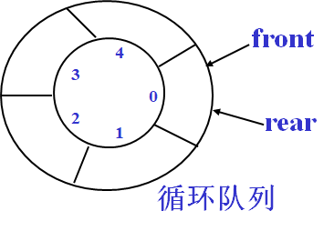

---

4. 循环队列操作

- 入队
  - 队尾 rear + 1
  - <code>Sq.rear=(sq.rear+1)%maxsize</code>
- 出队

  - 队头 front + 1
  - <code>Sq.front=(sq.front+1)%maxsize</code>

- 定义

```C
#define maxsize 20
typedef struct seqqueue
{
  DataType data[maxsize];
  int front, rear;
}CycQue;
CycQue CQ;
```

- 下溢，栈空
  - <code>CQ.front==CQ.rear</code>
- 上溢、栈满

  - **浪费一个空间，队满时实际队容量=maxsize-1**
  - <code>(CQ.rear+1)%maxsize==CQ.front</code>

- 初始化

```C
void Init Queue(CycQue CQ)
{
  CQ.front=0;CQ.rear=0;
}
```

- 判断栈空

```C
int EmptyQueue(CycQue CQ)
{
  if (CQ.rear==CQ.front)  return  1;
  else  return  0;
}
```

- 入队列

```C
int EnQueue(CycQue CQ,DataType x)
{
  if((CQ.rear+1)%maxsize==CQ.front)
  {
    error(“队列满”);
    return 0;
  }
  else {
    CQ.rear=(CQ.rear+1)%maxsize;
    CQ.data[CQ.rear]=x;
    return  1;
  }
}
```

- 出队

```C
int OutQueue(CycQue CQ)
{
  if (EmptyQueue(CQ))
  {
    error(“队列满”)；
    return 0；
  }
   else {
     CQ.front=(CQ.front+1)%maxsize;
     return 1；
   }
}
```

- 取队头元素

```C
DataType  GetHead(CycQue CQ)
{
  if (EmptyQueue(CQ))
    return NULLData；
  else
    return CQ.data[(CQ.front+1)%maxsize];
}
```

---

5. 链式队列

- 用链表表示的队列，即它是限制仅在表头删除和表尾插入的单链表
- 头指针 front
  - 指向表头结点；队头元素结点为 front->next
- 尾指针 rear
  - 指向链表的最后一个结点（即队尾结点）

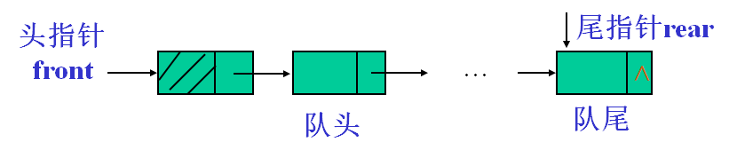

- 类型说明

```C
typedef struct  LkQueue
{
  LkQueue *front, *rear;
} LinkQueue;
LinkQueue  LQ ; //链式队列
```

- 上溢不考虑，动态申请空间
- 下溢即为空，需要考虑
  - 判断队空：
  - <code>LQ.front->next == NULL</code>
  - 或
  - <code>LQ.font == LQ.rear</code>

---

6. 链式队列基本运算

- 初始化

```C
void initQueue(LkQue *LQ)
{
  LkQueNode *temp;
  temp=(LkQueueNode *)malloc(sizeof(LkQueNode));
  LQ->front=temp;
  LQ->rear=temp;
  (LQ->front)->next=NULL;
}
```

- 判断队列空

```C
Int EmptyQueue(LkQue  LQ)
{
  if (LQ.rear==LQ.front) return 1;
  else  return 0;
}
```

- 入队
  - 生成新结点 p（其数据域置 x，链域置 NULL）
  - 将新结点 p 插入到表尾，并变成新的队尾结点

```C
Void EnQueue(LkQue *LQ;DataType x)
{
  LkQueNode  *temp;
  temp=(LkQueNode *)malloc(sizeof(LkQueNode));
  temp->data=x;
  temp->next=NULL;
  (LQ->rear)->next=temp;
  LQ->rear=temp;
}
```

- 出队
  - 第一步：下溢问题
  - 第二步：取队头节点 temp
  - 第三步：删除队头节点
  - 第四步：如果队列只有一个元素，删除后队列为空，则修改队尾指针
  - 最后一步：释放 temp

```C
OutQueue(LkQue  *LQ)
{
  LkQueNode  *temp;
  // 第一步
  if (EmptyQueue(LQ))
  {
    error(“对列空”)；
      return 0；
  }
  else {
    // 第二步
    temp=(LQ->front)->next;
    // 第三步
    (LQ->front)->next=temp->next;
    // 第四步
    if (temp->next==NULL) LQ->rear=LQ->front;
    // 第五步
    free(temp); return  1;
  }
}
```

- 取队头元素

```C
DataType  GetHead (LkQue LQ)
{
  LkQueNode  *temp;
  if (EmptyQueue(LQ)) return  NULLData;
  else  {
    temp=LQ.front->next;
    return  temp->data;
  			}
}
```

---

### 中 → 后缀表达式

4+2\*3

- 1：遇到 4 直接输出
- 2：+，保存到栈
- 3：遇到 2 直接输出
- 4：\*，与前一个 + 对比，乘号优先度比加号高，所以保存到栈
- 5：遇到 3 直接输出
- 最后：423\*+

- 第三步的时候，将站中 括号内的符号输出

| 初始 | 9-(2+4\*7)/5+3 | 栈       | 空                     |
| ---- | -------------- | -------- | ---------------------- |
| 1    | 2+4\*7)/5+3    | - (      | 9                      |
| 2    | )/5+3          | - ( + \* | 9 2 4 7                |
| 3    | /5+3           | -        | 9 2 4 7 \* +           |
| 4    | 5 + 3          | - /      | 9 2 4 7 \* +           |
| 5    | + 3            | - /      | 9 2 4 7 \* + 5         |
| 6    | 3              | +        | 9 2 4 7 \* + 5 / -     |
| 7    | 空             | 空       | 9 2 4 7 \* + 5 / - 3 + |

- 中缀总结
- 遇到数字，就直接输出到**后面**
- 运算符如果是高一级则**保存到栈**，否则将栈内的运算符输出（输出的是原本栈所保存的，新添加进来的不输出），按照**后进先出**的方式
- 如果遇到括号，则同理，括号运算符优先度最高，输出时**只需要将括号内的运算符输出**即可。
- **！！重要！！**，记得加括号 9 - （5 \* 2 / 5）

### 后缀表达式计算

| 初始 | 9 2 4 7 \* + 5 / - 3 + | 空      |
| ---- | ---------------------- | ------- |
| 1    | \* + 5 / - 3 +         | 7 4 2 9 |
| 2    | + 5 / - 3 +            | 28 2 9  |
| 3    | 5 / - 3 +              | 30 9    |
| 4    | / - 3 +                | 5 30 9  |
| 5    | - 3 +                  | 6 9     |
| 6    | +                      | 3 3     |
| 7    | 空                     | 6       |

- 后缀总结
- 数字则输出在**前面**
- 运算符则将前面 2 个数字相计算，例：
  - 7 4 2 9；遇到加号
  - 4 + 7
  - 注意先后顺序，是第二个数字与第一个数字计算
  - 5 30 9；遇到除号
  - 30 / 5

---

### 数组

1. 概念

- 是线性表的推广，其每个元素由一个值和一组下标组成，其中下标个数称为数组的维数

- $A_{m n}$，m 个行向量，n 个列向量

- 存储方式

- 计算机中的存储结构是一维的，因此用一维内存来表示多维数组，就必须按某种次序将数组元素排成一列序列，然后将这个线性序列存放在存储器中。

- 行优先顺序（以行的行为为主存放）

  - 将数组元素按行排列，第 i+1 个行向量紧接在第 i 个行向量后面

  - ```
    a0 0，a0 1,a0 2,…,a0 n-1, a1 0，a1 1,a1 2,…a1 n-1,… ,am-1 0, am-1 1, am-1 2 ，… ,am-1 n-1
    ```

- 列优先顺序（以列为主存放）

  - 将数组元素按列向量排列，第 j+1 个列向量紧接在第 j 个列向量之后

  - ```
    a0 0,a1 0,…,am-1 0,a0 1,a1 1,…am-1 1,…,a0 n-1,a1 n-1, …, am-1 n-1
    ```

- 行的下标**最右边**变化的最快。列的下标**最左边**变化的最快

- 数组中的任一元素可以在相同的时间内存取，即顺序存储的数组是一个**随机存取结构**

---

- 寻址公式（**行为主存放**）
- 元素占 k 个存储单位。

  - $LOC(a_(ij))=LOC(a_(00))+(i*n+j)*k$

- **二维数组存储地址计算（重点）**
- 行优先 A m\*n，n 优先
  - $Aij=Loc00+(i*n + j)*d$
- 列优先 A m\*n，m 优先
  - $Aij=Loc00+(j*m + i)*d$

---

2. 矩阵

- 矩阵是一种常用的数学对象，在高级语言编制程序时，简单而又自然的方法，就是将一个矩阵描述为一个二维数组。
- 我们可以对这类矩阵进行**压缩存储**：

  - 即为多个相同的非零元素只分配一个存储空间；对零元素不分配空间。

- 特殊矩阵
  - **指非零元素或零元素的分布有一定规律的矩阵**
- 对称矩形
  - 满足定义：aij = aji 0≤i，j≤n-1
  - **元素总数**：n \* ( n + 1 ) /2

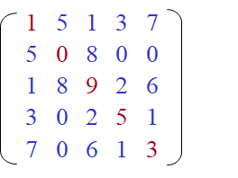

- 下标转换公式

- i >= j，判断为下三角形

  - k = i \* ( i + 1 ) / 2 + j

- i < j ，上三角形
  - k = j \* ( j + 1 ) / 2 + i

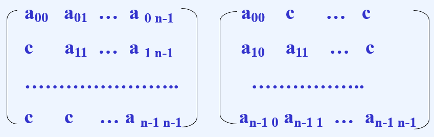

---

3. 稀疏矩阵

- 设矩阵 A 中有 s 个非零元素，若 s 远远小于矩阵元素的总数，则称 A 为稀疏矩阵
- 稀疏矩阵的压缩存储

  - 即只存储稀疏矩阵中的非零元素。有两种存储方法
  - 可以由非零元的三元组及其行列数唯一确定

- 三元表

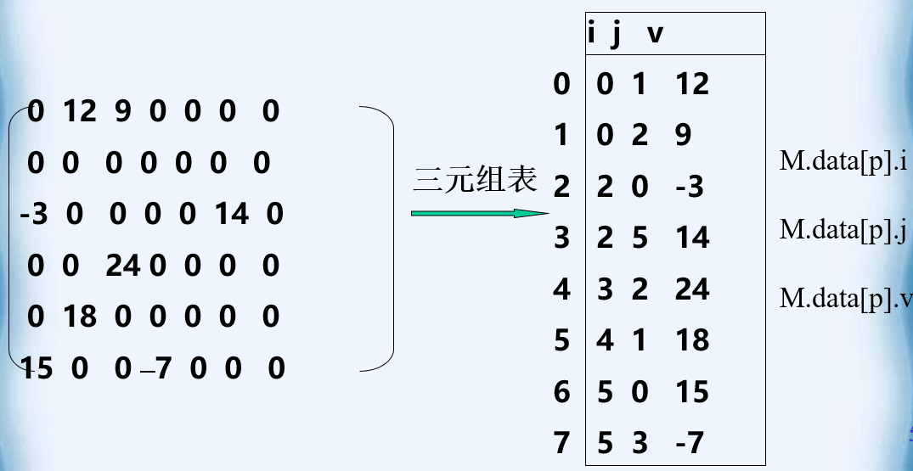

- 置换前和置换后是相反的
- 置换前：
  - 行 列 值
  - 从行的角度扫描，一行一行
- 置换后：
  - 列 行 值
  - 从列的角度扫描，一列一列

```C
// 稀疏矩阵
0 0 2 0
0 3 0 0
0 0 -1 0
0 0 0 1
// 置换前 行/列/值
0 2 2
1 1 3
2 2 -1
3 3 1
// 置换后 列/行/值
1 1 3
2 0 2
2 2 -1
3 3 1
```

---

- 例题
- 100 \* 90 的稀疏矩阵，非 0 有 10 个，每个占 2 个字符，用三元组表示矩阵需要多少个字节？
  - <code>10（10 个非 0 元素）乘（1+1+1）乘  2 个字节 + 3 乘 2（固定的）</code>
  - 结果是 66
- 二维数组 a 每个元素 6 个字符，行下标 0-8，列下标 1-10，存放 a 需要多少字符？
  - <code>6 个字符  * 9（行下标）* 10（列下标）= 540</code>
  - 记住！**计算存放多少字符，如果从 0 开始算需要+1**
  - 而矩形是从 0 开始
- 10 阶对称矩形 A，采用行优先压缩存储 A11 地址为 1，A85
  - A11 + n\*(n+1)/2 + m
  - <code>1+7(7+1)/2+4</code>
  - n：8-1=7。m：5-1=4
  - **矩形是从 0 开始，如果是从 A11 开始则 - 1**
- 下三角矩形 A 1-10 1-10，起始地址为 A11=1000，，每个元素占 2 单元，求 A 8 3
  - <code>1000 + (7(7 + 1)/2 + 2) x 2</code>
  - <code>1000+[i x（i+1）/2+j] x 2</code>
- 求**对称矩形**存储地址
  - 行优先 An\*m
    - $Aij=Loc00+(i*m+j)*d$
  - 列优先 An\*m
    - $Aij=Loc00+(j*n+i)*d$
- 三角形矩阵常数为 0 是，非 0 的元素个数为 **n(n+1)/2**全部都是

---

### 总结

- 基本计算包括，入队、出队、栈空、栈满判断，会写核心代码就行，不需要全写。
- 顺序栈（SeqStack）（S）
  - 顺序栈空和栈满的条件
  - 顺序栈的基本运算
- 链式栈（LinkStack）（LS）
  - 顺序栈空的条件、不考虑栈满
  - 链式栈基本运算
- 队列（SeqQueue）（SQ）
  - 上溢、下溢条件
  - 队列基本运算
- 循环队列（CirQueue）（CQ）
  - 上溢、下溢条件
  - 循环队列基本
- 链式队列（）
  - 空队列的条件、不考虑队列满
  - 链式队列基本运算
- 中、后缀表达式
- 数组
  - 寻址地址计算
- 矩阵
  - 对称矩形元素总数计算
  - 对称矩形存储地址计算包含列和行优先计算
  - 三元表的前后置换

---

## 第四章 树与广义表

### 树

1. 概念

- 是 n(n>=0)个结点的有限集 T，满足：
  - 只有一个特定的称为根的结点
  - 其余的结点可分为 m(m>=0)个互不相交的子集 T1,T2,T3…Tm，其中每个子集 Ti 又是一棵树，并称其为子树
  - **递归是树的固有特性**
- 树的逻辑表示，有四种办法
  - 一般表示法
    - 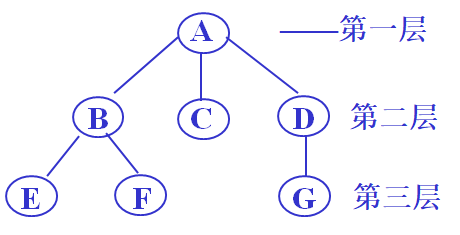
  - 文氏图法
    - 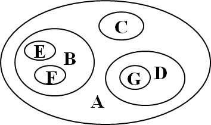
  - 嵌套括号法
    - 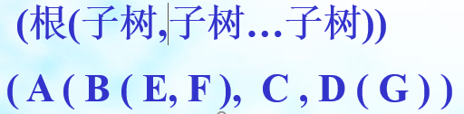
  - 凹入法表示
    - 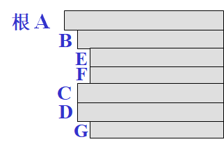

---

2. 基本术语

- **结点**
  - 由一个数据元素及若干指向其它结点的分支所组成
- **度**
  - 树的度：树中结点的度最大值
  - 结点的度：该结点的子树数（即分支数）
- **叶子（终端结点）**
  - 度为零的结点
- **非终端结点**
  - 度不为零的结点
- **孩子（子结点）**
  - 结点的子树的根称为该结点的孩子
- **双亲（父结点）**
  - 一个结点称为该结点所有子树根的双亲
- **祖先**
  - 结点祖先指根到此结点的一条路径上的所有结点
- **子孙**
  - 从某结点到叶结点的分支上的所有结点称为该结点的子孙
- **兄弟**
  - 同一双亲的孩子之间互称兄弟
- **结点的层次**
  - 从根算起，根为第一层，其孩子在第二层, ….， L 层上任何结点的孩子都在 L+1 层上。
- **堂兄弟**
  - 其双亲在同一层的结点
- **树的深度**
  - 树中结点的最大层次
- **有序树**
  - 若树中各结点的子树从左到右是有次序的，不能互换，称为有序树
- **无序树**
  - 若树中各结点的子树是无次序的，可以互换，则成为无序树
- **森林**
  - 是 m（≥0）棵树的集合

```
求根Root(T):求树T的根结点；
求双亲Parent(T,X):求结点X在树T上的双亲；若X是树T的根或X不在T上，则结果为一特殊标志；
求孩子Child(T,X,i):求树T上结点X的第i个孩子结点；若X不在T上或X没有第i个孩子，则结果为一特殊标志；
建树Create(X,T1,…,Tk),k>1:建立一棵以X为根，以T1,…,Tk为第1,…,k棵子树的树；
剪枝Delete(T,X,i):删除树T上结点X的第i棵子树；若T无第i棵子树，则为空操作；
遍历Traverse Tree(T):遍历树，即访问树中每个结点，且每个结点仅被访问一次。
```

---

#### 二叉树

3. 二叉树的概念

- 二叉树是 n(n>=0)个结点的有限集合，它或为空(n=0)，或是由一个根结点及两棵互不相交的左、右子树组成，且每棵子树都是二叉树。
- 特点
  - 二叉树可以是空的，称**空二叉树**
  - 每个结点**最多**只能有两个孩子
  - 子树有左、右之分且**次序不能颠倒**
- 二叉树与树的对比

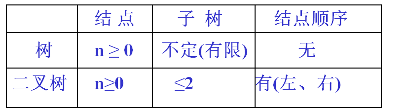

- 性质：

  - 一：**在二叉树的第 i ( i >= 1 )层上最多**有 $2^{i-1}$ 个结点
  - 二：**深度为 k ( k >= 1 )的二叉树最多**有 $2^k－1$个结点。
  - 三：**叶结点数（终端结点） $n_0$= 度为 2 的结点数 $n_2+1$ 。**
  - 四：具有 n 个结点的**完全二叉树的深度**为[log2n]＋ 1
    - 如果是小数则取小，如 n=6，约 2.58....取 2，2+1=3，所以深度是 3
  - 五：对有 n 个结点的完全二叉树的结点按层编号，**这里是从 1 开始**
    - 如果 i = 1，**结点 i 无双亲**，**是根节点**。如果 i > 1，则 i 的双亲 Parent(A)是 **结点[i/2]** 。
    - 如果 2 _ i <= n，\*\*则左孩子是节点 2 _ i\*\* 。否则，节点 i 无左孩子且为叶子结点（终端结点）。
    - 如果 2 _ i + 1 <= n，\*\*则右孩子是节点 2 _ i + 1\*\* 。否则，节点 i 无右孩子。
    - 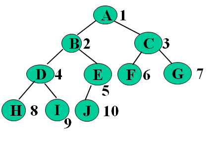
  - **性质五补充**：如果 i 是从 0 开始，则左孩子 2 _ i + 1。右孩子 2 _ i + 2。加一，以此类推
    - 从 1 开始的话，左孩子是 2i，右孩子是 2i+1

- **满二叉树结点数计算**（通过深度计算）

  - 根据第三性质得出：深度为 k ( k >= 1 )且有$2^k-1$个结点的二叉树
  - 因为是满二叉树，所以可以通过深度获取到他的结点树

- **完全二叉树，深度为 K， K-1 层结点数 = **$2^{k-2}$。

---

4. 二叉树基本操作

```
初始化Initiate(BT)：建立一棵空二叉树，BT=∅。
求双亲Parent(BT,X)：求出二叉树BT上结点X的双亲结点，若X是BT的根或X根本不是BT上的结点，运算结果为NULL。
求左孩子Lchild(BT,X)和求右孩子Rchild(BT,X)：分别求出二叉树BT上结点X的左、右孩子；若X为BT的叶子或X补在BT上，运算结果为NULL。
建二叉树Create(BT)：建立一棵二叉树BT。

先序遍历PreOrder(BT)：按先序对二叉树BT进行遍历，每个结点被访问一次且仅被访问一次，若BT为空，则运算为空操作。
中序遍历InOrder(BT)：按中序对二叉树BT进行遍历，每个结点被访问一次且仅被访问一次，若BT为空，则运算为空操作。
后序遍历PreOrder(BT)：按后序对二叉树BT进行遍历，每个结点被访问一次且仅被访问一次，若BT为空，则运算为空操作。
层次遍历LevelOrder(BT)：按层从上往下，同一层中结点按从左往右的顺序，对二叉树进行遍历，每个结点被访问一次且仅被访问一次，若BT为空，则运算为空操作。
```

---

5. 二叉树存储结构

- 用一组连续的存储单元存储二叉树的数据元素
- **二叉树的顺序存储结构**
  - 对二叉树按完全二叉树进行编号，然后用一维数组存储，其中编号为 i 的结点存储在数组中下标为 i 的分量中，该方法称为 **以编号为地址** 策略
  - 缺点是，不能经常插入删除树的结点
  - 用于完全二叉树，节省内存，结点位置确定方便

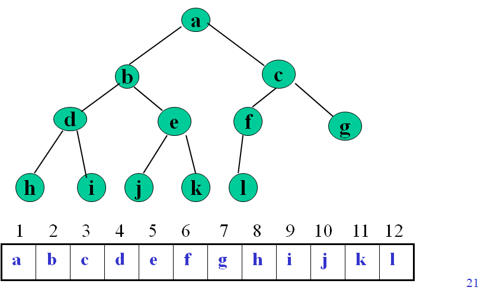

#### 二叉树遍历

- 二叉树的链式存储结构
- 左指针指向左孩子，右指针指向右孩子
- **n 个节点的二叉链表，有 2n 个指针域，n-1 个指向节点的左右孩子，n+1 个空链域**
- 类型定义

```C
typedef struct btnode  {
  Datatype data;
  struct btnode *lchild,*rchild;
}*Bintree;
// 二叉链表类型
```

- 遍历二叉树
  - 是指按一定规律对二叉树中的每个结点访问且仅访问一次——即访遍树中每一结点（只一次），打印或处理结点
- 先序遍历，DLR
  - 如果为空就退出
  - 第一步，访问根节点
  - 第二步，根的左子树
  - 第三步，根的右子树

```C
void preorder ( bitreptr  r ){
  /*先序遍历以r为根的二叉树*/
  if (r==NULL)  return;
  printf ( r->data ) ;     /*访问根结点*/
  preorder ( r->lchild ) ；
  preorder ( r->rchild ) ;
  /*先序遍历以r的右孩子为根的右子树*/
};
```

- 中序遍历，LDR

```C
void preorder ( bitreptr  r ){
  if (r==NULL)  return;
  preorder ( r->lchild ) ；
  printf ( r->data ) ;     /*访问根结点*/
  preorder ( r->rchild ) ;
};
```

- 后序遍历，LRD

```C
void preorder ( bitreptr  r ){
  if (r==NULL)  return;
  preorder ( r->lchild ) ；
  preorder ( r->rchild ) ;
  printf ( r->data ) ;     /*访问根结点*/
};
```

- 总结：
  - 先序遍历，特点是先输出根节点，然后看看根节点有没有左孩子，如果有，先输出。然后在看有没有左孩子的左孩子，**先把左孩子输出完毕在看右孩子**。
    - 第一步：先从输出根节点
    - 第二步：从根节点开始，先输出最左边开始遇到一个输出一个（A→B→XX），然后发现 XX 节点没有左右节点，就从 B 开始遍历右边。
    - 第三步：发现 B 节点的右孩子 D，直接输出 D（A →B→XX→D）
    - 第四步：发现 D 有左孩子，那就先遍历左孩子，以此类推
  - 中序遍历，特点是先遍历左孩子，然后在输出根，然后在去遍历右孩子。
    - A→B→XX（输出）→B（输出）→D→F（输出）→D（输出）→G（输出）→A（输出）
    - C（输出）E（输出）G（输出）
    - 结果：XX B F D G A C E G
  - 后序遍历，先遍历左孩子，然后在遍历右孩子，然后输出。
    - A→B→XX（输出）→D→F（输出）→G（输出）→D（输出）→B（输出）。左边遍历完了
    - H 输出 →E 输出 →C 输出 →A 输出
    - 结果就是：XX F G D B H E C A

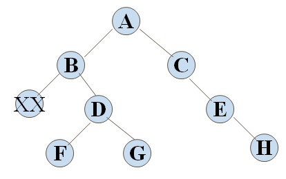

- 二叉树层次遍历
  - **从二叉树的根结点的这一层开始，逐层向下遍历，在每一层上按从左到右的顺序对结点逐个访问**
  - ABCDEFH，这样按照顺序
  - 第一步：将根节点插入队列
  - 第二步：从队列中删除一个结点，访问该结点，并将该结点的孩子（若有的话）插入队列
  - 第三步：若此时队列非空，再从队列中删除一个结点，访问该结点，并将它的孩子结点插入队列。依次重复进行，直到队列为空。

```C
Void levelorder(BinTree bt)
{
  LkQue Q;
  InitQueue(&Q);
  if (bt!=NULL)
  {
    // 第一步，根节点入队
    EnQueue(&Q,bt);
    while (!EmptyQueue(Q))
    {
      // 获取队列中的一个节点
      p=Gethead(&Q);
      // 删除这个节点
      outQueue(&Q);
      visit(p);
      // 将该节点的左孩子插入队列中
      if (p->lchild!NULL) EnQueue(&Q,p->lchild);
      // 将该节点的右孩子插入队列中
      if (p->rchild!NULL) EnQueue(&Q,p->rchild);
    }
  }
}
```

---

6. 二叉树的应用

- 叶子节点个数（终端结点）
  - 思维：
    - 第一步：如果该节点不存在就返回 0
    - 第二步：如果他没有左右孩子则返回 1（就说明他就是我们要找的**叶子结点**）。
    - 第三步：递归遍历左子树，然后在递归遍历右子树，将两者的和返回

```C
int leafcount (bitreptr  bt ) {
  /*求二叉树bt中叶结点的数目*/
  if ( bt == NULL ) return (0) ;
  else
    if ( bt->lchild == NULL && bt->rchild == NULL )
       return (1) ;
     else {
       n = leafcount( bt->lchild );    /* 求左子树的叶子数目*/
       m = leafcount( bt->rchild );    /* 求右子树的叶子数目*/
       return (m+n);
     }
}
```

- 度为 1 的结点个数
  - 思维：
    - 第一步：如果该节点不存在就返回 0
    - 第二步：如果一个节点**有左孩子没右孩子**，或**没左孩子有右孩子**。则继续递归遍历，但是在递归的时候需要 + 1。计作存在
    - 第三步：如果不存在我们找的，继续递归。

```C
int onesoncount(bitreptr t)
/*输出二叉树t中度为1的结点值，并求其个数*/
{
  if (t==NULL)
    return(0);
  else
    if  ((t->lchild==NULL && t->rchild!=NULL) ||(t->lchild!=NULL && t->rchild==NULL))
    {
      printf(t->data);
      // 注意！这里记得 + 1
      return(onesoncount(t->lchild)+onesoncount(t->rchild)+1);
    }
  else  return(onesoncount(t->lchild) + onesoncount(t->rchild));
}
```

- 度为 2 的结点个数
  - 思维：
    - 和上一个很像

```C
int twoson(bitreptr BT)
/*输出二叉树BT中所有度为2的结点的数据域值，并统计其数目*/
{
  if (BT==NULL)
    return(0);
  else if ((BT->lchild==NULL) ||(BT->rchild==NULL))
  {
    return(twoson(BT->lchild) + twoson(BT->rchild));
  }
  else if (BT->lchild!=NULL && BT->rchild!=NULL)
  {
    return(twoson(BT->lchild) + twoson(BT->rchild) + 1);
  }
}
```

- 非终端结点个数

```C
int notleafcount (bitreptr bt )
      /*求二叉树bt中非叶结点的数目*/
{
  if ( bt == NULL )
    return (0) ;
  else if ( bt->lchild == NULL && bt->rchild == NULL )
      return (0) ;          /*无左右子树*/
  else {
    printf(bt->data);       /* 输出非终端结点值*/
    n = notleafcount( bt->lchild ) ;
    /* 求左子树的非终端结点数目*/
    m = notleafcount(bt->rchild) ;
    return (m+n+1) ;   /* 返回总的非终端结点数*/
  }
}
```

- 所有节点的个数

```C
int  f5 (bitreptr bt )
/* 打印出二叉树t中所有结点的值，并统计结点的个数 */
{
  if ( bt == NULL )
    return (0) ;
  else
  {
    printf(bt->data);       /* 输出结点值*/
    n = f5( bt->lchild); /* 求左子树的结点数目*/
    m = f5( bt->rchild); /* 求右子树的结点数目*/
    return (m+n+1) ;   /* 返回总的结点数*/
   }
}
```

- 二叉树存储结构采用二叉链表表示，每个节点的数据域存放一个整数，求数据域的值为 8 的结点个数

```C
int  f6 (bitreptr  bt )
/*求二叉树bt结点数据域值为８的结点的数目*/
{
  if ( bt == NULL )
    return (0) ;
   else
     if (bt->data == 8)
       return(f6(bt->lchild)+f6(bt->rchild)+1);
  else
    return(f6(bt->lchild)+f6(bt->rchild));
}
```

---

#### 树的存储结构

- 双亲链表类型定义

```C
#define   size  10
typedef  struct
{
  datatype data;
  int  parent;
} Node;
Node slist[size];
```

- **双亲表示法**
  - 数据域和双亲域，双亲域是存放结点在数组中的编号

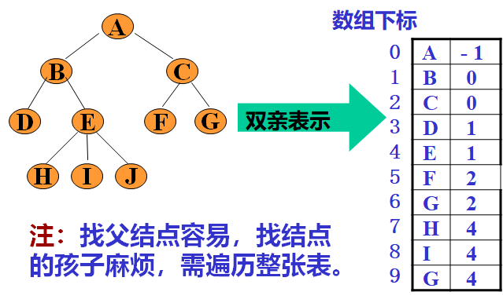

- **孩子链表表示法**
  - 树中每个节点的孩子串成一单链表，**孩子链表**
  - n 个节点，n 个孩子链表


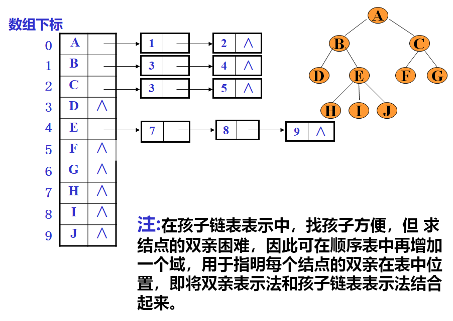

- **双亲孩子表示法**
  - 同时用一维数组顺序存储树中的各结点，数组元素除了包括结点本身的信息和该结点的孩子链表的头指针之外，还增设一个域，用来**存储结点双亲结点在数组中的序号**。

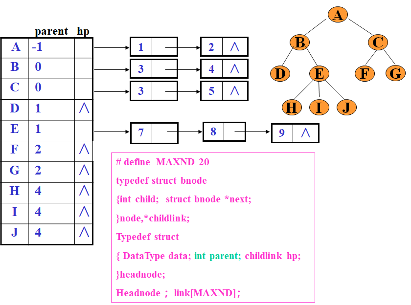

- **孩子兄弟链表表示，二叉链表表示**


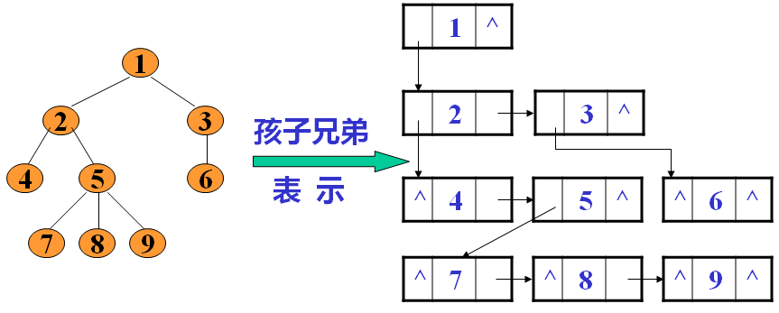

---

#### 树、森林与二叉树的转换

- 各兄弟之间加连线
- 对任一结点，除**最左孩子外**，抹掉该结点与其余孩子的各枝
- 以根为轴心，将连线顺时针转 450

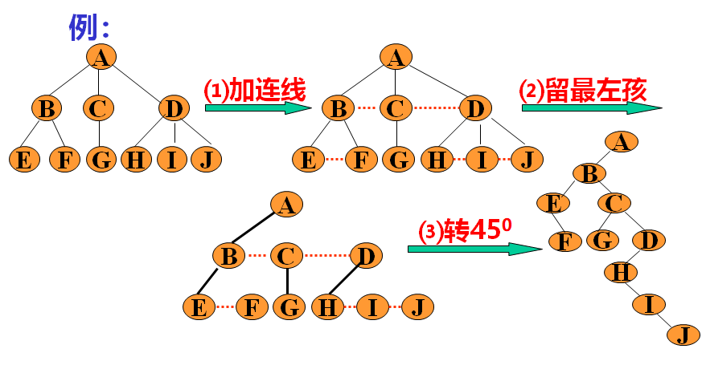

- **森林转二叉树**
  - 森林的一个结点，如果只有一个孩子，则作为**左孩子**。如果有多个，则作为**该左孩子的右孩子**。

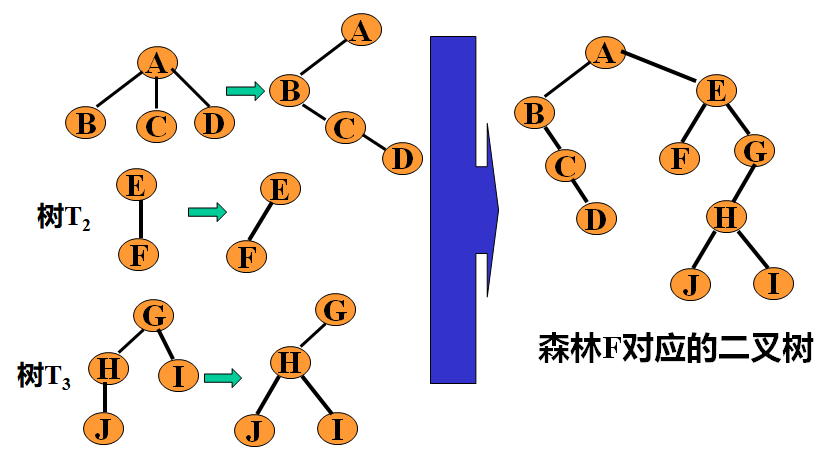

- 二叉树转森林

  - 逆向思维，同理
  - 如果**根无右孩子的二叉树可以转变成一般树**

- 树的遍历
- 注意，树的**后序遍历**=二叉树的**中序遍历**，先序对先序
  - 先序遍历
    - 先访问根结点，然后依次先序遍历根的每棵子树
  - 后序遍历
    - 先依次后序遍历每棵子树，最后访问根结点
    - 和二叉树差不多，这样理解：**先遍历左孩子，然后在遍历右孩子，右孩子可以有多个**。这样理解就好理解多了。
  - 层次遍历
    - 懂的都懂

---

#### 哈夫曼树

- **结点数为：2n-1**
- **带权路径长度**

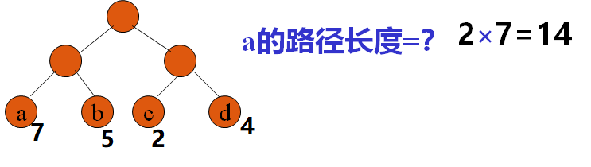

- WPL = $∑(p_k×l_k)$
  - n = 叶子数。$p_k$ = 第 k 个叶子的权。 $l_k$ = 从根到第 k 个叶子的路径长度（分支数）
  - WPL 其实就是计算每个叶子的路径长度，将他们相加，结果就是 WPL

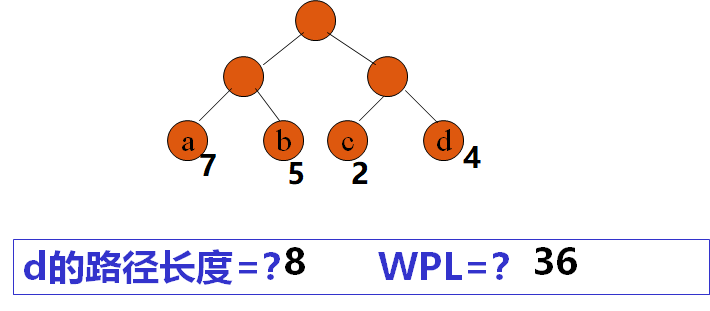

- 带权路径长最小的二叉树
- 特性是：

  - 权大的叶子离根近
  - 权小的叶子离根远

- 哈夫曼算法
- 开始有 n 颗二叉树，每棵树只有一个独立的结点（刚开始的样子 2 4 5 7）
- 要进行 n - 1 次合并后才能得到哈夫曼树
- 最终有 2n - 1 个节点
  - F = { 7, 5, 2, 4 }
  - 初始：给权值排个序，从小到大
    - F = { 2, 4, 5, 7 }
  - 第一步：取权最小的 2 个，生成一个二叉树，插入到树中
    - 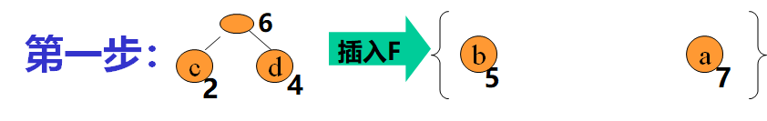
  - 第二步：将第一步生成的树插入，剩下重复
    - 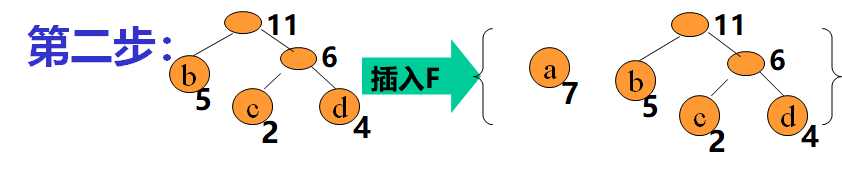
    - 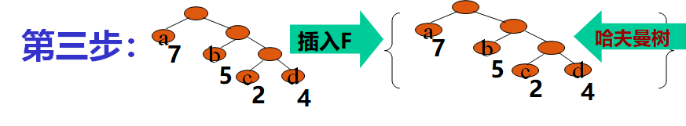

> 例题：**如何变成哈夫曼树**，50,10,16,8,12
>
> - 第一步：8 和 10 最小，那么变成一棵树
>   - 18,12,16,50
> - 第二步：12 和 16 最小
>   - 18,28，50
> - 第三步：18 和 28 最小
>   - 46,50
> - 以此类推，很简单的。
>
> 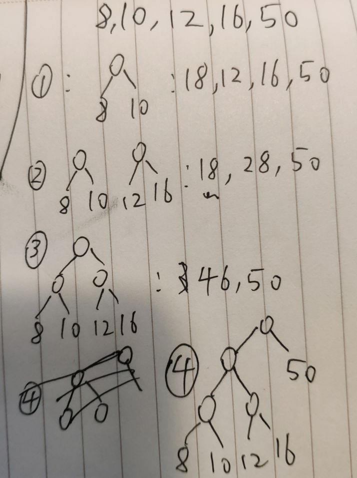

- **哈夫曼编码**
- 每个字符在电文中出现的次数为 $w_i$ ，其编码长为 $m_i$ ，电文有 n 种字符，则电文总长=?
- $∑(w_i × m_i)$
- 做法
  - 以 n 个字符的权值，构造哈夫曼树
  - 求 n 个字符的哈夫曼编码
  - **左子树表示 0 。右子树表示 1 。**
- 具体实现
  - **CAST└┘TAT└┘A└┘SA**
  - C 出现 1 次，A 出现 4 次，S 出现 2 次，T 出现 3 次，└┘ 出现 3 次
  - 因此 C=1；A=4；S=2；T=3；└┘=3；
  - 然后构建一个哈夫曼树

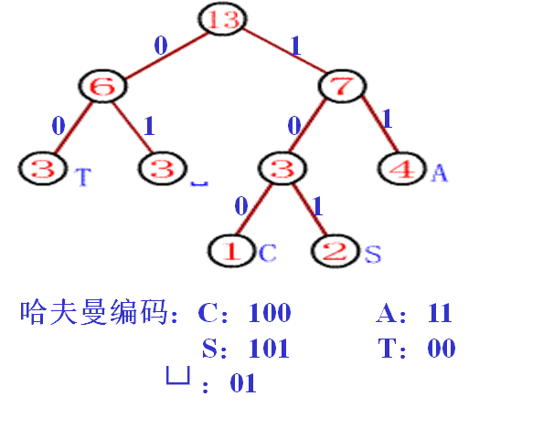

---

### 广义表

- LS=( **a** ,(b,c),(d,e.f),g)

  - Head(LS)= **a**
  - Tail(LS) == ( **(b,c)** ,(d,e,f),g)
  - Head(Tail(LS)) = **b,c**
  - Depth(LS)= **2**
  - length(LS) = **4**

- LS1=(a,(b,(c)))
  - Depth(LS1)=3
- LS2=(a,(b,(c)),LS2)

  - Depth(LS2)=无穷--

- 最后需要靠 head 选择

---

### 线索二叉树

- **n 个的线索二叉树上线索数为 n+1**
  - **n 个结点的二叉链表必定存在 n+1 个空指针域**
- **二叉树的线索化**

  - 一般会给你前中后序的**遍历方式**
  - 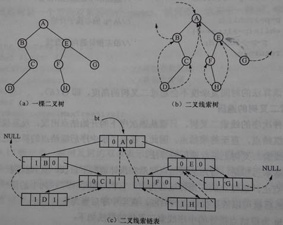

- **索链表**
  - 1：不存在
  - 0：表示存在
  - **前驱表示左孩子，后继表示右孩子**
- **画线索树**
  - 第一步：**先把遍历结果写出来**
    - BDCAFHEG
  - 第二步：**根据遍历的顺序画图，只画 1 的索引**
    - 什么是只画 1 的索引呢？
      - **例如节点 B：前驱为 1，后继为 0，那么只画前驱的**
    - **根据 BDCAFHEG 画**
    - B：左边**没有**（指 NULL），右边**为 0 不管**
    - D：左边是 B（**指向 B**），右边是 C（指向 C）
    - C：左边**为 0 不管**，右边是 A（就指向 A）

---

- 含 10 个节点的二叉排序树，是完全二叉树，平均查找长度 ASL
  - (1 + 2x 第 2 层结点数 + 3x2x 第 2 层结点数)/结点数 10=2.9
- P76：用存储方法和链式存储方法画出图中二叉树的存储结构（记住！）
- 高度为 8 的完全二叉树，第 8 层有 8 个节点，那么叶子结点一共有多少个？
  - 68
- P76：第四题，根据二叉树画出森林（重要！！）

---

### 总结

- **二叉树**
  - 节点计算，5 个性质
  - 二叉树的前中后序遍历
  - **线索二叉树的画法，和索链表**
- **树的 3 个存储结构**
  - 双亲表示法
  - 孩子链表表示法
  - 孩子兄弟表示
- **哈夫曼**
  - 哈夫曼树怎么画？还有哈夫曼编码怎么写
  - **大的在左子树，小的在右子树！！！！**
  - **WPL 的计算，全部相加**

---

---

## 第五章 图

1. 概念

- 概念
  - 图 G 是由集合 V 和 E 组成，记成 G=（V，E）
  - V：顶点集（非空）
  - E：边集（可空）
- 有向图
  - 边是顶点的有序对的图
  - **图中每条边都用箭头指明了方向**
  - 最多 n ( n - 1 ) 条边同时也是**有向完全图**
  - 最少 n 条边
- 无向图
  - 边是顶点的无序对的图
  - 最多 n ( n - 1 ) / 2 条边同时也是**无向完全图**
  - 最少 n - 1 条边
- **要保持非连通状态**边需要 + 1（！！重要！！）

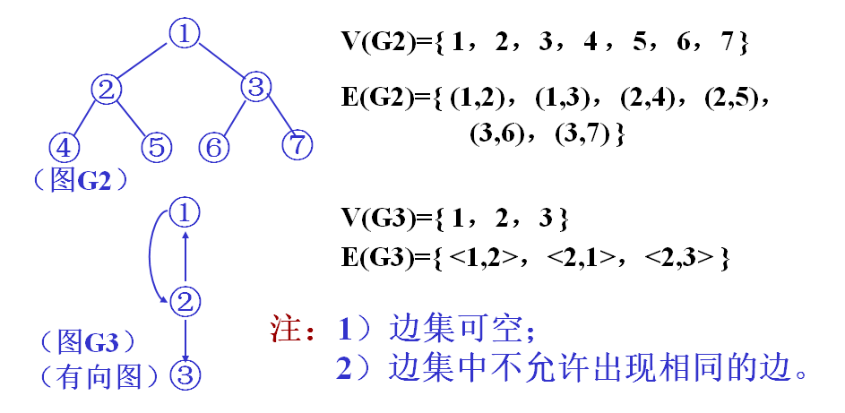

---

2. 基本术语

- **顶点**
  - 图中的数据元素
- **$<V_i | V_j>$**
  - 顶点 Vi 到顶点 Vj 的边，称为弧
  - Vi ：弧尾，初始端，无箭头端
  - Vj：弧头，终端点，有箭头端
- **完全图**，顶点数 n

  - 无向完全图：边数 = n \* ( n - 1) / 2
  - 有向完全图：边数 = n \* ( n - 1)

- **权**
  - 与图中的边相关的数
- **邻接**
  - 若( Vi , Vj )∈E(G)，则称 Vi 和 Vj 互为邻接点
- **关联**
  - 若( Vi , Vj )∈E(G)，则称边(Vi,Vj)关联于顶点 Vi 和 Vj
- **邻接是指顶点之间的关系，而关联是指边与顶点间的关系**
- **若弧< Vi , Vj >∈E(G)，则称 Vj 是 Vi 的邻接点**
- **度**
  - 无向图：顶点 Vi 的度 = 与 Vi 相关联的边的个数（ D(Vi) ）
  - 有向图
    - 出度：顶点 Vi 的出度为以 Vi 为尾的出边数（ $OD(V_i)$ ）
    - 入读：顶点 Vi 的入度为以 Vi 为头的入边数（ $ID(V_i)$ ）
    - 度：有向图的度=入度+出度（ $D(V_i)$ ）
    - $D(V_i)$ = $OD(V_i)$ + $ID(V_i)$
- 注意：一边带二度，二度组成一个边
  - 例如：{ (1,2) (2,1) }
  - 这就是一条边，两个度
- **路径**
  - 顶点 Vp 至顶点 Vq 的路径是顶点序列
  - 有向图：边(Vp,Vi1),(Vi1,Vi2),…,(Vin,Vq)∈VR(G);
  - 无向图：弧<Vp,Vi1>,<Vi1,Vi2>,…,<Vin,Vq>∈VR(G);
- **路径长度**
  - 路径上边或弧的数目
- **简单路径**
  - 除第一个和最后一个外，其余各顶点均不相同的路径
- **回路**
  - 第一个和最后一个顶点相同的路径，也称环
- **简单回路**
  - 第一个和最后一个顶点相同的简单路径
- **回路中可以有多个圈，而简单回路只能有一个圈**
- **生成树**
  - 含有该连通图的全部顶点的一个极小连通子图
  - 一：如果连通图 G 顶点个数为 n，则 G 的生成树的边数为 n - 1
  - 二：G 的子图 G' 边数大于 n - 1，则 G' 一定有环
  - 二：G 的子图 G' 边数小于 n - 1，则 G' 一定有不连通
- 生成森林
  - 在非连通图中，每个连通分量都可得到一个极小连通子图，也就是生成树。这些生成树就组成了一个非连通图的生成森林
- **连通**
  - 无向图中，若从顶点 Vi 到 Vj 顶点有路径，则称 Vi 和 Vj 是连通的。

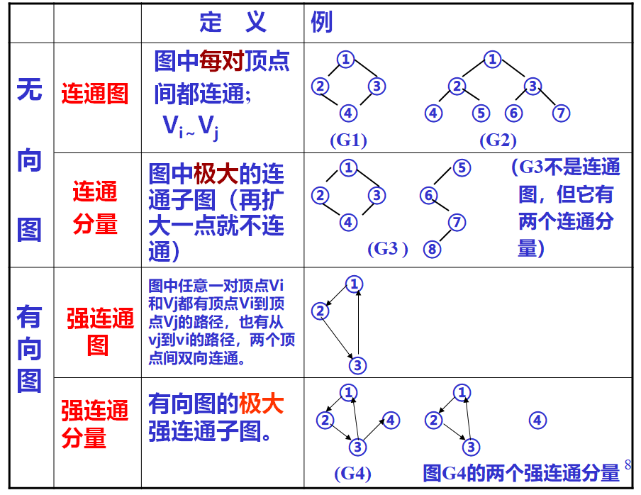

---

3. 基本运算

```
建立图：GreateGraph(G,V,E)
取顶点信息：Getvex(G,u)
取边信息：Getarc(G,u,v)
查询第一个邻接点：FirstVex(G,u)
查询下一个邻接点：NextVex(G,u,v)
插入顶点：InsertVex(G,v)
删除顶点：DeleteVex(G,v)
插入边：InsertArc(G,v,w)
删除边：DeleteArc(G,v,w)
遍历图：Travers(G,tag)
```

---

### 邻接矩阵

4. 图的存储结构

- 图的邻接矩阵
  - **表示图的各顶点之间关系的矩阵**
- 图的邻接矩阵的定义
  - 设 G=(V,E)是 n 个顶点的图，则 G 的邻接矩阵为下列 n 阶方阵

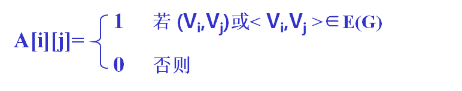

- **一、图的邻接矩阵表示法**
- 无向图的邻接矩阵是**对称的**
  - 从邻接矩阵容易判断任意两顶点间是否有边相联；
  - 容易求出各顶点的度
- 无向图
  - 顶点 Vi 的 度 D(Vi) = **矩阵中第 i 行的 1 总和**
- 有向图
  - OD(Vi) = **矩阵中第 i 行的 1 总和**
  - ID(Vi) = **矩阵中第 i 列的 1 总和**
  - 相加就是有向图的度总和

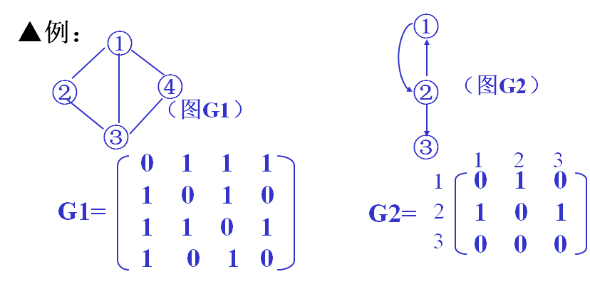

- **二、带权图（网）的邻接矩阵**

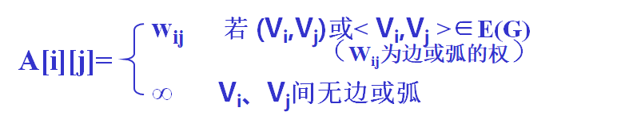

- 邻接矩阵的类型定义

```C
Const int vnum=20;
Typedef struct gp
{
  VertexType vexs[vnum];    //顶点信息
	int arcs[vnum][vnum];    //邻接矩阵
	int vexnum,arcnum;    //顶点数，边数
}Graph;
```

- **建立无向带权邻接矩阵**
  - 将矩阵 A 的每个元素都初始化为最大值
  - 然后读入边和权值（i，j，Wij），将 A 的相应元素设为 Wij

```C
Void CreatGraph(Graph *g)
{
  int i,j,n,e,w;
	char  ch;
  scanf(“%d  %d”,&n,&e);
  g->vexnum=n;
  g->arcnum=e;
  for (i=0;i<g->vexnum;i++)
  {
    scanf(“%c”,&ch);
    g->vexs[i]=ch;}
  for (i=0;i<g->vexnum;i++)
    for (j=0;j<g->vexnum;j++)
      g->arcs[i][j]=MAX_INT;
  		for (k=0;k<g->arcnum;k++)
      {
        scanf(“%d  %d  %d”,&i, &j,&w);
        g->arcs[i][j]=w;
        g->arcs[j][i]=w;
      }
	}
}
```

---

### 邻接表

- 定义
  - 对图 G 中每个顶点都建立一个单链表，第 i 个单链表（称边表）链接图中与顶点 Vi 相邻接的所有顶点

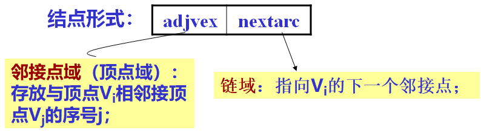

- 每个链表均设一表头结点（以向量存储，称顶点表）
- V [ i ]
  - **第 i 个链表的表头结点**
- V [ i ].vertex
  - 存放顶点 V i 的信息
- V [ i ].firstarc
  - 指向 V i 的邻接链表的第一个结点


- **邻接表总结！死记！**
- 一：
  - **n 个顶点**、**e 条边**的无向图，则其邻接表的表头结点数为 n，**链表结点总数为 2e**
- 二：
  - 链表看下面，有图
  - 对于**无向图，第 i 个链表的结点数为顶点 Vi 的度**
  - 对于**有向图，第 i 个链表的结点数为顶点 Vi 的出度**，如果求入读，需要遍历邻接表。在单链表中，邻接点域的值为 i 的**结点个数**是**顶点 Vi 的入度。**
- 三
  - 在边稀疏时，邻接表比邻接矩阵省单元
- 四：

  - 邻接表表示在检测边数方面比邻接矩阵表示效率要高

- 链表限量
- 如何计算图的度？
  - 对于无向图，第 i 个链表的结点数为顶点 Vi 的度

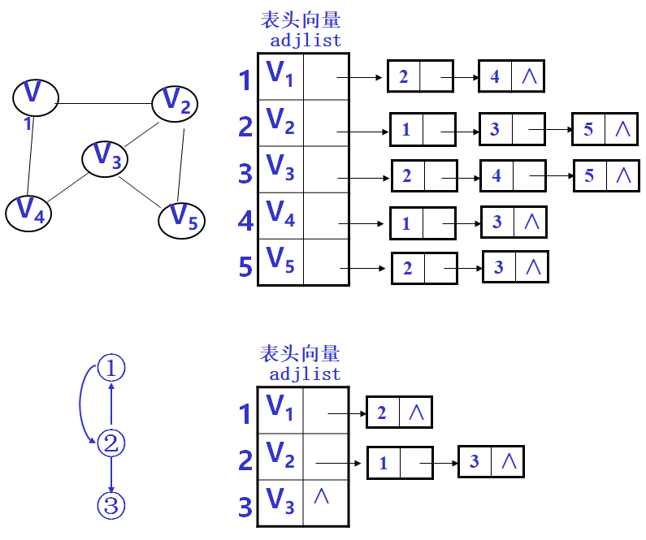

- 类型定义

```C
#define vnum 20
Typedef struct arcnode
   {  int  adjvex;                     //下一条边的顶点编号
       WeightType  weight;     //带权图的权值域
       struct arcnode  *nextarc；//指向下一条边的指针
    }ArcNode;
Typedef struct vexnode
    {  int vertex;                      //顶点编号
        ArcNode *firstarc;        //指向第一条边的指针
     }AdjList[vnum];
Typedef  struct gp
     {  AdjList  adjlist;
         int  vexnum,arcnum;   //顶点和边的个数
      }Graph;
```

- 带权图邻接表


- 建立有向图的邻接表的方法：
  - 将邻接表表头数组初始化;
  - 第 i 个表头的 vertex 域初始化为 i；
  - first 域初始化为 NULL;
  - 读入顶点对<i,j>,产生一个表结点；
  - 将 j 放入到该结点的 adjvex 域；
  - 将该结点链到邻接表的表头数组的第 i 个元素的 first 域上。

> 例题：
>
> 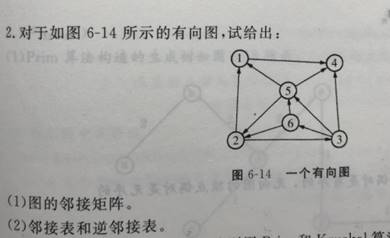
>
> 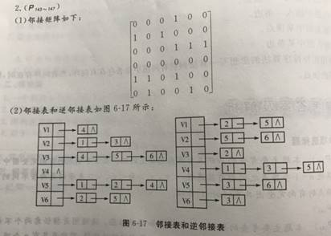

---

### 图的遍历

1. 定义

- 从图 G 中某一顶点 v 出发，顺序访问各顶点一次
- 方法：
  - 为克服顶点的重复访问，设立辅助数组 visited[n]
  - 返回 1，表示已经访问过
  - 返回 0，表示未被访问过
- 深度优先搜索和广度优先搜索

2. 深度优先搜索法 （DFS）

- 从图 G(V,E)中任一顶点 Vi 开始，首先访问 Vi ，然后访问 Vi 的任一未访问过的邻接点 Vj ，再以 Vj 为新的出发点继续进行深度优先搜索，直到所有顶点都被访问过。

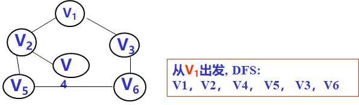

- 算法分析
  - 为克服顶点的重复访问，设立一标志向量 visited [n];
  - 图可用邻接矩阵或邻接表表示
  - DFS 规则具有递归性，故需用到栈
- 搜索到达某个顶点时(图中仍有顶点未被访问)，如果这个顶点的所有邻接点都被访问过，那么搜索就要回到前一个被访问过的顶点，再从该顶点的下一未被访问的邻接点开始深度优先搜索。
- 深度搜索的顶点的访问序列不是唯一的

2. 深度优先遍历图，邻接表

```C
void  Dfs (  Graph g , int  v  )  {
//从第v个顶点出发递归地深度优先遍历图g，图以邻接表作为存储结构
  ArcNode  *p  ;
  printf ( “%d”,v ) ;  /* 访问起始顶点v*/
  visited [v] = 1;         /* 置“已访问”标记*/
  p = g.adjlist[v].firstarc ; /* 取顶点表中v的边表头指针*/
  while  ( p != NULL )    /* 依次搜索v的邻接点*/
   {
    if ( ! visited[p->adjvex] )  /*v的一个邻接点未被访问*/
      Dfs ( g,p->adjvex ) ; /*沿此邻接点出发继续DFS*/
      p = p->nextarc ;   /* 取v的下一个邻接点*/
   }
}
```

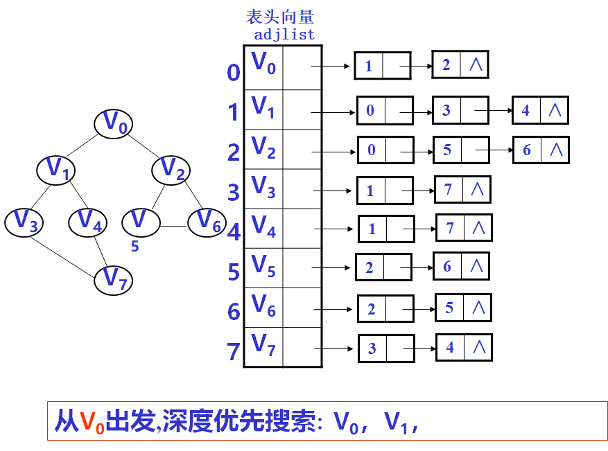

- 深度优先遍历图，邻接矩阵

```C
void  Dfs (  Graph g , int  v  )  {
//从第v个顶点出发递归地深度优先遍历图g，图以邻接矩阵作为存储结构
  int j  ;
  printf ( “%d”,v ) ;       /* 访问起始顶点v*/
  visited [v] = 1;         /* 置“已访问”标记*/
  for (j=0;j<n;j++)   /* n为顶点数，j为顶点编号*/
  {
    m=g->arcs[v][j];  /*顺序访问矩阵的第v行结点*/
    if （m&&!visited[j]）  /*如果v与j邻接，且j未被访问*/
      Dfs ( g,j ) ; /*递归访问j*/
  }
}
```

3. 广度优先搜索法（BFS）

- 从图 G(V,E)中某一点 Vi 出发，首先访问 Vi 的所有邻接点（w1，w2，…，wt），然后再顺序访问 w1，w2，…，wt 的 所有未被访问过的邻接点…., 此过程直到所有顶点都被访问过。
- 算法分析
  - 为克服顶点的重复访问，设立一标志向量 visited [n];
  - 图可用邻接矩阵或邻接表表示
  - 顶点的处理次序——先进先出，故需用到一队列
- 基本思想
  - 所有结点标记置为“未被访问”标志
  - 访问起始顶点，同时置起始顶点“已访问”标记
  - 将起始顶点进队列
  - 当队列不为空时重复执行以下步骤：
    - 取当前队头顶点
    - 对与队头顶点相邻接的所有未被访问过的顶点依次做：
      - 访问该顶点
      - 置该顶点为“已访问”标记,并将它进队列
    - 当前队头元素顶点出队
    - 重复进行，直到队空时结束

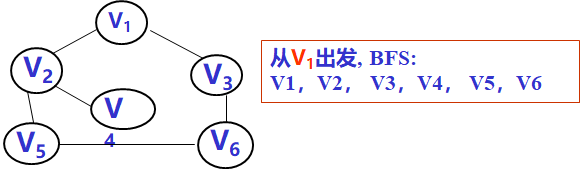

```C
int  visited[N]=0 ;    /*对访问标记visited数组初始化*/
int  queue[N]  ;    /*队列queue存放已访问过的顶点*/
```

- 广度优先遍历图，邻接表

```C
void bfs (Graph g , int  v )  {
// 从顶点v出发，按广度优先遍历图g，图用邻接表表示
  printf(“%d”,v );
  visited [v] = 1;  /*访问初始顶点vi*/
  rear=1;  front=0;
  queue[rear]=v ;    /* 起始顶点（序号）入队*/
  while ( front!=rear )   /*队列不空，则循环*/
  {
    front=(front+1)%N ;   /*置队头*/
    v=queue[front];   /* 队头元素出队*/
    p=g.adjlist[v].firstarc; /*取刚出队顶点v的边表的头指针*/
    while ( p!=NULL )  {  /* 依次搜索v的邻接点*/
    {
      if (! visited[p->adjvex])   /*v的一个邻接点未被访问*/
      {
        printf (“%d”,p->adjvex)  /*访问此邻接点*/
        visited[p->adjvex] = 1 ;
        rear=(rear+1)%N ; /*队尾指针增1*/
       queue[rear]=p->adjvex; /*访问过的顶点入队*/
      }
      p=p->nextarc;
    }  /* 找v的下一个邻接点*/
  }
}/*bfs*/
```


- 广度优先遍历，邻接矩阵

```C
Bfs (Graph g, int v)
{
  LkQue Q;                   //Q为链队列
  int j;
  InitQueue(&Q);
  printf(“%d”,v);             //v为访问的起始结点
  visited[v]=1;                  //访问过的标志
  EnQueue(&Q,v);
  while ( !EmptyQueue(Q))                 //判队列是否为空
  {
    v=Gethead(&Q);
    OutQueue(&Q);                    //出队列
    for (j=0;j<n;j++)          //n为顶点数，变化j依次尝试v的可能邻接点
    {
      m=g->arcs[v][j];
      if (m && !visited[j])            //判断是否邻接点，且未被访问
      {
        printf(“%d”,j);
        visited[j]=1;             //置被访问标志
        EnQueue(&Q,j);          //邻接点入队列
      }
    }
  }
}

```

---

4. 判断图的连通性

- 对图 G 调用一次 DFS 或 BFS，得到一顶点集合，然后将之与 V(G)比较，若两集合相等，则图 G 是连通图，否则就说明有未访问过的顶点，因此图不连通

5. 求图的连通分量

- 从无向图的每个连通分量的一个顶点出发遍历，则可求得无向图的所有连通分量

```C
void trace( Graph G ) {
  /*G为用邻接矩阵或邻接表表示的有n个顶点的无向图，求该图的连通分量*/
  int i;
  for ( i=0; i<N; ++i )
    if (!flag[i])
    {
      dfs(i);
      /*调用DFS算法的次数仅决定于连通分量个数*/
      OUTPUT ；/*输出访问到的顶点和依附于这*/
             /*些顶点的边，就得到一个连通分量*/
    }
}/*trace*/
```

---

### 最小生成树

- 问题提出
  - 网中 n 个顶点——n 个城市
  - 两顶点间的边——两城市间线路
  - 边的权——架设相应线路的费用
- 问题一：n 个城市间的通讯网，**至少**要多少条线路？
  - n - 1
- 问题二：**选择怎样的 n-1 条线路，使总费用最少？**
  - 取 n-1 条边，并使**边权总和为最少**，最小生成树问题

1. 最小生成树的定义

- 给定一个带权图，构造带权图的一棵生成树，使树中所有边的权总和为最小

2. 最小生成树的构造算法

- Prim 算法和 kruskal 算法

---

#### Prim

- **适合于求边稠密的带权图的最小生成树**
- 基本思想：
  - 假设 G=(V,E)是一个无向带权图，生成的最小生成树为 MinT=(V,T),其中 V 为顶点的集合，T 为边的集合。求 T 的步骤如下
  - 第一步：初始化 U={u0}，T={ }；其中 U 为一个新设置的顶点的集合，初始 U 中只含有顶点 u0，这里假设在构造最小生成树时，从顶点 u0 出发
  - 第二步：对所有 u∈U，v∈V-U(其中 u，v 表示顶点)的边(u,v)中，找一条权最小的边(u’,v’)，将这条边加入到集合 T 中，将顶点 v’加入到集合 U 中
  - 最后：如果 U=V，则算法结束；否则重复 2、3 步
- 最后得到最小生成树 MinT=<V,T>,其中 T 为最小生成树的边的集合

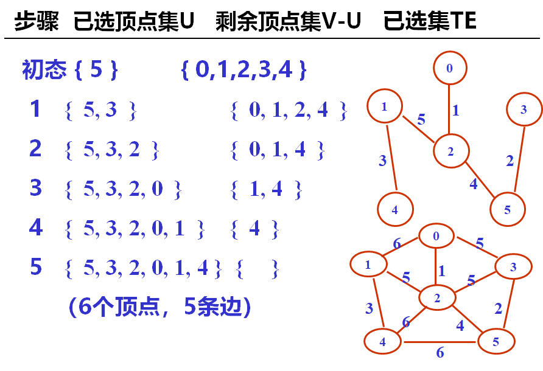

- 设 G=（V，E）是个无向带权图，U 是最小生成树的顶点集合，T 是最小生成树的边集合，则 Prim 算法描述如下：

```C
Prim ( Graph G )  {
 /*构造图G的最小生成树*/
 从G中任选一顶点p∈V
 U={ p }；
 T={ }；
 while ( U≠V ）
 {
   在p∈U，q∈V-U中找一条权最小的边（p,q）；
   U=U+{ q } ;
   T=T+{（p,q）};
  }
}/*Prim*/
```

---

#### Kruskal

- **适合于求边稀疏的网的最小生成树**
- 基本思想

  - 第一步：设 G=(V,E),令最小生成树初始状态为只有 n 个顶点而无边的非联通图 T=（V，{ }），每个顶点自成一个连通分量
  - 第二步：在 E 中选取权值最小的边，若该边依附的顶点落在 T 中不同的连通分量上，则将此边加入到 T 中，否则，舍去此边，选取下一条权值最小的边
  - 以此类推，重复 2，直至 T 中所有顶点都在同一连通分量上为止

- **用 Kruskal 方法构造的最小生成树不唯一，但权和相同**

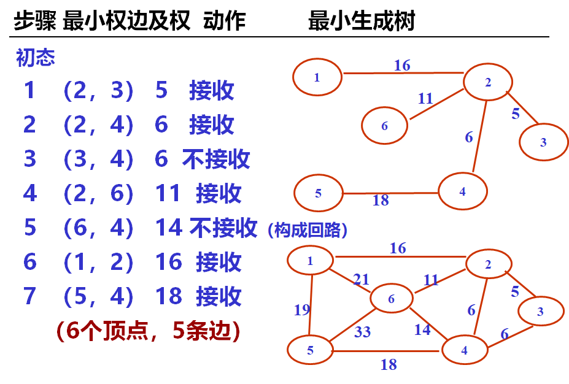

- 原则
  - 按权值递增次序构造 Tmin ；即每次选权最小且不构成回路的边,直至 n-1 条。
- 时间复杂度：O(eloge)
- 方法描述

```C
Kruskal （ Graph  G  )  {
/*构造图G的最小生成树*/
n=G的顶点数 ;
V(T)=V(G); E(T)={ };/*T初始化为n个顶点而无边的图*/
while ( E(T)中边数 < n-1 ）
{  从E(G)中选择最小权的边（v,w）；
   从E(G)中删去边（v,w）；
   if（（v,w）加到T中不形成回路 ）
     则将边（v,w）加入T中； }
}/*Kruskal*/
```

---

#### Dijkstra

- **从一个点出发，计算该点去其他节点的，最短路径**

---

### 拓扑排序

- 图可以描述一个工程或系统的进行过程
- 所有活动完成整个工程完成
- 活动间有一定的先后关系

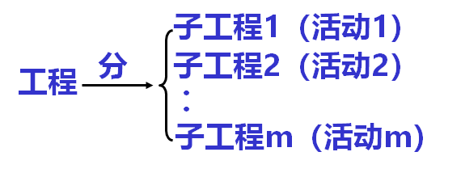

- AOV 网络：

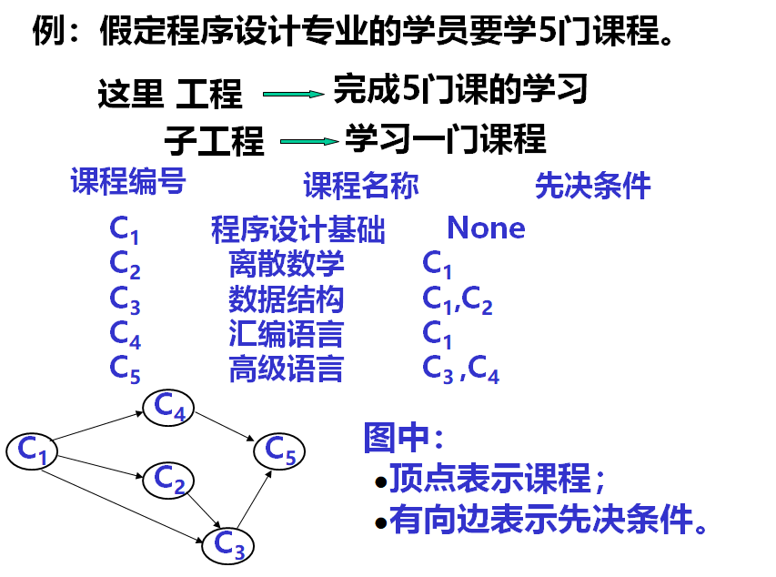

- 定义一：
  - 若有向图 G 中，顶点表示活动或任务，
  - 边表示活动或任务之间的优先关系，
  - 则称 G 为 AOV 网络，即顶点表示活动的，
  - 网络(Activity on vertex network)。
- 定义二：
  - 在一个 AOV 网中，
  - 称 i 为 j 的前趋 **当且仅当** i 到 j 有一条有向路径
  - 称 i 为 j 的直接前趋 **当且仅当** 有边<i,j>
- 首先，AOV 网不能出现回路，那么如何检测是否有回路？通过拓扑排序

---

1. 拓扑排序的定义

- 定义一：
  - 对 AOV 网构造顶点线性序列，（…i,…,k,…j,…）
  - i 是 j 的前趋，则 i 在 j 之前，若 i、k 间无路径，则或 i 在 k 前，或 k 在 i 前。这样的线性序列称为拓扑有序序列。
- 定义二：
  - **拓扑有序序列的构造过程称为拓扑排序**

2. 拓扑排序的方法

- 过程：
  - 第一步：在 AOV 网中选一个无前趋的顶点并输出之
  - 第二步：从 AOV 网中删去该顶点及以它为尾的所有弧
  - 重复第一和第二步
- 结果：
  - n 个顶点全部输出，则此图中无回路，且**得到拓扑序列**
  - ＜ n 个顶点被输出，则说明图中有回路，**说明工程不通过**

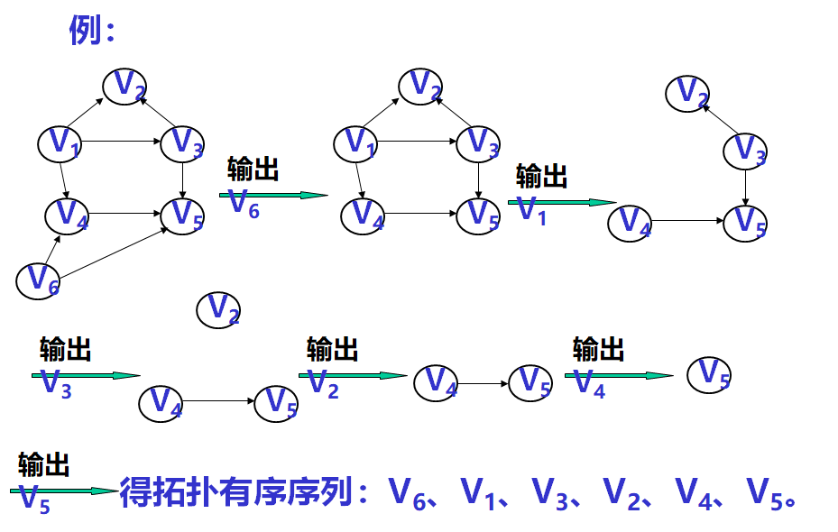

---

- 例题
- 连通分量是 XX 中的极大连通子图，这里 XX 如果是有向图或者无向图是正确的，但是如果是树的话是（极小连通子图）
- **连通图=无向图**，**强连通图=有向图**。简单路径是不带回路的。A→B→C，C 不能 →A，因为不带回路。
  - 如果问题是问，n 个节点的连通图中，任意一条简单路径，长度不能超过？
    - n-1
- 邻接表是图的一种 **链式存储结构**
- P100：根据邻接矩阵画出图
-
- P101：画出邻接表和逆邻接表（邻接表是出度，逆是入度）

---

### 总结

- 邻接矩阵、邻接表、逆链接表，要会做题
- 图的深度和广度便利，知道流程就可以
- 最小生成树
  - Prim
    - 原理是**根据顶点集找到最短的路径，根据顶点的连接关系找**
    - 例如：
    - 1：从 5 开始，顶点集里只有 5，取最短的路径
      - 5→3 需要 2。5→2 需要 4。5→4 需要 6。
      - **因此去第三个节点**
    - 2：顶点集有【5，3】，**根据顶点集找最短的**
      - 5→2 需要 4。5→4 需要 6。
      - 3→0 需要 5。3→2 需要 5
      - **5→2 最短，因此选 2**
    - 3：顶点集有【5，3，2】，以此类推
      - 2→0 需要 1，**最短因此选 0**
    - **以此类推**
      - 
  - Kruskal
    - 原理是**根据最短路径去选择**
    - **返回结果是图**
      - 1：2→3 最短需要 5
      - 2：2→4 最短需要 6
      - 3：2→6 最短需要 11
      - 下一个是 1 和 2（需要 16）
      - 下一个是 4 和 5（需要 18）
      - **从小到大**
      - 
  - Dijkstra
    - **从一个点出发，计算该点去其他节点的，最短路径**
- **拓扑排序**
  - AOV 网的拓扑排序，没什么好说的，知道就行

---

## 第六章 排序

- **数据排序**
  - 将一个文件的记录按关键字不减（或不增）次序排列，使文件成为有序文件，此过程称为排序。
- **稳定排序**
  - 若排序后，相同关键字的记录保持它们原来的相对次序，则此排序方法称为**稳定排序**
- **不稳定排序**
- **排序类型**

  - **内部排序**：全部数据存于内存
  - **外部排序**：需要对外村进行访问的排序过程

- 插入排序
  - 直接插入
  - 希尔
  - **算法特点**：
    - 第一个 for 循环都是 **i<=n** ，因为他连最后一个元素都比较了
    - 都设置 R[0] 作为哨兵，每次循环都是，让**哨兵与前一个元素比较**
    - 后移元素时，是**覆盖哨兵原本位置**
    - 最后将哨兵插入到正确位置时是 **j + 增量序列**（插入是 +1 希尔是+dk）
- 交换排序
  - 冒泡
  - 快速
- 选择

  - 直接选择
  - 堆

- **从小到大排序**

---

### 直接插入排序

- 基本思想
  - 设定一个**有序区**和一个**无序区**，在无序区设定**第一个元素**赋值给 R[0]名为**哨兵**。
  - 哨兵与**有序区的元素相比较**，如果大于哨兵则后移。
  - 直到有序区某个值**小于哨兵**，则插入在他的后面。
  - 总结：取个哨兵，**哨兵就是我们要插入的元素**，找到哨兵应该插入的位置。
- 算法过程：i 从 2~n
  - 时间复杂度 O($n^2$)
  - 稳定排序
- 算法实现
  - 第一步：设置 for 循环，i 从 2 开始，i 小于等于 n。因为需要比到最后一位。
  - 第二步：设置 R[0]为哨兵，**作为第一趟排序的哨兵**。
  - 第三步：设置第二个 for 循环，**找到哨兵应该插入的位置**。j 作为**有序区内的指针**，值设置为 i - 1，j--。从大减到小。当**前一个值大于哨兵时**，执行附步骤。
  - 第三步附：将**大于哨兵的值**后移，**覆盖哨兵原本的位置**。
  - 最后一步：将是哨兵插入到应有的位置。
  - **最后一步之所以要 j + 1。是因为 j 所在的值比哨兵小，所以插入到他的后面**

```C
void InserSort (SeqList R, int n)
{
  int i,j;
  // 第一步
  for(i = 2; i <= n; i++)
  {
    // 如果R[i].key大于有序区中所有的Key，则不动
    if(R[i].key < R[i-1].key)
    {
      // 第二步：当前记录作为哨兵
      R[0] = R[i];
      // 第三步：找插入位置
      for(j = i-1; R[0].key < R[j].key; j--)
      {
        // 记录后移
        R[j+1] = R[j]
      }
      // 最后一步：R[i] 插入到正确位置
      R[j+1] = R[0]
    }
  }
}
```

---

### 希尔排序

- 基本思想
  - 取一个 dk 为增值，以 dk 为跨度值，把数组划分为以 m/dk 个区域。
  - 在该区域内，第一次时 1 与 1+dk 与 1+2dk 与 1+3dk 进行交换比较，大放前面
  - 第二次时 2 与 2+dk 与 2+2dk 与 2+3dk 比较
  - 第三次时 3 和 3+dk..以此类推
- 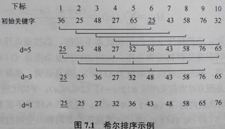
- 算法实现：

  - 第一步：设置 for 循环，**i = dk +1**，每次 i++。（让 dk 与 dk-1 的值比较）
  - 第二步：if，如果 **后一个值** 小于 **前一个值**则开始移动（ i 的值小于 i-dk 的值）
  - 第三步：将 **小的值（ R[ i ]）保存到哨兵**，j 保存 i - dk 索引值。后面对 j 进行操作。
  - 第四步：设循环，首先 j 要大于 0，然后让 **j 和哨兵（R[ i ] ）相比较**。当**前一个值大于哨兵时**，执行第五步。
  - 第五步：将**大于哨兵的值**后移，**覆盖哨兵原本的位置**。**然后 j 每次循环是 - dk**，查找前一个记录。
  - 最后一步：将 R[ i ]插入到正确位置。

  - **增量序列 dk 每次 + 1 ;**

```C
void ShellInsert(SeqList R, int dk, int n)
{
  // dk作为当前增量
  int i,j;
  // 第一步
  for(i = dk+1; i<=n; i++)
  {
    // 第二步
    if(R[i].key < R[i-dk].key)
    {
      // 第三步：暂存在 R[0] 中
      R[0] = R[i];
      j = i - dk;
      // 第四步：
      while(j>0 && R[0].key < R[j].key)
      {
        // 第五步：记录后移，查找插入位置
        R[j+dk] = R[j];
        // 查找前一记录
        j = j - dk;
      }
      // 最后一步：插入 R[i] 到正确位置
      R[j + dk] = R[0];
    }
  }
}
void main(SeqList R, int d[], int t, int n)
{
  // 增量序列 d[0..T-1]对顺序表 R 作希尔排序
  int k;
  for(k = 0; k<t; k++){
    ShellInsert(R, d[k], n)
  }
}
```

---

### 冒泡排序

- 基本思想
  - **自顶向上扫描**
  - 从后面开始比较到前面
  - 两个元素相比较，交换
- 算法实现
  - 第一步：设置 for 循环，i 从 1 开始，i<n，只做**n-1 躺排序**
  - 第二步：设置 for 循环，**j=n**，**从最后一个元素开始**，**j >= i+1**，每次 j--
  - 第三步：当最后一个元素小于前一个元素时就交换。同时 flag 为 1
  - **最后一步：如果没有交换，flag==0 需要跳出**
- 时间复杂度 O($n^2$)
- 稳定排序

```C
void BubbleSort (SeqList R,int n)
{
  // 自顶向上扫描
  int i,j,flag;
  // 最多做n-1躺排序，所以是< 不是 <=
  for(i = 1; i < n; i++)
  {
		// 记录是否有交换
    flag = 0;
    // 进行 i 趟排序
    for(j = n; j>= i+1; j--)
    {
      // 交换
      if(R[j].key < R[j-1].key)
      {
        R[0] = R[j-1];
        R[j-1] = R[j];
        R[j] = R[0];
        flag = 1
      }
      if(flag == 0 )return;
    }
  }
}
```

---

### 快速排序

- 基本思想
  - 用区间**第一个记录**，基准值
  - 左边有序区的记录均**小于基准值**，右边无序区的记录均**大于 key**
  - [low..i-1]关键字<= x.key <= R[i+1..high]，这个过程是快速排序，或一次划分
  - 重复上面几个步骤即可
- 算法分析
  - 须知：i 是作为区间的 low，j 则是 high
  - 第一步，第一个记录作为**基准值**
  - 第二步：设置循环，i<j，**作为一次划分的关键**
  - 第三步：在设置一个循环，**从 high 开始向内搜索（左边）**，只要 R[j].key 大于基准值，就 j--，继续下一项。
  - 第三步附：当第三步循环跳出时，**说明 R[j].key 小于基准值**，需要交换。则将 R[j]的值 覆盖 R[i]。然后 i++，**然后让 i 开始向右搜索**。
  - 第四步：在设置循环，**从 low 开始向内搜索（右边）**，只要小于基准值就 i++。继续下一项。
  - 第四步附：当第四步循环跳出时，**说明 R[i].key 大于基准值**，需要交换。则覆盖值，j--。
  - 最后一步：将**基准值覆盖到 最终排序 R[i] 。**
  - 用的时候需要做**一次划分**和对**左区间和右区间的递归**
- 切记！在在执行赋值时记得！！！i<j！！最后要在大循环外面写 R[i]=x
- 时间复杂度 O($log_2n$)
- 不稳定排序

```C
int Partition(SeqList R,int i,int j)
{
  // 第一步：区间第一个值作为记录
  RecType x =R[i];
  while(i<j)
  {
    // 第三步：从j开始向前（左边）搜索
    while(i<j && R[j].key => x.key])
      j--;
    // 第三步附
    if(i<j)
    {
      R[i] = R[j];
      i++;
    }
      // 第四步：从i开始向后（右边）搜索
    while(i<j && R[i].key <= x.key])
      i++;
    // 第四步附
    if(i<j)
    {
      R[j] = R[i];
      j--;
    }
  }
  // 最后一步：基准记录 x 位，位于最终排序位置 i 上
  R[i] = x;
  return i
}
void QuickSort(SeqList R,int low, int high)
{
  int p;
  if(low < high)
  {
    // 做一次区间划分
    p = Partition(R, low, high)
    // 对左区间递归排序
    QuickSort(R, low, p-1)
    // 对右区间递归排序
    QuickSort(R, p+1, high)
  }
}
```

---

### 直接选择排序

- 基本思想
  - 取第一个值作为**关键字**与**无序区的所有值相比较**，**比较出最小值**。
  - 将两值**交换位置**。
  - 第二趟就是取第二个值与后面比较，以此类推。
  - **每一趟确定下来的值是不会在移动的。**
- 算法实现
  - 第一步：设置 for 循环，i 从 1 开始，i < n，做 n-1 躺排序
  - 第二步：设置关键字索引
  - 第三步：设置 for 循环，从 j = i + 1 的位置开始（**关键字后一个元素开始**），**同时 j<=n**，因为需要比较到最后一个元素。
  - 第四步：只要找到**无序区中的**一个元素**小于**关键字元素的话，则将**小于关键字元素的索引值**给到**k**。
  - 最后一步：**只要 k 和 i 不相同**（k 就没有发生改变，也就不用变更位置）。就将 i （关键字）与 k（最小值）交换。
  - **从此确立了有序区第一个元素**
- 时间复杂度 O($nlog_2n$)
- 不稳定排序

```C
void SelectSort(SeqList R, int n)
{
  int i,j,k;
  // 第一步：最多做n-1躺排序，所以是< 不是 <=
  for(i = 1; i<n; i++)
  {
    // 第二步：k作为第一个关键字的索引值
    k = i;
    // 第三步
    for(j = i+1; j<=n; j++)
      if(R[j].key<R[k].key)
        // 让k记住小的值
        k=j;
    if(k!=i)
    {
      R[0]=R[i];
      R[i]=R[k];
      R[k]=R[0];
    }
  }
}
```

---

### 堆排序

- 算法思想

  - 大根堆：根需要，**大于左孩子和右孩子**
  - 小根堆：根需要，**小于左孩子和右孩子**
  - 总共有 n 个数，从 N/2 开始比较

- 例子，看图，该图是**大堆**
  - 根需要大于左孩子和右孩子
  - 第一步：n/2，38 开始
    - **根是否大于左孩子**，38(根)小于 87(左孩子)因此交换
  - 第二步：n/2-1，61 开始
    - 根小于左孩子，**因此交换**
  - 第三步：n/2-2，12 开始
    - 根小于左孩子，**因此交换**
  - 第四步：n/2-3，26 开始
    - 根小于左右孩子，**因此拿最大的（87）上来交换**
    - 26 作为**根节点**，又小于左孩子 38，因此和 38 交换
  - 第四步：n/2-4，3 开始
    - 97 上来
    - 3 小于 40，交换。

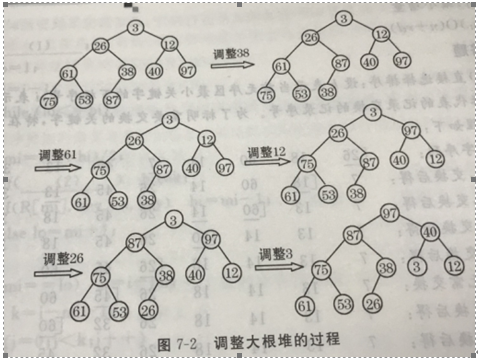

- 堆排序是一种树形选择排序，定义是 ki<=k2i 且 k2i<=k2i+1 或者 ki>=k2i 且 k2i>=k2i+1

- 实现

  大小堆意思是从大到小或从小到大

  写法：将待筛节点 R[i]存放到 x 中，j 为 2i 左孩子，if 当左孩子 2i 大于有孩子 2i+1 时 j++保证 j 为孩子的最大值，j 与 x 双亲节点相比如果小于 x 那么跳出 break，否则将 R[j]覆盖到 R[i]上，然后修改 i 和 j 的值，使 i 指向 X 新调整点，i=j；j=2\*i；在循环外面不管 while 进行了什么操作都要把 x 筛选点的值赋放在 R[i]双亲节点上，算法实现上 i=n/2 的最小双亲节点，for 循环每个双亲节点下去

  注意！！堆调整：第一次取出第一个元素、将最后一个放在第一个位置，然后进行堆调整，最后把原第一元素放在最后的位置：第二次同理但是将 n-1 就是倒数第二个数放在第一位，进行堆调整、**注意！进行过取出的元素不能动就是第倒数 2 个元素因为他们已经有序**

```C
void Sift(SeqList R,int i,int h)
{
  // 将R[i..h]调整为大根堆，假定R[i]的左、右子树均满足堆性质
  int i,j;
  // 将待筛点存在 x中
  RecType x = R[i];
  // R[j]是R[i]的左孩子
  j = 2 * i;
  // 当R[i]左孩子不为空时执行
  while(j <= h)
  {
    // 如果右孩子关键字较大，则j为较大右孩子的下标
    if(j<h && R[j].key<R[j+1].key)
      j++;
    // 找到 x 的位置，停止循环
    if(x.key >= R[j].key)
    	break;
    // 将R[j]跳转到双亲位置上
    R[i] = R[j];
    // 修改 i 和 j 的值，使i指向新的调整点
    i = j;
    j = 2 * i;
  }
  // 将被筛节点放在最终位置
  R[i] = x;
}
void HeapSort(SeqList R, int n)
{
  int i;
  for(i = n/2; i>0; i--)
    // 对初始数组建立大根堆
    Sift(R,i,n)
  // 对R[1..i]进行堆排序，共n-1躺
  for(i = n; i>1; 1--)
  {
    R[0] = R[1];
    R[1] = R[i];
    R[i] = R[0];
    // 对无序区R[1..i-1]建大根堆
    Sift(R, 1, i-1)
  }
}
```

---

### 归并排序

- 基本思想
  - 将排序文件看为 n 个长度为 1 的有序子文件
  - 将他们两两归并，以此类推
  - R 是有序子文件，MR 是排序结果
- 算法分析 Merge：
  - 首先：m 是区间的中间值，两个序列需要靠他划分。low 和 high 是起点和重点。
  - 第一步：i 作为**第一个区间起点**，m 是**第一个区间的终点**。j 作为**第二个区间的起点**，k 作为**新数组的起点**。
  - 第二步：设置循环，只要 第一个区间 i（起点） 不超过他的范围，和第二个区间 j（起点） 不超过范围就循环下去。
  - 第三步：2 个区间的值相比较，排好序，放入 MR 中
  - 最后一步：将剩下的值放入 MR 中
  - **作用**就是**将 2 个区间排好序（low—m 为第一个区间，m+1—high 为第二个区间）**，**合为一个有序区间（MR）**
- 算法分析 MergePass：**该算法的作用就是分文件，给 Merge 去排序。**
  - 第一步，设置循环，**区间不得超过** n（i + 2 _ len -1），每次递增 i = i + 2 _ len（**区间终点+1**）。
  - 第一步附，i 作为**区间起点**，i + 2 \* len -1 作为**区间终点**，i + len - 1 作为**区间中间**
  - 第二步：如果还存在 2 个子文件，**其中一个长度小于 len** ，则在进行一次排序。起点为 i，终点为 n，中间点为 i+ len -1。
  - 第三步：文件个数为基数，将最后一个文件复制到 MR 中
  - **作用**：**按照 len 作为各个子区间的长度**，将每个区间的**起点、中间点、终点**数值给到 Merge 进行划分。
- 算法分析 MergeSort：
  - len 文件长度从 1 开始，每次 len\*2，，直到长度小于 n。
  - **作用**：分配文件长度 len 给**MergePass**
- 时间复杂度 O($log_2n$)
- 稳定排序

```C
void Merge(SeqList R,SeqList MR,int low,int m, int high)
{
  // 对有序的R[low..m]和R[m+1..high]归并为有序的MR[Low..high]
  // 第一步：划分好2个区间
  int i,j,k;
  i=low;
  j=m+1;
  k=low;
  // 第二步：
  while(i<=m && j<=high)
    // 第三步
    if(R[i].key <= R[j].key)
      MR[k++] = R[i++];
  	else
      MR[k++] = R[j++];
  // 最后一步
  // 将R[Low..m]中剩下的复制到MR
  while(i<=m)
    MR[k++] = R[i++];
  // 将R[m+1..high]中剩下的复制到MR
  while(j<=high)
    MR[k++] = R[j++];
}
void MerPass(SeqList R, SeqList MR, int len, int n)
{
  // 对R[1..n]做一趟归并排序
  int i,j;
  for(i = 1; i+2*len-1<=n; i=i+2*len)
  	Merge(R,MR, i,i+len-1, i+2*len-1);
  // 第二步：还有两个子文件，其中最后一个长度小于 len
  if(i+len-1<n)
    Merge(R,MR, i, i+len-1, n)
  else
    // 第三步：文件个数为基数，将最后一个子文件复制到MR
    for(j=i; j<=n; j++)
      MR[j] = R[i];
}
// 最后如下：
void MergeSort(SeqList R, SeqList MR, int n)
{
  // 对R[1..n]做一趟归并排序
  int len = 1;
  while(len < n){
    MergePass(R,MR,len,n)
    len = len * 2;
    MergePass(R,MR,len,n)
    len = len * 2;
  }
}
```

---

### 基数排序

- 按照元素的个位数、十位数、百位数等进行排序
  - 第一趟把元素从个位数开始分配，个位数是 1 就放在 1 的位置上个位数是 6 就放在 6 上，第二趟就十位，剩下以此类推
- 例如：6,4322,432,344,55
  - 第一趟，从个位数开始排序
    - 432`2`、43`2`、34`4`、5`5`、`6`
  - 第二趟，从十位
    - `0`6、43`2`2、4`3`2、3`4`4、`5`5
  - 第三趟，从百位
    - `0`06、`0`55、`3`44、4`3`22、`4`32、
  - 第四趟：千位
    - 6、55、344、432、4322

---

- 例题
- ***

### 总结

> - **插入排序**
>   - **特点是：有哨兵**
>   - 直接插入
>     - 建立有序区和无序区，遍历出无序区最小值，放有序区
>   - 希尔
>     - 设置 dk 增量
>     - **特点是：后面的值覆盖到哨兵位置。**
> - **交换排序**
>   - **特点的：两两交换，设置了交换位**
>   - 冒泡
>     - 两两比较出最小值，最小值放前面
>   - 快速排序
>     - 以**关键字**作为基准，小的放左边，大的放右边
> - **选择排序**
>   - 直接选择
>     - 让**关键字**，和后续比较，**选择出最小的**，交换位置
>   - 堆
>     - 大根堆：根需要，**大于左孩子和右孩子**
>     - 小根堆：根需要，**小于左孩子和右孩子**
>     - **根需要和左右孩子比较，最大或最小的拿上来交换**
> - 归并
> - 箱排序
>   - 首先有 0 到 9 的数字，初始状态下，每个数字占一行。
>   - 第一趟排序是：从个位数开始排序
>   - 第二趟排序是：从十位数开始排序
>   - 以此类推，**每次排序先从小的开始排序，从 0 开始到 9**
> - **原始算法时间复杂度**都是 O（$n^2$）
>   - 直接插入，直接选择，冒泡
> - **改进过的算法都是**O（$nlog_2n$）
>   - 希尔，快速，堆
> - 改进过的算法都**不稳定**，原始算法中的**除了选择排序不稳定**。**其余都是稳定的**
> - **小提示**
>   - 冒泡和快速排序，都用到**交换的那三句**

- 辅助空间复杂度
  - 直接插入、直接选择、冒泡、希尔、堆排序辅助空间 O(1)
  - 直接排序 O(log2n)
  - 归并排序 O(n)
  - 基数排序 O(n+rd)
- 关于实际问题选择合适算法
  - 记录数目较小可以使用插入、选择排序
  - n 较大时应采用快速排序、堆排序或归并排序
  - 排序记录基本有序时可采用直接插入或冒泡排序
  - n 很大，但关键字位数较小时采用链式基数排序比较好
  - 关键字比较次数与记录的初始排序顺序无关时采用选择排序

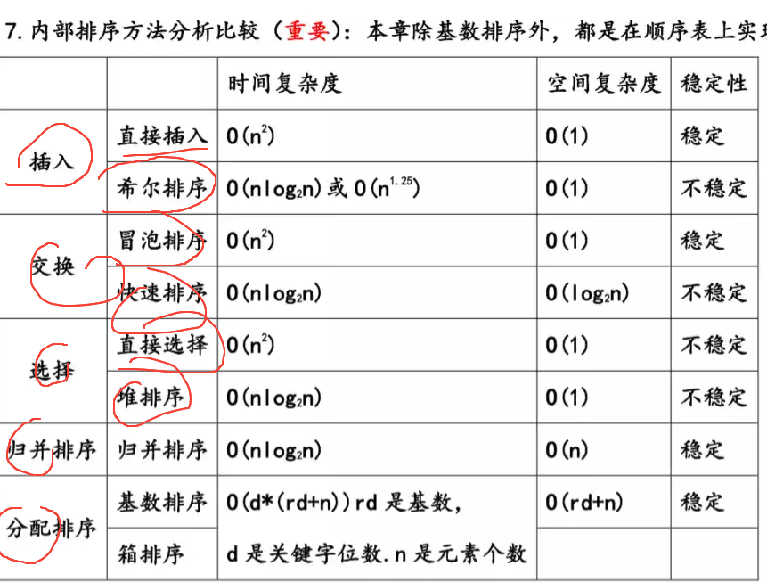

---

## 第七章 查找

- **基本概念**
  - 由同一类型的数据元素（或记录）构成的集合
- **关键字（键）**
  - 用来标识数据元素的数据项称为**关键字**，简称**键**；其值称为**键值**
- **主关键字**
  - 可以惟一标识各个数据元素的关键字
- **查找**
  - 根据给定的某个 k 值，在查找表寻找一个其键值等于 k 的数据元素
- **静态查找表**
  - 进行的是**引用型**运算
- **动态查找表**
  - 进行的是**加工型**运算
- **顺序表查找分为：**
  - 顺序查找、二分查找
- **索引查找：分块查找**

---

### 顺序表查找

1. **有序表**上的操作——**顺序查找**

- **分析：**

  - **成功查找**：ASL = （n + 1）/2
  - 不成功：ASL = n + 1

- 从表中**最后一个**记录开始**顺序**进行查找，若当前记录的关键字 **=** 给定值，则查找成功；
- 否则，继续查上一记录…；若直至第一个记录尚未找到需要的记录，则**查找失败**。

```C
int  search_sqtable(sqtable T, keytype K）
{ /*在顺序表R中顺序查找其关键字等于K的元素。
     若找到，则函数值为该元素在表中的位置，否则为0*/
  T.item[0].key=K;
  i=T.n;
  while ( T.item[i].key!=K )  i-- ;
  return i ;
}
```

---

2. **有序表**上的查找——**二分查找**

- **分析**：
  - 成功时次数最多：$log_2n$ + 1
- 思想
  - 每次找中项
  - 每次将处于查找区间中间位置上的数据元素与**给定值 K 比较**，
  - 若不等则缩小查找区间并在新的区间内重复上述过程，直到查找成功或查找区间长度为 0（查找不成功）为止。
- 过程：
- 第一步：求中间点
  - mid = （low + high）/ 2
- 第二步：给定关键字 k 与中项记录关键字比较
  - 一：K ＜ item [mid].key，则所查记录落在表的前半部；继续在前半部找，此时 low 不变，high=mid-1
  - 二：K ＝ item [mid].key，则查找成功，中项即是，结束
  - 三：若 low≤high，则转(1)，否则查找不成功

```C
int  binsearch( sqtable R,   keytype  K ) {
  /*在有序表R中二分查找其关键字等于K的数据元素；若找到，
      则返回该元素在表中的位置，否则返回0 */
  low=1 ;   hig=R.n ;
  while  ( low<=hig )
  {
    mid = (low + hig) / 2 ;
    if  (K == R.item[mid].key)  return (mid) ;
    else  if ( K < R.item[mid].key )  hig = mid-1 ;
    else  low=mid+1 ;
   }
  return (0) ;
 }
```

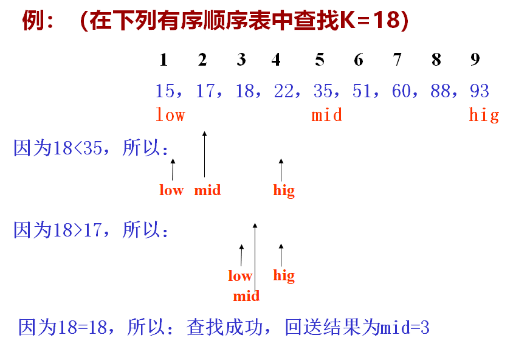

---

3. **索引顺序表**的查找——**分块查找**

- **分析**
- 过程
- 第一步：先建立最大（或小）关键字表——索引表（有序）
  - 即将每块中最大（或最小）关键字及指示块首记录在表中位置的指针依次存入一张表中，此表称为索引表；
- 第二步：查找索引表，以确定所查元素所在块号
  - 将查找关键字 k 与索引表中每一元素（即各块中最大关键字）进行比较，以确定所查元素所在块号
- 第三步：在相应块中按顺序查找关键字为 k 的记录

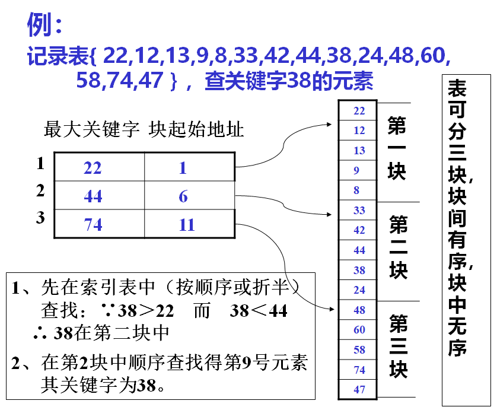

---

### 动态查找表

1. 树表

- 表结构是在查找过程中动态生成的；对于给定值 k，若表中存在其关键字等于 k 的记录，则查找成功返回，否则在表中插入关键字等于 k 的记录。

- **什么是二叉排序树**？
  - 二叉排序树是一种特殊的、增加了限制条件的二叉树，它的存储结构及其类型定义与二叉树相同，它的特殊性表现在结点键值之间的大小关系上，任一结点的键值大于其做孩子(及其子孙)的键值且小于其右孩子(及其子孙)的键值。
- **性质**：
  - 中序遍历一棵二叉排序树所得的结点访问序列是键值的递增序列
- **过程**
  - 当二叉排序树不空时，首先将给定值和根结点的关键字比较,若相等,则查找成功；否则根据给定值与根结点关键字间的大小关系，分别在左子树或右子树上继续进行查找
- **算法**

  - 左子树上的所有结点键值都比根的小
  - 右子树上的所有结点键值都比根的大
  - 构造二叉排序树的同时也对序列排序

- **插入和生成**
- 构造二叉排序树
  - 第一步：$K_1$，为根
  - 第二步：若 K1 ＜ K2 ，则令 K2 为 K1 的右孩，否则为左孩
  - 第三步：) k3，k4，…，kn 递归重复 2）

---

### 散列表

- 也称**哈希函数**
- 设记录表 A，长为 n，ai（1≤i≤n）为表中某一元素，ki 为其关键字，则关键字 ki 和元素 ai 在表中的地址之间有一函数关系，即：
  - Addr（$a_i$） = H（$K_i$）
  - a1 在表中的地址，散列函数：关键字与元素地址的函数
- **散列地址**
  - 散列地址由散列函数决定数据元素的存储位置，该位置称为散列地址
- **散列查找**
  - 给定关键字，在表中地址查看有无此元素，有输出，无填到此位置
- **散列表**
  - 通过散列法建立的表称为散列表
- **冲突**
  - k1≠ k2 但 H（k1）=H（k2）的现象称为冲突
  - 即：不同的关键字映射到同一存储单元。
  - 并称 k1 和 k2 是同义词
- **散列法主要工作**
  - 选择一个好的散列函数
  - **解决冲突**
- 好的散列函数的**好处**：
  - **函数计算简便，运算速度快**
  - **随机性好，地址尽可能均匀分布**
  - **冲突小**

---

- **散列函数的构造**
- **直接地址法**
  - key 本身加上某个常量 C
  - H(key) = key + C
  - 适用于关键字分布连续，若关键字分布不连续，空号较多，将会造成较大的空间浪费
- **数字分析法**
- **除留余数法**
  - 取关键字被某个不大于散列表长 m 的数 p 除后所得余数作为散列地址
  - H(key)= key mod p
  - 如何取 P？
    - p 不取偶数
    - p 不取关键字字符基的 n 倍
    - 一般选 p 为质数且最接近表长 m 的质数
- **平方取中法**
- **折叠法**

---

- **解决冲突的部分**：开放定址法、拉链法

1. 开放定址法

- 基本思想
  - 在散列表中形成一个探查荀烈，沿着该序列逐个单元查找，直到一个空闲单元将新节点插入其中。
- 假设散列表空间为：T[ 0..m-1 ]，则一般形式是
  - $h_i = （H（key） + d_i）$% m
  -
- **开放定址法又分为**

  - 线性探测法
    - 下面补充
  - 二次探查法
    - $h_i = （H（key） \pm \ i^2）$% m
    - $T[d+1^2]$、$T[d-1^2]$、$T[d+2^2]$、$T[d-2^2]$
  - 双重散列法

- **线性探测法**
  - 计算出的散列地址已被占用，则按顺序找 “下一个”空位
- 过程
  - 设有散列表 HT（向量），对给定记录 R，其关键字 k，对应哈希地址 H(k)=>j
- 要点
  - 第一步：HT[j]空，则 R 填入
  - 第二步：HT[j].key=k，则输出
  - 第三步：否则，按顺序一步步找“下一个”空位，将 R 填入
- 优点
  - 直接由关键字通过哈希函数计算出哈希地址，查找效率高
- 缺点
  - **常发生冲突，影响查找效率**

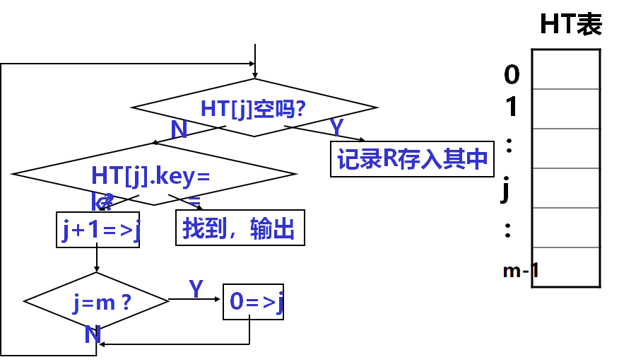

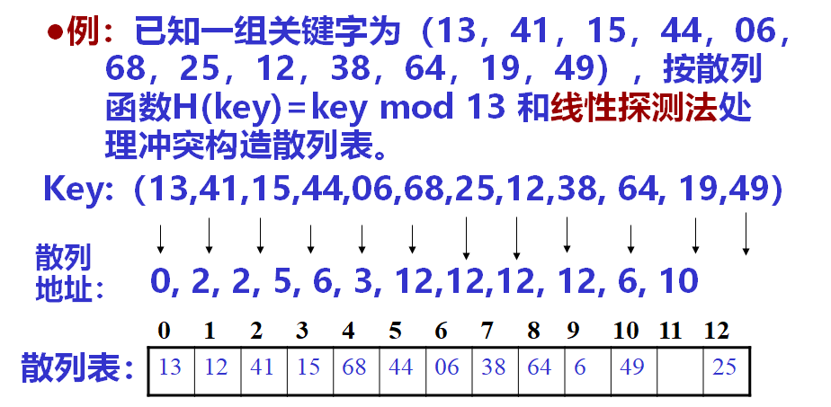

2. 拉链法

- **链地址法**，处理冲突

  - 将散列地址相同记录存储在同一单链表中（称同义词表），同时按散列地址设立一个表头指针向量

- 例：已知一组关键字为（13，41，15，44，06，68，25，12，38，64，19，49），按散列函数 H(key)=key mod 13 和链地址法处理冲突构造散列表。

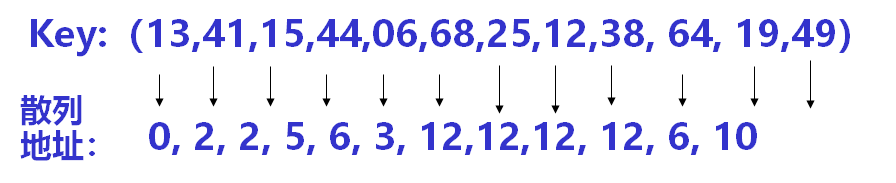

**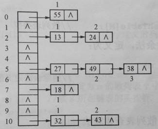**

---

### 总结

**二叉查找树**

- 平均查找长度

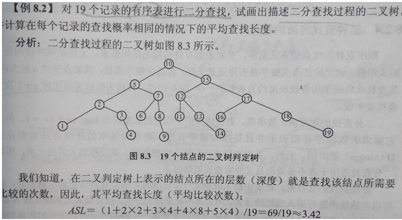

- **查找成功的平均查找长度是多少？**
- 二分查找，**2.5=2，去小的那个。**
- 顺序查找和二分查找**平均查找长度**
  - 顺序查找：(n+1)/2，失败需要 n+1
  - **二分查找：**
    - **将 n 化为二叉树**
    - **例如 n=10 的话，一层一层的这样算**
    - $(1*1+2*2+3*4+4*3)/10$
- **动态查找不用管**
- **散列**

  - **直接地址法**
    - key+C，C 作为常亮
  - 数字分析法
    - 例如一个数**第二位是 3**，那么就存在 3 的位置
    - **第二位是 4**就存在第四位的位置
  - **除余数法**
    - 求模，k%p，p 求模数是 11
    - **k=15 的话，k%p=4，那么就在 4 的位置上**
  - 平方取中法
  - 折叠法

- **地址冲突——开放定址法**
  - **线性探查法**
    - 发生冲突，在 +1 的位置存入
    - 例如在 4 的位置发生冲突，那么就在 5 存入。
  - **二次探查法**
    - **发生冲突，在进行一次求模**
    - i：是 12345 这样的
    - $h_i = （H（key） \pm \ i^2）$% m
    - $T[d+1^2]$、$T[d-1^2]$、$T[d+2^2]$、$T[d-2^2]$
    - 例如，15%11=4 发生冲突
      - (15+1)%11=5，还发生冲突
      - (15-1)%11=3，还发生冲突
      - (15+$2^2$)%11=0，还发生冲突
  - **双重散列法**
    - 不重要
- **地址冲突——拉链法**

  - 题目会给散列函数给你，例如 f(k)=k%13，**那么拉链法就是 0-12**

- 例题
  - 要注意，线性探查法和拉链法的 ASL（**平均查找长度**）计算
  - **二分查找**求平均查找长度，**需要化为二叉树**

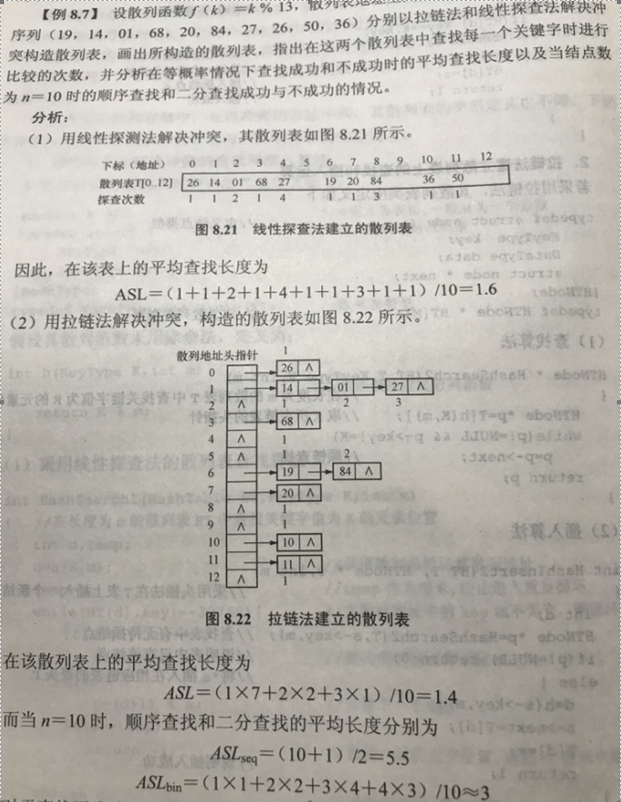

- 顺序表查找有哪几种？
  - 顺序、二分、分块
- 散列函数的构造有哪 5 种？
  - 直接地址法、数字分析法、除留余数法、平方取中法、折叠法
- 地址冲突有哪两种？
  - 开放定址法
  - 拉链法
- 开放定址法分哪 3 种？
  - 线性探查法、二次探查法、双重散列法

---

## 总结

- **书本树和二叉树 P74，习题非常重要的**
- **书本排序 P142，习题非常重要的**

- 书本模拟演练一

  - 画哈夫曼树要记住
    - 首先是：`左孩子大，右孩子小`
    - 第二是：`左子树结点少，右子树结点多`
      - 执行过一次第二步，就可以反过来。下次是`左子树结点多，右子树结点少`针对于单一节点

- 书本模拟演练二
  - 选择题：8,9,11,12,13,15
  - 填空题：16,19,22,24,25
  - 解答题全部
  - 算法题
    - 30
      - 题意是，一个循环链表，给了你 s，让你删除 s 的前驱节点
      - 你就一直遍历，遍历到 s 的前驱节点然后删除他，不就完事了。
