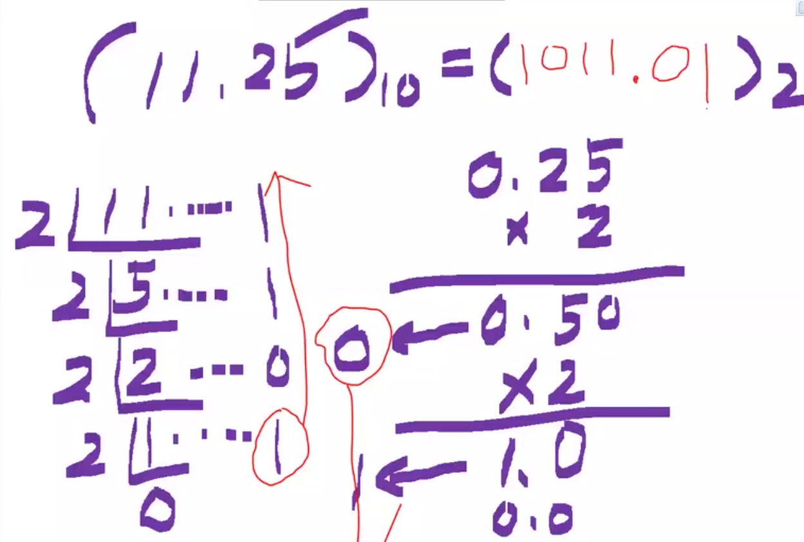
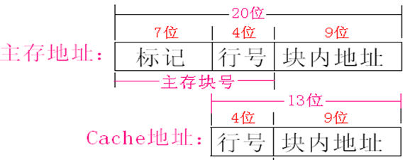
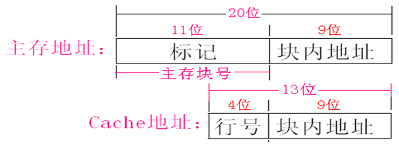
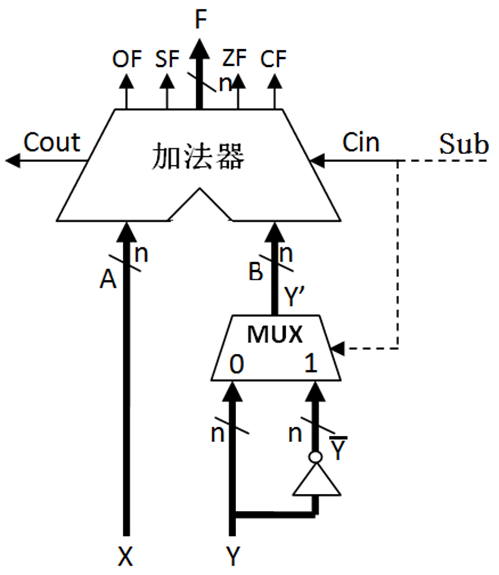

# 计算机组成原理复习

> 来自20221022的提醒：如果没过的话，这边建议看书找感觉会考的大题，目前经验来说，第二章、第六章是重点，还有大端那一章。至于其他题目，把重点的内容记牢，然后在看往年4~5套题就够了。建议时间 `4` 天，内容不多，但需要重复记，关键点容易忘机。

## 重点

> 1、一条指令中应该显式或隐式地给出那些信息？P3.1.1 指令地址码的个数

- 因当给出：操作码、源操作数、结果的地址、下跳指令地址。

补充：一般情况下，下一条指令的地址不需要在指令明显给出，而是隐含在程序计数器(PC寄存器)中;

> 2、计算机执行指令时，如何形成下一条指令的地址？P3.1.1 指令地址码的个数

- PC中放的就是下一条指令在内存中的地址;
- 当指令按顺序执行时，只要自动将PC的值加上指令的长度，就可以得到下一条指令的地址
- 当遇到转移指令而不按顺序执行时，需要由指令给出转移到的目标地址

> 2、什么是指令周期？不同指令的指令执行周期是否一致？P4.1.1 指令的执行过程

- CPU取出并执行一条指令的时间为一个指令周期
- 不同指令的指令执行周期不同，与操作数寻址方式和存结果的地址等有关。

> 3、一条指令的执行要经过哪些步骤？每条指令的执行步骤一样吗？P4.1.1 程序及指令的执行过程

- 取指令、指令译码、计算源操作数地址并取操作数、执行数据操作、计算目的操作数地址并**存结果**、计算**下一条指令地址**并送PC。
- 第一个和第二步所有指令是相同的，其余不同。

> 4、程序计数器PC和指令译码器ID的作用。P4.1.2 CPU的基本功能和基本组成

- 程序计数器PC：存放即将执行的指令地址，取指令时先将PC的内容送到地址线。
  - 存储即将执行指令的地址
- 指令译码器ID：对指令寄存器中的操作码部分进行分析解释，以产生控制信号
  - 解释译码产生控制信号

> 12、转移指令和调用(转子)指令的区别？P4.4.2 MIPS指令流水线

- 在执行调用(转子)指令时必须保存下条指令的地址，调用指令用于过程调用或函数调用，当执行结束时，根据返回地址返回到调用过程继续执行
- 转移指令则不返回执行，无需保存返回地址

> 15、硬连线控制器设计的四个步骤 P4.5 控制器设计基本原理

- 根据每条指令的功能，确定执行步骤。
- 给出每条指令在每个步骤中的，控制信号的取值。
- 根据指令和控制信号的关系，写出每个控制信号的逻辑表达式。
- 根据逻辑表达式，画出控制器的逻辑电路图

> 4、I/O端口的编址有哪两种？简述它们的编制方法和优缺点。P6.4.4 I/O端口及编址

- 独立编址：I/O端口地址与存储器地址无关，单独编码。
  - 特点：不占用存储空间，但需要专门设置I/O指令，且I/O指令仅限于传输，功能较弱。
- 统一编址：I/O端口当作存储器的单元来分配地址。使用**访存指令就能实现I/O操作**。
  - 特点：CPU访问外设更灵活方便，但使内存容量减小(地址数减少);进行I/O操作时，执行速度比较慢。

> 17、在中断响应周期中，通过执行一条隐指令，可以完成那些操作？P6.5 I/O数据传送控制方式
>
> 中断响应周期中，主要完成哪几个操作？P6.5 I/O数据传送控制方式

- 关中断：将中断允许标志置为禁止状态。
- 保护断点：将PC和PSW送入栈或特殊寄存器。
- 获得中断服务程序的首地址和初始PSW，分别送入PC和PSWR

> 18、中断过程包括哪两个阶段？如何实现。P6.5 I/O数据传送控制方式

- 包含**中断响应、中断处理**。
  - 中断响应由硬件实现
  - 中断处理由CPU执行中断服务程序实现，故是软件实现。

> 13、根据不同的控制描述方式，可以有：`硬连线控制器、微程序控制器` 两种实现方式。P4.5 控制器设计基本原理
>
> 16、微程序控制器中的微程序定时器，它的实现方法有：`计数器法、断定法`。P4.5.2 微程序控制器
>
> 1、磁盘存储器的平均存取时间主要包括：`寻道操作、旋转等待操作和读写操作`。P6.2.1磁表面存储原理
>
> 3、总线的定时方式：`同步/异步/半同步通信`。6.3.1总线的概述
>
> 7、对I/O接口中可访问的寄存器编址，其方式有：`独立编址和统一编址`。P6.4.4 I/O端口及编址
>
> 10、对I/O数据的控制方式：`程序直接控制、DMA控制和中断传输控制`。P6.5 I/O数据传送控制方式
>
> 19、DMA方式有：`CPU停止法、周期挪用法、交替分时访问法`。P6.5.3 DMA方式
>
> 20、DMA控制器初始化主要包括三个方面的操作：`准备内存区、设置传送参数、发送启动DMA传送`。P6.5.3 DMA方式

1、采用变址寻址的操作数存放在：内存中。

4、按完成任务不同，计算机用户分为四类用户：`最终用户、系统管理员、应用程序员、系统程序员`。P1.3.2不同用户所在的工作层次

程序计数器、指令寄存器、指令译码器、标志寄存器

3、IEE754浮点数标准中规定：`尾数为原码，阶码为移码`。

4、在IEEE754标准中非NaN是指：`阶码全1，尾数非0`。P2.3.3  IEEE754浮点数标准

5、IEEE754浮点数标准中，规格化尾数的隐藏位取值为：`1`，非规格化位数的隐藏位取值位：`0`。

10、大端方式：数据的**最高有效字节存放在最小地址单元**中，最低有效字节放在最大地址端。

12、常见效验码：`奇偶效验码、海明效验码、循环冗余效验码`。P2.6 数据校验码

3、一条指令由一个**操作码**和几个**地址码**构成，根据指令显式给出的地址个数，指令可分为`三地址指令、二地址指令、单地址指令和零地址指令`。P3.1.1指令地址码的个数

- 立即寻址：**操作数**在指令中给出。
- 寄存器直接寻址：**操作数**在寄存器中。
- 直接寻址：**操作数的地址**在指令中。
- 寄存器间接寻址：指令给出的地址是寄存器的编号，寄存器存放的是操作数的有效地址。
  - **操作数地址**放在寄存器中。
- 间接寻址：指令中给的地址码是**存放操作数的有效地址**的**存储单元地址**。
  - 操作数的地址存放在**指令给出的地址码**

3.4 程序的机器级表示，过程式程序设计的程序有三种结构：**顺序、选择和循环结构**三种

5、早期计算机的定时方式采用：`机器周期、节拍和脉冲` 三级时序对数据通路操作进行定时控制。P4.2.2 数据通路的时序控制

6、CPU内部的ALU部件基本功能是实现：`算术运算和逻辑运算`。P4.3数据通路基本工作原理

11、MIPS指令流水通常由五个流水段构成：`取指、译码、执行、访存、写回`。P4.4.2 MIPS指令流水线

13、根据不同的控制描述方式，可以有：`硬连线控制器、微程序控制器` 两种实现方式。P4.5 控制器设计基本原理

16、微程序控制器中的微程序定时器，它的实现方法有：`计数器法、断定法`。P4.5.2 微程序控制器

18、指令流水线中的流水线冒险包括哪几种？他们的产生原因是？P4.6 指令流水线中的冒险处理 `结构冒险、数据冒险和控制冒险`

19、Intel将内部异常分为三类：`故障、陷阱和终止`。4.8.2  异常的分类

19.1、Intel将外部中断为：**可屏蔽中断**和**不可屏蔽**。4.8.2

- 按存储元件分类：**`半导体存储器、磁表面存储器、光盘存储器`**。
- 按照存取方式分类：CPU把数据存放到存储器
  - **`随机存储器RAM`**：半导体存储器(主存和Cache)
  - **`顺序存储器SAM`**：磁带存储器，信息按顺序存取和读出。
  - **`直接存储器DAM`**：兼有RAM和SAM的特点，直接区域存储，磁盘存储器
- 按信息的可更改性分：**`读写存储器、只读存储器ROM`**。
  - RAM就是一种读写存储器，RAM和ROM都采用随机存取方式进行信息访问的；
- 按断电后信息的可保存性分：
  - **`易失(挥发)存储器`**：(有RAM、 Cache)：靠电
  - **`非易失(不挥发)存储器`**：信息可以一直保留，DAM

目前使用最多的随机存储器是**半导体存储器**。分为：**静态随机存储器(SRAM)**和**动态随机存储器(DRAM)**。

- SRAM：MOS管多、功耗大、集成度低。无需刷新和读后再生、读写速度快。适合做高速小容量的半导体存储器。
- DRAM：MOS管少、功耗少、集成度高。需定时刷新和读后再生、读写速度慢。适合做慢速大容量的主存。

11、六管静态存储单元是利用MOS管构成的 `触发器` 来存储信息，单管动态存储单元是利用MOS管的 `栅极电容` 来存储信息。

12、动态存储器进行"读"操作时，存在电容放电现象，读后应有重写操作，此操作称为：`再生`。P149

15、主存块与Cache直接有三种映射：`直接映射、全相联映射、组相联映射`。P5.5.3   cache行和主存块之间映射方式

16、虚拟存储器分为三种不同类型：`分页式、分段式、段页式`。P5.6.3虚拟存储器实现

1、磁盘存储器的平均存取时间主要包括：`寻道操作、旋转等待操作和读写操作`。P6.2.1磁表面存储原理

2、系统总线通常由三组线构成：`数据线、地址线、控制线`。P6.3.1总线的概述

3、总线的定时方式：`同步/异步/半同步通信`。6.3.1总线的概述

7、对I/O接口中可访问的寄存器编址，其方式有：`独立编址和统一编址`。P6.4.4 I/O端口及编址

10、对I/O数据的控制方式：`程序直接控制、DMA控制和中断传输控制`。P6.5 I/O数据传送控制方式

11、中断服务程序的阶段：`准备阶段、处理阶段和恢复阶段`。6.5

12、设置中断屏蔽字的作用是：`暂停对某些中断的相应`。P6.5中断过程

13、鼠标接口应选用：**中断控制方式**

14、向量中断方式下产生中断服务程序人口地址的方法是：`从中断向量表中获得`。

19、DMA方式有：`CPU停止法、周期挪用法、交替分时访问法`。P6.5.3 DMA方式

20、DMA控制器初始化主要包括三个方面的操作：`准备内存区、设置传送参数、发送启动DMA传送`。P6.5.3 DMA方式

21、在DMA控制方式下，实现主存和高速外设之间的直接数据交换时，总线控制权归：`DMA控制器掌控`。P6.5.3DMA方式

22、磁盘接口应选用：`既有中断接口，又有DMA接口`。P6.56.5.3DMA方式

## 大题总结

1. 进制转换

1）二进制转十进制：**按位权展开相加法**

- 10110二进制👉十进制：$1*2^4+0*2^3+1*2^2+1*2^1+0*2^0=22$
- 小数部分的计算和正数相反

**技巧：$2^{-2}=1/2^2=0.5$**

- 0.0101=$0*2^{-1}+1*2^{-2}+0*{-3}+1*{-4}=0*0.5+1*0.25+0*0.125+1*0.625=0.3125$
- 101=$1*2^{-1}+0*2^{-2}+1*{-3}=1*0.5+0*+*0.25+1*0.125=0.625$

2）十进制转二进制：整数部分 `除2` 取余数倒计法。小数部分是 `乘2` 取整数顺计法。

能整除则为0。乘二后整数部分是多少那么就是多少。

### 选择题

1. 真值、原码、反码、补码

**正数的原码、反码、补码一样**

符号位，是在数的前面额外加一位。

- 真值->符号位为 `+/-` 。
- 原码->符号位为 `正0负1`。
- 反码
  - `正数不变`，负数取反（-111 1101->1000 0010
- 补码
  - `正数不变`，负数取反后`+1`（1011 0111->1011 1000

2. 奇偶校验

奇校验那么 “1” 的个数是齐数个。偶则同理。

例题：100001采用偶校验在末位增加偶校验是：100010(考点->在末尾处增加那么就直接+1

3. 32KB的主存储器，按字节编址需要地址线：15条

容量有B、KB、MB、GB，32KB是2的15次方

****

### 大题1 时钟频率,4题

首先需要熟悉几个公式

**时钟周期**：时钟信号宽度（时间），T=1/f

**时钟频率**：就是CPU的主频：f=1/T

> - 公式1，重要需记住
>   - 题目给了：时钟周期、CPI、条数
>   - **`时钟周期数`** = 每个指令条数 × 每个CPI（ABCD要分开计算
>   - 平均CPI = 时钟周期数 ÷ 总指令条数
>   - 执行时间 = `时钟周期数`×时钟周期（记住这个公式
>
> - 求峰值MIPS
>   - $MIPS=1÷(时钟周期*CPI)*10^3$
>     - **`CPI取最小的`**
> - MIPS
>   - $MIPS=计算机主频÷(CPI*10^6)$，百万条
>   - $MIPS=指令数÷(执行时间*10^6)$，百万条（不用管

例题1：假设某个频繁使用的程序P在机器M1上运行需要10 s，M1的时钟频率是2GHz。
设计人员想开发一台与M1相同的新机器M2。采用新技术可使M2的时钟频率增加，但同时也会使CPI增加。
假定程序P在M2上执行的时钟周期数是M1上的1.5倍，则M2的时钟频率至少达到多少才能使程序P在M2上的运行时间缩短为6 s?

分析题目：M1执行时间10s，时钟频率2GHz。M2时钟周期是M1的1.5倍，求M2执行时间为6s时M2的时钟频率多少？

- 第一步：求程序的总时钟周期。**程序所含时钟周期数 = CPU执行时间×时钟频率**
  - 10s = 程序所含时钟周期数 * 1/2
  - 程序所含时钟周期数 = 20G
- 第二步：M2时钟周期是M1的1.5倍，M2执行时间是 6s
  - M2的时钟周期数是：1.5 * 20 = 30G
  - 时钟频率=时钟周期数 ÷ CPU执行时间
  - 30 / 6 = 5GHz

例题2：

假设计算机M的指令集中包括A、B、C三类指令，其CPI分别是1，2，4。
某个程序P分别在M上被编译成两个不同目标代码序列P1和P2，P1所含A、B、C三类指令的条数分别为8、2、2； P2所含A、B、C三类指令的条数分别为2、5、3。
请问：哪个代码序列指令条数最少？哪个执行速度快？它们的CPI(综合CPI)分别是多少？

- 求代码序列指令条数？CPI×指令条数
  - P1：`8*1 + 2*2 + 2*4=20`
  - P2：`2*1 + 5*2 + 3*4=24`
  - 答：P1最少
- 求执行速度
  - 当时钟周期相同时，P1需要的时钟周期数目最少
- 求CPI？时钟周期数 ÷ 总条数
  - P1：`20/12≈1.67（时钟周期）`
  - P2：`24/10=2.4（时钟周期）`

例题3：

某计算机的时钟周期为2.5ns

(1)该计算机的峰值MIPS是多少?(2)×1和×2的执行时间分别是多少?(3)×1和X2的平均CPI分别是多少?

- 求峰值MIPS？$MIPS=1÷(时钟周期*CPI)*10^3$
  - **`CPI取最小的`**
  - 结果：1÷(2.5×2)×10^3=200MIPS
- 求执行时间？执行时间=时钟周期数 × 时钟周期。
  - X1的时钟周期数为：$5*3+4*2+3*4+2*5=45$
  - X1的执行时间：$45*2.5ns=112.5ns$
  - X2的时钟周期数为：$4*3+6*2+2*4+1*5=37$
  - X2的执行时间：$37*2.5ns=92.5ns$
- 求平均CPI？时钟周期数 ÷ 总指令条数
  - X1指令数目为：5+4+3+2=14条
  - X1的平均CPI：$45/14=3.21$
  - X2指令数目为：4+6+2+1=13条
  - X2的平均CPI：$37/13=2.85$

例题4

假设某程序P编译后生成的目标代码由A，B，C，D四类指令组成，它们在程序中所占比例分别为43%、21%、12%、24%，已知它们的CPI分别为1、2、2、2。现重新对程序P进编译优化，生成的新目标代码中A类指令条数减少了50%，其他类指令条数没有应对，请回答以下问题:

编译优化前后程序的CPI（时钟周期数）各是多少?

假定程序在一台主频为50MHz的计算机上运行-则优化前后的MIPS各是多少?

- 求优化前CPI？占比×CPI
  - `43%*1 + 21%*2 + 12%*2 + 24%*2 =1.57`
- 求优化后CPI？将A优化了50%，故A是21.5%其他不变。
  - **第一步，重新计算占比**
    - A：`21.5/(21.5+21+12+24)=`27%
    - B：`21/(21.5+21+12+24)=`27%
    - C：`12/(21.5+21+12+24)=`15%
    - D：`24/(21.5+21+12+24)=`31%
  - 第二步，计算CPI
    - `27%*1 + 27%*2 + 15%*2 31%*2 =1.73 `
- 求优化前后MIPS？
  - 优化前：
    - CPI=1.57，MIPS=50/1.57=31.85百万条指令
  - 优化后
    - CPI=1.73，MIPS=50/1.73=27.90百万条指令

****

### 大题2 浮点数格式

题目分析

- 第一步：十进制转二进制很简单
- 第二步：变成1.f格式
  - 前面：小数点放在第一位和第二位中间。
  - 后面：$2^n$，这个 n 是看**小数点后的*位数**。
- 第三步：计算阶码E
  - E=偏置值+阶码真值，然后将其转为二进制
- 第四步：符号位S+阶码E+尾数f，拼接起来，最后转16进制。
  - 一共有4×8个数字，后面补零 

例题1：将十进制数120转换为IEEE754的单精度(32位)浮点数格式，要求最后格式用t十六进制数，$注: IEEE754单精度浮点数的计数公式为(-1)^S×1.f×2^{E-127}$

- 第一步：十进制120化成二进制
  - $(120)_{10}=(+1111000)_2$
- 第二步：将他变成规格化的数，1.f 的格式
  - $1.111000 * 2^{6}$
- 第三步：计算阶码E=偏置值+阶码真值
  - 阶码真值是6，上面的$2^{6}$
  - $E(127+6)_{10}=(133)_{10}=(10000101)_2$
- 第四步：以32位单精度浮点数表示，不够32就在后面补0
  - 符号位 S=0，阶码E = 10000101，尾数f = 111000
  - `0100 0010 1111 0000 0000 0000 0000 0000` 
- 最后一步：变成16进制
  - `4 2 F 0 0 0 0 0B`

例题2：IEEE754的单精度(32位)浮点数的机器数为41A50000H，将其转换为十进制表示的实数

**他的构成是：S+8位阶码+23位尾数**

- 1、转为二进制
  - 0100 0001 1`010 0101 0000 0000 0000 0000`B
- 2、求尾数，`后面23位都是尾数`
  - f =(0.0100101)
- 3、求阶码，第一位是S符号位，第二位往后数8位都是阶码，
  - $E(100 0001 1)_{2}=(131)_{10}$
  - `e-127=131-127=4`
- 结果
  - $(1.0100101)_{2}*2^4=(10100.101)_{2}=20.625$

****

### 大题3 总线带宽,2题

题目分析

总带宽公式：B = W × F / N

W传送数据大小、F时钟频率、N是完成一次数据传送所需的时钟周期数

- 一个周期传一个数据，那么N就是1。看题目有没有说
- **关键※※※**，总线宽度128位，8位一个字节，128位=16个字节
  - **题目会说明将总线改为多少位，直接除8就行了**
- 一个周期传2次，那就是0.5

例题1 假定某同步总线在-一个总线时钟周期内传送一一个 8字节的数据，总线时钟频率为50MHz,
则总线带宽是多少?如果总线宽度改为128位，一个时钟周期能传送两次数据，总线时钟频率为100MHz，则总线带宽是多少?

- 公式：B = W * F / N
  - 总线带宽 $B = 8b * 50MHz = 400MB/s$
- 二
  - 总线宽度128位，8位一个字节，128位=16个字节
  - 一个时钟周期传两次，那么N就是1/2
  - $B = (128/8)B * 100MHz / 0.5=3200MB/s$

例题2 设某总线的时钟频率为30MHz，总线宽度为16位，该总线的带宽为多少?如果将时钟频率提高到66MHz,则总线带宽为多少?

（1）$2*30=60MB/S$

（2）$2*66=132MB/S$

****

### 大题4 求主存长度

题目解析：该题有两种考法-直接映射和全相联映射，要看清楚

公式1：**Cache行数=Cache大小/块大小**

公式2：主存地址空间大小MB=$2^{n}$B，n=主存地址的长度。要注意单位换算

B、KB-10、MB-20

- 直接映射方式
  - 行号就是第一题中Cache的行！如果是32行，**那么行号就是5**。$2^5=32$
  - **关键：**
    - 目前已知主存地址、Cache行号、块内地址长度。
    - 求标记是多少。主存地址-块内地在长度-Cache行号=标记长度。

- 全相联映射
  - **区别在于，在主存地址中没有行号！！**
  - 在第二题中不用计算 **Cache行号**。

> 重点！重点！
>
> cache行号占c位，则cache有$2^c行$。P161

202008、某计算机主存地址空间大小64MB,按字节编址。主存与Cache之间采用**直接映射方式**，块大小为2K字节。Cache 数据区大小为64KB。
(1)该Cache共有多少行?
(2)主存地址需多少位?如何划分?要求说明每个字段的含义、位数和在主存地址中的位置。

- （1）

  - Cache行数=Cache大小/块大小=64KB/2KB=32行

- （2）

  - 主存地址长度：$64MB=2^{26}B$，`26位`

  - 块内地址：$2K=2^{11}B$，`11位`

  - Cache行数：$64=2^6$，Cache行号为 `6位`

    - 这里可能错了，应该是采用Cache行数32，32=$2^5=5行$

  - 标记=26 - 11 - 6 = 9位
  
    - | 9位            | 6位  | 11位   |
      | -------------- | ---- | ------ |
      | 标记（组群号） | 行号 | 块大小 |

- 组相联映射

202204例题、假定主存与Cache之间采用4路组相联映射方式，数据块大小为512字节，Cache数据区容量为32k字节，主存空间大小为1M字节，按字节编址。问:
(1）主存地址划分为哪几个部分?每个部分分别是哪几位地址?
( 2 )Cache总容量是多少bit?（包含有效位v)

- （1）
  - 主存空间：$1M=2^{20}字节$，20位
  - 块内地址：$512B=2^{9}字节$，9位
  - Cache行数：$32k/512B=64位$，因 `4路组相联映射` ，所以每4行为一组，64/4=16组
  - Cache组号：$16=2^4$，4行
  - 标记：20-9-4=7位

- （2）
  - 1KB=1024B。
  - Cache总容量：`(1位有效位 + 7位标志位 + 数据区512*8)*cache行数64=262656bit`

****

### 大题5 节拍数

题目解析

1. 要记住几个关键字：地址寄存器MAR、数据寄存器MDR
2. Rin存数据，Rout出数据
3. 加add、减sub、与and、或or、传送move等

※：如果涉及到MAD和MDR的，第一步都是先out地址(M[R1])，如果是AND M[R2] M[R1]，则后者R1优先

- ADD R2,R1
- 第一题问你有几个节拍，3个
- 第二题，
  - 第一步，将寄存器R2的内容送入暂存器Y
    - R2out, Yin。Y←(R2)
  - 第二步，将寄存器R1送入ALU输入端，ALU执行"加"，将结果送入暂存器Z
    - R1out，Add。Z←Y+(R1)
  - 最后，将暂存器Z送入寄存器R2
    - Zout，R2in。R2←(Z)
  - 总结：将第一个数据存入暂存器Y中，在将第二个数据送入ALU，ALU进行运算将结果送入Z

- AND R2,R1。R[R2]←R[R2] AND M[R[R1]]
- 4或5个节拍，因第二步可和第三步合并
  - 第一步，因M[R[R1]]，故R1是地址。**需要将地址送入MAR地址寄存器中。**
    - R1out，MARin。MAR←R1
  - 第二步，将数据送到**数据寄存器MDR**。
    - MemR。MDR←M(MAR)
  - 第三步，将MDR的数据送入Y暂存器中
    - MDRout，Yin。Y←MDR
  - 第四步，将R2的数据送入ALU与Y的数据进行AND运算，结果存入Z
    - R2out，AND。Z←(Y) AND (R2)
  - 第五步，将Z的数据送入R2
    - Zout，R2in。R2←Z

- OR(R2),(R1)。M[R[R2]]←M[R[R2]] OR M[R[R1]]
- 8个节拍
  - 第一步，国际惯例
    - R1out，MARin。MAR←R1
  - 第二步，国际惯例
    - MemR。MDR←M(MAR)
  - 第三步，国际惯例
    - MDRout，Yin。Y←MDR
  - 第四步，因R2也是地址故**重复上面开头的两步**
    - R2out，MARin。MAR←R2
  - 第五步，国际惯例
    - MemR。MDR←M(MAR)
  - 第六步，因R1已送入Y中，R2的数据在MDR中，故将MDR于Y进行运算
    - MDRout，OR。Z←(Y) OR (MDR)
  - 第七步，将结果送入MDR
    - Zout，MDRin。MDR←(Z)
  - 第八步，结果送进内存
    - MemW。M(MAR)←MDR

### 大题补充

例题1、时钟周期为2ns，某程序由1000条指令组成，每条指令执行一次，其中的4条指令在取指令时，没有在cache中找到，其余的都能在cache中取到。在执行指令的过程中，该程序需要3000次主存数据访问，其中6次没有在cache中找到，试问：1)执行该程序得到的cache命中率是多少? 2)若cache中存取一个信息的1个时钟周期 ，缺失损失为10个时钟周期，则CPU在cache-主存层次的平均访问时间为多少？

- 一
  - 第一步：计算总访问次数
    - 1000+3000=4000
  - 第二步：计算命中次数
    - 1000-4+3000-6=3990
  - 最后：计算命中率
    - 3990 ÷ 4000 = 99.75%
- 二
  - 命中率P=0.9975，Tm=10个时钟周期，1代表存取信息的1个时钟周期
  - `TA=1+(1-p)*没命中的时间`
  - `TA=1+(1-0.9975)*10=1.025个时钟周期`

例题2、某存储器(内存条)的容量是：16K×8bit，采用的芯片有，存储芯片的容量为： 16K×4bit，需要进行位扩展，即数据线的位数扩展为8位，那么需要几片？

- 一，内存条容量 ÷ 存储芯片容量
  - $2=(16*8)/(16*4)$，两片

CF进位：1为进位。（是否存在进位，并不一定是最高位进位，那叫溢出，具体可以看例题4）

OF溢出：1为溢出。

SF符号：最高位是什么他就是什么。

ZF零标志：1表示运算结果为0

例题3、-100+(-120)

- ​     1001 1100
- ​     1000 1000
- 1 0010 0100
- (1)表示进位、SF=0、CF=1、OF=1、ZF=0

202204例题4、-115-(-100)，CF、SF、OF

- -115=1000 1101B
- 100=0110 0100B
  - 1111 0001B
- CF=1、SF=1、OF=0

## 考点归纳与补充

> 1：1035。2：792。3：1149。4：3029。5：2168。6：1859。

### 第一章

> 1、冯·诺伊曼结构计算机的基本思想？

- 存储程序工作方式。
- 计算机由硬件五个部件组成：运算器、控制器、主存储器、I/O设备（输入设备、输出设备）。
- 存储器：存放指令和数据。
- 用二进制表示：指令和数据。

- 现代计算机的基本组成
  - 现代计算机的硬件主要包括：**中央处理器、存储器、外部设备（输入/输出设备）和各类总线**。
  - CPU主要包括两个基本部分**数据通路**和**控制器**。
  - 数据通路是指指令执行过程中**数据所流经的部件**，**控制器**是对指令进行**译码**。
- 存储器分为**内存**和**外存**
  - 内存包括**主存储器**和**高速缓冲存储器cache**

2、根据软件的用途，一般将软件分成：`系统软件和应用软件` 两大类。

- 计算机系统是一个**层次结构系统**
- 编程语言可以分为**高级语言**和**低级语言**两类
  - 机器级语言，汇编语言和机器语言都是低级语言；
  - **汇编语言**是用符号和二进制编码对应的语言；
- 软件与硬件之间的界面就是**指令集体系结构ISA**，简称体系结构或系统结构；
  - ISA定义了一台计算机可以**执行的所有指令集合**
  - ISA是对指令系统的一种规定和结构规范，具体实现的组织称为**微体系结构**，
- 计算机组成原理的教学内容主要是**指令集体系结构**和**微体系结构**层次；

3、汇编转机器码的过程称为：`汇编`。机器代码转汇编的过程称为：`反汇编`。

汇编程序：将汇编语言翻译成机器语言

4、按完成任务不同，计算机用户分为四类用户：`最终用户、系统管理员、应用程序员、系统程序员`。P1.3.2不同用户所在的工作层次

5、指令顺序执行时，提供下一条指令地址的寄存器是：**程序计数器**。P1.4.2 冯诺依曼结构模型机

- 程序计数器PC：存放即将执行指令的地址和寄存器。
- 指令寄存器IR：存放的是正在执行的指令
- 指令译码器(ID)：解释译码产生控制信号
- 标志寄存器：用来存放ALU运算得到的标志信息

- 模型机中
  - **主存储器**用来存储**指令和操作数**
  - CPU和主存储器之间通过一组总线相连，总线中有**地址、控制和数据**三组信号线；在第六章中会重复说明
  - **地址寄存器MAR**：用来存放将要操作(读或写)的主存储器的地址，
  - **数据寄存器MDR**：用来存放CPU与主存交换(读或写)的数据或指令，
  - 读写操作由控制信号线中的**读/写信号线**决定；

- **吞吐率**和**响应时间**是考量**计算机系统性能**的两个基本指标。
  - **吞吐量**：单位时间完成的工作量，也称带宽
  - **响应时间**：称为执行时间、等待时间
- 比较计算机的性能，大都用**执行时间**来衡量，通常把用户感觉的执行时间分为**CPU时间**和**其他时间**；
  - **CPU时间**是指CPU程序执行的时间，又分为**用户CPU时间**和**系统CPU时间**；
  - **用户CPU时间**是指真正用于**运行用户程序代码的时间**；
  - **系统CPU时间**是为了执行用户程序而需要CPU**运行操作系统程序的时间**；
- CPU时间度量公式中的**时钟周期**、**指令条数**和**综合CPI**三个因素是相互制约的；

6、CPI是指：`一条指令所需的时钟周期数`。

7、MIPS：平均每秒钟执行多少百万条指令。

### 第二章 数据的表示和运算

- 计算机所处理的数据有：**数值型**和**非数值型**
- 数值型数据确定三个要素：**进位记数制、定/浮点表示、编码规则**

1、四种定点数编码表示：`原码、反码、补码、移码`。2.1.3 定点数的编码表示

机器数：计算机机器内部表示的数。P2.1.3 定点数的编码表示

> 2、浮点加减运算需要经过几个部分？

- 对阶、尾数相加减、规格化、尾数舍入、溢出判断

- **定点数**：整数的小数点隐含在数的最右边
- IEEE754
  - 二：全0阶码和非0尾数：非规格化数！
  - 四：全1阶码和非0尾数：**非数NaN**，没有定义的数，称为非数
  - 五：阶码非0且非全1：规格化的非0的(尾)数

3、IEE754浮点数标准中规定：`尾数为原码，阶码为移码`。

4、在IEEE754标准中非NaN是指：`阶码全1，尾数非0`。P2.3.3  IEEE754浮点数标准

5、IEEE754浮点数标准中，规格化尾数的隐藏位取值为：`1`，非规格化位数的隐藏位取值位：`0`。

> 6、在IEEE754的加减运算时，为什么要对结果进行尾数的规格化？分别是什么情况下需要右归和左归？

- 为了提高精度。
- 最高位 和 符号位相同 时，应向左规格化
- 最高位 和 符号位不相同 时，应向右规格化？？？？

7、操作系统中采用的"Unicode"编码属于：`输入码`。P2.4 非数值数据的编码表示

8、字：计算机一次参与处理的数据处理单位；

9、字长：CPU内部用于整数运算的运算器宽度和通用寄存器宽度；P2.5.1 数据的宽度和单位

- 不同数据类型具有不同的宽度，如果以字节为一个排列单位，有**LSB表示最低有效字节**和**MSB表示最高有效字节**；

10、大端方式：数据的**最高有效字节存放在最小地址单元**中，最低有效字节放在最大地址端。（MIPS存储器按**字节编址**，采用大端方式存储；P3.3.2 MIPS指令中的数据表示

11、小端方式：将数据的最高有效字节MSB放在高地址中，将最低放在低地址单位。

例题补充：十六进制数123456H，按字节存储单位地址从小到大表示，采用大端方式存储那么各字节存储单元的顺序是：`56H、34H、12H`。这里要注意按字节存储单位地址是怎么表示。

12、常见效验码：`奇偶效验码、海明效验码、循环冗余效验码`。P2.6 数据校验码

> 13、简述奇偶效验码的检错能力和纠错能力

- 奇偶效验码只能发现奇数位出错，不能发现偶数位出错，由于不能定位错误位置，故不具有纠错能力

### 第三章 指令系统

> 1、一条指令中应该显式或隐式地给出那些信息？P3.1.1 指令地址码的个数

- 因当给出：操作码、源操作数或其地址、结果的地址、下跳指令地址。

补充：一般情况下，下一条指令的地址不需要在指令明显给出，而是隐含在程序计数器(PC寄存器)中;

> 2、计算机执行指令时，如何形成下一条指令的地址？P3.1.1 指令地址码的个数

- PC中放的就是下一条指令在内存中的地址;
- 当指令按顺序执行时，只要自动将PC的值加上指令的长度，就可以得到下一条指令的地址
- 当遇到转移指令而不按顺序执行时，需要由指令给出转移到的目标地址

- 指令格式设计的原则
  - 指令应尽量**短**：占用（主存）空间小
  - 要有足够的**操作码位数**：适应多种操作类型
  - **操作码的编码**必须有唯一的解释
  - 指令长度是**字节的整数倍**：便于读取和计算
  - 合理选择指令**地址的个数**
  - **指令应尽量规整**
- 操作数的类型有：
  - **指针或地址**：用无符号整数表示
  - **数值数据**：有符号的整数或浮点数
  - 位和位串、字符和字符串：表示一些标志等信息
  - 逻辑布尔数据，表示逻辑值

3、一条指令由一个**操作码**和几个**地址码**构成，根据指令显式给出的地址个数，指令可分为`三地址指令、二地址指令、单地址指令和零地址指令`。P3.1.1指令地址码的个数

单地址的指令，可以有一个操作数在隐藏的寄存器中，同理，有二地址也是一样的

4、单地址指令：`既能对单操作数，也能对双操作数进行加工处理 `。

- 根据操作数存放的位置，有以下几种寻址方式：**`只有立即寻址和寄存器直接寻址的操作数是可以直接拿来用的。`**其余的操作数均放在主存中。
  - 立即寻址：**操作数**在指令中给出。
  - 寄存器直接寻址：**操作数**在寄存器中。
  - 直接寻址：**操作数的地址**在指令中。
  - 寄存器间接寻址：指令给出的地址是寄存器的编号，寄存器存放的是操作数的有效地址。
    - **操作数地址**放在寄存器中。
  - 间接寻址：指令中给的地址码是**存放操作数的有效地址**的**存储单元地址**。
    - 操作数的地址存放在**指令给出的地址码**
- 寄存器间接寻址分为：
  - 变址寻址、基址寻址、基址加变址寻址、相对寻址

5、寻址方式：指令给出操作数或地址的方式（寻找到操作数(地址)的方式。P3.2.2 寻址方式

6、寄存器寻址：指令给出的地址码是一个寄存器的编号，寄存器中存取的是操作数。

7、寄存器直接寻址：指令给出操作数所在寄存器编号，操作数放在寄存器中。P3.2.2 寻址方式

8、寄存器间接寻址：操作数的地址放在寄存器中。寄存器中存放的数是操作数在**内存中的地址**。P3.2.2 寻址方式

9、采用变址寻址方式的指令中，操作数在：`内存中`。P3.2.2寻址方式

- 操作码编码
  - **定长操作码编码**：固定长度。
  - **扩展操作码编码**：根据操作码数目将编码长度分成几个固定的格式！

- CISC复杂指令集系统计算机：
  - 特点：复杂、多、难优化
- RISC精简指令集系统计算机：
  - 特点：少、快、规整、可优化

10、按指令格式的复杂度，指令系统可分为：`CISC和RISC`。P3.2.6 指令系统设计风格

11、对于CISC指令系统描述正确的是：`采用微程序控制`。P3.2.6 指令系统设计风格

12、MIPS指令格式中指令长度：`32位`，操作码OP长度为：`6位`。3.3

13、程序状态字寄存器PSW：记录程序的运行状态和指示程序的工作方式。

- 3.4 程序的机器级表示，过程式程序设计的程序有三种结构：**顺序、选择和循环结构**三种

### 第四章 中央处理器※

- 程序中的代码部分由**指令序列**构成，**数据通路和控制器**是中央处理器中最基本的部件。

1、数据通路：指令执行过程中数据所流经的部件。P4.1

> 2、什么是指令周期？不同指令的指令执行周期是否一致？P4.1.1 指令的执行过程

- CPU取出并执行一条指令的时间为一个指令周期，分为取指令、读操作数、执行并写结果等多个基本工作周期。
- 不同指令的指令执行周期不同，与操作数寻址方式和存结果的地址等有关。

> 3、一条指令的执行要经过哪些步骤？每条指令的执行步骤一样吗？P4.1.1 程序及指令的执行过程

- 取指令、指令译码、计算源操作数地址并取操作数、执行数据操作、计算目的操作数地址并**存结果**、计算**下一条指令地址**并送PC。
- 第一个和第二步所有指令是相同的，其余不同。

- CPU的基本功能和基本组成
  - ※程序计数器(PC)※
  - ※**指令寄存器(IR)**：存放现在要执行的**指令**
  - ※指令译码器(ID)：解释译码产生控制信号
  - 启停控制逻辑
  - 时序信号产生部件：产生节拍
  - 操作控制信号形成部件
  - 总线控制逻辑
  - 中断机构：对异常处理指令

> 4、程序计数器PC和指令译码器ID的作用。P4.1.2 CPU的基本功能和基本组成

- 程序计数器PC：存放即将执行的指令地址，取指令时先将PC的内容送到地址线。
  - 存储即将执行指令的地址
- 指令译码器ID：对指令寄存器中的操作码部分进行分析解释，以产生控制信号
  - 解释译码产生控制信号

- 中断机制：CPU具有正常执行指令被打断时的处理机制称为异常控制或中断机制
  - 打断正常程序执行的时间分为：异常和中断
  - **异常**：CPU**内部**引起的意外事件，
  - **中断**：因为外设或**外部**事件引起的

- 数据通路中位数据运算的部件称为：**执行部件或功能部件**，如ALU
- 产生控制信号的部件称为**控制部件**。
- 数据通路基本结构
  - 指令执行需用到：**组合逻辑元件**(也称为操作元件)和**时序逻辑元件**(状态元件或存储元件)。
  - 连接这些元件的方式有两种：**总线方式**和**分散连接方式**；
  - 数据通路就是由组合逻辑元件和时序逻辑元件通过总线或分散方式连接而成的进行**数据存储、处理和传送**的路径

5、早期计算机的定时方式采用：`机器周期、节拍和脉冲` 三级时序对数据通路操作进行定时控制。P4.2.2 数据通路的时序控制

- 存储器通过地址总线与CPU内的**地址寄存器MAR**相连，通过数据总线与CPU内的**数据寄存器MDR**相连。

6、CPU内部的ALU部件基本功能是实现：`算术运算和逻辑运算`。P4.3数据通路基本工作原理

- MIPS指令流水线：**取指令(Ifetch)→译码/取数(Reg/Dec)**→执行(Exec)→访存(Mem)→写回(Write)
- MIPS指令系统三种指令格式
  - R-型：指令的所有操作数都在**寄存器**中，没有访存功能段。
  - I-型：**立即数运算类指令、访存类指令(lw/sw)和分支指令(条件转移指令)**
    - 分支指令：包括beq指令和bne指令等，首先判断指定条件是否满足。
  - J-型：将目标地址送到PC中
    - 使J型指令有三个功能就可以实现：取指令、译码/取数、执行
- **流水线数据通路的设计原则**是：指令流水段的个数以最复杂的指令所用的功能段个数为准，流水段的长度也是以最复杂的功能操作所用时间为准

7、MIPS采用三种指令格式：`R-型指令、I-型指令、J-型指令`。P4.4.2MIPS指令流水线

8、MIPS指令助记符中实现条件分支的是：`Bne`。P4.4.2 MIPS指令流水线

9、MIPS处理器中32位通用寄存器的个数是：`32`。P4.4.2 MIPS指令流水线

10、MIPS处理器字长是：`32位`。P4.4.2 MIPS指令流水线

11、MIPS指令流水通常由五个流水段构成：`取指、译码、执行、访存、写回`。P4.4.2 MIPS指令流水线

> 12、转移指令和调用(转子)指令的区别？P4.4.2 MIPS指令流水线

- 在执行调用(转子)指令时必须保存下条指令的地址，调用指令用于过程调用或函数调用，当执行结束时，根据返回地址返回到调用过程继续执行
- 转移指令则不返回执行，无需保存返回地址

- **硬连线控制器**
  - 思路：将指令执行过程中 `每个时钟周期` 所包含的 **控制信号取值**算成一个状态。
  - 所有有指令的执行过程就可以用一个**有限状态转换图来描述**。
  - 实现时用一个组合逻辑电路来**生成控制信号，用状态寄存器记录状态之间的转换**。
  - 步骤
    - 根据每条指令的功能，画出指令执行的流程图。
    - 给出每条指令在每个步骤中**各个控制信号的取值**，并在表中列出
    - 根据指令和控制信号的关系，写出每个控制信号的逻辑表达式
    - 根据逻辑表达式，画出控制器的逻辑电路图。
- **微程序控制器**
  - 思路：将每条指令的执行过程用**一个微程序**来表示
  - 将指令执行过程中每个时钟周期所包含的控制信号取值看成是由**多个微命令**组成的一条微指令，每条微指令实际上就是一个0/1序列，一个**微程序**由若干条微指令组成。
  - 指令→微程序→微指令→微命令→控制信号，每个控制信号对应一个微命令。
  - 执行顺序：
    - 指令执行时，先找到对应的第一条微指令，然后按照特定顺序执行后续的微指令。
    - 实现时，每条指令对应的**微程序**事先存放在一个**只读存储器**中，这个只读存储器称为**控制存储器**，简称控存，用一个PLA或ROM来生成每条指令对应的微程序的第一条微指令地址。
  - 微指令所在存储单元地址称为**微地址**。
- 微程序定时器的实现有**计数器法**和**断定法**两种
  - 计数器法：将下条微指令的地址隐藏在专门的微程序计数器uPC中
  - 断定法：在微指令中增加一个下地址字段

13、根据不同的控制描述方式，可以有：`硬连线控制器、微程序控制器` 两种实现方式。P4.5 控制器设计基本原理

14、控制器：对指令进行译码、生成对应的控制信号。P4.5 控制器设计基本原理

> 15、硬连线控制器设计的四个步骤 P4.5 控制器设计基本原理

- 根据每条指令的功能，确定执行步骤。
- 给出每条指令在每个步骤中的，控制信号的取值。
- 根据指令和控制信号的关系，写出每个控制信号的逻辑表达式。
- 根据逻辑表达式，画出控制器的逻辑电路图

16、微程序控制器中的微程序定时器，它的实现方法有：`计数器法、断定法`。P4.5.2 微程序控制器

17、存放微程序的控制存储器包含在：`控制器中`。P4.5.2微程序控制器

- **流水线冒险**
- 结构冒险
  - 称为**硬件资源冲突**，引起结构冒险原因是在**同一部件同时被不同指令所用**。
  - 解决办法1：规定一个部件每个指令只能用一次。
  - 解决办法2：设置多个独立的部件，避免资源冲突。
- 数据冒险
  - 称为**数据相关**，后面指令需要读取前面指令的运算结果，前面指令的结果还没有写入寄存器中。
  - 解决办法1：由编译器在指令之间加上若干个nop指令(空操作指令)，**延后第二条指令的执行**！降低了流水线的效率！
  - 解决办法2：采用数据转发技术，在数据通路中一旦产生运算结果或一旦存储器读出数据，就将它们通过第二条路发送到ALU中。
- 控制冒险
  - 发生了因指令执行顺序的改变而引起的**流水线阻塞**称为控制冒险。各类的转移指令以及异常和中断告示事件，都可能引发控制冒险。
  - 解决控制冒险与数据冒险的方法：**采用消极的方法**

> 18、指令流水线中的流水线冒险包括哪几种？他们的产生原因是？P4.6 指令流水线中的冒险处理

- 结构冒险、数据冒险和控制冒险
- 在流水线的执行过程中，可能会遇到一些情况，使**流水线无法正确**、按时执行后续的指令，从而引起**流水线阻塞或停顿，**我们称这种现象为**流水线冒险**

- 高级流水线：超流水线技术、多发射流水线技术
  - **超流水线技术**：增加流水线级数
  - **多发射流水线技术**：同时启动**多条指令独立运行来提高指令的并行性**。
    - 实现多发射流水线要完成两个任务：**指令打包**和**冒险处理**。
    - 根据打包任务不同分为：**静态多发射、动态多发射**

- 异常：来自CPU内部和外部的**意外事件**
- 中断：是正在执行的程序**被打断**。
- 处理异常事件的程序称为**异常处理程序**，把处理中断事件的程序称为**中断服务程序**，合在一起称为异常或中断处理程序。
- 异常分为三类：**故障、陷阱和终止**
  - 故障：在**执行过程中**与执行相关的意外事件，如“非法操作码”“除数为0”、页故障等
  - 陷阱：**预先安排好**的一种异常事件。一般有：系统调用和程序调试。如断点调试、单步跟踪。
  - 终止：执行过程发生了**严重的错误**，指令无法继续执行下去！控制器出现问题、存储器校验错误

19、Intel将内部异常分为三类：`故障、陷阱和终止`。4.8.2  异常的分类

19.1、Intel将外部中断为：**可屏蔽中断**和**不可屏蔽**。4.8.2

- 异常和中断响应
  - CPU从检测到异常事件或中断请求信号，到调出相应的处理程序开始执行的过程就是->**异常和中断响应**
  - 三步骤：
    - 保护断点和程序状态
    - 关中断
    - 识别异常和中断事件并转相应的处理程序

20、可屏蔽中断：CPU可以通过中断控制器设置屏蔽或不屏蔽，可屏蔽中断请求线向CPU发出请求的中断。P4.8.3  中断的分类

### 第五章 存储器层次结构※

- 按存储元件分类：**`半导体存储器、磁表面存储器、光盘存储器`**。
- 按照存取方式分类：CPU把数据存放到存储器
  - **`随机存储器RAM`**：半导体存储器(主存和Cache)
  - **`顺序存储器SAM`**：磁带存储器，信息按顺序存取和读出。
  - **`直接存储器DAM`**：兼有RAM和SAM的特点，直接区域存储，磁盘存储器
- 按信息的可更改性分：**`读写存储器、只读存储器ROM`**。
  - RAM就是一种读写存储器，RAM和ROM都采用随机存取方式进行信息访问的；
- 按断电后信息的可保存性分：
  - **`易失(挥发)存储器`**：(有RAM、 Cache)：靠电
  - **`非易失(不挥发)存储器`**：信息可以一直保留，DAM

1、按存取方式分类，存储器分为：`随机存取存储器、顺序存取存储器和直接存取存储器`。P5.1.1 存储器的分类

2、按信息的可更改性分：`读写存储器、只读存储器ROM`。P5.1.1 存储器的分类

3、对主存上信息的存取采用：`RAM`。P5.1.1 存储器的分类

4、属于易失性存储器的是：`RAM`。5.1.1 存储器的分类

5、采用RAM方式存取信息的存储器是：`主存 `。P5.1.1存储器的分类

6、对硬盘上信息的访问方式：`DAM`。P5.1.1存储器的分类

7、顺序存取存储器：磁带存储器，信息按顺序存取和读出。P5.1.1 存储器的分类

- 主存储器的组成：由一个个存储0或1的**记忆单元(存储元)**构成的**存储阵列(存储体)**是存储器的核心部分。
- 地址线的**位数决定**了存储器(主存)**地址空间**的最大可寻址范围。
- 对存储器就是三个要求：**容量、速度**和**价格**
- 主要的性能指标有：存储器容量、存取时间、存储周期、存储器带宽。

8、存储周期：进行一次读写操作所需的全部时间。P5.1.3 存储器的主要性能指标

- 目前使用最多的随机存储器是**半导体存储器**。分为：**静态随机存储器(SRAM)**和**动态随机存储器(DRAM)**。
- 半导体存储器优缺点：
  - 优点：存取速度快、体积小、可靠性高；
  - 缺点：断电后存储器中存储的信息随即丢失。
- **SRAM存储元是用双稳态触发器存储信息的**
- 六管静态存储单元：靠**元件的(两个)状态**来存储信息，双稳态触发器保存信息，故**能长期保存信息不变**，但掉电后，原来的信息也就随即消失。
- 单管动态存储单元：靠**电容存储的电荷**来存储信息，采用单管动态存储元。
- 半导体RAM存储器由**存储体、读写电路、地址译码电路、控制电路**组成。
- **存储芯片(器)的容量表示为：字数×位数**（单元数、每个存储单元存储的位数

9、CPU的高速缓冲存储器Cache采用：`SRAM`。5.2

> 10、SRAM芯片和DRAM芯片各有哪些特点？各自用在什么场合？P5.2  半导体随机存取存储器

- SRAM：MOS管多、功耗大、集成度低。无需刷新和读后再生、读写速度快。适合做高速小容量的半导体存储器。
- DRAM：MOS管少、功耗少、集成度高。需定时刷新和读后再生、读写速度慢。适合做慢速大容量的主存。 

11、六管静态存储单元是利用MOS管构成的 `触发器` 来存储信息，单管动态存储单元是利用MOS管的 `栅极电容` 来存储信息。

12、动态存储器进行"读"操作时，存在电容放电现象，读后应有重写操作，此操作称为：`再生`。P149

- 刷新：定时给动态存储器栅极电容充电的过程

13、动态存储器和刷新：定时给动态存储器栅极电容充电的过程是刷新。P5.2  半导体随机存取存储器

- 存储器的扩展方式有三种：
  - **位扩展法**：即数据线不够，在数据线的数目上补
  - **字扩展法**：即地址线不够，在地址线的数目上补
  - **字位同时扩展法**：地址线和数据线同时不够

14、一个内存条要由若干个存储芯片构成，所以需要在`字方向和位方向`上进行扩展才能满足存储器在实际应用中的容量要求。P5.3.2 存储器芯片的扩展

- 通常把由多个独立并行工作的存储模块构成的存储器称为**多模块存储器**。
- 根据不同的编址方式，多模块存储器分为**连续编址**和**交叉编址**两种结构
  - 连续编址：主存地址的高位表示模块号，低位表示模块内地址
  - 交叉编址：主存地址的低位表示模块号，高低表示模块内内地，交叉编址可以采用轮流启动和同时启动两种方式。

- 根据只读存储器的工艺，可分为：**MROM、PROM、EPROM、EEPROM(E^2 PROM)**等类型
  - 掩膜只读存储器**MROM**：生产厂家写入信息，用户不能修改
  - **可编程**只读存储器**PROM**：用户可写一次的信息，不能改
  - **可擦除可编程**只读存储器**EPROM**：用户可多次写入信息，但写入时先要用光擦除，多次修改
  - **电可擦除电改写**只读存储器**EEPROM**：用户可多次写入信息，但写入时先要用电擦除，速度快。
  - 电：E。可擦除：E。编程：P。

- 程序访问的局部性：分为**时间局部性**和**空间局部性**。
- Cache地址映射方式
  - 直接映射：每个主存块映射到cache的**固定行(块)**中。由对应关系
  - 全相联映射：每个主存块映射到cache的**任意行(块)**中。没有对应关系
  - 组相联映射：每个主存块映射到cache的**固定组的任意行(块)**中。组间有关系
- cache中主存块的常见的替换算法：
  - 先进先出算法FIFO：简单，不能反映程序的局部性
  - 最近最少使用算法LRU：反映程序的局部性，复杂，从使用时间上来看**久**
  - 最近最不常使用算法LFU：从使用的次数上看**少**
  - 随机替换算法：最简单
- 解决cache的一致性问题：
  - **全写法**：如果写命中 ，则**同时写Cache和主存**；若写不命中，则采用写分配法和非写分配法进行处理。
  - **回写法**：只写Cache不写主存，采用**回头再写或最后一次再写**主存的方法

> 3、为什么在CPU和主存之间引入Cache能提高CPU访存效率？P5.5.2 cache的功能与基本原理

- 因主存将频繁访问的数据复制到Cache中，CPU能直接从Cache中获取指令和数据。

15、主存块与Cache直接有三种映射：`直接映射、全相联映射、组相联映射`。P5.5.3   cache行和主存块之间映射方式

- 分页式虚拟存储器
  - 将主存和虚存的空间都**被划分**为大小相等的**页面**
  - **主存中**的页面称为页框、物理页或**实页**;
  - 而**虚存中**的页面称为虚拟页、逻辑页或**虚页**。
  - 虚拟地址由两部分：**虚拟页号**和**页内偏移地址**（也称页内地址）
  - 物理地址也由两部分：**物理页号**和**页内偏移地址**（也称页内地址）
- 分段式虚拟存储器
  - 按程序的逻辑结构(模块)划分成多个相对独立的部分，这些相对独立的部分称为**段**。
  - 每个段有**段名、段起点和段长**。(段的长度不同)
- 段页式虚拟存储器
  - 程序按**模块分段，段内再分页(页大小相等)**，用**段表和页表**(每个段一个页表)进行**两级**的定位管理。

16、虚拟存储器分为三种不同类型：`分页式、分段式、段页式`。P5.6.3虚拟存储器实现

### 第六章 互连及输入输出组织

- 磁表面存储器中信息的存放主要由**磁表层**和**磁头**来完成。
- 磁表面存储器的**性能指标**：
  - 记录密度(道密度和位密度)和存储容量
  - 平均存取时间和数据传输速度

1、磁盘存储器的平均存取时间主要包括：`寻道操作、旋转等待操作和读写操作`。P6.2.1磁表面存储原理

- 计算机由CPU、主存和外部设备三大部件组成

- 要进行信息交换或处理，必须在部件之间构建通信线路，通常把连接各部件的**通路**集合称为**互连结构**。

- 部件之间的互连有两种：
  - 分散连接：各部件之间通过**单独的**连线互连。
  - 总线连接：将多个部件连接到一级**公共的信息传输线**上。
- 总线的性能指标
  - 总线的寻址能力：地址线位数决定的可寻址空间的大小，寻址单元数=2^n;
  - 总线的定时方式：有同步/异步/半同步通信
  - 总线的突发传送：非突发方式和突发方式
  - 总线的负载能力：总线上挂接设备的数目
- 总线的互连结构：**北桥**（MCH主存控制器、**南桥**（ICH,I/O控制器。

2、系统总线通常由三组线构成：`数据线、地址线、控制线`。P6.3.1总线的概述

3、总线的定时方式：`同步/异步/半同步通信`。6.3.1总线的概述

4、总线：传输信息的通路，用于部件之间传输信息，CPU、主存和I/O模块通过总线互联。P6.3.1

5、总线带宽：`总线最大的数据传输率`。6.3.1

- 其划分方式是根据编址方式是**与存储器地址有没有相关性而言的**。

6、I/O端口：I/O接口中的寄存器。

> 4、I/O端口的编址有哪两种？简述它们的编制方法和优缺点。P6.4.4 I/O端口及编址

- 独立编址：I/O端口地址与存储器地址无关，单独编码。
  - 特点：不占用存储空间，但需要专门设置I/O指令，且I/O指令仅限于传输，功能较弱。
- 统一编址：I/O端口当作存储器的单元来分配地址。使用**访存指令就能实现I/O操作**。
  - 特点：CPU访问外设更灵活方便，但使内存容量减小(地址数减少);进行I/O操作时，执行速度比较慢。

7、对I/O接口中可访问的寄存器编址，其方式有：`独立编址和统一编址`。P6.4.4 I/O端口及编址

8、IO接口是介于：`IO总线和外设` 之间的硬件部分。

9、I/O端口：I/O接口中的寄存器。P6.4.4

- 程序直接控制1/O方式，通过查询程序来控制主机和外设之间的数据交换，通常有以下两种类型：
  - 无条件传送方式：同步传送方式，始终处于准备好的状态，准备好接受主机送来的数据、或准备好向主机发送数据。
  - 条件传送方式：异步传送方式，**CPU在程序中不停地、反复地查询外设的状态**，在查询期间不能做其他事情，否则会造成数据丢失，这就是**程序查询方式**。
- 中断过程分为2个阶段：**中断响应、中断处理**
  - 中断响应：主机发现中断请求，中止现行程序的执行，到调出中断服务程序这一过程;中断响应过程是处理器从一个进程切换到另一个进程的过程。
  - 中断处理：CPU执行一个中断服务程序的过程，完全由软件完成;
  - CPU相应中断必须满足三个条件
    - 中断源有中断请求，而且未受到屏蔽;
    - CPU接受中断请求，CPU处于开中断状态﹔
    - **一条指令执行完毕**，而且无DMA请求。

10、对I/O数据传送主要有三种不同的控制方式：`程序直接控制、DMA控制和中断程序控制`。P6.5 I/O数据传送控制方式

11、中断服务程序：`准备阶段、处理阶段和恢复阶段`。6.5

12、设置中断屏蔽字的作用是：`暂停对某些中断的相应`。P6.5中断过程

13、鼠标接口应选用：**中断控制方式**

14、向量中断方式下产生中断服务程序人口地址的方法是：`从中断向量表中获得`。

15、中断嵌套：中断系统允许CPU在执行某个中断服务程序时，被新的中断请求打断。

> 16、程序直接控制I/O中条件传送方式的实现过程。P6.5.1程序直接控制1/O方式

- 在查询程序中安排相应I/O指令
- 从I/O接口中获取外设和接口的状态
- 根据状态控制外设和主机的信息交换

> 17、在中断响应周期中，通过执行一条隐指令，可以完成那些操作？P6.5 I/O数据传送控制方式
>
> 中断响应周期中，主要完成哪几个操作？P6.5 I/O数据传送控制方式

- 关中断：将中断允许标志置为禁止状态。
- 保护断点：将PC和PSW送入栈或特殊寄存器。
- 获得中断服务程序的首地址和初始PSW，分别送入PC和PSWR

> 18、中断过程包括哪两个阶段？如何实现。P6.5 I/O数据传送控制方式

- 包含**中断响应、中断处理**。
  - 中断响应由硬件实现
  - 中断处理由CPU执行中断服务程序实现，故是软件实现。

- DMA进行数据交换的三种方式：
  - **CPU停止法**：由DMAC发送一个停止信号给CPU,使CPU脱离总线，停止访问主存;
  - **周期挪用法**：由CPU让出一个总线事务周期，由DMAC挪用一个总线周期来访问主存，完成一次数据的传输;
  - **交替分时访问法**：每个存储周期分成2个时间片，一个给CPU，一个给DMA;
- DMA方式下I/O操作过程分为以下步骤
  - 初始化又细分
    - 准备内存区
    - 设置传送参数
    - 发送 启动DMA传送 命令，然后调度CPU执行进程
  - DMA数据传送(DMA传送)
  - DNA结束处理

18、直接存取存储器：DMA,用专门的DMA接口硬件控制外设与存间的直接数据交换，数据不通过CPU，请求-响应方式。P6.5.3 DMA方式

19、DMA方式有：`CPU停止法、周期挪用法、交替分时访问法`。P6.5.3 DMA方式

20、DMA控制器初始化主要包括三个方面的操作：`准备内存区、设置传送参数、发送启动DMA传送`。P6.5.3 DMA方式

21、在DMA控制方式下，实现主存和高速外设之间的直接数据交换时，总线控制权归：`DMA控制器掌控`。P6.5.3DMA方式

22、磁盘接口应选用：`既有中断接口，又有DMA接口`。P6.56.5.3DMA方式

## 202204

1、在电子数字计算机的发展过程中，各个时代都有其代表性的电子器件，第一代是电子管，第二代是 `晶体管` 从第三代开始主要器件是 `集成电路`。

2、主机对外设端口的编址方式分为 `外设单独编址` 和 `外设统一编址`。

3、常见的输入/输出传输控制方式有`直接程序传输方式`、`中断传输方式`和`DMA传输方式`。

4、IEEE754 阶码长度 `8位` ，尾数长度 `23位`。

5、Intel将外部中断为：**可屏蔽中断**和**不可屏蔽**。4.8.2

6、磁盘存储器的平均存取时间主要包括`寻道时间、旋转等待时间和数据传输时间`三
个部分。

名词解释

> 1、(计算机的)字长：指计算机一次操作处理的基本二进制位数。如16位，32位，64位。
>
> 2、奇偶校验码：在有效数据位中增加一位校验位，使得总编码中的“1”的个数为奇数个或偶数个。
>
> 3、寄存器间接寻址：指令中给出的地址码是一个寄存器编号，该寄存器中存放的是操作数的有效地址。
>
> 4、程序状态字寄存器（ PSW：记录现行程序的运行状态和指示程序的工作方式。
>
> 5、随机存取存储器：按地址访问存储器单元，每个存储单元的访问时间是一个常数，与地址大小无关。

简答

> 1、在现代计算机系统中包括了操作系统、应用程序、计算机硬件、语言处理系统、指令集体系结构等硬件和软件，试画出它们之间的层次结构关系示意图。

| 应用程序       |
| -------------- |
| 语言处理系统   |
| 操作系统       |
| 指令集体系结构 |
| 计算机硬件     |

> 2、简述在运算器中用加法器实现补码减法运算的方法，并画出实现电路的示意图（说明:将加法器看成一个整体部件，不需要画出其内部的具体实现)。

根据补码运算的基本原理：[A–B]补 = [A]补 +逻辑非（[B-]补） （2 分）

而逻辑非（[-B]补）即是对[B]补求反再加 1，加 1 由加法器的最低迚位 Cin 置 1 来实现。（1 分）

> 3、简述微程序控制器中机器指令、微程序、微指令、微命令、微操作之间的对应关系。

一条机器指令对应一段微程序，一段微程序由多条微指令构成，一 条微指令一般产生多个微命令，一个微命令一般对应一个微操作。

> 4、什么是动态存储器的刷新?刷新周期安排方式有哪几种?

由于动态存储器是依靠电容来存储信息，而电容容量有限，且存在漏电，不能长期 保存电荷。为了保证存储的信息不丢失，需要以一定的时间间隔，定期为电容补充电荷，这 就是动态存储器的刷新。

刷新周期安排方式有集中刷新、分散刷新和异步刷新。

## 202110无答案

> B、C、D、B、?、、、
>
> 1、IEE754浮点数标准中规定：`尾数为原码，阶码为移码`。P2.3.3  IEEE754浮点数标准
>
> 2、CPI是指：`一条指令所需的时钟周期数`。
>
> 3、十六进制数123456H，按字节存储单位地址从小到大表示，采用大端方式存储那么各字节存储单元的顺序是：`56H、34H、12H`。这里要注意按字节存储单位地址是怎么表示。
>
> - 如果题目是说小端方式且字节存储单位地址也是从小到大那么：`12H、34H、56H`。
>
> 4、总线带宽：`总线最大的数据传输率`。
>
> 5、CPU的高速缓冲存储器Cache采用：`SRAM`。
>
> 6、向量中断方式下产生中断服务程序人口地址的方法是：`从中断向量表中获得`。

填空

> 1、IEEE754浮点数标准中，规格化尾数的隐藏位取值为：`1`，非规格化位数的隐藏位取值位：`0`。
>
> 2、MIPS指令格式中指令长度：`32位`，操作码OP长度为：`6位`。
>
> 3、微程序控制器中的微程序定序器用来生成微地震，它的实现方法有：`计数器法、断定法`。P4.5.2 微程序控制器
>
> 4、六管静态存储单元是利用MOS管构成的 `触发器` 来存储信息，单管动态存储单元是利用MOS管的 `栅极电容` 来存储信息。P5.2
>
> 5、磁盘读写操作包括：`寻道操作、旋转等待操作和读写操作`。P6.2.1磁表面存储原理
>
> 6、DMA方式有：`CPU停止法、周期挪用法、交替分时访问法`。P6.5.3 DMA方式
>
> 7、总线的定时方式：`同步/异步/半同步通信`。6.3.1总线的概述

名词

> 中断服务程序：`准备阶段、处理阶段和恢复阶段`。
>
> I/O端口：I/O接口中的寄存器。
>
> 存储周期：进行一次读写操作所需的全部时间。P5.1.3 存储器的主要性能指标
>
> 顺序存取存储器：磁带存储器，信息按顺序存取和读出。P5.1.1 存储器的分类
>
> 寻址方式：指令给出操作数或地址的方式（寻找到操作数(地址)的方式。P3.2.2 寻址方式

简答

> 1、在IEEE754的加减运算时，为什么要对结果进行尾数的规格化？分别是什么情况下需要右归和左归？

- 为了提高精度。
- 最高位 和 符号位相同 时，应向左规格化
- 最高位 和 符号位补相同 时，应向右规格化？？？？

> 2、计算机执行指令时，如何形成下一条指令的地址？P3.1.1 指令地址码的个数

- PC中放的就是下一条指令在内存中的地址;
- 当指令按顺序执行时，只要自动将PC的值加上指令的长度，就可以得到下一条指令的地址
- 当遇到转移指令而不按顺序执行时，需要由指令给出转移到的目标地址

> 3、指令流水线中的流水线冒险包括哪几种？他们的产生原因是？P4.6 指令流水线中的冒险处理

- 结构冒险、数据冒险和控制冒险
- 在流水线的执行过程中，可能会遇到一些情况，使**流水线无法正确**、按时执行后续的指令，从而引起**流水线阻塞或停顿，**我们称这种现象为**流水线冒险**

> 4、I/O端口的编址有哪两种？简述它们的编制方法和优缺点。P6.4.4 I/O端口及编址

- 独立编址：I/O端口地址与存储器地址无关，单独编码。
  - 特点：不占用存储空间，但需要专门设置I/O指令，且I/O指令仅限于传输，功能较弱。
- 统一编址：I/O端口当作存储器的单元来分配地址。
  - 特点：CPU访问外设更灵活方便，但使内存容量减小(地址数减少);进行I/O操作时，执行速度比较慢。

## 202104

> 1、采用变址寻址方式的指令中，操作数在：`内存中`。P3.2.2寻址方式
>
> 2、存放微程序的控制存储器包含在：`控制器中`。P4.5.2微程序控制器
>
> 3、磁盘接口应选用：`既有中断接口，又有DMA接口`。P6.56.5.3DMA方式
>
> 4、对硬盘上信息的访问方式：`DAM`。P5.1.1存储器的分类
>
> 5、设置中断屏蔽字的作用是：`暂停对某些中断的相应`。P6.5中断过程

填空

> 1、CPU内部的ALU部件基本功能是实现：`算术运算和逻辑运算`。P4.3数据通路基本工作原理
>
> 2、常见效验码：奇偶效验码、海明效验码、`循环冗余效验码`。P2.6 数据校验码
>
> 3、按指令格式的复杂度，指令系统可分为：`CISC和RISC`。P3.2.6 指令系统设计风格
>
> 4、Intel将内部异常分为三类：`故障、陷阱和终止`。4.8.2  异常的分类
>
> 5、早期计算机的定时方式采用：`机器周期、节拍和脉冲` 三级时序对数据通路操作进行定时控制。P4.2.2 数据通路的时序控制
>
> 6、按存取方式分类，存储器分为：`随机存取存储器、顺序存取存储器和直接存取存储器`。P5.1.1 存储器的分类
>
> - 按存储元件分类：半导体存储器、磁表面存储器、光盘存储器
>
> - 按信息的**可更改性分**：读写存储器、只读存储器ROM、
> - 按断电后信息的可保存性分：非易失(不挥发)存储器、易失(挥发)的存储器(有RAM、 Cache)
>
> 7、一个内存条要由若干个存储芯片构成，所以需要在`字方向和位方向`上进行扩展才能满足存储器在实际应用中的容量要求。P5.3.2 存储器芯片的扩展
>
> 8、对I/O接口中可访问的寄存器编址，其方式有：`独立编址和统一编址`。P6.4.4 I/O端口及编址
>
> 9、对I/O数据传送主要有三种不同的控制方式：`程序直接控制、DMA控制和中断控制`。P6.5 I/O数据传送控制方式

名词解释

> 1、总线：传输信息的通路，用于部件之间传输信息，CPU、主存和I/O模块通过总线互联。P6.3.1
>
> 2、MIPS：平均每秒钟执行多少百万条指令。
>
> 3、大端方式：将数据的最高有效字节MSB放在最小地址单位，将最低放在最大地址单位。（MIPS存储器按**字节编址**，采用大端方式存储；P3.3.2 MIPS指令中的数据表示
>
> 4、寄存器寻址：指令给出的地址码是一个寄存器的编号，寄存器中存取的是操作数。
>
> 5、程序状态字寄存器PSW：记录程序的运行昨天和指示程序的工作方式。

简答

> 1、一条指令中应该显式或隐式地给出那些信息？P3.1.1 指令地址码的个数

- 因当给出：操作码、源操作数或其地址、结果的地址、下跳指令地址。

> 2、程序计数器PC和指令译码器ID的作用。P4.1.2 CPU的基本功能和基本组成

- 程序计数器PC：存放即将执行的指令地址，取指令时先将PC的内容送到地址线。
  - 存储即将执行指令的地址
- 指令译码器ID：对指令寄存器中的操作码部分进行分析解释，以产生控制信号
  - 解释译码产生控制信号

> 3、为什么在CPU和主存之间引入Cache能提高CPU访存效率？P5.5.2 cache的功能与基本原理

- 因主存将频繁访问的数据复制到Cache中，CPU能直接从Cache中获取指令和数据。

> 4、中断过程包括哪两个阶段？如何实现。P6.5 I/O数据传送控制方式

- 包含中断响应、中断处理。
  - 中断响应由硬件实现
  - 中断处理由CPU执行中断服务程序实现，故是软件实现。

## 202010

选择题

> C、B、B、C、D、D、A、B、、
>
> 1、十进制-60，8位补码：11000011。**(60)2=111100,因为题目要求8位故前面补0**
>
> 2、对主存上信息的存取采用：`RAM`。P5.1.1 存储器的分类
>
> 3、中断的响应时机是：`当前指令执行完毕后`。？？？
>
> 4、属于易失性存储器的是：`RAM`。5.1.1 存储器的分类
>
> 5、动态存储器进行"读"操作时，存在电容放电现象，读后应有重写操作，此操作称为：`再生`。P149
>
> - 刷新：定时给动态存储器栅极电容充电的过程

填空题

> 1、按完成任务不同，计算机用户分为四类用户：`最终用户、系统管理员、应用程序员、系统程序员`。P1.3.2不同用户所在的工作层次
>
> 2、计算机中常用的数据校验码有`奇偶校验码、海明校验码和循环冗余码`。P2.6数据校验码
>
> 3、根据指令显式给出的地址个数，指令可分为`三地址指令、二地址指令、单地址指令和零地址指令`。P3.1.1指令地址码的个数
>
> 4、虚拟存储器分为三种不同类型：`分页式、分段式、段页式`。P5.6.3虚拟存储器实现a
>
> 5、磁盘读写操作包括：`寻道操作、旋转等待操作和读写操作`。P6.2.1磁表面存储原理
>
> 6、I/O接口的功能主要包括：`数据缓冲、错误或状态检测机制、控制和定时、数据格式转换`。（这题可以放过
>
> 7、根据不同的控制描述方式，可以有：`硬连线控制器、微程序控制器` 两种实现方式。P4.5 控制器设计基本原理
>
> 8、按信息的可更改性分：`读写存储器、只读存储器ROM`。P5.1.1 存储器的分类

名词

> 总线：传输信息的通路，用于部件之间传输信息，CPU、主存和I/O模块通过总线互联。
>
> 汇编程序：将汇编语言翻译成机器语言
>
> 基数：
>
> 寄存器间接寻址：操作数的地址放在寄存器令中。寄存器中存放的数是操作数在**内存中的地址**。P3.2.2 寻址方式
>
> 直接存取存储器：DMA,用专门的DMA接口硬件控制外设与存间的直接数据交换，数据不通过CPU，请求-响应方式。P6.5.3 DMA方式

简答

> 1、通常一条指令的执行要经过哪些步骤？P4.1.1 程序及指令的执行过程

- 取指令、指令译码、计算源操作数地址并取操作数、执行数据操作、计算目的操作数地址并**存结果**、计算**下一条指令地址**。
- 第一个和第二步所有指令是相同的，其余不同。

> 2、为什么在CPU和主存之间引入Cache能提高CPU访存效率

- 因主存将频繁访问的数据复制到Cache中，CPU能直接从Cache中获取指令和数据。

> 3、I/O端口的编址方式有哪两种？各自的特点。P6.4.4 I/O端口及编址

- 独立编址：I/O端口地址与存储器地址无关，单独编码。
  - 特点：不占用存储空间，但需要专门设置I/O指令，且I/O指令仅限于传输，功能较弱。
- 统一编址：I/O端口当作存储器的单元来分配地址。
  - 特点：CPU访问外设更灵活方便，但使内存容量减小(地址数减少);进行I/O操作时，执行速度比较慢。

> 4、中断响应周期中，主要完成哪几个操作？P6.5 I/O数据传送控制方式

- 关中断：将中断允许标志置为禁止状态。
- 保护断点：将PC和PSW送入栈或特殊寄存器。
- 获得中断服务程序的首地址和初始PSW，分别送入PC和PSWR

## 202008

> 1、采用变址寻址方式的操作数存放在：`内存中`。P3.2.2寻址方式
>
> 2、指令顺序执行时，提供下一条指令地址的寄存器是：**程序计数器**。P1.4.2 冯诺依曼结构模型机
>
> 3、MIPS 计算机的汇编指令 “`add $s1, $s2, $s3`”功能是：s1=s2+s3
>
> 4、对硬盘上信息的存取采用：**DAM方式**
>
> 5、鼠标接口应选用：**中断控制方式**

填空题

> 1、四种定点数编码表示：`原码、反码、补码、移码`。2.1.3 定点数的编码表示
>
> 2、MIPS采用三种指令格式：`R-型指令、I-型指令、J-型指令`。P4.4.2MIPS指令流水线
>
> 3、指令流水线在有些情况下发送流水线冒险，包括：`结构冒险、数据冒险、控制冒险`。P4.6 指令流水线中的冒险处理
>
> 4、虚拟存储器分为三种不同类型：`分页式、分段式、段页式`。P5.6.3虚拟存储器实现
>
> 5、系统总线通常由三组线构成：`数据线、地址线、控制线`。P6.3.1总线的概述

名词解释

> 数据通路：指令执行过程中数据所流经的部件。P4
>
> 机器数：计算机机器内部表示的数。P2.1.3 定点数的编码表示
>
> 小端方式：将数据的最高有效字节MSB放在高地址中，将最低放在低地址单位。
>
> 寄存器直接寻址：指令给出操作数所在寄存器编号，操作数放在寄存器中。P3.2.2 寻址方式
>
> 中断嵌套：中断系统允许CPU在执行某个中断服务程序时，被新的中断请求打断。

简答

> 1、浮点加减运算需要经过几个部分？

- 对阶、尾数相加减、规格化、尾数舍入、溢出判断

> 2、转移指令和调用(转子)指令的区别？P4.4.2 MIPS指令流水线

- 在执行调用(转子)指令时必须保存下条指令的地址，调用指令用于过程调用或函数调用，当执行结束时，根据返回地址返回到调用过程继续执行
- 转移指令则步返回执行，无需保存返回地址

> 3、什么是指令周期？不同指令的指令执行周期是否一致？P4.1.1 指令的执行过程

- CPU取出并执行一条指令的时间为一个指令周期，分为取指令、读操作数、执行并写结果等多个基本工作周期。
- 不同指令的指令执行周期不同，与操作数寻址方式和存结果的地址等有关。

> 4、在中断响应周期中，通过执行一条隐指令，可以完成那些操作？P6.5 I/O数据传送控制方式

- 关中断：将中断允许标志置为禁止状态。
- 保护断点：将PC和PSW送入栈或特殊寄存器。
- 获得中断服务程序的首地址和初始PSW，分别送入PC和PSWR

## 201910

选择题

> 1、指令周期是指：`从主存取一条指令并执行所用的时间`。P1.4.4 指令的执行过程
>
> 2、在IEEE754标准中非NaN是指：`阶码全1，尾数非0`。P2.3.3  IEEE754浮点数标准
>
> 3、操作系统中采用的"Unicode"编码属于：`输入码`。P2.4 非数值数据的编码表示
>
> 4、对于CISC指令系统描述正确的是：`采用微程序控制`。P3.2.6 指令系统设计风格
>
> 5、MIPS指令助记符中实现条件分支的是：`Bne`。P4.4.2 MIPS指令流水线
>
> 6、MIPS处理器中32位通用寄存器的个数是：`32`。P4.4.2 MIPS指令流水线
>
> 6、MIPS处理器字长是：`32位`。P4.4.2 MIPS指令流水线

填空

> 1、汇编转机器码的过程称为：`汇编`。机器代码转汇编的过程称为：`反汇编`。
>
> 2、内部异常分为：`陷阱、故障和终止`。P4.8.2  异常的分类
>
> 3、I/O端口有：`独立编址和统一编址`。P6.4.4 I/O端口及编址
>
> 4、系统总线由：`控制线、数据线和地址线` 构成。P6.3.1总线的概述
>
> 5、MIPS指令流水通常由五个流水段构成：`取指、译码、执行、访存、写回`。P4.4.2 MIPS指令流水线
>
> 6、主存块与Cache直接有三种映射：`直接映射、全相联映射、组相联映射`。P5.5.3   cache行和主存块之间映射方式
>
> 7、DMA控制器初始化主要包括三个方面的操作：`准备内存区、设置传送参数、发送启动DMA传送`。P6.5.3 DMA方式

名词

> 汇编程序：将汇编语言翻译成机器语言
>
> 寻址方式：指令给出操作数或地址的方式（寻找到操作数(地址)的方式
>
> 可屏蔽中断：CPU可以通过中断控制器设置屏蔽或不屏蔽，可屏蔽中断请求线向CPU发出请求的中断。P4.8.3  中断的分类
>
> 动态存储器和刷新：定时给动态存储器栅极电容充电的过程是刷新。P5.2  半导体随机存取存储器
>
> 程序计数器PC：存取即将执行指令的地址和寄存器。P1.4.2 冯诺依曼结构模型机

简答

> 硬连线控制器设计的四个步骤。P4.5 控制器设计基本原理

- 根据每条指令的功能，确定执行步骤。
- 给出每条指令在每个步骤中的，控制信号的取值。
- 根据指令和控制信号的关系，写出每个控制信号的逻辑表达式。
- 根据逻辑表达式，画出控制器的逻辑电路图。

> 程序直接控制1/O中条件传送方式的实现过程。P6.5.1程序直接控制1/O方式

- 在查询程序中安排相应I/O指令
- 从I/O接口中获取外设和接口的状态
- 根据状态控制外设和主机的信息交换

> 简述奇偶效验码的检错能力和纠错能力

- 奇偶效验码只能发现奇数位出错，不能发现偶数位出错，由于不能定位错误位置，故不具有纠错能力

## 201904

选择题

> 1、CPU中用来存放ALU运算结果的状态信息的寄存器是：`标志寄存器`。P1.4.2冯诺依曼结构模型机
>
> 2、在计算机内部，指令信息采用的表示形式是：`二进制序列`。
>
> 3、采用寄存器间接寻址方式的操作数存放在：`内存中`。P3.2.2寻址方式
>
> 4、采用RAM方式存取信息的存储器是：`主存 `。P5.1.1存储器的分类
>
> 5、在DMA控制方式下，实现主存和高速外设之间的直接数据交换时，总线控制权归：`DMA控制器掌控`。P6.5.3DMA方式
>
> 6、单地址指令：`既能对单操作数，也能对双操作数进行加工处理 `。

填空题

> 1、根据软件的用途，一般将软件分成：`系统软件和应用软件` 两大类。
>
> 2、CPU和主存储器之间通过一组总线相连，总线中有 `地址、控制、数据` 三组信号线。P1.4.2冯诺依曼结构模型机
>
> 3、计算机中常用的数据校验码有`奇偶校验码、海明校验码和循环冗余码`。P2.6数据校验码
>
> 4、表示一个数值数据需要确定三个要素：`进位记数制、定点/浮点数表示和编码规则`。
>
> 5、根据指令显式给出的地址个数，指令可分为`三地址指令、二地址指令、单地址指令和零地址指令`。P3.1.1指令地址码的个数
>
> 6、按指令格式的复杂度来分，可分为 `CISC 与RISC` 两种类型指令系统。
>
> 7、Intel 将内部异常分为三类分别是：`故障、陷阱和中止`。P4.8.2异常的分类
>
> 8、按存取方式分类，存储器分为：`随机存取存储器、顺序存取存储器和直接存取存储器`。P5.1.1存储器的分类
>
> 9、IO接口是介于：`IO总线和外设` 之间的硬件部分。
>
> 10、对I/O数据传送主要有三种不同的控制方式：`程序直接控制、DMA控制和中断控制`。P6.5 I/O数据传送控制方式

名词

> 数据通路：指令执行过程中数据所经过的路径，及其路径上的部件称为数据通路。P4.2 数据通路基本结构和定时
>
> 控制器：对指令进行译码、生成对应的控制信号。P4.5 控制器设计基本原理
>
> 字长：CPU内部用于整数运算的运算器宽度和通用寄存器宽度；P2.5.1 数据的宽度和单位
>
> 寄存器间接寻址：操作数的地址放在寄存器令中。寄存器中存放的数是操作数在**内存中的地址**。P3.2.2 寻址方式
>
> 指令译码器ID：解释译码产生控制信号。

简答

> 1、冯·诺伊曼结构计算机的基本思想？

- 存储程序工作方式。
- 计算机由硬件五个部件组成：运算器、控制器、主存储器、I/O设备（输入设备、输出设备）。
- 存储器存放指令和数据。
- 用二进制表示指令和数据。

> 2、一条指令中应该显式或隐式地给出那些信息？P3.1.1

- 因当给出：操作码、源操作数或其地址、结果的地址、下条指令地址。

> 3、一条指令的执行要经过哪些步骤？每条指令的执行步骤一样吗？P4.1.1 程序及指令的执行过程

- 取指令、指令译码、计算源操作数地址并取操作数、执行数据操作、计算目的操作数地址并**存结果**、计算**下一条指令地址**。
- 第一个和第二步所有指令是相同的，其余不同。

> 4、SRAM芯片和DRAM芯片各有哪些特点？各自用在什么场合？P5.2  半导体随机存取存储器

- SRAM：MOS管多、功耗大、集成度低。无需刷新和读后再生、读写速度快。适合做高速小容量的半导体存储器。
- DRAM：MOS管少、功耗少、集成度高。需定时刷新和读后再生、读写速度慢。适合做慢速大容量的主存。 
