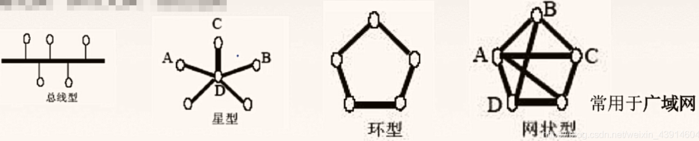
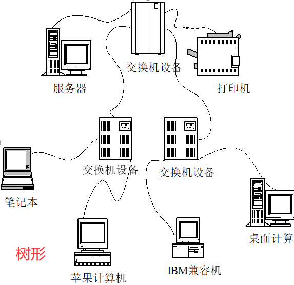
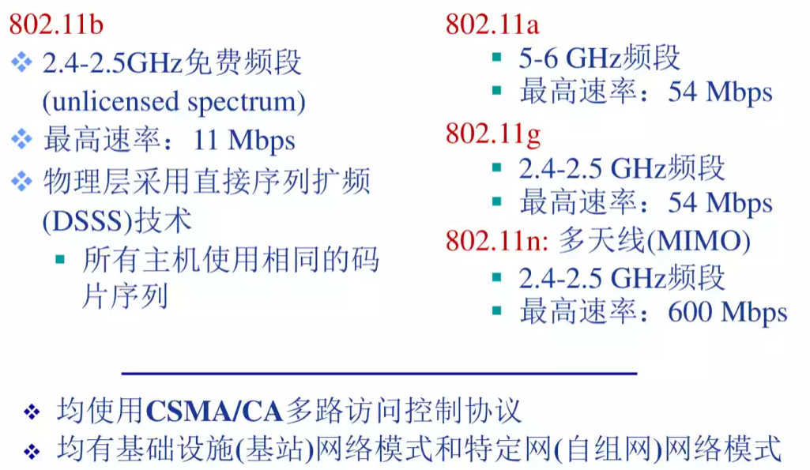

# 计算机网络原理

https://blog.csdn.net/weixin_42835409/article/details/107768971?spm=1001.2014.3001.5502

1:5200；2:4000；3:7200；4:8700；5:6700；6:4000；7:3300；8:6500

> 习题书错题本：
>
> - 第一章：选择题10、13
> - 第三章：P43 5 P44 14
>   - 数据链路层 滑动窗口协议用于 流量控制
> - 第四章：
>   - 习题第89 13题是重点
> - 5
>   - 习题书 P82 5，下面习题最后三题是重点

> - 重点
> - 计算机网络是**互连**的、**自治**的计算机集合
> - HTTP报文：起始行、首部行、空白行、实体主体
>   - 请求报文
>     - 方法、URL、协议版本
>   - 响应报文
>     - 协议版本、状态码、短语
> - 电子邮件的系统包括：**邮件服务器、简单邮件传输协议SMTP、用户代理和邮件读取协议**。
>   - SMTP发送邮件
>   - POP3接收邮件协议
> - 数据报类型套接字SOCK_DGRAM
> - 流式套接字SOCK_STREAM
> - 原始套接字SOCK_RAW
> - 顶级域名分为：国家顶级域名、通用顶级域名、基础结构域名。
> - DNS的概念
>   - 域名在通信时，必须要先请求DNS应用，将域名映射成IP地址。
>   - **分布式数据库**
>
> 
>
> - 不可靠传输表现：**比特差错、数据乱序、数据丢失**
> - TCP实现**可靠传输机制**包括
>   - **差错编码**
>   - **确认**，发送方 向 接收方 反馈接受状态
>   - **序号**，确保数据是否有序传输
>   - **重传**，发送方 重新向 接收方 发送数据
>   - **计时器**，解决数据丢失问题
>   - 以及数据传输协议，滑动窗口协议。
> - 拥塞控制策略分为：拥塞预防和拥塞拆除
>
> 
>
> - 网络层的主要功能
>   - 转发、路由选择
> - 拥堵的原因：
>   - 缓冲区容量有限；
>   - 传输线路的带宽有限；
>   - 网络节点的处理能力有限；
>   - 网络中某些部分发生了故障；
> - 拥塞预防：流量感知路由、准入控制
> - 拥塞消除：抑制分组、背压、负载脱落
> - **三要素**
>   - 从源主机到目的主机之间的**一条路径**
>   - 该路径上的每条链路各有一个**虚电路标志（VCID）**
>   - 该路径上每台分组交换机的转发表中**记录虚电路标识的接续关系**
> - DHCP
>   - 端口67。发现、提供、请求、确认
> - RIP距离向量路由算法、OSPF链路状态路由算法
> - ICMP：互联网控制报文协议
>   - 作用：在主机和路由之间实现差错信息报告
>   - 包含三个字段：类型8位、代码8位和校验16位
>
> 
>
> - 冲击噪声引起的差错称为突发操作
> - 噪声可分为：随机噪声和冲击噪声。
> - 差错控制的基本方式：检错重发、前向纠错、反馈校验、检错丢弃
> - FDM、TDM、WDM、CDM
> - 以太网帧结构（MAC地址格式）：目的地址、源地址、类型、数据、CRC。
> - ARP：IP地址到MAC地址的映射
> - MAC地址是48位
> - 以太网：冲突域、广播域
> - 交换机
>   - 多端口的网桥
>   - 优点：消除冲突、支持异质链路、网络管理
> - PPP
>   - 成帧
>   - 链路控制协议
>   - 网络控制协议
> - PPP
>   - 采用字节填充转义
> - HDLC
>   - 信息帧：首部字段是0
>   - 管理帧：首部字段10
>   - 无序号帧：首部字段11
>   - 面向位的协议。
> - VLAN划分虚拟局域网的方法：
>   - MAC地址划分
>   - 交换机端口划分
>   - 上层协议类型或地址划分
> - 物理链路分为：点对点链路、广播链路
> - 网桥是根据MAC帧的目的地址对接收到的帧进行转发。
> - 链路层协议能够向网络层提供哪些可能的服务？ P177
>
>   - 1）组帧
>   - 2）链路接入
>   - 3）可靠交付
>   - 4）差错控制
>
> 
>
> - 物理层接口规范包含：机械特性、电气特性、功能特性、规程特性
> - 通信系统根据信号的种类分为：模拟通信系统、数据通信系统。P215
> - 信道的定义分为：广义信道、侠义信道。
> - 广义信道分为：调制信道、编码信道。
> - 编码信道分为：无记忆编码信道、记忆编码信道。
> - 双相码：
>   - 正电平跳到负电平表示：1
>
> - 二进制**幅**移键控（2ASK）
>   - 1: W，0无
>
> - 二进制**频**移键控（2FSK）
>   - 1：WW 3山峰，0：W
>
> - 二进制**相**移键控（2PSK）
>   - 1：左低右高，反过来了！2个山峰
>   - 0：左高右低，
>
> - 二进制差分相移键控（2DPSK）
>   - 差分
>
> 
>
>
> - IEEE 802.11体系结构的基本构件：基站AP、基本服务集BBS。
> - IEEE 802.11：控制帧、数据帧、管理帧
> - LTE系统架构分为：演进后的核心网、演进后的接入网。P260
> - 演进后的核心网分为：移动管理实体、服务网关。P260
> - `※※※`**移动IP标准由三部分组成**
>   - 代理发现
>   - 向归属代理注册
>   - 数据报的间接路由选择
> - `※※※`**代理发现可以通过两种方式实现**
>   - 代理通告
>   - 代理请求
>
> 
>
> - **密码学包括**：密码编码学、密码分析学。P272
> - **传统加密方式**分为：替代密码、换位密码。P272
> - **换位密码**可分为：列置换密码和周期置换密码。
> - **对称密钥密码**分为：分组密码、流密码。
> - 分组密码：
>   - DES：分组64位、密钥56位
>   - 三重DES：两个密钥共112位
>   - AES：分组128位、密钥128/192/256位
>   - IDEA：分组64位、密钥128位
>
> - 网络安全通信所需要的基本属性：机密性、消息完整性、可抵赖性、身份认证
>
>   可访问与可用性：被授权的实体可以访问和使用的特性。
>
>   身份认证：是一个实体向另一个实体证明其身份的过程
>
> - 在网络安全中心，防止数据不受主动攻击的保护措施：报文认证。
>
> - **报文认证的方法**分为：简单报文认证、报文认证码MAC。
>
> - **数据签名分**为：简单数据签名、签名报文摘要。
>
> - 防火墙分为：无状态分组过滤器、有状态分组过滤器和应用网关。P286
>
> - IPSec的核心是：AH协议、ESP协议。
>
> - 隧道协议包括三种协议：乘客协议、封装协议、承载协议。
>
> - 网络安全典型威胁有哪些？ P271
>
>   - 报文传输方面：窃听、插入、假冒、劫持
>
>   - 拒绝服务DoS以及分布式拒绝服务DDoS
>
>   - 映射：探路，端口扫描
>
>   - 嗅探：混杂模式网络接口卡
>
>   - IP欺骗
>

## 第一章 概述

> 1.1 概念

- 计算机网络是**计算机技术**与**通信技术**相互融合的产物
- 计算机网络是**互连**的、**自治**的计算机集合
  - 自治：无主从关系
  - 互联：通过链路互联互通
- 网络通信实体之间在数据交换过程中需要遵循的规则或约定称为**网络协议**

> 1.1.1 网络协议的三要素

- **语法**：定义实体之间交换信息的**格式和结构**
  - 规则、信号电平
- **语义**：定义实体之间交换信息的**控制信息**（控制发送什么信息）
  - 发送何种控制信息、完成何种动作或相应、差错控制
- **时序**：定义实体之间交换信息的**顺序**以及**如何匹配彼此的速度**

> 1.1.3 计算机网络的功能

- 计算机网络的功能：硬件资源共享、软件资源共享、信息资源共享。

>  1.1.4 计算机网络的分类
>
>  **只有环形是适合采用光纤**

- **拓扑结构的分类**
  - 总线型
    - 用单根传输线把计算机连接起来
    - 优点：**易于扩展**；需求的电缆数量少；结构简单；
    - 缺点：**容易产生冲突**；通信范围受到限制；故障诊断和隔离较困难；

  - 星形
    - 有一个中央结点，依赖于中央节点，故障不扩散。
    - 优点：**易于监控与管理**；故障诊断与隔离容易；
    - 缺点：中央节点是网络瓶颈，一旦瘫痪则全网瘫痪；**网络规模受限于中央节点的端口数量**；
  - 环形
    - 所有计算机接口设备连**接成一个环**
    - 优点：**易于避免冲突；**电缆长度短；适合采用光纤；
    - 缺点：**节点的故障会引起全网故障**；新节点的加入和撤出过程较复杂；存在等待时间问题；（对环路的可靠性依赖强）
  - 网状形
    - 一般情况下，每个结点**至少**有两条路径**与其他结点相连**，多用于广域网
    - 优点：网络**可靠性高**；
    - 缺点：一条或多条线路故障时，网络仍可联通；（**线路冗余**）
  - 混合
    - 由两种以上简单拓扑网络混合连接形成
    - 优点：故障诊断和隔离较为方便；易于扩展；安装方便；
    - 缺点：网络结构复杂；管理与维护复杂；
  - 树形
    - 树型结构是总线和星形结构的扩展，树型网络是分层结构网络，具有根节点和分支节点。
    - 优点：**易于扩展；**故障隔离较容易；
    - 缺点：各个节点对根的依赖性太大，如果根发生故障，则全网不能正常工作；（**依赖根节点**）

> 1.2  计算机网络结构

- 按照范围分类
  - **个域网**：PAN，1-10m
    - 个人工作的地方将消费电子设备（如平板电脑、智能手机等）用无线技术连接起来的网络，也常称为无线个人区域网（WPAN）
  - **局域网**：LAN，10m-1km
    - 一般用微机或工作站通过高速线路相连。`传统上，局域网使用广播技术，而广域网使用交换技术。`
  - **城域网**：MAN，5~50km
    - 覆盖范围跨越几个街区甚至整个城市
  - **广域网**：WAN，几十~几千千米
    - 也称远程网。关于网提供长距离通信，通常是`几十千米到几千千米`的区域，比如跨国通信。

- **数据交换**是指：在网络边缘的主机之间实现相互的数据传输、信息交换
- 按网络交换分类
  - **电路交换**：
    - 建立电路->传输数据->拆除电路
    - 必须事先申请信道，通信期间始终占用该信道
    - 在源节点与目的节点直接建立一条专用的通路，用于传输数据。
  - 
  - **报文交换**：
    - **采用存储-转发交换方式**
    - 用户数据加上源地址、目的地址、校验码等辅助信息，然后**封装成报文**、这个报文传送到相邻结点，全部存储后，再转发给下一个结点，重复这一过程直到到达目的结点，每个报文可以单独选择到达目的结点的路径。
  - 
  - **分组交换**：
    - 也称**包交换网络**，ARPANet首先使用
    - 发送端将数据划分为等长的单位（分组）以**存储-转发方式进行传输**
    - 将分析交换需要的报文的**拆分**与**重组**
- 
  
- 三种交换的比较

- 按用户属性分类
  - 公有网
    - 国家或企业出资，面向公众提供收费或免费服务的网络
  - 私有网
    - 某组织出资，专门面向该组织内部业务提供网络传输服务，不想公众开放的网络

### 网络性能指标

> 1.4 计算机网络性能

- 常见的交换技术有：电路交换、报文交换、分组交换

- **速率**

  - 网络单位时间内所传送的数据量

  - `b/s、kb/s、Mb/s、Gb/s、Tb/s`

| 单位 | 带宽速率                                          | 存储内容（1Byte（字节）=8bit（比特）） |
| ---- | ------------------------------------------------- | -------------------------------------- |
| 千   | $1kb/s=10^3b/s$                                   | $1KB=2^{10}B=1024B=1024*8b$            |
| 兆   | $1Mb/s = 10^3kb/s = 10^6b/s$                      | $1MB=2^{10}KB=1024KB$                  |
| 吉   | $1Gb/s=10^3Mb/s = 10^6kb/s = 10^9b/s$             | $1GB=2^{10}MB=1024MB$                  |
| 太   | $1Gb/s=10^3Gb/s=10^6Mb/s = 10^9kb/s = 10^{12}b/s$ | $1TB=2^{10}GB$                         |

​    

- **带宽**
- 描述一条链路或信道的传输数据的能力
  - 赫兹：`Hz`
- **吞吐量**

  - 在单位时间内通过某个网络（信道、接口）所传输的数据量
- **时延**

  - 发送时延（传输时延）$d_t$
    - **节点**将分组的比特发送给（传输）链路所需要的时间。
    - `发送时延 = 分组长度（数据长度） / 信道宽度（发送速率）`
    - L（bits），R（bits/sec）
    - $d_t = L / R$
  - 传播时延$d_p$
    - 信号从发送端发出，经过物理链路到达接收端的时间
    - `传播时延 = 物理链路长度 / 信号传播速度`
    - $d_p = D / V$
  - 排队时延$d_q$
    - 分组在进入路由器后要先在输入队列中排队等待处理。因为路由器可能也同时在处理其他链路传过来的数据，所以需要等待。然后终于等到路由器来处理你的数据了，路由器处理完你的数据后，会给你一个转发端口，然后你就拿着这个端口号又在输出队列中排队等待转发，因为等待转发的不止你一个啊，路由器一下会处理很多的数据，这就产生了排队时延。
  - 节点处理时延（）$d_c$
    - 数据在交换结点为存储转发而进行的一些必要的处理所花费的时间。
    - 例如：分析分组的首部、从分组中提取数据部分、进行差错检验或查找适当的路由等
- **时延带宽积**，$G$
  - 指发送端发送的第一个比特即将到达终点时，发送端已经发出了多少个比特
  - 因此又称为**以比特为单位的链路长度**
  - `时延带宽积 = 传播时延×信道带宽`
  - $G = d_p * R$
- **丢包率**
  - Ns：发送分组总数。Nr：接受分组总数。N1：丢失分组总数
  - 丢包率：N1/Ns = (Ns - Nr) / Ns
- **信道利用率**
  - 指出某一信道有百分之多少的时间是有数据通过的。

### 计算机体系结构

> 1.5 计算机体系结构

- **OSI参考模型**
- **分层结构化技术**
  - 物理层
    - 传输单位：比特
    - 在**物理媒体**上实现比特流的**透明传输**
    - 透明传输：不管所传数据是什么样的比特组成，都应能够在链路上传输
    - 主要协议：Rj45、802.3
  - 数据链路层
    - 传输单位：帧
    - 将**源计算机的网络层**传下来的数据报，**组装成帧**，传输到目标计算机的网络层。
    - `点到点：主机到主机之间的通信，一个点指一个硬件地址或IP地址，网络中参与通信的主机通过硬件地址或IP地址标识的`
    - 主要协议：SDLC、HDLC、PPP、STP
  - 网络层
    - 传输单位：分组
    - 将**分组**从**源端传送到目的端**，为分组交换网上的**不同主机提供通信服务**。
    - 数据报和分组的关系：**当数据报过长可以切割成分组传输**
    - 功能：路由选择。流量控制。差错控制。拥塞控制。
  - 传输层
    - 传输单位：**报文段**
    - 为应用进程之间提供端到端的**逻辑通信**服务。
    - 端到端：运行在不同主机内的两个进程之间的通信，一个进程由一个端口号来标识。
    - 主要协议：IP、IPX、ICMP、IGMP、ARP、RARP、OSPF
  - 会话层
    - 会话层**允许不同主机上的各个进程进行会话**
    - **利用传输层提供的端到端的服务**，向**表示层提供它的增值服务**
    - 功能：建立或管理或终止绘画。使用校验点可使会话从**校验点/同步点**继续恢复通信，实现数据同步。
    - 主要协议：ADSP、ASP
  - 表示层
    - **处理两个通信系统中交换信息的表示方式**（语法和语义）
    - 使不同的数据和信息之间能够互相交换。
    - 例如：将二进制转为.jpg图片文件。数据的加密解密。数据压缩和恢复。将大文件压缩传输后，接收端再解压。
    - 主要协议：JPEG、ASCII
  - 应用层
    - 单位：报文
    - 用户与网络的界面、所有能和用户交换产生网络流量的程序
    - 典型的协议有：文件传输协议FTP、电子邮件协议SMTP、万维网HTTP等
  - **附录：总结**
    - **数据链路层：点对点通信（主机间通信）传输数据到目标网络层**
    - **网络层：使用分组交换，为网络上不同主机提供通信服务器**
    - **传输层：主机进程之间的通信，端到端，端口到端口**
    - **会话层：允许主机间各个进程直接的会话**
    - **表示层：处理通信系统间交换信息的方式**

- TCP/IP参考模型与OSI的特点

- 面向连接分为三个阶段：第一步：建立连接。第二步：传输数据。第三步：断开连接

- 而无连接就是直接进行数据传输

  |        | OSI参考模型     | TCP/IP          |
  | ------ | --------------- | --------------- |
  | 网络层 | 无连接+面向连接 | 无连接          |
  | 传输层 | 面向连接        | 无连接+面向连接 |

TCP/IP

| 报文   | 应用层     |
| ------ | ---------- |
| 段     | 传输层     |
| 数据报 | 网络互联层 |
| 帧     | 网络接口层 |

### 习题

> 重点

- 最广泛的数据交换协议：分组交换
- 手冲在ARPAnet上使用的网络交换方式：分组交换

- 关于计算题
  - 分组交换，例如有2个交换机，那么就是三段链路，那么你的传输时延要记得乘上3段链路

> - 两站点由5段链路组成，其中2段位卫星链路，每段链路由上行和下行组成，传播时延250ms，其他链路长1500km，传播速率150 000km/s。传输速率位48Kbps，帧长9600bit，求单程时延
>   - 1530ms，P17

> 教程习题

1.什么是计算机网络

2.网络协议的三要素是什么？每个要素的含义是什么？

3.计算机网络的功能是什么？

4.按网络覆盖范围划分，主要有哪几类计算机网络？各有什么特点？

5.按网络拓扑划分，主要有哪几类计算机网络？各有什么特点？

6.计算机网络结构主要包括哪几部分？每部分的主要功能是什么？

1. **网络边缘(newwork edge):**连接到网络上的所有端系统构成了网络边缘，网络边缘上的端系统运行分布式网络应用，在端系统之间进行数据交换，实现应用目的。
2. **接入网络(access network)：**实现网络边缘的端系统与网络核心连接与接入。常见的接入网络技术有(1)电话拨号接入(2)非对称数字用户线路ADSL(3)混合光纤同轴电缆HFC接入网络(4)局域网和移动接入网络。
3. **网络核心(newwork core):**由通信链路互连的分组交换设备构成的网络，作用是实现网络边缘中主机之间的数据中继与转发。

8.请简述电路交换工作过程以及电路交换的特点

- 在电路交换网络中，首先需要通过中间交换节点为两台主机之间建立一条专用的通信线路，称为电路，然后再利用该电路进行通信，通信结束后再拆除电路。利用电路交换进行通信包括建立电路、传输数据和拆除电路三个阶段。

- 电路交换的特点是：

  - 有连接的，在通信时需要先建立电路连接，通信过程中独占一个信道，通信结束后要拆除电路连接。

  - 时延和时延抖动都较小

  - 对于突发性数据传输，信道利用率低，且传输速率单一

9.什么是报文交换？什么是分组交换？试比较两者的优劣。

- **报文交换:**发送方把要发送的信息附加上发送/接受主机的地址及其他控制信息，构成一个完整的报文，然后以报文为单位在交换网络的各节点之间以**存储-转发**的方式发送，直至送达目的主机。
- **分组交换：**需要将带传数据(即报文)分割成较小的数据块，每个数据块附加上地址、序号等控制信息构成数据分组，每个分组独立传输到目的地，目的地将收到的分组重新组装，还原为报文。分组传输过程通常也采用存储-转发交换方式。

分组交换相比较于报文交换有以下优点:

1. 交换设备存储容易要求低
2. 交换速度快
3. 可靠传输效率高
4. 更加公平

12

- 1）$d_p=M/V$
- 2)$d_t=L/R$
- 3)t=Dp+Dt
- 4）
  - t=dt说明，分组已经发送出来了(在物理介质上传输)，因此结果是：`dt*V`
- 5）512=传播时延*带宽
  - $M/V*100Mbps=512$，题目给的
  - $M=512bits/100Mbps*250000km/s=1280m$
  - **因为M和Km都是同一单位，所以直接计算就可以。**
  - 一般来说100Mbps=100*10^6。*
  - 250000*10^3

14.假设主机A向主机B发送一个L=1500B的分组，主机A到大主机B的路径上有3段链路、2个分组交换机，3段链路长度分别为D1=5000km、D2=4000km、D3=1000km;每段链路的传输速率均为R=2Mbit/s，信号传输速率为V=250,000km/s，分组减缓及处理每个分组的时延为dc=3ms。试求：

1)若以存储-转发的分组交换方式，则该分组从主机A到达主机B的端到端时延是多少？

2)若dc=0，且不采取存储-转发的分组交换方式,而是分组交换机直接转发收到的每个分组(即直通交换)，则该分组从主机A到达主机B的端到端时延是多少?

- 1)

  - $d_c=3*2=6ms$，处理时延

    $d_t=L/R*3=1500B*8/(2*10^6)*3=0.018=18mss$，因为是三段传输所以除3

    $d_p=(D_1+D_2+D_3)/V=(5000km+4000km+1000km)/250,000km/s=0.04s=40ms$

    结果：6+18+40=64ms

- 2)

  - 直通交换是直接转发不存储，也就是丢弃 dc 的延迟。
  - 故：18+40=58ms

> 15

1)如果图中网络采用存储-转发的报文交换方式,则A将2Mbit的文件交付给C需要多长时间?B将1Mbit的文件交付给D需要多长时间?

2)如果图中网络采用存储-转发的分组交换方式,分组长度为等长的1kbit,且忽略分组头开销以及报文的拆装开销,则A将2Mbit的文件交付给C需要大约多长时间?B将1Mbit的文件交付给D需要大约多长时间?

3)报文交换与分组交换相比,哪种交换方式更公平?

- 1）
  - A->C：$2/10+2/20+2/10=0.5s=500ms$
  - B->D：$1/10+2/20(排队时延)+1/20+1/10=0.35s=350ms$
  - 虽然题目没说，必定是A先发送然后B在发送，**`所以需要加上排队时延`**，等待A发送完成。
- 2）
  - A需要发送：$2Mb/1Kb=2000个分组$
  - B需要发送：$1Mb/1Kb=1000个分组$
  - t=0到t=0.1s，A发送了1000个分组，用时 $1000b*1000个分组/10*10^6=0.1s$
  - 从t=0.1s开始，共享20Mb/s带宽，因此
    - A-C：$ 0.1s+1/10+1kb/10Mb+1kb/10Mb=0.2002s≈0.2s=200ms;$
    - B-C：$1/10+1kb/10Mb+1kb/10Mb=0.2002s≈0.2s=100ms;$
- 3）分组交换比报文交换更公平。

## 第二章 网络应用

- **应用层的功能**
  - 文件传输、访问、管理
  - 电子邮件
  - 虚拟终端
  - 查询服务、远程作业登录
- **重要协议**
  - FTP
  - SMTP、POP3
  - HTTP
  - DNS

> 2.1 计算机网络应用体系结构

- **客户/服务器（C/S）体系结构**
- 通信只在客户与服务器之间进行
- **纯P2P结构**
  - 每个对等端都是C/S应用，是客户和服务器的结合体
- **混合结构**

> 2.3 域名系统DNS

- **域名解析**
  - 将域名映射为IP地址的过程
  - 转换的工作由域名服务器来做，域名服务器需要建立分布式数据库
- **顶级域名**
  - 国家顶级域名
    - cn、us、uk
  - 通用顶级域名
    - com、net、org、gov、int、aero
  - 基础结构域名/反向域名
    - arpa

- **域名服务器的分类**
  - 本地域名服务器
  - 根域名服务器
  - 顶级域名服务器
  - 权威域名服务器
- 域名解析过程
  - 递归查询
    - 代替查询主机或其他域名服务器，进行进一步的域名查询，并将最终解析结果发送给查询主机或服务器
    - 举例：提出请求时首先在本地域名服务器里进行查找，若无最终解析成果。则从根域名服务器开始查询，若无最终解析成果，服务器会自己向另外的域名服务器发出查询请求。如此反复在得到最终解析成果后才会转交给主机。
  - 迭代查询
    - 将下一步要查询的服务器告知给客户端
    - 举例：提出请求时首先在本地域名服务器里进行查找，若无最终解析成果。则从根域名服务器开始查询，若无最终解析成果，则把下一步要查询的域名服务器响应给本地域名服务器。本地域名服务器再向上一步得到的域名服务器查询，如此反复直到得到最终解析成果交给主机。

> 2.4 万维网应用

### HTTP万维网应用

- **特点**
  - **HTTP是Web应用的应用层协议**，定义浏览器如何向服务器发送请求以及服务器如何向浏览器进行响应
- HTTP连接
  - **HTTP是基于传输层TCP传输报文**
  - 浏览器在向服务器发送请求之前，需要先建立TCP连接，然后才能发送HTTP请求报文，并接收HTTP响应报文

- HTTP 1.0 非持久连接
  - 建立TCP连接，然后获取数据，然后断开连接。
  - 例：
    - 建立连接`1RTT`+请求Web页`1RTT`
    - 建立连接`1RTT`+ 请求第1个图像`1RTT`
    - 建立连接`1RTT`+ 请求第2个图像`1RTT`
    - 共 6RTT
- HTTP 1.0 并行连接
  - 建立多条并行的TCP连接，并行发送HTTP请求和并行接收HTTP响应
  - 例：
    - 建立连接`1RTT`+请求Web页`1RTT`
    - 并行建立2个连接`1RTT`+ 并行请求2个图像`1RTT`
    - 共 4RTT
- **持久连接：重用已经建立的TCP连接**（只需建立一次TCP连接）
- 非流水持久连接
  - 也称**管道方式持久连接**，在**接受到前一个响应报文**后，才可以发送下一个对象的请求报文
  - 例：
    - 建立连接`1RTT`+请求Web页`1RTT`
    - 请求第1个图像`1RTT`
    - 请求第2个图像`1RTT`
    - 共 4RTT

- HTTP/1.1 流水式持久连接
  - 在接受到前一个对象的响应报文前，**可以连续依次发送对后续对象的请求报文**，然后在依次接受服务器发送的响应报文
  - 例：
    - 建立连接`1RTT`+请求Web页`1RTT`
    - 连续请求2个图像`1RTT`
    - 共 3RTT

- **HTTP报文**
- 报文组成
  - 起始行、首部行、空白行、实体主体
- 报文分类
  - 请求报文
    - 方法、URL、协议版本
  - 响应报文
    - 协议版本、状态码、短语
- HTTP典型请求的方法
  - GET
    - 读取URL所标识的信息
  - HEAD
    - 读取URL所标识信息的头部
  - POST
    - 给服务器添加信息
  - OPTION
    - 请求一些选项的信息
  - PUT
    - 指名URL下一个存储的文档
- 状态码就是：200 300 这些 code

> 2.5 Internet电子邮件

- 电子邮件的系统包括：**邮件服务器、简单邮件传输协议SMTP、用户代理和邮件读取协议**。
- 邮件服务器功能：发送和接收邮件

- SMTP：应用层协议，使用传输层TCP进行可靠数据传输
- POP3：邮件读取协议
- IMAP：邮件访问协议，支持用户创建文件夹并为邮件指定文件读取协议。
- 总结
  - SMTP发送邮件
  - POP3接收邮件

### Socket编程基础

> 2.8 Socket编程基础

- Socket通过调用传输层接口
- **数据报类型套接字SOCK_DGRAM**
  - 对应UDP服务
- **流式套接字SOCK_STREAM**
  - 对应TCP接口
- **原始套接字SOCK_RAW**
  - **绕过传输层**，直接调用网络层

- **基于TCP的Socket编程**

- 第一步：初始化

  - 服务器**获取端口号**
    - `ms = socket()`
  - 服务器绑定端口号
    - `bind(ms)`
  - 服务器等待连接请求
    - `listen(ms)`
  - 客户**获取端口号套接字**
    - `cs = socket()`

- 第二步：双方建立请求

  - 客户**建立连接**（客户→服务器发送请求）
    - `connect(cs)`
  - 服务器**接受请求**
    - `ss = accept(ms)`

- 第三步：数据（请求）

  - 服务器**等待数据传输**
    - `recv(ss)`
  - 客户**发送请求**
    - `send(cs)`

- 第四步：数据（应答）

  - 客户**等待数据传输**
    - `recv(cs)`
  - 服务器**发送请求**（返回响应信息）
    - `send(ss)`

- 第五步：关闭TCP连接

  - 客户关闭
    - `close(cs)`

  - 服务器关闭（**关闭的是与这个TCP客户的连接**）
    - `close(ss)`
  - 服务器关闭监听端口（可以理解为 关机了）
    - `close(ms)`

- **基于UDP的Socket编程**

- 第一步：初始化

  - 服务器**获取端口号**
    - `ums = socket()`
  - 服务器绑定端口号
    - `bind(ums)`
  - 客户**获取端口号套接字**
    - `ucs = socket()`

- 第三步：数据（请求）

  - 服务器**等待数据传输**
    - `recvfrom(ums)`
  - 客户**发送请求**
    - `sendto(ucs)`

- 第四步：数据（应答）

  - 客户**等待数据传输**
    - `recvfrom(ucs)`
  - 服务器**发送请求**（返回响应信息）
    - `sendto(ums)`

- 第五步：关闭端口

  - 客户关闭
    - `close(ucs)`

  - 服务器关闭端口
    - `close(uss)`

### 习题

> 重点

- DNS的概念
  - 域名在通信时，必须要先请求DNS应用，将域名映射成IP地址。
  - **分布式数据库**

- 端口号
  - FTP 21
  - TELNET 23
  - SMTP 25
  - POP3 110
- 电子邮件的系统包括：**邮件服务器、简单邮件传输协议SMTP、用户代理和邮件读取协议**。
- 因特网的传输地址由IP地址和主机 **端口号** 组成。
- 顶级域名分为：国家顶级域名、通用顶级域名、基础结构域名。
- Email的格式是：用户名@主机域名

> 

1. 计算机网络应用可以分为哪几种体系结构的应用类型？各种应用类型的特点是什么？

- **客户端/服务器(C/S):**通信只在客户与服务器之间进行，客户与客户之间不进行直接通信。
- **纯P2P结构:**没有一直在运行的传统服务器，所有通信都是在对等的通信方之间直接进行。P2P应用中的每个对等断都同时具备C/S应用的客户与服务器的特征，是一个服务器与客户的结合体。
- **混合结构:**将C/S应用与P2P应用结合，既有中心服务器存在，又有对等端(客户)间的直接通信。

2.为什么说客户端服务器通信方式是网络应用通信的基本方式？

- 网络应用的基本通信过程就是运行在不同主机上的应用进程间以C/S方式进行通信。

3.网络应用通信中，需要那些信息标识一个应用进程？P53

- 通过进程运行的**主机IP地址**以及其**套接字**所绑定的**端口号**可以标识应用进程。

4.简述域名系统的层次结构 P55

5.请举例说明，什么是DNS递归解析过程？什么是DNS迭代解析过程？

- **递归查询**：提供递归查询服务的域名服务器，可以代替查询主机或其他域名服务器，进行进一步的域名查询，并将最终解析结果发送给查询主机或服务器
- **迭代查询**：提供迭代查询的服务器，不会代替查询主机或其他域名服务器，进行进一步的查询，只是将下一步要查询的服务器告知查询主机或服务器(当然，如果该服务器拥有最终解析结果，则直接响应解析结果)

6.什么是本地域名服务器？主机是如何确定本地域名服务器的？

- 主机在任何时候需要进行域名解析，都会将域名查询请求发送给本地域名服务器。该服务器如果保存了被查询域名信息，则直接作出响应；如果没有则代理查询其他域名服务器，知道查询到结果，最后将查询结果发送给主机。
- 任何一台主机在网络地址配置时，都会配置一个域名服务器作为默认域名服务器，这个默认域名服务器称为本地域名服务器。主机是自行配置来确定本地域名服务器的。

7.简述HTTP1.0获取一引用10个小JPEG图片网页的通信过程。 P59

- HTTP客户进程向服务器的端口(如80)请求建立TCP连接，服务器收到连接确认，建立一个TCP连接。
- HTTP客户进程基于已建立的TCP连接向服务器发送一个HTTP请求报文。请求报文中包含了路径名。
- HTTP服务器进程接受该请求报文，从指定的路径中检索出文件，并封装到一个HTTP响应报文中，发送给客户进程。
- HTTP服务器进程通知TCP断开该TCP连接
- HTTP客户端收响应报文，断开TCP连接。游览器从响应报文中提取出HTML文件，进行解析显示，并获知还有10个JPEG图片的引用。
- 对每个引用的JPEG图片，重复前4个步骤。

8.什么是非持久HTTP？什么是非流水方式的持久HTTP？什么是流水方式的持久HTTP？简述交互过程。P60

9.假设你在浏览某网页时点击了一个超链接，URL为“https://www.kicker.com.cn/index.html”，且该URL对应的IP地址在你的计算机上没有缓存；文件index.html引用了8个小图像。域名解析过程中，无等待的一次DNS解析请求与响应时间记为RTTd，HTTP请求传输Web对象过程的一次往返时间记为RTTh。请回答下列问题： 

1）你的浏览器解析到URL对应的IP地址的最短时间是多少？最长时间是多少？

2）若浏览器没有配置并行TCP连接，则基于HTTP1.0获取URL链接Web页完整内容（包括引用的图像，下同）需要多长时间（不包括域名解析时间，下同）？

3）若浏览器配置5个并行TCP连接，则基于HTTP1.0获取URL链接Web页完整内容需要多长时间？

4）若浏览器没有配置并行TCP连接，则基于非流水模式的HTTP1.1获取URL链接Web页完整内容需要多长时间？基于流水模式的HTTP1.1获取URL链接Web页完整内容需要多长时间？

- 1）
  - 最短：RTTd
    - 如果本地域名解析服务器中包含要访问的URL所对应的IP地址时只需RTTd
  - 最长：5RTTd
    - 本地→根域名→**com.cn一级域名**→**cn-com二级域名**→权威，一`最长时间一共5个RTTd`
    - 这里要分清楚一级域名和二级域名，如果给的地址是www.baidu.com，那么只需要4个RTTd因为访问的不是二级域名。
- 2）HTTP1.0
  - 没有配置并行TCP，那么获取一个对象就需要`2个RTTh`，**一来一回**。
  - 答：8个图片文件+index.html文件=9个对象。故$2*9=18RTTh$
    - 获取一个对象的流程：建立请求->请求图片/返回图片。2个RTTh
- 3）
  - 5个并行，先获取index.tml文件，然后在让8个图片分两次传输。
  - index需要2个RTTh，8次图片分两次需要：2*2=4次RTTh
  - `答：2+4=6RTTh`
- 4）
  - HTTP1.1的特点：非并行，只需建立一次连接。
  - 无流水：2(请求index) + 8(八个图片)=10RTTh
  - 流水：2+1=3RTTh
    - 流水模式下，发出应用对象请求，返回所有引用对象。故8个图片文件只需1个RTTh

10.电子邮件主要由那几部分构成？P67

- 邮件服务器、简单邮件传输协议（SMTP）、用户代理和邮件读取协议。

12.FTP的“带外控制”特性是什么含义？控制连接和数据连接各有什么特点？用途分别是什么？P74

- **带外控制：**由于FTP专门使用一个独立的控制连接传输控制信息，与传输文件信息进行分离，所以将FTP这种控制信息的传送方式称为带外控制
- **控制连接：**会在整个会话期间一直保持打开，是持久的。
  - 用途：控制连接用于在客户与服务器之间传输控制信息。
- 数据连接：是临时的，非持久的。数据传输结束便断开连接
  - 用途：数据连接用于实际传送文件内容

13.考虑向N个对等方（用户）分发F=15Gb的一个文件。该服务器具有us=30Mbps的上传速率，每个对等方的下载速率di=2Mbps，上传速率为u。请分别针对客户-服务器分发模式和P2P分发模式两种情况，对于N=10、100和1000以及u=500kbps、1Mbps和2Mbps的每种组合，绘制最小分发时间图表。

- N=客户数量、F文件大小、us服务器上传速度、u是客户下载速度
- C/S的公式
  - `NF/us`：客户数量×文件大小÷服务器上传速度
  - `F/min(di`：文件大小÷客户下载速度
  - **结果取一个最大值**
- P2P的公式
  - `F/min(di`：文件大小÷客户下载速度
  - `F/us`：文件大小÷服务器上传速度（这个公式不用急，一般用不到。
  - `NF/(us+Σui)`：客户数量×文件大小÷（服务器上传速度+所有客户的上传速度和）
  - 三个值中取最大。

| N        | C-S      | P2P         | P2P       | P2P       |
| -------- | -------- | ----------- | --------- | --------- |
| **N**    | **C-S**  | **500kbps** | **1Mbps** | **2Mbps** |
| 10       | 7500     | 7500        | 7500      | 7500      |
| 100      | $50000$  | 18750       | 11539     | 7500      |
| 1000     | $500000$ | 28302       | 14563     | 7500      |
| 用户数量 | 下载时间 |             |           |           |

## 第三章 传输层

> 3.1 传输层基本服务

- 传输层实现：``传输层寻址``。对应用层报文进行分段和重组，对报文进行差错检测，实现应用进程之间**端到端**的逻辑通信服务。
- 网络层发送过去就不管了，**传输层要判断接受到的数据是否有丢失**，有就要**告诉给对方的传输层叫他多发一次**

> 3.3 停一停协议与滑动窗口

- 窗口尺寸是N，最多有N个等待确认的消息，
- 滑动窗口协议：
  - Ws发送窗口大小，Wr接收窗口大小
  - 停等：
    - $Ws=1,Wr=1$
    - 发送一个，等待接收一个
  - GBN
    - 回退N步，GO BACK N。按顺序接收
    - $Ws\geq1,Wr=1$
    - 例如：连续发送1234，134收到了,但是2没收到，那么需要回退到2那,重发234！！。
  - SR：选择重传
    - 例如：发送1234，134收到了,但是2没收到，那么需要重传2。
    - $Ws>1,Wr>1$

> - GBN和SR的归纳
> - GBN
>   - 发送方：对当前发送窗口的“基序号”指向的分组进行计时，超时则重传当前发送窗口中所有已发送但未被确认的分组。
>   - 接收方：
>     - 一次只能接收一个序号，即(只能接收当前接收窗口中的序号)。
>     - 当收到的分组序号不为 `n`时丢弃分组
>       - 例收到1号分组相应ACK1，2分组丢失，收到3分组后续依旧响应ACK1（此时n=2，因新的n=3, 不为2故响应ACK1）
> - SR
>   - 发送方：哪个分组超时则重发哪个分组
>   - 接收方
>     - 接收的序号是接收窗口的第一个时，缓存分组并将分组向上层交付，滑动接收窗口到当前未正确接收到的最小序号
>     - 接收的序号是接收窗口中其中一个时(不是第一个)，发送ACKn

- GBN工作过程
- GBN发送方必须响应三种类型的
  - **上层调用：**当上层调用GBN协议时，发送方首先检查发送窗口是否已满，即是否有Ws个已发送但未被确认的分组，如果窗口未满，则用“下一个可用序号”编号新的分组并发送，并更新“下一个可用序号”；如果窗口已满，发送方则暂不响应上层调用，拒绝发送新的数据。
  - **收到一个ACKn：**GBN协议采用累积确认方式，即当发送方收到ACKn时，表明接收方已正确接收序号为n以及序号小于n的所有分组。如果n在当前发送窗口范围内，则表明至少1个已发送未被确认分组得到了确认，发送窗口滑动在“基序号”为n+1的位置；
  - **计时器超时：**GBN协议发送方只使用1个计时器，且只对当前发送窗口的“基序号”指向的分组进行计时。如果超时，发送方重传当前发送窗口中所有已发送但未被确认的分组。
- GBN 接收方
  - 因为Wr=1，所以GBN接收方只能接收当前接收窗口中的序号（即基序号）所指向的分组。假设当前接收窗口中的序号为n，如果接收方正确接收到序号为n的分组，则接收方发送一个ACKn，将该分组中的数据部分交付到上层，接收窗口滑动到序号n+1的位置。
  - 若收到的分组序号不为n或分组差错等，接收方丢弃该分组，并为最近按序接收的分组重新发送ACK，即ACKn-1。

- SR工作过程
- SR发送方主要响应的3个事件
  - **上层调用，请求发送数据：**当从上层接收到数据后，SR发送方检查“下一个可用序号”是否位于当前发送窗口范围内。如果“下一个可用序号”位于发送方窗口内，则将数据封装成SR分组，并用“下一个可用序号”进行编号，发送给接收方；否则将数据缓存或者返回给上层以便以后传输。
  - **定时器超时：**与GBN不同的是，SR协议在发送方对每个已发送分组进行计时。当某个已发送未被确认分组的计时器超时时，发送方重发该分组。
  - **收到ACKn：**发送方收到ACK后，需要对确认的序号n进行判断。若n在当前发送窗口范围内，则SR发送方将该序号标记为已接收；进一步，若n等于发送基序号，则发送窗口向右移动到具有最小序号的未被去确认分组的序号处。
- SR发送方主要响应的3个事件
  - **正确接收到序号在接收窗口范围内的分组PKTn：**分组序号n落在接收方窗口序号空间内，接收方则向发送方发送ACKn。如果**n不等于“接收基序号”且是第一次被接收到**，则缓存该分组；如果n=“接收基序号”，则将**该分组及原来收到的、序号与n连续的分组一并向上层交付**，并将接收窗口的“接收基序号”滑动到当前未正确接收到的最小序号。
  - **正确接收到序号在接收窗口左侧的分组PTKn：**分组序号n<“接收基序号”，这些分组在此之前已经正确接收并向上层提交，因此接收方丢弃PKTn（重复分组），并向发送方发送ACKn，对PTKn进行确认。
  - **其他情况：**接收方可以直接丢弃分组，不做任何响应。

- TCP滑动窗口和GBN协议的异同
  - TCP滑动窗口协议：实质上就是将可靠数据传输的工作，抽象到分组序号空间，即发送方确保分组按序发送，接收方确保分组按序提交。发送方和接收方各维护一个窗口，分别称为发送窗口Ws和接收双扣Wr。
  - 异同：
    - GBN接收窗口只有1个，TCP可以有多个
    - GBN只能接收基序号指向的分组无缓存能力，TCP可以接收接收窗口范围里基序号和非基序号的多个分组。

- ACK：确认到序列号n的分组已被接收。可能受到重复的ACK

- 不可靠传输表现：**比特差错、数据乱序、数据丢失**
- 可靠传输的措施：**差错检测、确认、重传、序号、计时器**

- **TCP可靠数据传输是基于滑动窗口协议**

- 对应用进程进行表示——**端口号**
- 端口能够让应用层的各种应用进程将其数据通过端口向下交付给传输层，以及让传输层知道应当将其报文段中的数据向上通过端口交付给应用层相应的进程。
- 传输层是**通过判断端口号**，判断数据交给哪个**应用进程**
  - IP地址 + 端口号，唯一标识一个通信端点
  - 传输层端口号为16位，三类端口
  - 熟知端口号，0 ~ 1023
  - 登记端口号，1024 ~ 49151，必须在IANA上等级
  - 客户端口号或短暂端口号，49152 ~ 65535，端口号不固定，动态
- 常用端口号：

- 传输层提供的服务有
  - 无连接服务
    - UDP
  - 面向连接服务
    - TCP

### UDP

> 3.4 UDP用户数据报协议

- **特点**：无连接、不可靠、数据报尽力传输服务
- 之所以在UDP上构建应用因为：
  - 容易控制数据何时发送
  - 无需建立连接
  - 无连接状态
  - 首部开销小（UDP只有8B，而TCP有20B）

- **UDP数据报格式**

### TCP

> 3.5 TCP传输控制协议

- **特点**：面向连接、可靠、有序、字节流传输服务
- **面向连接的传输层协议**
- TCP实现**可靠传输机制**包括
  - **差错编码**
  - **确认**，发送方 向 接收方 反馈接受状态
  - **序号**，确保数据是否有序传输
  - **重传**，发送方 重新向 接收方 发送数据
  - **计时器**，解决数据丢失问题
  - 以及数据传输协议，滑动窗口协议。
- **TCP报文段格式**
  - **序号**
    - 该段所封装的应用层数据的第一个字节的序号
  - **确认序号**
    - 期望从对方接受数据的字节序号
  - **数据偏移（首部长度）**
    - TCP段的首部长度
    - 单位为4字节，这里最大是15（1 1 1 1），那么就是15*4B=60B，那么TCP首部就有60个字节
  - **标志位**
    - URG，紧急指针位，为1时表示→**尽快传输，无需在TCP缓存排队**
    - ACK，确认位，在连接建立后所有传送的报文都**必须为1**
    - PSH，快速提交，为1是表示→**尽快交给接受应用进程**（push）
    - RST，复位，为1是表示→**重新建立连接**（restart）
    - SYN，同步请求，为1是表示→**双方连接建立，和对方协商确认**
      - 第一步：A向B发送，表示请求连接
      - 第二步：B想A发送，接受连接，然后就建立了连接
    - FIN，终止位，为1是表示→通信结束后拆除连接
  - **接收窗口**
    - 用于向对方通告接受窗口大小
  - **检验和**
    - 提供了差错检测功能
  - 选项
    - 最多40字节
  - **填充**
    - 长度为0~3字节，取值全0。
    - 保证首部长度为 4字节 的倍数

> 3.3 TCP可靠传输

- **连接建立——三次握手**
  - 须知
    - ACK=1时，那么ack=x+1此为**确认号字段**
      - 确认号填的是：**期待对方发送的第一个字节**
    - 建立起连接以后，每次传输都都必定包含：ACK=1
  - 第一次握手：客户端→服务端
    - 客户端作为连接建立发起端，选择客户端初始序列号x，向服务器发送（SYN=1,seq=x）的SYN段，客户状态由LISTEN进入SYN_SEND状态，等待服务器确认。
  - 第二次握手：服务端→客户端
    - 服务器收到客户发送的SYN段后，选择服务器初始序列号y，向客户发送(SYN=1,ACK=1,seq=y,ack_seq=x+1)的SYNACK段，同时服务器状态由LISTEN进入SYN_RCVD状态。
  - 第三次握手：客户端→服务端
    - 客户端收到服务器的SYNACK段后，向服务器发送(ACK=1,seq=x+1,ack_seq=y+1)的ACK段，同时，客户端进入ESTAB-LISHED状态，客户端确认连接已建立；当服务器收到ACK段后，也进入ESTAB-LISHER状态，也确认连接已建立。至此，双方确认连接建立成功

- **连接建立——四次挥手（连接释放）**
  - 第一步：
    - 发送一个FIN段(FIN=1,seq=u),请求断开客户到服务器的链接，其状态由ESTAB-LISHED进入FIN_WAIT_1,在这一状态下，只能接收服务器发送过来的数据，而不再发送数据。需要注意的是，FIN段不封装应用层数据，但是也要消耗掉1个序列号(类似于SYN段)
  - 第二步：
    - 服务器受到客户的FIN段后，向客户发送一个ACK段(ACK=1,seq=v,ack_seq=u+1),ACK段可以封装应用层数据(如果有)。服务器状态由ESTABLISHED进入CLOSE_WAIT，在这一状态下，服务器仍然可以发送数据，但不再接受数据。当客户收到ACK段后，其状态由FIN_WAIT_1进入FIN_WAIT_2，仍然可以接受来自服务器的数据。此时的TCP连接已经关闭了客户向服务器方法的数据传输，故也称半关闭。
  - 第三步：
    - 当服务器向客户发送完最后一个数据段后，服务器向客户发送FIN段（FIN=1，ACK=1，seq=w，ack_seq=u+1），同样，该FIN段也不绣袋应用层数据。服务器状态则由CLOSE_WAIT进入LAST_ACK,此时服务器也不再发送数据。
  - 第四步：
    - 当客户收到服务器发送的FIN段后，向服务器发送ACK段(ACK=1,seq=u+1,ack_seq=w+1)，其状态由FIN_WAIT_2进入TIME_WAIT,等待2MSL时间，然后进入CLOSED状态，最终释放连接；服务器再收到最好一次ACK段后，状态由LAST_ACK进入CLOSED，最终释放连接。

- 状态转移：
  - 断开连接过程中，客户端状态名称与含义如下：ESTAB-LISHED状态，表示可以传送数据；FIN_WAIT_1终止等待1状态，等待服务器端确认；FIN_WAIT_2 终止等待2状态，等待服务器端发出的连接释放报文段；TIME_WAIT时间等待状态，表示等待2倍MSL时间后进入关闭状态CLOSED。
  - 断开连接过程中，服务器端状态名称与含义如下：ESTABLISHED状态，表示可以传送数据；CLOSED_WAIT关闭状态；LAST_ACK最后确认状态；CLOSED关闭状态。

### 拥塞控制

> 3.5 TCP拥塞控制

- **概念**
  - 指**太多的主机**以**太快的速度**向网络中**发送太多的数据**，**超出了网络处理能力**，导致大量数据分钟“拥挤”在**网络中间设备等待转发**。
- **后果**
  - **数据分组通过网络的时延显著增加**
  - **由于队列满导致大量分组被丢弃**
- **ssthresh**
  - 慢开始门限，从慢开始到拥塞避免。
- 实现方法
  - 拥塞控制的基本思想是AIMD。拥塞窗口的调整主要分为慢启动阶段和拥塞避免阶段，在慢启动阶段，每受到一个确认段，拥塞窗口增加一个MSS，每经过一个RTT，拥塞窗口增长一倍；在拥塞避免阶段，每经过1个RTT，拥塞窗口增加1个MSS。

- **慢开始和拥塞流程**
  - 0~4
    - **拥塞窗口CongWin**，从1开始，是**指数增加**，（1 2 4 8 16）
  - 4~12
    - **拥塞窗口**到16的时候就到达了**慢开始门限（ssthresh）的初始值位置**，因此进入**拥塞避免（加法增大）**，**每次加一**
  - 12~17
    - **当拥塞窗口满了**，发生了网络拥塞，丢包的现象。然后就将**拥塞窗口缩小到1**
    - 而**新的慢开始门限（ssthresh）值**等于**发生拥塞时的拥塞窗口大小除以二**
    - **拥塞窗口CongWin**，从1开始，是**指数增加**，（1 2 4 8 12）
  - 以此类推

- **快重传和快恢复**
  - **冗余ACK**（三个重复的确认）当拥塞窗口CongWin满了时，收到三个**冗余ACK**，就执行快重传和快恢复。
    - 例如A向B发送数据
      - M1、M2、M3、M4、M5
    - 然后在这其中，**M2丢失了**
    - B向A发送**确认请求**
      - B收到了M1的请求
        - **然后向A发送，ACK=M2，期望收到M2**
      - B收到M3的请求（M2已经丢失）
        - **然后向A发送，ACK=M2，期望收到M2**
      - B收到M4的请求（M2已经丢失）
        - **然后向A发送，ACK=M2，期望收到M2**
    - **此时A收到了3个重复的确认请求，M2**
  - 0~11
    - 和慢开始一样
  - 12~13
    - 当收到**三个重复的确认（冗余ACK）**，**立马执行快重传算法**
    - 然后执行**快恢复**，将拥塞窗口降到**新的慢开始门限（ssthresh）**的位置
    - 而**新的慢开始门限（ssthresh）值**=**收到三个重复的确认（冗余ACK）时拥塞窗口的值除以二**

### 习题

> 重点

- TCP
  - 面向连接、可靠、有序、字节流
  - 全双工通信服务
  - 可靠数据传输基于：滑动窗口
- 流水线可靠传输协议是：滑动窗口协议
- UDP校验和提供：差错检测
- 拥塞控制策略分为：拥塞预防和拥塞拆除

> 作业5-1,例题1：A向B发送5个连续报文，第二个报文段丢失，其余以及重传的第二个报文段均被B正确接收，报文段从1开始连续编号。请回答下列问题：
>
> 1)如果分别采用GBN、SR和TCP协议，则对应这三个协议，主机A分别总共发了多少个报文段？主机B分别总共发送了多少个ACK？它们的序号是什么？(针对3个协议分别给出解答）
>
> 2)如果对上述三个协议，超时时间比5RTT长得多，那么哪个协议将在最短的时间间隔内成功交付5个报文段？
>
> - 1）
>   - GBN：回退N步，重新发送。
>     - A：发送报文段1,2,3,4,5。报文段2丢失，则重发`2,3,4,5`。结果：A总共发送了`5+4=9`个报文段
>     - B：发送**ACK1**，2丢失,收到345，**对此发送3个ACK1**。后续重传2,3,4,5分别响应ACK2,3,4,5。结果：B总共发送`4+4=8`个报文段
>   - SR：选择重传
>     - A：重发`2`。结果：A总共发送了`5+1=6`个报文段
>     - B：发送ACK1,3,4,5。收到重传的2则发送ACK2。结果：B总共发送`4+1=5`个报文段
>   - TCP：发送端只需重传丢失的报文段,类似SR。接收端会重复发送**`期望得到`**的报文段。
>     - A：和SR流程相同，6个
>     - B：发送4个ACK2，（期望收到ACK2。重传后响应ACK6。结果：B总共发送`4+1=5`个报文段
>   - 采用TCP协议可在最短的时间间隔内成功交付5个报文段，因为TCP有**快速重传机制**，即在未超时情况下就开始重传丢失的2号报文段
>
> 

例题5-2,例3：假设A、B两个端系统通过唯一的一条8Mbps链路连接（M=10^6），该链路的双向传播时延是150ms；A通过一个TCP连接向B发送一个大文件，B的接收缓存足够大，每个TCP段最大段长度（MSS）为1500字节，TCP采用Reno版本，且总是处于拥塞避免阶段（即忽略慢启动）。请回答下列问题：

1).该TCP连接能够获得的最大窗口尺寸（以TCP段数计）是多少？

2).该TCP连接的平均窗口尺寸（以TCP段数计）和平均吞吐量（以bps计）是多少？

3).该TCP连接的拥塞窗口从发生丢包到恢复到最大窗口尺寸要经历多长时间？

- **`公式补充1：最大窗口大小`**
  - `W`：最大窗口大小、`MSS`：每个TCP最大段长度、`RTT`：**一个来回的时延**
  - `R`：链路链接（bps）
  - $R=W*MSS/RTT$
- 公式2：平均窗口大小：$We=0.75*W$
  - 最大窗口大小的75%
- 公式3：平均吞吐量：$WE*MSS/RTT$
  - **平均窗口大小  ×  TCP最大段长度  ÷  时延**
- 公式4：拥塞窗口丢包后**`恢复`**到最大窗口尺寸的时间，最大的窗口减半。
  - $T=W/2*RTT$

- 1）求W
  - $8*10^6=W*(1500*8)/(150*10^{-3})$
  - $W=8*10^6*(150*10^{-3})/(1500*8)=100$
  - **`要注意：RTT的单位是秒，而MSS的单位是b。`**
- 2）
  - 平均窗口大小是：$0.75*W=0.75*100=75$
  - 平均吞吐量：$WE*MSS/RTT=6Mbps$
- 3）
  - 最大的窗口减半（100/2=50）50就作为`新的阀值`
  - $T=W/2*RTT=7.5S$

> 

1.实现可靠传输的主要措施有那些？这些措施主要用于解决那些问题？ P98

- **差错检查：**利用差错编码实现数据包传输过程中的比特差错检测。
- **确认：**接受方向发送方反馈接受状态。
- **重传：**发送方重新发送接收方没有正确接收的数据
- **序号：**确保数据按序提交。
- **计时器：**解决数据丢失问题。

2.UDP与TCP分别如何实现复用分解？ P94

- UDP套接字为：**<目的IP地址，目的端口号>**
- TCP套接字为：**<源IP地址，源端口号，目的IP地址，目的端口号>**

3.请画出TCP报文段结构，并简要说明个字段的主要作用。 P113

4.TCP为何采用三次握手来建立连接，若采用二次握手可以吗？为什么？

- 不可以，三次握手是为了确保连接双方彼此完全清楚对方状态，从而保证可靠、稳定地建立连接；

- 若采用二次握手因为网络存在数据丢失，第二次握手控制段可能丢失，这样主动发起连接的一方由于没有受到第二次握手控制段，则无法建立连接，而接受连接建立的一方则认为连接已建立，从而出现无效连接。

5.请说明TCP建立连接与断开连接的过程，并给出主要状态转移。 P116

6.TCP如何保证可靠数据传输？ P119

- 靠TCP的可靠传输实现实现机制差错编码、确认、序号、重传、计时器、流量控制和拥塞控制。以及数据传输协议，滑动窗口协议。

7.请分别简述GBN协议和SR协议的工作过程。 P105

- GBN
  - ①如果发送方收到一个ACK，窗口滑动后仍有已发送但未被确认的分组，则定时器重新启动；如果没有已发送但未被确认的分组，该定时器终止。
  - ②因为接收窗口Wr=1，所以GBN接收方只能接收当前接收窗口中序号所指向的分组，未按序到达的分组或者某个分组差错，接收方丢弃该分组，并为最近按序接收的分组重新发送ACK。
- SR
  - ①增加接收方缓存能力（接收窗口>1），缓存正确到达但失序的分组，
  - ②仅要求发送方重传未被接收方确认的分组，等缺失分组到达后一并向上层按序提交。

8.请说明TCP滑动窗口机制，对比TCP滑动窗口与GBN协议的异同。 P104

- TCP滑动窗口协议：实质上就是将可靠数据传输的工作，抽象到分组序号空间，即发送方确保分组按序发送，接收方确保分组按序提交。发送方和接收方各维护一个窗口，分别称为发送窗口Ws和接收双扣Wr。
- 异同：
  - GBN接收窗口只有1个，TCP可以有多个
  - GBN只能接收基序号指向的分组无缓存能力，TCP可以接收接收窗口范围里基序号和非基序号的多个分组。

10.TCP如何实现拥塞控制？ P124

- 慢启动
- 拥塞避免
- 快速重传
- 快速恢复

11.假设甲乙双方采用GBN协议发送报文段，甲已经发送了编号为0~7的报文段。当计时器超时时，若甲只收到0号和3号报文段的确认，则甲需要重发的报文段是哪些？ P105

- 4、5、6、7
  - GBN采用累积确认方式，即是正确接收3以及小于的所有分组

> 重点

12.主机甲乙通过128 kbit/s 卫星信道互连，采用滑动窗口协议发送数据，链路单向传播时延为 250 ms, 分组长度为 1000 字节。不考虑确认分组的开销，为使信道利用率不小于80%，分组序号的位数至少要达到多少位？ P108

$信道利用率: U_{Sender}=\frac{W_s*t_{Seg}}{t_{Seg}+RTT+t_{ACK}}$

$t_{Seg}$ 是传输速率，当ACK分组很小的时候可以忽略

- $t_{Seg}=d_t=L/R=1000*8/(128*10^3)=0.0625s$
- RTT往返时间：250ms+250ms=500ms=0.5s
- $U_{Sender}=W_s*0.0625/(0.0625+0.5)=80\%$
- Ws=7.2≈8
- 因滑动窗口协议的窗口大小于序列号空间需要满足
  - $W_s+W_r≤2^k$
  - $8+W_r≤2^k$
  - 因此，K=4

> GBN：$Ws≤2^k-1$
>
> SR：$Ws≤2^{k-1}$

13.若甲乙之间已建立一条TCP连接，拥塞控制处于拥塞避免阶段，阈值为 8 MSS，当甲的拥塞窗口大小为 24 MSS 时发生了超时，则甲的拥塞窗口和阈值将分别调整为多少？ P125

- 拥塞窗口：1
- 阈值：24/2=12

14.主机甲与主机乙之间已建立一个TCP连接，主机甲向主机乙发送了两个连续的TCP段，分别包含300字节和500字节的有效载荷，第一个段的序列号为200，主机乙正确接收到两个段后，发送给主机甲的确认序列号是多少？ P119

- 确认序列号=原始序列号+TCP段长度
- 第一个段的确认序列号：200+300=500
- 第二个段的确认序列号：500+500=1000
- 答：主机乙正确接收到两个段后，发送给主机甲的确认序列号是1000。

15.主机甲与主机乙之间已建立一个TCP连接，主机甲向主机乙发送了3个连续的TCP报文段，分别包含300字节、400字节和500字节的有效载荷，第3个段的序号为900。若主机乙仅正确接收到第1个和第3个报文段，则主机乙发送给主机甲的确认序号是多少？ P121

- 答：900-400=500，确实第二段故减去第二段的数据

16.主机甲与主机乙之间已建立一个TCP连接，双方持续有数据传输，且数据无差错与丢失。若甲收到1个来自乙的TCP报文段，该段的序号为1913、确认序号为2046、有效载荷为100字节，则甲立即发送给乙的TCP报文段的序号和确认序号分别是多少？ P121

- 序号：2046
- 确认号：1913+100=2013

17.主机甲与主机乙之间已建立一个TCP连接，甲始终以MSS=1 KB大小的报文段发送数据，并一直有数据发送；乙每收到一个报文段都会发出一个接收窗口为10KB的确认段。若甲在t时刻发生超时时拥塞窗口为 8KB，则从t时刻起，不在发生超时的情况下，经过10个RTT后，甲的发送窗口是多少？ P125

- Threshold=CongWin/2=8/2=4KB
- CongWin=1KB
  - t=1RTT，CongWin=1KB
  - t=2RTT，CongWin=2KB
  - t=3RTT，CongWin=3KB
  - t=4RTT，CongWin=4KB
  - t=5RTT，CongWin=5KB
  - t=6RTT，CongWin=6KB
  - t=7RTT，CongWin=7KB
  - t=8RTT，CongWin=8KB
  - t=9RTT，CongWin=9KB
  - t=10RTT，CongWin=10KB
- 答：10KB

18.主机甲与主机乙之间已建立一个TCP连接，TCP最大段长度为1000字节。若主机甲的当前拥塞窗口为4000字节，此时主机甲向主机乙连续发送两个最大段后，成功收到主机乙发送的对第一个段的确认，确认段中通告的接收窗口大小为2000字节，则随后主机甲还可以继续向主机乙发送的最大字节数是多少？ P125

- Ws=4000-2000(初始发送的两个最大段)+1000(第一个段的确认)=3000。
- Wr=2000-2000(初始发送的两个最大段)+1000(第一段确认)=1000。
  - 只能在接收1000字节。

- 答：1000字节。

## 第四章 网络层

- 主要任务是把**分组**从源端转到目的端，为分组交换网上不同主机提供信息服务
- 网络层的数据包从**源主机**送达**目的主机**
- **传输单位：数据报**
- 网络层的主要功能
  - **转发：**当通过一条输入链路接收到一个分组后，路由器需要决策通过哪条输出链路将分组发送出去，并将分组从输入接口转移到输出接口。
  - **路由选择：**当分组从源主机流向目的主机时，必须通过某种方式决定分组经过的路由或路径，计算分组所经过的路径的算法被称为路由选择算法，或称为路由算法。

- 区别和联系
  - 转发是在一个路由中；路由选择则是在一条路径中
  - 路由选择好之后，会存在转发表中，路由选择相当于预设设置，转发是执行者。
  - 路由是根据路由表查找到达目标网络的最佳路由表项；转发是根据最佳路由中的出口及下一条IP转发数据包过程。所以，路由是转发的基础，数据转发是路由的结果。

> 4.2 数据报网络与虚电路

- **数据报网络**
- 按照目的主机地址进行路由选择的网络，本质是不可靠的。
- 优点：
  - 无连接-效率高，成本低
  - 每个分组作为一个独立的数据报进行传送
  - 路径可能不同-资源利用率高

- 缺点
  - 无连接-不可靠
  - 分组可能出现乱序和丢失

- **虚电路网络VC**
- 双方先建立一条虚电路，通信结束后拆除虚电路。
- 虚电路网络在网络层提供**面向连接**的**分组交换服务**。**可靠的**
- 优点
  - 建立逻辑连接-可靠，传输质量高
  - 每个分组不需要携带完整的目的地址，控制信息部分比特数减少，降低了开销。
  - 按序发送分组，分配内存资源，不会丢失数据
- 缺点：
  - 消耗资源多，成本高

- **三要素**
  - 从源主机到目的主机之间的**一条路径**
  - 该路径上的每条链路各有一个**虚电路标志（VCID）**
  - 该路径上每台分组交换机的转发表中**记录虚电路标识的接续关系**

> 4.3 路由器

- **路由器体系结构**
- 路由器具有**多个输入端口**和**多个输出端口**的**专用计算机**
- 主要任务：
  - 获取与维护路由信息
  - 转发分组
- 路由器的组成
  - **输入端口：**负责从屋里接口接收信号，还原数据链路层帧，提取IP数据报（或其他网络层协议分组），根据IP数据报的目的IP地址检索路由表，决策需要将该IP数据报交换到那个输出端口；
  - **交换结构：**将输入端口的IP数据报交换到指定的输出端口；
  - **输出端口：**首先提供一个缓存排队功能，排队交换到该端口的待发送分组，并从队列中不断取出分组进行数据链路层数据帧的封装，通过物理线路端发送出去；
  - **路由器处理器：**就是路由器的CPU，负责执行路由器的各种指令，包括路由协议的运行、路由运算，以及路由表的更新维护等

- 交换结构有三种：
  - 基于内存交换
  - 基于总线交换
  - 基于网络交换

> 4.4 网络层的拥塞控制

- 拥塞：一种**持续过载的网络状态**，用户对网络资源的总需求超过网络固有容量。
- 拥堵的原因：
  - 缓冲区容量有限；
  - 传输线路的带宽有限；
  - 网络节点的处理能力有限；
  - 网络中某些部分发生了故障；
- 拥塞预防：
  - **流量感知路由**：根据网络负载动态调整，将网络流量引导到不同的链路上，均衡网络负载，从而延迟或避免拥塞的发生。
  - **准入控制**：对新建虚电路审核，如果新建立的虚电路会导致网络变得拥塞，那么网络拒绝建立该新电路。

- 拥塞消除：
  - 流量调节；
    - **抑制分组**：给拥塞数据报的源主机返回一个抑制分组，让**主机减少数据发送**
    - **背压**：让抑制分组从拥塞节点到源节点的路径的**每一跳**，都发挥**抑制分组**

  - **负载脱落**：路由器**主动丢弃某些数据报**，丢弃新分组如GBN，丢弃老分组如实时视频流

### IPv4

> 4.5 Internet网络层IPv4
>
> 4.5.1 IPv4

- **IPV4数据报格式**
- **版本**，4位
  - 判断是IPV4还是IPV6
- **首部长度**，4位
  - 判断首部长度多长，可表示最大数值15，**最大60字节**
- **区分服务**，8位
  - 指示期望用哪种类型的服务
- **总长度=数据报长度** 16
  - IP数据报的总字节长度

- **标识**，16位
  - 判断是否属于同一IP数据报，判断哪些大箱子是一个整体的
- **标志**，3位
  - 由DF和MF组成
- **片偏移**，13位
  - 判断各片的前后顺序，靠这个排好顺序
  - offset
- **生存时间（TLL）**，8位
  - IP数据报在网络中可通过的路由器数量，确保分组不会永远在网络中循环。
- **协议/上层协议**，8位
  - 指该IP数据包封装的是哪种协议（如TCP、UDP等）（6是TCP，17是UDP）
- **源地址**，32位
  - 发送方的IP地址
- **目的地址**，32位
  - 接收方的IP地址
- ！！！IP数据包是发送给链路层的，因为链路层一个数据帧携带的数量比较小，这个时候就要把IP包分成几块发送！！！
- **8位=1B**

> 4.5.2 IPv4编址

- IPv4长度：32位。共有$2^{32}$个不同的地址，数目大约为43亿。
- IPv4有三种标识法：
  - 二进制标记法、点分十进制标记法、十六进制标记法
  - 最常用是：点分十进制标记法
- IP地址由：网络号、主机号，两部分组成。
  - 网络号：表示主机所连接到的网络，是唯一的。
  - 主机号：表示该主机或路由器。

- **最大可用网络数**：
  - A类网络号，**第一位是0固定的**，**因此减1**
  - A，可用网络需要**减2**，一个是全0不可用，一个是127不可用。所以减2
    - $2^{8-1}-2$，
  - B，**前两位是10**，是固定的，**因此减2**
    - $2^{16-2}-1$，
  - C，**前三位是110**，是固定的，**因此减3**
    - $2^{24-3}-1$，
- **最大主机数**：2的 （主机号位数）次方 减 2
  - A类，主机号数为24位，那么他的最大主机数是$2^{24}-2$

- **特殊地址**
  - 0.0.0.0，源地址
  - 0.0.0.1，特定主机，可以发送分组，你和默认主机在同一网络内的。
    - **网络号全0，代表是本网范围内的主机。主机号为0是代表自己，否则代表某一台主机**
  - 255.255.255.255，**广播地址**，只能作为目的地址（向该地址发送数据，就是向**该网所有主机**发送广播数据报）
  - *.0.0.0，表示一个网络，**主机号全0，就是表示这个网络**
  - *.255.255.255，直接广播地址，对**特定网络**上所有主机进行广播
  - 127.X.X.X，环回地址

### 子网划分

- 网络地址：主机号为0。广播地址：主机号全1
- 1985年起，增加了 **子网号字段**，将二级IP地址变成**三级IP地址**，这种做法称为**子网划分**
- 将三级IP地址与**三级IP地址的子网掩码**进行**“与”**运算，结果就是**子网的网络地址**

> - 总结
>   - 子网掩码：网络地址全1
>   - 广播地址：主机地址全1
>   - 网络地址/直接广播地址：
>     - IP和子网掩码做“与”运算，然后主机位全1
>   - IP地址范围：子网地址~广播地址

- **例题**
- IP地址为：141.14.72.24，子网掩码是255.255.192.0，求网络地址
  - 141.14.64.0
- IP地址：203.123.1.135，子网掩码：255.255.255.192，求子网地址、直接广播地址、IP地址总数、可分配IP地址数量、可分配IP地址的范围是多？
  - 子网地址：203.123.1.128
  - 直接广播地址：203.123.1.191
  - IP地址总数：$2^6=64$
  - 可分配IP地址：64 - 2=62
  - 地址范围：203.123.1.128~203.123.1.191，64个
  - 可分配地址范围：203.123.1.129~203.123.1.190，62个

- 子网划分：CIDR
  - 网络前缀+主机号
- CIDR记法
  - 在IP地址后加上 **/**，写上网络前缀
- 例如：
  - 128.14.35.7/20，代表前20位是网络前缀，理解位主机号就可以。
  - `10000000 00001110 0010`0011 00000111
  - 前20位就是网络前缀
  - 最小地址：128.14.32.0，主机号全0
    - `10000000 00001110 0010`0000 00000000
  - 最大地址：128.14.47.255，主机号全1
    - `10000000 00001110 0010`1111 11111111
  - 地址块：128.14.32.0/20
  - 子网掩码：
    - **11111111 11111111 11110000 00000000**
- 例题2：
  - **192.199.170.82/27**
  - 最小地址：192.199.170.64
  - 最大地址：192.199.170.95

- **子网划分**
  - 将子网掩码延长1（r）位，变成255.255.255.224，那么该子网将被划分为两个（$2^r$）个子网
  - 第一步：将子网掩码延长一位，（原本是**11**00，现在是**111**0）
  - 子网地址1：
    - 最小地址：子网地址1开始（**100**00000）
    - 最大地址：将后面全变成1（**101**11111）

- **构成超网**
- **路由转发的过程采用：最长前缀优先匹配原则**
- 方法：**将网络前缀缩短**
  - 看到网络1（00--）网络2（10--）
  - 缩短前缀就是（00--）
  - 结果：206.1.0.0**/16**
  - 缩短一个，将17变成16
- **例题：**
  - 若进入路由器R0的分组的目的地址为132.19.237.5，请问他的下一跳是进入路由器的哪里？
    - 132.0.0.0/8，R1
    - 132.0.0.0/11，R2
    - 132.19.232.0/22，R3
    - 0.0.0.0/0，R4
  - 计算：
    - **目的地址**转换为二进制，取前几位（网络前缀）**与网络地址相比较**。
    - R1：网络前缀是前8位，那么目的地址的前8位是（**132**.0.0.0）（匹配，做保留）
    - R2：网络前缀是前11位，那么目的地址的前11位是（**132**.0.0.0）（匹配，做保留）
    - R3：网络前缀是前22位，那么目的地址的前22位是（**132.19.236**.0）（与132.19.232.0**不匹配**）
      - 132.19=`132.000`10011 （0）-----剩下的不重要
  - **计算简洁版：**
    - **第一步写出他的二进制，然后根据网络前缀比较前几位，是否与网络地址相同**
    - 10000100 00010011 11101101 00000101
    - R1前8位，R2前11位，R3前22，比较
  - 结果：R2
- **例题2**
  - IP地址：192.168.5.0/24，采用定长子网划分，子网掩码：255.255.255.248，那么最大子网个数和每个子网最大可分配地址是？
    - **网络前缀是24**，那么（192.168.5）作为网络前缀。划分的是后面的0
    - 然后先把子网掩码最后的248写出来：11111000，那么**前5位作为子网号**，**后三位作为主机号**
    - 因此：最大子网个数就是$2^5=32$（之所以不用减2，是因为在CIDR中全0和全1是可以使用的）。每个子网最大可分配地址是$2^3-2=6$
    - 结果：最大子网个数32。每个子网最大可分配地址6

 

### DHCP

> 4.3 动态主机配置协议DHCP

- DHCP是**应用层**协议，**客户/服务器方式**，通过**广播方式**进行交互，基于**UDP**
- 从服务器动态获取：IP地址、子网掩码、默认网关地址、DNS服务器
- 端口：67
- 动态主机配置协议，为主机分配IP地址
  - 发现：客户机先广播一个DHCP发现报文
    - 使用UDP向67端口发送，目的地址是255.255.255.255
  - 提供：收到发现报文后，广播响应报文
    - 包含：IP地址、标识符、子网源码、默认网关、DNS服务器IP、IP地址租期
  - 请求：客户选择IP然后广播出去
  - 确认：DHCP收到以后就确认

- NAT
- 原理
  - 对进入互联网的IP数据报，将其源IP地址替换成 NAT 服务器拥有的合法的公共IP地址，同时替换源端口号，并将替换关系记录到NAT表中。
  - 对于互联网返回的IP数据报，依据其目的IP地址与目的端口号检索NAT转换表，替换对应的IP地址和目的端口号，然后将IP数据报转发到内部网络。

- ICMP：互联网控制报文协议
  - 作用：在主机和路由之间实现差错信息报告
  - 包含三个字段：类型8位、代码8位和校验16位
  - 差错报告有5种
    - 终点不可达
    - 源点抑制
    - 时间超时
    - 参数问题
    - 路由重定向
  
  - 询问报文
    - 回声请求/应答
    - 时间戳
    - 请求/应答
  

- IPV6
  - 版本，4位
  - 流量类型，8位
  - 流标签，20位
  - 有效载荷长度，16位
  - 下一个首部，8位
    - TCP UDP
  - 跳数限制，8位
    - TTL
  - 源IP地址，128位
  - 目的IP地址，128位
- 首部长度固定 40 字节
- 8组冒号分割的十六进制数，多个连续的 `0000`，用 `::` 双冒号代替，**双冒号只能使用一次**
  - `8000:0000:0000:0000:4321:0501:AB96:56CD`
  - `8000::4321:0501:AB96:56CD`
- 可以在低32位里嵌入IPV4
  - `6700::89A1:0321:206.36.45.19`

- **路由选择协议**
  - 内部网关协议IGP（一个AS内使用的）
    - RIP（路由信息协议）
    - OSPF（开放最短路径优先）
  - 外部网关协议EGP（AS内使用的）
    - BGP（内部网关路由协议）

- **RIP**
  - **距离向量算法**
    - 要求网络中每一个路由器都维护**从它自己到其他每一个目的网络的唯一最佳距离记录**
    - **距离**：**跳数**，经过的路由器个数
    - 一条路由最多包含**最多15个路由器**
    - **适用于小互联网**
  - 和谁交换信息？多久交换一次？交换什么？
    - 仅和**相邻路由器**交换信息
    - 路由器交换的信息是**自己的路由表**
    - 每30秒交换一次
      - 刚开始，直接连接的网络距离为 1
    - 经过若干次更新后，所有路由器最终都会知道到达本自治系统任何一个网络的最短距离和下一跳路由器的地址，即“**收敛**”。
  - 具体：

- **OSPF**
  - **链路状态路由选择算法**是一种**全局路由选择算法**，每个路由需要**构建整个网络的拓扑图**
  - 计算最短路径——Dijkstra算法
    - 第一步：**从x出发**，距离 y 最近，将y添加进来。（ x , y ）
    - 第二步：从x出来，距离 v 第二近，将v添加进来。（ x , v ）
    - 第三步：从x出来，x到u的路径是（ x , v , u）
    - 第四步：省略

- BGP
  - 跨自治系统的路由信息交换

### 习题

> 重点

- 虚电路
  - 分组传送时只在建立虚电路时进行路由选择
  - 按序发送按序接收
- 路由器交换结构中性能最好是：网络交换
- RIP距离向量路由算法
- OSPF链路状态路由算法
- 路由转发采用该原则：最长前缀匹配优先
- 路由器
  - 网络层上的协议转换、要求网络层上的协议相同、隔离局域网的广播
- 路由选择的核心是：路由选择算法
- D类地址支持组播

> 作业8,例3：（1）若所有路由器均已收敛，请给出R1的路由表，要求包括到达图中所有子网的路由，且路由表中的路由项尽可能少。
>
> （2）在所有路由器均已收敛的状态下，R3突然检测到子网192.168.1.128/26不可到达，若接下来R2和R3同时向R1交换距离向量，则R1更新后的路由表是什么？更新后的R1距离向量是什么？
>
> 
>
> - 1）
>
>   - 根据题意**路由表中的路由项尽可能少**，所以将R3那两个路由合成一个网段。
>
>   - | 目的网络                                                     | 接口 |
>     | ------------------------------------------------------------ | ---- |
>     | 192.168.1.192/26                                             | E0   |
>     | 192.168.2.0/23                                               | S0   |
>     | 192.168.1.0/`24`（注意这里，R3路由这里，将2个路由合成一个网段 | S1   |
>
> - 2）
>
>   - R3的子网`192.168.1.128`无法达到R1。
>
>     | 目的网络         | 接口 |                         |
>     | ---------------- | ---- | ----------------------- |
>     | 192.168.1.192/26 | E0   | 不变                    |
>     | 192.168.2.0/23   | S0   | 不变                    |
>     | 192.168.1.0/25   | S1   | 改变,变回原来的 /25。   |
>     | 192.168.1.128/26 | S0   | 改变,通过R2路由走S0接口 |
>
>     距离向量：**本机是1，走一条线路加1**
>
>   - | 目的网络         | 距离向量 |
>     | ---------------- | -------- |
>     | 192.168.1.192/26 | 1        |
>     | 192.168.2.0/23   | 2        |
>     | 192.168.1.0/25   | 2        |
>     | 192.168.1.128/26 | 3        |

作业7,例2：

（1）DHCP服务器可为主机2～主机N动态分配IP地址的最大范围是什么？主机2使用DHCP协议获取IP地址的过程中，发送的封装DHCP Discover报文的IP分组的源IP地址和目的IP地址分别是什么？

（2）主机2在通过DHCP服务器获取IP地址的同时还可以获取哪些IP地址配置所必须的信息？

（3）若主机1的子网掩码和默认网关分别配置为255.255.255.0和111.123.15.2，则该主机是否能访问WWW服务器？是否能访问Internet？请说明理由。

- 1）
  - 最大可分配范围：`111.123.15.5~111.123.15.254`，看图
  - `DHCP Discover`：全0代表自己，全1代表广播地址。
  - 源IP地址和目的IP地址分别是：`0.0.0.0和255.255.255.255`
- 2）
  - 除了获取IP地址还有：
  - 子网掩码（255.255.255.0）、默认网关（111.123.15.1）和域名服务器IP地址
- 3）
  - 可以访问统一局域网内的WWW服务器。
  - 无法访问Internet，其默认网关错误，应为：`111.123.15.1`。

> 课后习题

1.网络层提供的主要功能是什么？

- **转发：**当通过一条输入链路接收到一个分组后，路由器需要决策通过哪条输出链路将分组发送出去，并将分组从输入接口转移到输出接口。
- **路由选择：**当分组从源主机流向目的主机时，必须通过某种方式决定分组经过的路由或路径，计算分组所经过的路径的算法被称为路由选择算法，或称为路由算法。

2.说明转发和路由的含义，有什么区别和联系？ P130

- **转发：**当通过一条输入链路接收到一个分组后，路由器需要决策通过哪条输出链路将分组发送出去，并将分组从输入接口转移到输出接口。
- **路由：** 分组经过的路径选择。
- 区别和联系
  - 1）转发是在一个路由中；路由选择则是在一条路径中。
  - 2）路由选择好之后，会存在转发表中，路由选择相当于预先设置，转发是执行者。
  - 3）路由是根据路由表查找到达目标网络的最佳路由表项；转发是根据最佳路由中的出口及下一跳IP转发数据包的过程。所以，路由选择是转发的基础，数据转发是路由的结果。

3.对比虚电路网络和数据报网络的优缺点。 P134

- 数据报网络
  - 优点：
    1. 无连接-效率高，成本低
    2. 每个分组作为一个独立的数据报进行传送
    3. 路径可能不同-资源利用率高
  - 缺点：
    1. 无连接-不可靠
    2. 分组可能出现乱序和丢失
- 虚电路网络
  - 优点：
    1. 建立逻辑连接-可靠，传输质量高
    2. 不需要为每个分组携带完整的目的地址，控制信息部分比特数减少，降低了开销。
    3. 按序发送分组，分配内存资源，不会丢失数据
  - 缺点：
    1. 消耗资源多，成本高

4.虚电路网络如何建立虚电路？虚电路网络分组转发的依据是什么？ P133

**回答三要素就可以了**

5.实现异构网络互联的主要方法有哪些？典型实现异构网络互联的网络设备是什么？ P135

异构网络主要是指两个网络的通信技术和运行协议的不同

- 方法：协议转换和构建虚拟互联网络
- 设备：路由器是最典型的网络层设备

6.路由器有哪些部分组成？各部分主要功能是什么？ P136

- **输入端口：**负责从屋里接口接收信号，还原数据链路层帧，提取IP数据报（或其他网络层协议分组），根据IP数据报的目的IP地址检索路由表，决策需要将该IP数据报交换到那个输出端口；
- **交换结构：**将输入端口的IP数据报交换到指定的输出端口；
- **输出端口：**首先提供一个缓存排队功能，排队交换到该端口的待发送分组，并从队列中不断取出分组进行数据链路层数据帧的封装，通过物理线路端发送出去；
- **路由器处理器：**就是路由器的CPU，负责执行路由器的各种指令，包括路由协议的运行、路由运算，以及路由表的更新维护等

7.网络层出现拥塞的原因是什么？有哪些网络层拥塞控制策略？ P139

- 缓冲区容量有限；
- 传输线路的带宽有限；
- 网络节点的处理能力有限；
- 网络中某些部分发生了故障；
- 策略：
  - 1）拥塞预防：流量感知路由；准入控制。
  - 2）拥塞消除：流量调节；负载脱落。

8.请将IP网络183.164.128.0/17划分为等长的8个子网，并分别给出每个子网的子网地址、广播地址、子网掩码、IP地址总数、可分配IP地址数和可分配IP地址范围。 P151

| 子网地址         | 广播地址        | 子网掩码      | IP总数 | 可分配IP | 可分配IP地址范围              |
| ---------------- | --------------- | ------------- | ------ | -------- | ----------------------------- |
| 183.164.128.0/20 | 183.164.143.255 | 255.255.240.0 | 4096   | 4094     | 183.64.128.1-183.164.143.254  |
| 183.164.144.0/20 | 183.164.159.255 | 255.255.240.0 | 4096   | 4094     | 183.164.144.1-183.164.159.254 |
| 183.164.160.0/20 | 183.164.175.255 | 255.255.240.0 | 4096   | 4094     | 183.164.160.1-183.164.175.254 |
| 183.164.176.0/20 | 183.164.191.255 | 255.255.240.0 | 4096   | 4094     | 183.164.176.1-183.164.191.254 |
| 183.164.192.0/20 | 183.164.207.255 | 255.255.240.0 | 4096   | 4094     | 183.164.192.1-183.164.207.254 |
| 183.164.208.0/20 | 183.164.223.255 | 255.255.240.0 | 4096   | 4094     | 183.164.208.1-183.164.223.254 |
| 183.164.224.0/20 | 183.164.239.255 | 255.255.240.0 | 4096   | 4094     | 183.164.224.1-183.164.239.254 |
| 183.164.240.0/20 | 183.164.255.255 | 255.255.240.0 | 4096   | 4094     | 183.164.240.1-183.164.255.254 |

9.ISP拥有一个网络地址块201.123.16.0/21，现在该ISP要为4个组织分配IP地址，其需要的地址数量分别为985、486、246以及211，请给出一个合理的分配方案，并说明各组织所分配子网的子网地址、广播地址、子网掩码、IP地址总数、可分配IP地址数和可分配IP地址范围。 P152-153

**技巧：看看这个数量是2的多少次方，那么 `主机位` 就需要多少位**

- 1）985
  - 划分为两个等长子网需要 1 个主机位
  - `201.123.000100`00.0/22 和 `201.123.000101`00.0/22（标记起来的是网络位）
  - 即：201.123.16.0/22和201.123.20.0/22。
  - 两个子网可以分配2^10=1022个IP地址
- 2）486
  - 同上
  - `201.123.0001010`0.0/23 和 `201.123.0001011`0.0/23
- 剩下同理

| 子网地址        | 广播地址       | 子网掩码      | IP总数 | 可分配IP | 可分配IP地址范围            |
| --------------- | -------------- | ------------- | ------ | -------- | --------------------------- |
| 201.123.16.0/22 | 201.123.19.255 | 255.255.252.0 | 1024   | 1022     | 201.123.16.1-201.123.19.254 |
| 201.123.20.0/23 | 201.123.21.255 | 255.255.254.0 | 512    | 510      | 201.123.20.1-201.123.21.254 |
| 201.123.22.0/24 | 201.123.22.255 | 255.255.255.0 | 256    | 254      | 201.123.22.1-201.123.22.254 |
| 201.123.23.0/24 | 201.123.23.255 | 255.255.255.0 | 256    | 254      | 201.123.23.1-201.123.23.254 |

10.

(1)主机在配置IP地址时，其正确的子网掩码和默认网关分别是多少？

(2)若路由器R在向互联网转发一个由主机192.168.1.5发送、ID=12345、length=500B、DF=1的IP分组时，则该IP分组首部的哪些字段会被修改？如何修改？

(3)若主机192.168.1.10向互联网ID=6789、length=1500B、DF=0的IP分组时，路由器需要将该IP分组分为几片（每片尽可能封装为最大片）？给出分片结果，包括每片的ID、DF、MF、length、offset的取值。

- 1）
  - 子网掩码：`255.255.255.240`。前28位是1.（192.168.1.0`/28`
  - 默认网关：`192.168.1.1`。路由器地址
- 2）
  - 源IP地址、TTL和Checksum字段会被修改。
  - 源IP地址：130.11.22.3。TTL减1（经过一个路由器）。Checksum重新计算(头部校验和）。

- 3）
  - 分几片：
    - 1、$(512-20)/8=61.5=61$。减去头部的20字节。向下取整
    - 2、$61*8=488$。
    - 3、$(1500-20)/488≈3.03=4$。向上取整
    - **结果：4片**
  - 每片取值
    - ID字面意思、DF(don't 片)禁止分片默认0就行、MF=是否存在更多片,1确认、
    - length每片长度（488+20头部大小
    - offfset位偏移（片大小488，除8（不要算上头部大小
    - **`最后的length不需要加上头部大小`**

| id   | DF   | MF   | length        | offset |
| ---- | ---- | ---- | ------------- | ------ |
| 6789 | 0    | 1    | 508           | 0      |
| 6789 | 0    | 1    | 508           | 61     |
| 6789 | 0    | 1    | 508           | 122    |
| 6789 | 0    | 0    | 1500-488*3=36 | 183    |

10附加现有一个总长度为3800的IP数据报，要通过MTU为1500的链路传输，在IPv4下应如何分片？每片的DF、MF标志位的值是什么？片偏移的值是什么？ P146

| 片序号 | Length(总长度) | DF   | MF   | 片偏移 |
| ------ | -------------- | ---- | ---- | ------ |
| 1      | 1500           | 0    | 1    | 0      |
| 2      | 1500           | 0    | 1    | 185    |
| 3      | 840            | 0    | 0    | 370    |

11.一个新加入到网络中的主机需要发送DHCP请求来获取一个可用的IP地址，为什么DHCP请求要以广播的形式发送出去？当某台DHCP服务器接收到了一台主机的DHCP请求会返回一个DHCP响应，为什么DHCP响应也要以广播的形式发送出去？ P155-15

- 因为主机不知道DHCP服务器的IP地址，所以主机会在IP数据报的目的IP地址字段中填入255.255.255.255，表明这是一次广播

- 当提供DHCP服务的服务器端的发现报文后，会发送一个DHCP提供报文，来响应主机。由于新接入网络中的主机此时仍不具有可用IP地址，因此DHCP提供报文仍是通过广播方式发送出去。

12.简述ICMP的主要功能。 P158

- 主机或路由器在处理或转发IP数据报的过程中，由于种种原因可能导致异常发生，此时主机或路由器就可能需要将这些异常情况及时反馈给其他主机或路由器。而IP本身没有这种功能。
- ICMP的主要目的就是在这种情况下，载主机或路由器间，实现差错信息报告。
- 另一方面，通过主动发送ICMP询问请求报文，并通过接收ICMP响应报文，可以实现网络可达性，活特定信息的探询。
- 因此，ICMP的主要功能是进行主机或路由器间的网络层差错报告与网络探测。

13.某网络拓扑图如图所示，路由器R1通过接口E1、E2分别连接局域网1、局域网2，通过接口L0连接路由器R2，并通过路由器R2连接域名服务器与互联网。R1的L0接口的IP地址是202.118.2.1；R2的L0接口的IP地址是202.118.2.2，L1接口的IP地址是130.11.120.1，E0接口的IP地址是202.118.3.1；域名服务器的IP地址是202.118.3.2。 P153

（1）将IP地址空间202.118.1.0/24分配给局域网1、局域网2，每个局域网需分配的IP地址不少于120个。请给出分配结果，并分别写出局域网1、局域网2的子网地址、广播地址、子网掩码、IP地址总数、可分配IP地址数和可分配IP地址范围。
（2）请给出R1的路由表，使其明确包括局域网1的路由、局域网2的路由、域名服务器的主机路由和互联网的路由。
（3）请采用路由聚合技术，给出R2到局域网1、局域网2的路由。

- 1）

| 子网地址         | 广播地址      | 子网掩码        | IP总数 | 可分配IP | 可分配IP地址范围            |
| ---------------- | ------------- | --------------- | ------ | -------- | --------------------------- |
| 202.118.1.0/25   | 202.118.1.127 | 255.255.255.128 | 128    | 126      | 202.118.1.1~202.118.126     |
| 202.118.1.128/25 | 202.118.1.255 | 255.255.255.128 | 128    | 126      | 202.118.1.129~202.118.1.254 |

- 2）

| 目的地址        | 子网掩码        | 下一跳      | 接口 |
| --------------- | --------------- | ----------- | ---- |
| 202.118.1.0     | 255.255.255.128 | -           | E1   |
| 202.118.1.128   | 255.255.255.128 | -           | E2   |
| 202.118.3.2     | 255.255.255.255 | 202.118.2.2 | L0   |
| 0.0.0.0(互联网) | 0.0.0.0         | 202.118.2.2 | L0   |

- 3）
  - 局域网1子网地址为202.118.1.0000 0000
  - 局域网2子网地址为202.118.1.1000 0000
  - 前24位是相等的，也就是网络位是24
  - 全0等于0所以聚合地址为202.118.1.0/24

| 目的地址    | 子网掩码      | 下一跳       | 接口 |
| ----------- | ------------- | ------------ | ---- |
| 202.118.1.0 | 255.255.255.0 | 2020.118.2.1 | L0   |

14.解释网络地址转换（NAT）的工作原理，如何实现NAT穿透？P156

- **原理：**对于内网出去，进入公共互联网的IP数据报，将其源IP地址替换为NAT服务器拥有的合法的公共IP地址，同时替换源端口号，并将替换关系记录到NAT转换表中；对于从公共互联网返回的IP数据报，依据其目的IP地址与目的端口号检索NAT转换表，并利用检索到的内部私有IP地址与对应的端口号替换目的IP地址和目的端口号，然后将IP数据报转发到内部网络；
- **穿透：**所谓NAT穿透技术就是在外网主机主动与内网主机发起通信之前，先在NAT转换表中建立好内网到外网映射，使内网运行的服务以NAT公网地址的“合法”身份暴露出去。这样，在外网主机看来，它们是在与NAT公网地址上运行的服务器进行通信。刻通过静态配置和动态配置的方式事先建立NAT映射。

15.IPv6提出的动机是什么？IPv6相比于IPv4其数据报格式有什么特点？ P159

- 动机：IPv4地址耗尽
- 特点：
  - IPv6地址输了扩张到了2^128，几乎不会被耗尽
  - IPv6基本首部长度为固定的40字节，与IPv4对比，IPv4首部中某些字段在IPv6中已经被删除了，比如分片相关字段，如果IPv6数据报无法通过具有较小MTU的链路时，路由器直接将其丢弃掉，并向该数据报的源发送方发送一个“分组太大”的ICMP差错报文。当发送主机受到ICMP报文后，会以更小的数据长度来重新发送IPv6数据报，这种改进避免了数据报的分片与重组，从而加快了IP转发的速度。
  - 首部校验和字段也没有出现在IPv6数据报中，这是因为IPv4的首部校验和每经过一跳都需要进行重新计算，这无疑增加了数据报发送的端到端的时延，带来的益处缺很小

16、简述链路状态路由选择算法与距离向量路由选择算法的算法过程。P163

- 链路状态路由选择算法是一种全局式路由选择算法，每个路由器在计算路由时 需要构建出整个网络的拓扑图。为了构建整个网络的拓扑图，每个路由器周期性检测、手机与其直接相连链路的费用，以及与其直接相连的路由器ID等信息，构造链路状态分组，并向全网广播扩散。于是，网络中每个路由器，都会周期性地受到其他路由器广播的链路状态分组，并将链路状态信息存储到每个路由器的链路状态数据库中。当数据库中收集到足够的链路状态信息后，路由器就可以基于数据库中的链路状态信息，构建出网络拓扑图。接下来，链路状态路由选择算法就转变为网络拓扑图上求最短路径问题。
- 距离向量路由选择算法是一种异步的、迭代的分布式路由选择算法。在距离向量路由选择算法中，没有任何一个节点掌握整个网络的完整信息。每个节点可以测得与所有邻居节点之间的直接链路代价，并将其到达每个目的结点的最短距离，目的最短距离的距离向量形式交换给所有的邻居节点。每个结点基于与邻居结点间的直接链路距离，以及邻居交换过来的距离向量，计算并更新其到达每个目的结点的最短距离，然后将新的距离向量通告给其所有邻居，知道距离向量不再改变。

17.请举例说明为什么距离向量路由选择算法可能算法可能产生无穷计数问题，可以采取哪些措施消减这一问题？ P165

- 导致无穷计算问题的原因是把从对方获知的，但在对方已不再有效的信息当成有效信息再传送给对方，使对方当成有效信息使用，如此循环下去。
- 毒性逆转技术，定义最大有效费用度量值

18.比较RIP、OSPF、BGP的异同

|   协议   |                    RIP                     |                 OSPF                 |                BGP                 |
| :------: | :----------------------------------------: | :----------------------------------: | :--------------------------------: |
|   类型   |                    内部                    |                 内部                 |                外部                |
| 路由算法 |                 距离-向量                  |               链路状态               |             路径-向量              |
| 传递协议 |                    UDP                     |                  IP                  |                TCP                 |
| 路径选择 |                  跳数最少                  |               代价最低               |            较好，非最佳            |
| 交换结点 |            和本结点相邻的路由器            |          网络中的所有路由器          |        和本结点相邻的路由器        |
| 交换内容 | 当前本路由器知道的全部信息，即自己的路由表 | 与本路由器相邻的所有路由器的链路状态 | 首次整个路由表；非首次有变化的部分 |

## 第五章 数据链路层

>  5.1 数据链路层的服务

- 组帧：将数据封装成帧
- 链路接入：物理链路，其中可分为**点对点链路**和**广播链路**。
- 可靠交付：提供可靠交付的服务
- 差错控制

- **数据链路**：网络中两个结点之间的**逻辑通道**。
- **透明传输**：不管所传数据是什么样的比特组成，**都能在链路上传送**
- **帧**：链路层的**协议数据单元**，封装网络层数据报。
- **封装成帧**
  - 在一段数据的**前后部分添加首部和尾部**，这样就构成了一个**帧**。接收端在收到物理层上交的比特流后，就能**根据首部和尾部的标记**，**从收到的比特流中识别帧的开始和结束**。
- **帧同步**
  - **接收方**应当能从接收到的二进制比特流中区**分出帧的起始和终止**。

- **数据链路层编码**和**物理层的数据编码**与**调制**，是不同的
  - 物理层编码针对的是**单个比特**，解决传输过程中比特同步等问题，如曼切斯特编码
  - 数据链路层的编码针对**一组比特**，通过冗余码的技术实现一组二进制比特串在传输过程中是否出现差错
- **冗余编码**
  - 在数据发送前，按照某种关系附加上一定的**冗余位**，构成一个符合规则的码字后再发送
  - 当发生的有效数据变化时，**相应的冗余位也随之变化**，使码字遵从不变的规则
  - 接收端**根据收到码字是否仍符合原规则**，从而判断是否出错

### 差错控制

> 5.2 差错控制

- 传输的差错是由于噪声引起的
- 噪声可分为：随机噪声和冲击噪声。
- 差错控制的基本方式
  - 检错重发。
  - 前向纠错：利用纠错码。
  - 反馈校验：将数据原封不动发回发送端，发送端通过比较数据确认是否正确。
  - 检错丢弃。

检错编码：如果汉明距离是，ds=r+1。就可以实现

纠错编码：如果汉明距离是，ds=2r+1。就可以实现

汉明距离：10*00*，这个最后的00就代表汉明距离ds，冗余信息

- **典型的检错编码**
- **奇偶校验码**
  - 如果元素编码为` 101101 `，有4个1，为**偶数**故采用**奇校验码**
    - 在原始编码的左边增加一个校验位，**为1**。【**1**101101】
  - 如果元素编码为` 101100 `，有3个1，为**奇数**故采用**偶校验码**
    - 在原始编码的左边增加一个校验位，**为0**。【**0**101100】
- **采用奇偶校验两种方式校验数据，只能判断是否有错，无法纠正错误，无法定位错误位置。**
- **循环冗余码CRC**
  -  什么是冗余码？
    - 发送端：5/2=2 余1，那么发送数据就是发 5 + 1 = 6，发6。
    - 接收端：6/2=3 余0，余数为0判断无错，就接收
  - 例题：发送数据1101 0110 11，采用CRC校验，生成多项式是10011，求最终发送的数据是多少？
    - 第一步：加0。假如生成多项式G(x)阶为r，**则加 r 个 0**
      - $1*X^4 + 0*X^3 + 0*X^2 + 1*X^1 + 1*X^0$=$X^4+X^1+1$=**阶为4**
      - **因为结果中`X`最大的次方是4。因此加 4个0**
    - 第二步：模2除法，数据加0后除多项式，余数为冗余码/FCS/CRC校验码的比特序列
      - 异或：同0异1
      - 
    - 最后：让发送的数据加上最后的余数结果为：1101011011`1110`

### 多路访问控制

> 5.3 多路访问控制

- **传输数据的两种链路**
  - 点对点链路
    - 两个相邻节点通过一个链路相连，没有第三者。
    - 应用:PPP协议，常用于广域网。
  - 广播式链路
    - 所有主机共享通信介质。
    - 应用:早期的总线以太网、无线局域网，常用于局域网。
    - 典型拓扑结构：总线型、星型

- **介质访问控制**
  - 静态划分信道
    - 静态：在用户**通信前**按照时间或空间对信号进行划分，使用户通信时不会互相干扰和互相碰撞。
    - 信道划分介质访问控制
      - 频分多路复用FDM（Frequency）
      - 时分多路复用TDM（Time）
      - 波分多路复用WDM（Wave）
      - 码分多路复用CDM（Code）
  - 动态分配信道
    - 轮询访问介质控制
      - 令牌传递协议
    - 随机访问介质访问控制
      - ALOHA协议
      - CSMA协议（载波监听多路访问协议CSMA）
      - **CSMA/CD协议**（带冲突检查的载波监听多路访问协议）
      - **CSMA/CA协议**

- 多路复用：把多个信号**`组合在一条物理信道`**上传输，使多个计算机或终端设备**共享信道资源**，提高信道利用率，**广播信道转变为点对点信道**。

- **信道划分介质访问控制**
  - **频分多路复用 FDM**
    - 1、在频域内将信道划分位多个自信的
      - **频分复用的所有用户在同样的时间占用不同的带宽（频率带宽）资源**
    - 2、优点：容易实现
    - 3、缺点：会互相干扰
    - 
  - **时分多路复用 TDM**
    - 将信道的传输信号在时域里划分为多个等长的时隙，每路信号占用不同的时隙。
    - 频分复用：并行。时分复用：并发。
    - 
  - **波分多路复用 WDM**
    - 在一根光纤中传输多种不同波长（频率）的光信号。
    - 
  - **码分多路复用 CDM**
    - 采用不同编码区别各路原始信号，共享信道频率和时间。
    - 码分多路复用是**采用不同的编码来区分各路原始信号的一种复用方式**。与FDM和TDM不同，它既共享信道的频率，又共享时间。

- **随机访问介质访问控制**
  - **ALOHA**
    - 纯ALOHA协议
      - 1、有数据发送就发送（想发就发
      - 2、不监听信道，不按时间槽发送，随机重发
      - 3、冲突如何解决？超时等一随机时间再重传
    - 时隙ALOHA协议
      - 1、把信道划分成离散的时隙，每个时隙就是发送一帧的发送时间。
      - 2、若发生冲突，则需要等待下一个时间片
    - 纯ALOHA比时隙ALOHA吞吐量更低，效率更低。
    - 纯ALOHA想发就发，时隙ALOHA只有在时间片段开始时才能发。
  - **CSMA协议**（载波监听多路访问协议CSMA）
    - **CS**：载波监听，在发送数据之前以及发送数据时检查下总线上是否有其他计算机在发送数据
    - MA：多点接入，表示许多计算机以多点接入的方式连接在一根总线上，总线型**协议思想：在发送帧之前，监听信道**
    - **1-坚持CSMA思想**
      - 监听信道忙则继续监听直到空闲
      - **空闲**则直接传输、不必等待
      - 优点：只要媒体空闲，则站点立马发送数据，媒体利用率高
      - 缺点：假如有两个或两个以上的站点有数据就要发送，冲突不可避免。
    - **非坚持CSMA**
      - 监听信道忙则等待一个随机时间继续监听
      - 优点：采用随机的重发延迟时间可以减少冲突发生的可能性。
      - 缺点：可能存在大家都在延迟等待过程中，使得媒体仍可能处于空闲状态，媒体使用率降低。
    - **p-坚持CSMA**
      - 监听信道，空闲时以概率P直接传输数据，1-p概率等到下一个时隙发送。忙则等待下一个时隙。
      - 优点：既能像非坚持算法那样减少冲突，又能像1-坚持算法那样减少媒体空闲时间的这种方案
      - 缺点：发生冲突后还是要坚持把数据帧发送完，造成了浪费。
    - 
  - **CSMA/CD协议**（带冲突检查的载波监听多路访问协议）
    - **CD：**碰撞检测（冲突检测），在使用CSMA协议发送数据的时候，当检测出碰撞，则立刻终止发送，等待一个随机时间，继续发送。

### ARP

> 5.4 链路层寻址与ARP

- **数据传输的流程**
  - 传输层
    - 将这个报文分段，就形成了**报文段**
  - 网络层
    - 对报文段进行封装，加上**源主机的IP地址**和**目的主机的IP地址**，形成一个**IP数据报**（或称**分组**）
  - 数据链路层
    - 加上一个**MAC地址**（目的主机的MAC地址），该MAC地址是通过**ARP高速缓冲（IP地址与MAC地址的映射）查看**
    - 如果在ARP没有发现，那么就需要使用**ARP协议**
      - 首先，ARP先广播一个分组，分组含有：发送主机IP地址、目的主机IP地址、发送主机MAC地址、目的主机MAC地址（我们填全F也就是全1）（这就含有广播的效果）
  - 物理层
    - 形成信号/比特流的方式传输

- MAC地址
  - 具有唯一性，两块网络适配器必须具有不同的MAC地址，MAC地址空间的分配由IEEE统一管理
  - 长度 6 字节，共有 $2^{48}$ 个可能MAC地址，十六进制

- ARP协议
  - 地址解析协议，在实际网络链路上传送数据帧时，**必须要使用MAC地址**（他只能识别MAC地址）
  - **功能：完成主机或路由器IP地址到MAC地址的映射**，解决下一跳走哪的问题
  - 用于**根据本网内目的主机**或**默认网关的IP地址**，**获取其MAC地址**
  - 每台主机中设置专用内存区域，称为ARP高速缓存（也称ARP表），存储该主机所在局域网中其他主机和路由器的IP地址与MAC地址映射关系，该映射表需要经常更新。ARP通过广播ARP查询报文，来询问某目的IP地址对应的MAC地址。
- ARP工作流程 P199
  - 每个主机和路由都有自己的IP地址和MAC地址。
  - 现在假定我们有3个IP地址和一个路由
    - H1：179.169.1.93、00-32-C9-64-52-9B
    - H2：179.169.1.94、00-59-E2-33-56-8A
    - 路由：（是同一个路由，只是有两个子网）
      - 178.169.1.96、00-53-2B-49-1A-1F
      - 212.129.1.1、00-47-2B-69-A5-20
    - H3：212.129.1.2、00-24-CB-58-2F-52
- 接下来我们来让 H1向 H2发送IP数据报（H1和H2是同一子网）
  - ARP响应分组（IP数据报）
    - 源IP地址：179.169.1.93
    - 源MAC地址：00-32-C9-64-52-9B
    - 目的IP地址：179.169.1.94
    - 目的MAC地址：00-59-E2-33-56-8A
  - **（先假定 ARP表中 查询不到H2的MAC地址）**
  - 1）H1检查自己的 ARP 表中是否存在H2的IP地址，如果存在则直接返回MAC地址。
  - 2）如果没有则H1构造一个ARP查询分组，包含发送方MAC地址和IP地址，以及目的MAC地址(以00-00-00-00-00-00代替)和IP地址。
  - 3）然后H1将ARP查询分组，传递给路由器，路由器应用MAC广播地址(FF-FF-FF-FF-FF-FF)发送分组
  - 4）每个主机的ARP模块，都会检查自己的IP地址和ARP查询分组的目的IP地址是否相同，相同则发送一个 ARP响应分组（格式和查询分组一样）
    - H2发送方IP和MAC地址 + H1接收方IP和MAC地址
  - 5）H1收到 ARP响应分组后，更新其ARP表，并向H2发送IP数据报
    - 数据报封装到链路层帧，直接发送到H2。
- 如果是不同子网呢？例如H1向H3发送信息
  - H1通过路由判断出H3不在同一子网
  - 1）H1通过检索ARP表查询H3
  - 2）或者通过 ARP解析 默认网关的MAC地址，然后将IP数据报封装到以默认网关MAC地址为目的地址的链路层帧中，发送给网关，由路由器转发给 H3主机。

这是一个ARP表

TTL是指删除该映射的时间，默认20min

| IP地址       | MAC地址           | TTL      |
| ------------ | ----------------- | -------- |
| 179.169.1.93 | 00-32-C9-64-52-9B | 13:45:00 |
| 179.169.1.94 | 00-59-E2-33-56-8A | 13:47:00 |

- **以太网**
  - 冲突域：任意两个节点同时向物理介质中**发送信号（数据）**，
  - 广播域：任一节点如果发送链路层广播帧，接收该广播帧的所有节点与**发送节点同属一个广播域**

- **以太网帧结构（MAC地址格式）**

  - 以太网采用CSMA/CD结构，利用曼切斯特编码发送

  - 帧结构中包含两个地址，一个是**目的地址**，一个是**源地址**，**均为48位物理地址即MAC地址**。

  - | 6字节    | 6字节  | 2字节 | 46-1500字节 | 4字节 |
    | -------- | ------ | ----- | ----------- | ----- |
    | 目的地址 | 源地址 | 类型  | 数据        | CRC   |

- 以太网技术
  - 10Base-T
    - 是代替同轴电缆以太网的产品，采用非屏蔽的双绞线（UTP）作为以太网**传输介质**，数据传输速率为：10Mibt/s。
  - 快速以太网
    - 在传统以太网技术上发展来，保留传统以太网的帧结构和CSMA/CD介质访问控制，数据传输速率：100Mbit/s
  - 千兆位以太网
  - 万兆位以太网
- **交换机**
  - 多端口的网桥
  - 优点：消除冲突、支持异质链路、网络管理
- **PPP**
  - 世界上使用最多的**点对点链路**，具有单个发送发和单个接收方的点对点链路。
  - 提供三个功能
    - 成帧
    - 链路控制协议
    - 网络控制协议
- **HDLC协议**
  - 高级数据链路控制协议，应用于**点对点链路**和**点对多链路**，HDLC是面向位的协议。
  - **`具有三种类型帧`**
    - 信息帧：首部字段是0
    - 管理帧：首部字段10
    - 无序号帧：首部字段11
  - 例题
    - 发送端发送数据，发现5个连续的1，会在后面插入0
    - 接收方在接受数据，发现5个连续的1，会删除后面的0

- VLAN划分虚拟局域网的方法：
  - MAC地址划分
  - 交换机端口划分
  - 上层协议类型或地址划分

### 习题

作业9,例1：假设CRC编码的生成比特模式G=10011。请回答下列问题：

（1）如果数据D=1010101010，则CRC编码后<D,R>=？

（2）如果数据D=1010100000，则CRC编码后<D,R>=？

（3）如果接收端收到码字01011010101001，则该码字在传输过程中是否发生差错？ 

（4）如果接收端收到码字10010101010000, 则该码字在传输过程中是否发生差错？

- CRC计算方法：
  - 第一步：使用多项式G(x)阶，在数据D后添加r个0
  - 第二步：利用G去除(异或)数据D，将结果放在数据D后面。
  - **`结果为4位，不足4位补0`**
- 验证对错
  - 将数据D除以G，如果没余数则表示正确。
- 1：10101010100100。2：10101000001001。
- 3：得余式=0110，不为0000，发生错误。
- 4：得余式=0000，没有发生错误。

> 作业10,例2：假设在采用广播链路的10Mbps以太网中，回答下列问题：
>
> （1）某结点连续第5次冲突后，按二进制指数退避算法，选择K=4的概率是多少？相应地延迟多久再次重新尝试发送帧？
>
> （2）如果连续第12次冲突，该结点最多延迟多久再次重新尝试发送帧？
>
> - $K*512/R$，1ms=1000μs
> - 1)
>   - 连续五次冲突后，节点网卡从$2^5-1=31$，0-31中选择K，因此K=4的概率是1/32。
>   - 延迟是：$4×512÷(10*10^6)=204.8us$
> - 2)
>   - 发生十次以上的冲突只能**按照10次**进行计算。
>   - 连续12次，K=$2^{10}-1=1023$，K的范围是0-1023。K=1023
>   - 延迟：$1023×512÷(10*10^6)=52.3776ms$

> 重点

- 冲击噪声引起的差错称为突发操作
- 噪声可分为：随机噪声和冲击噪声。
- 差错控制的基本方式
  - 检错重发。
  - 前向纠错：利用纠错码。
  - 反馈校验：将数据原封不动发回发送端，发送端通过比较数据确认是否正确。
  - 检错丢弃。
- HDLC
  - 面向位的同步协议
- PPP
  - 采用字节填充转义
- 物理链路分为：点对点链路、广播链路
- 网桥是根据MAC帧的目的地址对接收到的帧进行转发。
- FEC：能发现差错并且自动纠错

- ARP协议的基本思想
  - 每台主机中设置专用内存区域，称为ARP高速缓存（也称ARP表），存储该主机所在局域网中其他主机和路由器的IP地址与MAC地址映射关系，该映射表需要经常更新。ARP通过广播ARP查询报文，来询问某目的IP地址对应的MAC地址。

- 写出HDLC帧结构，以及F、C、FCS的作用和说明
  - 字段名称
    - F：标志、A：地址、C：控制、I：数据、FCS：校验和
  - F标志字段：表示帧的起始，比特模式是01111110，采用0bit插入法实现数据的透明传输
  - C控制字段：构成各种命令和响应，以便对链路进行监视和控制。
  - FCS帧校验和：使用16位CRC对两个标志字段之间的整个帧内容进行校验。

| F    | A    | C    | I    | FCS  | F    |
| ---- | ---- | ---- | ---- | ---- | ---- |

> - CSMA/CD计算题
>   - $\frac{Lmin}{R}>=\frac{2Dmax}{V}$
>   - L最小帧长度，R信息传输速率
>   - D两通信站最远距离，V信号传播速度
>     - $\frac{Dmax}{V}$：单向传播延迟。

P82

- 在采用CSMA/CD协议网络中，传输速率是1Gbps，电缆的信号传输速度是200000km/s。若最小帧长度减少800比特，则最远两个站点之间的距离至少需要减少或增加多少？
  - 结果：减少80m

- `※`传输速率10Mb，传播速率是光速(300 000Km/s)的0.7倍，最短帧长是64字节，信号在物理层的延迟为 13.7us，求最大连接长度。
  - 2499m

- 长度为2Km，最小帧长度2500字节，传播速度是200 000Km/s，求传输速率
  - 1Gb
- 长度1Km，传输速率1Gb，传播速度2x10^5Km/s，求最小帧长度
  - 10000bit

- `※`某局域网采用CSMA/CD协议实现介质访问控制，数据传输速率为10 Mbps，主机甲和主机乙之间的距离为2km，信号传播速度是200 000km/s。请回答下列问题：
- （1）若主机甲和主机乙发送数据时发生冲突，则从开始发送数据时刻起，到两台主机均检测到冲突时刻止，最短需经过多长时间？最长需经过多长时间？（假设主机甲和主机乙发送数据过程中，其他主机不发送数据）
- （2）若网络不存在任何冲突与差错，主机甲总是以标准的最长以太网数据帧向主机乙发送数据，主机乙每成功收到一个数据帧后立即向主机甲发送一个64字节的确认帧，主机甲收到确认帧后方可发送下一个数据帧。此时主机甲的有效数据（上层协议数据）传输速率是多少？（不考虑以太网帧的前导码）

- 1）1ms=1000μs
  - 第一步：计算甲到乙的单向传播延迟时间
    - 2÷200 000=0.01ms=10us
  - 当发生冲突的时，存在两种情况：
  - ①甲和乙同时各自发送数据帧，发生冲突后，冲突信号继续向两个方向传播。故双方检测到冲突只需要1个单向传播延迟，`即最短需经过10us`。
  - ②甲先发送数据帧，当数据帧即将到达乙时，主机乙也开始发送数据帧。此时乙能够立即检测到冲突，而甲要想检测冲突需要等待冲突信号从乙传播到甲，故甲检测冲突需要2个单向传播延时。（一来一回。`故最长需经过20us`。
- 2）
  - 1、以太网最大帧长为：`1518B`。发送1518B的数据帧需要：
    - $1518*8/10Mbps=1214.4us$
  - 2、发送64B确认帧需要：
    - $64*8/10=51.2us$
  - 3、主机甲从发送数据帧开始到收完确认帧为止的时间记为T总，则
    - $T总=1214.4+51.2+2×10=1285.6$
    - 这里的2×10代表最长以太网数据帧的时延，第一题中有给出。
  - 4、在1285.6us内发送的有效输出长度是：
    - $1518-18=1500B=12000bits$
  - 最后：计算传输速率
    - $12000÷1285.6≈9.33Mbps$

> 课后习题

1.链路层协议能够向网络层提供哪些可能的服务？ P177

- 1）组帧
- 2）链路接入
- 3）可靠交付
- 4）差错控制

2.为什么有些网络用纠错码而不用检错和重传机制？给出2个理由。 P178

- 服务的实时性要求，即时发现错误，也没有时间重发一次。但是数据必须连续发送，这里可使用前向纠错。
- 如果传输质量比较差，会导致错误率太高而不得不重发所有帧，而重发的帧也可能损坏。为了避免上述情况发送，前向纠错用于提高到达帧的成功率。

3.差错编码的检错或纠错能力与什么有关？试举例说明。 P179

- 差错编码的检错或纠错能力跟该差错编码的编码集的汉明距离有关
- 对于检错编码，如果编码集的汉明距离名ds=r+1，则该差错编码可以检测r位的差错
  - 例如，如果差错编码才去一次重复码，即冗余信息是数据的一次复制，则编码集的汉明距离ds=2，因此可以检测一位差错。
- 对于纠错编码，如果编码集的汉明距离ds=2r+1，则该差错编码可以纠正r位的差错
  - 例如，如果差错编码采取二次重复码，即冗余信息是数据的两次复制，则编码集的汉明距离ds=3，因此可以纠正一位差错。

4.假设在一个使用CSMA/CD协议的局域网中，两个结点同时经过一个速率为R的广播信道开始发送一个长度为L的帧，d(prop)为两个结点之间的单向传播延迟。如果d(prop)<L/R，是否会发生冲突？如果会发生冲突，两个结点能检测到冲突吗？为什么？P194

- 会发生冲突。d(prop)<L/R
  - （另一种说法是因为两个结点中间链路两个结点发送的信号会叠加起来，导致该链路上的其他结点无法识别信号。 ）
- 不能检测到冲突。若要检测到冲突需要Lmin/R大于等于2Dmax/v，其中Dmax/v为单向传播延迟，单向传播延迟就大于L/R，双向是肯定大于L/R。所以不能检测到冲突

5.在一个CDMA网络中，某站点正接收另一码序列为（-1，1，1，-1，-1，-1，1，-1）的站点发送的数据，若该站点收到（-111-1-1-11-1 1-1-1111-11 1-1-1111-11 -111-1-1-11-1），则该站点收到的数据是什么？ P189

- 1001
  - 而每一段和序列相同，则结果为1，第一段相同就1，第二段0，因此结果是：`1001`

6.考虑在低负载情况下，纯ALOHA与时隙ALOHA相比，哪个延迟更小？ P192

- 时隙ALOHA延迟更小

7.ARP查询为什么要在广播帧中发送呢？ARP响应为什么要在一个特定目的MAC地址的帧中发送呢？ P200

- ARP查询是向子网中的全部节点发起询问，ARP查询分组的目的是询问子网上所有其他的主机和路由器，以确定对应与要解析的IP地址的MAC地址。
- 而ARP响应则是发给询问的人，每个主机的ARP模块，都检查自己的IP地址是否与ARP查询分组中的目的IP地址相匹配，与之匹配的主机则给查询主机发送一个带有所希望映射的ARP响应分组。

9.如果10BASE-T以太网中的某个主机在尝试发送帧，连续很多次发生冲突，试问该主机在放弃尝试发送帧之前，可能的等待（退避）时间最长是多少？为什么？P202

- 51.2×(2^10-1)=52377.6us≈52ms
  - 51.2是最远主机的往返时延

10.一个通过以太网传送的IP数据包总长度为60字节。是否需要在封装到以太网帧中时进行填充？如果需要，试问需要填充多少字节？ P202

- 以太网的最短帧长为512位，即64字节。其中目的地址占6字节，源地址占6字节，类型占2字节，数据占46~1500字节，CRC占4字节。
- 答：IP数据包总长度60字节大于46字节，不需要填充。

11.什么是VLAN？划分VLAN主要有几种方法？ P207

- 定义：虚拟局域网是一种基于交换机(必须支持VLAN功能的逻辑分割(或限制)广播域的局域网应用形式。
- 划分方法：
  1. 基于交换机端口划分
  2. 基于MAC地址划分
  3. 基于上层协议类型或地址划分

12.自己看书P212

## 第六章 物理层

**物理层接口规范包含：机械特性、电气特性、功能特性、规程特性**

- **数据**：传送信息的实体
- **信号**
  - **数据**的电气/电磁的表现，是**数据**在传输过程中的**存在形式**
  - 模拟信号
    - 信号的因变量是连续，传输的是模拟信号，a。
  - 数字信号
    - 因变量是离散，传输数字信号，b。

> 5.1 数据通信系统模型

- **通信系统的构成**
  - 信源→发送设备→信道→接受设备→信宿。噪声源→信道
  - **信源**：产生和发送数据的源头
  - **信道**：信号的传输媒介。一条通信线路包含一条发送信号和一条接受信道
  - **信宿**：接受数据的终点。

- **数据通信方式**
  - 单工通信
    - 你发送我接受，只有一个方向的通信，仅需要**一条信道**
  - 半双工通信
    - 双方都可以**发送信息或接受信息**，但**不是同时**。需要**两条信道**
  - 全双工通信
    - 双方都可以**同时发送和接受信息**，需要**两条信道**

> 5.2 物理介质

- 导引型传输介质
  - 有线信道，传输效率高，缺点是部署不灵活
  - 该类信道使用的传输介质包括：架空明线、双绞线电缆、同轴电缆、光纤。
  - 光纤的优点
    - 通信容量大
    - 传输损耗小
    - 抗雷电和电磁干扰性能好
    - 无串干扰，保密性好
    - 体积小，重量轻
- 非导引型传输介质
  - 分为：地波传播、天波传播、视线传播。

### 信道与信道容量

> 5.3 信道与信道容量

- 信道与信道容量
- **狭义信道**
  - 信号传输介质
- **广义信道**
  - 包括信号传输介质和通信系统的一些变换装置。比如天线、发送设备、接收设备。
  - 调制信道
    - 信号从调制器的输出端，到解调器的输入端，经过的过程
  - 编码信道
    - 数字信号由编码器输出端，到译码器输入端，经过的过程
    - **无记忆编码信道、记忆编码信道**
      - 无记忆是指 信道码元的差错发生是互相独立的。

- **码元**
  - 用一个固定时长的信号波形（数字脉冲），代表不同**离散数值**的基本波形
  - 该时长内的信号称为**k进制码元**
  - 该时长称为**码元宽度**
  - 当码元的离散状态有M个时（M大于2），此时码元为M进制码元

- **速率**
  - 数据的传输速率，可以用**码元传输速率**和**信息传输速率**表示
- **码元传输速率**
  - 可以是多进制也可以是M进制
  - **单位：波特（baud）**
  - 1Baud = 1bit/s
- **信息传输速率**
  - 别称：信息速率、比特流
  - 表示单位时间内数字通信系统**传输二进制码元个数**（即比特数）
  - **单位：比特/秒（b/s）**
- **关系**：若一个码元携带 N bit的信息量，则M Baud的**码元传输速率所对应的信息传输速率**为：M * N bit/s

> 信道容量

$log2^8=3,2^3=8$

- 奈氏准则
- 在理想状态（无噪声、无带宽首先）条件下，极限码元传输速率为 **2 Baud**，W是**信道带宽**，**单位Hz**

  - C：极限数据传输率；B：信道带宽（Hz）；M：进制数
  - $C = 2*B*log_2M$

- 香农定理
  - 在带宽受限且有噪声的信道条件下 
    - S：信道所传信号的平均功率；N：信道内的高斯噪声功率；
    - $C=B * log_2(1+S/N)$
  - 用分贝（dB）作为度量单位
    - （S/N）db = $10*log_{10}(S/N)$
  - S/N = $10^{db/10}$
  
- **例题**
  - 电话系统的典型参数是信道带宽为3000Hz，信噪比为30dB，则最大数据传输速率是多少？
  - 首先信噪比：30db = $10log_{10}(S/N)$，因此S/N=1000
    - $3000 * log_2(1+1000)≈30kb/s$

- **例题3**
- 二进制信号在信噪比为127:1的4KHz信道上传输，最大数据速率？
- 奈氏
  - $2 * 4000 * log_22 = 8000b/s$
- 香农
  - $4000 * log_2（1+127） = 28000b/s$
- 取小的那个数据率，结果是：8000b/s

> 多进制数字调制

M是进制数

$R_b=R log_2M$

### 基带传输

> 5.4 基带传输

- 数据无论是数字的，还是模拟的，为了传输的目的都必须转变成信号。
- 把数据变换为模拟信号的过程称为**调制**，把数据变换为数字信号的过程称为**编码**
- 单极不归零码 NRZ
  - 1（前后周期都是正），0（前后周期都是0）。
  - 正电平和零电平
- 双极不归零码
  - 2（前后周期都是负），0（前后周期都是负）。
  - 正电平和负电平
- 单极归零码RZ
  - 1（前半周期是正，后半周期0），0（前后周期都是0）。
- 双极归零码
  - 1（前半周期是正，后半周期0），0（前半周期是负，后半周期0）。

- 差分码
  - 对于1来说（起始信号相对于前一个，要进行跳变，）对于0来说（看前面一个信号是什么，他就是什么）

> - AMI
>   - 1和-1归零，0不归
> - 双相码，曼切斯特编码
>   - 1和0都归零
> - 米勒码
>   - 1归零、0不归
> - CMI
>   - 0归零，1不归

- AMI码
  - 使用三种电频进行编码，+1、0、-1，他们都是固定的很好记。
  - +1：前1后0。
  - 0：全0。
  - -1：前-1后0。
  - 1和0固定不变。

- 双相码 曼切斯特编码
  - 他有差分和普通的双向码。
  - 正电平跳到负电平表示1
  - `1 = 1,-1`，
  - `0 = -1,1`，
  - 差分双相码：
    - 1跟前面，0跳变。
    - 下图有错，差分双相码当是
      - 1开头时：是 `-11`
      - 1开头时：是 `1-1`

- 米勒码
  - 0不跳变，信息码连着 1 时，后面的1要交替编码。
  - **跟着前面的半截横线，当是双0时则跳变下。**

- CMI码
  - 0`归零,-11`，1一条直线不归零。
  - 0：永恒固定不变。
  - 1相对之前跳变：不是双1的跳变，是之前的跳变。

- 二进制数字调制包括：
  
  - 二进制**幅**移键控（2ASK）
    - 全部电信号都是相同的。左高右高
    - **0是空的！！！！**
  
  
  
  - 二进制**频**移键控（2FSK）
    - 1：左高右高，中间右3个山峰（2个W
    - 0：中间1个山峰（1个W
  
  
  
  - 二进制**相**移键控（2PSK）
    - 1：左低右高，反过来了！2个山峰
    - 0：左高右低，
  
  
  
  - 二进制差分相移键控（2DPSK）
    - 1：左低右高，反过来了！0：左高右低。继承上面的规则
    - 加上差分，就是变频，其他没变
  
  

### 习题

- 物理层接口四大特征不包括：B。
  - A.机械特性、B.物理特性、C.电气特性、D.规程特性
- 规定信号的电平、脉宽、允许的数据传输速率和最大传输距离的物理层特性是：B。（习题最后一道简答题有写）
  - A.机械特性、B.电气特性、C.功能特性、D.规程特性

> 数据：传送信息的实体
>
> 信源：产生和发送数据的源头
>
> 信道：信号的传输媒介。
>
> 信宿：接受数据的终点。

- 在电通信系统中，传递信息的载体称为：A。P214
  - A.信号、B.数据、C.信道、D.信宿
- 表示信道传输数据能力的指标是：D。
  - A.误码率、B.传输速率、C.信噪比、D.信道容量。

- 数据通信方式：单工通信、半双工通信、全双工通信。

- 非导引型传输介质：地波传播、天波传播、视线传播。
- 导引型传输介质：架空明线、双绞线电缆、同轴电缆、光纤。
  - **屏蔽双绞线STP、非屏蔽双绞线UTP**

- 通信系统根据信号的种类分为：模拟通信系统、数据通信系统。P215
- 信道的定义分为：广义信道、侠义信道。
- 广义信道分为：调制信道、编码信道。
- 编码信道分为：无记忆编码信道、记忆编码信道。

- 信道容量是指信道无差错传输数据信息的 **最大平均信息速率**。

> 调制信道：信号从调制器的输出端，到解调器的输入端，经过的过程
>
> 编码信道：数字信号由编码器输出端，到译码器输入端，经过的过程

- 信号从调制器的输出端到解调器的输入端经过的部分称为：B。P223
  - A.发射设备、B.调制信道、C.接收设备、D.编码设备

- DTE和DCE之间的一组约定称为：物理层接口协议。

- ADSL 调制解调器采用的编制方式是：D。
  - A.ASK、B.FSK、C.PSK、D.QAM

- 二进制数字调制信号包含三种基本调制，其中不包括：C。
  - A.二进制幅移键控、B.二进制频移键控、C.二进制差分相移键控、D.二进制相移键控
- 二进制数字信号调制方式中，频带利用率最低的是：B。
  - A.二进制幅移键控、B.二进制频移键控、C.二进制差分相移键控、D.二进制相移键控

- 1正0负，每个编码占用全部码元的宽度，则是：双极不归零码。
- 不归零码NRZ传输 1 比特数据需要：1 个信号状态
  - 一条直线
- 曼切斯特编码传输 1 比特数据需要：2 个信号状态。
  - 一高一低

- 若传输 5000 字节的二进制数时出错的位数为 2 比特，那么误码率是：$5*10^{-5}$
  - $2/(5000*8)=0.00005$

> - 计算题总结
>   - 奈氏和香农中
>     - C是信道容量 bit/s、B是信道带宽Hz
>   - 而多进制数字调制中
>     - $R_b=R log_2M$
>     - Rb是数据传输速率bit/s
>     - RB是码元传输速率Baud

- 在1200波特的线路上采用 QAM-16调制方案，可达到传输率为：4800bps。
  - $2^4=16，1200*4=4800$

- 数据传输速率为 3600bps，采用8相调制方式，则码元速率为：1200Baud。
  - $R_b=R_B log_2M$。Rb是传输速率，RB是码元。

- 采用每种相位各有两种幅度的PAM调制方法，带宽 8KHz 无噪声信道，要想达到 64KHz 的传输速率，需要多少种不同相位？习题书P97
  - 8
- 采用 QAM-16，传输300KB的数据需要256秒，求最小调制速率。习题书P97
  - 2400Baud
- 600KByte的数据需要256秒，信道为 2400Baud，求每个码元所需的调制电平数。习题书P97
  - 256
- 无噪声传输信道的调制电平数为 8，最大传输速率为 24Kbps，求信道带宽。
  - 4Hz
- 利用 12MHz 采样频率对信号进行采用，若量化级为 4，则无噪声信道中的数据传输速率和所需信道带宽。
  - 24MHz、6MHz

> 课后习题

1.数字通信和数据通信有何不同？ P215

- 数字通信系统是指信道中传输的信号是离散的数字信号

- 而数据通信系统是指在信源和信宿端处理的是二进制数据

2.简述单向通信、双向交替通信和双向同时通信的特点，并画出通信系统模型。 P216

- 单向通信：又称单工通信，即任何时间都只有一个方向的通信，而没有反方向的交互。无线电广播就属于这种类型。
- 双向交替通信又称半双工通信，即通信双方都可以发送信息，但不能双方同时发送或同时接收，这种通信方式往往是一方发送另一方接收，如无限对讲机系统。
- 双向同时通信又称全双工通信，即通信双方可以同时发送和接收信息，电话网、计算机网络均属于全双工通信系统。

4.在无噪声情况下，若某通信链路的带宽为3kHz，采用4个相位，每个相位具有4种振幅的QAM调制技术，则该通信链路的最大数据传输速率是多少？ P224

- $B=3kHz=3000Hz，M=4*4=16$

- $C=2*3000*log2^{16}=6000*16=24kbit/s$

  （对数公式$ab=N logaN=b$）

5.什么是信道？信道有哪几种主要分类？每一类信道的主要特点是什么？ P222

- **信道：**信道是通信系统中连续发送端与接收端的通信设备，实现从发送端到接收端的信号传送。
- **分类&特点：**
  - 狭义信道：仅指信号传输介质
  - 广义信道：包括信号传输介质和通信系统的一些变换装置，如发送设备、接收设备、天线和调制器等(广义信道还有调制信号和编码信号，因为是主要分类就不往下拆分了)

6.一个用于发送二进制信号的3kHz信道，其信噪比为30dB，试计算其可以获得的最大数据传输率是多少？

- $10log_{10}*S/N=30* log_{10}*S/N=3S/N=1000$
- $C=3*10^3*log_2(1+1000) ≈ 30kbit/s$

7.数字基带传输系统主要有哪些部分组成？各部分的主要功能是什么？ P226

- **信号形成器：**把原始的数字基带信号变换为合适信道传输特性的数字基带信号。
- **信道：**实现从发送端到接收端的信号传送。
- **接收滤波器：**滤除噪声，得到有利于抽样判决的基带波形。
- **抽样判决器：**基于同步提取从信号中提取的定时脉冲，对接收 滤波器输出的基带波形进行抽样判决，再生数字基带信号。
- **同步提取：**使抽样判决器从信号中提取定时脉冲。

10.设某2PSK传输系统的码元速率为1200Baud，载波频率为2400Hz，发送数字信息为10011101，试画出2PSK信号调制器原理框图，并画出2PSK信号的时间波形。 P234

1跳0会在上方画一个m，0跳1会在下方画一个m，m中心就在每格的界线上，一格内拐三次

11.什么是QAM调制？QAM调制的主要特点是什么？P237

- QAM调制：正交幅值调制(QAM)也称为幅值相位联合键控(APK),是一种具有高频带利用率，且可以自适应调整调制速率的调制技术。
- 特点：频带利用率高、抗噪声能力强、调制解调系统简单等。

12.物理层接口特性有哪些？ P238

- **机械特性：**也叫物理特性，指明通信实体间硬件连接接口的机械特点。
- **电气特性：**在物理连接上，导线的电气连接及有关电路的特性。
- **功能特性：**物理接口各信号线的用途。
- **规程特性：**指明利用接口传输比特流的全过程，以及各项用于传输的事件发生的合法顺序。

## 第七章 无线与移动网络

> 7.1 无线网络基本组成部分

- **无线网络基本组成部分**
  - 无线主机
  - 无线链路
  - 基站
  - 网络基础设施

- 无线链路与有线链路的区别：
  - **信号强度的衰减**
    - 信号强度随着发送方和接收方的距离的增加而减弱，称为**路径损耗**
  - **干扰**
  - **多径传输**

### IEEE 802.11

> 7.3 无线局域网 IEEE 802.11

- 基本构件的组成部分：
  - 基站AP（接入点）
  - 基本服务集BSS（包含一个或多个无线站点和一个接入点的中央基站）
- `※※※`每个 IEEE 802.11无线站点都有一个**6个字节的MAC地址**，该地址存储在该站适配器的固件中。
- 每个AP的无线接口也有一个**MAC地址**，与以太网类似，MAC地址由IEEE管理，**理论上全球唯一**

- **IEE 802.11的MAC协议**
- 该MAC协议**采用的是CSMA/CA协议**
  - **CA：**碰撞避免，不能检测碰撞，应用于无线局域网
- `※※※`发送数据流程
  - 1）先监听信道，空闲则等待一个 **分布式帧间间隔(DIFS)**，源站发送RTS请求控制帧。
  - 2）目的站收到以后，等待一个 **短帧间间隔(SIFS)**，目的站响应 **CTS控制帧**，其中包括本次通信的持续时间等信息。
  - 此时，其他站收到以后在该时间内不会发送信息，该事时间称为 NAV。
    - NAV：其他站通过监听到的 RTS和CTS帧 中的持续时间来确定数据帧传输的时间。

  - 3）源站收到 **CTS帧** 以后，等待一个 **SIFS** 时间后，发送数据帧。
  - 4）目的站在正确接收 数据帧，等等一个 **SIFS** 时间后，发送 ACK。

- **CSMA/CA和CSMA/CD的区别**
- 相同点
  - 核心都是**先听再说**
  - 接入信道前必须进行监听，空闲时才接入
- 不同点
  - 传输介质不同：CD是应用于有线，CA应用于无线
  - 载波检测方式不同：音传输介质不同，检测方式也不同

- `※※※`**IEEE 802.11数据帧格式**
  - 控制帧
  - 数据帧
  - 管理帧
- `※※※`MAC首部
  - 长度30字节，包括4个地址字段
  - 不超过2312字节，一般小于1500字节，尾部是帧校验序列FCS共4字节

### 移动IP网络

> 7.5 移动IP网络

- **移动网络**
- 支持移动性所需要网络层的功能有：
  - 1、移动节点到外部代理的协议
  - 2、外部代理到归属代理的注册协议
  - 3、归属代理数据报封装协议
  - 4、外部代理拆分协议

- `※※※`**移动IP标准由三部分组成**
  - 代理发现
  - 向归属代理注册
  - 数据报的间接路由选择
- `※※※`**代理发现可以通过两种方式实现**
  - 代理通告
  - 代理请求

### 习题

> 重点

- 不需要基站，没有固定路由器的移动通信模式是：D。P242
  - A.DDN、B.VLAN、C.WAP、D.Ad Hoc
- 将移动性功能从网络核心搬到网络边缘，是由移动结点的什么来实现的：A。P246
  - A.归属网络、B.访问网络、C.被访网络、D.局域网

- 移动通信中，对那些离开了原始站点还想继续连接网络的主机称为：移动主机。P245

- IEEE 802.11的帧格式中不包括：C。P253
  - A.控制帧、B.数据帧、C.信息帧、D.管理帧

- IEEE 802.11中信号传播距离最远是：IEEE 802.11b。P250

- IEEE 802.11体系结构的基本构件：基站AP、基本服务集BBS。P251
- IEEE 802.11的MAC协议采用的是：CSMA/CA。P252
- IEEE 802.11实现帧的寻址和识别的是：MAC子层。
- 蓝牙工作频率是 `2.4GHz`，是短距离的 `无线连接` 技术标准的代称。

- `※`IEEE 802.11四个标准的共同特征
  - 使用 CSMA/CA，相同的帧格式
  - 具有降低传输速率以传输更远距离的能力。
  - 支持“基础设施模式”和“自组织模式”

> MSC是移动交换中心在用户鉴别和账号管理以及呼叫建立和切换中起到绝对性的作用。单个MSC最多5个BSC，一个蜂巢网络是由多个MSC构成的。
>
> BSC是基站网络控制器，为移动用户分配BTS无线信道，执行寻呼，执行移动用户的切换。

- 单个MSC通常包含BSC的个数是：B。P257
  - A.4、B.5、C.6、D.7

- ITU在2000年确定了3G网络的三大计算标准中不包含：C。P259
  - A.WCDMA、B.CDMA2000、C.TD-CDMA、D.TD-SCDMA

- 蜂巢移动通信网涉及OSI模型的：物理层、数据链路层、网络层。P256
- 2G蜂巢系统的GSM标准的空中接口使用的是什么组合技术：FDMA/TDMA。P256
- LTE系统架构分为：演进后的核心网、演进后的接入网。P260
- 演进后的核心网分为：移动管理实体、服务网关。P260

- 移动IP标准由三部分组成：代理发现、向归属代理注册、数据报的间接路由选择。P262
- 代理发现的实现：代理通告、代理请求

> 课后习题

1.简述CSMA/CA的基本工作原理

2.移动网络的间接路由选择的基本工作原理是什么？P247

- 间接路由选择：由归属代理转发数据给外部代理。使用隧道技术。

- 直接路由选择：由通信代理通过归属代理获得转交地址，直接发送到外部代理。

3.为什么在无限局域网中不使用CSMA/CD 协议而使用CSMA/CA协议？ P253

- CSMA/CD：碰撞检测
- CSMA/CA：碰撞避免

- CSMA/CD协议的特点是：先听再发，边听边发，冲突停发，随机重发；
- CSMA/CA协议的特点是：发送数据时先广播告知其他结点，让其他结点在某段时间内不要发送数据，以免发生碰撞；

4.随着移动节点离开基站越来越远，为了保证传送的帧的丢失概率不增加，基站可以采取的两种策略是什么？  P252

- 增加传输功率

- 降低传输速率

 

5.如果某主机通过无线网络连接因特网，那么该主机必须是移动的吗？假设一个使用便携计算机的用户带着计算机在室内散步，并且总是通过相同的接入点接入因特网，那么，从网络的角度看，该用户是移动的吗？为什么？   P242 Ｐ245

- 不必须是移动的。因为无线网络不一定是移动网络，但移动网络一定是无线网络。移动网络中的移动结点是随时间改变其与网络连接位置的结点，并且一定采用无线通信技术。

- 不是移动的。从网络层的角度看，该用户并没有移动。因为移动结点随时间改变，其与网络连接位置的结点并没有发生变化，都是通过相同的接入点接入因特网。从链路层角度来看该用户也没有移动，因为该用户不论在何处都与同一个接入点相关联。

 

6.永久地址与转交地址之间有什么区别？谁为移动主机指派转交地址？  P246

- 永久地址：移动结点在从一个网络移动到另一个网络时保持其地址不变。
- 转交地址：移动结点在所访问网络中的地址。

- 外部代理。外部代理的作用之一就是为移动结点创建一个所谓的转交地址（COA），该COA的网络部分与外部网络的网络部分相同，因此一个移动接点可与两个地址相关联，即永久地址和COA，COA有时又称为外部地址。外部代理的第二个作用就是告诉归属代理，该移动结点在它的（外部代理的）网络中具有给定的COA。该COA的作用是将数据报通过外部代理“重新路由选择”到移动结点。

 

7.IEEE 802.11无线局域网中信标帧协议的主要作用是什么？  P252

- 获得AP，使无线站点与之关联，创建虚拟链路，进而接入到因特网。

9.假设IEEE 802.11的RTS帧和CTS帧与标准的DATA帧和ACK一样长，使用RTS帧和CTS帧会有好处吗？为什么？  P253

- 没有好处。因为设计RTS和CTS采用短帧就是要用短帧来代替长数据碰撞，即使产生了短帧的碰撞也不至于太浪费，从而提高了协议利用率。

 

10.考虑IEEE 802.11的移动性，其中一个无线站点从一个BSS移动到同一个子网中的另一个BSS。当AP是通过交换机互联时，为了让交换机能正确转发帧，试想AP可以怎么做？     P252

- 一个移动站若要加入到一个基本服务集 BSS，就必须先选择一个接入点 AP，并与此接入点建立关联 （association）。建立关联就表示这个移动站加入了选定的 AP 所属子网，并和这个接入点 AP 之间建立了一个虚拟线路。只有关联的 AP 才能在这个移动站发送数据帧，而这个移动站也只有通过关联的 AP 才能向其他站点发送数据帧。这和手机开机之后必须和某个基站建立关联的概念是相似的。

11.蓝牙中的主设备和IEEE 802.11网络中的基站之间有什么区别？   P265

- 蓝牙网络以小范围、低功率和低成本运行。
- IEEEE802.11是一个大功率、中等范围、高速率的“接入”技术。

 

12.简单比较IEEE 802.11a/b/g/n四个标准的优劣。P250

- b 信号传播距离最远，穿透能力好
- a 有较高的比特率工作，在更高的频率上允许，支持更多用户上网，但距离短。
- g 和 b 一样
- n 使用多个发射和接收天线，速率高达 600Mbit/s

13.目前国际上确定的3G标准有哪4种？  P260

- （1）CDMA
  - ①WCDMA：欧洲和日本的宽带码多分址
  - ②CDMA：美国
  - ③TD-SCDMA：中国
  - ④WiMax：全球微波互联接入，又称为IEEE.802.16标准

- （2）TDMA

 

14.为什么CSMA/CA协议可以消除隐藏站问题？如何消除？ P253

- 在CSMA/CA中有一个站点和服务器建立信道连接之后，服务器会把允许连接的帧发送给所有其他不能连接的站点，这样就只有一个站点在这个时刻可以发送数据。其他站不会在发送请求连接的请求，造成不必要的冲突。

- CSMA/CA通过RTS和CTS帧的交换，可以有效避免隐藏站问题，实现信道的预约占用，从而可以有效避免数据帧传输过程中的冲突。

15.简述IEEE 802.11中无线主机与AP的关联过程。 P252

- ①每个AP周期性地发送信标帧，用户的无线站点通过扫描信道，获得正在发送信标帧的AP。

- ②通过信标帧得到可用的AP后，选择其中一个进行关联；

- ③在探测到多个可选的AP后，选择其中一个AP与之关联；

- ④然后无线主机向AP发送一个关联请求帧，该AP以一个关联响应帧进行响应；

- ⑤一旦与一个AP相关联，该主机便可以加入该AP所属的子网。

 

16.试举例说明IEEE 802.11帧中地址字段的取值与意义。 P254 跳过

`※`17.简述移动IP的代理发现与注册过程。   P262

- 代理发现：指的是当某个移动IP站点到达一个新网络时，不管是连接到一个外部网络还是返回其归属网络，它都必须知道相应的外部代理或归属代理的身份，这是新外部代理的发现，**通过一个新的网络地址，才使移动节点中的网络层知道它已进入一个新的外部网络**。

- 注册过程：
  - 当收到一个外部代理的通告后，移动节点立即向外部代理发送一个移动IP注册报文。
  - 外部代理收到注册报文并记录移动节点的永久IP地址。
  - 归属代理接收注册请求并检查其真实性和正确性，把移动节点的永久IP地址和COA绑定。
  - 外部代理接收注册应答，然后将其转发给移动节点。

## (直接看习题)第八章 网络安全基础

### 数据加密

> 8.2 数据加密

- **数据加密有5要素**
  - M：明文
  - C：密文
  - K：密匙
  - E：加密算法
  - D：解密算法

- 密码学包括：密码编码学、密码分析学。
- **传统加密方式**
  - 替代密码
    - 用密文字母代替明文字母
  - 换位密码
    - 按照一定规则重新排列明文
  - **换位密码可分为：列置换密码和周期置换密码。**

- 替代密码-凯撒密码：字母后移k位
  - abcdef
  - 例如：采用凯撒密码，k=3，求abc的密文。结果`def`
  - 例如：采用凯撒密码，k=3，求密文def的正确内容。结果`abc`
- 换位密码-置换密钥：**列置换密码**
  - 例题：`bob i love you`，密钥K=nice，密钥字母顺序是4312
  - 第一步：密钥长度`4`，4个为一行进行分组
    - bobi
    - love
    - youx
  - 第二步：密钥顺序是4312，那么按照该顺序进行**`列输出`**
  - bvu、iex、ooo、bly
- 解密
  - bvuiexooobly，密钥K=nice，密钥字母顺序是4312
    - 总长度12位，12÷密钥长度4=3，一共三列
    - `bvu iex ooo bly`，因密钥4312第一个数字是4，代表第一行是排第四个的`bly`
    - 1、bly
    - 2、ooo
    - 3、bvu
    - 4、iex
  - 最后进行列置换，第一列第二列第三列一路排过去就变成结果了
    - **`bobi love youx`**

> 7.2.2 对称密钥密码

- **典型的对称密钥密码算法**
- 现代密码分为：对称密钥密码和非对称密钥密码
  - **对称密钥密码**分为：分组密码、流密码。
  - 常见的分组密码：DES、AES、IDEA
- `※※※`分组密码：
  - DES：分组64位、密钥56位
  - 三重DES：两个密钥共112位
  - AES：分组128位、密钥128/192/256位
  - IDEA：分组64位、密钥128位
- 对称密钥密码的`加密密钥`和`解密密钥`相同，而非对称的不相同。

> 7.3 消息完整性与数字签名

- 7.3.1 消息完整性检测方法
- 需要用到密码散列函数H(m)，对报文m进行散列化
  - 具有以下特性
    - 算法公开
    - 快速计算
    - 定长输出
    - 单向性（无法根据散列值逆推报文）
    - 抗碰撞性（无法找到具有相同散列值的两个报文）
- 典型的散列函数有：
  - MD5：长度为128bit（Hash签名方法）
  - SHA-1：长度为160bit
- `※※※`**7.3.2 报文认证**
  - 消息完整性检测的一个重要目的是**完成报文认证的任务**。
  - 报文认证有两个目的：
    - 消息源的认证：验证消息**来源是否真实**
    - 消息的认证：验证消息在**传送过程中是否被篡改**
  - 报文认证的方法分为两种：简单报文认证、报文认证码MAC
- **7.3.3 数字签名**
- `※※※`数字签名在信息安全中包括：
  - 身份认证
  - 数据完整性
  - 不可否认性
- 数据签名分为：简单数据签名、签名报文摘要
- 7.3.4 身份认证
  - 身份认证又称为身份鉴别，是一个实体向另一个实体证明其身份的过程
  - 鉴别应当在通信双方的报文和数据交换的基础上，作为鉴别协议的一部分独立完成。

### 防火墙

> 7.6 防火墙与入侵检测系统

- 7.6 防火墙与入侵检测系统
- 防火墙的概念
  - 用于隔离内网和外网，允许某些分组通过，阻止其他分组进入或离开内部网络的软件、硬件或软件和硬件结合的一种设施。
- 防火墙发挥作用的基本前提：
  - 确保外部到内部和内部到外部的所有流量都经过防火墙。
- `※※※`防火墙分为：无状态分组过滤器、有状态分组过滤器和应用网关。

> 7.6.2 安全套接字层SSL

- 7.6.2 安全套接字层SSL
- SSL包含四个功能：
  - 1、发送和接收方利用各自的->证书和私钥认证、鉴别彼此，并**交换共享密钥**。
  - 2、**密钥派生或密钥导出**，发送和接收方利用共享密钥派生出一组密钥。
  - 3、**数据传输**，将数据加密后传输。
  - 4、**连接关闭**，发送特殊消息，安全关闭连接。
- `※※※`SSL的握手流程
  - 1）客户向服务器发送其所支持的算法列表，以及客户一次随机数nonce，服务器从算法列表中选择算法，并发送给客户自己的选择、公钥证书和服务器端一次随机数 nonce。
  - 2）客户验证证书，提取服务器的公钥，生成预主密钥，并利用服务器的公钥加密预主密钥，发送给给服务器，实现密钥的分发。
  - 3）客户与服务器基于预主密钥和一次随机数，分别独立计算加密密钥和MAC密钥，包括前面提到的4个密钥。
  - 4）客户发送一个针对所有握手消息的MAC，并将此MAC发送给服务器。
  - 5）服务器发送一个针对所有握手消息的MAC，并将此MAC发送给客户。

- SSL密匙派生过程中，会派出4个密匙
  - Kc：用于加密客户 向 服务器发送数据的密钥（对称密钥）。
  - Mc：用于客户 向 服务器发送数据的MAC密钥。
  - Ks：用于加密服务器 向 客户发送数据的密钥。
  - Ms：用于服务器 向 客户发送数据的MAC密钥。
- **SSL协议栈**
  - SSL是介于TCP和HTTP等应用层协议之间的一个**可选层**
    - **因此，SSL协议中是两层协议。**
  - 使用的加密算法有
    - 公开密钥加密算法：`RSA`
    - 对称密钥加密算法：`DES分组密码，3DES分组密码`
    - MAC算法：`MD5，SHA-1`

### VPN

> 8.3 虚拟专用网VPN和IP安全协议IPSec

- **VPN的特点**
  - 虚拟性，是一条逻辑上穿过公共网络的安全，稳定的隧道。
- `※※※`隧道协议包含三种协议：
  - **乘客协议**：确认封装的对象是哪个协议。
  - **封装协议**：遵循哪一种协议进行封装，加什么字段等。
  - **承载协议**：确认最后对象会被放入哪类公共网络。

- **IPSec**
  - 网络层使用最广泛的安全协议，他不是一个单一协议，是安全体系
- `※※※`**IPSec提供的服务**
  - 机密性
  - 身份鉴别
  - 数据完整性验证
  - 防重放攻击服务
- IPSec提供不同服务模型：ESP协议、AH协议
- IPSec典型的传输模式：传输模式、隧道模式

- `※※※` AH协议和ESP协议是**IPSec的核心**
  - **传输模式AH**：在IP头和IP数据报之间加入AH头
  - **隧道模式AH**：构建新的IP头，认证也包括该头
  - **传输模式ESP**：在IP数据报后面加入ESP尾部，尾部中进行0~255字节的填充
  - **隧道模式ESP**：这是ESP中 **使用最广泛的最重要的** IPSec形式，ESP头部、尾部、ESP认证和传输模式ESP相同。

### 习题

- `※`报文认证的方式
  - 发送方对报文应用散列函数，得到一个固定长度的散列码，获得报文摘要，将扩展报文发送给接收方。
  - 接收方接收到扩展报文后，提取报文和报文摘要
  - 对报文应用散列函数获得新的报文摘要，将两份报文摘要对比，相同则认证成功。

- `※`数字签名的基本过程
  - 报文发送方从报文文本中生成一个报文摘要，利用自己的私钥对其进行加密，形成数字签名。
  - 将数字签名作为报文附件和报文以前发送给接收方。
  - 接收方从文件中计算出报文摘要，再利用发送方的公钥对数字签名进行解密。
  - 如果两个报文摘要相同，则确定该签名是发送方的。

- 补充下数据加密的过程，针对下面的习题
- 公开密钥算法
  - 公钥：$K_B^+$
  - 私钥：$K_B^-$
  - A向B发送数据
  - A用B的公钥和加密算法 去加密 报文m，得到密文。$K_B^+(m)$
  - B在用自己的私钥解密。$K_B^-(K_B^+(m))$

- 简单报文认证
  - 图片的话看P278
  - 报文m应用散列函数H，得到报文摘要 $h=H(m)$
  - 将扩展报文 $(m,H(m))$，发送给接收方
- 报文认证码MAC
  - 在上面的基础上，对报文和认证密钥s应用散列函数，$h=H(m+s)$

- 数字签名
  - 利用私钥加密，公钥解密
  - 扩展报文：$(m,K_m^-(m))$
- `※`签名报文摘要
  - a是加密，b是解密
  - 1）对报文应用散列函数得到报文摘要：$H(m)$
  - 2）用私钥对其进行加密，得到 $(m,K_m^-(H(m)))$，发送给A
  - 解密就是，对m进行散列函数得到 Hm，对加密报文应用公钥得到Hm，匹配是否相同。

> - 替代密码-凯撒密码：字母后移k位
>   - abcdef
>   - 例如：采用凯撒密码，k=3，求abc的密文。结果`def`
>   - 例如：采用凯撒密码，k=3，求密文def的正确内容。结果`abc`
> - 换位密码-置换密钥：**列置换密码**
>   - 总结：加密时->以密钥顺序输出
>     - 例如下题中，将第一列(bly)**`移动`**到第四位。
>   - 总结：解密时->按照密码顺序不动，根据密钥code按列输出
>   - 例题：`bob i love you`，密钥K=nice，密钥字母顺序是4312
>   - 第一步：密钥长度`4`，4个为一行进行分组
>     - bobi
>     - love
>     - youx
>   - 第二步：密钥顺序是4312，那么按照该顺序进行**`列输出`**
>   - bvu、iex、ooo、bly

cuerip pnori$ ottknl mrwpce

> - （1）
>   - 秘钥k=3，然后发送frgh。
>   - f往前数3个是，`cdef`，是C
>   - 同理
> - （2）
>   - 根据题一解出来的秘钥是`code`，长度是`4`，字母顺序根据`cdefghijklmno`。所以顺序是`1，4，2，3`
>   - 列顺序顺序是：`第一列→第四列→第二列→第三列`
>   - 因为`code`长度是4，所以第二段明文`4个为一段`
> - 
>

> 网络安全通信所需要的基本属性：机密性、消息完整性、可抵赖性、身份认证
>
> 可访问与可用性：被授权的实体可以访问和使用的特性。
>
> 身份认证：是一个实体向另一个实体证明其身份的过程

- “截获”所攻击的目标是信息的：B。P270
  - A可用性、B机密性、C安全性、D完整性

- **密码学包括**：密码编码学、密码分析学。P272

- **传统加密方式**分为：替代密码、换位密码。P272
- **换位密码**可分为：列置换密码和周期置换密码。

- love用凯撒密码加密后的密文：oryh
  - 注意，默认k=3

- **对称密钥密码**分为：分组密码、流密码。

> - 分组密码：
>   - DES：分组64位、密钥56位
>   - 三重DES：两个密钥共112位
>   - AES：分组128位、密钥128/192/256位
>   - IDEA：分组64位、密钥128位

- DES密钥长度：A。P274
  - A.56bit、B.64bit、C.128、D.168

> - MD5：长度为128bit（Hash签名方法）
> - SHA-1：长度为160bit 

- Hash签名方式(MD5)生成的摘要长度为：128。P277

- 在网络安全中心，防止数据不受主动攻击的保护措施：报文认证。
- **报文认证的方法**分为：简单报文认证、报文认证码MAC。
- **数据签名分**为：简单数据签名、签名报文摘要。

- 防火墙分为：无状态分组过滤器、有状态分组过滤器和应用网关。P286

> PGP：提供邮件加密、报文完整性等安全服务。PGP标准会对邮件内容进行数字签名，保证信件内容不被篡改。

- 目前安全电子邮件标准是：A。P290
  - A.PGP、B.SSL、C.VPN、D.IPSec

> 这里看上面 SSL 章节，这里不赘述

- SSL协议栈是：B。P293
  - A.单独的协议、B.两层协议、C.三层协议、D.多层协议

- SSL使用的公开密钥加密算法是：A。P294
  - A.RSA、B.DES、C.3DES、D.MD5

> 这里看上面 IPSec 章节，这里不赘述

- VPN的实现技术中相对核心的是：D。P296
  - A.加密技术、B.密钥管理技术、C.身份认证技术、D.隧道技术
- 使用的最广泛、最重要的 IPSec 形式是：D。
  - A.传输模式AH、B.传输模式ESP、C.隧道模式AH、D.隧道模式ESP

- IPSec的核心是：AH协议、ESP协议。
- 隧道协议的三种协议：乘客协议、封装协议、承载协议

- `※`VPN的特点
  - 保证公用网络传输数据的 **专用性和安全性**
  - 为企业数据提供不同等级的服务质量保证
  - 具有扩充性和灵活性
  - 具有可管理性

- `※`VPN采用的安全技术中相对核心的是哪个？对其简要说明
  - 隧道技术，提供点对点数据传输。数据分组进入隧道时，由VPN封装成IP数据报；通过隧道在Internet上传输；离开隧道后，进行解封装。
  - 隧道协议包括三种协议：乘客协议、封装协议、承载协议。

> 教材课后习题

1.网络安全的基本属性都有哪些？主要含义是什么？ P270

- 机密性：只有发送方与预订接收方能理解报文内容。机密性是网络信息不被泄露给非授权的用户、实体，或供其利用的特性，即防止信息泄漏给非授权个人或实体，信息只为授权用户使用的特性。机密性是保障网络信息安全的重要手段。

- 消息完整性：发送方与接收方能够与发送方相互篡改，发生篡改一定会被检测到。完整性是网络信息未经授权不能进行改变的特性，即网络信息在存储或传输过程中保持不被偶然或蓄意的删除、修改、伪造、乱序、重放、插入等破坏和丢失的特性。完整性是一种面向消息的安全性，它要求保持消息的完全性，即消息的正确生成，存储和传输。

- 可访问与可用性：可访问与可用性是网络信息可被授权实体访问并按需求使用的特性，即网络信息服务在需要时，允许授权用户或实体使用的特性，或者是网络部分受损或需要降级使用时，仍能为授权用户提供有效服务的特性。可访问与可用性是网络信息系统面向用户的安全性能。

- 身份认证：发送方与接收方希望确认彼此的真实身份。身份认证是对数据的来源进行确认，比如用户A和用户B通过网络传输数据，他们都希望自己收到的数据是来自B和A，而不是由其他人伪造的。

 

`※`2.网络安全典型威胁有哪些？ P271

- 报文传输方面：窃听、插入、假冒、劫持

- 拒绝服务DoS以及分布式拒绝服务DDoS

- 映射：探路，端口扫描

- 嗅探：混杂模式网络接口卡

- IP欺骗

3.

4.利用k=4的凯撒密码加密明文“Bob. I love you. Alice”，得到的密文是什么？ P273

- fsf,m pszi csy. Epmgi

5.如果采用密钥为cake的列置换密码加密明文“Alice, I love you. Bob”，得到的密文是什么？P273

- 依据密钥规定的列输出顺序输出各列：lieb Aevu coob ilyo

 

6.典型的对称密钥密码有哪些？安全如何？ P274

- DES加密算法：目前DES已被证实不是很安全了。
- 三重DES：具有足够的安全性。
- AES加密算法：安全、高效、快速。
- IDEA加密算法：安全性高，对密码分析具有很强的抵抗能力。

7.请绘制公开密钥密码的加密/解密过程，并说明公钥/私钥对满足的基本特性。 P276

 

8.加密算法AES、RSA、DES、3DES中，计算量最大的是哪个？ P276

- RSA。
  - RSA算法是目前应用比较广泛的公开密钥算法，算法安全性高，但是计算量非常大，因此通常RSA会与对称密钥密码（如DES或AES）结合使用。例如，利用DES加密/解密报文，利用RSA分发DES密钥。

 

9.什么是消息完整性？如何检验消息的完整性？校验消息完整性的意义是什么？P276

- 定义：报文/消息完整性，也成为报文/消息认证（或报文鉴别）。

- 方法：利用密码散列函数检验（MD5、SHA-1）

- 意义：证明报文确实来自声称的发送方；验证报文在传输过程中没有被篡改；预防报文的时间、顺序被篡改；预防报文持有期被篡改；预防抵赖。

 

10.分析密码散列函数的功能，并举例说明密码散列函数的应用，比较不同类型密码散列函数的输入、输出特性。 P277

- 功能：实现消息完整性检测

- 应用：
  - 文件校验：
    - 我们比较熟悉的校验算法有奇偶校验和CRC校验，这2种校验并没有抗数据篡改的能力，它们一定程度上能检测并纠正数据传输中的信道误码，但却不能防止对数据的恶意破坏。
    - MD5 Hash算法的"数字指纹"特性，使它成为目前应用最广泛的一种文件完整性校验和（Checksum）算法，不少Unix系统有提供计算md5 checksum的命令。
  - 数字签名
    - Hash 算法也是现代密码体系中的一个重要组成部分。由于非对称算法的运算速度较慢，所以在数字签名协议中，单向散列函数扮演了一个重要的角色。对 Hash 值，又称"数字摘要"进行数字签名，在统计上可以认为与对文件本身进行数字签名是等效的。而且这样的协议还有其他的优点。
    - 鉴权协议
      - 如下的鉴权协议又被称作"挑战--认证模式：在传输信道是可被侦听，但不可被篡改的情况下，这是一种简单而安全的方法。
- 特性
  - MD5：
    - 压缩性：任意长度的数据，算出的MD5值的长度都是固定的
    - 容易计算：从原数据计算出MD5值很容易
    - 抗修改性：对原数据进行任何改动，修改一个字节生成的MD5值区别也会很大
    - 强抗碰撞：已知原数据和MD5，想找到一个具有相同MD5值的数据（即伪造数据）是非常困难的。
  - SHA-1：不可以从消息摘要中复原信息；两个不同的消息不会产生同样的消息摘要。

 

11.简述数字签名的原理，分析简单数字签名，签名报文摘要技术的相同和不同。 P279

- 数字签名原理
  - 用私有密钥加密的消息，所得到的密文，可以使用公钥解密。
  - 公钥密码提供的这种消息认证服务可以看成是对消息原作者的签名即数字签名。
- 相同点：
  - 利用数字签名，验证信息

- 不同点
  - 简单数字签名：计算量大，运行效率低，拓展报文数据量大，直接对报文加密
  - 签名报文摘要：对报文摘要签名

**13.**请设计一个协议，使得A、B双方相互发送消息，协议能够保证消息的机密性、不可否认性、消息的完整性和身份认证，并画出示意图。 P280

解析：

 

14.KDC和CA的作用是什么？  P283 P285

- KDC：解决对称密钥的安全可靠分发问题。

- CA：证实一个实体的真实身份；生成一个把其身份和实体的公钥绑定起来的证书，并由CA对证书进行数字签名。

 

16.防火墙有哪几种分类？不同分类的特点是什么？ P286

- 无状态分组过滤器
  - 特点：是典型的部署在内部往来边缘路由器上的防火墙。有分组过滤的功能，路由器逐个检查数据报，然后基于特定的规则对分组是通过还是丢弃进行决策。

- 有状态分组过滤器
  - 特点：有状态分组过滤器会使用连接表跟踪每个TCP连接。分组过滤器跟踪连接建立（SYN），拆除（FIN），根据状态确定是否放行进入或者外出的分组。对于超时的非活动连接，则不允许分组通过。

- 应用网关
  - 特点：鉴别用户身份或针对授权用户开放特定服务。

 

17.假设Alice想给Bob发送一封邮件；Bob拥有公钥/私钥对，Alice有Bob的证书，但是Alice没有公钥/私钥对；Alice和Bob共享相同的散列函数请回答下列问题。   P277

1）在这种情况下，能否设计一个方案使得Bob可以核实邮件消息是由Alice创建的？

2）能否设计一个方案，支持Alice向Bob发送机密性邮件？如果能，请绘制方案框图；如果不能，请简单解释原因

- 不能，Alice只持有bob的公钥，没有自己和bob所独有的一段报文认证密钥s1，也没有自己的公钥私钥对，无法证明自己是Alice

- 可以，只要Alice的报文经过Bob的公钥KB+加密，就可以实现机密传输，Bob收到之后可以用私钥解密。

 

`※`18.SSL握手协议、更改密码协议、警告协议各自完成什么功能？ P294

- SSL握手协议：协商密码组和建立密钥，协商确认后，才能进行密钥的导出等操作。握手协议也会进行服务器认证与鉴别和客户认证与鉴别。

- SSL更改密码规格协议：用于通信过程，通信双方修改密码组，标志着加密策略的改变。

- SSL警告协议：用于在握手过程或者加密等出错或异常时，为对等实体传递SSL警告或者终止当前连接。

 

19.简述SSL的握手过程。  P295

- 1）客户向服务器发送其所支持的算法列表，以及客户一次随机数nonce，服务器从算法列表中选择算法，并发送给客户自己的选择、公钥证书和服务器端一次随机数 nonce。
- 2）客户验证证书，提取服务器的公钥，生成预主密钥，
- 并利用服务器的公钥加密预主密钥，发送给给服务器，实现密钥的分发。
- 3）客户与服务器基于预主密钥和一次随机数，分别独立计算加密密钥和MAC密钥，包括前面提到的4个密钥。
- 4）客户发送一个针对所有握手消息的MAC，并将此MAC发送给服务器。
- 5）服务器发送一个针对所有握手消息的MAC，并将此MAC发送给客户。

20.IPSec有哪些传输模式？不同传输模式数据报结构有什么不同？  P297

`※`21.IPSec的核心协议有哪些？分别能提供什么安全服务？  P298

- IPSec是网络层安全协议，核心协议是AH协议和ESP协议。

- AH协议可以提供源认证和鉴别、数据完整性检验；
- ESP可以提供源认证和鉴别、数据完整性检验以及机密性。

 

22.IPSec在建立安全关联SA过程中一般会使用哪两个安全数据库？它们的作用分别是什么？  P297

- 安全关联数据库SAD：一般来说，IPSec端点会将SA状态保存在SAD中，在处理IPSec数据报时，会定位这些信息。

- 安全策略数据库SPD：定义了针对数据流实施怎样的安全处理，主要分为3类：应用IPSec、普通IP数据报绕过IPSec、丢弃违背安全策略的数据报。安全策略组成了SPD，每个记录就是一条SP。

## 真题

3.设信号传播速度V=2500km/s，链路长度D=500m，链路带宽R=10Mbit/s，则该段链路的时延带宽积为：

$(500/2500*10^3) * 10*10^6=2000$

- MAC没有L，最大的E。答案D
  - 

### 错题本

- 网络地址/直接广播地址：
  - IP和子网掩码做“与”运算，然后主机位全1

- 信道利用率：传输/(传输+传播)

- 现代计算机网络的结构：网络边缘、网络核心、接入网络
- 邮件发送协议：SMTP
- 邮件读取是：POP3和IMAP
  - 读取邮件部分内容的是 IMAP

- HTTP报文不可缺少的是：起始行和空白行
- IPV4首部长度：20字节
  - 最大数据字节数：65535

- IPV6首部长度：固定40字节
- IPV6地址类型：组播、单播、任播

- 最广泛的公开密钥是：RSA
- UTP非屏蔽双绞线、STP屏蔽双绞线

- 便宜路由器采用：内存交换
- 广泛应用于虚电路网络的拥塞预防措施：准入控制。
- 最典型的查错控制的是：检错重发

- 时隙ALOHA协议最大信道利用率是：36.8%
- 网络安全典型威胁有哪些？ P271

  - 报文传输方面：窃听、插入、假冒、劫持

  - 拒绝服务DoS以及分布式拒绝服务DDoS

  - 映射：探路，端口扫描

  - 嗅探：混杂模式网络接口卡

  - IP欺骗

- HDCP在传输层使用：UDP
- 蓝牙标准：802.15.1

- PPP字节填充，发送数据01111110，则需要在前面填充：011111101
- HDLC：5个1后面加0

- Cookie用于：用户跟踪
  - 小型文本文件功能、购物车、限制特殊用户访问、记录访问人数、记录登录信息、记录操作习惯

- 2ASK误码率最高
- 2PSK误码率最低
- 2FSK频带利用率最低

- 202210
  - 8、9、11、16、25 、填空题全部
- 202204
  - 5、12、14、16、17、18、19、21、、、、、、
- 202110
  - 8、12、13、14、17、19、24、
- 202104
  - 3、7、11、12、13、15、19、20、21

### 大题

（202210）

- 1）发送ACK0，将0号分组交付上层，接收窗口Wr滑动到1
- 2）将1号分组标记为已接收
- 3）重发2号分组，并启动针对2号分组的计时器重新开始计时
- 4）将0号分组标记为已接收，发送窗口右移，基序号变为2，分别发送3、4号分组。
- 5）发送ACK2，将2、3、4号分组交付上层，接收基序号向右滑动到5号。

- 流程
  - A发送0，丢失。
  - A发送1，正确接收，响应ACK1
  - A发送2，丢失。
  - A重发0，正确接收，响应ACK0
  - 滑动窗口向前移动到序号为2，准备按顺序发送3 和 4号分组。

> 上题如果是GBN又或是TCP该怎么办呢？
>
> - GBN
>   - 接收方只能：**按顺序接收**
>     - 例如发送0到7号报文，只确认接收到0和3号报文，请问需要重传哪些？答：4到7，因他是按顺序接收的，如果收到3号就代表2号也已经收到了。
> - TCP
>   - 接收端会重复发送**`期望得到`**的报文段。
>     - 例如收到0，响应ACK1
>     - 发送4个ACK2，（期望收到ACK2。重传后响应ACK6。结果：B总共发送`4+1=5`个报文段
>   - 采用TCP协议可在最短的时间间隔内成功交付5个报文段，因为TCP有**快速重传机制**，即在未超时情况下就开始重传丢失的2号报文段

1、（202204）设码元速率为3600Baud,若采用双向码、无校验位、1位停止的异步传输，1分钟可传输的汉字个数为：

新公式：$R_b=RB * log M$，Rb是传输速率，RB是码元速率，M进制数

- $R_b = 3600$，因求的是1分钟，故 $3600*60=216000bit$。

- 发送一个字节为 8bit 加上起始位和停止位，(8 + 1 + 1)=10，发送一个汉字是两个字节需要乘二 `20`。

- $216000/20=10800$，因为双向码带宽比信息码多一倍，所以`结果`：$10800/2=5400$

2、（202204）信息码是1000101101，求AMI：+1000-10+1-10+1（方法：前`+`后`-`）

3、（202104）子网划分1：211.66.38.0/24。求子网掩码、8个子网的地址和可分配IP范围、不可分配IP地址个数

- 1）
  - 子网掩码：255.255.255.224。8个子网，$2^3=8$，主机地址中需要划分高3位
- 2）
  - 标红的是网络号，后面是主机号
    - 子网地址：`000`00000
    - 地址范围：`000`00000~`000`11111(0-30)
    - 可分配地址范围：`000`00001~`000`11110(0-30)
- 3）
  - 不可分配地址IP=划分前可用IP地址个数-划分后地址个数
  - 254-30*8=14

| 子网地址     | 可分配IP地址范围           |
| :----------- | -------------------------- |
| 211.66.38.0  | 211.66.38.1~211.66.38.30   |
| 211.66.38.32 | 211.66.38.33~211.66.38.62  |
|              | 剩下的就不在演示，以此类推 |

4、128.14.35.7/20，最小和最大地址以及IP地址范围和可分配IP地址范围。

- `10000000 00001110 0010`0011 00000111
- 最小地址：128.14.32.0，主机号全0
  - `10000000 00001110 0010`0000 00000000
- **最大地址/直接广播地址**：128.14.47.255，主机号全1
  - `10000000 00001110 0010`1111 11111111
- 地址块：128.14.32.0/20
- 子网掩码：
  - **11111111 11111111 11110000 00000000**
- 地址范围：128.14.32.0-128.14.47.255
- 可分配：128.14.32.1-128.14.47.254

- 例题2：
  - **192.199.170.82/27**
  - 最小地址：192.199.170.64
  - 最大地址：192.199.170.95

**路由转发的过程采用：最长前缀优先匹配原则**

## 202204

选择题

> 1、WWW服务的应用层协议：HTTP
>
> 2、文件传输的应用层协议：FTP
>
> 3、电子邮件应用层协议：SMTP和POP3等
>
> 4、POP3是协议，电子邮件代理有Outlook Applemail Foxmail等。理解为应用即可
>
> ※5、性能最好的路由交换结构是：`网络交换`，最差是`内存交换`。
>
> 6、数据包网络中接收方收到分组后由 **传输层** 进行分组重组。
>
> ※7、IPv6数据报基本首部长度为固定的 **40** 字节
>
> new8、令牌环网本省就是 **位串** 是一种特殊的帧，令牌环网采用令牌实现多路访问控制，令牌丢失和数据帧无法撤销是网中最严重的错误，环路中只有一个令牌，因此只有一个站点发送数据所以不会发送冲突。
>
> 8、熟悉下ARP协议，感觉会考
>
> 9、用于创建数字签名的单项散列算法：`SHA-1`
>
> 10、典型的散列函数：`MD5`、`SHA-1`

填空：

> 1、对于一个传输层协议，需要为与其接口的每个套接字分配--个编号标识该套接字，该编号称为：`端口号`。
>
> 2、目前在 Internet中应用最广泛的网络应用编程接口是 `Socket API`。
>
> 3、IPV6地址中连续 0000 利用什么代替：`两个冒号 ::`。
>
> 4、IEEE802委员会将局域网的数据链路层分为两个子层，其中与传输媒介无关的是 `逻辑链路控制LLC` 子层。
>
> IEEE802局域网的数据链路层有两个子层：逻辑链路控制和介质访问控制。
>
> 5、无噪声信道带宽是32kHz，信道容量是：`64kHz`。
>
> 6、如果用IEEE802.11无线局域网络替代原有网络中的有线以太网，需要用 `接入点` 替代以太网交换机。
>
> 7、防火墙分为：`无状态分组过滤器、有状态分组过滤器、应用网关`。
>
> 8、IPSec在建立安全关联的过程中需要使用安全关联数据库和 `安全策略` 数据库。

> 
>
> 
>
> 

## 202110

选择题

> 1、分组交换的优点：交换设备存储容量要求低；交换速度快；可靠传输效率高；更加公平。
>
> 2、数据报网络中，在无连接的发送方和接收方之间不存在连接，所以接收分组的次序不一定相同，所以需要由 `传输层` 进行对分组的重新排序。
>
> 3、典型的Internet跨自治系统的路由选择协议：`BGP`。
>
> 4、HDLC有三种类型帧：信息帧、管理帧、无序号帧。其中首字段 `0`表示信息帧、`10`表示管理帧、`11`表示无序号帧。
>
> 5、IEEE802.11数据帧的主体(帧的数据部分)不超过 `2312` 字节。

> 
>
> 
>
> 

## 202104

> 
>
> 
>
> 

## 202008

- 选择题
  - 1、2、6、7、8、10、12、13、14、17、19、20、23、25、
    - 利用计算机网络可以实现的共享资源包括：**硬件资源、软件资源、信息资源**
    - 利用有线电视网络实现接入的网络技术是：**HFC接入**
    - 应用进程与其他应用进程进行通信是的真正收发报文通道是：**套接字**，建议看第二章Socket
    - 任何一个拥有域名的主机，其域名与IP地址的映射关系等信息都存储在所在网络的：**权威域名服务器**
    - **Cookie由服务器端生成**
    - 在Internet网络中唯一标识套接字的基本信息是：**IP地址和端口**，
    - 发送端口和接受端口都大于1的可靠数据传输协议是：**选择重传协议**，（传输层滑动窗口）
    - UDP数据报首部不包括字段：**序号**
    - 属于私有地址：**10.0.0.0/8**
    - IPv6的地址包括：**组播地址、单播地址、任播地址**
    - 下列IEEE802标准中被称为蓝牙网络标准的是：**IEEE802.15.1**
- 填空题
  - 用于表示网络中的主机、网络设备间的物理连接关系与布局的概念是：**网络拓扑**
  - 用于语音和视频这类实时性强的业务的交换技术是：**电路交换**
  - 在OSI参考模型中，数据链路的建立、维持和释放的过程被称为：**链路管理**
  - 实现将域名映射为IP地址的过程称为：**域名解析**
  - TCP/IP体系结构中服务器端使用的端口号包括**熟知端口号**和**登记端口号**
  - 实现异构网络互连的基本策略主要包括**协议转换**和**构建虚拟互联网络**
  - ※IPv6数据报基本首部长度为固定的 **40** 字节
  - 阻止服务器为其他用户提供服务的网络攻击是：**拒绝服务(Dos)**
- 简答题
  - 简述简单邮件传输协议（SMTP）所具有的特点。
    - (1）只能传送7位ASCI码文本内容，包括SMTP命令、应答消息以及邮件内容。(1.5分)
    - (2）SMTP传送的邮件内容中不能包含“CRLF.CRLF”。如果包含该内容则需要进行转义。(1.5分)
    - (3）SMTP是“推动”协议。(1分)
    - (4）SMTP**使用TCP连接**是持久的。(1分)
  - 简述不可靠传输信道的不可靠性的主要表现。
    - (1）**在传输数据的过程中可能发生比特差错**。也就是说，交付给这样的信道传输的数据可能出现比特跳变，即0错成1或1错成0的现象。(2分)
    - (2）**在传输数据的过程中可能出现乱序**。即先发送的数据包后到达，而后发送的数据包先到达。(2分)
    - (3）**在传输数据的过程中可能出现数据丢失**，即部分数据不能到达目的地。(1分)
  - 简述OSI模型的网络层中产生拥塞的主要原因。
    - (1）**缓冲区容量有限**(1.5分)
    - (2）**传输线路的带宽有限**(1.5分)
    - (3）**网络结点的处理能力有限**(1分)
    - (4）**网络中某些部分发生了故障**(1分)
  - 简述主机A与主机B建立TCP连接的三次握手过程。
    - (1）主机A的TCP向主机B发出**连接请求SYN报文段**（第一次握手)。(1分)
    - (2）一旦包含SYN报文段的IP数据报到达主机B，SYN报文段被从数据报中提取出来，主机B的TCP接到连接请求段后，如同意建立连接，则**发回确认的SYNACK报文段**（第二次握手)。(2分)
    - (3）主机A收到SYNACK报文段后，**给该连接分配缓存和变量，并向主机B发确认报文段(第三次握手)**，该报文段是对主机B的同意报文段进行确认。(2分)
  - 简述CSMA/CA协议中的DIFS、RTS、SIFS、CTS和NAV的中文含义
    - DIFS：分布式帧间间隔
    - RTS：请求发送控制帧
    - SIFS：短帧间间隔
    - CTS：允许发送控制帧
    - NAV：网络分配向量
  - 简述电子件对网络安全的主要需求。
    - (1）**机密性**：传输过程中不被第三方阅读到邮件内容，只有真正的接收方才可以阅读邮件。( 1.5分)
    - (2）**完整性**：支持在邮件传输过程中不被篡改，若发生篡改，通过完整性验证可以判断出该邮件被篡改过。(1.5分)
    - (3）**身份认证性**：电子邮件的发送方不能被假冒，接收方能够确认发送方的身份。(1分)
    - (4）**抗抵赖性**：发送方无法对发送的邮件进行抵赖。(1分)

## 201910

> 
>
> 

## 201904

> 
>
> 
>
> 

